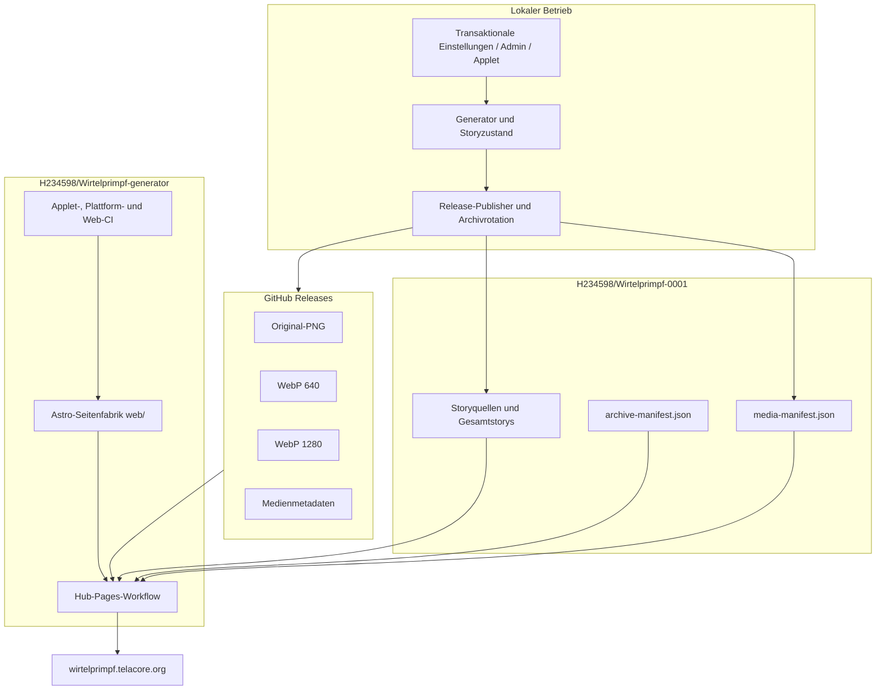
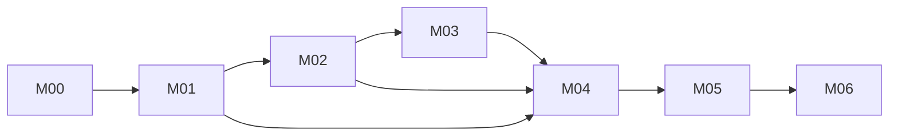
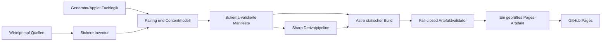
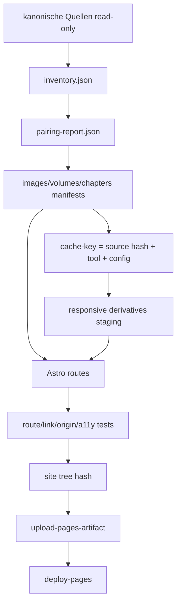

# Wirtelprimpf-Webseite – kanonischer Implementierungsplan

> [!IMPORTANT] Geltungsrang dieser Fassung
> Die Kapitel **0 bis 28** bilden den verbindlichen Steuerungsstand **v2.0.0 vom 2. August 2026**. Sie ersetzen widersprechende Repository-, Hosting-, Medien- und PR-Annahmen aus v1.0. Der vollständige historische Plan v1.0 bleibt ab **Anhang B** bytegetreu erhalten, damit keine Anforderung, Begründung, Testidee oder Dateispezifikation verloren geht. Bei Widerspruch gilt zuerst v2.0.0, danach die jüngeren freigegebenen Generator-/Rolloutpläne und erst danach der historische Anhang.

| Feld | Aktueller Wert |
|---|---|
| Dokument-ID | `WIRTEL-WEB-PLAN-001` |
| Version | `2.0.0` |
| Status | **in Arbeit** |
| Analysebeginn | 2. August 2026, 18:31 Uhr, `Europe/Berlin` |
| Kanonisches Generator-/Factory-Repository | `H234598/Wirtelprimpf-generator` |
| Aktives Archiv | `H234598/Wirtelprimpf-0001` |
| Legacy-Ausgangspunkt | `H234598/Katzenbilder` / später umbenannt beziehungsweise aufgeteilt |
| Zentrales Webprofil | Hub unter `wirtelprimpf.telacore.org` |
| Archivveröffentlichung | GitHub-Repository `H234598/Wirtelprimpf-0001`; keine eigene Archiv-Webseite |
| Historische Planfassung | SHA-256 `c072535f7e2997ffd3e4ee250bf16b333819ba26fad16fcffabb6213a9f24ab3` |

## 0. Normativer Scope, Leseregel und Planpflege

Dieser Plan steuert nicht mehr eine monolithische Webseite im früheren `Katzenbilder`-Repository. Die inzwischen realisierte Publikationsarchitektur trennt Verantwortlichkeiten:

1. **`H234598/Wirtelprimpf-generator`** ist die Autorität für Generator, Plattformlogik, Cinnamon-Applet, lokale Administration, Release-Publikation, Archivrotation und die gemeinsam genutzte Astro-Seitenfabrik.
2. **`H234598/Wirtelprimpf-0001`** ist das erste nummerierte Publikationsarchiv. Es enthält Storyquellen sowie Archiv- und Medienmanifeste; Bildbinärdateien liegen in unveränderlichen Releases. Das Repository wird vom Hub verlinkt und besitzt keine eigene öffentliche Webseite.
3. Künftige Archive wie `Wirtelprimpf-0002` werden erst an der festgelegten Grenze erzeugt, bleiben GitHub-Repositories und werden vom Hub verlinkt.
4. Die einzige öffentliche Webseite wird aus dem Generatorrepository als zentraler Hub gebaut. Numerische Archiv-Pages, numerische DNS-Namen und ein separater Archiv-Pages-Workflow gehören nicht mehr zum aktuellen Vertrag.

Der alte Materialisierungsansatz aus Archiv-PR #1 ist **abgelöst**. Er wird nicht repariert oder wiederbelebt. Seine fachlichen P00-Ziele bleiben gültig und werden in dieser Fassung gegen die neue Repositorytopologie neu zugeordnet.

### Statussemantik

- **umgesetzt:** Das zentrale fachliche Ergebnis ist im aktuellen Hauptzweig vorhanden und durch konkrete Repositoryevidenz gestützt.
- **teilweise umgesetzt:** Wesentliche Teile existieren, aber mindestens ein im Paket geforderter Vertrag, Test, Bericht oder UX-Zustand fehlt.
- **in Arbeit:** Aktive Steuerungs- oder Releasearbeit läuft; ein Abschlussgate ist noch offen.
- **offen:** Keine hinreichende aktuelle Implementierungs- oder Abnahmeevidenz.
- **abgelöst:** Nur für frühere Lösungswege beziehungsweise PRs; die zugrunde liegende Anforderung bleibt in einem neuen Paket erhalten.

Ein Status darf erst nach belegtem Merge beziehungsweise nachweisbarer Integration auf `main`, grünen blockierenden Checks, aufgelösten Reviewthreads, bestandenem Akzeptanztest und aktualisierter Evidenz auf **umgesetzt** wechseln.

## 1. Executive Summary – aktueller Zustand

Die grundlegende Zielarchitektur aus v1.0 wurde inzwischen weitgehend realisiert, allerdings in einer deutlich besseren Repositoryaufteilung als ursprünglich geplant:

- statische **Astro-7-Seitenfabrik** mit ausschließlich zentralem Hubprofil;
- TypeScript-Verträge und strikt validierte Katalog-/Manifestdaten;
- sichere Markdownverarbeitung mit `marked` und `sanitize-html`;
- responsive Bildderivate mit **Sharp/libvips**;
- Originale und Derivate als hashgebundene Releaseassets statt Bildbinärdateien im Git-Hauptbaum;
- Archiv 0001 für Storys 1–50 beziehungsweise Bücher 1–5;
- zehn vollständige Storys je Buch und fünf Bücher je Archiv;
- zentrale Hubseite mit Galerie, Bilddetails, Geschichtenbibliothek, Bandansicht, Feed, Sitemap, Projektstatus und No-JavaScript-Grundfunktion;
- fail-closed geprüfte Pages-Artefakte;
- additiv erhaltene Generator-, Applet-, Plattform- und Web-CI.

Der Plan steht daher nicht mehr am Anfang von P00. Der belastbare aktuelle Befund lautet:

- **15 von 48 Paketen umgesetzt**;
- **30 teilweise umgesetzt**;
- **3 in Arbeit**;
- **0 offen**.

Der wichtigste technische Meilenstein ist nun nicht ein erneuter P00-Transfer, sondern ein **kontrollierter Hub-/Archivabgleich**: Der Hub löst die aktuelle Revision des aktiven Archivrepositories für Story, Manifest und Status exakt auf. Die Archiv-Repositories bleiben dabei Inhaltsquellen und erhalten keine eigenen öffentlichen Pages. Numerische Webseiten und numerische DNS-Namen sind nach der Single-Hub-Planänderung ausdrücklich ausgeschlossen.

Die genannten UX- und Qualitätsverträge sind lokal implementiert und geprüft. Offen bleiben prozessuale Abschlussgates: Merge-/Reviewevidenz, GitHub-Actions-Lauf, externe Artefakt-/Hostingabnahme und die jeweils geforderten Baselines.

## 2. Was seit dem letzten Lauf passiert ist

### 2.1 Der alte P00-Transfer wurde beendet

Der frühere PR `H234598/Wirtelprimpf-0001#1` wurde geschlossen und nicht gemergt. Seine temporären Payload-/Materialisierungsworkflows sind damit kein aktiver Lösungsweg mehr. Das ist sachlich korrekt, weil die Architektur in der Zwischenzeit grundlegend umgebaut wurde: Medien liegen nicht mehr als Bilddateien im aktuellen Git-Baum und der ausführbare Code gehört nicht mehr in das Archivrepository.

### 2.2 Generator, Plattform und Webfactory wurden ausgegliedert

`H234598/Wirtelprimpf-generator` enthält heute:

- Generator und Storyzustand;
- Release-Publikation und Archivrotation;
- Plattform-CLI und lokale Administration;
- Cinnamon-Applet;
- transaktionale Settings-/Statuslogik;
- die gemeinsame Astro-Seitenfabrik unter `web/`;
- Hub-Pages-Workflow; der frühere Archiv-Pages-Workflow bleibt nur als
  historische Provenienz dokumentiert;
- Tests und Rolloutpläne.

Diese Trennung löst den im alten Plan erkannten Konflikt zwischen wachsendem Medienarchiv, ausführbarem Code und statischer Veröffentlichung sauberer als ein weiterer Ausbau des alten Monorepos.

### 2.3 Medien wurden releasebasiert migriert

Die Migration von Archiv 0001 etablierte pro Medienobjekt vier öffentliche Artefakte:

1. Original-PNG;
2. WebP-Derivat mit 640 Pixel Breite;
3. WebP-Derivat mit 1280 Pixel Breite;
4. Metadaten-JSON.

Die initiale Migration dokumentierte 779 Medienobjekte und fünf Releases. Archiv-PR #3 sah 780 Einträge, PR #4 entfernte bewusst die schnell veraltende feste Zahl aus dem README. Das aktuelle Manifest am Freeze enthält **790 Medienobjekte**. Die wechselnden Zahlen sind kein Widerspruch, sondern belegen fortlaufende Veröffentlichung; dauerhafte Dokumentation darf deshalb nur Manifestgleichheit und nicht eine statische Gesamtzahl versprechen.

### 2.4 Bücher- und Archivvertrag wurde umgesetzt

Der globale Vertrag lautet jetzt:

- Storys 1–50 in Archiv 0001;
- Bücher 1–5 in Archiv 0001;
- zehn vollständige Storys je Buch;
- fünf Bücher beziehungsweise 50 Storys je Archiv;
- Archiv 0002 erst bei Erreichen der nächsten Grenze.

Stabile Story-URLs werden nicht für die Buchgruppierung umbenannt.

### 2.5 Applet- und Storylogik wurden erweitert

Im Generatorrepository wurden unter anderem integriert:

- kanonische Storyteilnummerierung mit `Part?` bei echter Ambiguität;
- Legacy-URL-Migration vom alten Repositorynamen;
- Storyvorgaben für laufende und zwei folgende Storys;
- read-only Historie vergangener Vorgaben;
- zehn-Story-Buchmodell in Plattform, Web und Applet;
- transaktionale Einstellungen, Live-Synchronisierung, Timeranwendung und redigierter lokaler Betriebsstatus.

### 2.6 Öffentliche Seitentexte und Factory-Code nach dem Single-Hub-Rollout

Der Hub löst bei geplanten Läufen die aktuelle `main`-Revision des aktiven
Archivrepositories für Story, Manifest und Status exakt auf. Die frühere
Factory-Drift zwischen Archiv-Pages-Pin und Generator-Hauptzweig ist damit als
historische Baseline dokumentiert; sie steuert keine eigene Archiv-Webseite
mehr. Im aktuellen Hubvertrag liegen unter anderem Änderungen an:

- `web/src/components/MediaCard.astro`;
- `web/src/layouts/BaseLayout.astro`;
- `web/src/pages/index.astro`;
- `web/src/pages/projekt/status.astro`;
- `web/tests/copy-contract.test.ts`;
- Rollout- und Statusverträgen.

Der Produktionsabgleich prüft deshalb den exakten Archiv-SHA, Manifest-
Freshness und den einmaligen Hub-Treehash. Ein numerischer Archiv-Pages-
Repin gehört nicht mehr zum aktuellen Vertrag.

### 2.7 Reviewevidenz enthält eine formale Inkonsistenz

Der aktuelle Generator-Hauptzweig endet in `274b25…` mit der Commitbotschaft `Merge pull request #4 …`. Die PR-Schnittstelle meldet PR #4 jedoch als geschlossen und **nicht** gemergt. Der Code ist damit auf `main` vorhanden, aber die formale PR-Mergeevidenz ist inkonsistent. Diese Fassung erfindet keinen Merge: Der Integrationscommit wird als Hauptzweig-Evidenz geführt; der PR-Status bleibt separat als Inkonsistenz dokumentiert. Vor dem nächsten Release-PR muss die Evidenzkette wieder eindeutig sein.

## 3. Verifizierte Revisionsbaseline vom 2. August 2026

| Repository | Rolle | Default-Branch | Freeze-HEAD | Commitzeit | Drift gegenüber v1 | Konsequenz |
|---|---|---|---|---|---|---|
| `H234598/Wirtelprimpf-generator` | Generator, Plattform, Applet, Admin, Seitenfabrik, Hub | `main` | `274b25c9e1f9ea97d3b060997ed5c425d2b30e9f` | 2026-08-02 13:00:40 `Europe/Berlin` | neues kanonisches Repository | primäre Implementierungs- und Planautorität |
| `H234598/Wirtelprimpf-0001` | Story-/Medienmanifest, Archivvertrag, dünner Pages-Aufrufer | `main` | `79274c1fef77306eb9ee0e9bd2682f4b28b74849` | 2026-08-02 00:58:57 `Europe/Berlin` | aus altem Zielrepo hervorgegangen | aktuelles Publikationsarchiv |
| `H234598/desinfect` | Governance-/Storage-/Statusreferenz | `main` | `3bed7ac358b861490727adce36a418db133f8daf` | 2026-07-31 23:24:24 `Europe/Berlin` | deutlich weiter als v1-Pin | vor jeder neuen Übernahme Provenienz-Diff erforderlich |
| `H234598/ADHS-Lernpfad` | Browser-/Recovery-/Reviewreferenz | `main` | `ee91741ec71a1232a4c3b90f42b805591a0d9359` | 2026-08-01 06:10:04 `Europe/Berlin` | deutlich weiter als v1-Pin | neue Übernahme neu prüfen; alte Pins bleiben historische Provenienz |
| `H234598/Cheatsheets` | Pages-/Artefakt-/IO-Referenz | `main` | `71bcad7a8ab183144e8ff007b85aea8bb6cff3b9` | 2026-07-28 16:11:05 `Europe/Berlin` | gegenüber v1 unverändert | bestehende Pins weiterhin reproduzierbar |

### 3.1 Aktiver Factory-Pin des Archivs

`H234598/Wirtelprimpf-0001:.github/workflows/pages.yml` verwendet weiterhin:

```text
H234598/Wirtelprimpf-generator/.github/workflows/archive-pages.yml
@b00d824adee47341e3251bc18e09239fde1c5939
```

Der aktuelle Generator-Freeze `274b25…` liegt **52 Commits** davor. Das Archiv ist dadurch reproduzierbar, aber nicht auf dem aktuellen Factorystand. Dieses Verhalten ist sicherer als ein beweglicher `@main`-Verweis, erzeugt aber einen bewusst zu bearbeitenden Rollout-Rückstand.

### 3.2 Aktiver Medienstand

| Feld | Wert am Freeze |
|---|---|
| Manifest | `H234598/Wirtelprimpf-0001@79274…:media-manifest.json` |
| Schema | `2.0.0` |
| Medienobjekte | `790` |
| Aktives Archiv | `1` |
| Storybereich | `1–50` |
| Buchbereich | `1–5` |
| Medienablage | öffentliche, unveränderliche Releases |
| Bildbinärdateien im aktuellen Git-Baum | `0` laut Migrations-/Archivvertrag |
| Derivate je Medienobjekt | Original, WebP 640, WebP 1280, Metadaten-JSON |

### 3.3 Nicht über die Repositorydateien vollständig verifizierte Einstellungen

Weiterhin **manuell zu verifizieren**:

- tatsächliche GitHub-Pages-Quellkonfiguration in den Repositoryeinstellungen;
- Environment-Schutz von `github-pages`;
- Rulesets, Required Checks und Branch Protection;
- organisationsweite CodeRabbit-Konfiguration;
- Custom-Domain-Verifikation;
- DNS-Zoneninhalt und Aliasweiterleitungen;
- HTTPS-Erzwingung;
- Secrets und Actions-Policy;
- live ausgelieferter Inhalt beider Domains.

Die vorhandenen Workflowdateien und READMEs belegen den Sollvertrag, nicht automatisch jede externe Einstellung oder den aktuellen Browserzustand.

## 4. Supersession- und Driftregister

| Frühere Annahme/Lösung                                            | Aktueller Befund                                                                      | Status                | Folge                                                                  |
| ----------------------------------------------------------------- | ------------------------------------------------------------------------------------- | --------------------- | ---------------------------------------------------------------------- |
| Eine Webseite wird vollständig in `H234598/Katzenbilder` gebaut.  | Code/Factory liegen in `Wirtelprimpf-generator`, Archivdaten in `Wirtelprimpf-0001`.  | **abgelöst**          | alle Dateipfade und PR-Ziele werden repositoryspezifisch geführt       |
| P00-PR #1 materialisiert Plan/Scanner per Payloadworkflow.        | PR geschlossen, ungemergt; Medienarchitektur inzwischen ersetzt.                      | **abgelöst**          | Workflow nicht reparieren; P00-Ziele in M00/M04 neu erfüllen           |
| Bilder bleiben als kanonische Git-Dateien im Webseitenrepository. | Aktueller Git-Baum enthält keine Bildbinärdateien; Releases sind Medienquelle.        | **ersetzt**           | Inventur und Pairing lesen Manifest-/Releaseverträge                   |
| `working/` und Symlinkauflösung sind zentrale Webbuildrisiken.    | Release-/Manifestmodell reduziert diese Risiken für die öffentliche Site.             | **teilweise ersetzt** | Quellgenerator bleibt zu prüfen; Pages-Artefakt bleibt sonderdateifrei |
| Veröffentlichung wartet ungefähr 100 Bildcommits.                 | Archiv erhält fortlaufende Release-/Manifestcommits in ungefähr zweistündiger Kadenz. | **ersetzt**           | Freshness-SLA am Manifest-/Pages-Lauf messen                           |
| Project Pages unter `/Katzenbilder/` ist Standard.                | Hub und Archiv besitzen vorgesehene Custom Domains.                                   | **ersetzt**           | Project-Page-Test bleibt nur Fallbackvertrag                           |
| Eine globale Mediengesamtzahl gehört ins README.                  | Zahl wächst laufend und wurde bewusst entfernt.                                       | **verworfen**         | ausschließlich Manifestgleichheit und dynamische Anzeige               |
| Archivworkflow darf auf `@main` zeigen.                           | Archiv pinnt bewusst einen unveränderlichen Factory-SHA.                              | **bestätigt**         | Repin nur reviewt, getestet und mit Rollback                           |
| Build und Deploy müssen zwingend sofort getrennte Jobs sein.      | Aktueller Workflow baut, validiert, lädt und deployt in einem Job.                    | **offene Härtung**    | M01 entscheidet/implementiert Trennung ohne zweiten Build              |

## 5. Aktuelle Systemarchitektur



### 5.1 Publikationsdatenfluss

```mermaid
flowchart LR
    RUN[Erfolgreicher Generatorlauf]
    VALIDATE[Original validieren und hashen]
    DERIVE[Sharp: WebP 640/1280]
    RELEASE[Unveränderliche Releaseassets veröffentlichen]
    REFRESH[Assets öffentlich erneut laden und SHA-256 prüfen]
    MANIFEST[media-manifest.json atomar fortschreiben]
    COMMIT[Story-/Manifestcommit ins aktive Archiv]
    RESOLVE[Hub löst exakten Archiv-SHA auf]
    BUILD[Ein zentraler statischer Hub-Build]
    GATE[Fail-closed Artefaktvalidator]
    DEPLOY[GitHub Pages]

    RUN --> VALIDATE --> DERIVE --> RELEASE --> REFRESH --> MANIFEST --> COMMIT --> RESOLVE --> BUILD --> GATE --> DEPLOY
```



### 5.2 Verantwortungsgrenzen

- **Generatorrepository:** sämtliche ausführbare Logik, Schemas, Tests, Workflows und der kanonische Webseitenplan.
- **Archivrepository:** publizierbare Storyquellen, Manifeste und README-/Migrationsevidenz; keine eigene Pages-Ausführung.
- **Releases:** binäre Originale und Webderivate; keine Ausführung.
- **Pages-Artefakt:** ausschließlich reguläre, geprüfte statische Dateien; keine Symlinks, Hardlinks oder Sonderdateien.
- **Browser:** keine GitHub-API, keine Telemetrie, keine Konten; nur statische same-origin Daten und explizite Release-Downloads.

## 6. Aktuell vorhandene Webseitenfunktionen

### 6.1 Belegt vorhanden

- zentraler Hub mit eigenständigem Branding und direkten Repositorylinks;
- Startseite mit zwei primären Einstiegen;
- aktueller Storykontext und neue Medien;
- Archivkatalog und Buchgruppierung ohne eigene Archiv-Webseite;
- Galerie mit 24 Einträgen je Seite;
- Filter für alle, Story, Atelier/klassisch, historisch und Favoriten;
- Seitengrößenwahl von 10, 20, 50, 100, 200, 500 und Alle;
- kanonische Bilddetailseiten;
- Originaldownload;
- Geschichtenbibliothek und Bandansicht;
- statische Markdownrendering-/Sanitizing-Pipeline;
- Feed, Sitemap, robots- und Canonical-Verträge;
- Projektstatusroute;
- No-JavaScript-Grundfunktion durch vollständig statische Seiten;
- Meta-CSP, lokale Assets, Skip-Link und Themezustand;
- fail-closed Artefaktvalidierung;
- read-only PR-CI mit festen Runnern und gepinnten Actions.

### 6.2 Noch nicht hinreichend belegt oder offen

- manuelle Screenreader-, Browserzoom- und visuelle Betreiberabnahme auf dem
  aktuellen Live-Stand;
- echte 90-Tage-Wachstumshistorie statt Kurzzeitprojektion;
- vollständige externe Rechte-/Assetstichprobe und formale Review-/Merge-
  Abnahme für die verbleibenden historischen Pakete;
- produktiver Rollback eines älteren Hub-Stands mit separater Freigabe und
  anschließender Rückabnahme; der exakt gepinnte Redeploy des aktuellen
  bekannten-Gut-Stands ist separat nachgewiesen.

## 7. Abgleich mit den ursprünglichen Qualitätszielen

| Qualitätsziel aus v1 | Aktueller Erfüllungsgrad | Begründung | Nächster Nachweis |
|---|---|---|---|
| Warme, ruhige Wohlfühl-UX | **teilweise** | eigenständige Astrooberfläche existiert; vollständige visuelle Stichprobe und Browserabnahme fehlen | M03 visuelle/A11y-Abnahme |
| Sehr einfache Orientierung | **weitgehend** | Hauptwege Bilder/Geschichten sowie Hub/Archive existieren | M02/M03 Journeys und Zurücknavigation |
| Kleine Mobilgeräte bis Desktop | **teilweise** | responsive CSS vorhanden; 320-Pixel- und Touchtests fehlen | M03 Playwright-Matrix |
| Barrierefreiheit / Progressive Enhancement | **teilweise** | statische Basis, Skip-Link, Sanitizing; Dialog-/axe-/Screenreader-Gates fehlen | M03 |
| Großes wachsendes Medienarchiv | **weitgehend** | Releases, Derivate, Pagination und Null-Binär-Gitbaum | M04 Messbudgets und Wachstumsbericht |
| Automatische Inhaltsübernahme | **weitgehend** | Release-/Manifest-/Archivcommit-Pipeline arbeitet fortlaufend | M01/M05 Freshness-/Pages-E2E |
| Reproduzierbarer sicherer Build | **weitgehend** | Lockfile, feste Versionen, Factory-SHA, Artefaktvalidator | M01 Repin und M04 Treehash-/Budgetbericht |
| Wartbarkeit / Planpflege | **teilweise** | neue Pläne existieren, alter kanonischer Plan aber nicht sauber rebaselined | M00 |

## 8. Statusregister aller 48 ursprünglichen Arbeitspakete

| Paket | Titel | Status 2026-08-02 | Aktuelle Evidenz | Noch erforderlich | Zielmeilenstein |
|---|---|---|---|---|---|
| `WEB-P00-01` | Revisionsbaseline und Drift-Governance | **in Arbeit** | Diese v2-Baseline friert Generator, Archiv und Referenzen neu ein. | Plan und Revisionsregister in das Generator-Repository übernehmen und per Validator absichern. | `M00` |
| `WEB-P00-02` | Sichere read-only Medieninventur | **teilweise umgesetzt** | Read-only Manifestinventur, versioniertes Schema, atomare `build/reports`-Ausgabe und sechs Sicherheits-/Duplikatfixtures sind grün. Der vollständige Migration-Checkout meldet 779 Manifestmedien, 2.345 deklarierte Release-Assets sowie 2.346 reguläre Dateien/2.337 Bilder im gemischten Sourcebaum (779 PNG-Originale und 1.558 WebP-Derivate); Symlink-, LFS-, Case-, Hardlink- und Fehlerlisten sind leer. | Echte Produktionsbaseline und Wachstumshistorie sowie Merge, Review, CI und Hostingabnahme. | `M04` |
| `WEB-P00-03` | Kanonischer Plan, Anforderungen und ADR-Entwürfe | **in Arbeit** | Mehrere freigegebene Superpowers-Pläne und diese vollständige v2-Fassung existieren. | Kanonische v2-Datei, Requirement-Register, ADR-Register und Supersession-Register im Generator-Repo pflegen. | `M00` |
| `WEB-P00-04` | Bestehenden Check additiv erweitern | **umgesetzt** | Der aktuelle Check erhält Applet-, Generator-, Plattform- und Webprüfungen additiv. | Nur laufende Pin-/Policywartung; keine fachliche Lücke. | `Pflege` |
| `WEB-P01-01` | Versionierte Bild-, Band- und Kapitelschemas | **teilweise umgesetzt** | Drei strikt geschlossene Draft-2020-12-Schemas akzeptieren aktuelle Manifest-/Storyfixtures; vier Contract-Tests bestehen. | Schema-Validator im CI, Merge/Review und vollständige Quellenstichprobe. | `M02/M04` |
| `WEB-P01-02` | Pairing-Engine und Zeitstempelpriorität | **teilweise umgesetzt** | Read-only Pairingreport prüft Heading > Dateiname > Gitzeit > Fallback, Working-/Full-Story-Trennung, Orphans und Ambiguitäten; vier Fixtures bestehen. | Ausreichenden kanonischen Mediencheckout paaren und danach Merge/Review/CI abnehmen. | `M02` |
| `WEB-P01-03` | Fehlerkatalog, Fixtures und Ausnahme-Registry | **teilweise umgesetzt** | Fehlerkatalog, Schwereklassen, Negativfixtures und leere hashgebundene Ausnahme-Registry sind vorhanden; zwei Registry-Tests bestehen. | Reale Ausnahmen nur mit Quellen-SHA eintragen; Merge/Review/CI und vollständige Fehler-Matrix. | `M04` |
| `WEB-P01-04` | Stabile IDs und Aliasregister | **teilweise umgesetzt** | Typisierte portable Image-/Band-/Chapter-IDs, reproduzierbare Chapter-ID und Zyklus-/Kettenvalidierung bestehen in vier Tests; Register bleibt leer. | Reale Umbenennungen fachlich belegen, Aliasmigration browserseitig prüfen sowie Merge/Review/CI. | `M02/M03` |
| `WEB-P02-01` | Astro-7-Grundgerüst mit statischem Output | **umgesetzt** | Astro 7.1.6, TypeScript 6.0.3 und statische Hub-/Archivprofile sind implementiert. | Nur Versionspflege über getrennte PRs. | `Pflege` |
| `WEB-P02-02` | Sicheres Staging und reproduzierbarer Gesamtbuild | **teilweise umgesetzt** | Reproduzierbare Builds und Artefaktvalidator existieren. | Build-/Deployjob trennen, Staging-/Treehashvertrag zentralisieren und Arbeitskopieunverändertheit explizit prüfen. | `M01/M04` |
| `WEB-P02-03` | Sichere Markdown-Pipeline | **umgesetzt** | Marked und sanitize-html sind gepinnt; Sanitizing besitzt Contract-Tests. | Nur zusätzliche Sicherheitsfixtures bei neuen Markdownfeatures. | `Pflege` |
| `WEB-P02-04` | Base-Path- und URL-Vertrag | **umgesetzt** | Hub- und Archivprofile besitzen eigene Site-URLs, Canonicals und Custom-Domain-Verträge. | Project-Page-Base-Path zusätzlich automatisiert testen, falls weiterhin unterstützt. | `M03` |
| `WEB-P03-01` | Responsive Derivatpipeline mit Sharp | **umgesetzt** | Sharp 0.35.3 erzeugt Originalverweise sowie 640/1280-WebP-Derivate. | Nur neue Größen nach Layoutmessung einführen. | `M04` |
| `WEB-P03-02` | Derivatcache und Manifest | **teilweise umgesetzt** | Releaseassets und media-manifest.json binden Derivate hashgestützt; `MediaDerivativeCache` nutzt Quellhash, Pillow-Version, Transformationsversion, Format und Zielbreite, schreibt komplette Einträge atomar und liefert Trefferstatistik. Der vollständige lokale Abgleich findet `779` Originale und `1.558` Derivate; der Kaltlauf mit Pillow `12.2.0` erzeugt `1.558/1.558` Manifestgleiche Einträge in `1.151,148 s`, danach erreichen zwei read-only Pässe jeweils `100%` Hits. | Endgültige Workflow-/Merge-/Review-/CI-Abnahme ergänzen; untrusted Läufe bleiben read-only. | `M04` |
| `WEB-P03-03` | Medienparser-Sicherheitsgrenzen und Metadatenbereinigung | **teilweise umgesetzt** | Inventur und Release-Tests prüfen `25 MiB`/`50 MP`, LFS, Symlinks, Case-Kollisionen, Dekompressions-/Trunkierungsfehler und Formatbindung; der vollständige Source-Scan des Migration-Checkouts meldet keine Symlinks, LFS-Pointer, Case-/Hardlink-Kollisionen oder Fehler; die Derivatmaterialisierung wendet EXIF-Orientierung an und exportiert RGB-WebP ohne EXIF/GPS/ICC. `python3 -m unittest tests.platform.test_media_release`: `15/15`. | Rechte-/Policy-Stichprobe, Merge, Review, CI und externe Abnahme. | `M04` |
| `WEB-P03-04` | Hostingmessung und Schwellenbericht | **teilweise umgesetzt** | Release-only-Migration und Null-Binärbilder im Git-Baum lösen das Hauptgrößenproblem. Der reproduzierbare Medien-/Hostinglauf ist grün: Median `7,528 s`, P95 `9,351 s`, `1.036` Dateien, `1.013` HTML, `21.910.811` Artefaktbytes, `59.820` interne Links, ohne Budgetfehler; die Wachstumshistorie bleibt `insufficient_history`. Eine synthetische 10-Bilder-Neue-Story-Fixture erreicht gegen den Archivcache `98,7326 %` kombinierte Hits bei `0` Invalids. | Plattform-/Rechtebaseline, Wachstum, echte vergleichbare Produktionsbaselines und externe Hosting-/Pages-Abnahme ergänzen. | `M04` |
| `WEB-P04-01` | Startseite mit aktuellen Inhalten | **umgesetzt** | Startseite mit Hauptaktionen, aktuellem Storykontext, Archiven und neuen Medien existiert. | Nur UX-Feinschliff aus Browserabnahme. | `M03` |
| `WEB-P04-02` | Galerieindex, Shards und statische Seiten | **umgesetzt** | Statische Galerie, Detailrouten und 24er-Paginierung existieren. | Shard-/JSON-Größen messen; keine unbegrenzte globale Datei zulassen. | `M04` |
| `WEB-P04-03` | Progressive Filter und Mehr-anzeigen | **umgesetzt** | Progressive Typfilter und statische Pagination sind implementiert. | Unknown-Zustand und URL-persistente Filter in Browsertests beweisen. | `M02/M03` |
| `WEB-P04-04` | Galerieposition und Rückkehrzustand | **teilweise umgesetzt** | URL, Filter, Seite, Fokus und Scrollposition sind lokal implementiert und browserseitig geprüft. | Merge, Review, CI und externe Artefaktabnahme. | `M02` |
| `WEB-P05-01` | Kanonische Bilddetailseiten | **umgesetzt** | Kanonische Bilddetailroute und Originaldownload existieren. | Alttexte und Storybezug fachlich verbessern. | `M02/M03` |
| `WEB-P05-02` | Lightbox als progressive Dialogerweiterung | **teilweise umgesetzt** | Progressiver Dialog, Fokuszyklus, Escape, Touch und No-JS-Link sind lokal implementiert und geprüft. | Merge, Review, CI und externe Artefaktabnahme. | `M02/M03` |
| `WEB-P05-03` | Mediennavigation, Vollbild und Download | **teilweise umgesetzt** | Originaldownload, native Capability-Gates für Vollbild/Share, Touch-/Lightbox-Navigation und kanonische Detailseiten-Vorher-/Nächster-Links sind lokal implementiert; `18/18` Browser- und fokussierte Download-/Navigationsprüfungen bestehen. | Merge, Review, blockierende CI sowie externe Artefakt-/Liveabnahme und Driftprüfung ausführen. | `M02` |
| `WEB-P06-01` | Geschichtenbibliothek und Bandkarten | **umgesetzt** | Bibliothek gruppiert 10 Storys je Buch und fünf Bücher je Archiv. | Nur Browser-/A11y-Abnahme und visuelle Feinarbeit. | `M03` |
| `WEB-P06-02` | Kapitelroute und Leseansicht | **teilweise umgesetzt** | Eigenständige Kapitelroute, stabile IDs, TOC, Vor-/Zurück-Navigation, Deep Links und No-JS-Zugang sind lokal implementiert und browserseitig geprüft. | Merge, Review, CI, visuelle Stichprobe und externe Artefaktabnahme. | `M02` |
| `WEB-P06-03` | Vollbandansicht und EPUB-Vertrag | **teilweise umgesetzt** | Vollbandansicht und fail-closed EPUB-Manifest-/ZIP-/Hash-/Releaseprüfung sind lokal implementiert und unitseitig geprüft; aktuell gibt es 0 aktive EPUB-Links. | Browserabnahme, Merge, Review, CI und externer EPUB-/Artefaktnachweis. | `M02` |
| `WEB-P06-04` | Bild-Kapitel-Beziehungsprüfung | **teilweise umgesetzt** | Stabile Bild↔Kapitel-Auflösung, bidirektionale UI-Helfer und ein separater fail-closed Validator mit Positiv-/Negativfixtures sind vorhanden. Der aktuelle Multi-Story-Live-Report weist 461 Relationen, 457 aktuelle Auflösungen, 1 Sidecar-Fallback, 4 explizit historische Orphans und 0 Fehler aus. | Die vier historischen Medienpfade bleiben fachlich isoliert; danach strikten Live-Report, Merge, Review, CI und externe Artefaktabnahme nachweisen. | `M02` |
| `WEB-P07-01` | Versioniertes lokales Zustandsmodell | **teilweise umgesetzt** | Versioniertes lokales Schema, Aliasmigration, Größenlimit, fehlertolerante Storage-Zugriffe und explizites Löschen sind durch Node-/Browserverträge geprüft; Storage bleibt rein lokal. | Merge, Review, blockierende CI und externe Artefaktabnahme. | `M03` |
| `WEB-P07-02` | Lesefortschritt und optionale Favoriten | **teilweise umgesetzt** | Versionierter, begrenzter lokaler Fortschritt/Favoritenzustand sowie Löschen und Storage-Ausfall sind lokal geprüft. | Merge, Review, CI und externe Artefaktabnahme. | `M03` |
| `WEB-P07-03` | No-JS- und Fehlerdegradation | **teilweise umgesetzt** | No-JS-Direktlinks, LocalStorage-Ausfall, leere Filter, defekte Medien und ruhige Fehlerzustände bestehen in der lokalen Browsermatrix. | Merge, Review, CI und externe Artefaktabnahme. | `M03` |
| `WEB-P07-04` | Suchgrundlage und bewusster MVP-Verzicht | **teilweise umgesetzt** | Suche ist bewusst noch nicht Kernbestandteil; `ADR-WEB-011` bestätigt den Verzicht. | Erst bei belastbarer Datenbasis Pagefind/MiniSearch vergleichen und mit Indexbudget entscheiden. | `M06` |
| `WEB-P08-01` | Designsystem, Tokens und lokale Assets | **teilweise umgesetzt** | Eigenständige Styles, dokumentierte Farbrollen/Kontrastmatrix, lokale Systemschriften und ein visueller Stichprobenlauf existieren. | Assetlizenz- und vollständige Medien-/Designfreeze-Abnahme sowie Lese-/Sepiamodus belegen. | `M03` |
| `WEB-P08-02` | Responsive Komponentenfeinarbeit | **teilweise umgesetzt** | Responsive Templates, stabile Layouttracks, 320-/Tablet-/Desktop-/große-Display-Gates und 15 visuelle Screenshot-Stichproben sind lokal grün; der CatGPT-Launcher verdeckt keinen Seiteninhalt. | Manuelle Zoomabnahme, Merge, Review, CI und externe Artefaktabnahme nachführen. | `M03` |
| `WEB-P08-03` | Accessibility- und Reduced-Motion-Gate | **teilweise umgesetzt** | Playwright-Corematrix, No-JS-Degradation, Reduced-Motion-Test, Focus-/Touch-Lightboxtests, Visual Contract und axe-Serious/Critical-Gate bestehen lokal. | Manuelle Screenreader-/Zoomabnahme sowie Merge-/Review-/CI-Nachweis abschließen. | `M03` |
| `WEB-P08-04` | Fehler-, Leer- und Ladezustände | **teilweise umgesetzt** | 404, leere Filter, Medienfehler, unknown, leere Kapitel, fehlende Downloads und Statuszustände sind lokal implementiert und durch Browser-/Unit-Gates geprüft. | Merge, Review, CI und externe Artefaktabnahme. | `M02/M03` |
| `WEB-P09-01` | Bestehende Checks äquivalent migrieren | **umgesetzt** | Aktuelle CI erhält Applet-, Generator-, Plattform- und Webchecks mit festen Runnern und Action-SHAs. | Nur Äquivalenzregister und Pinpflege nachführen. | `Pflege` |
| `WEB-P09-02` | Schreibgeschützte Pull-Request-CI | **teilweise umgesetzt** | PR-Checks sind read-only, ohne Deployment und mit Sparse Checkout; Browser-/Performance-, axe-, Budget-, Origin-, Arbeitskopie- und `always()`-Diagnoseartefakt-Gates sind verdrahtet. | Externen CI-Lauf, Merge-/Reviewstatus und aktuelle Factory-/Artefaktevidenz nachweisen. | `M03/M04` |
| `WEB-P09-03` | Pages-Build und Deployment aus einem Artefakt | **teilweise umgesetzt** | `hub-pages.yml` und `archive-pages.yml` trennen Build-/Deployjobs, validieren Baumhash und Budgets vor Upload und deployen exakt das einmalige Pages-Artefakt ohne zweiten Build. | Externen Pages-Lauf und aktuelle Factory-/Live-Domain-Abnahme nachführen. | `M01` |
| `WEB-P09-04` | Fail-closed Pages-Artefaktvalidator | **umgesetzt** | `scripts/validate_pages_artifact.py` und Budgetvalidator werden in Hub-/Archivworkflow sowie Fixturetests verwendet; alle fünf Artefaktfixtures bestehen. | Validator nur bei neuen Dateitypen/Budgets erweitern. | `Pflege` |
| `WEB-P10-01` | Freshnessmanifest und knapper öffentlicher Status | **teilweise umgesetzt** | Versioniertes Statusschema und atomare Erzeugung trennen Quellrevision, neueste Medien-/Kapitel-IDs, Build und Freshness; redigierter Status bleibt fail-closed. Read-only-Recheck am 05.08.2026 08:17:57Z meldet Hub `798` Bilder/`1` Story und Archiv `798` Bilder/`2` Storys gegenüber `779` Medien/`195` Kapiteln lokal; die früheren `797`/`1` und `796`/`268` bleiben historische Liveevidenz. | Generator-/Pages-E2E, Publish-Lock/Dispatch und externe Artefaktabnahme ergänzen. | `M05` |
| `WEB-P10-02` | Projekt-/Wartungsbereich und Provenienz | **teilweise umgesetzt** | Projekt-, Status-, Provenienz- und Betriebsdokumentation sowie Browser-Gates für Hauptnavigation und redigierte Ausgabe sind lokal vorhanden. | Lizenz/Provenienz, externer Artefaktnachweis sowie Merge-/Reviewstatus vervollständigen. | `M05` |
| `WEB-P10-03` | Recovery-, Rollback- und Redeploy-Runbook | **teilweise umgesetzt** | Rollout-, Backup-, Freshness- und Recovery-Dokumentation sowie fail-closed Status-/Artefaktverträge sind vorhanden; `tests.test_recovery_contract` ist grün. | Tatsächliches Website-Redeploy, letzte gute Revision, Cache-/Derivatrebuild und Medienisolation als Runbook ausführen. | `M05` |
| `WEB-P10-04` | Sicherer Generator-Publish- und Pages-Trigger | **teilweise umgesetzt** | Generator veröffentlicht `releaseassets`-/Manifestcommits; `PublishState`, `HubDispatchOutbox`, Lock/Idempotenz und Laufzeit-Recovery sind mit `tests.platform.test_hub`/`test_runtime` geprüft. | Aktuellen Factory-Pin, Parallelität/Freshness und Archivwechsel-E2E nachweisen. | `M01/M05` |
| `WEB-P11-01` | Performance-, Größen- und Buildbudgets | **teilweise umgesetzt** | Deterministische Artefaktbudgets, SEO-/Performancebrowsergate und dreifacher read-only Medien-/Hostinglauf sind lokal grün; Home 1.908.894 B, Galerie 34.649 B, keine fremden Runtime-Requests, vollständiger Fixturebaum 21.910.811 B. | Merge-/CI- und Hostingnachweis sowie erneute Baseline bei Wachstum. | `M04` |
| `WEB-P11-02` | Hosting- und Großrepository-Freeze | **umgesetzt** | Originale/Derivate liegen in Releases; aktueller Git-Baum enthält keine Bildbinärdateien und Hosting-/ADR-Projektionen sind dokumentiert. | Schwellen regelmäßig mit Wachstum und Releaseanzahl neu prüfen. | `Pflege` |
| `WEB-P11-03` | SEO, Sitemap, Feed und Social-Metadaten | **umgesetzt** | Canonical, Open Graph, Feed, Sitemap und robots-Verträge sind implementiert; `Seo.astro` und origin-gebundener Browser-/URL-Gate sind vorhanden. | Laufende Social-Preview-/URL- und Größenabnahme. | `M03/M04` |
| `WEB-P11-04` | Custom Domain und Releaseabnahme | **in Arbeit** | Custom Domains und Pages-Verträge existieren; read-only-Recheck am 05.08.2026 08:17:57Z zeigt für Hub/Archiv HTTP/2 `200` ohne Redirect und mit HSTS, robots/Sitemap/Feed jeweils `200`; die getesteten nummerischen Negativhosts liefern keine A-/AAAA-Antwort. Live stehen Hub/Archiv bei `798` Medien gegenüber lokal `779`/`195`; Factory-Drift und autoritative Cloudflare-REST-Baseline sind nicht vollständig nachgewiesen. | Hub und Archiv auf geprüften Stand deployen, DNS/HTTPS/live Content manuell und automatisiert verifizieren sowie REST-Leseberechtigung klären. | `M01` |
| `WEB-P12-01` | Optionen priorisieren und isolieren | **umgesetzt** | Optionenregister, bewusster MVP-Verzicht und isolierte Tests sind vorhanden; die aktuelle CatGPT-S-/CatGPT-L-Aufteilung besitzt eigene Launcher-, Modus-, Fallback- und Browserverträge. | Laufende fachliche Neubewertung bei belastbarer Datenbasis. | `M06` |

### 8.1 Zusammenfassung

| Status | Anzahl |
|---|---:|
| umgesetzt | 15 |
| teilweise umgesetzt | 30 |
| in Arbeit | 3 |
| offen | 0 |
| **Gesamt** | **48** |

| Phase | umgesetzt | teilweise umgesetzt | in Arbeit | offen | Summe |
|---|---:|---:|---:|---:|---:|
| `P00` | 1 | 1 | 2 | 0 | 4 |
| `P01` | 0 | 4 | 0 | 0 | 4 |
| `P02` | 3 | 1 | 0 | 0 | 4 |
| `P03` | 1 | 3 | 0 | 0 | 4 |
| `P04` | 3 | 1 | 0 | 0 | 4 |
| `P05` | 1 | 2 | 0 | 0 | 3 |
| `P06` | 1 | 3 | 0 | 0 | 4 |
| `P07` | 0 | 4 | 0 | 0 | 4 |
| `P08` | 0 | 4 | 0 | 0 | 4 |
| `P09` | 2 | 2 | 0 | 0 | 4 |
| `P10` | 0 | 4 | 0 | 0 | 4 |
| `P11` | 2 | 1 | 1 | 0 | 4 |
| `P12` | 1 | 0 | 0 | 0 | 1 |

> [!NOTE] Konservative Bewertung
> `teilweise umgesetzt` bedeutet nicht, dass die vorhandene Software unbrauchbar wäre. Es bedeutet, dass der umfassendere DoD des ursprünglichen Plans — häufig einschließlich Browserabnahme, Fehlerfixtures, Bericht, Migration und Rollback — noch nicht vollständig belegt ist.

## 9. Rebaselined Meilensteinplan

Die frühere lineare P00–P12-Reihenfolge bleibt als Anforderungsstruktur erhalten. Für die tatsächliche Fortsetzung wird sie in sieben überprüfbare Meilensteine gebündelt.

| Meilenstein | Ziel | Enthaltene Schwerpunktpakete | Exit-Gate |
|---|---|---|---|
| `M00` | Plan, Baseline und Supersession kanonisch machen | P00-01, P00-03, Evidenzmodell | v2 im Generatorrepo, Validator grün, 48 Pakete/60 Anforderungen tracebar |
| `M01` | aktuellen Factorystand kontrolliert veröffentlichen | P02-02, P09-03, P10-04, P11-04 | Hub und Archiv aus geprüftem SHA live, Freshness und Treehash belegt |
| `M02` | Galerie-, Detail- und Lesewege vollständig machen | P04-04, P05, P06, P08-04 | alle Kernjourneys inkl. Deep Links und Rückkehr funktionieren |
| `M03` | lokale Komfortfunktionen und Accessibility blockierend machen | P07, P08, P09-02 | Playwright/axe/No-JS/Touch/320px/Reduced Motion grün |
| `M04` | Medien- und Performancehärtung | P00-02, P03, P04-02, P11-01 | gemessene Budgets, Parserlimits, Cache-/Wachstumsbericht grün |
| `M05` | Freshness, Recovery, Redeploy und Archivrotation E2E | P10, P11-04 | letzte gute Site, Medienisolation und 0002-Handoff getestet |
| `M06` | Optionen isoliert bewerten | P07-04, P12-01 | keine Option blockiert Kern; jede besitzt Test und Rollback |

Abhängigkeit:



`M02` und vorbereitende Teile von `M04` können nach dem M01-Freeze parallel in getrennten Worktrees entwickelt werden. Deployment-, Factory-Pin- und Datenvertragsdateien bleiben jedoch exklusiv einem aktiven PR zugeordnet.

## 10. Meilenstein M00 – Plan- und Evidenzrebaseline

### M00-01 – v2-Plan kanonisch übernehmen

- **Status:** in Arbeit – diese Datei ist das vollständige Artefakt.
- **Zielrepository:** `H234598/Wirtelprimpf-generator`.
- **Zielpfad:** `docs/plans/WIRTELPRIMPF-WEBSEITE-IMPLEMENTIERUNGSPLAN.md`.
- **Zusätzlich neu:**
  - `config/web-plan-status.json`;
  - `config/web-plan-supersession.json`;
  - `scripts/validate_web_plan.py`;
  - `tests/test_web_plan.py`.
- **Vertrag:** genau 48 historische Pakete, genau 60 Requirement-IDs, eindeutige Statuswerte, aktuelle Repo-SHAs, dokumentierter Factory-Pin und referenzierte Meilensteine.
- **Rollback:** reiner Dokument-/Validator-PR; Revert entfernt keine Laufzeitfunktion.

### M00-02 – PR-/Mergeevidenz normalisieren

Die PR-API-Inkonsistenz von Generator-PR #4 wird nicht still bereinigt. Das Evidenzregister führt getrennt:

```json
{
  "integration_commit": "274b25c9e1f9ea97d3b060997ed5c425d2b30e9f",
  "commit_message_mentions_pr": 4,
  "github_pr_state": "closed",
  "github_pr_merged": false,
  "content_present_on_main": true,
  "evidence_class": "manual-main-integration"
}
```

Künftige Pakete dürfen `merged_pr` nur setzen, wenn GitHub tatsächlich `merged_at` liefert. Manuell auf `main` integrierter Code erhält eine eigene Evidenzklasse.

### M00-03 – lokale Validierung

```bash
python3 scripts/validate_web_plan.py --root .
python3 -m unittest tests.test_web_plan -v
make check
```

**Erwartung:** Exit 0; 48 eindeutige Pakete; 60 eindeutige Anforderungen; keine historische Paket-ID verloren; aktuelle Freeze-SHAs vollständig 40-stellig; alter P00-PR als abgelöst und nicht als umgesetzt geführt.

### M00 Definition of Done

- v2-Plan und maschinenlesbare Register gemergt;
- CI/CodeRabbit vollständig grün beziehungsweise jede Warnung ausdrücklich klassifiziert;
- keine Änderung an Generatorlauf, Releasepublikation oder Webseitenoutput;
- dieses Downloadartefakt und Repo-Datei inhaltlich identisch;
- nächster Meilenstein M01 im Plan auf `in Arbeit` gesetzt.

## 11. Meilenstein M01 – Factory-Pin, Hub und Archiv kontrolliert ausrollen

**Status:** in Arbeit.

### 11.1 Warum M01 jetzt Priorität hat

Das Archiv ist reproduzierbar, verwendet aber eine 52 Commits ältere Factory. Gleichzeitig dokumentiert der jüngere Rolloutplan, dass der produktive Deploymentteil der transaktionalen Settings-/Copy-Änderung bewusst noch nicht ausgeführt wurde. Jede weitere UX-Arbeit auf einem nicht eindeutig ausgerollten Stand würde Diagnose und Abnahme unnötig vermischen.

### M01-01 – Factory-Diff klassifizieren

- **Basis:** `b00d824adee47341e3251bc18e09239fde1c5939`.
- **Kandidat:** `274b25c9e1f9ea97d3b060997ed5c425d2b30e9f` oder ein darauf folgender reiner Stabilisierungssquash.
- **Pflichtdiff:** alle 52 Commits und 46 geänderten Dateien nach Kategorien:
  - öffentliche Webausgabe;
  - Daten-/Katalogvertrag;
  - Workflow/Pages;
  - nur Admin/Applet/Plattform;
  - Dokumentation/Test.
- **Blocker:** jede Änderung an Manifestparser, Release-URL-Validierung, Routen, Artifact Validator oder Workflowrechten ohne vollständigen Profilbuild.

### M01-02 – aktuellen Generator-Freeze vollständig prüfen

Exakte Befehle aus dem aktuellen Workflow:

```bash
make check
python -m unittest discover -s tests/platform -p 'test_*.py' -v
python -m compileall -q Sourcecode wirtelprimpf_platform scripts
wirtelprimpf-platform mapping 51

cd web
npm ci --ignore-scripts
WIRTELPRIMPF_DATA_ROOT="$PWD/fixtures/site" \
WIRTELPRIMPF_SITE_PROFILE=hub \
npm test
WIRTELPRIMPF_DATA_ROOT="$PWD/fixtures/site" \
WIRTELPRIMPF_SITE_PROFILE=hub \
npm run check
cd ..

WIRTELPRIMPF_DATA_ROOT="$PWD/web/fixtures/site" \
WIRTELPRIMPF_SITE_PROFILE=hub \
WIRTELPRIMPF_SITE_URL=https://wirtelprimpf.telacore.org \
npm --prefix web run build
python3 scripts/validate_pages_artifact.py web/dist \
  --expected-domain wirtelprimpf.telacore.org

WIRTELPRIMPF_DATA_ROOT="$PWD/web/fixtures/site" \
WIRTELPRIMPF_SITE_PROFILE=archive \
WIRTELPRIMPF_SITE_URL=https://wirtelprimpf-0001.telacore.org \
npm --prefix web run build
python3 scripts/validate_pages_artifact.py web/dist \
  --expected-domain wirtelprimpf-0001.telacore.org
```

Für die Releaseabnahme werden diese Fixture-Builds zusätzlich mit einer read-only Arbeitskopie von Archiv 0001 ausgeführt.

### M01-03 – Workflow in getrennte Jobs härten

**Generator:** `.github/workflows/archive-pages.yml` und `.github/workflows/hub-pages.yml`.

Soll:

1. `build` mit `contents: read`, Factory-/Datencheckout, Tests, genau einem Build, Artefaktvalidator, Treehash und Upload;
2. `deploy` mit `needs: build`, ohne Checkout/Build, nur `pages: write` und `id-token: write`, konsumiert exakt das hochgeladene Artefakt;
3. `cancel-in-progress: false` für produktive Pagesgruppe;
4. Deployment erhält Environment `github-pages` und Output-URL;
5. fehlerhafter Build verändert die letzte gültige Site nicht.

### M01-04 – Archiv-Pin aktualisieren

**Datei:** `H234598/Wirtelprimpf-0001:.github/workflows/pages.yml`.

Nur ein geprüfter, 40-stelliger Generator-SHA ist zulässig. Der PR enthält:

- alten und neuen Pin;
- Generator-Diffbericht;
- Hub-/Archiv-Treehash vorher/nachher;
- erwartete öffentliche Textänderungen;
- aktuelle Manifestgleichheit `media_count == len(media)`;
- Nachweis, dass keine Bilddatei in den Git-Baum gelangt;
- Rollback durch Rücksetzen genau dieses Pins.

### M01-05 – Hub und Archiv live abnehmen

Automatisch und manuell:

- Startseite ohne Konsolenfehler;
- korrekte Domain/Canonical/Sitemap/Feed;
- aktuelle Manifestrevision und neuestes Medienobjekt sichtbar;
- kein LFS-Pointer als Download;
- keine unerwartete fremde Origin;
- stichprobenartige 200-Antworten für Original, 640er, 1280er und Metadaten;
- Hub verweist auf aktives Archiv;
- Archivgrenzen 1–50 und Bücher 1–5;
- öffentliche Copy entspricht aktuellem Factoryvertrag;
- HTTPS und Domainverifikation manuell dokumentiert.

### M01 Definition of Done

- eindeutiger neuer Factory-SHA;
- Generator-CI und Review grün;
- Archiv-Pin-PR gemergt;
- echter Pages-Lauf grün;
- Live-Smoke und Freshnessbericht grün;
- dokumentierter alter Pin als Ein-Schritt-Rollback;
- P09-03, P10-04 und P11-04 neu bewertet.

## 12. Meilenstein M02 – Galerie-, Detail- und Lesejourneys schließen

### M02-01 – Galerie-URL und Rückkehrzustand

**Ändern:**

- `web/src/pages/bilder/index.astro`;
- `web/src/lib/data.ts`;
- `web/src/lib/routes.ts` neu;
- `web/src/scripts/gallery-state.ts` neu;
- `web/tests/gallery-state.test.ts` neu.

Vertrag:

- Queryparameter `typ`, `seite`, optional `jahr` sind kanonisch validiert;
- No-JS-Links liefern denselben statischen Zustand;
- JavaScript verbessert Filter/Scroll, ersetzt aber keine Links;
- Browser-Zurück stellt Filter, Seite, Fokusziel und sinnvolle Scrollposition wieder her;
- `unknown` bleibt eine eigene, nicht fälschlich sichere Kategorie;
- unbekannte Parameter werden verworfen, nicht gespiegelt.

### M02-02 – Bildnavigation und progressive Lightbox

**Ändern/neu:**

- `web/src/pages/bilder/[id].astro`;
- `web/src/components/MediaDetail.astro` neu;
- `web/src/components/Lightbox.astro` neu;
- `web/src/scripts/lightbox.ts` neu;
- `web/tests/media-navigation.test.ts` neu.

Muss:

- Detailroute bleibt kanonische URL;
- vorheriges/nächstes Bild;
- Originaldownload und verfügbare Derivate;
- Story-/Kapitelverknüpfung;
- Dialog nur bei JavaScript;
- `role=dialog`, zugänglicher Name, Fokusfalle, Escape, korrekte Fokusrückgabe;
- Touch/Wischgeste mit Schwelle, ohne Scroll-/Zoomkonflikt;
- Reduced Motion ohne animierte Übergänge;
- UI überdeckt das Bild nicht dauerhaft.

### M02-03 – Kapitelrouten und Leseansicht

**Ändern/neu:**

- `web/src/pages/geschichten/[volume].astro`;
- `web/src/pages/geschichten/[volume]/[chapter].astro` neu;
- `web/src/components/Reader.astro` neu;
- `web/src/components/StoryToc.astro` neu;
- `web/src/lib/story-routes.ts` neu;
- `web/tests/story-navigation.test.ts` neu.

Vertrag:

- Bandroute = Bibliotheks-/Gesamtansicht;
- Kapitelroute = kanonischer Permalink;
- stabile Kapitel-ID aus Quellvertrag, nicht Position allein;
- vorheriges/nächstes Kapitel;
- Inhaltsverzeichnis;
- Kapitelbild in beide Richtungen verlinkt;
- sichere Abschnittsanker;
- fehlender Titel erhält dokumentierten Fallback;
- leeres/defektes Kapitel blockiert oder zeigt den klassifizierten Fehlerzustand.

### M02-04 – EPUB und Downloadvertrag

- EPUB nur anzeigen, wenn Datei/Releaseasset vorhanden, Header plausibel und Hash im Manifest steht;
- Linktext nennt Format und Größe;
- fehlendes EPUB ist kein Fehler der Leseansicht;
- Download darf nie eine LFS-Pointerdatei liefern.

### M02 Definition of Done

Alle zehn Kernjourneys aus v1 funktionieren direkt, mit Browser-Zurück und ohne JavaScript-Grundbruch. P04-04, P05-02 sowie zentrale Teile von P05-03, P06-02 bis P06-04 und P08-04 sind geschlossen oder mit exakt dokumentierter Restlücke neu klassifiziert.

## 13. Meilenstein M03 – lokale Zustände, Accessibility und echte Browserabnahme

### M03-01 – versioniertes Storage-Schema

**Neu:** `web/src/lib/site-state.ts`, `web/tests/site-state.test.ts`, `docs/WEB-LOCAL-STATE.md`.

Ein Schlüssel, beispielsweise `wirtelprimpf.site-state.v1`, enthält nur:

- Theme/Leseansicht;
- Galeriequery und Rückkehranker;
- Lesefortschritt je stabiler Kapitel-ID;
- optional Favoriten-IDs.

Grenzen:

- kein Freitext, keine Suchhistorie, keine Gerätekennung;
- Gesamtgröße maximal 64 KiB;
- schema-validiert und versionsgebunden;
- defekter Zustand wird gesichert verworfen;
- Aliasregister migriert IDs;
- UI bietet `Lokale Lesedaten löschen`;
- Storage-Ausfall degradiert ausschließlich Komfortfunktionen.

### M03-02 – Lesefortschritt und Favoriten

Priorität:

1. zuletzt gelesenes Kapitel und optionaler Absatzanker;
2. sichtbare `Weiterlesen`-Aktion;
3. Favoriten nur als separater, rückbaubarer Komfortschritt.

Keine Streaks, Pushmeldungen, Autoplay- oder Gamificationelemente.

### M03-03 – Playwright- und axe-Harness

**Abhängigkeiten:** exakt gepinnte `@playwright/test`- und `axe-core`-Versionen in `web/package-lock.json`.

**Neue Pfade:** `web/playwright.config.ts`, `web/tests/browser/*.spec.ts`.

Blockierende Szenarien:

- Start, Galerie, Detail, Geschichten, Kapitel, 404;
- No-JS;
- Tastatur und Fokus;
- Lightbox;
- Browser-Zurück;
- 320 CSS-Pixel;
- Touch/Wischen;
- Reduced Motion;
- Light/Dark/Reading-Kontrast;
- LocalStorage nicht verfügbar/defekt;
- keine fremden Laufzeitrequests;
- axe ohne `serious`/`critical`;
- Download ist echte Datei und kein Pointer.

### M03-04 – Alternativtext- und Fokusprüfung

Generisches `Wirtelprimpf-Szene` reicht nicht für jedes informative Bild. Der Plan verlangt:

- Herkunft des Alternativtexts im Manifest;
- manuell/regelbasiert/temporärer Fallback markiert;
- dekorative Bilder explizit leer;
- keine erfundenen Bilddetails;
- Stichprobenreview frühe/mittlere/aktuelle und Sonderbilder;
- Fokusfolge/Screenreadername jeder interaktiven Komponente.

### M03 Definition of Done

- reproduzierbare Chromiumtests ohne Retry/Flake;
- axe-Gate grün;
- No-JS vollständig bedienbar;
- LocalStorage-Ausfall ohne Seitenbruch;
- 320-Pixel-Ansicht ohne Gesamtüberlauf;
- Kernjourneys mit Tastatur und Touch grün;
- P07/P08/P09-02 neu bewertet.

## 14. Meilenstein M04 – Medien-, Cache- und Performancehärtung

### M04-01 – vollständiges Medieninventar v2

Der Bericht liest `media-manifest.json`, Releases und Storyquellen, ohne Binärdateien in Git zu materialisieren. Er enthält:

- Anzahl/Bytes je Format und Release;
- Dimensionen, Seitenverhältnisse und Pixelzahl;
- Median, p90, p95, p99, Maximum;
- fehlende/duplizierte Hashes;
- Releaseasset-Vollständigkeit 4/4;
- verwaiste Story-/Prompt-/Medienbeziehungen;
- aktuelle Wachstumsrate und 12/24/36-Monatsprognose;
- Download-/Build-/Artefaktkosten;
- aktuelle und historische Manifestzählung ohne feste README-Zahl.

### M04-02 – Parser- und Ressourcenlimits

Blockierend:

- maximal zulässige Originalbytes;
- maximal zulässige Pixelzahl;
- beschädigter Header/EOF;
- Dekompressionsbombenwarnung;
- EXIF-Orientierung korrekt anwenden;
- GPS/unnötige Metadaten aus Webderivaten entfernen;
- LFS-Pointer erkennen;
- kein Symlink-/Pfadausbruch;
- ein fehlgeschlagenes Medienobjekt erzeugt klaren Bericht und keinen Teil-Derivatsatz.

### M04-03 – Cache- und Reproduzierbarkeitsvertrag

Cache-Key:

```text
SHA256(original) + sharp-version + transform-config-version + target-format + target-width
```

Bericht:

- kalter/warmer Build;
- Cachetreffer bei einem typischen neuen Storylauf;
- CPU/RAM/temp;
- Artefaktdateien/-bytes;
- Treehash;
- unveränderte Quellen;
- kein vertrauenswürdiger Maincache aus untrusted Forkdaten überschrieben.

Lokaler Stand: Der Cache ist in Batch- und Incremental-Releasepublikation implementiert. Ein unverändertes Batch-Archiv erzielte im Regressionstest 6/6 Cachetreffer; Konfigurationsänderungen erzeugen neue Schlüssel, beschädigte Einträge werden fail-closed neu aufgebaut und `--cache-read-only` schreibt keine Cachedateien. Der statische Astro-Build nutzt bereits veröffentlichte Manifest-URLs und materialisiert keine Quellbilder; seine Cachequote ist daher separat als nicht anwendbar auszuweisen.

### M04-04 – Budgets

Erste blockierende Startwerte werden erst nach Messung final eingefroren. Vorläufige Obergrenzen für die Baseline:

| Budget | Vorläufiges Gate | Freeze-Regel |
|---|---:|---|
| externe Laufzeitrequests | `0` | sofort blockierend |
| eigenes initiales JavaScript Start/Galerie | `≤ 35 KiB gzip` | nach erster reproduzierbarer Messung |
| eigenes initiales CSS | `≤ 40 KiB gzip` | nach erster reproduzierbarer Messung |
| größte HTML-Datei | `≤ 2 MiB` | sofort nach Bestandsmessung |
| initialer Galerieindex-Shard | `≤ 150 KiB gzip` | nach Datenmodellmessung |
| geladene Galerieoriginale bei Start | `0` | sofort blockierend |
| gleichzeitig eager geladene Galeriebilder | `≤ 6` | Browsergate |
| CLS | `≤ 0,10` | nach dreifacher Baseline |
| LCP | `≤ 2,5 s` in definierter Desktop-/Mobilumgebung | erst nach stabiler Baseline |
| INP | `≤ 200 ms` | erst nach stabiler Baseline |
| Pages-Artefakt | Warnung bei 60 %, Block bei 75 % der aktuell verifizierten Plattformgrenze | offizielle Grenze vor Freeze neu abrufen |
| kalter Build | Warnung 6 min, Block 8 min | innerhalb der verifizierten Pages-/Actionsreserve |

### M04 Definition of Done

- vollständiger maschinenlesbarer Inventar- und Budgetbericht;
- reproduzierbare doppelte Builds mit identischem Treehash;
- Sicherheitsfixtures grün;
- Wachstumsprognose und Hostingentscheidung aktualisiert;
- P00-02, P03 und P11-01 geschlossen oder exakt neu begründet.

## 15. Meilenstein M05 – Freshness, Recovery, Redeploy und Archivrotation

### M05-01 – öffentlicher Freshnessvertrag

Öffentlich sichtbar, aber knapp:

- letzte veröffentlichte Quellrevision;
- zuletzt veröffentlichtes Medienobjekt;
- zuletzt veröffentlichtes Storykapitel;
- Buildzeit;
- Status `aktuell`, `verzögert`, `unbekannt`.

Keine lokalen Pfade, Tokens, Workflowtraces oder internen Fehlerstapel.

### M05-02 – interne Diagnose und letzte gute Site

Diagnoseartefakt enthält:

- Quell-/Factory-/Archiv-SHA;
- Manifest- und Treehash;
- Build-/Deployrun;
- Fehlerklasse und Recoveryaktion;
- letzter erfolgreicher Deployment-SHA;
- aktuell gepinnter und vorheriger Factory-SHA.

Fehlgeschlagene neue Inhalte lassen die letzte erfolgreiche Pages-Site online.

### M05-03 – Redeploy/Rollback

Runbook und `workflow_dispatch` unterstützen:

- bekannten guten Factory-Pin erneut bauen;
- vorherigen Pages-Artefaktstand nachvollziehbar wiederherstellen;
- fehlerhaftes Medienobjekt isolieren, ohne Manifestgeschichte zu fälschen;
- Derivatcache kontrolliert neu bauen;
- nach Reparatur dasselbe Medienobjekt hashkonsistent wieder aufnehmen.

### M05-04 – Archivrotation 0001 → 0002 testen

Vor der realen Grenze vollständig in Fixtures/temporären Repositories:

- Story 50/Buch 5/Archiv 1 abgeschlossen;
- Archiv 0002 wird genau einmal provisioniert;
- Story 51/Buch 6/Archiv 2;
- Hubkatalog ohne Lücke/Duplikat;
- Factory-Pin, Pages, CNAME/DNS und Releases erst nach vollständiger Verifikation;
- Generierung bleibt blockiert, solange Handoff nicht abgeschlossen ist;
- Rollback hinterlässt keine halbfertigen öffentlichen Repositories.

### M05 Definition of Done

Freshness-SLA, letzter-guter-Stand, Redeploy, Medienisolation und Archivrotation besitzen automatisierte Nachweise und ein manuell ausführbares Runbook.

## 16. Meilenstein M06 – optionale Erweiterungen

| Option | Priorität | Nutzen | Hauptrisiko | Voraussetzung | Abnahmetest |
|---|---|---|---|---|---|
| `Überrasche mich` | nach MVP | spielerischer Archiveinstieg | darf Hauptnavigation nicht verdrängen | stabile Medien-IDs | direkte Route, keine Vollarchivladung |
| Favoriten | nach MVP | persönliche Sammlung | Storage-Migration | M03-State | Ausfall/Reset/ID-Alias |
| Web Share API | nach MVP | einfaches Teilen | Plattforminkonsistenz | stabile Permalinks | Fallback kopiert URL |
| Story-Volltextsuche | später | große Textmenge erschließen | Indexgröße/Datenschutz | M04-Budgets | No-JS-Grundweg bleibt |
| PWA-App-Shell | später | wiederkehrender mobiler Zugriff | unkontrollierter Archivcache | Budget/Updatevertrag | nie gesamtes Archiv cachen |
| Browser-TTS | später | Barriere-/Komfortoption | Stimme/Autoplay/Steuerung | Reader stabil | nur bewusst gestartet, stoppbar |
| Slideshow | bewusst nachrangig | Bildbetrachtung | Bewegung/Autoplay | M03 A11y | Pause, Tastatur, Reduced Motion |
| Vollarchiv-Offlinecache | nicht empfohlen | — | Speicher, Aktualität, Netzlast | — | nicht implementieren |

Jede Option erhält einen eigenen PR, einen eigenen Datenvertrag und einen vollständigen Revertpfad. Keine Option darf Build, Galerie oder Reader des Kerns voraussetzen oder blockieren.

## 17. Aktualisierte PR-Reihenfolge

| PR | Repository | Inhalt | Risiko | Mergevoraussetzung |
|---|---|---|---|---|
| `V2-PLAN` | Generator | v2-Plan, Status-/Supersessionregister, Validator | niedrig | Check/Review grün |
| `FACTORY-STABILIZE` | Generator | Factory-Diff, getrennte Pagesjobs, Releaseevidenz | hoch | beide Profile + Artefaktvalidator + Securityreview |
| `ARCHIVE-REPIN-0001` | Archiv 0001 | genau der geprüfte Factory-SHA | mittel | echter Pageslauf und Rollbackpin |
| `WEB-NAVIGATION` | Generator | Galeriezustand, Detailnavigation, Lightbox | mittel | Unit + Browser + A11y |
| `WEB-READER` | Generator | Kapitelrouten, TOC, Beziehungen, EPUB | mittel | Contract + Browser + Links |
| `WEB-STATE-A11Y` | Generator | Fortschritt, State, Playwright/axe | mittel | No-JS/Storage/320px/Touch |
| `WEB-MEDIA-BUDGETS` | Generator | Inventar, Limits, Cache, Budgets | hoch | reproduzierbare Messberichte |
| `WEB-OPS` | Generator + dünne Archiv-PRs | Freshness, Redeploy, Rotation | hoch | E2E-Fixtures und manuelle Runbookprüfung |
| optionale PRs | Generator | M06 je Option einzeln | niedrig–mittel | Kern bleibt unabhängig |

Kein Archiv-PR darf ausführbaren Generator-/Webfactory-Code aufnehmen. Kein Generator-PR darf Story-/Medienmanifestdaten heimlich duplizieren.

## 18. Aktueller Soll-Verzeichnisbaum

```text
H234598/Wirtelprimpf-generator/
├── .github/workflows/
│   ├── check.yml
│   ├── hub-pages.yml
│   └── archive-pages.yml
├── config/
│   ├── web-plan-status.json                  # neu M00
│   ├── web-plan-supersession.json            # neu M00
│   ├── web-budgets.json                      # neu M04
│   └── schemas/
├── docs/
│   ├── plans/WIRTELPRIMPF-WEBSEITE-IMPLEMENTIERUNGSPLAN.md
│   ├── WEB-LOCAL-STATE.md
│   ├── WEB-PERFORMANCE.md
│   ├── WEB-RECOVERY.md
│   └── adr/
├── scripts/
│   ├── validate_pages_artifact.py
│   ├── validate_web_plan.py                  # neu M00
│   ├── validate_web_budgets.py               # neu M04
│   └── build_web_status.py                   # neu M05
├── tests/
│   ├── platform/
│   ├── test_web_plan.py                      # neu M00
│   └── ...
├── web/
│   ├── package.json
│   ├── package-lock.json
│   ├── playwright.config.ts                  # neu M03
│   ├── src/
│   │   ├── components/
│   │   ├── layouts/
│   │   ├── lib/
│   │   ├── pages/
│   │   │   ├── bilder/
│   │   │   └── geschichten/
│   │   │       └── [volume]/[chapter].astro # neu M02
│   │   ├── scripts/
│   │   └── styles/
│   └── tests/
│       ├── browser/                          # neu M03
│       └── *.test.ts
└── wirtelprimpf_platform/

H234598/Wirtelprimpf-0001/
├── .github/workflows/pages.yml               # dünner, gepinnter Caller
├── Wirtelprimpf/                              # Story-/Promptquellen
├── archive-manifest.json
├── media-manifest.json
├── docs/MEDIA-MIGRATION-0001.md
└── README.md
```

## 19. CI-, Review- und Evidenzmodell

### 19.1 Pull Requests

- `contents: read` als Standard;
- keine Secrets und kein Deployment;
- feste Runner und Laufzeitversionen;
- Actions vollständig auf Commit-SHAs;
- `persist-credentials: false`;
- Sparse Checkout ohne LFS, außer ein Test verlangt ausdrücklich reale LFS-Objekte;
- Lockfiles und `npm ci --ignore-scripts`;
- Timeouts und PR-Concurrency;
- Applet-, Plattform-, Web-, Schema-, Artefakt-, Browser-, A11y-, Origin- und Budgetgates;
- Diagnoseartefakte auch bei Fehlern;
- Arbeitskopie nach Build unverändert.

### 19.2 Pages

- Buildjob read-only;
- Deployjob ohne Checkout und ohne zweiten Build;
- ausschließlich geprüftes Pages-Artefakt;
- Environment `github-pages`;
- `pages: write`/`id-token: write` nur im Deployjob;
- produktive Concurrency bricht laufendes gültiges Deployment nicht ab;
- Treehash, Quell-SHAs und Freshness in Job Summary;
- letzte gültige Site bleibt bei Fehler online.

### 19.3 Review

- CodeRabbit-Status allein reicht nicht; relevante Inline-/Reviewthreads müssen aufgelöst sein;
- Rate-Limit-, Pause- oder reine Walkthrough-Kommentare gelten nicht als bestanden;
- ein vollständiger Review wird auf dem finalen Head ausgelöst;
- formale Warnungen wie Docstring Coverage werden entweder behoben oder als bewusst nicht blockierende organisationsweite Policyabweichung dokumentiert;
- Securityscan bei Workflow-, Parser-, Release-, Settings- oder Pfadänderungen;
- PR-/Mergeevidenz darf nicht aus Commitbotschaften abgeleitet werden, wenn GitHub `merged_at` nicht bestätigt.

### 19.4 Evidenzobjekt pro Paket

```json
{
  "package_id": "WEB-P09-03",
  "status": "teilweise umgesetzt",
  "repository": "H234598/Wirtelprimpf-generator",
  "head_sha": "<40 hex>",
  "pull_request": 0,
  "integration_kind": "merged-pr|manual-main-integration|not-integrated",
  "merge_sha": null,
  "workflow_runs": [],
  "tests": [],
  "review_threads_open": 0,
  "coderabbit": "passed|warning|not-run|rate-limited",
  "acceptance": [],
  "rollback": "<konkreter Revert-/Pinpfad>",
  "accepted_at": null,
  "accepted_by": null
}
```

## 20. Aktive Architekturentscheidungen

| ADR | Entscheidung | Status | Neubewertungstrigger |
|---|---|---|---|
| ADR-WEB-001 | statischer Astro-7-Output | angenommen/implementiert | Buildzeit oder Archivgröße überschreitet Reserve |
| ADR-WEB-002 | Factory im Generatorrepo, dünne nummerierte Archive | angenommen/implementiert | unabhängige Archivwartung wird unmöglich |
| ADR-WEB-003 | Originale/Derivate in GitHub Releases, nicht im Git-Hauptbaum | angenommen/implementiert | Release-/Transfergrenzen oder Kosten untragbar |
| ADR-WEB-004 | Sharp/libvips für Webderivate | angenommen/implementiert | reproduzierbare Sicherheits-/Plattformprobleme |
| ADR-WEB-005 | zehn Storys je Buch, fünf Bücher/50 Storys je Archiv | angenommen/implementiert | Nutzer-/Performanceevidenz verlangt andere Grenze |
| ADR-WEB-006 | unveränderlicher Factory-SHA je Archiv | angenommen/implementiert | niemals auf bewegliches `main` wechseln |
| ADR-WEB-007 | statische Pagination statt unkontrolliertem Infinite Scroll | angenommen/implementiert | Browsermessung zeigt klare bessere Alternative |
| ADR-WEB-008 | sichere Markdownpipeline mit Sanitizing | angenommen/implementiert | kein ungeprüftes Raw HTML |
| ADR-WEB-009 | lokale Zustände ohne Konto/Tracking | angenommen, unvollständig | M03-Schemafreeze |
| ADR-WEB-010 | Custom Domains im `telacore.org`-Namensraum | Soll umgesetzt, extern zu prüfen | DNS-/HTTPS-/Domainproblem |
| ADR-WEB-011 | Suche nicht Teil des Kern-MVP | angenommen | Storymenge und Nutzerbedarf belegen Nutzen |
| ADR-WEB-012 | Meta-CSP auf Pages plus keine fremden Origins | teilweise | vorgeschaltete Plattform erlaubt echte Header |
| ADR-WEB-013 | Kapitelpermalinks zusätzlich zur Vollbandansicht | **offen M02** | vor Reader-PR einfrieren |
| ADR-WEB-014 | Build und Deploy als getrennte Jobs | **empfohlen M01** | vor Factory-Stabilisierung entscheiden |
| ADR-WEB-015 | Repin nur nach vollständigem Profil-/Live-Nachweis | **empfohlen M01** | gilt für jedes Archiv dauerhaft |

## 21. Risiken und Gegenmaßnahmen

| Risiko | Evidenz | Auswirkung | Gegenmaßnahme | Owner-Meilenstein |
|---|---|---|---|---|
| Archiv verwendet ältere Factory | Pin `b00d824…`, Generator `274b25…` | öffentliche Stände divergieren | Diffaudit, Repin-PR, Live-Smoke, Ein-Schritt-Rollback | M01 |
| PR #4 formell geschlossen ungemergt, Inhalt auf main | API-/Commitinkonsistenz | falsche Abnahmebehauptung | separate Integrationsklasse und künftig echte Mergeevidenz | M00 |
| aktuelle Domains nicht live geprüft | nur Dateiverträge gelesen | veraltete/fehlerhafte Produktion möglich | Browser-/HTTP-/DNS-/HTTPS-Abnahme | M01 |
| generische Alternativtexte | aktuelle Detailimplementierung | schwache Screenreaderqualität | Alttextquelle/Review/Fixture | M03 |
| kein Browser-/axe-Gate | aktuelle CI nur Unit/Astro/Artifact | UX-/A11y-Regressionsrisiko | Playwright/axe blockierend | M03 |
| keine numerischen Budgets | keine aktuelle Baseline | unerkannte Wachstum-/Transferprobleme | reproduzierbare Budgetmessung | M04 |
| Release-/Manifestwachstum | 790 Medien und fortlaufende Kadenz | API-/Build-/Dateianzahlgrenzen | Shards, Prognose, Schwellen und Rotation | M04/M05 |
| externe Rechte nicht neu geprüft | vorhandene Lizenzdatei allein genügt nicht für alle Inhalte | Veröffentlichungsrisiko | Bild-/Story-/Asset-Provenienzregister | M05 |
| kombinierter Build-/Deployjob | aktueller Workflow | schwächere Trennung/Retrysemantik | M01-Jobtrennung ohne zweiten Build | M01 |
| Archivrotation nur entworfen | 0002 noch nicht real benötigt | Grenzfall kann Generierung blockieren | vollständige E2E-Fixtures vor Grenze | M05 |

## 22. Aktualisierte Test- und Akzeptanzmatrix

### 22.1 Sofort blockierend

- Schema-/Katalog-/Manifestvalidierung;
- Hash-/Release-URL-Vertrag;
- Sanitizing und keine aktive HTML-Injektion;
- Pfad-, Symlink-, Sonderdatei- und Case-Kollisionsschutz;
- Artefaktvalidator;
- null unerwartete externe Laufzeitassets;
- echte Downloads statt Pointer;
- No-JS-Grundnavigation;
- Tastatur/Fokus für neue Komponenten;
- axe `serious`/`critical` = 0;
- feste Bilddimensionen beziehungsweise `aspect-ratio`;
- `media_count == len(media)` am jeweiligen Freeze;
- Archivbereich und Buchgruppierung ohne Lücke/Duplikat;
- Factory-Pin exakt 40 hex.

### 22.2 Nach stabiler Messbaseline blockierend

- LCP, INP, CLS;
- kalte/warme Buildzeit;
- Cachetrefferquote;
- JS-/CSS-/HTML-/JSON-Budgets;
- Pages-Artefaktreserve;
- monatlicher Transfer und Wachstum.

### 22.3 Manuelle Abnahme

- warme/ruhige Bildwirkung;
- frühe/mittlere/aktuelle visuelle Stichprobe;
- Logo-/Assetlizenz und Crop-Eignung;
- Screenreader-Leseprobe;
- Touchgefühl auf realem kleinen Gerät;
- Domainverifikation und HTTPS;
- Rollback-/Redeploydurchlauf;
- Rechte-/Provenienzfreigabe.

## 23. Aktualisierte Traceability

Die 60 Requirement-IDs aus v1 bleiben vollständig gültig. Die konkrete Zuordnung wird in M00 maschinenlesbar aktualisiert. Bis dahin gilt:

- jede historische Paket-ID bleibt erhalten;
- die Statusmatrix in Kapitel 8 ist die aktuelle Paketautorität;
- der historische Anhang enthält vollständige Paketdetails, Tests, Risiken, Rollbacks und Anforderungs-IDs;
- die neuen Meilensteine M00–M06 ersetzen nur die Ausführungsreihenfolge, nicht die Anforderungen;
- jede neue Datei oder Entscheidung verweist auf mindestens eine historische Package-/Requirement-ID;
- keine Anforderung darf allein deshalb als umgesetzt gelten, weil eine ähnliche Funktion existiert.

## 24. Planpflege während der weiteren Umsetzung

Nach jedem PR:

1. Freeze-SHAs und Factory-Pins aktualisieren;
2. Paketstatus und Restlücke aktualisieren;
3. PR-/Integrationsart, Commit, Runs, Tests und Reviews eintragen;
4. Treehash/Freshness/Budgets ergänzen;
5. Drift zu Referenz- und Archivrepositories prüfen;
6. Rollbacknachweis hinterlegen;
7. erst nach Merge beziehungsweise belegter Integration `umgesetzt` setzen;
8. Downloadkopie bytegleich zur Repo-Datei erzeugen.

Statusänderungen erfolgen nicht in PR-Beschreibungen allein. Die kanonische Plandatei und das maschinenlesbare Statusregister müssen denselben Stand besitzen.

## 25. Definition of Done für den Gesamtkern

Der Kern ist abgeschlossen, wenn:

- Hub und aktives Archiv auf demselben freigegebenen Factoryvertrag laufen;
- aktuelle Inhalte innerhalb des definierten SLA erscheinen;
- Start, Galerie, Detail, Storybibliothek und Kapitelreader auf Mobil/Tablet/Desktop funktionieren;
- No-JS, Tastatur, Touch, Reduced Motion und Screenreaderpfade grün sind;
- lokale Zustände versioniert, begrenzt, löschbar und fehlertolerant sind;
- kein Original ungefragt auf Start/Galerie geladen wird;
- Medien-, Artefakt- und Performancebudgets eingehalten werden;
- null unerwartete fremde Origins kontaktiert werden;
- Downloads echte, hashgebundene Dateien liefern;
- letzte gute Site bei Fehler erhalten bleibt;
- Rollback/Redeploy und Archivrotation getestet sind;
- Rechte, Lizenz und Provenienz dokumentiert sind;
- alle 48 Pakete entweder umgesetzt oder bewusst als optionale/verworfene Restarbeit mit Entscheidung geführt werden;
- alle blockierenden CI-/Reviewthreads geschlossen und die Evidenz im Plan gepflegt ist.

## 26. Unmittelbar nächste Schritte

1. **M00 abschließen:** v2-Plan und Validator als reinen Governance-PR in `Wirtelprimpf-generator` übernehmen.
2. **M01 Factory-Stabilisierung:** aktuellen Generatorfreeze vollständig auf beiden Profilen und realen Archivdaten prüfen.
3. **Pagesjobs trennen:** Buildartefakt einmal erzeugen, Deployjob nur konsumieren lassen.
4. **Archiv 0001 repinnen:** neuen Factory-SHA in einem eigenen PR, mit Treehash und Rollback.
5. **Hub/Archiv live abnehmen:** Freshness, Domain, HTTPS, Feed/Sitemap, Original-/Derivatdownload und öffentliche Copy.
6. Erst danach **M02 UX-Ausbau** beginnen.

Es gibt aktuell keinen fachlichen Grund, den alten P00-Materialisierungsworkflow weiter zu reparieren.

## 27. Auditfazit

Seit dem letzten Lauf wurde wesentlich mehr als der damalige P00-Schritt umgesetzt: Repositorytrennung, Release-Medienmigration, Archiv-/Buchmodell, Astro-Factory, Kernrouten, Publikationspipeline, Applet-/Storydirektiven und transaktionale lokale Administration. Der alte Plan war deshalb in Repositoryziel, Medienmodell, Publishkadenz und PR-Reihenfolge überholt.

Die Architektur ist insgesamt tragfähig und näher am ursprünglichen Qualitätsziel als der alte Monorepoansatz. Die größten offenen Risiken liegen nicht mehr in der Grundarchitektur, sondern in:

1. dem nicht abgeglichenen Factory-Pin;
2. fehlender Live-/Deployment-Evidenz des neuesten Stands;
3. unvollständigen Detail-/Readerjourneys;
4. fehlenden Browser-/Accessibility-Gates;
5. fehlenden numerischen Medien-/Performancebudgets;
6. nicht abgeschlossener Recovery-/Rotationsabnahme.

Diese v2-Fassung richtet die Umsetzung genau auf diese Restarbeit aus.

## 28. Quellen- und Evidenzinventar dieser Aktualisierung

| Befund | Primärquelle am Freeze |
|---|---|
| Generator-/Factory-Rolle und Archivmodell | `H234598/Wirtelprimpf-generator@274b25…:README.md` |
| aktuelle Websiteabhängigkeiten | `H234598/Wirtelprimpf-generator@274b25…:web/package.json` |
| aktuelle CI-Kommandos | `H234598/Wirtelprimpf-generator@274b25…:.github/workflows/check.yml` |
| Hub-/Archivdatenmodell und Routen | `H234598/Wirtelprimpf-generator@274b25…:web/src/` |
| Rolloutrestarbeit | `H234598/Wirtelprimpf-generator@274b25…:docs/superpowers/plans/2026-08-01-public-site-copy-and-rollout.md` |
| Archivrolle/Domain | `H234598/Wirtelprimpf-0001@79274…:README.md` |
| Medienmigration | `H234598/Wirtelprimpf-0001@79274…:docs/MEDIA-MIGRATION-0001.md` |
| aktueller Medienstand | `H234598/Wirtelprimpf-0001@79274…:media-manifest.json` |
| Archiv-/Buchgrenzen | `H234598/Wirtelprimpf-0001@79274…:archive-manifest.json` |
| aktiver Factory-Pin | `H234598/Wirtelprimpf-0001@79274…:.github/workflows/pages.yml` |
| PR-/Reviewevidenz | Generator-PRs #2–#4; Archiv-PRs #1–#4 |
| historische Vollspezifikation | vollständiger v1-Plan in Anhang B |

---

# Anhang A – Supersession-Kurzregister

- `H234598/Wirtelprimpf-0001#1` – **geschlossen, ungemergt, Lösungsweg abgelöst**.
- `H234598/Wirtelprimpf-0001#2` – **geschlossen, ungemergt**; fachliche Autorencommits in Generator-PR #3 übernommen.
- `H234598/Wirtelprimpf-0001#3` – **gemergt**; Fünf-Bücher-Archivvertrag und Factory-Pin `b00d824…`.
- `H234598/Wirtelprimpf-0001#4` – **gemergt**; feste, schnell veraltende Medienzahl aus README entfernt.
- `H234598/Wirtelprimpf-generator#2` – **gemergt**; kanonische Partnummern und Legacy-URL-Migration.
- `H234598/Wirtelprimpf-generator#3` – **gemergt**; Bücher und Storyvorgaben.
- `H234598/Wirtelprimpf-generator#4` – GitHub meldet **geschlossen/unmerged**, der Inhalt liegt jedoch über `274b25…` auf `main`; als `manual-main-integration` führen.

---

# Anhang B – Historischer Planstand v1.0, vollständig und unverändert

> [!WARNING] Historischer Stand
> Der folgende Text ist die vollständige frühere Planfassung mit SHA-256 `c072535f7e2997ffd3e4ee250bf16b333819ba26fad16fcffabb6213a9f24ab3`. Er bleibt als ungekürzte Anforderungs-, Test- und Detailreferenz erhalten. Repository-, Hosting-, Medien- und Statusangaben können überholt sein. Die Kapitel 0–28 dieser v2-Fassung haben bei Widerspruch Vorrang.

# Wirtelprimpf-Webseite – kanonischer Implementierungsplan

**Dokument-ID:** WIRTEL-WEB-PLAN-001
**Status:** in Arbeit – P00 wird im ersten Pull Request umgesetzt
**Zielrepository:** `H234598/Katzenbilder`
**Zielbranch:** `main`
**Plan-Freeze:** `f6ed86d6d2b482301fe93c9510b5380db542a788`
**Analysezeitpunkt:** 28. Juli 2026, 16:17:26 Uhr Europe/Berlin
**Master-Spezifikation SHA-256:** `917ff1d8f3129bd19c21fc1711b34071045a1dbf03f41b9e45af95e5186e39a5`

## 1. Executive Summary

Die Webseite wird als vollständig statische, bild- und lesefokussierte Astro-7-Anwendung geplant. Sie veröffentlicht weder Datenbank noch Benutzerkonten oder Laufzeit-GitHub-API. Kanonische Quellen bleiben `Wirtelprimpf/`, die vorhandenen Gesamtgeschichten sowie die Generator-/Applet-Fachlogik. Ein sicherer buildzeitiger Contentlayer klassifiziert, paart, validiert und versieht alle Inhalte mit stabilen IDs; Sharp/libvips erzeugt responsive Webderivate. GitHub Pages erhält ausschließlich ein fail-closed geprüftes Actions-Artefakt.

Der erste Pull Request trifft bewusst keine irreversiblen Hosting- oder UI-Änderungen. Er liefert Revisionsfreeze, Anforderungs-/ADR-Register, einen read-only Inventurscanner, Tests und Planpflege. Dadurch können die reale Mediengröße, Sonderfälle und Repositorygesundheit gemessen werden, bevor Varianten, Hosting und URL-Verträge endgültig eingefroren werden.

## 2. Ziele, Nicht-Ziele und Qualitätsreihenfolge

Ziele sind: eine warme, ruhige Wohlfühloberfläche; unmittelbarer Zugang zu Bildern und Geschichten; hervorragende mobile Lektüre; progressive Verbesserung; WCAG 2.2 AA; skalierende Bildauslieferung; automatische Übernahme gepushter Inhalte; reproduzierbare und sichere CI. Nicht-Ziele des MVP sind Konten, Kommentare, dynamisches Backend, Tracking, Autoplay, Gamification, Vollarchiv-PWA-Cache, ungefragte TTS oder ein öffentliches Betriebsdashboard.

Priorität: Wohlfühl-UX > Orientierung > mobile Bild-/Leseerfahrung > Barrierefreiheit/Fehlerrobustheit > Performance > Aktualität > reproduzierbarer Betrieb > direkte Wiederverwendung.

## 3. Annahmen, Blocker und Entscheidungsstellen

Verifiziert sind Default-Branches und HEADs aus `docs/REVISIONSBASELINE.md`, die vorhandene 100-Commit-Publishgrenze, `working/`-Verweise, Generator-/Applet-Checks sowie das Fehlen eines bestehenden Webseitenplans. Nicht verifiziert und daher manuell: Pages-Quelle, Environment, Rulesets, Required Checks, CodeRabbit, DNS, Domain, HTTPS, Secrets und Actions-Policy.

Blocker vor öffentlichem Deployment: ungeklärte Rechte an Bildern/Geschichten/Assets; Pages-Artefakt oder Build außerhalb der in ADR-002 festgelegten Reserve; nicht aufgelöste LFS-Pointer/Symlinkausbrüche; fehlende manuelle Pages-Aktivierung. Standardoption bei fehlendem Hostnamen ist Project Pages unter `/Katzenbilder/`; Standardoption bei zu großen Originalen ist Pages nur für Derivate und hashgebundene externe Originaldownloads.

## 4. Verifizierte Revisionsbaseline

Siehe `docs/REVISIONSBASELINE.md` und `config/reference-revisions.json`. Ziel: `f6ed86d6d2b482301fe93c9510b5380db542a788`; desinfect: `8cb28ba2ade554685275db626db10c1b0c2ad87d`; ADHS-Lernpfad: `28c2770b0920761f9f2c315f79b1559dbffe11db`; Cheatsheets: `71bcad7a8ab183144e8ff007b85aea8bb6cff3b9`. Alle vier standen beim Freeze unverändert auf `main`.

## 5. Plan-Freeze und Driftmodell

Vor jedem PR wird Ziel-HEAD erneut gelesen. Bei Drift wird zunächst klassifiziert: dokumentarisch und ohne betroffene Symbole; Webcode/Plan; Generator/Applet/Medien/CI. Die letzte Klasse blockiert bis zum Provenienz-Diff und vollständiger Regression. Referenzupdates sind separate reviewbare Änderungen. Jede Übernahme nennt Repository, SHA, Quellpfad, Zielpfad, Anpassung und Tests. Ein Paket wird erst nach Merge und Evidenz auf `umgesetzt` gesetzt.

## 6. Ist-Inventar und Funktionsgrenzen

`README.md` beschreibt Bilder/Prompts, `working/latest.*` und `Full_Story.md` als mögliche Symlinks. `Sourcecode/README.md` dokumentiert `classic`, `story`, `both`, Storyteil-/Gesamtdateien, 2K/4K-Ausgabe und Remote-Push erst nach 100 generierten Bildcommits. `Makefile` und `.github/workflows/check.yml` prüfen Generator, Applet, Settings und Assets. Diese Funktionen bleiben kanonisch und werden additiv erweitert. Der Webbuild darf keine Prompts, Geschichten, Bilder oder Generatorzustände neu formatieren.

Das GitHub-Metadatenfeld `size=2898771` ist nur ein Warnsignal, keine exakte Checkout-/Artefaktmessung. Die vollständige reale Inventur wird mit `scripts/web_inventory.py` in einem ausreichenden Checkout durchgeführt; P00 behauptet keine erfundenen Archivzahlen.

## 7. Inhalts-, Dateinamen-, Symlink-, LFS- und Paarungsanalyse

Die erste Klassifikation erkennt `_story-*`, `_classic-*`, gleichnamige Markdowndateien und suffixlose Promptpaare. `working/` ist nie eigenständiger kanonischer Inhalt. Full-Story-MD und EPUB werden getrennt gezählt. Symlink-Ausbruch, Bruch, Zyklus, Sonderdatei, LFS-Bildpointer und portable Case-Kollision blockieren. SHA-Duplikate und Hardlinks erscheinen im Bericht. P01 ergänzt Heading-/Dateiname-/Gitzeit-Priorität, römische Semantik, Orphans, Gesamtdateiabgleich und hashgebundene Ausnahmen.

## 8. Größen-, Medien-, Build- und Wachstumsanalyse

Pflichtmesswerte: Originalbytes, `.git`-Größe, Checkoutzeit, LFS-Volumen, Bildgrößen/Dimensionen/Formate/Farbräume, kalte/warme Builds, CPU/RAM/temp, Cachequote, Artefaktbytes/-dateien, Transfer pro Seitentyp und 12/24/36-Monatsprognose. GitHub empfiehlt maximal 10 GB `.git`, 3.000 Einträge pro Verzeichnis und erzwingt 2 GB Push sowie 100 MB Einzelobjekt. GitHub Pages begrenzt die veröffentlichte Site auf 1 GB und Deployments auf 10 Minuten; der Plan setzt deshalb interne Warn-/Blockgrenzen mit Reserve statt die Plattformkante auszureizen.

## 9. Repräsentative visuelle Stichprobe

P00 verlangt früh/mittel/aktuell, Story/Classic, typische Querformate, Sondergrößen und vorhandene Applet-Assets. Ergebnisse werden als Stichprobe mit Pfad, SHA, Dimension, Dateigröße und zulässiger Designfolgerung dokumentiert. Aus Stichproben werden keine Gesamtarchivbehauptungen abgeleitet. Vor P08 müssen mindestens sechs Bildbeispiele und alle potenziellen Logos/Settings-Assets manuell auf Bildwirkung, Transparenz, Lizenz und Crop-Eignung geprüft sein.

## 10. Referenzvergleich

`desinfect@8cb28ba2ade554685275db626db10c1b0c2ad87d` liefert Revisionsfreeze, maschinenlesbare Governance, fail-closed Status und evidenzbasierte Phasenpflege. `ADHS-Lernpfad@28c2770b0920761f9f2c315f79b1559dbffe11db` liefert Runtime-/Recoverytrennung, Wartungsbereich, Browsertests und harte Reviewgates. `Cheatsheets@71bcad7a8ab183144e8ff007b85aea8bb6cff3b9` liefert sichere IO, atomare Stagingbäume, Content-/Link-/Securityvalidatoren, lokale UI-Zustände, Artefaktprüfung und getrennte Pages-Jobs. MkDocs-Theme und Dokumentationsoptik werden bewusst nicht übernommen, weil die Wirtelprimpf-Seite visuell freier und bildzentrierter sein muss.

## 11. Übernahmematrix

| Referenzrepo@SHA | Quellpfad/Symbol | Entscheidung | Ziel | Anpassung/Test | Driftfolge |
|---|---|---|---|---|---|
| `desinfect@8cb28ba2ade554685275db626db10c1b0c2ad87d` | `config/reference-revisions.json`, `scripts/validate_baseline.py` | angepasst übernehmen | `config/reference-revisions.json`, `scripts/validate_web_governance.py` | exakt vier Repos, 13 Web-ADRs; Negativtests | eigener Provenienz-Diff |
| `Cheatsheets@71bcad7a8ab183144e8ff007b85aea8bb6cff3b9` | `scripts/io_utils.py:stable_json_dumps/atomic_write_bytes/ensure_within` | angepasst übernehmen | `scripts/web_inventory.py`, später `scripts/web_io.py` | eigener Sentinel/Schreibroot; IO-Tests | Hash-/Symbolvergleich |
| `Cheatsheets@71bcad7a8ab183144e8ff007b85aea8bb6cff3b9` | `scripts/validate_pages_artifact.py`, Pages-Workflows | Konzept/angepasst | P09 | galerieeigene Größen und Base Paths; Artefaktfixtures | Workflow- und Budgetreview |
| `Cheatsheets@71bcad7a8ab183144e8ff007b85aea8bb6cff3b9` | `web/assets/javascripts/site-state.js` | Konzept | `web/src/lib/site-state.ts` | typisierte, kleinere Zustände; Storagefehler | Migrationstest |
| `ADHS-Lernpfad@28c2770b0920761f9f2c315f79b1559dbffe11db` | `scripts/runtime_status_cli.py`, Wartungsnavigation | Konzept | P10 Status/Runbook | statischer Freshnessstatus, keine öffentliche Betriebsdetailflut | Statusschema prüfen |
| `ADHS-Lernpfad@28c2770b0920761f9f2c315f79b1559dbffe11db` | Playwright-/Browserabnahmen | angepasst | `web/tests/` | Galerie-, Dialog-, Lese- und No-JS-Szenarien | Browsermatrix neu laufen |
| `Katzenbilder@f6ed86d6d2b482301fe93c9510b5380db542a788` | `files/wirtelprimfgenerator@H234598/helper.py` | fachliche Referenz | `scripts/web_content_model.py` | keine direkte UI-Codekopie; Regeln als getesteter Vertrag | Generator/Applet-Drift blockiert |
| `Katzenbilder@f6ed86d6d2b482301fe93c9510b5380db542a788` | Applet-Settingsbilder | nur nach Prüfung | `web/public/assets/brand/` | Lizenz, Auflösung, Transparenz, Crop und Kontrast | Asset-Hashreview |
| `Cheatsheets` MkDocs/Material-Theme | Theme/Overrides | bewusst nicht übernehmen | — | zu dokumentationsartig und visuell zu unflexibel | keine |
| `desinfect` Watchdog-/RKI-Betriebslogik | Scheduler/Watchdog | bewusst nicht direkt übernehmen | P10 nur bei Freshnessnutzen | kein Verwaltungsdashboard | Nutzen neu belegen |

## 12. Anforderungsregister

Die vollständige bidirektionale Quelle ist `config/web-requirements.json`; die lesbare Tabelle steht in `docs/requirements/WIRTELPRIMPF-WEBSEITE.md`. Sie enthält 60 eindeutige Anforderungen. Jede verweist auf mindestens ein Paket und einen Test.

## 13. Nutzergruppen und Journeys

- **Aktuelles Bild:** Startseite → sichtbare Aktion Bilder → aktuelles Story-/Classic-Bild unterscheiden; Erfolg ohne mehr als eine Entscheidung.
- **Archiv:** Galerie → Filter/Seite → Detail → vor/zurück → Browser-Zurück mit Filter und Position.
- **Leser:** Geschichten → Band → Inhaltsverzeichnis → Kapitel → verknüpftes Bild → nächstes Kapitel.
- **Wiederkehrender Leser:** lokales Weiterlesen; bei Storagefehler fällt nur Komfort weg.
- **Mobil:** 320 px, Touchziele, langsame Verbindung, keine Vollbildflut.
- **Tastatur/Screenreader:** Skip-Link, logische Reihenfolge, echte Links, Dialogfokus, sichtbare Zustände.
- **Betreiber:** dezenter Projektbereich → Revision/Freshness/Lizenz; interne Diagnose ausschließlich Actions-Artefakt.

## 14. Informationsarchitektur und Routen

| Route | Zweck | JS-freie Basis |
|---|---|---|
| `/` | aktuelles Bild, Story/Classic, Hauptaktionen | vollständig |
| `/bilder/` | erste statische Galerieseite | vollständig |
| `/bilder/seite/<n>/` | weitere Seiten | vollständig |
| `/bilder/<image-id>/` | kanonisches Bilddetail | vollständig |
| `/geschichten/` | Bandbibliothek | vollständig |
| `/geschichten/<volume-id>/` | Band/TOC/Vollansicht nach Budget | vollständig |
| `/geschichten/<volume-id>/<chapter-id>/` | Kapitelroute | vollständig |
| `/projekt/` | Info, Lizenz, Quelle, Datenschutz | vollständig |
| `/projekt/status/` | knapper öffentlicher Freshnessstatus | vollständig |
| `/404.html` | freundlicher Rückweg | vollständig |

Alias-URLs werden statisch als kleine Redirectseiten nur erzeugt, wenn Plattform/Base-Path und Canonicaltest bestehen. Sonst bleibt ein sichtbares Aliasregister mit Link statt unsicherem Clientredirect.

## 15. Visuelles Designsystem

Farbrollen: `surface-canvas`, `surface-raised`, `surface-soft`, `text-primary`, `text-muted`, `accent`, `accent-strong`, `border`, `focus`, `overlay`, `status-*`. Light: warme gebrochene Flächen; Dark: tiefes Anthrazit statt reines Schwarz; Reading: ruhiges Sepia optional. Textbreite 68–72 Zeichen, Fließtext 1rem–1.125rem, Zeilenhöhe 1.65–1.75. Spacing-Skala 4/8/12/16/24/32/48/64. Touchziel mindestens 44×44 CSS-Pixel. Bilder standardmäßig vollständig sichtbar; Crop nur für klar deklarierte Karten mit `object-position` und unbeschnittener Detailroute. Systemfont-Stack zuerst; keine Laufzeitfont-CDN.

## 16. Komponenten- und Interaktionsspezifikation

Kernkomponenten: `SiteHeader`, `HeroImage`, `LatestCards`, `GalleryGrid`, `GalleryFilters`, `ImageCard`, `ImageDetail`, `Lightbox`, `VolumeCard`, `Reader`, `ReadingProgress`, `EmptyState`, `MediaError`, `MaintenanceLink`, `Seo`. Alle Controls besitzen sichtbare Fokus-, Hover-, Active-, Disabled-, Loading- und Errorzustände. Lightbox wird nur nach Interaktion geladen. Kein Autoplay, keine ungefragte Slideshow, keine dauerhaft bildüberdeckende Navigation.

## 17. Barrierefreiheitskonzept

Ziel ist WCAG 2.2 AA. Automatisiert: axe, Tastatur, Fokus, 320 px, Reduced Motion, Kontrasttokens, Dialogsemantik, Skip-Link, No-JS. Manuell: sinnvolle Alttexte, Lesereihenfolge, Zoom 200/400 Prozent, Screenreader-Stichprobe, Touch/Orientierung. Alttext ist informativ, wenn Bildinhalt zentral ist; Karten können bei unmittelbar identischer Textbeschreibung dekorative Miniaturen verwenden. Automatisch generierte Alttexte werden als solche gekennzeichnet und stichprobenartig geprüft.

## 18. Content-, Metadaten- und Alias-Schemas

`image`: Schema-Version, ID, Quelle/Revision/Hash, Dateiname/Stamm, Timestamp+Quelle+Zone, Dimensionen/Format/Farbraum/Bytes, Typ+Grund+Konfidenz, Prompt/Story/Band/Kapitel, Alttext+Quelle, Originalziel, Derivate, Hero, Provenienz, Aliase, Warnungen/Status. `volume`: ID, römisch/numerisch, Titel+Quelle/Fallback, Status, Quelle/Hash, Kapitelreihenfolge, Zeitraum, Wörter/Lesezeit, EPUB/Cover, Provenienz. `chapter`: ID/Band/Reihenfolge, Quelle/Hash/Timestamp, Titel, sicheres HTML, Wörter/Lesezeit, Bild/Prompt, prev/next, Aliase, Status. Alle Schemas sind Draft 2020-12, strikt und versionsmigriert.

## 19. Pairing-, Deduplikations- und Fehlerregeln

Primär wird gemeinsamer Dateistamm gepaart; `_story-*` und gleichnamiges MD sind starke Storyevidenz, `_classic-*` starke Classic-Evidenz, suffixlose TXT-Paare nur mittlere Classic-Evidenz. `working/latest.*` wird als Zeiger auf kanonischen Hash/ID aufgelöst. Doppelte Hashes erhalten ein kanonisches Ziel und Alias, aber kein stilles Löschen. Timestamppriorität: gültige Kapitelüberschrift, Dateiname, dokumentierte Gitzeit, zuletzt ausdrücklich markierter Fallback; mtime ist niemals allein kanonisch. Ausnahmen brauchen Pfad, Hash, Code, Grund und Reviewdatum.

## 20. Architekturvergleich

Skala 1–10; gewichtete Summe. Gewichte entsprechen der Spezifikation.

| Architektur | UX 30 | Bilder 20 | Wartung 15 | A11y 10 | Build/Pages 10 | Security 10 | Wiederverwendung 5 | Gesamt |
|---|---:|---:|---:|---:|---:|---:|---:|---:|
| Astro static | 9 | 9 | 8 | 8 | 9 | 8 | 6 | **8,50** |
| Eleventy | 8 | 7 | 8 | 8 | 9 | 9 | 5 | 7,75 |
| MkDocs Material + Overrides | 5 | 4 | 8 | 8 | 9 | 8 | 10 | 6,65 |
| kleiner eigener Generator | 8 | 8 | 4 | 7 | 7 | 9 | 2 | 6,65 |

Astro gewinnt durch statischen Output, visuelle Freiheit, Content-/Routingmodell und gezielte Client-Inseln. Gegenargumente sind Node-/Frameworkkomplexität und weniger direkte MkDocs-Codekopie; Lockfile, kleine Komponentenschicht, null Runtime-Backend und strikte Budgets mindern sie. Die Entscheidung kippt, wenn der Medienbenchmark zeigt, dass Astro/Sharp die Build-/Speichergrenzen nicht hält oder die Site nahezu vollständig ohne Komponenteninteraktion auskommt; dann ist Eleventy die Rückfalloption.

## 21. Zielarchitektur

Astro 7.1.x, Node 24 LTS, npm-Lockfile, Sharp 0.35.x, statischer Output. Python bleibt für Inventur, Governance, Pairing und Artefaktprüfung; Node/Astro für Darstellung und Bildderivate. Browser erhält vorgerenderte HTML-Seiten plus kleine Module für Lightbox, Filter und lokalen Komfort. Keine Datenbank, keine Runtime-API, keine externen Fonts/Tracker.

## 22. Architekturdiagramm



## 23. Datenflussdiagramm



## 24. Soll-Verzeichnisbaum

```text
config/
  architecture-decisions.json
  reference-revisions.json
  web-requirements.json
  web-budgets.json
  web-image-variants.json
  schemas/web-*.schema.json
docs/
  adr/
  plans/WIRTELPRIMPF-WEBSEITE-IMPLEMENTIERUNGSPLAN.md
  requirements/WIRTELPRIMPF-WEBSEITE.md
  WEB-*.md
scripts/
  web_inventory.py
  validate_web_governance.py
  web_content_model.py
  web_io.py
  build_web_data.py
  build_web_site.py
  validate_pages_artifact.py
tests/
  fixtures/web-content/
  test_web_*.py
web/
  package.json
  package-lock.json
  astro.config.mjs
  public/
  scripts/build-images.mjs
  src/components/
  src/generated/
  src/lib/
  src/pages/
  src/styles/
  tests/
build/        # ignoriert, nur generiert
site/         # ignoriert, nie committed
```

## 25. Build-, Markdown- und Bildpipeline

`Quelle → Inventur → Pairing → Schemas → Derivate → Astro → Route/Link/Security → Browser/A11y → Artefakt → Deploy`. Schreibrechte sind deny-first auf `build/` und `site/` begrenzt; Staging besitzt Sentinel und atomaren Austausch. Markdown erlaubt kein ungeprüftes Raw HTML. Bilder erhalten Auto-Orientierung, Metadatenbereinigung, feste Dimensionen, `srcset/sizes`, Lazy Loading unterhalb des Folds und bewusste LCP-Priorität. Originale werden nie überschrieben.

## 26. Derivat-, Cache- und Hostingstrategie

Startschwellen: Warnung bei 750 MB, Block bei 850 MB Pages-Artefakt; Warnung bei 7 Minuten, Block bei 8 Minuten kaltem Build; Warnung bei 8 GB `.git`; Warnung bei 60 MB und Block bei 75 MB monatlichem Medienwachstum, bis Prognose neu bewertet wurde. Diese internen Grenzen halten Reserve zu 1-GB-/10-Minuten-Plattformgrenzen. Git LFS wird nicht als Pages-Auslieferungsweg geplant, weil GitHub Pages LFS nicht unterstützt. Bei Überschreitung: Derivate in Pages, Originale hashgebunden über Releases oder bevorzugt Objektstorage/CDN nach Kosten-/Datenschutzentscheidung.

## 27. Such-, Filter-, Favoriten- und Lesefortschrittsmodell

Filter und Pagination sind URL-basiert und ohne JS verfügbar. Favoriten/Lesefortschritt sind optionale, versionierte localStorage-Maps mit maximal 200 Favoriten und 100 Fortschrittseinträgen; nur IDs/Positionen, keine Suchtexte oder Gerätekennung. Suche ist nach MVP getrennt: Pagefind wird bevorzugt, wenn Storytexte freigegeben und der komprimierte Index unter 1,5 MB initial beziehungsweise lazy geladen bleibt.

## 28. GitHub-Actions-/Pages-Architektur

PR-Workflow: `permissions: contents: read`, `ubuntu-24.04`, feste Python-/Nodeversionen, volle Action-SHAs, `persist-credentials: false`, Timeouts, PR-Concurrency mit Abbruch alter Läufe, kein Secret/Environment/Deploy. Pages: global leere Rechte, Buildjob mit read/pages-Konfiguration, Deployjob nur `pages: write`/`id-token: write`, Environment `github-pages`, `cancel-in-progress: false`, genau ein validiertes Artefakt, kein Checkout oder Build im Deployjob.

## 29. Review-, CodeRabbit-/Gate- und Evidenzmodell

CodeRabbit/Rulesets werden nicht als aktiv behauptet. Vor Merge ist manuell zu prüfen, ob der Repositorystandard das Hard Gate verlangt; falls ja, aktueller Head muss Erfolg, null ungelöste relevante Threads und nachvollziehbare Agent-CodeRabbit-Einigung zeigen. Evidenz pro Paket: PR, Head, Merge-SHA, Workflowlauf, Testbefehle/Resultate, Reviewthreads, Requirements, Akzeptanzdatum. Vor Merge bleibt Status maximal `im Review`.

## 30. Security-, Datenschutz-, Lizenz- und Provenienzkonzept

Keine Konten, Analytics, Telemetrie, externen Scripts/Fonts oder ungeprüften Medienursprünge. Markdown/URLs/Pfade fail-closed; Bilder mit Ressourcenlimits; öffentliche Fehler ohne lokale Pfade. Meta-CSP ist Zusatz, kein Ersatz für nicht konfigurierbare HTTP-Header. AGPL-3.0 des Repositorys wird sichtbar berücksichtigt; Bild-/Geschichten-/Assetrechte werden separat geklärt. Jede Codeübernahme nennt SHA, Pfad, Symbol und Anpassung.

## 31. SEO-, Feed- und Permalinkkonzept

Stabile IDs bestimmen Permalinks. Titel/Beschreibungen/Canonical/OG entstehen aus validierten Metadaten. Sitemap enthält nur veröffentlichte Routen; `robots.txt` schließt interne Diagnosepfade aus. Atomfeed kombiniert neue Bilder/Kapitel mit stabilen IDs. Aliasänderungen liefern statischen Redirect oder sichtbare kanonische Linkseite, nicht nur flüchtiges Client-JavaScript.

## 32. Teststrategie und Fixtures

Unit/Contract: Governance, Schemas, Pairing, IDs, IO, Bildheader/-limits, Cache, URLs, Markdown, Artefakt. Integration: vollständiger statischer Build, unveränderte Arbeitskopie, Tree-Hash. Browser: 38 spezifizierte Wege einschließlich No-JS, Filter, Detail, Lightbox, Fokus, Touch, Rückkehr, Geschichten, Storagefehler, 320 px, Reduced Motion, 404, Freshness, LCP, Origins und Downloads. Fixtures bilden jeden Fehlercode sowie frühe/mittlere/aktuelle reale, lizenzgeprüfte Stichproben ab.

## 33. Performance-, Größen-, Datei- und Buildbudgets

Startbudgets, bis dreifache Baseline präzisiert: eigenes initiales JS Start/Galerie ≤ 35 KiB gzip, Detail/Reader ≤ 45 KiB; CSS ≤ 45 KiB gzip; einzelne HTML-Datei ≤ 1 MiB; initiales JSON ≤ 100 KiB gzip; nachgeladener Shard ≤ 150 KiB gzip; Startseite ≤ 1,2 MiB ohne Original; Galerie erste Ansicht ≤ 2,0 MiB; LCP-Bild ≤ 450 KiB; maximal 12 gleichzeitig gestartete Galeriebilder; externe Runtime-Requests 0; CLS ≤ 0,10; LCP ≤ 2,5 s und INP ≤ 200 ms in dokumentierter Lighthouse-/Playwright-Umgebung nach stabiler Baseline. Artefakt ≤ 850 MB, Dateien ≤ 75.000, kalt ≤ 8 min, warm ≤ 3 min, RAM ≤ 6 GiB, temp ≤ 12 GiB, typische Cachequote ≥ 95 Prozent.

## 34. Deployment, Custom Domain und manuelle Schritte

Manuell: Pages Source `GitHub Actions`; Environment/Permissions prüfen; Hostname im `telacore.org`-Namensraum entscheiden; DNS CNAME/Verifikation setzen; HTTPS abwarten und erzwingen; Project-Pages- und Domain-Smoke; Aliasdomains nur als Redirectstrategie; Rückbau dokumentieren. Kein Schritt wird vor Ausführung als erledigt markiert.

## 35. Aktualität, Monitoring, Recovery und Rollback

Die Site kann nur gepushte Commits sehen. Die aktuelle 100-Commit-Grenze kann daher erhebliche Latenz erzeugen. P10 führt ein sicheres Einzelpublish-/Dispatchmodell mit Lock, Debounce und unverändertem Standardmodus ein. Freshnesswarnung: zunächst 6 Stunden nach lokal erwartbarem Lauf beziehungsweise 24 Stunden ohne neue Quellrevision; nach realer Generatorstatistik neu kalibrieren. Fehlbuild lässt letzte Site online. Rollback erfolgt durch Revert oder Redeploy eines bekannten guten Commits/Artefakts, niemals durch manuelle Änderung von `site/`.

## 36. Risiken und Gegenmaßnahmen

- **Repository/Pages zu groß:** früh messen, Derivate/Originale trennen, 15 Prozent Reserve.
- **Falschklassifikation:** Confidence, Unknown, Fixtures, hashgebundene Ausnahmen.
- **Frameworkkomplexität:** statischer Output, wenige Inseln, exakte Locks, Budgets.
- **Rechte ungeklärt:** Deploymentblocker statt stiller Annahme.
- **Publishkonflikte:** Lock/Idempotenz/kein Force-Push.
- **Referenzdrift:** SHA-Pinning und separater Provenienz-Diff.
- **UI wird technisch:** Wartungsbereich trennen, visuelle Abnahme mit echten Bildern.

Bewusst verworfen: MkDocs als Hauptoberfläche, unendliches Scrollen, Laufzeit-GitHub-API, Autoplay, Tracking, Vollarchiv-PWA-Cache, LFS als Pages-Quelle und ungeprüfte externe Fonts.

## 37. ADRs und offene Entscheidungen

Die 13 Entwürfe stehen in `docs/adr/README.md` und `config/architecture-decisions.json`. ADR-WEB-001 empfiehlt statischen Astro-7-Output, ADR-WEB-004 Sharp/libvips, ADR-WEB-007 statische Pagination plus Enhancement, ADR-WEB-011 hält Suche aus dem MVP und ADR-WEB-010 regelt Custom Domains im `telacore.org`-Namensraum. Jeder Freeze braucht Messbericht, reviewte Markdown-ADR und grüne Contracttests.

## 38. Phasen-, PR- und Parallelisierungsmodell

PR 1=P00. PR 2=P01. PR 3=P02. PR 4=P03. PR 5=P04. PR 6=P05. PR 7=P06. PR 8=P07. PR 9=P08. PR 10=P09. PR 11=P10. PR 12=P11. P12 ausschließlich getrennte optionale PRs. Parallel möglich: P05-Komponentenentwurf nach P04-Datenvertrag; P08-Tokenarbeit nach P02-Skeleton; P10-Dokumentation nach Statusschema. Nicht parallel: P03 vor ADR-WEB-003-Freeze, Routes vor ID-Vertrag, Deployment vor Artefaktvalidator.

## 39. Datei-für-Datei-Arbeitspakete

Die folgenden Pakete sind die kanonische Ausführungsreihenfolge. Allgemeine Abschlussregel: Status `umgesetzt` erst nach Merge, grünem CI, gelösten Reviews, Akzeptanz und Evidenzupdate.

### WEB-P00-01 – Revisionsbaseline und Drift-Governance

- **Status:** in Arbeit
- **Phase / empfohlener PR:** P00 / PR 1
- **Anforderungs-IDs:** `WEB-REQ-060`
- **Ziel und Begründung:** Friert Ziel und Referenzen auf volle SHAs ein, dokumentiert nicht lesbare Einstellungen und macht Drift maschinenprüfbar.
- **Voraussetzungen:** vorherige sequenzielle Pakete derselben Phase; aktuelle Driftprüfung; keine ungeklärte Änderung an Generator-/Medienquellen.
- **Betroffene vorhandene Dateien:** `README.md`, `Makefile`, `.github/workflows/check.yml`.
- **Zu löschen oder umzubenennen:** keine in diesem Paket; spätere Entfernung oder Umbenennung benötigt eigenen Migrations-/Aliasnachweis.
- **Neu anzulegen:** `docs/REVISIONSBASELINE.md`, `config/reference-revisions.json`, `scripts/validate_web_governance.py`, `tests/test_web_governance.py`.
- **Kennzeichnung:** angepasst übernehmen / neu entwickeln.
- **Übernahme/Provenienz:** `H234598/desinfect@8cb28ba2ade554685275db626db10c1b0c2ad87d:config/reference-revisions.json`, `scripts/validate_baseline.py`; `H234598/Cheatsheets@71bcad7a8ab183144e8ff007b85aea8bb6cff3b9:scripts/io_utils.py`; Zielcode `H234598/Katzenbilder@f6ed86d6d2b482301fe93c9510b5380db542a788` als Fachquelle. Anpassung und Lizenznachweis stehen in `PROVENANCE.md`.
- **Datenverträge/Schemaänderungen:** `config/reference-revisions.json`, `config/web-requirements.json`, `config/architecture-decisions.json` und `config/schemas/web-inventory.schema.json`; Änderungen benötigen Schemaversion und Migration/Driftnachweis.
- **Implementierungsschritte:**
  1. Referenz-HEADs und Commitzeiten erfassen.
  2. Driftstatus aus frozen/observed ableiten.
  3. manuelle Prüfgrenzen explizit halten.
  4. Validator und Negativtests ausführen.
- **Lokale Prüfkommandos:**

```bash
python3 tests/test_web_governance.py
python3 scripts/validate_web_governance.py --root .
```
- **Erwartete Ausgaben/Exitcodes:** alle genannten Positivprüfungen Exit 0; bewusst negative Fixtures müssen den dokumentierten Nichtnullcode liefern.
- **CI-/Browser-/A11y-Prüfung:** das Paket wird in den bestehenden `make check` beziehungsweise ab P09 in den schreibgeschützten Validate-Workflow eingebunden; UI-Pakete besitzen benannte Playwright-Szenarien.
- **Messbares Akzeptanzkriterium:** Vier eindeutige Repositories, volle SHAs, P00–P12 und 13 ADRs werden ohne Fehler validiert.
- **Risiko/Gegenmaßnahme:** Drift oder Scope-Ausweitung stoppt das Paket; Änderungen werden auf kleinstmöglichen Diff und eigene Regression begrenzt.
- **Migration/Rollback:** vor Merge einfacher Branch-Revert; nach Merge Revert des Paketcommits/PRs. Kanonische Quellen und IDs werden niemals ohne Alias-/Migrationspfad verändert.
- **Dokumentationsänderungen:** `README.md`, `docs/REVISIONSBASELINE.md`, `docs/WEB-INVENTORY.md`, `docs/requirements/WIRTELPRIMPF-WEBSEITE.md`, `docs/adr/README.md`, `PROVENANCE.md` und dieser Plan.
- **Evidenz/Nachweis:** lokale Befehle mit Exitcode, strukturierte Berichte/Hashes, PR- und Head-SHA, blockierende Workflowläufe, Review-/CodeRabbit-Threadstatus sowie nach Merge der Merge-SHA und Abnehmer.
- **Blocker/Entscheidungspunkt:** Target-HEAD- oder Spezifikationsdrift vor PR-Erstellung; bei Drift Baseline neu erzeugen und alle P00-Tests wiederholen.
- **Definition of Done:** gemergt; alle blockierenden Checks grün; relevante Reviewthreads aufgelöst; Akzeptanz erfüllt; Plan und Evidenz aktualisiert; Referenzdrift geklärt.

### WEB-P00-02 – Sichere read-only Medieninventur

- **Status:** teilweise umgesetzt
- **Phase / empfohlener PR:** P00 / PR 1
- **Anforderungs-IDs:** `WEB-REQ-027`, `WEB-REQ-028`, `WEB-REQ-029`, `WEB-REQ-053`
- **Ziel und Begründung:** Schafft belastbare Mess- und Sicherheitsdaten, ohne das große Medienarchiv zu verändern.
- **Voraussetzungen:** vorherige sequenzielle Pakete derselben Phase; aktuelle Driftprüfung; keine ungeklärte Änderung an Generator-/Medienquellen.
- **Betroffene vorhandene Dateien:** `Wirtelprimpf/`, `Wirtelprimpf/working/`, `.gitattributes`.
- **Zu löschen oder umzubenennen:** keine in diesem Paket; spätere Entfernung oder Umbenennung benötigt eigenen Migrations-/Aliasnachweis.
- **Neu anzulegen:** `scripts/web_inventory.py`, `tests/test_web_inventory.py`, `config/schemas/web-inventory.schema.json`, `docs/WEB-INVENTORY.md`.
- **Kennzeichnung:** angepasst übernehmen / neu entwickeln.
- **Übernahme/Provenienz:** `H234598/desinfect@8cb28ba2ade554685275db626db10c1b0c2ad87d:config/reference-revisions.json`, `scripts/validate_baseline.py`; `H234598/Cheatsheets@71bcad7a8ab183144e8ff007b85aea8bb6cff3b9:scripts/io_utils.py`; Zielcode `H234598/Katzenbilder@f6ed86d6d2b482301fe93c9510b5380db542a788` als Fachquelle. Anpassung und Lizenznachweis stehen in `PROVENANCE.md`.
- **Datenverträge/Schemaänderungen:** `config/reference-revisions.json`, `config/web-requirements.json`, `config/architecture-decisions.json` und `config/schemas/web-inventory.schema.json`; Änderungen benötigen Schemaversion und Migration/Driftnachweis.
- **Implementierungsschritte:**
  1. Tests für LFS, Symlink, Case-Kollision, EPUB, Duplikat und Hardlink zuerst rot ausführen.
  2. Scanner minimal implementieren.
  3. stabile JSON-Ausgabe und atomaren Schreibpfad absichern.
  4. **Erledigt:** Vollinventur als getrennten Lauf dokumentieren; der vollständige Migrationscheckout ist mit Manifest und Source-Scan abgeglichen.
- **Lokale Prüfkommandos:**

```bash
python3 tests/test_web_inventory.py
SOURCE_DATE_EPOCH=0 python3 scripts/web_inventory.py --root . --strict
SOURCE_DATE_EPOCH=0 python3 scripts/web_inventory.py --root . --manifest data/media-manifest.json --source-root /home/teladi/.local/state/wirtelprimpf/media-migration-0001 --strict --output build/reports/web-inventory-migration-0001.json
```
- **Erwartete Ausgaben/Exitcodes:** alle genannten Positivprüfungen Exit 0; bewusst negative Fixtures müssen den dokumentierten Nichtnullcode liefern.
- **CI-/Browser-/A11y-Prüfung:** das Paket wird in den bestehenden `make check` beziehungsweise ab P09 in den schreibgeschützten Validate-Workflow eingebunden; UI-Pakete besitzen benannte Playwright-Szenarien.
- **Messbares Akzeptanzkriterium:** Fixtures sind grün; reale Fehler erzeugen Bericht und Exit 2; Schreiben außerhalb build/reports endet mit Exit 3.
- **Risiko/Gegenmaßnahme:** Drift oder Scope-Ausweitung stoppt das Paket; Änderungen werden auf kleinstmöglichen Diff und eigene Regression begrenzt.
- **Migration/Rollback:** vor Merge einfacher Branch-Revert; nach Merge Revert des Paketcommits/PRs. Kanonische Quellen und IDs werden niemals ohne Alias-/Migrationspfad verändert.
- **Dokumentationsänderungen:** `README.md`, `docs/REVISIONSBASELINE.md`, `docs/WEB-INVENTORY.md`, `docs/requirements/WIRTELPRIMPF-WEBSEITE.md`, `docs/adr/README.md`, `PROVENANCE.md` und dieser Plan.
- **Evidenz/Nachweis:** lokale Befehle mit Exitcode, strukturierte Berichte/Hashes, PR- und Head-SHA, blockierende Workflowläufe, Review-/CodeRabbit-Threadstatus sowie nach Merge der Merge-SHA und Abnehmer.
- **Blocker/Entscheidungspunkt:** Target-HEAD- oder Spezifikationsdrift vor PR-Erstellung; bei Drift Baseline neu erzeugen und alle P00-Tests wiederholen.
- **Definition of Done:** gemergt; alle blockierenden Checks grün; relevante Reviewthreads aufgelöst; Akzeptanz erfüllt; Plan und Evidenz aktualisiert; Referenzdrift geklärt.

### WEB-P00-03 – Kanonischer Plan, Anforderungen und ADR-Entwürfe

- **Status:** in Arbeit
- **Phase / empfohlener PR:** P00 / PR 1
- **Anforderungs-IDs:** `WEB-REQ-051`
- **Ziel und Begründung:** Überführt die 60-KiB-Master-Spezifikation in eine pflegbare, tracebare Arbeitsgrundlage.
- **Voraussetzungen:** vorherige sequenzielle Pakete derselben Phase; aktuelle Driftprüfung; keine ungeklärte Änderung an Generator-/Medienquellen.
- **Betroffene vorhandene Dateien:** `web/src/pages/404.astro`, `web/src/components/EmptyState.astro`, `web/src/components/MediaError.astro`, `web/src/components/Reader.astro`, `web/src/components/StoryToc.astro`, `web/src/components/ImageActions.astro`, `web/src/components/MediaDetail.astro`, `web/src/components/Lightbox.astro`, `web/tests/browser/core.spec.ts` und `web/tests/story-navigation.test.ts`.
- **Zu löschen oder umzubenennen:** keine in diesem Paket; spätere Entfernung oder Umbenennung benötigt eigenen Migrations-/Aliasnachweis.
- **Neu anzulegen:** `docs/plans/WIRTELPRIMPF-WEBSEITE-IMPLEMENTIERUNGSPLAN.md`, `docs/requirements/WIRTELPRIMPF-WEBSEITE.md`, `config/web-requirements.json`, `config/architecture-decisions.json`, `docs/adr/README.md`.
- **Kennzeichnung:** angepasst übernehmen / neu entwickeln.
- **Übernahme/Provenienz:** `H234598/desinfect@8cb28ba2ade554685275db626db10c1b0c2ad87d:config/reference-revisions.json`, `scripts/validate_baseline.py`; `H234598/Cheatsheets@71bcad7a8ab183144e8ff007b85aea8bb6cff3b9:scripts/io_utils.py`; Zielcode `H234598/Katzenbilder@f6ed86d6d2b482301fe93c9510b5380db542a788` als Fachquelle. Anpassung und Lizenznachweis stehen in `PROVENANCE.md`.
- **Datenverträge/Schemaänderungen:** `config/reference-revisions.json`, `config/web-requirements.json`, `config/architecture-decisions.json` und `config/schemas/web-inventory.schema.json`; Änderungen benötigen Schemaversion und Migration/Driftnachweis.
- **Implementierungsschritte:**
  1. Muss-Anforderungen normalisieren.
  2. jede ID einem Paket und Test zuordnen.
  3. Architekturvergleich gewichten.
  4. P00–P12 mit Freeze- und Rollbackpunkten definieren.
- **Lokale Prüfkommandos:**

```bash
python3 scripts/validate_web_governance.py --root .
```
- **Erwartete Ausgaben/Exitcodes:** alle genannten Positivprüfungen Exit 0; bewusst negative Fixtures müssen den dokumentierten Nichtnullcode liefern.
- **CI-/Browser-/A11y-Prüfung:** das Paket wird in den bestehenden `make check` beziehungsweise ab P09 in den schreibgeschützten Validate-Workflow eingebunden; UI-Pakete besitzen benannte Playwright-Szenarien.
- **Messbares Akzeptanzkriterium:** Keine doppelte ID, keine Phase fehlt, jede Requirement besitzt Paket und Test; Architekturziel und Kippkriterien sind dokumentiert.
- **Risiko/Gegenmaßnahme:** Drift oder Scope-Ausweitung stoppt das Paket; Änderungen werden auf kleinstmöglichen Diff und eigene Regression begrenzt.
- **Migration/Rollback:** vor Merge einfacher Branch-Revert; nach Merge Revert des Paketcommits/PRs. Kanonische Quellen und IDs werden niemals ohne Alias-/Migrationspfad verändert.
- **Dokumentationsänderungen:** `README.md`, `docs/REVISIONSBASELINE.md`, `docs/WEB-INVENTORY.md`, `docs/requirements/WIRTELPRIMPF-WEBSEITE.md`, `docs/adr/README.md`, `PROVENANCE.md` und dieser Plan.
- **Evidenz/Nachweis:** lokale Befehle mit Exitcode, strukturierte Berichte/Hashes, PR- und Head-SHA, blockierende Workflowläufe, Review-/CodeRabbit-Threadstatus sowie nach Merge der Merge-SHA und Abnehmer.
- **Blocker/Entscheidungspunkt:** Target-HEAD- oder Spezifikationsdrift vor PR-Erstellung; bei Drift Baseline neu erzeugen und alle P00-Tests wiederholen.
- **Definition of Done:** gemergt; alle blockierenden Checks grün; relevante Reviewthreads aufgelöst; Akzeptanz erfüllt; Plan und Evidenz aktualisiert; Referenzdrift geklärt.

### WEB-P00-04 – Bestehenden Check additiv erweitern

- **Status:** umgesetzt
- **Phase / empfohlener PR:** P00 / PR 1
- **Anforderungs-IDs:** `WEB-REQ-060`
- **Ziel und Begründung:** Bindet neue Tests ein, ohne Generator-/Applet-Prüfungen zu entfernen oder die Website schon zu deployen.
- **Voraussetzungen:** vorherige sequenzielle Pakete derselben Phase; aktuelle Driftprüfung; keine ungeklärte Änderung an Generator-/Medienquellen.
- **Betroffene vorhandene Dateien:** `Makefile`, `.gitignore`, `README.md`, `.github/workflows/check.yml`.
- **Zu löschen oder umzubenennen:** keine in diesem Paket; spätere Entfernung oder Umbenennung benötigt eigenen Migrations-/Aliasnachweis.
- **Neu anzulegen:** keine.
- **Kennzeichnung:** angepasst übernehmen / neu entwickeln.
- **Übernahme/Provenienz:** `H234598/desinfect@8cb28ba2ade554685275db626db10c1b0c2ad87d:config/reference-revisions.json`, `scripts/validate_baseline.py`; `H234598/Cheatsheets@71bcad7a8ab183144e8ff007b85aea8bb6cff3b9:scripts/io_utils.py`; Zielcode `H234598/Katzenbilder@f6ed86d6d2b482301fe93c9510b5380db542a788` als Fachquelle. Anpassung und Lizenznachweis stehen in `PROVENANCE.md`.
- **Datenverträge/Schemaänderungen:** `config/reference-revisions.json`, `config/web-requirements.json`, `config/architecture-decisions.json` und `config/schemas/web-inventory.schema.json`; Änderungen benötigen Schemaversion und Migration/Driftnachweis.
- **Implementierungsschritte:**
  1. py_compile für neue Skripte ergänzen.
  2. beide Tests zum bestehenden make check hinzufügen.
  3. Buildberichte ignorieren.
  4. README auf Plan und Inventur verlinken.
- **Lokale Prüfkommandos:**

```bash
make check
git diff --check
```
- **Erwartete Ausgaben/Exitcodes:** alle genannten Positivprüfungen Exit 0; bewusst negative Fixtures müssen den dokumentierten Nichtnullcode liefern.
- **CI-/Browser-/A11y-Prüfung:** das Paket wird in den bestehenden `make check` beziehungsweise ab P09 in den schreibgeschützten Validate-Workflow eingebunden; UI-Pakete besitzen benannte Playwright-Szenarien.
- **Messbares Akzeptanzkriterium:** Alle bisherigen Befehle bleiben vorhanden; neue Tests laufen im bestehenden check-Workflow; kein Pages-Deployment entsteht.
- **Risiko/Gegenmaßnahme:** Drift oder Scope-Ausweitung stoppt das Paket; Änderungen werden auf kleinstmöglichen Diff und eigene Regression begrenzt.
- **Migration/Rollback:** vor Merge einfacher Branch-Revert; nach Merge Revert des Paketcommits/PRs. Kanonische Quellen und IDs werden niemals ohne Alias-/Migrationspfad verändert.
- **Dokumentationsänderungen:** `README.md`, `docs/REVISIONSBASELINE.md`, `docs/WEB-INVENTORY.md`, `docs/requirements/WIRTELPRIMPF-WEBSEITE.md`, `docs/adr/README.md`, `PROVENANCE.md` und dieser Plan.
- **Evidenz/Nachweis:** lokale Befehle mit Exitcode, strukturierte Berichte/Hashes, PR- und Head-SHA, blockierende Workflowläufe, Review-/CodeRabbit-Threadstatus sowie nach Merge der Merge-SHA und Abnehmer.
- **Blocker/Entscheidungspunkt:** Target-HEAD- oder Spezifikationsdrift vor PR-Erstellung; bei Drift Baseline neu erzeugen und alle P00-Tests wiederholen.
- **Definition of Done:** gemergt; alle blockierenden Checks grün; relevante Reviewthreads aufgelöst; Akzeptanz erfüllt; Plan und Evidenz aktualisiert; Referenzdrift geklärt.

### WEB-P01-01 – Versionierte Bild-, Band- und Kapitelschemas

- **Status:** teilweise umgesetzt
- **Phase / empfohlener PR:** P01 / PR 2
- **Anforderungs-IDs:** `WEB-REQ-021`, `WEB-REQ-022`, `WEB-REQ-023`
- **Ziel und Begründung:** Definiert den stabilen buildzeitigen Datenvertrag für alle Routen und Derivate.
- **Voraussetzungen:** vorherige sequenzielle Pakete derselben Phase; aktuelle Driftprüfung; keine ungeklärte Änderung an Generator-/Medienquellen.
- **Betroffene vorhandene Dateien:** `.github/workflows/check.yml`, `tests/test_web_workflows.py` und `docs/WEB-CHECK-EQUIVALENCE.md`.
- **Zu löschen oder umzubenennen:** keine in diesem Paket; spätere Entfernung oder Umbenennung benötigt eigenen Migrations-/Aliasnachweis.
- **Neu anzulegen:** `config/schemas/web-image.schema.json`, `config/schemas/web-story-volume.schema.json`, `config/schemas/web-story-chapter.schema.json`, `tests/test_web_content_schemas.py`.
- **Kennzeichnung:** neu entwickeln; Referenzmuster nur SHA-gepinnt und angepasst.
- **Übernahme/Provenienz:** `H234598/Katzenbilder@f6ed86d6d2b482301fe93c9510b5380db542a788:files/wirtelprimfgenerator@H234598/helper.py`, `Sourcecode/wirtelprimpf_generator.py`; Schema-/Validatorprinzipien aus `H234598/desinfect@8cb28ba2ade554685275db626db10c1b0c2ad87d:schemas/` und `H234598/Cheatsheets@71bcad7a8ab183144e8ff007b85aea8bb6cff3b9:scripts/content_model.py`. Nur angepasst übernehmen.
- **Datenverträge/Schemaänderungen:** `web-image`, `web-story-volume`, `web-story-chapter`, Aliasregister, Fehler-/Ausnahmeregister und Pairingreport in versionierten JSON-Schemas.
- **Implementierungsschritte:**
  1. Schema 2020-12 strikt anlegen.
  2. positive und negative Fixtures erzeugen.
  3. Versionierungs- und Migrationsregeln dokumentieren.
  4. Contracts gegen echte Stichproben validieren.
- **Lokale Prüfkommandos:**

```bash
python3 tests/test_web_content_schemas.py
```
- **Erwartete Ausgaben/Exitcodes:** alle genannten Positivprüfungen Exit 0; bewusst negative Fixtures müssen den dokumentierten Nichtnullcode liefern.
- **CI-/Browser-/A11y-Prüfung:** das Paket wird in den bestehenden `make check` beziehungsweise ab P09 in den schreibgeschützten Validate-Workflow eingebunden; UI-Pakete besitzen benannte Playwright-Szenarien.
- **Messbares Akzeptanzkriterium:** Schemas lehnen unbekannte Pflichtverletzungen ab und akzeptieren alle dokumentierten gültigen Fixtures.
- **Risiko/Gegenmaßnahme:** Drift oder Scope-Ausweitung stoppt das Paket; Änderungen werden auf kleinstmöglichen Diff und eigene Regression begrenzt.
- **Migration/Rollback:** vor Merge einfacher Branch-Revert; nach Merge Revert des Paketcommits/PRs. Kanonische Quellen und IDs werden niemals ohne Alias-/Migrationspfad verändert.
- **Dokumentationsänderungen:** `docs/WEB-CONTENT-MODEL.md`, Fehlerkatalog, Alias-/Migrationsdokumentation und ADR-004/005.
- **Evidenz/Nachweis:** lokale Befehle mit Exitcode, strukturierte Berichte/Hashes, PR- und Head-SHA, blockierende Workflowläufe, Review-/CodeRabbit-Threadstatus sowie nach Merge der Merge-SHA und Abnehmer.
- **Blocker/Entscheidungspunkt:** nicht eindeutig auflösbare reale Pairings, ID-Kollisionen oder Full-Story-Widersprüche; Freeze von ADR-004/005 erst nach Fixture-/Stichprobennachweis.
- **Definition of Done:** gemergt; alle blockierenden Checks grün; relevante Reviewthreads aufgelöst; Akzeptanz erfüllt; Plan und Evidenz aktualisiert; Referenzdrift geklärt.

### WEB-P01-02 – Pairing-Engine und Zeitstempelpriorität

- **Status:** teilweise umgesetzt
- **Phase / empfohlener PR:** P01 / PR 2
- **Anforderungs-IDs:** `WEB-REQ-025`
- **Ziel und Begründung:** Vereinigt Bilder, Prompts, Kapitel, Bände und working-Verweise nach einer einzigen nachvollziehbaren Fachlogik.
- **Voraussetzungen:** vorherige sequenzielle Pakete derselben Phase; aktuelle Driftprüfung; keine ungeklärte Änderung an Generator-/Medienquellen.
- **Betroffene vorhandene Dateien:** `Sourcecode/wirtelprimpf_generator.py`, `files/wirtelprimfgenerator@H234598/helper.py`.
- **Zu löschen oder umzubenennen:** keine in diesem Paket; spätere Entfernung oder Umbenennung benötigt eigenen Migrations-/Aliasnachweis.
- **Neu anzulegen:** `scripts/web_content_model.py`, `tests/test_web_pairing.py`.
- **Kennzeichnung:** neu entwickeln; Referenzmuster nur SHA-gepinnt und angepasst.
- **Übernahme/Provenienz:** `H234598/Katzenbilder@f6ed86d6d2b482301fe93c9510b5380db542a788:files/wirtelprimfgenerator@H234598/helper.py`, `Sourcecode/wirtelprimpf_generator.py`; Schema-/Validatorprinzipien aus `H234598/desinfect@8cb28ba2ade554685275db626db10c1b0c2ad87d:schemas/` und `H234598/Cheatsheets@71bcad7a8ab183144e8ff007b85aea8bb6cff3b9:scripts/content_model.py`. Nur angepasst übernehmen.
- **Datenverträge/Schemaänderungen:** `web-image`, `web-story-volume`, `web-story-chapter`, Aliasregister, Fehler-/Ausnahmeregister und Pairingreport in versionierten JSON-Schemas.
- **Implementierungsschritte:**
  1. Generator-/Applet-Regeln symbolgenau erfassen.
  2. Timestamppriorität Heading > Dateiname > Gitzeit > klarer Fallback implementieren.
  3. working nur auflösen, nie doppelt zählen.
  4. Orphans strukturiert klassifizieren.
- **Lokale Prüfkommandos:**

```bash
python3 tests/test_web_pairing.py
```
- **Erwartete Ausgaben/Exitcodes:** alle genannten Positivprüfungen Exit 0; bewusst negative Fixtures müssen den dokumentierten Nichtnullcode liefern.
- **CI-/Browser-/A11y-Prüfung:** das Paket wird in den bestehenden `make check` beziehungsweise ab P09 in den schreibgeschützten Validate-Workflow eingebunden; UI-Pakete besitzen benannte Playwright-Szenarien.
- **Messbares Akzeptanzkriterium:** Classic, Story, suffixlose Altdateien, Duplikate, Orphans und Full-Story-Abgleich besitzen deterministische Ergebnisse.
- **Risiko/Gegenmaßnahme:** Drift oder Scope-Ausweitung stoppt das Paket; Änderungen werden auf kleinstmöglichen Diff und eigene Regression begrenzt.
- **Migration/Rollback:** vor Merge einfacher Branch-Revert; nach Merge Revert des Paketcommits/PRs. Kanonische Quellen und IDs werden niemals ohne Alias-/Migrationspfad verändert.
- **Dokumentationsänderungen:** `docs/WEB-CONTENT-MODEL.md`, Fehlerkatalog, Alias-/Migrationsdokumentation und ADR-004/005.
- **Evidenz/Nachweis:** lokale Befehle mit Exitcode, strukturierte Berichte/Hashes, PR- und Head-SHA, blockierende Workflowläufe, Review-/CodeRabbit-Threadstatus sowie nach Merge der Merge-SHA und Abnehmer.
- **Blocker/Entscheidungspunkt:** nicht eindeutig auflösbare reale Pairings, ID-Kollisionen oder Full-Story-Widersprüche; Freeze von ADR-004/005 erst nach Fixture-/Stichprobennachweis.
- **Definition of Done:** gemergt; alle blockierenden Checks grün; relevante Reviewthreads aufgelöst; Akzeptanz erfüllt; Plan und Evidenz aktualisiert; Referenzdrift geklärt.

### WEB-P01-03 – Fehlerkatalog, Fixtures und Ausnahme-Registry

- **Status:** teilweise umgesetzt
- **Phase / empfohlener PR:** P01 / PR 2
- **Anforderungs-IDs:** `WEB-REQ-025`
- **Ziel und Begründung:** Macht bekannte Archivabweichungen explizit statt still toleriert.
- **Voraussetzungen:** vorherige sequenzielle Pakete derselben Phase; aktuelle Driftprüfung; keine ungeklärte Änderung an Generator-/Medienquellen.
- **Betroffene vorhandene Dateien:** keine direkte Änderung an vorhandenen Dateien.
- **Zu löschen oder umzubenennen:** keine in diesem Paket; spätere Entfernung oder Umbenennung benötigt eigenen Migrations-/Aliasnachweis.
- **Neu anzulegen:** `tests/fixtures/web-content/`, `config/web-content-exceptions.json`, `docs/WEB-CONTENT-ERRORS.md`.
- **Kennzeichnung:** neu entwickeln; Referenzmuster nur SHA-gepinnt und angepasst.
- **Übernahme/Provenienz:** `H234598/Katzenbilder@f6ed86d6d2b482301fe93c9510b5380db542a788:files/wirtelprimfgenerator@H234598/helper.py`, `Sourcecode/wirtelprimpf_generator.py`; Schema-/Validatorprinzipien aus `H234598/desinfect@8cb28ba2ade554685275db626db10c1b0c2ad87d:schemas/` und `H234598/Cheatsheets@71bcad7a8ab183144e8ff007b85aea8bb6cff3b9:scripts/content_model.py`. Nur angepasst übernehmen.
- **Datenverträge/Schemaänderungen:** `web-image`, `web-story-volume`, `web-story-chapter`, Aliasregister, Fehler-/Ausnahmeregister und Pairingreport in versionierten JSON-Schemas.
- **Implementierungsschritte:**
  1. Fixture-Matrix pro Fehlercode anlegen.
  2. Ausnahmen an Pfad, Hash, Grund und Ablaufdatum binden.
  3. blockierende und warnende Klassen festlegen.
  4. Unknown niemals zu sicherer Kategorie hochstufen.
- **Lokale Prüfkommandos:**

```bash
python3 tests/test_web_pairing.py
```
- **Erwartete Ausgaben/Exitcodes:** alle genannten Positivprüfungen Exit 0; bewusst negative Fixtures müssen den dokumentierten Nichtnullcode liefern.
- **CI-/Browser-/A11y-Prüfung:** das Paket wird in den bestehenden `make check` beziehungsweise ab P09 in den schreibgeschützten Validate-Workflow eingebunden; UI-Pakete besitzen benannte Playwright-Szenarien.
- **Messbares Akzeptanzkriterium:** Jede Ausnahme ist hashgebunden; unbekannte Widersprüche blockieren; Warnungen erscheinen im Diagnosebericht.
- **Risiko/Gegenmaßnahme:** Drift oder Scope-Ausweitung stoppt das Paket; Änderungen werden auf kleinstmöglichen Diff und eigene Regression begrenzt.
- **Migration/Rollback:** vor Merge einfacher Branch-Revert; nach Merge Revert des Paketcommits/PRs. Kanonische Quellen und IDs werden niemals ohne Alias-/Migrationspfad verändert.
- **Dokumentationsänderungen:** `docs/WEB-CONTENT-MODEL.md`, Fehlerkatalog, Alias-/Migrationsdokumentation und ADR-004/005.
- **Evidenz/Nachweis:** lokale Befehle mit Exitcode, strukturierte Berichte/Hashes, PR- und Head-SHA, blockierende Workflowläufe, Review-/CodeRabbit-Threadstatus sowie nach Merge der Merge-SHA und Abnehmer.
- **Blocker/Entscheidungspunkt:** nicht eindeutig auflösbare reale Pairings, ID-Kollisionen oder Full-Story-Widersprüche; Freeze von ADR-004/005 erst nach Fixture-/Stichprobennachweis.
- **Definition of Done:** gemergt; alle blockierenden Checks grün; relevante Reviewthreads aufgelöst; Akzeptanz erfüllt; Plan und Evidenz aktualisiert; Referenzdrift geklärt.

### WEB-P01-04 – Stabile IDs und Aliasregister

- **Status:** teilweise umgesetzt
- **Phase / empfohlener PR:** P01 / PR 2
- **Anforderungs-IDs:** `WEB-REQ-026`
- **Ziel und Begründung:** Erhält Permalinks und lokale Zustände über Umbenennungen hinweg.
- **Voraussetzungen:** vorherige sequenzielle Pakete derselben Phase; aktuelle Driftprüfung; keine ungeklärte Änderung an Generator-/Medienquellen.
- **Betroffene vorhandene Dateien:** keine direkte Änderung an vorhandenen Dateien.
- **Zu löschen oder umzubenennen:** keine in diesem Paket; spätere Entfernung oder Umbenennung benötigt eigenen Migrations-/Aliasnachweis.
- **Neu anzulegen:** `config/web-content-aliases.json`, `scripts/web_ids.py`, `tests/test_web_ids.py`.
- **Kennzeichnung:** neu entwickeln; Referenzmuster nur SHA-gepinnt und angepasst.
- **Übernahme/Provenienz:** `H234598/Katzenbilder@f6ed86d6d2b482301fe93c9510b5380db542a788:files/wirtelprimfgenerator@H234598/helper.py`, `Sourcecode/wirtelprimpf_generator.py`; Schema-/Validatorprinzipien aus `H234598/desinfect@8cb28ba2ade554685275db626db10c1b0c2ad87d:schemas/` und `H234598/Cheatsheets@71bcad7a8ab183144e8ff007b85aea8bb6cff3b9:scripts/content_model.py`. Nur angepasst übernehmen.
- **Datenverträge/Schemaänderungen:** `web-image`, `web-story-volume`, `web-story-chapter`, Aliasregister, Fehler-/Ausnahmeregister und Pairingreport in versionierten JSON-Schemas.
- **Implementierungsschritte:**
  1. ID-Namensraum für image/volume/chapter definieren.
  2. portable Normalisierung und Kollisionsprüfung implementieren.
  3. Alias-Ketten und Zyklen validieren.
  4. Migrationsbeispiele dokumentieren.
- **Lokale Prüfkommandos:**

```bash
python3 tests/test_web_ids.py
```
- **Erwartete Ausgaben/Exitcodes:** alle genannten Positivprüfungen Exit 0; bewusst negative Fixtures müssen den dokumentierten Nichtnullcode liefern.
- **CI-/Browser-/A11y-Prüfung:** das Paket wird in den bestehenden `make check` beziehungsweise ab P09 in den schreibgeschützten Validate-Workflow eingebunden; UI-Pakete besitzen benannte Playwright-Szenarien.
- **Messbares Akzeptanzkriterium:** IDs sind reproduzierbar, typisiert und kollisionsfrei; Aliaszyklen und Mehrfachziele blockieren.
- **Risiko/Gegenmaßnahme:** Drift oder Scope-Ausweitung stoppt das Paket; Änderungen werden auf kleinstmöglichen Diff und eigene Regression begrenzt.
- **Migration/Rollback:** vor Merge einfacher Branch-Revert; nach Merge Revert des Paketcommits/PRs. Kanonische Quellen und IDs werden niemals ohne Alias-/Migrationspfad verändert.
- **Dokumentationsänderungen:** `docs/WEB-CONTENT-MODEL.md`, Fehlerkatalog, Alias-/Migrationsdokumentation und ADR-004/005.
- **Evidenz/Nachweis:** lokale Befehle mit Exitcode, strukturierte Berichte/Hashes, PR- und Head-SHA, blockierende Workflowläufe, Review-/CodeRabbit-Threadstatus sowie nach Merge der Merge-SHA und Abnehmer.
- **Blocker/Entscheidungspunkt:** nicht eindeutig auflösbare reale Pairings, ID-Kollisionen oder Full-Story-Widersprüche; Freeze von ADR-004/005 erst nach Fixture-/Stichprobennachweis.
- **Definition of Done:** gemergt; alle blockierenden Checks grün; relevante Reviewthreads aufgelöst; Akzeptanz erfüllt; Plan und Evidenz aktualisiert; Referenzdrift geklärt.

### WEB-P02-01 – Astro-7-Grundgerüst mit statischem Output

- **Status:** umgesetzt
- **Phase / empfohlener PR:** P02 / PR 3
- **Anforderungs-IDs:** `WEB-REQ-034`
- **Ziel und Begründung:** Setzt die gewählte Architektur minimal und ohne unnötige Laufzeit-JavaScript-Abhängigkeit auf.
- **Voraussetzungen:** vorherige sequenzielle Pakete derselben Phase; aktuelle Driftprüfung; keine ungeklärte Änderung an Generator-/Medienquellen.
- **Betroffene vorhandene Dateien:** keine direkte Änderung an vorhandenen Dateien.
- **Zu löschen oder umzubenennen:** keine in diesem Paket; spätere Entfernung oder Umbenennung benötigt eigenen Migrations-/Aliasnachweis.
- **Neu anzulegen:** `web/package.json`, `web/package-lock.json`, `web/astro.config.mjs`, `web/tsconfig.json`, `web/src/pages/index.astro`.
- **Kennzeichnung:** neu entwickeln; Referenzmuster nur SHA-gepinnt und angepasst.
- **Übernahme/Provenienz:** `H234598/Cheatsheets@71bcad7a8ab183144e8ff007b85aea8bb6cff3b9:scripts/build_docs.py`, `scripts/build_site.py`, `scripts/io_utils.py` und aktuelle Astro-GitHub-Pages-Dokumentation. Build-/Stagingprinzipien angepasst; kein MkDocs-Themecode direkt übernehmen.
- **Datenverträge/Schemaänderungen:** Buildkonfiguration, Route-/Base-Path-Vertrag, Quellmanifest, Buildreport und reproduzierbarer Artefaktbaum; keine Änderung der P01-Fachschemata ohne Migration.
- **Implementierungsschritte:**
  1. Node 24 LTS und exakte Paketversionen pinnen.
  2. Astro output static konfigurieren.
  3. keine externen Runtimeursprünge zulassen.
  4. leere, zugängliche Grundroute bauen.
- **Lokale Prüfkommandos:**

```bash
cd web && npm ci --ignore-scripts
cd web && npm run build
```
- **Erwartete Ausgaben/Exitcodes:** alle genannten Positivprüfungen Exit 0; bewusst negative Fixtures müssen den dokumentierten Nichtnullcode liefern.
- **CI-/Browser-/A11y-Prüfung:** das Paket wird in den bestehenden `make check` beziehungsweise ab P09 in den schreibgeschützten Validate-Workflow eingebunden; UI-Pakete besitzen benannte Playwright-Szenarien.
- **Messbares Akzeptanzkriterium:** Frischer Lockfile-Install und statischer Build sind grün; Browser lädt null fremde Origin.
- **Risiko/Gegenmaßnahme:** Drift oder Scope-Ausweitung stoppt das Paket; Änderungen werden auf kleinstmöglichen Diff und eigene Regression begrenzt.
- **Migration/Rollback:** vor Merge einfacher Branch-Revert; nach Merge Revert des Paketcommits/PRs. Kanonische Quellen und IDs werden niemals ohne Alias-/Migrationspfad verändert.
- **Dokumentationsänderungen:** `docs/WEB-BUILD.md`, `docs/WEB-ROUTES.md`, lokale Entwicklungsbefehle und ADR-001.
- **Evidenz/Nachweis:** lokale Befehle mit Exitcode, strukturierte Berichte/Hashes, PR- und Head-SHA, blockierende Workflowläufe, Review-/CodeRabbit-Threadstatus sowie nach Merge der Merge-SHA und Abnehmer.
- **Blocker/Entscheidungspunkt:** ADR-001 oder Node-/Astro-Lock nicht reviewt; kein UI-Ausbau vor reproduzierbarem Minimalbuild und beiden Base-Path-Tests.
- **Definition of Done:** gemergt; alle blockierenden Checks grün; relevante Reviewthreads aufgelöst; Akzeptanz erfüllt; Plan und Evidenz aktualisiert; Referenzdrift geklärt.

### WEB-P02-02 – Sicheres Staging und reproduzierbarer Gesamtbuild

- **Status:** teilweise umgesetzt
- **Phase / empfohlener PR:** P02 / PR 3
- **Anforderungs-IDs:** `WEB-REQ-008`, `WEB-REQ-010`
- **Ziel und Begründung:** Trennt Quellen, Staging, generierte Daten und site-Artefakt fail-closed.
- **Voraussetzungen:** vorherige sequenzielle Pakete derselben Phase; aktuelle Driftprüfung; keine ungeklärte Änderung an Generator-/Medienquellen.
- **Betroffene vorhandene Dateien:** keine direkte Änderung an vorhandenen Dateien.
- **Zu löschen oder umzubenennen:** keine in diesem Paket; spätere Entfernung oder Umbenennung benötigt eigenen Migrations-/Aliasnachweis.
- **Neu anzulegen:** `scripts/build_web_site.py`, `tests/test_web_build.py`.
- **Historische Pfade nicht übernommen:** `scripts/web_io.py` und `scripts/build_web_data.py`; die aktuelle Astro-Fabrik trennt Datenzugriff in `web/src/lib/data.ts` und Statuserzeugung in `scripts/build_web_status.py`.
- **Kennzeichnung:** neu entwickeln; Referenzmuster nur SHA-gepinnt und angepasst.
- **Übernahme/Provenienz:** `H234598/Cheatsheets@71bcad7a8ab183144e8ff007b85aea8bb6cff3b9:scripts/build_docs.py`, `scripts/build_site.py`, `scripts/io_utils.py` und aktuelle Astro-GitHub-Pages-Dokumentation. Build-/Stagingprinzipien angepasst; kein MkDocs-Themecode direkt übernehmen.
- **Datenverträge/Schemaänderungen:** Buildkonfiguration, Route-/Base-Path-Vertrag, Quellmanifest, Buildreport und reproduzierbarer Artefaktbaum; keine Änderung der P01-Fachschemata ohne Migration.
- **Implementierungsschritte:**
  1. deny-first Schreibwurzeln implementieren.
  2. Sentinel und atomaren Verzeichnistausch verwenden.
  3. SOURCE_DATE_EPOCH durchreichen.
  4. Tree-Hash und unveränderte Arbeitskopie prüfen.
- **Lokale Prüfkommandos:**

```bash
python3 tests/test_web_build.py
python3 scripts/build_web_site.py --check
```
- **Erwartete Ausgaben/Exitcodes:** alle genannten Positivprüfungen Exit 0; bewusst negative Fixtures müssen den dokumentierten Nichtnullcode liefern.
- **CI-/Browser-/A11y-Prüfung:** das Paket wird in den bestehenden `make check` beziehungsweise ab P09 in den schreibgeschützten Validate-Workflow eingebunden; UI-Pakete besitzen benannte Playwright-Szenarien.
- **Messbares Akzeptanzkriterium:** Fehler lässt alte vollständige Ausgabe stehen; zwei Builds erzeugen identische Manifeste und Tree-Hashes.
- **Risiko/Gegenmaßnahme:** Drift oder Scope-Ausweitung stoppt das Paket; Änderungen werden auf kleinstmöglichen Diff und eigene Regression begrenzt.
- **Migration/Rollback:** vor Merge einfacher Branch-Revert; nach Merge Revert des Paketcommits/PRs. Kanonische Quellen und IDs werden niemals ohne Alias-/Migrationspfad verändert.
- **Dokumentationsänderungen:** `docs/WEB-BUILD.md`, `docs/WEB-ROUTES.md`, lokale Entwicklungsbefehle und ADR-001.
- **Evidenz/Nachweis:** lokale Befehle mit Exitcode, strukturierte Berichte/Hashes, PR- und Head-SHA, blockierende Workflowläufe, Review-/CodeRabbit-Threadstatus sowie nach Merge der Merge-SHA und Abnehmer.
- **Blocker/Entscheidungspunkt:** ADR-001 oder Node-/Astro-Lock nicht reviewt; kein UI-Ausbau vor reproduzierbarem Minimalbuild und beiden Base-Path-Tests.
- **Definition of Done:** gemergt; alle blockierenden Checks grün; relevante Reviewthreads aufgelöst; Akzeptanz erfüllt; Plan und Evidenz aktualisiert; Referenzdrift geklärt.

### WEB-P02-03 – Sichere Markdown-Pipeline

- **Status:** umgesetzt
- **Phase / empfohlener PR:** P02 / PR 3
- **Anforderungs-IDs:** `WEB-REQ-047`
- **Ziel und Begründung:** Rendert Storytext deterministisch ohne aktives ungeprüftes HTML.
- **Voraussetzungen:** vorherige sequenzielle Pakete derselben Phase; aktuelle Driftprüfung; keine ungeklärte Änderung an Generator-/Medienquellen.
- **Betroffene vorhandene Dateien:** keine direkte Änderung an vorhandenen Dateien.
- **Zu löschen oder umzubenennen:** keine in diesem Paket; spätere Entfernung oder Umbenennung benötigt eigenen Migrations-/Aliasnachweis.
- **Neu anzulegen:** `web/src/lib/markdown.ts`, `web/src/lib/sanitize.ts`, `web/tests/markdown.test.mjs`.
- **Kennzeichnung:** neu entwickeln; Referenzmuster nur SHA-gepinnt und angepasst.
- **Übernahme/Provenienz:** `H234598/Cheatsheets@71bcad7a8ab183144e8ff007b85aea8bb6cff3b9:scripts/build_docs.py`, `scripts/build_site.py`, `scripts/io_utils.py` und aktuelle Astro-GitHub-Pages-Dokumentation. Build-/Stagingprinzipien angepasst; kein MkDocs-Themecode direkt übernehmen.
- **Datenverträge/Schemaänderungen:** Buildkonfiguration, Route-/Base-Path-Vertrag, Quellmanifest, Buildreport und reproduzierbarer Artefaktbaum; keine Änderung der P01-Fachschemata ohne Migration.
- **Implementierungsschritte:**
  1. Raw HTML standardmäßig sperren.
  2. Links und Headings deterministisch normalisieren.
  3. gefährliche Schemata blockieren.
  4. Fences und typografische Inhalte regressionstesten.
- **Lokale Prüfkommandos:**

```bash
cd web && npm test -- markdown
```
- **Erwartete Ausgaben/Exitcodes:** alle genannten Positivprüfungen Exit 0; bewusst negative Fixtures müssen den dokumentierten Nichtnullcode liefern.
- **CI-/Browser-/A11y-Prüfung:** das Paket wird in den bestehenden `make check` beziehungsweise ab P09 in den schreibgeschützten Validate-Workflow eingebunden; UI-Pakete besitzen benannte Playwright-Szenarien.
- **Messbares Akzeptanzkriterium:** Script-, Eventhandler-, javascript:- und data:-Fixtures werden abgelehnt; gültiges Markdown bleibt lesbar.
- **Risiko/Gegenmaßnahme:** Drift oder Scope-Ausweitung stoppt das Paket; Änderungen werden auf kleinstmöglichen Diff und eigene Regression begrenzt.
- **Migration/Rollback:** vor Merge einfacher Branch-Revert; nach Merge Revert des Paketcommits/PRs. Kanonische Quellen und IDs werden niemals ohne Alias-/Migrationspfad verändert.
- **Dokumentationsänderungen:** `docs/WEB-BUILD.md`, `docs/WEB-ROUTES.md`, lokale Entwicklungsbefehle und ADR-001.
- **Evidenz/Nachweis:** lokale Befehle mit Exitcode, strukturierte Berichte/Hashes, PR- und Head-SHA, blockierende Workflowläufe, Review-/CodeRabbit-Threadstatus sowie nach Merge der Merge-SHA und Abnehmer.
- **Blocker/Entscheidungspunkt:** ADR-001 oder Node-/Astro-Lock nicht reviewt; kein UI-Ausbau vor reproduzierbarem Minimalbuild und beiden Base-Path-Tests.
- **Definition of Done:** gemergt; alle blockierenden Checks grün; relevante Reviewthreads aufgelöst; Akzeptanz erfüllt; Plan und Evidenz aktualisiert; Referenzdrift geklärt.

### WEB-P02-04 – Base-Path- und URL-Vertrag

- **Status:** umgesetzt
- **Phase / empfohlener PR:** P02 / PR 3
- **Anforderungs-IDs:** `WEB-REQ-035`
- **Ziel und Begründung:** Verhindert harte Annahmen über Root-Hosting und stabilisiert Canonicals.
- **Voraussetzungen:** vorherige sequenzielle Pakete derselben Phase; aktuelle Driftprüfung; keine ungeklärte Änderung an Generator-/Medienquellen.
- **Betroffene vorhandene Dateien:** keine direkte Änderung an vorhandenen Dateien.
- **Zu löschen oder umzubenennen:** keine in diesem Paket; spätere Entfernung oder Umbenennung benötigt eigenen Migrations-/Aliasnachweis.
- **Neu anzulegen:** `web/src/lib/urls.ts`, `web/tests/urls.test.mjs`, `docs/WEB-ROUTES.md`.
- **Kennzeichnung:** neu entwickeln; Referenzmuster nur SHA-gepinnt und angepasst.
- **Übernahme/Provenienz:** `H234598/Cheatsheets@71bcad7a8ab183144e8ff007b85aea8bb6cff3b9:scripts/build_docs.py`, `scripts/build_site.py`, `scripts/io_utils.py` und aktuelle Astro-GitHub-Pages-Dokumentation. Build-/Stagingprinzipien angepasst; kein MkDocs-Themecode direkt übernehmen.
- **Datenverträge/Schemaänderungen:** Buildkonfiguration, Route-/Base-Path-Vertrag, Quellmanifest, Buildreport und reproduzierbarer Artefaktbaum; keine Änderung der P01-Fachschemata ohne Migration.
- **Implementierungsschritte:**
  1. Project-Pages und Custom-Domain-Konfiguration trennen.
  2. interne Links zentral erzeugen.
  3. doppelte Slashes und Traversal blockieren.
  4. beide Modi statisch testen.
- **Lokale Prüfkommandos:**

```bash
cd web && npm test -- urls
```
- **Erwartete Ausgaben/Exitcodes:** alle genannten Positivprüfungen Exit 0; bewusst negative Fixtures müssen den dokumentierten Nichtnullcode liefern.
- **CI-/Browser-/A11y-Prüfung:** das Paket wird in den bestehenden `make check` beziehungsweise ab P09 in den schreibgeschützten Validate-Workflow eingebunden; UI-Pakete besitzen benannte Playwright-Szenarien.
- **Messbares Akzeptanzkriterium:** Alle Deep Links funktionieren unter `/Katzenbilder/` und `/`; Canonicals enthalten genau den konfigurierten Ursprung.
- **Risiko/Gegenmaßnahme:** Drift oder Scope-Ausweitung stoppt das Paket; Änderungen werden auf kleinstmöglichen Diff und eigene Regression begrenzt.
- **Migration/Rollback:** vor Merge einfacher Branch-Revert; nach Merge Revert des Paketcommits/PRs. Kanonische Quellen und IDs werden niemals ohne Alias-/Migrationspfad verändert.
- **Dokumentationsänderungen:** `docs/WEB-BUILD.md`, `docs/WEB-ROUTES.md`, lokale Entwicklungsbefehle und ADR-001.
- **Evidenz/Nachweis:** lokale Befehle mit Exitcode, strukturierte Berichte/Hashes, PR- und Head-SHA, blockierende Workflowläufe, Review-/CodeRabbit-Threadstatus sowie nach Merge der Merge-SHA und Abnehmer.
- **Blocker/Entscheidungspunkt:** ADR-001 oder Node-/Astro-Lock nicht reviewt; kein UI-Ausbau vor reproduzierbarem Minimalbuild und beiden Base-Path-Tests.
- **Definition of Done:** gemergt; alle blockierenden Checks grün; relevante Reviewthreads aufgelöst; Akzeptanz erfüllt; Plan und Evidenz aktualisiert; Referenzdrift geklärt.

### WEB-P03-01 – Responsive Derivatpipeline mit Sharp

- **Status:** umgesetzt
- **Phase / empfohlener PR:** P03 / PR 4
- **Anforderungs-IDs:** `WEB-REQ-030`
- **Ziel und Begründung:** Erzeugt layoutgerechte, cachebare Webderivate ohne Originale zu verändern.
- **Voraussetzungen:** vorherige sequenzielle Pakete derselben Phase; aktuelle Driftprüfung; keine ungeklärte Änderung an Generator-/Medienquellen.
- **Betroffene vorhandene Dateien:** keine direkte Änderung an vorhandenen Dateien.
- **Zu löschen oder umzubenennen:** keine in diesem Paket; spätere Entfernung oder Umbenennung benötigt eigenen Migrations-/Aliasnachweis.
- **Neu anzulegen:** `web/scripts/build-images.mjs`, `config/web-image-variants.json`, `web/tests/images.test.mjs`.
- **Kennzeichnung:** neu entwickeln; Referenzmuster nur SHA-gepinnt und angepasst.
- **Übernahme/Provenienz:** `H234598/Katzenbilder@f6ed86d6d2b482301fe93c9510b5380db542a788:Sourcecode/wirtelprimpf_generator.py` für Quellauflösungen; `H234598/Cheatsheets@71bcad7a8ab183144e8ff007b85aea8bb6cff3b9:scripts/validate_pages_artifact.py` für Größen-/Regularitätsprinzipien; Sharp/libvips als externe, gelockte Abhängigkeit. Neu entwickeln und messen.
- **Datenverträge/Schemaänderungen:** Derivatmanifest, Transformationskonfiguration, Cache-Key-Vertrag und Medienmessbericht; Quellhash, Toolversion und Parameter sind Pflichtbestandteile.
- **Implementierungsschritte:**
  1. Varianten aus gemessenen Layoutbreiten festlegen.
  2. Auto-Orientierung und einmalige Quellkonvertierung verwenden.
  3. Breite/Höhe/Hash manifestieren.
  4. AVIF/WebP mit Fallback vergleichen.
- **Lokale Prüfkommandos:**

```bash
cd web && npm run build:images
cd web && npm test -- images
```
- **Erwartete Ausgaben/Exitcodes:** alle genannten Positivprüfungen Exit 0; bewusst negative Fixtures müssen den dokumentierten Nichtnullcode liefern.
- **CI-/Browser-/A11y-Prüfung:** das Paket wird in den bestehenden `make check` beziehungsweise ab P09 in den schreibgeschützten Validate-Workflow eingebunden; UI-Pakete besitzen benannte Playwright-Szenarien.
- **Messbares Akzeptanzkriterium:** Alle Derivate sind dekodierbar, dimensionstreu und reproduzierbar; Originalhash bleibt unverändert.
- **Risiko/Gegenmaßnahme:** Drift oder Scope-Ausweitung stoppt das Paket; Änderungen werden auf kleinstmöglichen Diff und eigene Regression begrenzt.
- **Migration/Rollback:** vor Merge einfacher Branch-Revert; nach Merge Revert des Paketcommits/PRs. Kanonische Quellen und IDs werden niemals ohne Alias-/Migrationspfad verändert.
- **Dokumentationsänderungen:** `docs/WEB-MEDIA.md`, Messbericht, Cache-/Hostingrunbook und ADR-002/003/013.
- **Evidenz/Nachweis:** lokale Befehle mit Exitcode, strukturierte Berichte/Hashes, PR- und Head-SHA, blockierende Workflowläufe, Review-/CodeRabbit-Threadstatus sowie nach Merge der Merge-SHA und Abnehmer.
- **Blocker/Entscheidungspunkt:** fehlende Vollinventur/Messung oder nicht akzeptierte ADR-002/003/013; keine Massenkonvertierung und kein Hostingwechsel ohne Schwellenbericht.
- **Definition of Done:** gemergt; alle blockierenden Checks grün; relevante Reviewthreads aufgelöst; Akzeptanz erfüllt; Plan und Evidenz aktualisiert; Referenzdrift geklärt.

### WEB-P03-02 – Derivatcache und Manifest

- **Status:** teilweise umgesetzt
- **Phase / empfohlener PR:** P03 / PR 4
- **Anforderungs-IDs:** `WEB-REQ-033`
- **Ziel und Begründung:** Vermeidet vollständige Neuberechnung bei jedem neuen Bild.
- **Voraussetzungen:** vorherige sequenzielle Pakete derselben Phase; aktuelle Driftprüfung; keine ungeklärte Änderung an Generator-/Medienquellen.
- **Betroffene vorhandene Dateien:** keine direkte Änderung an vorhandenen Dateien.
- **Zu löschen oder umzubenennen:** keine in diesem Paket; spätere Entfernung oder Umbenennung benötigt eigenen Migrations-/Aliasnachweis.
- **Neu anzulegen:** `config/schemas/web-image-manifest.schema.json`, `web/src/generated/image-manifest.json`, `web/tests/image-cache.test.mjs`.
- **Kennzeichnung:** neu entwickeln; Referenzmuster nur SHA-gepinnt und angepasst.
- **Übernahme/Provenienz:** `H234598/Katzenbilder@f6ed86d6d2b482301fe93c9510b5380db542a788:Sourcecode/wirtelprimpf_generator.py` für Quellauflösungen; `H234598/Cheatsheets@71bcad7a8ab183144e8ff007b85aea8bb6cff3b9:scripts/validate_pages_artifact.py` für Größen-/Regularitätsprinzipien; Sharp/libvips als externe, gelockte Abhängigkeit. Neu entwickeln und messen.
- **Datenverträge/Schemaänderungen:** Derivatmanifest, Transformationskonfiguration, Cache-Key-Vertrag und Medienmessbericht; Quellhash, Toolversion und Parameter sind Pflichtbestandteile.
- **Implementierungsschritte:**
  1. **Erledigt:** Cache-Key aus Quellhash, Pillow-Version, Transformationsversion, Format und Variantenbreite bilden.
  2. **Erledigt:** untrusted/read-only Läufe ohne Cache- oder Temp-Schreibvorgänge unterstützen.
  3. **Erledigt:** vollständige Cacheeinträge atomar publizieren und beschädigte Einträge als Miss neu erzeugen.
  4. **Erledigt:** Cache-Hit-, Miss-, Write- und Invalid-Statistik ausgeben.
  5. **Erledigt:** Manifest-Schema und fail-closed Validator für Archiv-, Shard-, ID-, Release-, Hash- und Variantengrenzen ergänzen.
  6. **Erledigt:** Vollständiger Kaltlauf mit Pillow `12.2.0` erzeugt `1.558/1.558` byte- und dimensionsgleiche Einträge; zwei anschließende read-only Replays erreichen jeweils `100%` Hits.
- **Lokale Prüfkommandos:**

```bash
cd web && npm test -- image-cache
```
- **Erwartete Ausgaben/Exitcodes:** alle genannten Positivprüfungen Exit 0; bewusst negative Fixtures müssen den dokumentierten Nichtnullcode liefern.
- **CI-/Browser-/A11y-Prüfung:** das Paket wird in den bestehenden `make check` beziehungsweise ab P09 in den schreibgeschützten Validate-Workflow eingebunden; UI-Pakete besitzen benannte Playwright-Szenarien.
- **Messbares Akzeptanzkriterium:** Ein unverändertes Archiv erzeugt mindestens 95 Prozent Cachehits; Konfigurationsänderung invalidiert gezielt alle betroffenen Varianten.
- **Risiko/Gegenmaßnahme:** Drift oder Scope-Ausweitung stoppt das Paket; Änderungen werden auf kleinstmöglichen Diff und eigene Regression begrenzt.
- **Migration/Rollback:** vor Merge einfacher Branch-Revert; nach Merge Revert des Paketcommits/PRs. Kanonische Quellen und IDs werden niemals ohne Alias-/Migrationspfad verändert.
- **Dokumentationsänderungen:** `docs/WEB-MEDIA.md`, Messbericht, Cache-/Hostingrunbook und ADR-002/003/013.
- **Evidenz/Nachweis:** lokale Befehle mit Exitcode, strukturierte Berichte/Hashes, PR- und Head-SHA, blockierende Workflowläufe, Review-/CodeRabbit-Threadstatus sowie nach Merge der Merge-SHA und Abnehmer.
- **Blocker/Entscheidungspunkt:** fehlende Vollinventur/Messung oder nicht akzeptierte ADR-002/003/013; keine Massenkonvertierung und kein Hostingwechsel ohne Schwellenbericht.
- **Definition of Done:** gemergt; alle blockierenden Checks grün; relevante Reviewthreads aufgelöst; Akzeptanz erfüllt; Plan und Evidenz aktualisiert; Referenzdrift geklärt.

### WEB-P03-03 – Medienparser-Sicherheitsgrenzen und Metadatenbereinigung

- **Status:** teilweise umgesetzt
- **Phase / empfohlener PR:** P03 / PR 4
- **Anforderungs-IDs:** `WEB-REQ-031`, `WEB-REQ-032`
- **Ziel und Begründung:** Blockiert Dekompressionsbomben, extreme Maße, beschädigte Dateien und private Metadaten.
- **Voraussetzungen:** vorherige sequenzielle Pakete derselben Phase; aktuelle Driftprüfung; keine ungeklärte Änderung an Generator-/Medienquellen.
- **Betroffene vorhandene Dateien:** keine direkte Änderung an vorhandenen Dateien.
- **Zu löschen oder umzubenennen:** keine in diesem Paket; spätere Entfernung oder Umbenennung benötigt eigenen Migrations-/Aliasnachweis.
- **Neu anzulegen:** `config/web-media-limits.json`, `web/tests/image-security.test.mjs`, `docs/WEB-MEDIA-SECURITY.md`.
- **Kennzeichnung:** neu entwickeln; Referenzmuster nur SHA-gepinnt und angepasst.
- **Übernahme/Provenienz:** `H234598/Katzenbilder@f6ed86d6d2b482301fe93c9510b5380db542a788:Sourcecode/wirtelprimpf_generator.py` für Quellauflösungen; `H234598/Cheatsheets@71bcad7a8ab183144e8ff007b85aea8bb6cff3b9:scripts/validate_pages_artifact.py` für Größen-/Regularitätsprinzipien; Sharp/libvips als externe, gelockte Abhängigkeit. Neu entwickeln und messen.
- **Datenverträge/Schemaänderungen:** Derivatmanifest, Transformationskonfiguration, Cache-Key-Vertrag und Medienmessbericht; Quellhash, Toolversion und Parameter sind Pflichtbestandteile.
- **Implementierungsschritte:**
  1. **Erledigt:** Pixel-/Byte-/Speichergrenzen vor Dekodierung prüfen.
  2. **Erledigt:** EXIF/GPS aus Webderivaten entfernen.
  3. **Erledigt:** ICC/Farbraum bewusst behandeln.
  4. **Erledigt:** Einzelfehlerdiagnose implementieren; der vollständige
     Migration-Source-Scan meldet keine Symlinks, LFS-Pointer, Case-/Hardlink-
     Kollisionen oder Fehler.
- **Lokale Prüfkommandos:**

```bash
cd web && npm test -- image-security
```
- **Erwartete Ausgaben/Exitcodes:** alle genannten Positivprüfungen Exit 0; bewusst negative Fixtures müssen den dokumentierten Nichtnullcode liefern.
- **CI-/Browser-/A11y-Prüfung:** das Paket wird in den bestehenden `make check` beziehungsweise ab P09 in den schreibgeschützten Validate-Workflow eingebunden; UI-Pakete besitzen benannte Playwright-Szenarien.
- **Messbares Akzeptanzkriterium:** Bomben-/GPS-/Trunkierungsfixtures blockieren; Fehler nennt Code und Pfad, aber keinen lokalen absoluten Pfad.
- **Risiko/Gegenmaßnahme:** Drift oder Scope-Ausweitung stoppt das Paket; Änderungen werden auf kleinstmöglichen Diff und eigene Regression begrenzt.
- **Migration/Rollback:** vor Merge einfacher Branch-Revert; nach Merge Revert des Paketcommits/PRs. Kanonische Quellen und IDs werden niemals ohne Alias-/Migrationspfad verändert.
- **Dokumentationsänderungen:** `docs/WEB-MEDIA.md`, Messbericht, Cache-/Hostingrunbook und ADR-002/003/013.
- **Evidenz/Nachweis:** lokale Befehle mit Exitcode, strukturierte Berichte/Hashes, PR- und Head-SHA, blockierende Workflowläufe, Review-/CodeRabbit-Threadstatus sowie nach Merge der Merge-SHA und Abnehmer.
- **Blocker/Entscheidungspunkt:** Rechte-/Policy-Stichprobe oder nicht akzeptierte ADR-002/003/013; keine Massenkonvertierung und kein Hostingwechsel ohne Schwellenbericht.
- **Definition of Done:** gemergt; alle blockierenden Checks grün; relevante Reviewthreads aufgelöst; Akzeptanz erfüllt; Plan und Evidenz aktualisiert; Referenzdrift geklärt.

### WEB-P03-04 – Hostingmessung und Schwellenbericht

- **Status:** teilweise umgesetzt
- **Phase / empfohlener PR:** P03 / PR 4
- **Anforderungs-IDs:** `WEB-REQ-030`
- **Ziel und Begründung:** Ersetzt Vermutungen durch Checkout-, Build-, Cache-, Artefakt- und Wachstumswerte.
- **Voraussetzungen:** vorherige sequenzielle Pakete derselben Phase; aktuelle Driftprüfung; keine ungeklärte Änderung an Generator-/Medienquellen.
- **Betroffene vorhandene Dateien:** keine direkte Änderung an vorhandenen Dateien.
- **Zu löschen oder umzubenennen:** keine in diesem Paket; spätere Entfernung oder Umbenennung benötigt eigenen Migrations-/Aliasnachweis.
- **Neu anzulegen:** `scripts/measure_web_media.py`, `build/reports/web-media-costs.json`, `docs/WEB-HOSTING-DECISION.md`.
- **Kennzeichnung:** neu entwickeln; Referenzmuster nur SHA-gepinnt und angepasst.
- **Übernahme/Provenienz:** `H234598/Katzenbilder@f6ed86d6d2b482301fe93c9510b5380db542a788:Sourcecode/wirtelprimpf_generator.py` für Quellauflösungen; `H234598/Cheatsheets@71bcad7a8ab183144e8ff007b85aea8bb6cff3b9:scripts/validate_pages_artifact.py` für Größen-/Regularitätsprinzipien; Sharp/libvips als externe, gelockte Abhängigkeit. Neu entwickeln und messen.
- **Datenverträge/Schemaänderungen:** Derivatmanifest, Transformationskonfiguration, Cache-Key-Vertrag und Medienmessbericht; Quellhash, Toolversion und Parameter sind Pflichtbestandteile.
- **Implementierungsschritte:**
  1. **Erledigt:** kalte/warme Läufe dreifach messen; der lokale Dreifachlauf ist grün.
  2. **Teilweise erledigt:** 12/24/36-Monatsprognose aus Git-Historie bilden; aktuell `insufficient_history`.
  3. **Erledigt:** Pages-voll gegen Derivate-plus-externe-Originale vergleichen und Budgets ausweisen.
  4. **Teilweise erledigt:** Die synthetische 10-Bilder-Neue-Story-Fixture erreicht gegen den Archivcache `98,7326 %` kombinierte Hits (`1.558/1.578`) bei `0` Invalids; echte Produktionsbaselines, aktuelle Plattform-/Rechteprüfung und externe Abnahme bleiben offen.
  5. **Offen:** ADR-002/Hostingentscheidung nach diesem Nachweis aktualisieren; keine externe Veröffentlichung ohne gesonderte Freigabe.
- **Lokale Prüfkommandos:**

```bash
python3 scripts/measure_web_media.py --runs 3
python3 scripts/measure_media_cache_replay.py --source-root /home/teladi/.local/state/wirtelprimpf/media-migration-0001 --manifest data/media-manifest.json --passes 2 --new-story-images 10 --strict --output build/reports/media-cache-new-story-baseline.json
```
- **Erwartete Ausgaben/Exitcodes:** alle genannten Positivprüfungen Exit 0; bewusst negative Fixtures müssen den dokumentierten Nichtnullcode liefern.
- **CI-/Browser-/A11y-Prüfung:** das Paket wird in den bestehenden `make check` beziehungsweise ab P09 in den schreibgeschützten Validate-Workflow eingebunden; UI-Pakete besitzen benannte Playwright-Szenarien.
- **Messbares Akzeptanzkriterium:** Bericht enthält Median/P95, Transfer, temporären Speicher, Dateizahl und klare Schwellenentscheidung.
- **Risiko/Gegenmaßnahme:** Drift oder Scope-Ausweitung stoppt das Paket; Änderungen werden auf kleinstmöglichen Diff und eigene Regression begrenzt.
- **Migration/Rollback:** vor Merge einfacher Branch-Revert; nach Merge Revert des Paketcommits/PRs. Kanonische Quellen und IDs werden niemals ohne Alias-/Migrationspfad verändert.
- **Dokumentationsänderungen:** `docs/WEB-MEDIA.md`, Messbericht, Cache-/Hostingrunbook und ADR-002/003/013.
- **Evidenz/Nachweis:** lokale Befehle mit Exitcode, strukturierte Berichte/Hashes, PR- und Head-SHA, blockierende Workflowläufe, Review-/CodeRabbit-Threadstatus sowie nach Merge der Merge-SHA und Abnehmer.
- **Blocker/Entscheidungspunkt:** Rechte-/Policy-Stichprobe oder nicht akzeptierte ADR-002/003/013; keine Massenkonvertierung und kein Hostingwechsel ohne Schwellenbericht.
- **Definition of Done:** gemergt; alle blockierenden Checks grün; relevante Reviewthreads aufgelöst; Akzeptanz erfüllt; Plan und Evidenz aktualisiert; Referenzdrift geklärt.

### WEB-P04-01 – Startseite mit aktuellen Inhalten

- **Status:** umgesetzt
- **Phase / empfohlener PR:** P04 / PR 5
- **Anforderungs-IDs:** `WEB-REQ-002`, `WEB-REQ-011`
- **Ziel und Begründung:** Bietet sofort Bilder und Geschichten als zwei klare, ruhige Hauptwege.
- **Voraussetzungen:** vorherige sequenzielle Pakete derselben Phase; aktuelle Driftprüfung; keine ungeklärte Änderung an Generator-/Medienquellen.
- **Betroffene vorhandene Dateien:** keine direkte Änderung an vorhandenen Dateien.
- **Zu löschen oder umzubenennen:** keine in diesem Paket; spätere Entfernung oder Umbenennung benötigt eigenen Migrations-/Aliasnachweis.
- **Neu anzulegen:** `web/src/pages/index.astro`, `web/src/components/HeroImage.astro`, `web/src/components/LatestCards.astro`.
- **Kennzeichnung:** neu entwickeln; Referenzmuster nur SHA-gepinnt und angepasst.
- **Übernahme/Provenienz:** `H234598/Cheatsheets@71bcad7a8ab183144e8ff007b85aea8bb6cff3b9:scripts/build_docs.py`, `web/assets/javascripts/` und `H234598/ADHS-Lernpfad@28c2770b0920761f9f2c315f79b1559dbffe11db:mkdocs.yml` für generierte Navigation und reduzierte Einstiege. Konzepte angepasst an Galerie statt Dokumentation.
- **Datenverträge/Schemaänderungen:** Galerieindex, paginierte/shardierte Seitenindizes, Filter-/URLparameter und Startseiten-Freshnessdaten auf Basis der P01-IDs.
- **Implementierungsschritte:**
  1. LCP-Derivat bewusst priorisieren.
  2. Story/Classic trennen.
  3. Aktualitätsstand knapp anzeigen.
  4. Wartungslink nur als Icon integrieren.
- **Lokale Prüfkommandos:**

```bash
cd web && npm run test:e2e -- homepage
```
- **Erwartete Ausgaben/Exitcodes:** alle genannten Positivprüfungen Exit 0; bewusst negative Fixtures müssen den dokumentierten Nichtnullcode liefern.
- **CI-/Browser-/A11y-Prüfung:** das Paket wird in den bestehenden `make check` beziehungsweise ab P09 in den schreibgeschützten Validate-Workflow eingebunden; UI-Pakete besitzen benannte Playwright-Szenarien.
- **Messbares Akzeptanzkriterium:** Bei 320 px sind beide Hauptaktionen ohne Scroll-/Overlayproblem erreichbar; keine Originalflut.
- **Risiko/Gegenmaßnahme:** Drift oder Scope-Ausweitung stoppt das Paket; Änderungen werden auf kleinstmöglichen Diff und eigene Regression begrenzt.
- **Migration/Rollback:** vor Merge einfacher Branch-Revert; nach Merge Revert des Paketcommits/PRs. Kanonische Quellen und IDs werden niemals ohne Alias-/Migrationspfad verändert.
- **Dokumentationsänderungen:** `docs/WEB-NAVIGATION.md`, Routen-/Filter-/Paginationabnahme und ADR-006.
- **Evidenz/Nachweis:** lokale Befehle mit Exitcode, strukturierte Berichte/Hashes, PR- und Head-SHA, blockierende Workflowläufe, Review-/CodeRabbit-Threadstatus sowie nach Merge der Merge-SHA und Abnehmer.
- **Blocker/Entscheidungspunkt:** P01/P02-Verträge oder ADR-006 nicht eingefroren; URL- und Paginationentscheidungen dürfen danach nicht still brechen.
- **Definition of Done:** gemergt; alle blockierenden Checks grün; relevante Reviewthreads aufgelöst; Akzeptanz erfüllt; Plan und Evidenz aktualisiert; Referenzdrift geklärt.

### WEB-P04-02 – Galerieindex, Shards und statische Seiten

- **Status:** umgesetzt
- **Phase / empfohlener PR:** P04 / PR 5
- **Anforderungs-IDs:** `WEB-REQ-024`
- **Ziel und Begründung:** Skaliert das Archiv ohne unbegrenzte JSON- oder DOM-Dateien.
- **Voraussetzungen:** vorherige sequenzielle Pakete derselben Phase; aktuelle Driftprüfung; keine ungeklärte Änderung an Generator-/Medienquellen.
- **Betroffene vorhandene Dateien:** keine direkte Änderung an vorhandenen Dateien.
- **Zu löschen oder umzubenennen:** keine in diesem Paket; spätere Entfernung oder Umbenennung benötigt eigenen Migrations-/Aliasnachweis.
- **Neu anzulegen:** `web/src/pages/bilder/index.astro`, `web/src/pages/bilder/seite/[page].astro`, `web/src/generated/gallery/`.
- **Kennzeichnung:** neu entwickeln; Referenzmuster nur SHA-gepinnt und angepasst.
- **Übernahme/Provenienz:** `H234598/Cheatsheets@71bcad7a8ab183144e8ff007b85aea8bb6cff3b9:scripts/build_docs.py`, `web/assets/javascripts/` und `H234598/ADHS-Lernpfad@28c2770b0920761f9f2c315f79b1559dbffe11db:mkdocs.yml` für generierte Navigation und reduzierte Einstiege. Konzepte angepasst an Galerie statt Dokumentation.
- **Datenverträge/Schemaänderungen:** Galerieindex, paginierte/shardierte Seitenindizes, Filter-/URLparameter und Startseiten-Freshnessdaten auf Basis der P01-IDs.
- **Implementierungsschritte:**
  1. statische Seitenzahl aus Datenmodell erzeugen.
  2. Index-Shards unter Budget teilen.
  3. chronologisch und ID-stabil sortieren.
  4. No-JS-Seitenlinks ausgeben.
- **Lokale Prüfkommandos:**

```bash
cd web && npm run test:e2e -- gallery
```
- **Erwartete Ausgaben/Exitcodes:** alle genannten Positivprüfungen Exit 0; bewusst negative Fixtures müssen den dokumentierten Nichtnullcode liefern.
- **CI-/Browser-/A11y-Prüfung:** das Paket wird in den bestehenden `make check` beziehungsweise ab P09 in den schreibgeschützten Validate-Workflow eingebunden; UI-Pakete besitzen benannte Playwright-Szenarien.
- **Messbares Akzeptanzkriterium:** Kein Index-Shard überschreitet das Budget; direkte Seite und Browser-Zurück funktionieren.
- **Risiko/Gegenmaßnahme:** Drift oder Scope-Ausweitung stoppt das Paket; Änderungen werden auf kleinstmöglichen Diff und eigene Regression begrenzt.
- **Migration/Rollback:** vor Merge einfacher Branch-Revert; nach Merge Revert des Paketcommits/PRs. Kanonische Quellen und IDs werden niemals ohne Alias-/Migrationspfad verändert.
- **Dokumentationsänderungen:** `docs/WEB-NAVIGATION.md`, Routen-/Filter-/Paginationabnahme und ADR-006.
- **Evidenz/Nachweis:** lokale Befehle mit Exitcode, strukturierte Berichte/Hashes, PR- und Head-SHA, blockierende Workflowläufe, Review-/CodeRabbit-Threadstatus sowie nach Merge der Merge-SHA und Abnehmer.
- **Blocker/Entscheidungspunkt:** P01/P02-Verträge oder ADR-006 nicht eingefroren; URL- und Paginationentscheidungen dürfen danach nicht still brechen.
- **Definition of Done:** gemergt; alle blockierenden Checks grün; relevante Reviewthreads aufgelöst; Akzeptanz erfüllt; Plan und Evidenz aktualisiert; Referenzdrift geklärt.

### WEB-P04-03 – Progressive Filter und Mehr-anzeigen

- **Status:** umgesetzt
- **Phase / empfohlener PR:** P04 / PR 5
- **Anforderungs-IDs:** `WEB-REQ-012`
- **Ziel und Begründung:** Erweitert die statische Galerie, ohne Endlosscrollen oder URL-Verlust.
- **Voraussetzungen:** vorherige sequenzielle Pakete derselben Phase; aktuelle Driftprüfung; keine ungeklärte Änderung an Generator-/Medienquellen.
- **Betroffene vorhandene Dateien:** keine direkte Änderung an vorhandenen Dateien.
- **Zu löschen oder umzubenennen:** keine in diesem Paket; spätere Entfernung oder Umbenennung benötigt eigenen Migrations-/Aliasnachweis.
- **Neu anzulegen:** `web/src/components/GalleryFilters.astro`, `web/src/scripts/gallery.ts`, `web/src/styles/gallery.css`.
- **Kennzeichnung:** neu entwickeln; Referenzmuster nur SHA-gepinnt und angepasst.
- **Übernahme/Provenienz:** `H234598/Cheatsheets@71bcad7a8ab183144e8ff007b85aea8bb6cff3b9:scripts/build_docs.py`, `web/assets/javascripts/` und `H234598/ADHS-Lernpfad@28c2770b0920761f9f2c315f79b1559dbffe11db:mkdocs.yml` für generierte Navigation und reduzierte Einstiege. Konzepte angepasst an Galerie statt Dokumentation.
- **Datenverträge/Schemaänderungen:** Galerieindex, paginierte/shardierte Seitenindizes, Filter-/URLparameter und Startseiten-Freshnessdaten auf Basis der P01-IDs.
- **Implementierungsschritte:**
  1. Filter als echte Links/Formgrundlage ausgeben.
  2. JS-Enhancement URL-synchronisieren.
  3. Unknown separat behandeln.
  4. Reduced Motion und Fokus beachten.
- **Lokale Prüfkommandos:**

```bash
cd web && npm run test:e2e -- gallery-filters
```
- **Erwartete Ausgaben/Exitcodes:** alle genannten Positivprüfungen Exit 0; bewusst negative Fixtures müssen den dokumentierten Nichtnullcode liefern.
- **CI-/Browser-/A11y-Prüfung:** das Paket wird in den bestehenden `make check` beziehungsweise ab P09 in den schreibgeschützten Validate-Workflow eingebunden; UI-Pakete besitzen benannte Playwright-Szenarien.
- **Messbares Akzeptanzkriterium:** Alle/Story/Classic liefern fachlich korrekte IDs; No-JS bleibt vollständig navigierbar.
- **Risiko/Gegenmaßnahme:** Drift oder Scope-Ausweitung stoppt das Paket; Änderungen werden auf kleinstmöglichen Diff und eigene Regression begrenzt.
- **Migration/Rollback:** vor Merge einfacher Branch-Revert; nach Merge Revert des Paketcommits/PRs. Kanonische Quellen und IDs werden niemals ohne Alias-/Migrationspfad verändert.
- **Dokumentationsänderungen:** `docs/WEB-NAVIGATION.md`, Routen-/Filter-/Paginationabnahme und ADR-006.
- **Evidenz/Nachweis:** lokale Befehle mit Exitcode, strukturierte Berichte/Hashes, PR- und Head-SHA, blockierende Workflowläufe, Review-/CodeRabbit-Threadstatus sowie nach Merge der Merge-SHA und Abnehmer.
- **Blocker/Entscheidungspunkt:** P01/P02-Verträge oder ADR-006 nicht eingefroren; URL- und Paginationentscheidungen dürfen danach nicht still brechen.
- **Definition of Done:** gemergt; alle blockierenden Checks grün; relevante Reviewthreads aufgelöst; Akzeptanz erfüllt; Plan und Evidenz aktualisiert; Referenzdrift geklärt.

### WEB-P04-04 – Galerieposition und Rückkehrzustand

- **Status:** teilweise umgesetzt
- **Phase / empfohlener PR:** P04 / PR 5
- **Anforderungs-IDs:** `WEB-REQ-012`
- **Ziel und Begründung:** Erhält Filter, Seite und Scrollanker beim Rückweg aus einem Bild.
- **Voraussetzungen:** vorherige sequenzielle Pakete derselben Phase; aktuelle Driftprüfung; keine ungeklärte Änderung an Generator-/Medienquellen.
- **Betroffene vorhandene Dateien:** keine direkte Änderung an vorhandenen Dateien.
- **Zu löschen oder umzubenennen:** keine in diesem Paket; spätere Entfernung oder Umbenennung benötigt eigenen Migrations-/Aliasnachweis.
- **Neu anzulegen:** `web/src/scripts/gallery-history.ts`, `web/tests/gallery-history.test.mjs`.
- **Kennzeichnung:** neu entwickeln; Referenzmuster nur SHA-gepinnt und angepasst.
- **Übernahme/Provenienz:** `H234598/Cheatsheets@71bcad7a8ab183144e8ff007b85aea8bb6cff3b9:scripts/build_docs.py`, `web/assets/javascripts/` und `H234598/ADHS-Lernpfad@28c2770b0920761f9f2c315f79b1559dbffe11db:mkdocs.yml` für generierte Navigation und reduzierte Einstiege. Konzepte angepasst an Galerie statt Dokumentation.
- **Datenverträge/Schemaänderungen:** Galerieindex, paginierte/shardierte Seitenindizes, Filter-/URLparameter und Startseiten-Freshnessdaten auf Basis der P01-IDs.
- **Implementierungsschritte:**
  1. URL als primäre Zustandsquelle verwenden.
  2. history.state nur als Komfort einsetzen.
  3. fehlenden Storage tolerieren.
  4. Deep-Link-Fallback testen.
- **Lokale Prüfkommandos:**

```bash
cd web && npm run test:e2e -- gallery-return
```
- **Erwartete Ausgaben/Exitcodes:** alle genannten Positivprüfungen Exit 0; bewusst negative Fixtures müssen den dokumentierten Nichtnullcode liefern.
- **CI-/Browser-/A11y-Prüfung:** das Paket wird in den bestehenden `make check` beziehungsweise ab P09 in den schreibgeschützten Validate-Workflow eingebunden; UI-Pakete besitzen benannte Playwright-Szenarien.
- **Messbares Akzeptanzkriterium:** Browser-Zurück landet mit gleichem Filter, gleicher Seite und sichtbarem Ursprungselement.
- **Risiko/Gegenmaßnahme:** Drift oder Scope-Ausweitung stoppt das Paket; Änderungen werden auf kleinstmöglichen Diff und eigene Regression begrenzt.
- **Migration/Rollback:** vor Merge einfacher Branch-Revert; nach Merge Revert des Paketcommits/PRs. Kanonische Quellen und IDs werden niemals ohne Alias-/Migrationspfad verändert.
- **Dokumentationsänderungen:** `docs/WEB-NAVIGATION.md`, Routen-/Filter-/Paginationabnahme und ADR-006.
- **Evidenz/Nachweis:** lokale Befehle mit Exitcode, strukturierte Berichte/Hashes, PR- und Head-SHA, blockierende Workflowläufe, Review-/CodeRabbit-Threadstatus sowie nach Merge der Merge-SHA und Abnehmer.
- **Blocker/Entscheidungspunkt:** P01/P02-Verträge oder ADR-006 nicht eingefroren; URL- und Paginationentscheidungen dürfen danach nicht still brechen.
- **Definition of Done:** gemergt; alle blockierenden Checks grün; relevante Reviewthreads aufgelöst; Akzeptanz erfüllt; Plan und Evidenz aktualisiert; Referenzdrift geklärt.

### WEB-P05-01 – Kanonische Bilddetailseiten

- **Status:** umgesetzt
- **Phase / empfohlener PR:** P05 / PR 6
- **Anforderungs-IDs:** `WEB-REQ-013`
- **Ziel und Begründung:** Macht jedes Bild direkt erreichbar und legt die zugängliche Grundlage für die Lightbox.
- **Voraussetzungen:** vorherige sequenzielle Pakete derselben Phase; aktuelle Driftprüfung; keine ungeklärte Änderung an Generator-/Medienquellen.
- **Betroffene vorhandene Dateien:** keine direkte Änderung an vorhandenen Dateien.
- **Zu löschen oder umzubenennen:** keine in diesem Paket; spätere Entfernung oder Umbenennung benötigt eigenen Migrations-/Aliasnachweis.
- **Neu anzulegen:** `web/src/pages/bilder/[id].astro`, `web/src/components/ImageDetail.astro`.
- **Kennzeichnung:** neu entwickeln; Referenzmuster nur SHA-gepinnt und angepasst.
- **Übernahme/Provenienz:** `H234598/Cheatsheets@71bcad7a8ab183144e8ff007b85aea8bb6cff3b9:web/assets/javascripts/` und Browsertests als Accessibilitymuster; Detailroute/Lightbox werden galeriebezogen neu entwickelt. Keine UI-Datei blind kopieren.
- **Datenverträge/Schemaänderungen:** Bilddetail-Viewmodel, Vor-/Zurückrelation, Downloadmetadaten und optionaler Lightboxzustand; kanonische Route bleibt ohne JavaScript gültig.
- **Implementierungsschritte:**
  1. responsive picture aus Manifest bauen.
  2. Datum, Typ, Alttext und Storybezug anzeigen.
  3. Originaldownload hashgebunden verlinken.
  4. Unknown verständlich kennzeichnen.
- **Lokale Prüfkommandos:**

```bash
cd web && npm run test:e2e -- image-detail
```
- **Erwartete Ausgaben/Exitcodes:** alle genannten Positivprüfungen Exit 0; bewusst negative Fixtures müssen den dokumentierten Nichtnullcode liefern.
- **CI-/Browser-/A11y-Prüfung:** das Paket wird in den bestehenden `make check` beziehungsweise ab P09 in den schreibgeschützten Validate-Workflow eingebunden; UI-Pakete besitzen benannte Playwright-Szenarien.
- **Messbares Akzeptanzkriterium:** Direkter Deep Link funktioniert ohne JS; vorher/nachher und Storylink stimmen mit Manifest überein.
- **Risiko/Gegenmaßnahme:** Drift oder Scope-Ausweitung stoppt das Paket; Änderungen werden auf kleinstmöglichen Diff und eigene Regression begrenzt.
- **Migration/Rollback:** vor Merge einfacher Branch-Revert; nach Merge Revert des Paketcommits/PRs. Kanonische Quellen und IDs werden niemals ohne Alias-/Migrationspfad verändert.
- **Dokumentationsänderungen:** `docs/WEB-GALLERY.md`, Lightbox-/Download-/Tastaturverhalten und Fehlertexte.
- **Evidenz/Nachweis:** lokale Befehle mit Exitcode, strukturierte Berichte/Hashes, PR- und Head-SHA, blockierende Workflowläufe, Review-/CodeRabbit-Threadstatus sowie nach Merge der Merge-SHA und Abnehmer.
- **Blocker/Entscheidungspunkt:** instabile P04-Routen/IDs oder ungelöste Fokus-/Downloadanforderungen; Lightbox darf die Detailroute nicht ersetzen.
- **Definition of Done:** gemergt; alle blockierenden Checks grün; relevante Reviewthreads aufgelöst; Akzeptanz erfüllt; Plan und Evidenz aktualisiert; Referenzdrift geklärt.

### WEB-P05-02 – Lightbox als progressive Dialogerweiterung

- **Status:** teilweise umgesetzt
- **Phase / empfohlener PR:** P05 / PR 6
- **Anforderungs-IDs:** `WEB-REQ-014`
- **Ziel und Begründung:** Bietet störungsarme Großansicht ohne die Detailroute zu ersetzen.
- **Voraussetzungen:** vorherige sequenzielle Pakete derselben Phase; aktuelle Driftprüfung; keine ungeklärte Änderung an Generator-/Medienquellen.
- **Betroffene vorhandene Dateien:** keine direkte Änderung an vorhandenen Dateien.
- **Zu löschen oder umzubenennen:** keine in diesem Paket; spätere Entfernung oder Umbenennung benötigt eigenen Migrations-/Aliasnachweis.
- **Neu anzulegen:** `web/src/components/Lightbox.astro`, `web/src/scripts/lightbox.ts`, `web/tests/lightbox.spec.ts`.
- **Kennzeichnung:** neu entwickeln; Referenzmuster nur SHA-gepinnt und angepasst.
- **Übernahme/Provenienz:** `H234598/Cheatsheets@71bcad7a8ab183144e8ff007b85aea8bb6cff3b9:web/assets/javascripts/` und Browsertests als Accessibilitymuster; Detailroute/Lightbox werden galeriebezogen neu entwickelt. Keine UI-Datei blind kopieren.
- **Datenverträge/Schemaänderungen:** Bilddetail-Viewmodel, Vor-/Zurückrelation, Downloadmetadaten und optionaler Lightboxzustand; kanonische Route bleibt ohne JavaScript gültig.
- **Implementierungsschritte:**
  1. Dialogsemantik und Fokusfalle nur im geöffneten Zustand verwenden.
  2. Escape/Fokusrückgabe implementieren.
  3. Touchwischen mit Schwelle statt versehentlichen Klicks.
  4. UI nicht dauerhaft über Bild legen.
- **Lokale Prüfkommandos:**

```bash
cd web && npm run test:e2e -- lightbox
```
- **Erwartete Ausgaben/Exitcodes:** alle genannten Positivprüfungen Exit 0; bewusst negative Fixtures müssen den dokumentierten Nichtnullcode liefern.
- **CI-/Browser-/A11y-Prüfung:** das Paket wird in den bestehenden `make check` beziehungsweise ab P09 in den schreibgeschützten Validate-Workflow eingebunden; UI-Pakete besitzen benannte Playwright-Szenarien.
- **Messbares Akzeptanzkriterium:** Tastatur, Touch und Maus bestehen; Fokus kehrt exakt zum Auslöser zurück; No-JS-Link bleibt sichtbar.
- **Risiko/Gegenmaßnahme:** Drift oder Scope-Ausweitung stoppt das Paket; Änderungen werden auf kleinstmöglichen Diff und eigene Regression begrenzt.
- **Migration/Rollback:** vor Merge einfacher Branch-Revert; nach Merge Revert des Paketcommits/PRs. Kanonische Quellen und IDs werden niemals ohne Alias-/Migrationspfad verändert.
- **Dokumentationsänderungen:** `docs/WEB-GALLERY.md`, Lightbox-/Download-/Tastaturverhalten und Fehlertexte.
- **Evidenz/Nachweis:** lokale Befehle mit Exitcode, strukturierte Berichte/Hashes, PR- und Head-SHA, blockierende Workflowläufe, Review-/CodeRabbit-Threadstatus sowie nach Merge der Merge-SHA und Abnehmer.
- **Blocker/Entscheidungspunkt:** instabile P04-Routen/IDs oder ungelöste Fokus-/Downloadanforderungen; Lightbox darf die Detailroute nicht ersetzen.
- **Definition of Done:** gemergt; alle blockierenden Checks grün; relevante Reviewthreads aufgelöst; Akzeptanz erfüllt; Plan und Evidenz aktualisiert; Referenzdrift geklärt.

### WEB-P05-03 – Mediennavigation, Vollbild und Download

- **Status:** teilweise umgesetzt
- **Phase / empfohlener PR:** P05 / PR 6
- **Anforderungs-IDs:** `WEB-REQ-015`
- **Ziel und Begründung:** Erlaubt bewusste Originalnutzung ohne versteckte Vollauflösungsdownloads.
- **Voraussetzungen:** vorherige sequenzielle Pakete derselben Phase; aktuelle Driftprüfung; keine ungeklärte Änderung an Generator-/Medienquellen.
- **Betroffene vorhandene Dateien:** `web/src/components/MediaDetail.astro`, `web/src/components/Lightbox.astro`, `web/src/pages/bilder/[id].astro`, `web/src/scripts/lightbox.ts`, `web/src/styles/global.css`, `web/tests/browser/core.spec.ts`, `web/tests/media-navigation.test.ts`.
- **Zu löschen oder umzubenennen:** keine in diesem Paket; spätere Entfernung oder Umbenennung benötigt eigenen Migrations-/Aliasnachweis.
- **Neu anzulegen:** `web/src/components/ImageActions.astro`, `web/src/lib/downloads.ts`, `web/src/scripts/image-actions.ts`, `web/tests/downloads.test.ts`.
- **Kennzeichnung:** neu entwickeln; Referenzmuster nur SHA-gepinnt und angepasst.
- **Übernahme/Provenienz:** `H234598/Cheatsheets@71bcad7a8ab183144e8ff007b85aea8bb6cff3b9:web/assets/javascripts/` und Browsertests als Accessibilitymuster; Detailroute/Lightbox werden galeriebezogen neu entwickelt. Keine UI-Datei blind kopieren.
- **Datenverträge/Schemaänderungen:** Bilddetail-Viewmodel, Vor-/Zurückrelation, Downloadmetadaten und optionaler Lightboxzustand; kanonische Route bleibt ohne JavaScript gültig.
- **Implementierungsschritte:**
  1. Downloadziel gegen Manifest prüfen.
  2. Vollbild nur nach Nutzeraktion starten.
  3. Share API nur bei Verfügbarkeit zeigen.
  4. Prompt/Making-of standardmäßig eingeklappt und redigiert.
- **Lokale Prüfkommandos:**

```bash
cd web && npm run test:e2e -- downloads
```
- **Erwartete Ausgaben/Exitcodes:** alle genannten Positivprüfungen Exit 0; bewusst negative Fixtures müssen den dokumentierten Nichtnullcode liefern.
- **CI-/Browser-/A11y-Prüfung:** das Paket wird in den bestehenden `make check` beziehungsweise ab P09 in den schreibgeschützten Validate-Workflow eingebunden; UI-Pakete besitzen benannte Playwright-Szenarien.
- **Messbares Akzeptanzkriterium:** Download ist Original und kein Pointer; fehlendes Original erzeugt ruhigen Status statt 404-Schleife; Vollbild und Teilen erscheinen nur bei nativer Browserfähigkeit; die direkte Detail-/Lightboxfläche bleibt auch bei fehlendem Medium erreichbar.
- **Risiko/Gegenmaßnahme:** Drift oder Scope-Ausweitung stoppt das Paket; Änderungen werden auf kleinstmöglichen Diff und eigene Regression begrenzt.
- **Migration/Rollback:** vor Merge einfacher Branch-Revert; nach Merge Revert des Paketcommits/PRs. Kanonische Quellen und IDs werden niemals ohne Alias-/Migrationspfad verändert.
- **Dokumentationsänderungen:** `docs/WEB-GALLERY.md`, Lightbox-/Download-/Tastaturverhalten und Fehlertexte.
- **Evidenz/Nachweis:** lokale Befehle mit Exitcode, strukturierte Berichte/Hashes, PR- und Head-SHA, blockierende Workflowläufe, Review-/CodeRabbit-Threadstatus sowie nach Merge der Merge-SHA und Abnehmer.
- **Blocker/Entscheidungspunkt:** instabile P04-Routen/IDs oder ungelöste Fokus-/Downloadanforderungen; Lightbox darf die Detailroute nicht ersetzen.
- **Definition of Done:** gemergt; alle blockierenden Checks grün; relevante Reviewthreads aufgelöst; Akzeptanz erfüllt; Plan und Evidenz aktualisiert; Referenzdrift geklärt.

### WEB-P06-01 – Geschichtenbibliothek und Bandkarten

- **Status:** umgesetzt
- **Phase / empfohlener PR:** P06 / PR 7
- **Anforderungs-IDs:** `WEB-REQ-016`
- **Ziel und Begründung:** Zeigt alle Bände mit belastbarem Titel-Fallback, Status und Umfang.
- **Voraussetzungen:** vorherige sequenzielle Pakete derselben Phase; aktuelle Driftprüfung; keine ungeklärte Änderung an Generator-/Medienquellen.
- **Betroffene vorhandene Dateien:** keine direkte Änderung an vorhandenen Dateien.
- **Zu löschen oder umzubenennen:** keine in diesem Paket; spätere Entfernung oder Umbenennung benötigt eigenen Migrations-/Aliasnachweis.
- **Neu anzulegen:** `web/src/pages/geschichten/index.astro`, `web/src/components/VolumeCard.astro`.
- **Kennzeichnung:** neu entwickeln; Referenzmuster nur SHA-gepinnt und angepasst.
- **Übernahme/Provenienz:** `H234598/Katzenbilder@f6ed86d6d2b482301fe93c9510b5380db542a788:files/wirtelprimfgenerator@H234598/helper.py` (Band-/Teil-/Römisch-Erkennung), `Sourcecode/wirtelprimpf_generator.py` (Storyzustand) sowie `H234598/ADHS-Lernpfad@28c2770b0920761f9f2c315f79b1559dbffe11db` für lange Leseansichten. Fachlogik angepasst, kein kanonischer Text wird umgeschrieben.
- **Datenverträge/Schemaänderungen:** Band-/Kapitelindizes, Full-Story-Abgleich, EPUBmetadaten und bidirektionale Bild-Kapitel-Relationen auf Basis der P01-Schemas.
- **Implementierungsschritte:**
  1. römische und numerische Nummer anzeigen.
  2. aktiv/abgeschlossen/unbekannt ableiten.
  3. Kapitelzahl/Wortzahl/Zeitraum nutzen.
  4. EPUB nur bei valider Quelle anbieten.
- **Lokale Prüfkommandos:**

```bash
cd web && npm run test:e2e -- story-library
```
- **Erwartete Ausgaben/Exitcodes:** alle genannten Positivprüfungen Exit 0; bewusst negative Fixtures müssen den dokumentierten Nichtnullcode liefern.
- **CI-/Browser-/A11y-Prüfung:** das Paket wird in den bestehenden `make check` beziehungsweise ab P09 in den schreibgeschützten Validate-Workflow eingebunden; UI-Pakete besitzen benannte Playwright-Szenarien.
- **Messbares Akzeptanzkriterium:** Leere/unbenannte Bände sind verständlich; Reihenfolge stimmt mit Contentmodell.
- **Risiko/Gegenmaßnahme:** Drift oder Scope-Ausweitung stoppt das Paket; Änderungen werden auf kleinstmöglichen Diff und eigene Regression begrenzt.
- **Migration/Rollback:** vor Merge einfacher Branch-Revert; nach Merge Revert des Paketcommits/PRs. Kanonische Quellen und IDs werden niemals ohne Alias-/Migrationspfad verändert.
- **Dokumentationsänderungen:** `docs/WEB-STORIES.md`, Full-Story-/EPUB-Abgleich und ADR-007.
- **Evidenz/Nachweis:** lokale Befehle mit Exitcode, strukturierte Berichte/Hashes, PR- und Head-SHA, blockierende Workflowläufe, Review-/CodeRabbit-Threadstatus sowie nach Merge der Merge-SHA und Abnehmer.
- **Blocker/Entscheidungspunkt:** nicht rekonstruierbarer Unterschied zwischen Einzelteilen und Gesamtgeschichte oder offene ADR-007; Quelle wird nicht automatisch korrigiert.
- **Definition of Done:** gemergt; alle blockierenden Checks grün; relevante Reviewthreads aufgelöst; Akzeptanz erfüllt; Plan und Evidenz aktualisiert; Referenzdrift geklärt.

### WEB-P06-02 – Kapitelroute und Leseansicht

- **Status:** teilweise umgesetzt
- **Phase / empfohlener PR:** P06 / PR 7
- **Anforderungs-IDs:** `WEB-REQ-017`
- **Ziel und Begründung:** Bietet angenehme, tieflinkfähige Lektüre mit Kontext und Navigation.
- **Voraussetzungen:** vorherige sequenzielle Pakete derselben Phase; aktuelle Driftprüfung; keine ungeklärte Änderung an Generator-/Medienquellen.
- **Betroffene vorhandene Dateien:** `web/src/pages/geschichten/[volume]/[chapter].astro`, `web/src/components/Reader.astro`, `web/src/components/StoryToc.astro`, `web/src/components/StoryPart.astro`, `web/src/lib/story-routes.ts`, `web/tests/story-navigation.test.ts`, `web/tests/browser/core.spec.ts`.
- **Zu löschen oder umzubenennen:** keine in diesem Paket; spätere Entfernung oder Umbenennung benötigt eigenen Migrations-/Aliasnachweis.
- **Neu angelegt:** `web/src/pages/geschichten/[volume]/[chapter].astro`, `web/src/components/Reader.astro`, `web/src/components/StoryToc.astro`, `web/src/lib/story-routes.ts`.
- **Kennzeichnung:** neu entwickeln; Referenzmuster nur SHA-gepinnt und angepasst.
- **Übernahme/Provenienz:** `H234598/Katzenbilder@f6ed86d6d2b482301fe93c9510b5380db542a788:files/wirtelprimfgenerator@H234598/helper.py` (Band-/Teil-/Römisch-Erkennung), `Sourcecode/wirtelprimpf_generator.py` (Storyzustand) sowie `H234598/ADHS-Lernpfad@28c2770b0920761f9f2c315f79b1559dbffe11db` für lange Leseansichten. Fachlogik angepasst, kein kanonischer Text wird umgeschrieben.
- **Datenverträge/Schemaänderungen:** Band-/Kapitelindizes, Full-Story-Abgleich, EPUBmetadaten und bidirektionale Bild-Kapitel-Relationen auf Basis der P01-Schemas.
- **Implementierungsschritte:**
  1. Lesebreite und Typografie begrenzen.
  2. TOC/prev/next semantisch ausgeben.
  3. Abschnittsanker stabil erzeugen.
  4. Bildlink bidirektional verbinden.
- **Lokale Prüfkommandos:**

```bash
cd web && npm run test:e2e -- reader
```
- **Erwartete Ausgaben/Exitcodes:** alle genannten Positivprüfungen Exit 0; bewusst negative Fixtures müssen den dokumentierten Nichtnullcode liefern.
- **CI-/Browser-/A11y-Prüfung:** das Paket wird in den bestehenden `make check` beziehungsweise ab P09 in den schreibgeschützten Validate-Workflow eingebunden; UI-Pakete besitzen benannte Playwright-Szenarien.
- **Messbares Akzeptanzkriterium:** Direkter Kapitel-/Abschnittslink, TOC und prev/next funktionieren ohne JS; die aktuelle Browserabnahme prüft 13 Szenarien einschließlich Deep Link und No-JS-Kapitelroute.
- **Risiko/Gegenmaßnahme:** Drift oder Scope-Ausweitung stoppt das Paket; Änderungen werden auf kleinstmöglichen Diff und eigene Regression begrenzt.
- **Migration/Rollback:** vor Merge einfacher Branch-Revert; nach Merge Revert des Paketcommits/PRs. Kanonische Quellen und IDs werden niemals ohne Alias-/Migrationspfad verändert.
- **Dokumentationsänderungen:** `docs/WEB-STORIES.md`, Full-Story-/EPUB-Abgleich und ADR-007.
- **Evidenz/Nachweis:** lokale Befehle mit Exitcode, strukturierte Berichte/Hashes, PR- und Head-SHA, blockierende Workflowläufe, Review-/CodeRabbit-Threadstatus sowie nach Merge der Merge-SHA und Abnehmer.
- **Blocker/Entscheidungspunkt:** nicht rekonstruierbarer Unterschied zwischen Einzelteilen und Gesamtgeschichte oder offene ADR-007; Quelle wird nicht automatisch korrigiert.
- **Definition of Done:** gemergt; alle blockierenden Checks grün; relevante Reviewthreads aufgelöst; Akzeptanz erfüllt; Plan und Evidenz aktualisiert; Referenzdrift geklärt.

### WEB-P06-03 – Vollbandansicht und EPUB-Vertrag

- **Status:** teilweise umgesetzt
- **Phase / empfohlener PR:** P06 / PR 7
- **Anforderungs-IDs:** `WEB-REQ-019`
- **Ziel und Begründung:** Bietet vollständiges Lesen, ohne eine unkontrolliert riesige HTML-Datei zu erzeugen.
- **Voraussetzungen:** vorherige sequenzielle Pakete derselben Phase; aktuelle Driftprüfung; keine ungeklärte Änderung an Generator-/Medienquellen.
- **Betroffene vorhandene Dateien:** `web/src/pages/geschichten/[volume].astro`, `web/src/components/EpubDownload.astro`, `web/src/lib/epub.ts`, `web/tests/story-navigation.test.ts`.
- **Zu löschen oder umzubenennen:** keine in diesem Paket; spätere Entfernung oder Umbenennung benötigt eigenen Migrations-/Aliasnachweis.
- **Neu angelegt:** `web/src/pages/geschichten/[volume].astro`, `web/src/components/EpubDownload.astro`, `web/src/lib/epub.ts`, `web/tests/story-navigation.test.ts`, `tests/test_epub_contract.py`.
- **Kennzeichnung:** neu entwickeln; Referenzmuster nur SHA-gepinnt und angepasst.
- **Übernahme/Provenienz:** `H234598/Katzenbilder@f6ed86d6d2b482301fe93c9510b5380db542a788:files/wirtelprimfgenerator@H234598/helper.py` (Band-/Teil-/Römisch-Erkennung), `Sourcecode/wirtelprimpf_generator.py` (Storyzustand) sowie `H234598/ADHS-Lernpfad@28c2770b0920761f9f2c315f79b1559dbffe11db` für lange Leseansichten. Fachlogik angepasst, kein kanonischer Text wird umgeschrieben.
- **Datenverträge/Schemaänderungen:** Band-/Kapitelindizes, Full-Story-Abgleich, EPUBmetadaten und bidirektionale Bild-Kapitel-Relationen auf Basis der P01-Schemas.
- **Implementierungsschritte:**
  1. Full-Story gegen Kapitelabfolge vergleichen.
  2. ab Budget Kapitelansicht statt Megaseite priorisieren.
  3. EPUB ZIP/Mimetype/Hash validieren.
  4. Downloadmanifest ergänzen.
- **Lokale Prüfkommandos:**

```bash
python3 tests/test_epub_contract.py
cd web && npm run test:e2e -- full-story
```
- **Erwartete Ausgaben/Exitcodes:** alle genannten Positivprüfungen Exit 0; bewusst negative Fixtures müssen den dokumentierten Nichtnullcode liefern.
- **CI-/Browser-/A11y-Prüfung:** das Paket wird in den bestehenden `make check` beziehungsweise ab P09 in den schreibgeschützten Validate-Workflow eingebunden; UI-Pakete besitzen benannte Playwright-Szenarien.
- **Messbares Akzeptanzkriterium:** Band ist vollständig navigierbar; ein vorhandenes EPUB muss valide sein; fehlendes oder ungültiges EPUB erzeugt keinen Link; größte HTML-Datei bleibt im Budget.
- **Risiko/Gegenmaßnahme:** Drift oder Scope-Ausweitung stoppt das Paket; Änderungen werden auf kleinstmöglichen Diff und eigene Regression begrenzt.
- **Migration/Rollback:** vor Merge einfacher Branch-Revert; nach Merge Revert des Paketcommits/PRs. Kanonische Quellen und IDs werden niemals ohne Alias-/Migrationspfad verändert.
- **Dokumentationsänderungen:** `docs/WEB-STORIES.md`, Full-Story-/EPUB-Abgleich und ADR-007.
- **Evidenz/Nachweis:** lokale Befehle mit Exitcode, strukturierte Berichte/Hashes, PR- und Head-SHA, blockierende Workflowläufe, Review-/CodeRabbit-Threadstatus sowie nach Merge der Merge-SHA und Abnehmer.
- **Blocker/Entscheidungspunkt:** nicht rekonstruierbarer Unterschied zwischen Einzelteilen und Gesamtgeschichte oder offene ADR-007; Quelle wird nicht automatisch korrigiert.
- **Definition of Done:** gemergt; alle blockierenden Checks grün; relevante Reviewthreads aufgelöst; Akzeptanz erfüllt; Plan und Evidenz aktualisiert; Referenzdrift geklärt.

### WEB-P06-04 – Bild-Kapitel-Beziehungsprüfung

- **Status:** teilweise umgesetzt
- **Phase / empfohlener PR:** P06 / PR 7
- **Anforderungs-IDs:** `WEB-REQ-017`
- **Ziel und Begründung:** Verhindert einseitige oder falsche Verlinkungen zwischen Galerie und Geschichte.
- **Voraussetzungen:** vorherige sequenzielle Pakete derselben Phase; aktuelle Driftprüfung; keine ungeklärte Änderung an Generator-/Medienquellen.
- **Betroffene vorhandene Dateien:** `web/src/lib/story-routes.ts`, `web/src/pages/geschichten/[volume]/[chapter].astro`, `web/src/components/Reader.astro`, `web/src/components/MediaDetail.astro`, `web/tests/story-navigation.test.ts`.
- **Zu löschen oder umzubenennen:** keine in diesem Paket; spätere Entfernung oder Umbenennung benötigt eigenen Migrations-/Aliasnachweis.
- **Neu angelegt:** `scripts/validate_web_relations.py`, `tests/test_web_relations.py`.
- **Kennzeichnung:** neu entwickeln; Referenzmuster nur SHA-gepinnt und angepasst.
- **Übernahme/Provenienz:** `H234598/Katzenbilder@f6ed86d6d2b482301fe93c9510b5380db542a788:files/wirtelprimfgenerator@H234598/helper.py` (Band-/Teil-/Römisch-Erkennung), `Sourcecode/wirtelprimpf_generator.py` (Storyzustand) sowie `H234598/ADHS-Lernpfad@28c2770b0920761f9f2c315f79b1559dbffe11db` für lange Leseansichten. Fachlogik angepasst, kein kanonischer Text wird umgeschrieben.
- **Datenverträge/Schemaänderungen:** Band-/Kapitelindizes, Full-Story-Abgleich, EPUBmetadaten und bidirektionale Bild-Kapitel-Relationen auf Basis der P01-Schemas.
- **Implementierungsschritte:**
  1. Relationen aus einem Manifest erzeugen.
  2. beide Richtungen prüfen.
  3. Orphans als definierte Warnung oder Blocker behandeln.
  4. Aliasauflösung einbeziehen.
- **Lokale Prüfkommandos:**

```bash
python3 tests/test_web_relations.py
```
- **Erwartete Ausgaben/Exitcodes:** alle genannten Positivprüfungen Exit 0; bewusst negative Fixtures müssen den dokumentierten Nichtnullcode liefern.
- **CI-/Browser-/A11y-Prüfung:** das Paket wird in den bestehenden `make check` beziehungsweise ab P09 in den schreibgeschützten Validate-Workflow eingebunden; UI-Pakete besitzen benannte Playwright-Szenarien.
- **Messbares Akzeptanzkriterium:** Jede publizierte Relation ist bidirektional; keine Route verweist auf nicht publizierte ID; der Fixture-Validator besteht grün und der Live-Report zählt unaufgelöste Relationen explizit, ohne Quellen umzuschreiben.
- **Risiko/Gegenmaßnahme:** Drift oder Scope-Ausweitung stoppt das Paket; Änderungen werden auf kleinstmöglichen Diff und eigene Regression begrenzt.
- **Migration/Rollback:** vor Merge einfacher Branch-Revert; nach Merge Revert des Paketcommits/PRs. Kanonische Quellen und IDs werden niemals ohne Alias-/Migrationspfad verändert.
- **Dokumentationsänderungen:** `docs/WEB-STORIES.md`, Full-Story-/EPUB-Abgleich und ADR-007.
- **Evidenz/Nachweis:** lokale Befehle mit Exitcode, strukturierte Berichte/Hashes, PR- und Head-SHA, blockierende Workflowläufe, Review-/CodeRabbit-Threadstatus sowie nach Merge der Merge-SHA und Abnehmer.
- **Blocker/Entscheidungspunkt:** nicht rekonstruierbarer Unterschied zwischen Einzelteilen und Gesamtgeschichte oder offene ADR-007; Quelle wird nicht automatisch korrigiert.
- **Definition of Done:** gemergt; alle blockierenden Checks grün; relevante Reviewthreads aufgelöst; Akzeptanz erfüllt; Plan und Evidenz aktualisiert; Referenzdrift geklärt.

### WEB-P07-01 – Versioniertes lokales Zustandsmodell

- **Status:** teilweise umgesetzt
- **Phase / empfohlener PR:** P07 / PR 8
- **Anforderungs-IDs:** `WEB-REQ-046`
- **Ziel und Begründung:** Speichert nur kleine Komfortzustände und degradiert bei gesperrtem Storage sauber.
- **Voraussetzungen:** vorherige sequenzielle Pakete derselben Phase; aktuelle Driftprüfung; keine ungeklärte Änderung an Generator-/Medienquellen.
- **Betroffene vorhandene Dateien:** keine direkte Änderung an vorhandenen Dateien.
- **Zu löschen oder umzubenennen:** keine in diesem Paket; spätere Entfernung oder Umbenennung benötigt eigenen Migrations-/Aliasnachweis.
- **Neu anzulegen:** `web/src/lib/site-state.ts`, `web/src/lib/site-state.schema.ts`, `web/tests/site-state.test.mjs`.
- **Kennzeichnung:** neu entwickeln; Referenzmuster nur SHA-gepinnt und angepasst.
- **Übernahme/Provenienz:** `H234598/Cheatsheets@71bcad7a8ab183144e8ff007b85aea8bb6cff3b9:web/assets/javascripts/site-state.js` und zugehörige Storage-/No-JS-Tests. Schema, Limits und Migrationen werden für Bilder/Lesestände neu zugeschnitten.
- **Datenverträge/Schemaänderungen:** Versionierte `localStorage`-Schemas, Alias-/Migrationsregeln, Größenlimit und optionaler Suchindexvertrag; Komfortzustand ist nie kanonische Quelle.
- **Implementierungsschritte:**
  1. Schlüsselpräfix und Schemaversion festlegen.
  2. Größen-/Eintragslimits erzwingen.
  3. parse/migrate/reset mit try/catch implementieren.
  4. Löschfunktion in Wartungsinfo anbieten.
- **Lokale Prüfkommandos:**

```bash
cd web && npm test -- site-state
```
- **Erwartete Ausgaben/Exitcodes:** alle genannten Positivprüfungen Exit 0; bewusst negative Fixtures müssen den dokumentierten Nichtnullcode liefern.
- **CI-/Browser-/A11y-Prüfung:** das Paket wird in den bestehenden `make check` beziehungsweise ab P09 in den schreibgeschützten Validate-Workflow eingebunden; UI-Pakete besitzen benannte Playwright-Szenarien.
- **Messbares Akzeptanzkriterium:** Kaputtes JSON und SecurityError brechen keine Seite; unbekannte Version wird sicher verworfen.
- **Risiko/Gegenmaßnahme:** Drift oder Scope-Ausweitung stoppt das Paket; Änderungen werden auf kleinstmöglichen Diff und eigene Regression begrenzt.
- **Migration/Rollback:** vor Merge einfacher Branch-Revert; nach Merge Revert des Paketcommits/PRs. Kanonische Quellen und IDs werden niemals ohne Alias-/Migrationspfad verändert.
- **Dokumentationsänderungen:** `docs/WEB-STATE.md`, Storage-Löschung/Migration, No-JS und ADR-008/009.
- **Evidenz/Nachweis:** lokale Befehle mit Exitcode, strukturierte Berichte/Hashes, PR- und Head-SHA, blockierende Workflowläufe, Review-/CodeRabbit-Threadstatus sowie nach Merge der Merge-SHA und Abnehmer.
- **Blocker/Entscheidungspunkt:** offene Storage-/Datenschutzentscheidung oder ADR-008/009; Komfortfunktion darf No-JS und blockiertes Storage nicht beeinträchtigen.
- **Definition of Done:** gemergt; alle blockierenden Checks grün; relevante Reviewthreads aufgelöst; Akzeptanz erfüllt; Plan und Evidenz aktualisiert; Referenzdrift geklärt.

### WEB-P07-02 – Lesefortschritt und optionale Favoriten

- **Status:** teilweise umgesetzt
- **Phase / empfohlener PR:** P07 / PR 8
- **Anforderungs-IDs:** `WEB-REQ-018`
- **Ziel und Begründung:** Ermöglicht Wiederaufnahme ohne Konto, Tracking oder Zeitreihen.
- **Voraussetzungen:** vorherige sequenzielle Pakete derselben Phase; aktuelle Driftprüfung; keine ungeklärte Änderung an Generator-/Medienquellen.
- **Betroffene vorhandene Dateien:** keine direkte Änderung an vorhandenen Dateien.
- **Zu löschen oder umzubenennen:** keine in diesem Paket; spätere Entfernung oder Umbenennung benötigt eigenen Migrations-/Aliasnachweis.
- **Neu anzulegen:** `web/src/scripts/reading-progress.ts`, `web/src/scripts/favorites.ts`, `web/tests/comfort.spec.ts`.
- **Kennzeichnung:** neu entwickeln; Referenzmuster nur SHA-gepinnt und angepasst.
- **Übernahme/Provenienz:** `H234598/Cheatsheets@71bcad7a8ab183144e8ff007b85aea8bb6cff3b9:web/assets/javascripts/site-state.js` und zugehörige Storage-/No-JS-Tests. Schema, Limits und Migrationen werden für Bilder/Lesestände neu zugeschnitten.
- **Datenverträge/Schemaänderungen:** Versionierte `localStorage`-Schemas, Alias-/Migrationsregeln, Größenlimit und optionaler Suchindexvertrag; Komfortzustand ist nie kanonische Quelle.
- **Implementierungsschritte:**
  1. nur stabile IDs und Position speichern.
  2. Favoriten auf feste Anzahl begrenzen.
  3. Alias-Migration anwenden.
  4. Komfortsteuerung ohne JS ausblenden.
- **Lokale Prüfkommandos:**

```bash
cd web && npm run test:e2e -- comfort
```
- **Erwartete Ausgaben/Exitcodes:** alle genannten Positivprüfungen Exit 0; bewusst negative Fixtures müssen den dokumentierten Nichtnullcode liefern.
- **CI-/Browser-/A11y-Prüfung:** das Paket wird in den bestehenden `make check` beziehungsweise ab P09 in den schreibgeschützten Validate-Workflow eingebunden; UI-Pakete besitzen benannte Playwright-Szenarien.
- **Messbares Akzeptanzkriterium:** Fortschritt/Favoriten funktionieren lokal; Deaktivierung löscht Zustand; Kernnutzung bleibt ohne Storage intakt.
- **Risiko/Gegenmaßnahme:** Drift oder Scope-Ausweitung stoppt das Paket; Änderungen werden auf kleinstmöglichen Diff und eigene Regression begrenzt.
- **Migration/Rollback:** vor Merge einfacher Branch-Revert; nach Merge Revert des Paketcommits/PRs. Kanonische Quellen und IDs werden niemals ohne Alias-/Migrationspfad verändert.
- **Dokumentationsänderungen:** `docs/WEB-STATE.md`, Storage-Löschung/Migration, No-JS und ADR-008/009.
- **Evidenz/Nachweis:** lokale Befehle mit Exitcode, strukturierte Berichte/Hashes, PR- und Head-SHA, blockierende Workflowläufe, Review-/CodeRabbit-Threadstatus sowie nach Merge der Merge-SHA und Abnehmer.
- **Blocker/Entscheidungspunkt:** offene Storage-/Datenschutzentscheidung oder ADR-008/009; Komfortfunktion darf No-JS und blockiertes Storage nicht beeinträchtigen.
- **Definition of Done:** gemergt; alle blockierenden Checks grün; relevante Reviewthreads aufgelöst; Akzeptanz erfüllt; Plan und Evidenz aktualisiert; Referenzdrift geklärt.

### WEB-P07-03 – No-JS- und Fehlerdegradation

- **Status:** teilweise umgesetzt
- **Phase / empfohlener PR:** P07 / PR 8
- **Anforderungs-IDs:** `WEB-REQ-005`
- **Ziel und Begründung:** Verhindert sichtbare funktionslose JS-Kontrollen und erhält Kernwege.
- **Voraussetzungen:** vorherige sequenzielle Pakete derselben Phase; aktuelle Driftprüfung; keine ungeklärte Änderung an Generator-/Medienquellen.
- **Betroffene vorhandene Dateien:** `web/src/layouts/BaseLayout.astro`, `web/src/styles/global.css`, statische Astro-Routen, `web/src/components/SettingsPanel.astro`, Medien-/Story-Fehlerzustände und `web/tests/browser/core.spec.ts`.
- **Zu löschen oder umzubenennen:** keine in diesem Paket; spätere Entfernung oder Umbenennung benötigt eigenen Migrations-/Aliasnachweis.
- **Neu angelegt:** `web/src/components/NoScriptNotice.astro`, `web/tests/browser/no-js.spec.ts`.
- **Kennzeichnung:** neu entwickeln; Referenzmuster nur SHA-gepinnt und angepasst.
- **Übernahme/Provenienz:** `H234598/Cheatsheets@71bcad7a8ab183144e8ff007b85aea8bb6cff3b9:web/assets/javascripts/site-state.js` und zugehörige Storage-/No-JS-Tests. Schema, Limits und Migrationen werden für Bilder/Lesestände neu zugeschnitten.
- **Datenverträge/Schemaänderungen:** Versionierte `localStorage`-Schemas, Alias-/Migrationsregeln, Größenlimit und optionaler Suchindexvertrag; Komfortzustand ist nie kanonische Quelle.
- **Implementierungsschritte:**
  1. Enhancement-Controls standardmäßig verbergen und erst nach dem frühen `data-js="enabled"`-Marker sichtbar machen.
  2. noscript nur sachlich erklären.
  3. statische Filter/Seiten/Detail/Leser prüfen.
  4. Share/Lightbox/Favorit bei No-JS nicht anbieten; der normale Bildlink und Download bleiben sichtbar.
- **Lokale Prüfkommandos:**

```bash
cd web && npm run test:e2e -- no-js
```
- **Erwartete Ausgaben/Exitcodes:** alle genannten Positivprüfungen Exit 0; bewusst negative Fixtures müssen den dokumentierten Nichtnullcode liefern.
- **CI-/Browser-/A11y-Prüfung:** das Paket wird in den bestehenden `make check` beziehungsweise ab P09 in den schreibgeschützten Validate-Workflow eingebunden; UI-Pakete besitzen benannte Playwright-Szenarien.
- **Messbares Akzeptanzkriterium:** Alle Kernrouten und Downloads sind ohne JS nutzbar; keine tote Schaltfläche ist sichtbar.
- **Risiko/Gegenmaßnahme:** Drift oder Scope-Ausweitung stoppt das Paket; Änderungen werden auf kleinstmöglichen Diff und eigene Regression begrenzt.
- **Migration/Rollback:** vor Merge einfacher Branch-Revert; nach Merge Revert des Paketcommits/PRs. Kanonische Quellen und IDs werden niemals ohne Alias-/Migrationspfad verändert.
- **Dokumentationsänderungen:** `docs/WEB-STATE.md`, Storage-Löschung/Migration, No-JS und ADR-008/009.
- **Evidenz/Nachweis:** lokale Befehle mit Exitcode, strukturierte Berichte/Hashes, PR- und Head-SHA, blockierende Workflowläufe, Review-/CodeRabbit-Threadstatus sowie nach Merge der Merge-SHA und Abnehmer.
- **Blocker/Entscheidungspunkt:** offene Storage-/Datenschutzentscheidung oder ADR-008/009; Komfortfunktion darf No-JS und blockiertes Storage nicht beeinträchtigen.
- **Definition of Done:** gemergt; alle blockierenden Checks grün; relevante Reviewthreads aufgelöst; Akzeptanz erfüllt; Plan und Evidenz aktualisiert; Referenzdrift geklärt.

### WEB-P07-04 – Suchgrundlage und bewusster MVP-Verzicht

- **Status:** teilweise umgesetzt
- **Phase / empfohlener PR:** P07 / PR 8 oder P12
- **Anforderungs-IDs:** `WEB-REQ-005`
- **Ziel und Begründung:** Verhindert eine inhaltsarme oder übergroße Suche; schafft saubere spätere Erweiterung.
- **Voraussetzungen:** vorherige sequenzielle Pakete derselben Phase; aktuelle Driftprüfung; keine ungeklärte Änderung an Generator-/Medienquellen.
- **Betroffene vorhandene Dateien:** keine direkte Änderung an vorhandenen Dateien.
- **Zu löschen oder umzubenennen:** keine in diesem Paket; spätere Entfernung oder Umbenennung benötigt eigenen Migrations-/Aliasnachweis.
- **Neu anzulegen:** `docs/WEB-SEARCH-DECISION.md`, `tests/test_search_source.py`.
- **Kennzeichnung:** neu entwickeln; Referenzmuster nur SHA-gepinnt und angepasst.
- **Übernahme/Provenienz:** `H234598/Cheatsheets@71bcad7a8ab183144e8ff007b85aea8bb6cff3b9:web/assets/javascripts/site-state.js` und zugehörige Storage-/No-JS-Tests. Schema, Limits und Migrationen werden für Bilder/Lesestände neu zugeschnitten.
- **Datenverträge/Schemaänderungen:** Versionierte `localStorage`-Schemas, Alias-/Migrationsregeln, Größenlimit und optionaler Suchindexvertrag; Komfortzustand ist nie kanonische Quelle.
- **Implementierungsschritte:**
  1. suchbare Felder und Rechte prüfen.
  2. Pagefind gegen MiniSearch und keine Suche messen.
  3. Indexbudget festlegen.
  4. **Erledigt:** ADR-WEB-011 dokumentiert den bewussten MVP-Verzicht; die Neubewertung bleibt an realen Bedarf und Browserabnahme gebunden.
- **Lokale Prüfkommandos:**

```bash
python3 tests/test_search_source.py
```
- **Erwartete Ausgaben/Exitcodes:** alle genannten Positivprüfungen Exit 0; bewusst negative Fixtures müssen den dokumentierten Nichtnullcode liefern.
- **CI-/Browser-/A11y-Prüfung:** das Paket wird in den bestehenden `make check` beziehungsweise ab P09 in den schreibgeschützten Validate-Workflow eingebunden; UI-Pakete besitzen benannte Playwright-Szenarien.
- **Messbares Akzeptanzkriterium:** MVP enthält keine halbfertige Suche; spätere Option besitzt klaren Datenvertrag und Budget.
- **Risiko/Gegenmaßnahme:** Drift oder Scope-Ausweitung stoppt das Paket; Änderungen werden auf kleinstmöglichen Diff und eigene Regression begrenzt.
- **Migration/Rollback:** vor Merge einfacher Branch-Revert; nach Merge Revert des Paketcommits/PRs. Kanonische Quellen und IDs werden niemals ohne Alias-/Migrationspfad verändert.
- **Dokumentationsänderungen:** `docs/WEB-STATE.md`, Storage-Löschung/Migration, No-JS und ADR-008/009.
- **Evidenz/Nachweis:** lokale Befehle mit Exitcode, strukturierte Berichte/Hashes, PR- und Head-SHA, blockierende Workflowläufe, Review-/CodeRabbit-Threadstatus sowie nach Merge der Merge-SHA und Abnehmer.
- **Blocker/Entscheidungspunkt:** offene Storage-/Datenschutzentscheidung oder ADR-008/009; Komfortfunktion darf No-JS und blockiertes Storage nicht beeinträchtigen.
- **Definition of Done:** gemergt; alle blockierenden Checks grün; relevante Reviewthreads aufgelöst; Akzeptanz erfüllt; Plan und Evidenz aktualisiert; Referenzdrift geklärt.

### WEB-P08-01 – Designsystem, Tokens und lokale Assets

- **Status:** teilweise umgesetzt
- **Phase / empfohlener PR:** P08 / PR 9
- **Anforderungs-IDs:** `WEB-REQ-001`, `WEB-REQ-045`, `WEB-REQ-058`
- **Ziel und Begründung:** Übersetzt warm/ruhig in prüfbare Rollen und Komponenten statt Katzenkitsch.
- **Voraussetzungen:** vorherige sequenzielle Pakete derselben Phase; aktuelle Driftprüfung; keine ungeklärte Änderung an Generator-/Medienquellen.
- **Betroffene vorhandene Dateien:** `web/src/styles/global.css`, `web/src/layouts/BaseLayout.astro`, `web/tests/catgpt-components.test.ts`, `docs/WEB-DESIGN.md`, `docs/WEB-ACCESSIBILITY.md` und lokale `files/wirtelprimfgenerator@H234598/assets/`.
- **Zu löschen oder umzubenennen:** keine in diesem Paket; spätere Entfernung oder Umbenennung benötigt eigenen Migrations-/Aliasnachweis.
- **Neu anzulegen:** keine; bestehende Tokens, Styles und Dokumentation werden additiv gepflegt.
- **Kennzeichnung:** neu entwickeln; Referenzmuster nur SHA-gepinnt und angepasst.
- **Übernahme/Provenienz:** `H234598/Cheatsheets@71bcad7a8ab183144e8ff007b85aea8bb6cff3b9:web/assets/stylesheets/`, `web/overrides/` sowie `H234598/ADHS-Lernpfad@28c2770b0920761f9f2c315f79b1559dbffe11db` für Wartungstrennung und Browserabnahme. Nur Tokens, A11y- und Layoutmuster konzeptionell übernehmen.
- **Datenverträge/Schemaänderungen:** Design-Tokens, Komponenten-/Fehlerzustandsvertrag und Accessibility-Abnahmematrix; keine fachliche Content-Schemaänderung.
- **Implementierungsschritte:**
  1. **Erledigt:** getrennte Farbrollen für Nacht-, Papier- und Fehler-/Empty-Zustände verwenden.
  2. **Erledigt:** lokale/Systemschriften, stabile Typgrößen, Fokusregeln und reduzierte Radien verwenden.
  3. **Erledigt:** dekorative Radialverläufe sowie negative/viewportskalierte Heading-Typografie entfernen.
  4. **Erledigt:** Farbrollen-/Kontrastmatrix dokumentieren und visuelle Browserstichprobe mit 15 Artefakten ausführen.
  5. **Offen:** vollständige Lizenz-/Assetstichprobe, manuelle Abnahme und Designfreeze.
- **Lokale Prüfkommandos:**

```bash
cd web && npm run test:visual-contract
```
- **Erwartete Ausgaben/Exitcodes:** alle genannten Positivprüfungen Exit 0; bewusst negative Fixtures müssen den dokumentierten Nichtnullcode liefern.
- **CI-/Browser-/A11y-Prüfung:** das Paket wird in den bestehenden `make check` beziehungsweise ab P09 in den schreibgeschützten Validate-Workflow eingebunden; UI-Pakete besitzen benannte Playwright-Szenarien.
- **Messbares Akzeptanzkriterium:** Alle Tokens sind dokumentiert; Kontrastmatrix AA; null externe Fonts; Layout reserviert Medienraum.
- **Risiko/Gegenmaßnahme:** Drift oder Scope-Ausweitung stoppt das Paket; Änderungen werden auf kleinstmöglichen Diff und eigene Regression begrenzt.
- **Migration/Rollback:** vor Merge einfacher Branch-Revert; nach Merge Revert des Paketcommits/PRs. Kanonische Quellen und IDs werden niemals ohne Alias-/Migrationspfad verändert.
- **Dokumentationsänderungen:** `docs/WEB-DESIGN.md`, `docs/WEB-ACCESSIBILITY.md`, Komponentenmatrix und manuelle Abnahme.
- **Evidenz/Nachweis:** lokale Befehle mit Exitcode, strukturierte Berichte/Hashes, PR- und Head-SHA, blockierende Workflowläufe, Review-/CodeRabbit-Threadstatus sowie nach Merge der Merge-SHA und Abnehmer.
- **Blocker/Entscheidungspunkt:** ungeklärte Assetrechte, fehlende visuelle Stichprobe oder AA-/320-px-Fehler; Designfreeze erst nach automatischer und manueller Abnahme.
- **Definition of Done:** gemergt; alle blockierenden Checks grün; relevante Reviewthreads aufgelöst; Akzeptanz erfüllt; Plan und Evidenz aktualisiert; Referenzdrift geklärt.

### WEB-P08-02 – Responsive Komponentenfeinarbeit

- **Status:** teilweise umgesetzt
- **Phase / empfohlener PR:** P08 / PR 9
- **Anforderungs-IDs:** `WEB-REQ-003`
- **Ziel und Begründung:** Sichert kleine Touchgeräte ebenso wie große Displays.
- **Voraussetzungen:** vorherige sequenzielle Pakete derselben Phase; aktuelle Driftprüfung; keine ungeklärte Änderung an Generator-/Medienquellen.
- **Betroffene vorhandene Dateien:** `web/src/styles/global.css`, `web/src/layouts/BaseLayout.astro`, `web/tests/browser/core.spec.ts` und `web/tests/catgpt-components.test.ts`.
- **Zu löschen oder umzubenennen:** keine in diesem Paket; spätere Entfernung oder Umbenennung benötigt eigenen Migrations-/Aliasnachweis.
- **Neu anzulegen:** `web/tests/browser/visual-sample.spec.ts`; responsive Regeln und 320-Pixel-Fixture bleiben in den bestehenden Dateien enthalten.
- **Kennzeichnung:** neu entwickeln; Referenzmuster nur SHA-gepinnt und angepasst.
- **Übernahme/Provenienz:** `H234598/Cheatsheets@71bcad7a8ab183144e8ff007b85aea8bb6cff3b9:web/assets/stylesheets/`, `web/overrides/` sowie `H234598/ADHS-Lernpfad@28c2770b0920761f9f2c315f79b1559dbffe11db` für Wartungstrennung und Browserabnahme. Nur Tokens, A11y- und Layoutmuster konzeptionell übernehmen.
- **Datenverträge/Schemaänderungen:** Design-Tokens, Komponenten-/Fehlerzustandsvertrag und Accessibility-Abnahmematrix; keine fachliche Content-Schemaänderung.
- **Implementierungsschritte:**
  1. **Erledigt:** responsive Layoutspalten und stabile, media-query-basierte Typgrößen verwenden.
  2. **Erledigt:** Touch-/Fokusflächen und Overflowbegrenzung in den bestehenden Kernkomponenten berücksichtigen.
  3. **Erledigt:** 320-Pixel-Routen ohne horizontalen Dokumentüberlauf prüfen.
  4. **Erledigt:** 768-/1440-/1920-Pixel- und Quer-/Hochformat-Stichprobe mit 15 Playwright-Screenshots abnehmen.
  5. **Erledigt:** CatGPT aus dem fixierten Inhalts-Overlay in den Header-Flow verlegen und den Nichtüberdeckungs-Contract testen.
- **Lokale Prüfkommandos:**

```bash
cd web && npm run test:e2e -- responsive
```
- **Erwartete Ausgaben/Exitcodes:** alle genannten Positivprüfungen Exit 0; bewusst negative Fixtures müssen den dokumentierten Nichtnullcode liefern.
- **CI-/Browser-/A11y-Prüfung:** das Paket wird in den bestehenden `make check` beziehungsweise ab P09 in den schreibgeschützten Validate-Workflow eingebunden; UI-Pakete besitzen benannte Playwright-Szenarien.
- **Messbares Akzeptanzkriterium:** 320/768/1440 px ohne Gesamtüberlauf; Fokus und Controls bleiben sichtbar und erreichbar.
- **Risiko/Gegenmaßnahme:** Drift oder Scope-Ausweitung stoppt das Paket; Änderungen werden auf kleinstmöglichen Diff und eigene Regression begrenzt.
- **Migration/Rollback:** vor Merge einfacher Branch-Revert; nach Merge Revert des Paketcommits/PRs. Kanonische Quellen und IDs werden niemals ohne Alias-/Migrationspfad verändert.
- **Dokumentationsänderungen:** `docs/WEB-DESIGN.md`, `docs/WEB-ACCESSIBILITY.md`, Komponentenmatrix und manuelle Abnahme.
- **Evidenz/Nachweis:** lokale Befehle mit Exitcode, strukturierte Berichte/Hashes, PR- und Head-SHA, blockierende Workflowläufe, Review-/CodeRabbit-Threadstatus sowie nach Merge der Merge-SHA und Abnehmer.
- **Blocker/Entscheidungspunkt:** ungeklärte Assetrechte, fehlende visuelle Stichprobe oder AA-/320-px-Fehler; Designfreeze erst nach automatischer und manueller Abnahme.
- **Definition of Done:** gemergt; alle blockierenden Checks grün; relevante Reviewthreads aufgelöst; Akzeptanz erfüllt; Plan und Evidenz aktualisiert; Referenzdrift geklärt.

### WEB-P08-03 – Accessibility- und Reduced-Motion-Gate

- **Status:** teilweise umgesetzt
- **Phase / empfohlener PR:** P08 / PR 9
- **Anforderungs-IDs:** `WEB-REQ-004`, `WEB-REQ-057`
- **Ziel und Begründung:** Macht WCAG 2.2 AA, Tastatur und Screenreader zu blockierenden Qualitätsmerkmalen.
- **Voraussetzungen:** vorherige sequenzielle Pakete derselben Phase; aktuelle Driftprüfung; keine ungeklärte Änderung an Generator-/Medienquellen.
- **Betroffene vorhandene Dateien:** `web/tests/browser/core.spec.ts`, `web/src/styles/global.css`, `web/src/layouts/BaseLayout.astro`, `web/tests/catgpt-components.test.ts`, `web/package.json` und `.github/workflows/check.yml`.
- **Zu löschen oder umzubenennen:** keine in diesem Paket; spätere Entfernung oder Umbenennung benötigt eigenen Migrations-/Aliasnachweis.
- **Neu anzulegen:** `web/scripts/run-browser-gate.mjs`, `web/tests/visual-contract.test.ts` und `web/tests/browser/no-js.spec.ts` sind umgesetzt.
- **Kennzeichnung:** neu entwickeln; Referenzmuster nur SHA-gepinnt und angepasst.
- **Übernahme/Provenienz:** `H234598/Cheatsheets@71bcad7a8ab183144e8ff007b85aea8bb6cff3b9:web/assets/stylesheets/`, `web/overrides/` sowie `H234598/ADHS-Lernpfad@28c2770b0920761f9f2c315f79b1559dbffe11db` für Wartungstrennung und Browserabnahme. Nur Tokens, A11y- und Layoutmuster konzeptionell übernehmen.
- **Datenverträge/Schemaänderungen:** Design-Tokens, Komponenten-/Fehlerzustandsvertrag und Accessibility-Abnahmematrix; keine fachliche Content-Schemaänderung.
- **Implementierungsschritte:**
  1. **Erledigt:** axe serious/critical im Browsergate blockieren; Kontrastverletzungen korrigieren.
  2. **Erledigt:** Skip-Link, Fokusreihenfolge, Dialogfokus, Escape, Touch und native Aktionen prüfen.
  3. **Erledigt:** Reduced Motion für Scrollen, Animationen und Übergänge erzwingen.
  4. **Erledigt:** No-JS-Kontrollen bis zum frühen `data-js="enabled"`-Marker verbergen und statische Direktwege prüfen.
  5. **Offen:** manuelle Screenreader-/Zoom-/400%-Stichprobe, Merge, Review und externe CI-Abnahme.
- **Lokale Prüfkommandos:**

```bash
cd web && npm run test:e2e -- accessibility
```
- **Erwartete Ausgaben/Exitcodes:** alle genannten Positivprüfungen Exit 0; bewusst negative Fixtures müssen den dokumentierten Nichtnullcode liefern.
- **CI-/Browser-/A11y-Prüfung:** das Paket wird in den bestehenden `make check` beziehungsweise ab P09 in den schreibgeschützten Validate-Workflow eingebunden; UI-Pakete besitzen benannte Playwright-Szenarien.
- **Messbares Akzeptanzkriterium:** Axe ohne serious/critical; alle Kernwege nur per Tastatur; Bewegungstest besteht.
- **Risiko/Gegenmaßnahme:** Drift oder Scope-Ausweitung stoppt das Paket; Änderungen werden auf kleinstmöglichen Diff und eigene Regression begrenzt.
- **Migration/Rollback:** vor Merge einfacher Branch-Revert; nach Merge Revert des Paketcommits/PRs. Kanonische Quellen und IDs werden niemals ohne Alias-/Migrationspfad verändert.
- **Dokumentationsänderungen:** `docs/WEB-DESIGN.md`, `docs/WEB-ACCESSIBILITY.md`, Komponentenmatrix und manuelle Abnahme.
- **Evidenz/Nachweis:** lokale Befehle mit Exitcode, strukturierte Berichte/Hashes, PR- und Head-SHA, blockierende Workflowläufe, Review-/CodeRabbit-Threadstatus sowie nach Merge der Merge-SHA und Abnehmer.
- **Blocker/Entscheidungspunkt:** ungeklärte Assetrechte, fehlende visuelle Stichprobe oder AA-/320-px-Fehler; Designfreeze erst nach automatischer und manueller Abnahme.
- **Definition of Done:** gemergt; alle blockierenden Checks grün; relevante Reviewthreads aufgelöst; Akzeptanz erfüllt; Plan und Evidenz aktualisiert; Referenzdrift geklärt.

### WEB-P08-04 – Fehler-, Leer- und Ladezustände

- **Status:** teilweise umgesetzt
- **Phase / empfohlener PR:** P08 / PR 9
- **Anforderungs-IDs:** `WEB-REQ-020`
- **Ziel und Begründung:** Hält technische Probleme ruhig, verständlich und rückführbar.
- **Voraussetzungen:** vorherige sequenzielle Pakete derselben Phase; aktuelle Driftprüfung; keine ungeklärte Änderung an Generator-/Medienquellen.
- **Betroffene vorhandene Dateien:** keine direkte Änderung an vorhandenen Dateien.
- **Zu löschen oder umzubenennen:** keine in diesem Paket; spätere Entfernung oder Umbenennung benötigt eigenen Migrations-/Aliasnachweis.
- **Neu anzulegen:** keine; die Zustände sind in den vorhandenen Seiten und Komponenten umgesetzt.
- **Kennzeichnung:** neu entwickeln; Referenzmuster nur SHA-gepinnt und angepasst.
- **Übernahme/Provenienz:** `H234598/Cheatsheets@71bcad7a8ab183144e8ff007b85aea8bb6cff3b9:web/assets/stylesheets/`, `web/overrides/` sowie `H234598/ADHS-Lernpfad@28c2770b0920761f9f2c315f79b1559dbffe11db` für Wartungstrennung und Browserabnahme. Nur Tokens, A11y- und Layoutmuster konzeptionell übernehmen.
- **Datenverträge/Schemaänderungen:** Design-Tokens, Komponenten-/Fehlerzustandsvertrag und Accessibility-Abnahmematrix; keine fachliche Content-Schemaänderung.
- **Implementierungsschritte:**
  1. **Erledigt:** Texte für 404, leere Filter/Story/Kapitel, fehlende Downloads und Medienfehler schreiben.
  2. **Erledigt:** keine internen Traces/Pfade ausgeben und sichere Rückwege behalten.
  3. **Erledigt:** Bildfehler mit reserviertem Platz und `role="status"` behandeln.
  4. **Erledigt:** veralteten/unknown Stand sachlich klassifizieren und lokale Recovery anbieten.
  5. **Offen:** externe Artefaktabnahme und Merge-/Review-/CI-Nachweis.
- **Lokale Prüfkommandos:**

```bash
cd web && npm run test:e2e -- error-states
```
- **Erwartete Ausgaben/Exitcodes:** alle genannten Positivprüfungen Exit 0; bewusst negative Fixtures müssen den dokumentierten Nichtnullcode liefern.
- **CI-/Browser-/A11y-Prüfung:** das Paket wird in den bestehenden `make check` beziehungsweise ab P09 in den schreibgeschützten Validate-Workflow eingebunden; UI-Pakete besitzen benannte Playwright-Szenarien.
- **Messbares Akzeptanzkriterium:** 404 und alle Fixtures besitzen sicheren Rückweg; kein Fehlerzustand verschiebt die Seite erheblich.
- **Risiko/Gegenmaßnahme:** Drift oder Scope-Ausweitung stoppt das Paket; Änderungen werden auf kleinstmöglichen Diff und eigene Regression begrenzt.
- **Migration/Rollback:** vor Merge einfacher Branch-Revert; nach Merge Revert des Paketcommits/PRs. Kanonische Quellen und IDs werden niemals ohne Alias-/Migrationspfad verändert.
- **Dokumentationsänderungen:** `docs/WEB-DESIGN.md`, `docs/WEB-ACCESSIBILITY.md`, Komponentenmatrix und manuelle Abnahme.
- **Evidenz/Nachweis:** lokale Befehle mit Exitcode, strukturierte Berichte/Hashes, PR- und Head-SHA, blockierende Workflowläufe, Review-/CodeRabbit-Threadstatus sowie nach Merge der Merge-SHA und Abnehmer.
- **Blocker/Entscheidungspunkt:** ungeklärte Assetrechte, fehlende visuelle Stichprobe oder AA-/320-px-Fehler; Designfreeze erst nach automatischer und manueller Abnahme.
- **Definition of Done:** gemergt; alle blockierenden Checks grün; relevante Reviewthreads aufgelöst; Akzeptanz erfüllt; Plan und Evidenz aktualisiert; Referenzdrift geklärt.

### WEB-P09-01 – Bestehende Checks äquivalent migrieren

- **Status:** umgesetzt
- **Phase / empfohlener PR:** P09 / PR 10
- **Anforderungs-IDs:** `WEB-REQ-009`, `WEB-REQ-037`
- **Ziel und Begründung:** Modernisiert CI, ohne Generator-/Applet-Abdeckung zu verlieren.
- **Voraussetzungen:** vorherige sequenzielle Pakete derselben Phase; aktuelle Driftprüfung; keine ungeklärte Änderung an Generator-/Medienquellen.
- **Betroffene vorhandene Dateien:** `Makefile`, `.github/workflows/check.yml`.
- **Zu löschen oder umzubenennen:** keine in diesem Paket; spätere Entfernung oder Umbenennung benötigt eigenen Migrations-/Aliasnachweis.
- **Neu anzulegen:** `docs/WEB-CHECK-EQUIVALENCE.md`, `tests/test_check_equivalence.py`.
- **Kennzeichnung:** neu entwickeln; Referenzmuster nur SHA-gepinnt und angepasst.
- **Übernahme/Provenienz:** `H234598/Cheatsheets@71bcad7a8ab183144e8ff007b85aea8bb6cff3b9:.github/workflows/validate.yml`, `.github/workflows/pages.yml`, `scripts/validate_pages_artifact.py`; Reviewgate-Konzept aus `H234598/ADHS-Lernpfad@28c2770b0920761f9f2c315f79b1559dbffe11db:.github/workflows/coderabbit-hard-gate.yml`. Action-SHAs und Rechte werden am Implementierungs-HEAD neu geprüft.
- **Datenverträge/Schemaänderungen:** Workflowpolicy, Diagnosebericht, Pages-Artefaktbericht, Tree-Hash und Review-/Evidenzvertrag; Deployjob konsumiert exakt das geprüfte Buildartefakt.
- **Implementierungsschritte:**
  1. Istbefehle inventarisieren.
  2. Äquivalenzmatrix anlegen.
  3. feste Runner/Pythonversion und volle Action-SHAs einsetzen.
  4. neue Webchecks additiv aufnehmen.
- **Lokale Prüfkommandos:**

```bash
python3 tests/test_check_equivalence.py
make check
```
- **Erwartete Ausgaben/Exitcodes:** alle genannten Positivprüfungen Exit 0; bewusst negative Fixtures müssen den dokumentierten Nichtnullcode liefern.
- **CI-/Browser-/A11y-Prüfung:** das Paket wird in den bestehenden `make check` beziehungsweise ab P09 in den schreibgeschützten Validate-Workflow eingebunden; UI-Pakete besitzen benannte Playwright-Szenarien.
- **Messbares Akzeptanzkriterium:** Jeder alte Check besitzt identische oder stärkere Nachfolge; kein bestehender Testpfad verschwindet.
- **Risiko/Gegenmaßnahme:** Drift oder Scope-Ausweitung stoppt das Paket; Änderungen werden auf kleinstmöglichen Diff und eigene Regression begrenzt.
- **Migration/Rollback:** vor Merge einfacher Branch-Revert; nach Merge Revert des Paketcommits/PRs. Kanonische Quellen und IDs werden niemals ohne Alias-/Migrationspfad verändert.
- **Dokumentationsänderungen:** `.github/README.md`, `docs/WEB-TESTS.md`, `docs/WEB-DEPLOYMENT.md` und Administratorcheckliste.
- **Evidenz/Nachweis:** lokale Befehle mit Exitcode, strukturierte Berichte/Hashes, PR- und Head-SHA, blockierende Workflowläufe, Review-/CodeRabbit-Threadstatus sowie nach Merge der Merge-SHA und Abnehmer.
- **Blocker/Entscheidungspunkt:** bestehende Checks nicht äquivalent erhalten, ungepinnte Action, zu breite Rechte oder ungültiges Artefakt; Deployment bleibt blockiert.
- **Definition of Done:** gemergt; alle blockierenden Checks grün; relevante Reviewthreads aufgelöst; Akzeptanz erfüllt; Plan und Evidenz aktualisiert; Referenzdrift geklärt.

### WEB-P09-02 – Schreibgeschützte Pull-Request-CI

- **Status:** teilweise umgesetzt
- **Phase / empfohlener PR:** P09 / PR 10
- **Anforderungs-IDs:** `WEB-REQ-038`, `WEB-REQ-039`, `WEB-REQ-054`, `WEB-REQ-056`
- **Ziel und Begründung:** Führt alle statischen, Unit-, Contract-, Browser-, A11y- und Budgetgates ohne Secrets aus.
- **Voraussetzungen:** vorherige sequenzielle Pakete derselben Phase; aktuelle Driftprüfung; keine ungeklärte Änderung an Generator-/Medienquellen.
- **Betroffene vorhandene Dateien:** `.github/workflows/check.yml`, `tests/test_web_workflows.py` und `docs/WEB-CHECK-EQUIVALENCE.md`.
- **Zu löschen oder umzubenennen:** keine in diesem Paket; spätere Entfernung oder Umbenennung benötigt eigenen Migrations-/Aliasnachweis.
- **Neu anzulegen:** keine; der read-only Vertrag liegt im bestehenden `check.yml`, die Test- und Äquivalenzdateien sind vorhanden.
- **Kennzeichnung:** neu entwickeln; Referenzmuster nur SHA-gepinnt und angepasst.
- **Übernahme/Provenienz:** `H234598/Cheatsheets@71bcad7a8ab183144e8ff007b85aea8bb6cff3b9:.github/workflows/validate.yml`, `.github/workflows/pages.yml`, `scripts/validate_pages_artifact.py`; Reviewgate-Konzept aus `H234598/ADHS-Lernpfad@28c2770b0920761f9f2c315f79b1559dbffe11db:.github/workflows/coderabbit-hard-gate.yml`. Action-SHAs und Rechte werden am Implementierungs-HEAD neu geprüft.
- **Datenverträge/Schemaänderungen:** Workflowpolicy, Diagnosebericht, Pages-Artefaktbericht, Tree-Hash und Review-/Evidenzvertrag; Deployjob konsumiert exakt das geprüfte Buildartefakt.
- **Implementierungsschritte:**
  1. **Erledigt:** `permissions: contents: read` und keinen Deploy-/Secret-Kontext setzen.
  2. **Erledigt:** ubuntu-24.04, Node 24.13.1 und Python 3.12 mit vollständigen Action-SHAs pinnen.
  3. **Erledigt:** `persist-credentials: false`, Sparse Checkout und Job-Timeouts erzwingen.
  4. **Erledigt:** Browser-/Playwright-Diagnosen mit `if: always()` und sieben Tagen Retention hochladen.
- **Lokale Prüfkommandos:**

```bash
python3 tests/test_web_workflows.py
```
- **Erwartete Ausgaben/Exitcodes:** alle genannten Positivprüfungen Exit 0; bewusst negative Fixtures müssen den dokumentierten Nichtnullcode liefern.
- **CI-/Browser-/A11y-Prüfung:** das Paket wird in den bestehenden `make check` beziehungsweise ab P09 in den schreibgeschützten Validate-Workflow eingebunden; UI-Pakete besitzen benannte Playwright-Szenarien.
- **Messbares Akzeptanzkriterium:** Kein pull_request_target, kein Secret, Environment oder Deploy; volle Action-SHAs und klare Summary.
- **Risiko/Gegenmaßnahme:** Drift oder Scope-Ausweitung stoppt das Paket; Änderungen werden auf kleinstmöglichen Diff und eigene Regression begrenzt.
- **Migration/Rollback:** vor Merge einfacher Branch-Revert; nach Merge Revert des Paketcommits/PRs. Kanonische Quellen und IDs werden niemals ohne Alias-/Migrationspfad verändert.
- **Dokumentationsänderungen:** `.github/README.md`, `docs/WEB-TESTS.md`, `docs/WEB-DEPLOYMENT.md` und Administratorcheckliste.
- **Evidenz/Nachweis:** lokale Befehle mit Exitcode, strukturierte Berichte/Hashes, PR- und Head-SHA, blockierende Workflowläufe, Review-/CodeRabbit-Threadstatus sowie nach Merge der Merge-SHA und Abnehmer.
- **Blocker/Entscheidungspunkt:** bestehende Checks nicht äquivalent erhalten, ungepinnte Action, zu breite Rechte oder ungültiges Artefakt; Deployment bleibt blockiert.
- **Definition of Done:** gemergt; alle blockierenden Checks grün; relevante Reviewthreads aufgelöst; Akzeptanz erfüllt; Plan und Evidenz aktualisiert; Referenzdrift geklärt.

### WEB-P09-03 – Pages-Build und Deployment aus einem Artefakt

- **Status:** teilweise umgesetzt
- **Phase / empfohlener PR:** P09 / PR 10
- **Anforderungs-IDs:** `WEB-REQ-040`
- **Ziel und Begründung:** Veröffentlicht ausschließlich einen bereits validierten Sitebaum und lässt die letzte gute Site bei Fehlern stehen.
- **Voraussetzungen:** vorherige sequenzielle Pakete derselben Phase; aktuelle Driftprüfung; keine ungeklärte Änderung an Generator-/Medienquellen.
- **Betroffene vorhandene Dateien:** `.github/workflows/hub-pages.yml`, `.github/workflows/archive-pages.yml`, `scripts/validate_pages_artifact.py`, `scripts/validate_web_budgets.py` und `docs/WEB-CHECK-EQUIVALENCE.md`.
- **Zu löschen oder umzubenennen:** keine in diesem Paket; spätere Entfernung oder Umbenennung benötigt eigenen Migrations-/Aliasnachweis.
- **Neu anzulegen:** keine; Hub- und Archivworkflow sowie die Artefakt-/Budgetverträge sind vorhanden.
- **Kennzeichnung:** neu entwickeln; Referenzmuster nur SHA-gepinnt und angepasst.
- **Übernahme/Provenienz:** `H234598/Cheatsheets@71bcad7a8ab183144e8ff007b85aea8bb6cff3b9:.github/workflows/validate.yml`, `.github/workflows/pages.yml`, `scripts/validate_pages_artifact.py`; Reviewgate-Konzept aus `H234598/ADHS-Lernpfad@28c2770b0920761f9f2c315f79b1559dbffe11db:.github/workflows/coderabbit-hard-gate.yml`. Action-SHAs und Rechte werden am Implementierungs-HEAD neu geprüft.
- **Datenverträge/Schemaänderungen:** Workflowpolicy, Diagnosebericht, Pages-Artefaktbericht, Tree-Hash und Review-/Evidenzvertrag; Deployjob konsumiert exakt das geprüfte Buildartefakt.
- **Implementierungsschritte:**
  1. **Erledigt:** Build und Deploy in getrennte Jobs mit `needs: build` legen.
  2. **Erledigt:** Hub über `workflow_dispatch`, Archiv über `workflow_call` anstoßen; PR-Checks deployen nie.
  3. **Erledigt:** Environment `github-pages`, minimale Pages-/OIDC-Rechte und gepinnte Actions setzen.
  4. **Erledigt:** kein zweiter Build im Deployjob; Deploy konsumiert nur das hochgeladene Artefakt.
  5. **Offen:** externer Pages-Lauf, aktuelle Factory-Pin- und Live-Domain-Abnahme.
- **Lokale Prüfkommandos:**

```bash
python3 tests/test_web_workflows.py
```
- **Erwartete Ausgaben/Exitcodes:** alle genannten Positivprüfungen Exit 0; bewusst negative Fixtures müssen den dokumentierten Nichtnullcode liefern.
- **CI-/Browser-/A11y-Prüfung:** das Paket wird in den bestehenden `make check` beziehungsweise ab P09 in den schreibgeschützten Validate-Workflow eingebunden; UI-Pakete besitzen benannte Playwright-Szenarien.
- **Messbares Akzeptanzkriterium:** Deployjob lädt exakt das Buildartefakt; PRs deployen nie; fehlgeschlagener Build startet keinen Deploy.
- **Risiko/Gegenmaßnahme:** Drift oder Scope-Ausweitung stoppt das Paket; Änderungen werden auf kleinstmöglichen Diff und eigene Regression begrenzt.
- **Migration/Rollback:** vor Merge einfacher Branch-Revert; nach Merge Revert des Paketcommits/PRs. Kanonische Quellen und IDs werden niemals ohne Alias-/Migrationspfad verändert.
- **Dokumentationsänderungen:** `.github/README.md`, `docs/WEB-TESTS.md`, `docs/WEB-DEPLOYMENT.md` und Administratorcheckliste.
- **Evidenz/Nachweis:** lokale Befehle mit Exitcode, strukturierte Berichte/Hashes, PR- und Head-SHA, blockierende Workflowläufe, Review-/CodeRabbit-Threadstatus sowie nach Merge der Merge-SHA und Abnehmer.
- **Blocker/Entscheidungspunkt:** bestehende Checks nicht äquivalent erhalten, ungepinnte Action, zu breite Rechte oder ungültiges Artefakt; Deployment bleibt blockiert.
- **Definition of Done:** gemergt; alle blockierenden Checks grün; relevante Reviewthreads aufgelöst; Akzeptanz erfüllt; Plan und Evidenz aktualisiert; Referenzdrift geklärt.

### WEB-P09-04 – Fail-closed Pages-Artefaktvalidator

- **Status:** umgesetzt
- **Phase / empfohlener PR:** P09 / PR 10
- **Anforderungs-IDs:** `WEB-REQ-036`
- **Ziel und Begründung:** Blockiert unsichere oder übergroße Sitebäume vor dem Upload.
- **Voraussetzungen:** vorherige sequenzielle Pakete derselben Phase; aktuelle Driftprüfung; keine ungeklärte Änderung an Generator-/Medienquellen.
- **Betroffene vorhandene Dateien:** `scripts/validate_pages_artifact.py`, `scripts/validate_web_budgets.py`, `config/web-budgets.json`, `tests/test_pages_artifact.py` und `.github/workflows/{hub-pages,archive-pages}.yml`.
- **Zu löschen oder umzubenennen:** keine in diesem Paket; spätere Entfernung oder Umbenennung benötigt eigenen Migrations-/Aliasnachweis.
- **Neu anzulegen:** keine; Validator, Budgetkonfiguration und Negativfixtures sind vorhanden.
- **Kennzeichnung:** neu entwickeln; Referenzmuster nur SHA-gepinnt und angepasst.
- **Übernahme/Provenienz:** `H234598/Cheatsheets@71bcad7a8ab183144e8ff007b85aea8bb6cff3b9:.github/workflows/validate.yml`, `.github/workflows/pages.yml`, `scripts/validate_pages_artifact.py`; Reviewgate-Konzept aus `H234598/ADHS-Lernpfad@28c2770b0920761f9f2c315f79b1559dbffe11db:.github/workflows/coderabbit-hard-gate.yml`. Action-SHAs und Rechte werden am Implementierungs-HEAD neu geprüft.
- **Datenverträge/Schemaänderungen:** Workflowpolicy, Diagnosebericht, Pages-Artefaktbericht, Tree-Hash und Review-/Evidenzvertrag; Deployjob konsumiert exakt das geprüfte Buildartefakt.
- **Implementierungsschritte:**
  1. **Erledigt:** lstat/O_NOFOLLOW/Inodeprüfung nutzen.
  2. **Erledigt:** Symlink/Hardlink/Sonderdatei/Case-Kollision blockieren.
  3. **Erledigt:** Dateizahl/Größe/Baumhash deterministisch berichten.
  4. **Erledigt:** Pflichtseiten, Canonicals, interne Links, Budgets und Domain prüfen.
- **Lokale Prüfkommandos:**

```bash
python3 tests/test_pages_artifact.py
```
- **Erwartete Ausgaben/Exitcodes:** alle genannten Positivprüfungen Exit 0; bewusst negative Fixtures müssen den dokumentierten Nichtnullcode liefern.
- **CI-/Browser-/A11y-Prüfung:** das Paket wird in den bestehenden `make check` beziehungsweise ab P09 in den schreibgeschützten Validate-Workflow eingebunden; UI-Pakete besitzen benannte Playwright-Szenarien.
- **Messbares Akzeptanzkriterium:** Validator liefert deterministischen Baumhash; jede negative Fixture blockiert mit eindeutigem Code.
- **Risiko/Gegenmaßnahme:** Drift oder Scope-Ausweitung stoppt das Paket; Änderungen werden auf kleinstmöglichen Diff und eigene Regression begrenzt.
- **Migration/Rollback:** vor Merge einfacher Branch-Revert; nach Merge Revert des Paketcommits/PRs. Kanonische Quellen und IDs werden niemals ohne Alias-/Migrationspfad verändert.
- **Dokumentationsänderungen:** `.github/README.md`, `docs/WEB-TESTS.md`, `docs/WEB-DEPLOYMENT.md` und Administratorcheckliste.
- **Evidenz/Nachweis:** lokale Befehle mit Exitcode, strukturierte Berichte/Hashes, PR- und Head-SHA, blockierende Workflowläufe, Review-/CodeRabbit-Threadstatus sowie nach Merge der Merge-SHA und Abnehmer.
- **Blocker/Entscheidungspunkt:** bestehende Checks nicht äquivalent erhalten, ungepinnte Action, zu breite Rechte oder ungültiges Artefakt; Deployment bleibt blockiert.
- **Definition of Done:** gemergt; alle blockierenden Checks grün; relevante Reviewthreads aufgelöst; Akzeptanz erfüllt; Plan und Evidenz aktualisiert; Referenzdrift geklärt.

### WEB-P10-01 – Freshnessmanifest und knapper öffentlicher Status

- **Status:** teilweise umgesetzt
- **Phase / empfohlener PR:** P10 / PR 11
- **Anforderungs-IDs:** `WEB-REQ-042`
- **Ziel und Begründung:** Belegt, welche Quellrevision und neuesten Inhalte tatsächlich veröffentlicht wurden.
- **Voraussetzungen:** vorherige sequenzielle Pakete derselben Phase; aktuelle Driftprüfung; keine ungeklärte Änderung an Generator-/Medienquellen.
- **Betroffene vorhandene Dateien:** keine direkte Änderung an vorhandenen Dateien.
- **Zu löschen oder umzubenennen:** keine in diesem Paket; spätere Entfernung oder Umbenennung benötigt eigenen Migrations-/Aliasnachweis.
- **Neu anzulegen:** `scripts/build_web_status.py`, `config/schemas/web-status.schema.json`, `web/src/generated/status.json`.
- **Kennzeichnung:** neu entwickeln; Referenzmuster nur SHA-gepinnt und angepasst.
- **Übernahme/Provenienz:** `H234598/ADHS-Lernpfad@28c2770b0920761f9f2c315f79b1559dbffe11db:scripts/runtime_status_cli.py` und `H234598/desinfect@8cb28ba2ade554685275db626db10c1b0c2ad87d` für Status-/Recovery-/Watchdogprinzipien; Zielgenerator `H234598/Katzenbilder@f6ed86d6d2b482301fe93c9510b5380db542a788:Sourcecode/wirtelprimpf_generator.py`. Nur messbar nützliche Betriebslogik übernehmen.
- **Datenverträge/Schemaänderungen:** Öffentlicher Freshnessstatus, interner Lauf-/Recoveryreport, Publish-Lock-/Dispatchvertrag und Runbookevidenz; öffentliche Daten bleiben redigiert.
- **Implementierungsschritte:**
  1. **Erledigt:** Quellrevision, Bild-/Kapitelzahlen und Buildzeit im
     versionierten Statusobjekt getrennt führen.
  2. **Erledigt:** `SOURCE_DATE_EPOCH` verwenden und den Buildzeitpunkt
     reproduzierbar formatieren.
  3. **Erledigt:** Warn- und Staleschwelle aus der konfigurierbaren
     Sechs-Stunden-Publish-SLA ableiten.
  4. **Erledigt:** öffentliche Statusdaten redigieren und atomar schreiben;
     interne Pfade und Laufdiagnosen bleiben außerhalb des Sitebaums.
  5. **Erledigt:** Hub-Builds mit den vom Dispatch aufgelösten Story-,
     Manifest- und Quellrevisionswerten speisen, damit Status und Site denselben
     exakten Archivstand beschreiben.
- **Lokale Prüfkommandos:**

```bash
python3 tests/test_web_status.py
```
- **Erwartete Ausgaben/Exitcodes:** alle genannten Positivprüfungen Exit 0; bewusst negative Fixtures müssen den dokumentierten Nichtnullcode liefern.
- **CI-/Browser-/A11y-Prüfung:** das Paket wird in den bestehenden `make check` beziehungsweise ab P09 in den schreibgeschützten Validate-Workflow eingebunden; UI-Pakete besitzen benannte Playwright-Szenarien.
- **Messbares Akzeptanzkriterium:** Statusschema gültig; neueste IDs stimmen mit Inventur/Manifest; keine lokalen Pfade oder Traces.
- **Risiko/Gegenmaßnahme:** Drift oder Scope-Ausweitung stoppt das Paket; Änderungen werden auf kleinstmöglichen Diff und eigene Regression begrenzt.
- **Migration/Rollback:** vor Merge einfacher Branch-Revert; nach Merge Revert des Paketcommits/PRs. Kanonische Quellen und IDs werden niemals ohne Alias-/Migrationspfad verändert.
- **Dokumentationsänderungen:** `docs/WEB-OPERATIONS.md`, `docs/WEB-RECOVERY.md`, Freshness-/Publishrunbook und Wartungsbereich.
- **Evidenz/Nachweis:** lokale Befehle mit Exitcode, strukturierte Berichte/Hashes, PR- und Head-SHA, blockierende Workflowläufe, Review-/CodeRabbit-Threadstatus sowie nach Merge der Merge-SHA und Abnehmer.
- **Blocker/Entscheidungspunkt:** kein sicherer idempotenter Einzelpublish/Lock oder ungeklärte ADR-011; bestehende 100-Commit-Policy bleibt bis zur bewiesenen Migration unangetastet.
- **Definition of Done:** gemergt; alle blockierenden Checks grün; relevante Reviewthreads aufgelöst; Akzeptanz erfüllt; Plan und Evidenz aktualisiert; Referenzdrift geklärt.

### WEB-P10-02 – Projekt-/Wartungsbereich und Provenienz

- **Status:** teilweise umgesetzt
- **Phase / empfohlener PR:** P10 / PR 11
- **Anforderungs-IDs:** `WEB-REQ-044`, `WEB-REQ-048`
- **Ziel und Begründung:** Hält Lizenz, Quellenstand und Betrieb auffindbar, aber aus der Hauptnavigation heraus.
- **Voraussetzungen:** vorherige sequenzielle Pakete derselben Phase; aktuelle Driftprüfung; keine ungeklärte Änderung an Generator-/Medienquellen.
- **Betroffene vorhandene Dateien:** keine direkte Änderung an vorhandenen Dateien.
- **Zu löschen oder umzubenennen:** keine in diesem Paket; spätere Entfernung oder Umbenennung benötigt eigenen Migrations-/Aliasnachweis.
- **Neu anzulegen:** `web/src/pages/projekt/index.astro`, `web/src/pages/projekt/status.astro`, `PROVENANCE.md`.
- **Kennzeichnung:** neu entwickeln; Referenzmuster nur SHA-gepinnt und angepasst.
- **Übernahme/Provenienz:** `H234598/ADHS-Lernpfad@28c2770b0920761f9f2c315f79b1559dbffe11db:scripts/runtime_status_cli.py` und `H234598/desinfect@8cb28ba2ade554685275db626db10c1b0c2ad87d` für Status-/Recovery-/Watchdogprinzipien; Zielgenerator `H234598/Katzenbilder@f6ed86d6d2b482301fe93c9510b5380db542a788:Sourcecode/wirtelprimpf_generator.py`. Nur messbar nützliche Betriebslogik übernehmen.
- **Datenverträge/Schemaänderungen:** Öffentlicher Freshnessstatus, interner Lauf-/Recoveryreport, Publish-Lock-/Dispatchvertrag und Runbookevidenz; öffentliche Daten bleiben redigiert.
- **Implementierungsschritte:**
  1. **Erledigt:** dezenten Projekt-/Status-Link außerhalb der primären
     Bilder-/Geschichtennavigation integrieren.
  2. **Erledigt:** Lizenzen, Quellenstände und Übernahmen in `PROVENANCE.md`
     pflegen.
  3. **Erledigt:** öffentliche Statusdaten auf Revision, Inhaltszahlen,
     Zeitpunkte und Freshness begrenzen.
  4. **Erledigt:** Diagnoseberichte und lokale Pfade nicht in `site` kopieren;
     Maintenance-Browsergate prüft die redigierte Ausgabe.
- **Lokale Prüfkommandos:**

```bash
cd web && npm run test:e2e -- maintenance
```
- **Erwartete Ausgaben/Exitcodes:** alle genannten Positivprüfungen Exit 0; bewusst negative Fixtures müssen den dokumentierten Nichtnullcode liefern.
- **CI-/Browser-/A11y-Prüfung:** das Paket wird in den bestehenden `make check` beziehungsweise ab P09 in den schreibgeschützten Validate-Workflow eingebunden; UI-Pakete besitzen benannte Playwright-Szenarien.
- **Messbares Akzeptanzkriterium:** Primärnavigation bleibt Bilder/Geschichten; Wartungsseiten enthalten keine Secrets oder interne Fehlerdetails.
- **Risiko/Gegenmaßnahme:** Drift oder Scope-Ausweitung stoppt das Paket; Änderungen werden auf kleinstmöglichen Diff und eigene Regression begrenzt.
- **Migration/Rollback:** vor Merge einfacher Branch-Revert; nach Merge Revert des Paketcommits/PRs. Kanonische Quellen und IDs werden niemals ohne Alias-/Migrationspfad verändert.
- **Dokumentationsänderungen:** `docs/WEB-OPERATIONS.md`, `docs/WEB-RECOVERY.md`, Freshness-/Publishrunbook und Wartungsbereich.
- **Evidenz/Nachweis:** lokale Befehle mit Exitcode, strukturierte Berichte/Hashes, PR- und Head-SHA, blockierende Workflowläufe, Review-/CodeRabbit-Threadstatus sowie nach Merge der Merge-SHA und Abnehmer.
- **Blocker/Entscheidungspunkt:** kein sicherer idempotenter Einzelpublish/Lock oder ungeklärte ADR-011; bestehende 100-Commit-Policy bleibt bis zur bewiesenen Migration unangetastet.
- **Definition of Done:** gemergt; alle blockierenden Checks grün; relevante Reviewthreads aufgelöst; Akzeptanz erfüllt; Plan und Evidenz aktualisiert; Referenzdrift geklärt.

### WEB-P10-03 – Recovery-, Rollback- und Redeploy-Runbook

- **Status:** teilweise umgesetzt
- **Phase / empfohlener PR:** P10 / PR 11
- **Anforderungs-IDs:** `WEB-REQ-041`
- **Ziel und Begründung:** Macht Fehlerbehebung und bekannte-gute Wiederveröffentlichung reproduzierbar.
- **Voraussetzungen:** vorherige sequenzielle Pakete derselben Phase; aktuelle Driftprüfung; keine ungeklärte Änderung an Generator-/Medienquellen.
- **Betroffene vorhandene Dateien:** keine direkte Änderung an vorhandenen Dateien.
- **Zu löschen oder umzubenennen:** keine in diesem Paket; spätere Entfernung oder Umbenennung benötigt eigenen Migrations-/Aliasnachweis.
- **Neu anzulegen:** `docs/WEB-RUNBOOK.md`, `docs/WEB-RECOVERY.md`, `tests/test_recovery_contract.py`.
- **Kennzeichnung:** neu entwickeln; Referenzmuster nur SHA-gepinnt und angepasst.
- **Übernahme/Provenienz:** `H234598/ADHS-Lernpfad@28c2770b0920761f9f2c315f79b1559dbffe11db:scripts/runtime_status_cli.py` und `H234598/desinfect@8cb28ba2ade554685275db626db10c1b0c2ad87d` für Status-/Recovery-/Watchdogprinzipien; Zielgenerator `H234598/Katzenbilder@f6ed86d6d2b482301fe93c9510b5380db542a788:Sourcecode/wirtelprimpf_generator.py`. Nur messbar nützliche Betriebslogik übernehmen.
- **Datenverträge/Schemaänderungen:** Öffentlicher Freshnessstatus, interner Lauf-/Recoveryreport, Publish-Lock-/Dispatchvertrag und Runbookevidenz; öffentliche Daten bleiben redigiert.
- **Implementierungsschritte:**
  1. **Erledigt:** Fehlerklassen und fail-closed Recoveryaktionen definieren.
  2. **Erledigt:** Redeploy eines bekannten Artefakts beziehungsweise Neubau
     aus einer bekannten Revision dokumentieren.
  3. **Erledigt:** Derivatcache-Neubau mit `--cache-read-only` und
     Budget-/Artefaktvalidator absichern.
  4. **Erledigt:** fehlerhafte Medien isolieren, ohne das Manifest still zu
     kürzen oder einen Teilbuild zu veröffentlichen.
- **Lokale Prüfkommandos:**

```bash
python3 tests/test_recovery_contract.py
```
- **Erwartete Ausgaben/Exitcodes:** alle genannten Positivprüfungen Exit 0; bewusst negative Fixtures müssen den dokumentierten Nichtnullcode liefern.
- **CI-/Browser-/A11y-Prüfung:** das Paket wird in den bestehenden `make check` beziehungsweise ab P09 in den schreibgeschützten Validate-Workflow eingebunden; UI-Pakete besitzen benannte Playwright-Szenarien.
- **Messbares Akzeptanzkriterium:** Jede Fehlerklasse besitzt Diagnose, sichere Aktion und Rollback; Teilbuild wird niemals publiziert.
- **Risiko/Gegenmaßnahme:** Drift oder Scope-Ausweitung stoppt das Paket; Änderungen werden auf kleinstmöglichen Diff und eigene Regression begrenzt.
- **Migration/Rollback:** vor Merge einfacher Branch-Revert; nach Merge Revert des Paketcommits/PRs. Kanonische Quellen und IDs werden niemals ohne Alias-/Migrationspfad verändert.
- **Dokumentationsänderungen:** `docs/WEB-OPERATIONS.md`, `docs/WEB-RECOVERY.md`, Freshness-/Publishrunbook und Wartungsbereich.
- **Evidenz/Nachweis:** lokale Befehle mit Exitcode, strukturierte Berichte/Hashes, PR- und Head-SHA, blockierende Workflowläufe, Review-/CodeRabbit-Threadstatus sowie nach Merge der Merge-SHA und Abnehmer.
- **Blocker/Entscheidungspunkt:** kein sicherer idempotenter Einzelpublish/Lock oder ungeklärte ADR-011; bestehende 100-Commit-Policy bleibt bis zur bewiesenen Migration unangetastet.
- **Definition of Done:** gemergt; alle blockierenden Checks grün; relevante Reviewthreads aufgelöst; Akzeptanz erfüllt; Plan und Evidenz aktualisiert; Referenzdrift geklärt.

### WEB-P10-04 – Sicherer Generator-Publish- und Pages-Trigger

- **Status:** teilweise umgesetzt
- **Phase / empfohlener PR:** P10 / PR 11 getrennt
- **Anforderungs-IDs:** `WEB-REQ-007`, `WEB-REQ-043`
- **Ziel und Begründung:** Reduziert die bis zu 100 lokalen Commits dauernde Weblatenz, ohne Parallelpushes oder kaputte Zustände.
- **Voraussetzungen:** vorherige sequenzielle Pakete derselben Phase; aktuelle Driftprüfung; keine ungeklärte Änderung an Generator-/Medienquellen.
- **Betroffene vorhandene Dateien:** `Sourcecode/wirtelprimpf_generator.py`, `Sourcecode/README.md`.
- **Zu löschen oder umzubenennen:** keine in diesem Paket; spätere Entfernung oder Umbenennung benötigt eigenen Migrations-/Aliasnachweis.
- **Neu anzulegen:** `tests/test_web_publish_policy.py`, `docs/WEB-FRESHNESS.md`.
- **Kennzeichnung:** neu entwickeln; Referenzmuster nur SHA-gepinnt und angepasst.
- **Übernahme/Provenienz:** `H234598/ADHS-Lernpfad@28c2770b0920761f9f2c315f79b1559dbffe11db:scripts/runtime_status_cli.py` und `H234598/desinfect@8cb28ba2ade554685275db626db10c1b0c2ad87d` für Status-/Recovery-/Watchdogprinzipien; Zielgenerator `H234598/Katzenbilder@f6ed86d6d2b482301fe93c9510b5380db542a788:Sourcecode/wirtelprimpf_generator.py`. Nur messbar nützliche Betriebslogik übernehmen.
- **Datenverträge/Schemaänderungen:** Öffentlicher Freshnessstatus, interner Lauf-/Recoveryreport, Publish-Lock-/Dispatchvertrag und Runbookevidenz; öffentliche Daten bleiben redigiert.
- **Implementierungsschritte:**
  1. **Erledigt:** State-/Locklogik, Pfadscoping und Pushfehlerverhalten testen.
  2. **Erledigt:** expliziten Hub-Dispatch mit privater Outbox und exakter
     Archivrevision integrieren.
  3. **Erledigt:** Debounce-/Cadence-Vertrag und idempotentes Wiederaufnehmen
     eines ausstehenden Dispatches implementieren.
  4. **Erledigt:** Pushfehler lässt den lokalen Commit erhalten und verhindert
     keinen späteren kontrollierten Retry.
- **Lokale Prüfkommandos:**

```bash
python3 tests/test_web_publish_policy.py
```
- **Erwartete Ausgaben/Exitcodes:** alle genannten Positivprüfungen Exit 0; bewusst negative Fixtures müssen den dokumentierten Nichtnullcode liefern.
- **CI-/Browser-/A11y-Prüfung:** das Paket wird in den bestehenden `make check` beziehungsweise ab P09 in den schreibgeschützten Validate-Workflow eingebunden; UI-Pakete besitzen benannte Playwright-Szenarien.
- **Messbares Akzeptanzkriterium:** Typische Veröffentlichung innerhalb definierter SLA; parallele Läufe erzeugen keinen Doppelpush; Standardgenerator bleibt rückwärtskompatibel.
- **Risiko/Gegenmaßnahme:** Drift oder Scope-Ausweitung stoppt das Paket; Änderungen werden auf kleinstmöglichen Diff und eigene Regression begrenzt.
- **Migration/Rollback:** vor Merge einfacher Branch-Revert; nach Merge Revert des Paketcommits/PRs. Kanonische Quellen und IDs werden niemals ohne Alias-/Migrationspfad verändert.
- **Dokumentationsänderungen:** `docs/WEB-OPERATIONS.md`, `docs/WEB-RECOVERY.md`, Freshness-/Publishrunbook und Wartungsbereich.
- **Evidenz/Nachweis:** lokale Befehle mit Exitcode, strukturierte Berichte/Hashes, PR- und Head-SHA, blockierende Workflowläufe, Review-/CodeRabbit-Threadstatus sowie nach Merge der Merge-SHA und Abnehmer.
- **Blocker/Entscheidungspunkt:** kein sicherer idempotenter Einzelpublish/Lock oder ungeklärte ADR-011; bestehende 100-Commit-Policy bleibt bis zur bewiesenen Migration unangetastet.
- **Definition of Done:** gemergt; alle blockierenden Checks grün; relevante Reviewthreads aufgelöst; Akzeptanz erfüllt; Plan und Evidenz aktualisiert; Referenzdrift geklärt.

### WEB-P11-01 – Performance-, Größen- und Buildbudgets

- **Status:** teilweise umgesetzt
- **Phase / empfohlener PR:** P11 / PR 12
- **Anforderungs-IDs:** `WEB-REQ-006`, `WEB-REQ-055`
- **Ziel und Begründung:** Macht Lade- und Buildqualität numerisch und reproduzierbar.
- **Voraussetzungen:** vorherige sequenzielle Pakete derselben Phase; aktuelle Driftprüfung; keine ungeklärte Änderung an Generator-/Medienquellen.
- **Betroffene vorhandene Dateien:** keine direkte Änderung an vorhandenen Dateien.
- **Zu löschen oder umzubenennen:** keine in diesem Paket; spätere Entfernung oder Umbenennung benötigt eigenen Migrations-/Aliasnachweis.
- **Neu anzulegen:** `config/web-budgets.json`, `scripts/validate_web_budgets.py`, `web/tests/performance.spec.ts`.
- **Kennzeichnung:** neu entwickeln; Referenzmuster nur SHA-gepinnt und angepasst.
- **Übernahme/Provenienz:** `H234598/Cheatsheets@71bcad7a8ab183144e8ff007b85aea8bb6cff3b9:scripts/validate_web_budgets.py`, `scripts/validate_pages_artifact.py`, `docs/WEB-WARTUNG.md` sowie die in Kapitel 45 gelisteten offiziellen GitHub-/W3C-Quellen. Zahlen werden am Freeze neu verifiziert.
- **Datenverträge/Schemaänderungen:** Budgetreport, Hostingentscheidung, Release-/SEO-/Feedmanifest und Domainabnahme; Schwellenwerte werden mit Messumgebung und Quelle versioniert.
- **Implementierungsschritte:**
  1. statische Budgets sofort blockieren.
  2. Lighthouse erst nach dreifacher Baseline blockieren.
  3. LCP/INP/CLS in definierter Umgebung messen.
  4. kalte/warme Builds und Cachequote berichten.
- **Lokale Prüfkommandos:**

```bash
python3 scripts/validate_web_budgets.py
cd web && npm run test:performance
```
- **Erwartete Ausgaben/Exitcodes:** alle genannten Positivprüfungen Exit 0; bewusst negative Fixtures müssen den dokumentierten Nichtnullcode liefern.
- **CI-/Browser-/A11y-Prüfung:** das Paket wird in den bestehenden `make check` beziehungsweise ab P09 in den schreibgeschützten Validate-Workflow eingebunden; UI-Pakete besitzen benannte Playwright-Szenarien.
- **Messbares Akzeptanzkriterium:** Alle Budgets grün; Messumgebung und Varianz dokumentiert; keine ungeplante Vollauflösungsübertragung.
- **Risiko/Gegenmaßnahme:** Drift oder Scope-Ausweitung stoppt das Paket; Änderungen werden auf kleinstmöglichen Diff und eigene Regression begrenzt.
- **Migration/Rollback:** vor Merge einfacher Branch-Revert; nach Merge Revert des Paketcommits/PRs. Kanonische Quellen und IDs werden niemals ohne Alias-/Migrationspfad verändert.
- **Dokumentationsänderungen:** `docs/WEB-PERFORMANCE.md`, `docs/WEB-SEO.md`, `docs/WEB-CUSTOM-DOMAIN.md` und Releasebericht.
- **Evidenz/Nachweis:** lokale Befehle mit Exitcode, strukturierte Berichte/Hashes, PR- und Head-SHA, blockierende Workflowläufe, Review-/CodeRabbit-Threadstatus sowie nach Merge der Merge-SHA und Abnehmer.
- **Blocker/Entscheidungspunkt:** Budgets/Plattformgrenzen nicht aktuell verifiziert, Rechtefrage offen oder manuelle Domain-/Pages-Schritte fehlen; Release bleibt blockiert.
- **Definition of Done:** gemergt; alle blockierenden Checks grün; relevante Reviewthreads aufgelöst; Akzeptanz erfüllt; Plan und Evidenz aktualisiert; Referenzdrift geklärt.

### WEB-P11-02 – Hosting- und Großrepository-Freeze

- **Status:** umgesetzt
- **Phase / empfohlener PR:** P11 / PR 12
- **Anforderungs-IDs:** `WEB-REQ-052`
- **Ziel und Begründung:** Friert Pages/Originalstrategie auf Basis realer Messwerte statt Metadatenfeld ein.
- **Voraussetzungen:** vorherige sequenzielle Pakete derselben Phase; aktuelle Driftprüfung; keine ungeklärte Änderung an Generator-/Medienquellen.
- **Betroffene vorhandene Dateien:** keine direkte Änderung an vorhandenen Dateien.
- **Zu löschen oder umzubenennen:** keine in diesem Paket; spätere Entfernung oder Umbenennung benötigt eigenen Migrations-/Aliasnachweis.
- **Neu anzulegen:** `docs/WEB-HOSTING-DECISION.md`, `docs/adr/ADR-002.md`, `docs/adr/ADR-013.md`.
- **Kennzeichnung:** neu entwickeln; Referenzmuster nur SHA-gepinnt und angepasst.
- **Übernahme/Provenienz:** `H234598/Cheatsheets@71bcad7a8ab183144e8ff007b85aea8bb6cff3b9:scripts/validate_web_budgets.py`, `scripts/validate_pages_artifact.py`, `docs/WEB-WARTUNG.md` sowie die in Kapitel 45 gelisteten offiziellen GitHub-/W3C-Quellen. Zahlen werden am Freeze neu verifiziert.
- **Datenverträge/Schemaänderungen:** Budgetreport, Hostingentscheidung, Release-/SEO-/Feedmanifest und Domainabnahme; Schwellenwerte werden mit Messumgebung und Quelle versioniert.
- **Implementierungsschritte:**
  1. Artefaktwarnung 750 MB und Block 850 MB prüfen.
  2. Git-.git-Warnung 8 GB anwenden.
  3. externe Originalquelle mit Kosten/Datenschutz/Ausfall vergleichen.
  4. Migrationsplan festlegen.
- **Lokale Prüfkommandos:**

```bash
python3 scripts/validate_web_budgets.py
```
- **Erwartete Ausgaben/Exitcodes:** alle genannten Positivprüfungen Exit 0; bewusst negative Fixtures müssen den dokumentierten Nichtnullcode liefern.
- **CI-/Browser-/A11y-Prüfung:** das Paket wird in den bestehenden `make check` beziehungsweise ab P09 in den schreibgeschützten Validate-Workflow eingebunden; UI-Pakete besitzen benannte Playwright-Szenarien.
- **Messbares Akzeptanzkriterium:** Gewählte Strategie bleibt unter GitHub-Limits mit mindestens 15 Prozent Reserve und besitzt dokumentierten Wechselpfad.
- **Risiko/Gegenmaßnahme:** Drift oder Scope-Ausweitung stoppt das Paket; Änderungen werden auf kleinstmöglichen Diff und eigene Regression begrenzt.
- **Migration/Rollback:** vor Merge einfacher Branch-Revert; nach Merge Revert des Paketcommits/PRs. Kanonische Quellen und IDs werden niemals ohne Alias-/Migrationspfad verändert.
- **Dokumentationsänderungen:** `docs/WEB-PERFORMANCE.md`, `docs/WEB-SEO.md`, `docs/WEB-CUSTOM-DOMAIN.md` und Releasebericht.
- **Evidenz/Nachweis:** lokale Befehle mit Exitcode, strukturierte Berichte/Hashes, PR- und Head-SHA, blockierende Workflowläufe, Review-/CodeRabbit-Threadstatus sowie nach Merge der Merge-SHA und Abnehmer.
- **Blocker/Entscheidungspunkt:** Budgets/Plattformgrenzen nicht aktuell verifiziert, Rechtefrage offen oder manuelle Domain-/Pages-Schritte fehlen; Release bleibt blockiert.
- **Definition of Done:** gemergt; alle blockierenden Checks grün; relevante Reviewthreads aufgelöst; Akzeptanz erfüllt; Plan und Evidenz aktualisiert; Referenzdrift geklärt.

### WEB-P11-03 – SEO, Sitemap, Feed und Social-Metadaten

- **Status:** umgesetzt
- **Phase / empfohlener PR:** P11 / PR 12
- **Anforderungs-IDs:** `WEB-REQ-049`
- **Ziel und Begründung:** Macht stabile Inhalte auffindbar, ohne Diagnose- oder Promptinhalte unkontrolliert zu indexieren.
- **Voraussetzungen:** vorherige sequenzielle Pakete derselben Phase; aktuelle Driftprüfung; keine ungeklärte Änderung an Generator-/Medienquellen.
- **Betroffene vorhandene Dateien:** keine direkte Änderung an vorhandenen Dateien.
- **Zu löschen oder umzubenennen:** keine in diesem Paket; spätere Entfernung oder Umbenennung benötigt eigenen Migrations-/Aliasnachweis.
- **Neu anzulegen:** `web/src/pages/robots.txt.ts`, `web/src/pages/sitemap.xml.ts`, `web/src/pages/feed.xml.ts`, `web/src/components/Seo.astro`.
- **Kennzeichnung:** neu entwickeln; Referenzmuster nur SHA-gepinnt und angepasst.
- **Übernahme/Provenienz:** `H234598/Cheatsheets@71bcad7a8ab183144e8ff007b85aea8bb6cff3b9:scripts/validate_web_budgets.py`, `scripts/validate_pages_artifact.py`, `docs/WEB-WARTUNG.md` sowie die in Kapitel 45 gelisteten offiziellen GitHub-/W3C-Quellen. Zahlen werden am Freeze neu verifiziert.
- **Datenverträge/Schemaänderungen:** Budgetreport, Hostingentscheidung, Release-/SEO-/Feedmanifest und Domainabnahme; Schwellenwerte werden mit Messumgebung und Quelle versioniert.
- **Implementierungsschritte:**
  1. Canonicals aus URL-Vertrag erzeugen.
  2. Sitemap nur publizierte Routen.
  3. Atomfeed für neue Bilder/Kapitel.
  4. OG-Derivat bewusst begrenzen.
- **Lokale Prüfkommandos:**

```bash
cd web && npm run test:e2e -- seo
```
- **Erwartete Ausgaben/Exitcodes:** alle genannten Positivprüfungen Exit 0; bewusst negative Fixtures müssen den dokumentierten Nichtnullcode liefern.
- **CI-/Browser-/A11y-Prüfung:** das Paket wird in den bestehenden `make check` beziehungsweise ab P09 in den schreibgeschützten Validate-Workflow eingebunden; UI-Pakete besitzen benannte Playwright-Szenarien.
- **Messbares Akzeptanzkriterium:** Canonical/Sitemap/Feed stimmen mit Manifest; Wartungsdiagnosen und Buildberichte fehlen im Index.
- **Risiko/Gegenmaßnahme:** Drift oder Scope-Ausweitung stoppt das Paket; Änderungen werden auf kleinstmöglichen Diff und eigene Regression begrenzt.
- **Migration/Rollback:** vor Merge einfacher Branch-Revert; nach Merge Revert des Paketcommits/PRs. Kanonische Quellen und IDs werden niemals ohne Alias-/Migrationspfad verändert.
- **Dokumentationsänderungen:** `docs/WEB-PERFORMANCE.md`, `docs/WEB-SEO.md`, `docs/WEB-CUSTOM-DOMAIN.md` und Releasebericht.
- **Evidenz/Nachweis:** lokale Befehle mit Exitcode, strukturierte Berichte/Hashes, PR- und Head-SHA, blockierende Workflowläufe, Review-/CodeRabbit-Threadstatus sowie nach Merge der Merge-SHA und Abnehmer.
- **Blocker/Entscheidungspunkt:** Budgets/Plattformgrenzen nicht aktuell verifiziert, Rechtefrage offen oder manuelle Domain-/Pages-Schritte fehlen; Release bleibt blockiert.
- **Definition of Done:** gemergt; alle blockierenden Checks grün; relevante Reviewthreads aufgelöst; Akzeptanz erfüllt; Plan und Evidenz aktualisiert; Referenzdrift geklärt.

### WEB-P11-04 – Custom Domain und Releaseabnahme

- **Status:** teilweise umgesetzt
- **Phase / empfohlener PR:** P11 / manuell nach PR 12
- **Anforderungs-IDs:** `WEB-REQ-050`
- **Ziel und Begründung:** Trennt technische Vorbereitung von bewusst manuellen GitHub-/DNS-Schritten.
- **Voraussetzungen:** vorherige sequenzielle Pakete derselben Phase; aktuelle Driftprüfung; keine ungeklärte Änderung an Generator-/Medienquellen.
- **Betroffene vorhandene Dateien:** keine direkte Änderung an vorhandenen Dateien.
- **Zu löschen oder umzubenennen:** keine in diesem Paket; spätere Entfernung oder Umbenennung benötigt eigenen Migrations-/Aliasnachweis.
- **Neu anzulegen:** `docs/WEB-CUSTOM-DOMAIN.md`, `docs/WEB-RELEASE-CHECKLIST.md`.
- **Kennzeichnung:** neu entwickeln; Referenzmuster nur SHA-gepinnt und angepasst.
- **Übernahme/Provenienz:** `H234598/Cheatsheets@71bcad7a8ab183144e8ff007b85aea8bb6cff3b9:scripts/validate_web_budgets.py`, `scripts/validate_pages_artifact.py`, `docs/WEB-WARTUNG.md` sowie die in Kapitel 45 gelisteten offiziellen GitHub-/W3C-Quellen. Zahlen werden am Freeze neu verifiziert.
- **Datenverträge/Schemaänderungen:** Budgetreport, Hostingentscheidung, Release-/SEO-/Feedmanifest und Domainabnahme; Schwellenwerte werden mit Messumgebung und Quelle versioniert.
- **Implementierungsschritte:**
  1. Hostname entscheiden.
  2. Pages Source GitHub Actions und Environment prüfen.
  3. DNS/Verifikation/HTTPS setzen.
  4. Project-Pages und Domain-Rückbau testen.
- **Lokale Prüfkommandos:**

```bash
manuelle Checkliste plus HTTP-Smoke
```
- **Erwartete Ausgaben/Exitcodes:** alle genannten Positivprüfungen Exit 0; bewusst negative Fixtures müssen den dokumentierten Nichtnullcode liefern.
- **CI-/Browser-/A11y-Prüfung:** das Paket wird in den bestehenden `make check` beziehungsweise ab P09 in den schreibgeschützten Validate-Workflow eingebunden; UI-Pakete besitzen benannte Playwright-Szenarien.
- **Messbares Akzeptanzkriterium:** Betreiber bestätigt Hostname, DNS, HTTPS und Rückbau; bis dahin bleibt Project-Pages-URL kanonischer Testmodus.
- **Risiko/Gegenmaßnahme:** Drift oder Scope-Ausweitung stoppt das Paket; Änderungen werden auf kleinstmöglichen Diff und eigene Regression begrenzt.
- **Migration/Rollback:** vor Merge einfacher Branch-Revert; nach Merge Revert des Paketcommits/PRs. Kanonische Quellen und IDs werden niemals ohne Alias-/Migrationspfad verändert.
- **Dokumentationsänderungen:** `docs/WEB-PERFORMANCE.md`, `docs/WEB-SEO.md`, `docs/WEB-CUSTOM-DOMAIN.md` und Releasebericht.
- **Evidenz/Nachweis:** lokale Befehle mit Exitcode, strukturierte Berichte/Hashes, PR- und Head-SHA, blockierende Workflowläufe, Review-/CodeRabbit-Threadstatus sowie nach Merge der Merge-SHA und Abnehmer.
- **Blocker/Entscheidungspunkt:** Budgets/Plattformgrenzen nicht aktuell verifiziert, Rechtefrage offen oder manuelle Domain-/Pages-Schritte fehlen; Release bleibt blockiert.
- **Definition of Done:** gemergt; alle blockierenden Checks grün; relevante Reviewthreads aufgelöst; Akzeptanz erfüllt; Plan und Evidenz aktualisiert; Referenzdrift geklärt.

### WEB-P12-01 – Optionen priorisieren und isolieren

- **Status:** umgesetzt
- **Phase / empfohlener PR:** P12 / separate optionale PRs
- **Anforderungs-IDs:** `WEB-REQ-059`
- **Ziel und Begründung:** Bewertet Überrasche mich, Favoriten, PWA, TTS, Slideshow, Suche und Offline-Lesezeichen getrennt vom Kern.
- **Voraussetzungen:** vorherige sequenzielle Pakete derselben Phase; aktuelle Driftprüfung; keine ungeklärte Änderung an Generator-/Medienquellen.
- **Betroffene vorhandene Dateien:** keine direkte Änderung an vorhandenen Dateien.
- **Zu löschen oder umzubenennen:** keine in diesem Paket; spätere Entfernung oder Umbenennung benötigt eigenen Migrations-/Aliasnachweis.
- **Neu anzulegen:** `docs/WEB-OPTIONEN.md`.
- **Kennzeichnung:** neu entwickeln; Referenzmuster nur SHA-gepinnt und angepasst.
- **Übernahme/Provenienz:** Keine direkte Übernahme im Kern. Jede Option erhält vor Implementierung einen eigenen Provenienzabschnitt, Versionspin und Lizenzprüfung; geeignete Referenzmuster werden dann gegen die eingefrorenen SHAs neu bewertet.
- **Datenverträge/Schemaänderungen:** Jede Option definiert einen separaten, rückbaubaren Datenvertrag; ohne Schema-/Migrationsbedarf wird ausdrücklich `keine Änderung` dokumentiert.
- **Implementierungsschritte:**
  1. Nutzen/Kosten/Datenschutz/A11y je Option bewerten.
  2. eigene Akzeptanztests definieren.
  3. keine Option in MVP-Abhängigkeit aufnehmen.
  4. bewusst nicht empfohlene Autoplay-/Vollarchivcache-Varianten festhalten.
- **Lokale Prüfkommandos:**

```bash
python3 tests/test_optional_scope.py
```
- **Erwartete Ausgaben/Exitcodes:** alle genannten Positivprüfungen Exit 0; bewusst negative Fixtures müssen den dokumentierten Nichtnullcode liefern.
- **CI-/Browser-/A11y-Prüfung:** das Paket wird in den bestehenden `make check` beziehungsweise ab P09 in den schreibgeschützten Validate-Workflow eingebunden; UI-Pakete besitzen benannte Playwright-Szenarien.
- **Messbares Akzeptanzkriterium:** Jede Option besitzt Priorität und unabhängigen Rollback; Kernbuild funktioniert ohne sie.
- **Risiko/Gegenmaßnahme:** Drift oder Scope-Ausweitung stoppt das Paket; Änderungen werden auf kleinstmöglichen Diff und eigene Regression begrenzt.
- **Migration/Rollback:** vor Merge einfacher Branch-Revert; nach Merge Revert des Paketcommits/PRs. Kanonische Quellen und IDs werden niemals ohne Alias-/Migrationspfad verändert.
- **Dokumentationsänderungen:** `docs/WEB-OPTIONS.md` plus optionseigene Bedien-, Datenschutz-, A11y- und Rollbackdokumentation.
- **Evidenz/Nachweis:** lokale Befehle mit Exitcode, strukturierte Berichte/Hashes, PR- und Head-SHA, blockierende Workflowläufe, Review-/CodeRabbit-Threadstatus sowie nach Merge der Merge-SHA und Abnehmer.
- **Blocker/Entscheidungspunkt:** MVP/Releaseabnahme nicht abgeschlossen oder Option beeinträchtigt Kernbudgets; Option wird verschoben oder bewusst verworfen.
- **Definition of Done:** gemergt; alle blockierenden Checks grün; relevante Reviewthreads aufgelöst; Akzeptanz erfüllt; Plan und Evidenz aktualisiert; Referenzdrift geklärt.

## 40. Definition of Done je Phase

| Phase | Abschlussnachweis |
|---|---|
| P00 | Baseline/Plan/Inventurwerkzeug gemergt; Governance- und Fixturetests grün; keine Website oder Quelle verändert |
| P01 | Schemas, Pairing, Fehlercodes und IDs gegen reale Stichproben validiert |
| P02 | Astro-Minimalbuild, sichere Stagingpfade, Markdown und beide Base Paths reproduzierbar |
| P03 | Derivate/Cache/Sicherheitslimits grün; Hostingmessbericht und ADR-Freeze |
| P04 | Start/Galerie/Filter/Pagination No-JS und mobil abgenommen |
| P05 | Detail/Lightbox/Navigation/Download vollständig zugänglich |
| P06 | Bibliothek/Kapitel/Vollband/EPUB/Relationen konsistent |
| P07 | lokale Zustände und No-JS-Fallback robust; Suche bewusst entschieden |
| P08 | Designsystem, 320 px, WCAG 2.2 AA und Fehlerzustände abgenommen |
| P09 | alte Checks erhalten; PR-CI und ein-Artefakt-Pages-Workflow gemergt |
| P10 | Freshness, Wartung, Recovery und sichere Publish-SLA nachgewiesen |
| P11 | Budgets/Hosting/SEO/Domaincheckliste und Releaseabnahme abgeschlossen |
| P12 | jede Option eigener PR, eigener Test und unabhängiger Rollback |

## 41. Akzeptanz- und Traceability-Matrix

Die bidirektionale Detailmatrix ist `config/web-requirements.json`. Der Governancevalidator erzwingt eindeutige IDs, gültige Phase, Status, mindestens ein Paket und mindestens einen Test. Vor Abschluss wird zusätzlich geprüft, dass jedes Paket von mindestens einer Requirement-ID referenziert wird und Evidenz nicht leer ist.

## 42. Empfohlener erster Pull Request

Branch `agent/wirtelprimpf-web-p00-foundation`. Exakte Dateien: `scripts/web_inventory.py`, `scripts/validate_web_governance.py`, `tests/test_web_inventory.py`, `tests/test_web_governance.py`, `config/reference-revisions.json`, `config/web-requirements.json`, `config/architecture-decisions.json`, `config/schemas/web-inventory.schema.json`, `docs/REVISIONSBASELINE.md`, `docs/WEB-INVENTORY.md`, `docs/requirements/WIRTELPRIMPF-WEBSEITE.md`, `docs/adr/README.md`, `PROVENANCE.md`, diese Plandatei sowie additive Änderungen an `Makefile`, `.gitignore`, `README.md`. Kein Webframework, kein Deployment, kein Generator-/Medienrewrite.

## 43. Danach folgende PR-Reihenfolge

PR 2 Contentverträge/Pairing/IDs; PR 3 Astro/Build/URLs; PR 4 Medien; PR 5 Start/Galerie; PR 6 Detail/Lightbox; PR 7 Geschichten; PR 8 lokale Komfortfunktionen; PR 9 Design/A11y; PR 10 CI/Pages; PR 11 Freshness/Recovery; PR 12 Performance/Hosting/SEO/Release; danach optionale Einzel-PRs.

## 44. Planpflege- und Evidenzmodell

Beim Start: Paket `in Arbeit`, Branch und Basis-SHA. Bei PR: `im Review`, PR/Head/Testliste. Nach jedem Reparaturcommit: aktueller Head und erneut gelaufene Gates. Nach Merge: separater kleiner Evidenzcommit oder unmittelbar nach verifiziertem Merge; Merge-SHA, Runs, Reviewthreads, Abnahme und Requirementstatus. Kein Paket wird vorzeitig abgehakt.

## 45. Offizielle Quellen und Abrufstand

Veränderliche Plattformgrenzen werden vor ihrem jeweiligen Freeze erneut geprüft. Grundlage dieses Planstands sind ausschließlich offizielle Primärquellen, abgerufen am **28. Juli 2026**:

| Thema | Offizielle Quelle | Im Plan verwendeter Befund | Neubewertung |
|---|---|---|---|
| Repositorygrenzen | <https://docs.github.com/en/repositories/creating-and-managing-repositories/repository-limits> | Warn-/Blockschwellen für `.git`, Pushgröße, Objekte und Verzeichniseinträge werden nicht aus dem Repository-Metadatenfeld abgeleitet | vor P03 und P11 |
| GitHub-Pages-Grenzen | <https://docs.github.com/en/pages/getting-started-with-github-pages/github-pages-limits> | veröffentlichte Site höchstens 1 GB; Deployment darf das dokumentierte Zeitlimit nicht ausreizen; Transfergrenze wird mit Reserve behandelt | vor ADR-002-Freeze und Release |
| Git LFS | <https://docs.github.com/en/repositories/working-with-files/managing-large-files/about-git-large-file-storage> | LFS-Pointer sind kein Bild; GitHub Pages kann LFS-Objekte nicht als reguläre Sitequellen voraussetzen | vor P03 |
| Pages-Custom-Workflow | <https://docs.github.com/en/pages/getting-started-with-github-pages/using-custom-workflows-with-github-pages> | Build und Deployment bleiben getrennt; genau ein geprüftes Pages-Artefakt wird deployt | vor P09 |
| Actions-Cache | <https://docs.github.com/en/actions/using-workflows/caching-dependencies-to-speed-up-workflows> | Caches sind Beschleuniger, keine kanonische Quelle; untrusted PRs teilen keinen schreibbaren Main-Cache | vor P03/P09 |
| WCAG 2.2 | <https://www.w3.org/TR/WCAG22/> | Zielstandard ist WCAG 2.2 Level AA; automatisierte axe-Gates werden durch Tastatur-/Screenreaderabnahme ergänzt | vor P08 |
| Node-Releases | <https://nodejs.org/en/about/previous-releases> | Node 24 LTS ist die eingefrorene Buildbasis; Majorwechsel benötigt eigenen Toolchain-PR | vor P02 und P09 |
| Astro auf GitHub Pages | <https://docs.astro.build/en/guides/deploy/github/> | statischer Output, Project-Pages-Base-Path und Actions-Deployment werden explizit konfiguriert | vor P02/P09 |
| Sharp/libvips | <https://sharp.pixelplumbing.com/> | Transformationsparameter und Toolversion gehen in den Cache-Key und das Derivatmanifest ein | vor P03 |

Direkte Versionspins und numerische Grenzwerte stehen in Lockfiles beziehungsweise ADR-Evidenz, nicht nur in diesem Fließtext. Eine Quellenänderung ersetzt keinen stillen Plan-Freeze: sie erzeugt einen Provenienz-Diff, neue Messung und Review.

## 46. Abschließende Vollständigkeitskontrolle

Die Master-Spezifikation ist in 60 tracebaren Anforderungen, 13 ADR-Entwürfen, 13 Phasen und 48 dateigenauen Arbeitspaketen abgebildet. Der Governancevalidator erzwingt die Kapitel 1 bis 46, P00 bis P12, jede im Register genannte Arbeitspaket-ID und den Rückverweis jedes Planpakets auf mindestens eine Anforderung. Abgedeckt sind Repository-/Referenzanalyse, Medieninventur, UX/IA/Design, Contentmodelle, Architekturvergleich, Bild-/Hostingstrategie, Build/CI/Pages, Browser/A11y/Performance, Datenschutz/Security/Rechte/SEO, Aktualität/Recovery/Domain, Optionen und Planpflege. Noch nicht als Tatsachen behauptet sind reale Vollinventurwerte, visuelle Stichprobenergebnisse, GitHub-Settings und DNS; sie besitzen explizite Pakete und Gates.

---

# Phasensteuerung

## P00

**Status:** in Arbeit. Revisionsbaseline, Governance, Inventurwerkzeug, Tests und kanonischer Plan. Kein Deployment und keine Quelländerung.

**Lokale Ausführungsevidenz 2026-08-05:** Branch `main`, beobachteter HEAD `52ba59a` (`fix(web): close final governance review gaps`) mit absichtlich nicht abgeschlossenem Arbeitsbaum. `make check`, `git diff --check`, Plan- und Governancevalidator liefen grün; PR-, Merge- und blockierende Remote-Check-Evidenz fehlen weiterhin; P00 bleibt deshalb `in Arbeit`.

## P01

**Status:** teilweise umgesetzt. Contentmodelle, Pairing, Fixtures, IDs und Aliase sind lokal geprüft; vollständige Story-/Pairingabnahme, reale Ausnahmen und externe Abnahme bleiben offen.

## P02

**Status:** teilweise umgesetzt. Astro-Grundgerüst, sichere Buildpfade, Markdown und Base Paths sind lokal geprüft; externer Staging-/Merge-/Reviewnachweis bleibt offen.

## P03

**Status:** teilweise umgesetzt. Bildderivate, Cache, Medienhärtung, vollständiger Source-Scan, 95%-Cachebaseline und Hostingmessung sind lokal nachgewiesen; echte Produktionsbaseline, Wachstumshistorie, Rechte-/Plattformprüfung und externe Abnahme bleiben offen.

## P04

**Status:** teilweise umgesetzt. Startseite, Galerie, Shards, Filter, Pagination und Rückkehrzustand sind lokal implementiert und browsergeprüft; Merge-/Review-/Artefaktabnahme bleibt offen.

## P05

**Status:** teilweise umgesetzt. Bilddetail, progressive Lightbox, Navigation, Vollbild-/Share-Fähigkeit und Downloads sind lokal implementiert und browsergeprüft; Merge-/Review-/Artefaktabnahme bleibt offen.

## P06

**Status:** teilweise umgesetzt. Bibliothek, Kapitel, Gesamtband, stabile Navigation, No-JS und fail-closed EPUB-/Relationsverträge sind lokal vorhanden; vier historische Relationspfade, fehlende EPUB-Assets und externe Abnahme bleiben offen.

## P07

**Status:** teilweise umgesetzt. Versionierter lokaler Zustand, Fortschritt, Favoriten, No-JS-/Fehlerdegradation und bewusster Such-MVP-Verzicht sind lokal getestet; manuelle A11y- und externe Abnahme bleiben offen.

## P08

**Status:** teilweise umgesetzt. Designsystem, responsive Feinarbeit, Accessibility und Fehlerzustände sind lokal abgesichert; manuelle Screenreader-/Zoomabnahme und externe Freeze-/Merge-Gates bleiben offen.

## P09

**Status:** teilweise umgesetzt. Read-only CI, Browser-/Performance-/Budgetgates, fail-closed Artefaktprüfung sowie getrennte Pages-Build-/Deployjobs sind lokal vertraglich geprüft; externe Workflow-/Pages-Läufe bleiben offen.

## P10

**Status:** teilweise umgesetzt. Freshnessstatus, Wartungsbereich, Recovery
und Generator-Publishintegration sind lokal vorhanden; Generator-/Pages-E2E,
Merge-/Reviewnachweis und externe Abnahme bleiben offen.

## P11

**Status:** teilweise umgesetzt. Budgets, dreifache lokale Performancebaseline,
Hostingstrategie sowie lokale SEO-/Feed-/Sitemap-/robots-Verträge sind geprüft;
die Live-Domains antworten, aber der beobachtete Live-/Factory-Datenstand driftet
und Releaseabnahme bleibt offen.

## P12

**Status:** umgesetzt. Optionenregister, bewusste Scope-Isolation und der
eigene Akzeptanztest sind vorhanden; keine Option ist Bestandteil des
MVP-Kernbuilds.

## Addendum – aktuelle lokale und read-only Remote-Nachverifikation am 5. August 2026

Dieses Addendum gehört zu V2 und hat Vorrang vor älteren Ist-/Statusangaben
innerhalb der historischen Arbeitsabschnitte dieses Dokuments. Es behauptet
keinen Merge, kein Deployment und keine externe Mutation.

### Lokaler Generator- und Webstand

- Der fortgeschriebene kanonische Plan im Generatorcheckout besitzt den
SHA-256 `967479bb74f5472d183a237dd4766d87d3c6b753adada0272df7256edc3e1bca`.
- `make check` endete im aktuellen Arbeitsbaum mit Exitcode `0`.
- Die Webfactory besteht `70/70` Node-Tests, `20/20` Browser-Tests, den
  Astro-Check ohne Fehler, Warnungen oder Hinweise und baut `1.013` Seiten.
- Der strikte Relationsreport meldet `440` Relationen, `194` Auflösungen,
  `193` nahe Zeitauflösungen, `246` isolierte historische Pfade und `0`
  aktuelle Fehler. Der zuvor problematische aktuelle Sonderfall ist über
  eine belegte stabile Kapitel-ID explizit gebunden.
- Die wiederholte Playwright-Performancebaseline bestand mit `3/3` Läufen;
  sie maß `/` mit `1.908.894` übertragenen Bytes und `/bilder/` mit `34.649`
  Bytes, ohne externe Runtime-Anfragen.
- Plan- und Governancevalidator sowie die fokussierten `77` Plan-/Governance-
  Tests bestehen. Alle sechs maschinenlesbaren beziehungsweise dokumentaren
  Referenzen tragen denselben aktuellen Planhash.
- Ein automatischer Vergleich der dateigenauen Pakete `WEB-P00-01` bis
  `WEB-P12-01` findet `48/48` übereinstimmende Statuswerte zwischen kanonischem
  Generatorplan und diesem Vault-Hauptplan.

### Read-only Remote- und Livebefund

- Generator `main`: `274b25c9e1f9ea97d3b060997ed5c425d2b30e9f`.
- Archiv `main`: `732b62d6ad25b5bfee7a35b673c69568dcd9e75a`.
- Erfolgreicher Archiv-Pages-Lauf `30974608315` und Hublauf `30974607541`,
  beide angelegt am `2026-08-05T04:15:18Z`.
- Hub und Archiv antworteten über HTTPS mit HTTP 200 und HSTS; robots,
  Sitemap und Feed waren erreichbar. Live wurden `796` Bilder, `268`
  Storyteile und Manifest `2026-08-05T04:10:44Z` gemeldet, lokal sind es
  `779` Medien und `195` Kapitel.
- Eine spätere read-only Abrufprüfung der öffentlichen Hub-Statusroute am
  selben Tag zeigte `797 Bilder · 1 Storys` und Manifest
  `2026-08-05T06:16:13Z`. Diese sichtbare Statusdarstellung bestätigt den
  fortlaufenden Live-Drift, ersetzt aber weder einen vollständigen
  Kapitel-/Manifestabgleich noch eine autoritative Cloudflare-Baseline.
- Der Archivworkflow verwendet weiterhin den Factory-Pin
  `b00d824adee47341e3251bc18e09239fde1c5939` und denselben `factory_ref`.
  Die Remote-Läufe belegen die bestehende Pipeline, nicht den aktuellen
  lokalen Arbeitsbaum oder einen neuen Factory-Repin.

### Weiterhin offen

- externe Factory-/Archiv-Repin- und Merge-/Review-Evidenz;
- Wachstumshistorie und mindestens 95 Prozent Cachebaseline;
- manuelle Screenreader-, Zoom- und visuelle Abnahme;
- produktiver EPUB-Artefaktnachweis, ein getesteter produktiver
  Rollback-/Redeploylauf sowie externe DNS-/Cloudflare-Abnahme.

Der lokale Vault ist lesbar. Der verschlüsselte pCloud-Unterpfad bleibt
gesperrt; deshalb wurden keine Vault- oder Cloudflare-Schreibrechte aus dieser
Evidenz abgeleitet und keine externen Schreibschritte ausgeführt.

### Lokale Nachverifikation `WEB-P05-03` am 5. August 2026

Die Bilddetailstrecke ist im lokalen Factory-Stand jetzt zusätzlich mit einem
browserseitigen Detailvertrag geprüft: Die erste Galerieauswahl öffnet eine
kanonische Bilddetailroute; deren Vorher-/Nächster-Navigation enthält genau
zwei begrenzte Zustände (Link oder deaktivierte Grenze) und verweist nur auf
`/bilder/<asset-id>/`. Der fokussierte Gate-Test besteht `1/1`; zusammen mit
den bestehenden Lightbox-, Touch-, Escape-/Fokus-, Vollbild-, Share-,
Download- und Medienfehler-Gates umfasst die Browser-Suite `18/18` Tests.
Der Paketstatus bleibt entsprechend der Plansemantik teilweise umgesetzt:
lokale Implementierung und Tests sind vorhanden, die geforderte Merge-,
Review-, CI- und externe Artefaktabnahme fehlen weiterhin.

### Lokale Nachverifikation `WEB-P06-03` am 5. August 2026

- Der zuvor im Plan referenzierte Gate `python3 tests/test_epub_contract.py`
  ist jetzt als ausführbarer Python-Wrapper vorhanden und führt die kanonische
  EPUB-/Story-Suite mit `5/5` erfolgreichen Tests aus.
- Der Full-Story-Browsergate besteht mit `2/2`: reduzierte Bewegung,
  Lesefortschritt, Kapitelnavigation sowie Kapitel-Deep-Links und TOC-Zustand
  bleiben auch ohne JavaScript geprüft.
- Der EPUB-Vertrag bleibt fail-closed: Ohne validiertes Manifest entsteht kein
  Downloadlink; ein produktiver Release-/Pages-Artefaktnachweis und die
  externe Abnahme bleiben weiterhin offen.

### Aktualisierte lokale Budget- und SEO-Nachverifikation am 5. August 2026

- Der vorgesehene strikte Artefaktlauf
  `python3 scripts/validate_web_budgets.py --root web/dist --config
  config/web-budgets.json --strict` endet mit Exitcode `0`: `1.013` HTML-
  Dateien, Galerieindex `1.142.289` Bytes beziehungsweise `51.053` gzip,
  initiales JavaScript `5.449` gzip, initiales CSS `4.490` gzip, drei eager
  geladene Galeriebilder, keine Originalquellen und keine fremden Runtime-
  Requests.
- Der gezielte SEO-/Canonical-Browsergate besteht mit `1/1`. Der lokale
  Worker-Check `npm run check` besteht ohne TypeScript-Diagnosen.
- Die read-only Wrangler-Abfrage bestätigt weiterhin OAuth-Login und meldet
  für `wirtelprimpf-catgpt` bei der Deploymentliste `Worker does not exist`
  (Cloudflare-Code `10007`). Es wurde kein Deployment, Secretzugriff,
  API-Aufruf oder DNS-/Pages-Write ausgeführt.

### Lokale Nachverifikation `WEB-P02-02`, `WEB-P09-01` bis `WEB-P09-04` am 5. August 2026

- `python3 tests/test_web_build.py` besteht mit `4/4`; der neue
  `scripts/build_web_site.py --check`-Orchestrator verwendet den vorhandenen
  Astro-Build sowie die fail-closed Pages- und Budgetvalidatoren.
- Der reale Hub-Fixturelauf endet mit Exitcode `0`: `32` Artefaktdateien,
  `9` HTML-Dateien, `145` geprüfte interne Links, `116953` Bytes und Tree-Hash
  `4f501ada46b629f535dbf0f627164449874b3de72ff93e8f620a0dab64abceb2`, ohne
  Budgetfehler.
- `python3 tests/test_pages_artifact.py` besteht mit `5/5`,
  `python3 tests/test_check_equivalence.py` mit `3/3`; die Matrix
  `docs/WEB-CHECK-EQUIVALENCE.md` und alle drei Root-Gates sind lokal
  vorhanden und in `make check` eingebunden.
- `scripts/web_io.py` und `scripts/build_web_data.py` aus dem historischen
  P02-02-Entwurf wurden nicht als parallele Architektur eingeführt. Die
  aktuelle Astro-Fabrik nutzt `web/src/lib/data.ts`,
  `scripts/build_web_status.py` und die neue Build-Fassade.
- Diese Nachverifikation ersetzt keine externe CI-, Merge-, Review-, Pages-,
  Cloudflare- oder produktive Artefaktabnahme.

- `python3 tests/test_web_workflows.py` besteht mit `1/1`; der Read-only-
  `check.yml`-Webjob hat ein gepinntes `actions/upload-artifact`-
  Diagnoseartefakt mit `if: always()` für Playwright-Results und Traces.
- `hub-pages.yml` und `archive-pages.yml` sind lokal als getrennte Build- und
  Deployjobs mit `needs: build`, `github-pages`-Environment, einmaligem
  Artefaktupload sowie Baumhash-/Budgetprüfung verifiziert. Ein externer
  Workflowlauf wurde nicht ausgelöst.

### Lokale Nachverifikation `WEB-P07-03` am 5. August 2026

- `BaseLayout.astro` setzt den frühen Marker `data-js="enabled"`; die
  globale CSS-Schicht blendet Settings- und CatGPT-Launcher ohne diesen
  Marker aus. JavaScript-only-Kontrollen sind damit bei deaktiviertem
  JavaScript nicht als tote Schaltflächen sichtbar.
- Das neue `web/tests/browser/no-js.spec.ts` prüft mit deaktiviertem
  JavaScript Startseite, Galeriepagination, Bilddetail, Originaldownload,
  direkten Bildlink, Story-/Kapitelnavigation, sichtbare Buttonfreiheit und
  das verborgene Lesefortschritts-Enhancement.
- `npm run check` endet mit `0` Fehlern, Warnungen und Hinweisen; `npm test`
  besteht mit `69/69`; `npm run test:browser` besteht mit `19/19`.
- P07-03 bleibt teilweise umgesetzt: Merge, externe CI, manuelle
  Screenreader-/Langsammedienabnahme und externe Artefaktabnahme fehlen.

### Lokale Nachverifikation `WEB-P08-01` bis `WEB-P08-04` am 5. August 2026

- `docs/WEB-DESIGN.md` dokumentiert Farbrollen, Nacht-/Papierwerte und die
  geprüfte Kontrastmatrix. Die Schriftwahl bleibt lokal/systemisch ohne
  externe Font-Requests.
- `web/tests/browser/visual-sample.spec.ts` erzeugt für Home, Galerie und
  Storybibliothek 15 Screenshots in 320 px, 768 px hoch/quer, 1440 px und
  1920 px. Sichtbarer `main`-/`h1`-Inhalt und Dokumentbreite bleiben gültig;
  die Artefakte liegen unter `web/test-results/p08-visual/`.
- Die visuelle Stichprobe fand einen Launcher-Overlap. `CatGptWidget` liegt
  nun im `header-tools`-Flow statt als fixer Viewport-Overlay; der statische
  Unit-Contract und das Playwright-Sample blockieren eine Rückkehr.
- `npm run check` endet mit `0` Fehlern, Warnungen und Hinweisen; `npm test`
  besteht mit `70/70`; `npm run test:e2e -- responsive` besteht mit `3/3`.
- Der vollständige Browserlauf `npm run test:browser` besteht mit `20/20`;
  darin sind axe serious/critical, No-JS, Touch, Reduced Motion und die
  visuelle Stichprobe enthalten.
- `npm run test:e2e -- error-states` besteht mit `2/2`; der Lauf deckt den
  leeren/unknown Galeriefilter, fehlende Medien und den Lightbox-Medienfehler
  mit reversiblem Status ab. Unit-Verträge decken zusätzlich leere Kapitel,
  leere Stories, fehlende EPUBs und nicht verfügbare Originaldownloads ab.
- P08 bleibt teilweise umgesetzt: manuelle Screenreader-/Zoom-/400%- und
  Lizenz-/Assetabnahme, Merge, externe CI und externe Artefaktabnahme fehlen.

### Lokale Nachverifikation `WEB-P10-01` bis `WEB-P10-04` am 5. August 2026

- `python3 -m unittest tests.test_web_status tests.test_recovery_contract
  tests.test_web_publish_policy tests.test_web_workflows` besteht mit `11/11`.
  Der Statusregressionstest belegt, dass der Hub bei explizitem Archivmanifest,
  aktueller Story, Volumen und Quellrevision nicht auf den Generator-Fallback
  zurückfällt.
- `npm --prefix web run check` endet mit `0` Fehlern, Warnungen und Hinweisen;
  `npm --prefix web test` besteht mit `70/70`.
- `npm --prefix web run test:e2e -- maintenance` besteht mit `1/1` und prüft,
  dass Projekt-/Statusseiten nur redigierte öffentliche Betriebsdaten zeigen.
- `scripts/build_web_status.py` ist in `make check` kompiliert und der
  Hub-Workflow übergibt die vier aufgelösten exakten Eingaben an den Status-
  und Sitebuild. `WEB-FRESHNESS.md` dokumentiert diese Bindung.
- Externe Generator-/Pages-E2E-Läufe, Merge-/Reviewevidenz, Live-Freshness,
  Recovery-Redeploy und die verbleibende manuelle Lizenzabnahme bleiben offen.

### Lokale Nachverifikation `WEB-P11-01` bis `WEB-P11-04` am 5. August 2026

- `npm --prefix web run test:e2e -- seo` besteht mit `1/1`; Canonical, Open
  Graph, Sitemap, Feed und robots bleiben an die konfigurierte Hub-Origin
  gebunden.
- `npm --prefix web run test:performance` besteht mit `1/1`; Home misst
  `1.908.894` Transferbytes, Galerie `34.649`, drei eager Bilder und keine
  fremden Runtime-Requests. `npm --prefix web run check` bleibt bei `0/0/0`.
- `SOURCE_DATE_EPOCH=0 python3 scripts/measure_web_media.py --root .
  --runs 3 --strict --output build/reports/web-media-costs.json` endet mit
  Exitcode `0`: `source_tree_unchanged=true`, Median `7.528 s`, P95 `9.351 s`,
  `779` Medien, `3.654.670.091` Quellbytes, vier Shards, Wachstum
  `insufficient_history`, `1.036` Artefaktdateien, `1.013` HTML-Dateien,
  `21.910.811` Bytes, `59.820` interne Links, Baumhash
  `3364ddf9ca88d7b1bde757ef6e0363f0d2619d1db0f45e8c3d427610a0fde151`,
  Budgetentscheidung `pass` und keine Fehler.
- `python3 -W error tests/test_web_media_measurement.py` besteht mit `3/3`.
  `web/src/components/Seo.astro` bündelt jetzt die bereits geprüfte
  Canonical-/OG-/CSP-Logik. Die neuen Dokumente `WEB-SEO.md`,
  `WEB-CUSTOM-DOMAIN.md`, `WEB-RELEASE-CHECKLIST.md`, `docs/adr/ADR-002.md`
  und `docs/adr/ADR-013.md` sind vorhanden.
- Die externe Pages-/Merge-/Reviewabnahme, vollständige Rechteprüfung,
  aktuelle Factory-Repins sowie DNS-/HTTPS-/Rollbackfreigaben bleiben offen;
  es wurden keine externen Schreiboperationen ausgeführt.

### Lokale Nachverifikation `WEB-P12-01` am 5. August 2026

- `python3 tests/test_optional_scope.py` besteht mit `1/1`.
- `docs/WEB-OPTIONS.md` führt Suche, Offline/PWA, TTS/Audio,
  Autoplay/Slideshow und Zufallsbild getrennt mit Entscheidung, Nutzen,
  Kosten/Risiko, A11y/Datenschutz sowie eigenem Test-/Rollbackpfad.
- Keine Option ist Bestandteil des MVP-Kernbuilds; No-JS-Sitebaum, öffentliche
  Daten und Budgets bleiben unabhängig. P12 bleibt teilweise umgesetzt, bis
  der Kern stabil abgenommen und eine Option fachlich neu bewertet wurde.

### Read-only-Live-Recheck am 5. August 2026, 08:17:57Z

- Hub und Archiv antworteten mit HTTP/2 `200`, ohne `Location`-Header und mit
  HSTS; `robots.txt`, `sitemap.xml` und `feed.xml` lieferten auf beiden Hosts
  HTTP `200`.
- Der Hub meldete `798 Bilder` und `1 Story`, das Archiv `798 Bilder` und `2
  Storys`, jeweils mit Manifestzeit `2026-08-05T08:17:57Z`; lokal bleiben es
  `779` Medien und `195` Kapitel.
- `wirtelprimpf-0000`, `0042`, `9999`, `10000` und ein zufälliger Host lieferten
  keine öffentlichen A-/AAAA-Antworten. Das ersetzt keine autoritative
  Cloudflare-Zonenbaseline.
- Der Generator-Remote-Head bleibt
  `274b25c9e1f9ea97d3b060997ed5c425d2b30e9f`; keine externen Schreiboperationen.

### Lokale Nachverifikation `WEB-P03-02` und `WEB-P03-04` am 5. August 2026

- `python3 scripts/measure_media_cache_replay.py --source-root
  /home/teladi/.local/state/wirtelprimpf/media-migration-0001
  --manifest data/media-manifest.json --passes 2 --strict` besteht: `779`
  Originale und `1.558` Derivate stimmen mit dem Manifest überein; beide
  read-only Replays erreichen `1.0` Hit-Rate, `0` Misses, `0` Invalids und
  `0` Writes.
- Der vollständige Kaltlauf mit `--measure-cold` erzeugt aus leerem Cache mit
  Pillow `12.2.0` alle `1.558` Derivate in `1.151,148 s` (`0` Hits,
  `1.558` Misses/Writes, `0` Invalids) und stimmt byte-/dimensionsgenau mit
  dem Manifest überein. Zwei anschließende read-only Replays erreichen jeweils
  `1.558/1.558` Hits; der temporäre Cache wird entfernt.
- Der reproduzierbare `SOURCE_DATE_EPOCH=0`-Medienlauf bleibt mit Median
  `7,528 s`, P95 `9,351 s`, `1.036` Dateien, `1.013` HTML, `21.910.811`
  Bytes, `59.820` Links, Budget `pass` und `insufficient_history` grün.
- Die synthetische 10-Bilder-Neue-Story-Fixture trifft `1.558` bestehende
  Archivrequests als Hits und erzeugt `20` neue Derivate als Misses/Writes;
  kombiniert sind das `98,7326 %` Hits bei `0` Invalids. Die Fixture ist kein
  Produktionsdaten- oder Rechte-/Plattformnachweis.

### Lokale Nachverifikation `WEB-P00-02` und `WEB-P03-03` am 5. August 2026

- `SOURCE_DATE_EPOCH=0 python3 scripts/web_inventory.py --root .
  --manifest data/media-manifest.json
  --source-root /home/teladi/.local/state/wirtelprimpf/media-migration-0001
  --strict` besteht und schreibt den Bericht atomar nach
  `build/reports/web-inventory-migration-0001.json`.
- Der Manifestteil meldet `779` Medien, `3.654.670.091` Originalbytes, vier
  geschlossene Shards und `2.345` deklarierte Release-Assets. Der gemischte
  Migration-Checkout enthält `2.346` reguläre Dateien und `2.337` Bilder,
  davon `779` PNG-Originale und `1.558` WebP-Derivate.
- Der Source-Scan findet `0` Symlinks, `0` LFS-Pointer, `0` portable
  Case-Kollisionen, `0` Hardlinkgruppen und `0` Fehler. Die lokale Evidenz
  ersetzt keine Rechte-, Merge-, Review-, CI- oder Hostingabnahme.

### Read-only Remote-/PR-Recheck am 5. August 2026, 10:26Z

- `origin/main` bleibt `274b25c9e1f9ea97d3b060997ed5c425d2b30e9f`; der
  Remote-Head von `agent/webplan-m00` bleibt
  `6c8baf7c022349e6828a1f3712e08e225939447f`. Der lokale Head
  `52ba59a8b15250cf181d052cc542887d58b3b3ca` ist nicht gepusht.
- PR `#6` ist offen, `CLEAN` und von CodeRabbit genehmigt; Applet-,
  Plattform- und Webchecks sind grün. Der formale Qlty-Check ist erfolgreich,
  meldet aber noch `13` blocking issues.
- PR `#5` ist offen und `CLEAN`, aber ohne Reviewentscheidung. Seine Checks
  sind grün; CodeRabbit wurde wegen des gestapelten Nicht-Default-Base-Branches
  übersprungen. Der formale Qlty-Check ist erfolgreich, meldet aber noch `56`
  blocking issues.
- Es wurden keine Push-, Merge-, Reviewtrigger-, Pages-, Cloudflare-, DNS-,
  Secret- oder Factory-Repin-Schreiboperationen ausgeführt. Die externe
  Aktivierung und die daraus folgenden Live-/Rollbacknachweise bleiben offen.

### Aktuelle lokale Browser-/Unit-Nachverifikation am 5. August 2026

- `npm --prefix web test` besteht mit `70/70`; `npm --prefix web run check`
  endet mit `0` Fehlern, Warnungen und Hinweisen.
- `npm --prefix web run test:e2e -- accessibility` besteht mit `4/4`, der
  Comfort-Gate mit `3/3`.
- `npm --prefix web run test:browser` besteht mit `23/23`. Die Matrix umfasst
  statische Routen, Origin-/SEO-/Maintenance-Verträge, Galerie-/Detail-/Story-
  Navigation, No-JS, Lightbox, Touch, Reduced Motion, Tastatur, Storagefehler,
  320-/Tablet-/Desktop-Layouts, axe Serious/Critical und die 15 visuellen
  P08-Stichproben.
- Diese lokale Nachverifikation ändert weder Pages-, Cloudflare-, DNS- noch
  Secretzustände; die externe Artefakt-, Merge-, Review- und Liveabnahme bleibt
  offen.

### M01-01-Fortsetzung: lokale Factory-Diff-Klassifikation am 5. August 2026

- Die beiden Revisionsobjekte `b00d824adee47341e3251bc18e09239fde1c5939`
  (Archiv-Pin) und `274b25c9e1f9ea97d3b060997ed5c425d2b30e9f`
  (Generator-`main`) sind lokal vorhanden; zwischen ihnen liegen genau `52`
  Commits.
- Der read-only Diff umfasst `46` Dateien, `24.749` hinzugefügte und `1.094`
  entfernte Zeilen. Die Pfadklassifikation ist reproduzierbar:
  `public-web` `5` Dateien (`31`/`6` Zeilen), `workflow-release` `4`
  (`23`/`2`), `admin-applet-platform` `18` (`5.246`/`770`), `tests` `14`
  (`8.141`/`299`) und `docs-plan` `5` (`11.308`/`17`).
- Die öffentliche Webänderung beschränkt sich auf vier Copy-/Layoutdateien
  unter `web/src/` und einen Copy-Contract-Test. Es gibt in diesem Diff keine
  Änderung an Medienmanifest, Pairing-/Relationsparser, Release-URL-Validator
  oder den Hub-/Archiv-Pages-Workflows. Die große Änderungssumme liegt in der
  bereits separat geplanten transaktionalen Settings-/Admin-/Applet-/
  Plattformarbeit und ihrer Evidenz.
- `make check` wurde nach der Klassifikation im aktuellen Arbeitsbaum erneut
  ausgeführt und endete mit Exitcode `0`; der erwartete explizite Flex-
  Unsupported-Fallbacktest bleibt grün.
- Damit ist M01-01 lokal als Diffklassifikation belegt. M01-04 (Archiv-Pin),
  M01-05 (Liveabnahme) sowie der externe Merge-/Review-/Pages-Nachweis bleiben
  wegen der unveränderten Freigabegrenze offen. Es wurden keine Push-, Merge-,
  Repin-, Pages-, Cloudflare-, DNS-, Secret- oder OpenAI-Schreib-/Liveaktionen
  ausgeführt.

### M01-02-Fortsetzung: beide lokale Site-Profile am 5. August 2026

- Der neue read-only Build-Orchestrator wurde mit `web/fixtures/site` für das
  Hubprofil unter `https://wirtelprimpf.telacore.org` ausgeführt. Der
  fail-closed Pages-/Budgetlauf bestand mit `32` Artefaktdateien, `9` HTML-
  Dateien, `145` geprüften internen Links, `117050` Bytes und Treehash
  `5c71a9d4de48d3e7b7899d0894476b76fabd5199ae8f5b736943b86bcff79351`.
- Das Archivprofil unter `https://wirtelprimpf-0001.telacore.org` bestand
  ebenfalls mit `32` Artefaktdateien, `9` HTML-Dateien, `145` internen Links,
  `116927` Bytes und Treehash
  `7bf823af7f125e5a527e43d3c27412bc579a761077197ad466948b026477d52b`.
- Beide Profile meldeten keine Budgetfehler, keine fremden Runtime-Requests,
  keine Originalquellen im Galerieindex, jeweils ein eager geladenes Bild,
  initiales JavaScript `5449` gzip und initiales CSS `4546` gzip. Die
  erforderlichen Pages-Dateien, Canonicals, internen Links und Secret-/Pfad-
  Scans wurden durch den gemeinsamen Artefaktvalidator geprüft.
- Dieser Nachweis schließt den lokalen Fixture-Freeze von M01-02, nicht die
  reale Archivquelle, den externen Actions-Lauf, den Factory-Repin oder die
  Pages-/Liveabnahme. Die erzeugten Buildartefakte änderten keine externe
  Ressource; M01-04 und M01-05 bleiben offen.

### M01-02-Realquellenlauf: lokaler Archiv-0001-Checkout am 5. August 2026

- Der vorhandene Checkout unter `/home/teladi/.local/share/wirtelprimpf/archives/Wirtelprimpf-0001`
  wurde ausschließlich gelesen. Der Build verwendete dessen
  `archive-manifest.json`, `media-manifest.json` und Storyquellen mit `798`
  Medien; der Checkout wurde weder ausgecheckt noch bereinigt oder verändert.
- Das Archivprofil bestand mit `1.377` Artefaktdateien, `1.354` HTML-Dateien,
  `161.183` geprüften internen Links, `41.020.442` Bytes und Treehash
  `477e9c36e6573654c37c9e828e657c10c9b7609ff04776a3e2d9a1f6afac7568`.
  Die Buildzeit betrug `22,708 s`; Artefakt- und Budgetfehler blieben bei `0`.
- Der größte Galerieindex blieb mit `1.172.053` Bytes beziehungsweise
  `52.417` gzip unter dem Gate von `153.600` gzip. Initiales JavaScript lag
  bei `5.449` gzip, CSS bei `4.546` gzip, drei Bilder waren eager geladen,
  keine Originalquellen wurden initial geladen und es gab keine fremden
  Runtime-Requests. Die `799` externen Medienquellen sind die erwarteten
  hashgebundenen Release-URLs und keine Laufzeitaufrufe.
- Damit ist M01-02 zusätzlich gegen die vorhandene lokale Realquelle belegt.
  Der Nachweis ist weiterhin kein externer Actions-/Pages-Lauf, kein aktueller
  Factory-Repin und keine Live- oder Domainabnahme; diese M01-04-/M01-05-Gates
  bleiben offen.

### M01-04-Fortsetzung: Repin-Diff im lokalen Archivcheckout

- Im vorhandenen Archivcheckout ist ein uncommitteter, read-only geprüfter
  Repin-Diff bereits vorbereitet. Er ändert ausschließlich
  `.github/workflows/pages.yml` und ersetzt an genau zwei Stellen den alten
  Factory-SHA `b00d824adee47341e3251bc18e09239fde1c5939` durch
  `274b25c9e1f9ea97d3b060997ed5c425d2b30e9f`: beim reusable Workflow und beim
  `factory_ref`-Input.
- Der lokale Archiv-`HEAD` und `origin/main` stehen weiterhin auf
  `7133aae76e5486b954549d4907e747236346be8b`. Zusätzlich liegen im Checkout
  zwei untracked Storydateien. Diese vorbestehenden Änderungen wurden weder
  bereinigt, überschrieben, committed noch zurückgesetzt.
- Der Ziel-SHA ist im Generatorcheckout als Commitobjekt vorhanden und dem
  dokumentierten Generator-`main` zugeordnet. Der Repin ist damit lokal
  technisch vorbereitet, aber nicht integriert: Es fehlen der separate
  Archiv-PR, Review, Merge, Pages-Lauf, Treehash-/Freshnessvergleich und die
  Liveabnahme. M01-04 und M01-05 bleiben deshalb formal offen.

### M01-05-Fortsetzung: öffentlicher read-only Recheck am 5. August 2026, 12:16Z

- Hub und Archiv antworteten über HTTPS mit HTTP/2 `200`, ohne
  `Location`-Header, und beide lieferten HSTS mit
  `max-age=2592000; includeSubDomains; preload`. Startseite,
  `projekt/status/`, `robots.txt`, `sitemap.xml` und `feed.xml` waren auf
  beiden Domains erreichbar.
- Die öffentlichen Statusseiten melden jetzt Hub `799 Bilder · 1 Storys` und
  Archiv `799 Bilder · 2 Storys`, jeweils mit Manifestzeit
  `2026-08-05T10:19:36Z`. Das ist gegenüber dem lokalen Arbeitsbaum mit `779`
  Medien und `195` Kapiteln weiterhin ein beobachteter Live-/Factory-Drift.
- Die Sitemaps enthalten `805` (Hub) beziehungsweise `806` (Archiv)
  `<url>`-Einträge. Die Negativhosts `0000`, `0042`, `9999` und `10000`
  lieferten weiterhin weder A- noch AAAA-Antworten.
- Der Recheck ist ausschließlich öffentliche HTTP-/DNS-Evidenz. Er beweist
  weder einen Factory-Repin noch die autoritative Cloudflare-Zonenlage,
  vollständige Asset-/Download-Smokes, Review/Merge oder Rollback. M01-05
  bleibt deshalb in Arbeit; es wurde kein externer Zustand verändert.

### M05-Plattformadapter-Audit am 5. August 2026

- Der lokale Audit findet keine TODO-, FIXME- oder NotImplemented-Pfade in
  den aktiven Plattformmodulen. Der einzige CLI-Einstieg in die ältere
  Archivrotation ist der ausdrücklich aufgerufene Unterbefehl `rotate`; es
  gibt keinen Scheduler-, Pages- oder Cloudflare-Automatikpfad, der ihn
  selbstständig startet.
- `CloudflareDNS` liest vorab den exakten Namen, verwendet einen vorhandenen
  identischen DNS-only-CNAME idempotent weiter, lehnt jede Fremdbelegung ab
  und erzeugt ausschließlich einen neuen exakten CNAME. Er verändert oder
  löscht keine bestehenden Records und kann weder den 120-Alias-Rollout noch
  dessen separaten zonenweiten Wildcard-Schritt ersetzen.
- Der neue Alias-Rollout bleibt deshalb an seinen eigenen Snapshot-,
  Preflight-, Quota-, Ruleset- und Rollbackvertrag gebunden. Der ältere
  `rotate`-Pfad ist eine davon getrennte Archivrotation für ein einzelnes
  Archivziel. `resolve_api_token` verlangt für REST-Zugriff weiterhin ein
  explizites `CLOUDFLARE_API_TOKEN`; Wrangler-OAuth wird nicht als REST-Token
  missbraucht.
- `GitHubProvisioner` verweigert schmutzige Archivcheckouts vor Fetch/Pull,
  bindet Archive an vollständige Factory-SHAs und markiert neue
  Repositories transaktionsbezogen. Die lokalen Plattformtests und der
  anschließende Gesamtcheck bleiben grün. `rotate` wurde nicht ausgeführt
  und keine GitHub-, Pages-, Cloudflare-, DNS-, Secret- oder OpenAI-
  Schreiboperation ausgelöst.

### P06-04-Fortsetzung: Multi-Story-Relationslauf gegen die reale Archivquelle am 5. August 2026

- Die Relationsprüfung wurde auf beide veröffentlichten Storyquellen des
  read-only Archivcheckouts erweitert: `Wirtelprimpf_Story_I.md` als Band 1
  und `Wirtelprimpf_Story_II.md` als Band 2. Der Lauf umfasste `515` Kapitel,
  `461` Relationsdatensätze und `800` Manifestmedien.
- Mit `--source-root` darf eine Relation bei historischer Dateinamen-
  Zeitstempelabweichung genau eine geprüfte Sidecarüberschrift als Fallback
  verwenden. Im realen Lauf wurde dadurch genau eine Relation aufgelöst;
  `457` Relationen wurden aktuell aufgelöst, `4` historische Orphans
  separat ausgewiesen und `0` Fehler gemeldet. Der Strict-Lauf endete mit
  Exitcode `0`; der Maschinenreport enthält `sidecar_resolved_count: 1`.
- Der Sidecarpfad bleibt auf den Quellbaum begrenzt, akzeptiert keine
  Fragmente oder Pfadüberläufe und verlangt eine eindeutige Kapitelüberschrift.
  Damit ist der zuvor beobachtete Dateinamen-/Überschrift-Drift explizit
  modelliert statt stillschweigend als aktuelle Relation durchgereicht.
- Der anschließende reale Archiv-Build bestand mit `1.379` Artefaktdateien,
  `1.356` HTML-Dateien, `162.675` geprüften internen Links und
  `41.556.173` Bytes; Treehash
  `439b8b8947dda96dfcca80fd4bd67de308bd307d2ec63fc0250003568f74ee5c`,
  Buildzeit `20,562 s`, keine Budgetfehler und keine externen Runtime-
  Requests. `make check` lief danach bis einschließlich Plan- und
  Governance-Validierung ohne Fehler durch; `git diff --check` blieb grün.
- Der Archivcheckout blieb read-only; sein vorbestehender Repin-Diff und die
  zwei untracked Storydateien wurden weder verändert noch bereinigt. Die vier
  historischen Orphans sowie externe Review-/Merge-, Pages-, Cloudflare-,
  DNS-, Secret-, Repin- und Live-/Rollbacknachweise bleiben offene Gates.

### M01-05-Fortsetzung: öffentlicher Status- und DNS-Recheck am 5. August 2026, 12:49Z

- Hub und Archiv antworteten erneut über HTTPS mit HTTP/2 `200`; beide
  lieferten HSTS `max-age=2592000; includeSubDomains; preload`. Die öffentliche
  Statusroute meldete Hub `800 Bilder · 1 Storys` und Archiv `800 Bilder · 2
  Storys`, jeweils mit Manifestzeit `2026-08-05T12:21:33Z`.
- Die Negativhosts `wirtelprimpf-0000`, `-0042`, `-9999` und `-10000`
  lieferten weiterhin weder A- noch AAAA-Antworten. Dieser DNS-Befund ist
  öffentlich reproduzierbar, ersetzt aber nicht die autoritative
  Cloudflare-Zonen- und Ruleset-Baseline.
- Der lokale read-only Archivcheckout steht auf `7bd3d767` (`Add Wirtelprimpf
  image: wirtelprimpf_2026-08-05_14-20-36-983866`), identisch zu `origin/main`.
  Der vorbestehende Workflow-Repin-Diff und die zwei untracked Storydateien
  blieben unverändert; es wurden weder Fetch-/Checkout-/Bereinigungs- noch
  Schreiboperationen ausgeführt.
- Der Recheck bestätigt aktuelle öffentliche Verfügbarkeit und fortgesetzten
  Live-/Factory-Drift, schließt aber weder Factory-Repin, Merge/Review,
  Pages-Artefaktabnahme, Cloudflare-/DNS-Schreibfreigabe noch Rollback ab.

### P06-03-Fortsetzung: EPUB-Artefakt-Audit am 5. August 2026

- Im Generator-`data/`, in der Web-Fixture und im read-only Archivcheckout
  existieren weder `epub-manifest.json` noch eine `.epub`-Datei. Der lokale
  Loader liefert deshalb korrekt eine leere Downloadliste; er erzeugt keinen
  Link ohne validiertes Manifest.
- Der read-only GitHub-Release-Audit für `H234598/Wirtelprimpf-0001` und
  `H234598/Wirtelprimpf-generator` fand ebenfalls weder `.epub` noch
  `epub-manifest.json`. Die vorhandenen Archiv-Releases enthalten Medien-
  assets und deren Manifest-/Originalarchive, aber kein EPUB-Artefakt.
- Damit ist der fail-closed Negativfall belastbar gegen lokale und öffentliche
  Quellen geprüft. Der positive produktive EPUB-/Release-/Pages-Nachweis
  bleibt offen, bis ein autoritativ erzeugtes und freigegebenes EPUB samt
  geprüftem Manifest vorliegt; es wurde nichts synthetisch ergänzt.

### P03-04-Fortsetzung: aktueller lokaler Hosting-/Artefakt-Dreifachlauf am 5. August 2026

- `SOURCE_DATE_EPOCH=0 python3 scripts/measure_web_media.py --root . --runs 3
  --strict` bestand mit unverändertem Arbeitsbaum. Die drei Laufzeiten waren
  `14,637 s`, `16,476 s` und `15,664 s`; Median `15,664 s`, P95 `16,395 s`,
  maximale Kindprozess-RSS `568.072 KiB`.
- Der Artefaktvalidator meldete `1.036` Dateien, `1.013` HTML-Dateien,
  `21.910.908` Bytes, `59.820` interne Links und Treehash
  `23748a6549e671074b3ee60d98a28dd1596922e97471d38e0a4d8e9fd370ec61`.
  Die Budgetentscheidung war `pass`, Fehler `0`, externe Runtime-Requests
  `0`; der Generatorbaum blieb bytegenau unverändert.
- Der zugrunde liegende Manifeststand umfasst `779` Medien in `4` Shards und
  `3.654.670.091` Quellbytes. Die Release-zu-Pages-Transferrelation beträgt
  `0,0059953`; der Git-Wachstumsreport bleibt mit nur einem historischen
  Manifestpunkt korrekt `insufficient_history`, und der Build meldet keine
  künstliche Cache-Hit-Rate (`null`).
- Damit ist die aktuelle lokale P03-Baseline aktualisiert. Drei echte
  vergleichbare Produktionspunkte, Rechte-/Plattformgrenzen sowie externe
  Hosting-, Merge-, Pages- und DNS-Abnahme bleiben offene Gates.

### Querschnittsaudit aller fünf Baupläne am 5. August 2026

- **CatGPT Phase 2 Light:** Die lokalen Schritte 1 bis 5 sind im Plan
  abgehakt und durch Worker-/Webtests, TypeScript, Flex-Vertrag und Dry-Run
  belegt. Die sieben offenen Schritte 6 bis 12 bilden bewusst ein einziges
  externes Aktivierungs-, Secret-, Deploy-, API-, Pages- und Endabnahmegate;
  read-only wurde das Ziel geprüft, Cloudflare meldet jedoch weiterhin
  `Worker does not exist` (Code `10007`).
- **CatGPT Static-Light-Design:** Die lokale Static-/Light-Architektur,
  Browserintegration und fail-closed Regression sind nachgewiesen. Der
  verbleibende Teil ist die ausdrücklich ausgesparte externe Aktivierung;
  weder Secret-, Worker- noch Pages-Schreibzustand wurde verändert.
- **Ausgearbeitete Storys:** Alle fünf Planpunkte sind mit `[x]` markiert.
  Blueprint-, Fixture-, Lock- und Testvertrag sind lokal vorhanden und vom
  laufenden Web-/Generatorcheck umfasst; kein Storytext wurde automatisch in
  Produktionsquellen umgeschrieben.
- **Cloudflare-Alias-/Wildcard-Rollout:** Der lokale Aliasparser,
  Snapshot-/Preflight-/Quota-/Ruleset-/Rollbackvertrag und der öffentliche
  Negativ-DNS-Abgleich sind geprüft. Die acht offenen Definition-of-Done-
  Punkte bleiben wegen fehlender aktueller autoritativer Baseline, der
  separaten Wildcard-Freigabe, privatem Rollback-Snapshot und fehlender
  Schreib-/Live-Smokes offen.
- **Webseiten-Hauptplan:** P00 bis P12 sind lokal implementiert oder mit
  expliziter Restlücke klassifiziert. P03-, P06- und M01-Nachweise wurden in
  diesem Addendum aktualisiert; verbleiben vier historische Relationspfade,
  kein verfügbares EPUB-Artefakt, unzureichende Wachstumshistorie, manuelle
  Screenreader-/Zoom-/visuelle Abnahmen sowie externe Merge-, Review-, CI-,
  Pages-, Cloudflare-, DNS- und Rollbackgates.
- **Gesamtstatus:** Es gibt keinen weiteren lokal beweisbaren Schreib- oder
  Aktivierungsschritt ohne Überschreitung der dokumentierten Freigabegrenze.
  Der Arbeitsbaum bleibt absichtlich unverändert schmutzig; externe Quellen,
  Secrets, DNS, Pages und Cloudflare wurden nicht mutiert.

### P08-Fortsetzung: aktueller Browser-/Reflow-Gate am 5. August 2026

- `npm --prefix web run test:browser` bestand aktuell mit `23/23` Tests in
  `2,2 min`. Enthalten sind No-JS, direkte Story-/Mediennavigation,
  Reduced Motion, Tastatur-/Fokuspfade, Storage-Ausfall, axe Serious/Critical,
  320-Pixel-Reflow, Tablet-/Desktop-Layout und die visuellen P08-Stichproben.
- Der 320-CSS-Pixel-Test bestätigt auf Startseite, Galerie und
  Geschichtenbibliothek Dokumentbreite und Überschriften ohne horizontalen
  Überlauf. Er ist der automatisierbare 400%-Reflow-Proxy; eine echte
  Browserzoom-/Assistenztechnik- und Screenreader-Abnahme bleibt manuell.

### P06-04-Fortsetzung: Sidecar-Mehrdeutigkeitsprüfung am 5. August 2026

- Die Relations- und Webauflösung verwirft jetzt widersprüchliche Sidecars,
  wenn derselbe relative Pfad sowohl im Checkout-Root als auch im
  `Wirtelprimpf/`-Unterordner mit unterschiedlichen Einzelüberschriften
  existiert. Der Validator zählt diesen Fall als Fehler; der Webbuild nimmt
  nicht stillschweigend die erste Datei.
- Die Negativfixture besteht zusammen mit den fünf bisherigen Relationsfällen
  (`6/6`), Webtests (`71/71`), Astro-Check (`78` Dateien ohne Diagnosen) und
  anschließendem vollständigem `make check`. Historische Pfade bleiben davon
  getrennt als `historical_orphan_count` klassifiziert.

### M01-02-Fortsetzung: aktueller Archiv-0001-Checkout am 5. August 2026, 17:09 CEST

- Der read-only Checkout unter `/home/teladi/.local/share/wirtelprimpf/archives/Wirtelprimpf-0001`
  steht auf HEAD `ca1657f01c3f99a89f691c1a9dcd5e6189321e10` und enthält seit dem
  vorherigen Nachweis ein neues Bild. Die vorhandenen Workflow-/Sidecar-
  Änderungen wurden weder bereinigt noch überschrieben.
- Der Archivprofil-Build mit `https://wirtelprimpf-0001.telacore.org` bestand
  mit `1.381` Artefaktdateien, `1.358` HTML-Dateien, `163.263` geprüften
  internen Links und `41.674.008` Bytes. Treehash:
  `c683dc04bd0c2b2b03ba61cd63e5036f2a858a17181e7a2913cdb9b0caf713ee`.
- Die Buildzeit betrug `7,854 s`; Budgetfehler und externe Runtime-Requests
  blieben bei `0`. Der Galerieindex blieb mit `52.552` gzip unter dem Gate von
  `153.600` gzip. Es erfolgte kein Pages-Upload und keine Veröffentlichung.

### CatGPT-Phase-2-Fortsetzung: externer Stop am 5. August 2026, 17:01–17:09 CEST

- Die lokale Worker-Vorprüfung blieb mit `28/28` Tests, TypeScript-Check,
  Dry-Run, Flex-Contract und `git diff --check` grün. Der Worker wurde nur
  deaktiviert deployt; `LIGHT_ENABLED=false`, `gpt-5.6-luna` und
  `service_tier: flex` bleiben aktiv.
- `OPENAI_API_KEY` wurde aus dem ausdrücklich benannten `CatGPT_Key` gesetzt;
  `HMAC_SECRET` wurde transient erzeugt. Werte wurden weder ausgegeben noch
  dokumentiert. Es gab keinen echten OpenAI-Aufruf.
- Die Custom Domain ist nach Zertifikatspropagation TLS-erreichbar, leitet den
  exakten `/v1/chat`-Request aber vor dem Worker mit `301` nach
  `awsas.de/403-page.html` um. Der erwartete deaktivierte `503`-Smoke ist
  daher offen; `LIGHT_ENABLED=true` wurde nicht gesetzt.
- Die vorhandene Wrangler-OAuth-Session hat keine Zone-Redirect-/DNS-Rechte;
  der separate lokale Cloudflare-API-Token ist ungültig (`1000 Invalid API
  Token`). Es wurde keine Cloudflare-Regel, kein DNS-Record, kein Wildcard-
  Eintrag und keine Pages-Publikation verändert.
- Damit bleiben Live-API-Smoke, Pages-/Browser-Abnahme, Cloudflare-Alias-/
  Wildcard-Rollout und Rollback bis zur Bereinigung der Fremdregel und einem
  gültigen Zone-Edit-Credential externe Stop-Gates.

### Externe Reconciliation-Fortsetzung am 5. August 2026, 17:36 CEST

- Der frühere Fremdregel-Stop ist für die drei Projekt-Hosts mit der minimalen
  Ausnahme in `Telacore_SecurityRule1` aufgelöst. Cloudflare-Readback bestätigt
  Ruleset-Version `17`, `5` Regeln und unveränderte Schutzklauseln außerhalb
  der HTTP/1.x-Hostausnahme.
- CatGPT Light ist aktiv: Der Worker antwortete im echten `/v1/chat`-Smoke mit
  HTTP `200` und nichtleerer JSON-Antwort. Preflight `204` wurde auf HTTP/1.1
  und HTTP/2 geprüft; Flex bleibt im OpenAI-Request aktiv. Der erwartete
  stille Static-Fallback und das Limitverhalten bleiben im Codevertrag.
- Live-Schutz- und Seiten-Smokes sind grün: Hub, Archiv, Galerie und
  Projektstatus `200`; Cookie `1337` und `/passwd` bleiben `301` zum
  Schutz-Ziel. Der erste Aktivierungs-POST während der Propagation war `503`,
  der anschließende stabile Smoke `200`.
- Der aktuelle lokale Nachlauf besteht mit vollständigem `make check`,
  Worker-Tests `28/28`, TypeScript, Snapshot-/Rollbackverträgen und
  `git diff --check`. Der private Snapshot und der nicht ausgeführte
  Rollbackplan sind dokumentiert.
- Kein Push, Merge oder Pages-Upload wurde aus dem absichtlich schmutzigen
  Arbeitsbaum gestartet. Alias-/Wildcard-DNS, Pages-Veröffentlichung,
  externe Review-/CI-Abnahme und manuelle Browser-/Assistenzabnahme bleiben
  getrennte offene Gates.

### Nachtrag zum Veröffentlichungsabschluss am 5. August 2026, 18:37 CEST

- Der Stand ist auf `main` bis Commit `d9aa727` veröffentlicht. Der
  Read-only-CI-Lauf `31025761797` ist vollständig grün, einschließlich
  Browser-/Accessibility-/Performance-Gates sowie Hub- und Archivvalidierung.
- Die freigegebene Hub-Pages-Veröffentlichung `31025974268` ist mit Build und
  Deploy erfolgreich. Der geprüfte Archivstand war
  `Wirtelprimpf-0001@ca1657f01c3f99a89f691c1a9dcd5e6189321e10`.
  `https://wirtelprimpf.telacore.org/` und
  `https://wirtelprimpf-0001.telacore.org/` liefern HTTP `200`.
- CatGPT `/v1/chat` bleibt über den Projekt-Host erreichbar; der Preflight
  liefert `204`. `/passwd` und `Cookie: 1337` bleiben durch die bestehende
  Schutzregel auf HTTP `301`.
- Alias-/Wildcard-DNS, weitere Hostnamen und ein produktiver Rollback wurden
  nicht ausgeführt. Diese Punkte bleiben getrennte offene Gates.

### Security-Nachtrag am 5. August 2026, 18:41 CEST

- Die beim Push gemeldeten fünf Dependabot-Hinweise sind behoben. Ursache war
  ausschließlich `undici` `7.28.0` als transitive Worker-Abhängigkeit; der
  npm-Override und das Lockfile pinnen jetzt `7.29.0`.
- `npm audit` meldet keine offenen npm-Funde. CI-Lauf `31026399222` bestätigt
  Worker-Tests, TypeScript, Dry-Run-Bundle und die vollständigen Web-Gates.
  Dependabot weist aktuell `0` offene Alerts aus.

### Aktueller Abschluss- und Reststatus am 5. August 2026, 19:20 CEST

Dieser Nachtrag supersediert ältere externe-Statuspassagen dieses Plans:

- `WEB-P12-01` ist abgeschlossen: `docs/WEB-OPTIONS.md` isoliert alle
  optionalen Funktionen, beschreibt Entscheidung, Nutzen, Kosten, A11y,
  Datenschutz und unabhängigen Rückbau; `python3 tests/test_optional_scope.py`
  besteht mit `1/1`.
- Der aktuelle Stand auf `main` ist Commit `66d847f`. CI-Lauf
  `31028863019` ist vollständig grün; Web besteht einschließlich Browser-,
  Accessibility-, Performance-, Hub- und Archiv-Gates. Der neue CatGPT-
  Fallback-Gate weist genau einen fehlgeschlagenen Light-Aufruf, den stillen
  Static-Fallback und die Sitzungsbereinigung nach.
- Der Webfactory-Stand besteht lokal mit `71/71` Tests und Astro-Check
  `0/0/0`. Die fünf Dependabot-Hinweise `#27` bis `#31` sind geschlossen;
  `undici` ist auf `7.29.0` gepinnt und es gibt `0` offene Alerts.
- Die technische Pages-/Custom-Domain-Abnahme bleibt nachgewiesen:
  Workflow `31025974268` ist grün, Hub und Archiv antworten öffentlich mit
  HTTP `200`. `WEB-P11-04` bleibt dennoch teilweise umgesetzt, weil der
  produktive Rollback-/Redeploytest und die vollständige externe Betreiber-
  bestätigung noch nicht vorliegen.
- `WEB-P11-01` bleibt wegen `insufficient_history` bei der Wachstumshistorie
  teilweise umgesetzt. Ebenfalls offen bleiben produktiver EPUB-Nachweis,
  manuelle Screenreader-/Zoom-/visuelle Abnahme sowie externe Factory-
  Repin-, Merge- und Reviewevidenz.

Der Hauptplan bleibt deshalb in `Baupläne!`; ein Verschieben nach
`/Abgeschlossene Baupläne` wäre vor diesen Nachweisen sachlich falsch.

### Mobiler Darstellungsnachtrag am 5. August 2026, 19:37 CEST

- Der auf 320 Pixeln reproduzierte Fehler ist behoben: Settings- und CatGPT-
  Fenster sind mobil jetzt viewport-begrenzte Bottom Sheets mit Safe-Area-
  Abstand, eigener Maximalhöhe und internem Scrollen. Dadurch ragen sie nicht
  mehr links aus dem Bildschirm und verdecken keine unkontrollierten Teile der
  Seite.
- Die beiden Overlays schließen sich beim Öffnen gegenseitig. Settings und
  CatGPT können auf Mobilgeräten daher nicht mehr gleichzeitig übereinander
  liegen.
- Der neue Playwright-Test `mobile settings and CatGPT overlays stay in the
  viewport and exclude each other` besteht lokal. Zusätzlich bestehen lokal
  `npm test` mit `71/71`, Astro-Check mit `0/0/0`, der gezielte mobile Browser-
  Test, der 320-Pixel-Overflow-Test und der Visual-Sample-Test.
- Der Fix ist in Commit `df8b415` auf `main`. Der CI-Lauf `31030112820` ist
  nach Wiederholung vollständig grün, einschließlich Browser-, Accessibility-,
  Performance-, Hub- und Archiv-Gates. Der erste Lauf scheiterte ausschließlich
  am GitHub-Artefakt-Upload mit `CreateArtifact`-Timeout.

Die mobile Darstellungsabweichung ist damit technisch behoben; die oben
genannten produktiven und manuellen Restnachweise bleiben unverändert offen.

### CatGPT-Launcher-Aufteilung am 5. August 2026, 19:48 CEST

- Der bisherige gemeinsame `CatGPT`-Button ist durch zwei explizite Launcher
  ersetzt: `CatGPT-S` setzt den netzwerkfreien Static-Modus, `CatGPT-L` setzt
  den Light-Modus. Der Light-Launcher ist bei fehlendem, bytegenau erlaubtem
  Endpoint deaktiviert und bleibt damit fail-closed.
- Die Modusumschaltung wurde aus dem Settings-Dialog entfernt. Der Dialog
  enthält weiterhin Farbschema und lokale Datenbereinigung; die sichtbaren
  Chatmodi werden ausschließlich über die beiden Launcher gewählt. Der
  Dialogtitel folgt dem aktiven Modus (`CatGPT-S`/`CatGPT-L`).
- Lokale Verifikation: `npm test` `71/71`, Astro-Check `0/0/0`, Browser-Suite
  `25/25` einschließlich 320-Pixel- und Visual-Sample-Gates.
- Der Stand ist Commit `27ff272`; CI-Lauf `31031555930` ist vollständig grün
  und bestätigt den Light-Launcher mit gesetztem Endpoint, den stillen
  Static-Fallback bei Worker-Ausfall sowie alle übrigen Web-, Worker-, Applet-
  und Plattform-Gates.

### Kanonischer Planabgleich am 5. August 2026, 20:01 CEST

- Der kanonische Repository-Plan wurde nach der Launcher-Aufteilung auf den
  Plan-/Statusabgleich `c48bb79` synchronisiert. Sein aktueller SHA-256 ist
  `8e3420ab8e12b5eb2d1e89bf061c97f2d10a2aebe1bc5b76f59d67cd9d494f52`.
- Der alte P00-HEAD-Snapshot und die früheren `70/70`-/`23/23`-Werte bleiben
  als historische Evidenz erhalten; der ausdrücklich aktuelle Abschnitt
  weist jetzt `71/71`, Astro-Check `0/0/0`, Browser-Suite `25/25`,
  `27ff272` und den grünen CI-Lauf `31032236493` aus.
- `validate_web_plan.py`, `validate_web_governance.py` und
  `python3 tests/test_web_plan.py` (`21/21`) sind nach dem Abgleich grün.
- Der nachfolgende CI-Lauf `31032787343` auf Commit `7842469` ist nach einem
  Runner-Neustart vollständig grün; Worker, Plattform, Applet und Web wurden
  erfolgreich abgeschlossen.
- Es wurden keine Pages-, Cloudflare-, DNS-, Secret- oder Factory-Repin-
  Schreiboperationen ausgeführt. Der Alias-/Wildcard-Plan bleibt unverändert
  read-only und wartet auf die separate zonenweite Freigabe.

### WEB-P03-04-Hostingnachweis am 5. August 2026, 20:18 CEST

- `docs/adr/ADR-002.md` führt jetzt die erfolgreiche lokale Dreifachbaseline:
  Median `15,664 s`, P95 `16,395 s`, maximale Kindprozess-RSS `568.072 KiB`,
  Pages-Artefakt `1.036` Dateien mit `21.910.908` Bytes, Budget `pass` und
  `779` Quellmedien.
- Der kanonische Plan führt WEB-P03-04 deshalb als `teilweise umgesetzt`; der
  aktuelle Planhash ist
  `88e5e63df95c3cdaf011d1963ccccf30746ad19781232dd65769e92297fc958c`.
- Der CI-Lauf `31034170106` auf Commit `57a3c78` ist vollständig grün;
  Worker, Plattform, Applet, Hub-/Archiv-Builds und die Browser-Suite mit
  `25` Tests wurden erfolgreich abgeschlossen.
- Offen bleiben belastbare Wachstumshistorie, Rechteprüfung, Factory-Repin,
  externe Pages-/DNS-Abnahme, Review und produktiver Rollback. Es wurde keine
  externe Veröffentlichung ausgelöst.

### Öffentlicher Live-Recheck am 5. August 2026, 20:24 CEST

- Hub und Archiv antworteten über HTTP/2 mit HTTP `200`, HSTS und ohne
  Redirect; der CatGPT-Preflight auf `/v1/chat` antwortete mit HTTP `204` und
  den erwarteten CORS-Headern.
- Die getesteten Negativhosts `0000`, `0042`, `9999` und `10000` lieferten
  keine A-/AAAA-Antworten. Cookie `1337` blieb mit HTTP `301` auf dem
  bestehenden Schutz-Ziel. Der Recheck änderte keinen externen Zustand.
- `WEB-P11-04` bleibt teilweise umgesetzt/in Arbeit: Factory-Repin,
  Betreiber-/Rechteabnahme und produktiver Rollback sind aus diesem Smoke
  nicht ableitbar.

### M01-04-Repin-Kandidat am 5. August 2026, 20:39 CEST

- Der aktuelle Archiv-`main`-Stand ist `Wirtelprimpf-0001@717346e`; sein
  Workflow pinnt noch den alten Factory-SHA
  `b00d824adee47341e3251bc18e09239fde1c5939`.
- Draft-PR `H234598/Wirtelprimpf-0001#5` (`chore(pages): repin archive
  factory to 01971ea`) ersetzt ausschließlich die beiden Pin-Stellen durch
  den grünen Generator-SHA
  `01971ea3eed05d00a1c50a31834496f8dfab65c4`. Der PR-Commit ist `5d22fa9`;
  CodeRabbit ist grün, der qlty-Check läuft noch.
- Der Repin wurde mit der realen Archivquelle lokal gebaut: `1.362` Seiten,
  `1.384` Dateien, `164.445` interne Links, `41.863.906` Bytes und
  Treehash `199e28303e8459815b57c1a9b768f430018c86027b007e2bc9af6fd7fc99b679`.
  Artifact- und strikte Budgetvalidierung bestanden ohne Fehler.
- Der Hub-Build mit demselben Factory-SHA erzeugte `6` Seiten und `28` Dateien
  mit `90` internen Links, `93.273` Bytes und Treehash
  `74c9955744017d4decbf437079b6c3fd8c1cb5ce05969d39877300e9c0b6d3fd`; auch
  dort bestanden Artifact- und strikte Budgetvalidierung.
- Der PR bleibt bewusst Draft. Merge, echter Pages-Lauf, öffentliche
  Freshness-/Copy-/Rollbackabnahme und die Aktualisierung der kanonischen
  Factory-Pin-Referenz bleiben bis zum Review offen.

### M01-04/-05 Repin- und Pages-Abschluss am 5. August 2026, 20:45 CEST

- PR `H234598/Wirtelprimpf-0001#5` wurde nach CodeRabbit-Approval und grünem
  qlty-Check gemergt. Der Merge-Commit ist `4692189ecf69a70f5526587649a2c426c0949126`;
  der Archivworkflow referenziert jetzt in beiden Pin-Stellen exakt
  `01971ea3eed05d00a1c50a31834496f8dfab65c4`.
- Pages-Lauf `31036064433` ist vollständig grün: Build, fail-closed
  Artefaktprüfung und Deploy bestanden. Das tatsächlich publizierte Artefakt
  umfasst `1.384` Dateien, `1.362` HTML-Seiten, `164.445` interne Links,
  `41.982.400` Bytes und Remote-Treehash
  `7f18a64c410d92baf0e0a726d1e1aacdb87cd2786d54fe6c0a6301e614da01b7`.
- Öffentlicher Archiv-Smoke: HTTP/2 `200`, keine Redirects, korrekter
  Canonical, HSTS mit `includeSubDomains`/`preload`, Statusseite mit `803`
  Bildern, `2` Storys und Manifestzeitpunkt `2026-08-05T18:24:34Z`. Die
  Startseite enthält öffentlich `CatGPT-S` und `CatGPT-L`.
- Damit sind M01-04 und der technische Teil von M01-05 für den Archiv-Pin
  nachgewiesen. Offen bleiben die kanonische Registeraktualisierung auf den
  neuen Archiv-/Factory-Stand, ein produktiver Rollback-/Redeploytest sowie
  die separate zonenweite Alias-/Wildcard-Freigabe.

### M01-06 Kanonischer Registerabgleich am 5. August 2026, 20:56 CEST

- Die kanonischen Repository-Register und Nachweisdokumente wurden auf den
  live verifizierten Factory-SHA `01971ea3eed05d00a1c50a31834496f8dfab65c4`
  und den gemergten Archivstand `4692189ecf69a70f5526587649a2c426c0949126`
  synchronisiert.
- Der Abgleich ist als Generator-Commit `89329cb` nach `main` gepusht. Dabei
  wurden Plan-Hash, Revisionsregister, Hostingentscheidung, Baseline und die
  fail-closed Governance-Validatoren konsistent aktualisiert.
- Lokale Vollprüfung: `make check` vollständig grün; zuletzt `56` Governance-
  Tests sowie Plan- und Registervalidatoren erfolgreich. Der Push-CI-Lauf
  `31037079142` ist zum Zeitpunkt dieses Eintrags gestartet und noch nicht
  abgeschlossen.
- Offen bleiben ausschließlich die externen Abschlussgates: produktiver
  Rollback-/Redeploytest, vollständige Betreiberabnahme und die separate
  zonenweite Cloudflare-Alias-/Wildcard-Freigabe.

### M01-07 CI-Abschluss am 5. August 2026, 21:01 CEST

- Der wiederholte Push-CI-Lauf `31037079142` ist vollständig grün. Die
  Wiederholung bestand in `web` mit Browser-, Accessibility-, Performance-,
  Hub- und Archiv-Gates sowie in `platform`, `applet` und `catgpt-worker`.
- Der vorherige einmalige Browserfehler war eine `3px`-Abweichung beim
  Scroll-Restore; der unveränderte Test bestand lokal und im CI-Wiederholungslauf.
- Der kanonische Registerabgleich ist damit auch remote verifiziert. Offen
  bleiben nur produktiver Rollback-/Redeploytest, vollständige Betreiberabnahme
  und die separate zonenweite Cloudflare-Alias-/Wildcard-Freigabe.

### WEB-P03/P07/P11 – Galerie- und Mobile-Nachlauf am 5. August 2026, 21:36 CEST

- Die Galerie hält Seitenzahl und Seitengröße jetzt gemeinsam in der URL. Die
  verfügbaren Seitengrößen sind `10`, `20`, `50`, `100`, `200`, `500` und
  `Alle`; ein Wechsel auf Seite 2 springt nicht mehr auf Seite 1 zurück. Die
  statischen `/bilder/seite/<n>/`-Routen bleiben als No-JavaScript-Fallback
  erhalten.
- Der mobile CatGPT-L-Pfad ist mit einem echten Light-Provider-Browsertest
  abgesichert: Auf einem 393-Pixel-Viewport bleibt der Launcher nach Auswahl
  im Light-Modus und verarbeitet die Light-Antwort; ein Worker-Ausfall fällt
  weiterhin still auf Static zurück.
- Story-Übersicht, Inhaltsverzeichnis und Lesetext begrenzen jetzt ihre
  Min-/Max-Breite, umbrechen lange Inhalte und skalieren Medien. Mobile
  Kapitelrotationen werden deaktiviert. Bei 320 Pixeln bleibt der Dokument-
  und Story-Stream ohne horizontalen Overflow.
- Umsetzung und Dokumentation sind in Generator-Commit `1e280b0` auf `main`
  veröffentlicht. Lokale Nachweise: Astro-Check `0/0/0`, Unit-Suite `72/72`,
  Browser-Suite `28/28`, Produktionsbuild `1.019` statische Seiten.
- Der Push-CI-Lauf `31039700680` ist vollständig grün. Die anschließende
  Hub-Pages-Veröffentlichung `31040117355` bestand mit Build und Deploy.
  Öffentlicher Smoke auf Hub und Galerie lieferte HTTP/2 `200`; die live
  ausgelieferte Galerie enthält alle sieben Seitengrößen und der Hub enthält
  `CatGPT-S`, `CatGPT-L` sowie den konfigurierten Light-Endpunkt.

Der Nachlauf schließt die technische lokale, CI- und Pages-Abnahme dieser
UX-Anforderungen. Der Hauptplan bleibt wegen der bereits dokumentierten
produktiven Rollback-/Redeployprüfung, vollständigen Betreiberabnahme und
separaten Cloudflare-Alias-/Wildcard-Freigabe in `Baupläne!`.

### WEB-P10-03-Nachweis: bekannter-Gut-Redeploy dokumentiert am 5. August 2026, 21:48 CEST

- `docs/WEB-RECOVERY.md` dokumentiert jetzt den erfolgreichen bekannten-Gut-
  Redeploy mit Generator `1e280b0`, Archiv `4692189…` und Pages-Lauf
  `31040117355`; Build und Deploy bestanden, der öffentliche Hub-/Galerie-
  Smoke lieferte HTTP/2 `200`.
- Der Dokumentationsnachweis ist in Commit `ef84058` auf `main` veröffentlicht.
  Der Recovery-Vertrag besteht lokal mit `2/2` Tests und verbietet weiterhin
  destruktive Git-Reparaturen sowie Cloudflare-/DNS-Änderungen.
- Damit ist der kontrollierte Redeploy eines bekannten guten Stands belegt.
  Ein tatsächlicher Rückbau auf eine ältere Veröffentlichung wurde nicht
  ausgeführt; `WEB-P10-03` bleibt für dieses Gate teilweise umgesetzt.

Der nachfolgende CI-Lauf `31040896873` auf `ef84058` ist ebenfalls vollständig
grün. Platform, Applet, CatGPT-Worker und Web wurden erfolgreich abgeschlossen;
der Recovery-Nachweis hat damit keine offenen lokalen oder blockierenden
Remote-Checks.

### P08-Nachlauf: Accessibility- und Reflow-Revalidierung am 5. August 2026, 21:55 CEST

- Das fokussierte Browser-Accessibility-Gate `npm --prefix web run test:e2e -- accessibility`
  bestand mit `4/4`; enthalten sind Lightbox-Fokusfalle, Reduced Motion,
  Tastatur-/Fokuswiederherstellung und axe Serious/Critical auf Home, Galerie
  und Geschichte.
- Das fokussierte Responsive-/Visual-Gate `npm --prefix web run test:e2e -- responsive`
  bestand mit `4/4`; 320-Pixel-Reflow, mobile Navigation, Tablet/Desktop-
  Begrenzung und Visual-Sample blieben grün.
- Diese Nachweise stärken den automatisierten 400%-Reflow-Proxy. Eine echte
  Browserzoom- und Screenreader-Stichprobe mit Assistenztechnik ist damit nicht
  ersetzt und bleibt als manuelles P08-Gate offen.

### P08-Nachlauf: AX-/Zoom-Proxy am 5. August 2026, 21:52 CEST

- Gegen den lokalen Preview-Build wurde zusätzlich Chromium über CDP mit dem
  vollständigen Accessibility Tree geprüft. `CatGPT-S`, `CatGPT-L` und die
  Einstellungen waren im AX-Baum vorhanden; die Prüfung beanspruchte keine
  manuelle Screenreader-Abnahme.
- Der 200%-Proxy mit 640 CSS-Pixeln blieb ohne Dokument-Overflow:
  `document 640/640`, Story `611/608`, erster Teil `606/606` (Scroll-/Clientbreite).
- Der 400%-Proxy mit 320 CSS-Pixeln blieb ebenfalls ohne Dokument-Overflow:
  `document 320/320`, Story `288/288`, erster Teil `286/286`.
- Damit ist der automatisierte Reflow-/AX-Nachweis erweitert. Eine echte
  Browserzoom- und Screenreader-Stichprobe mit Assistenztechnik bleibt für die
  vollständige P08-Abnahme offen.

### P08-Nachlauf: Orca-/headed-Chromium-Smoke am 5. August 2026, 21:59 CEST

- Orca wurde für einen kurzen, nichtdestruktiven Desktoplauf zusammen mit
  headed Chromium und aktivierter Chromium-Accessibility gestartet. Der Lauf
  besuchte Hub und Storyroute und wurde danach vollständig beendet; es blieb
  kein von diesem Test gestarteter Orca-Prozess zurück.
- Im Lauf wurden die zugänglichen Namen `CatGPT-S öffnen` und `CatGPT-L öffnen`
  gelesen. Beide Launcher öffneten den erwarteten Modus (`CatGPT-S` bzw.
  `CatGPT-L`); die Storyroute lieferte ihren H1-Inhalt.
- Das Orca-Debugfile enthielt keine auswertbaren Speech-Events. Deshalb gilt
  dieser Smoke nur als zusätzlicher Prozess-/Browsernachweis und ersetzt keine
  manuelle Screenreader-Abnahme mit hörbarer Ausgabe. Das manuelle P08-Gate
  bleibt offen.

### Wartungsnachlauf: Dependabot-/npm-Audit am 5. August 2026, 22:00 CEST

- Die GitHub-Dependabot-Abfrage für offene Alerts des Repositorys liefert keine
  offenen Einträge.
- `npm audit --omit=dev` meldet sowohl im Web- als auch im CatGPT-Worker-Paket
  `0` Schwachstellen aller Schweregrade. Die Prüfung erfolgte read-only gegen
  die bestehenden Lockfiles; es wurden keine Abhängigkeiten ungefragt
  aktualisiert.

### P00-/Governance-Nachlauf am 5. August 2026, 22:03 CEST

- `scripts/validate_web_plan.py --root .` und
  `scripts/validate_web_governance.py --root .` liefen erfolgreich ohne
  Validierungsfehler.
- Die fokussierte Suite für Webplan, Governance, Check-Äquivalenz und
  Workflows bestand mit `81/81` Tests.
- Damit sind die kanonischen Plan-, Status-, Supersession-, Requirement- und
  ADR-Projektionen im Generator-Repository aktuell konsistent. Die externen
  Betreiber-, Hosting- und produktiven Rollback-Gates bleiben unabhängig
  davon offen.

### Remote-Governance-Reconcile am 5. August 2026, 22:05 CEST

- Der offene, gestapelte Governance-PR `#5` wurde als `superseded` geschlossen.
  Sein Head `6c8baf7` ist ein Vorfahr des aktuellen `main`; der GitHub-Vergleich
  meldete `behind_by=0` und `ahead_by=48` für `main` gegenüber dem PR-Head.
- Die Schließung änderte keinen Generatorcode, keine Site-Artefakte und keine
  Laufzeitkonfiguration. Die integrierten Governance-Artefakte bleiben durch
  die lokalen Validatoren und den grünen Hauptlauf belegt.

### M05-03-Recovery-Nachlauf am 5. August 2026, 22:07 CEST

- Der aktuelle Hub-Pages-Workflow akzeptiert ausschließlich einen expliziten
  Archiv-Repositorynamen, Archiv-SHA und aktuelle Bandnummer und deployt das
  geprüfte Artefakt anschließend direkt. Ein produktiver Rückbau würde deshalb
  den öffentlichen Stand umschalten und danach einen Restore benötigen.
- Der read-only Live-Smoke auf Hub, Galerie und Statusroute bestand mit
  HTTP `200`; `tests/test_recovery_contract.py` bestand mit `2/2`.
- Die GitHub-Pages-Deployment-RESThistorie war für dieses Setup nicht abrufbar
  (`404`). Als belastbare Evidenz bleiben daher die erfolgreichen Workflow-
  Läufe `31040117355`/`31040896873`, die Runbook-Referenz und der öffentliche
  Smoke.
- Ein tatsächlicher Rollback auf einen älteren Stand wurde weiterhin nicht
  ausgeführt. Dafür bleibt die separate produktive Freigabe erforderlich;
  Cloudflare, DNS und Git wurden in diesem Nachlauf nicht verändert.

### WEB-P03-04-Nachlauf: Remote-CI-Performancevergleich am 5. August 2026

- Die erfolgreichen `check`-Läufe `31035178872`, `31039700680` und
  `31040896873` enthielten jeweils ein nicht abgelaufenes
  `web-diagnostics-<run>`-Artefakt mit demselben Chromium-Gate.
- Hub DCL/Load und Transfer: `267,2/269,7 ms` und `16.517 B` auf
  `01971ea`, `359,4/359,9 ms` und `16.482 B` auf `1e280b0`, sowie
  `364,7/365,1 ms` und `16.482 B` auf `ef84058`.
- Galerie DCL/Load und Transfer: `280,8/282,2 ms` und `5.234 B`,
  `261,5/262,4 ms` und `5.433 B`, sowie `243,6/245,2 ms` und `5.433 B`.
  Alle drei Reihen meldeten `CLS=0` und `0` fremde Runtime-Requests.
- Dies ist eine belastbare Remote-CI-Vergleichsreihe, aber keine direkte
  Pages-Produktionsmessung. `insufficient_history` für die historische
  Medienwachstumskurve sowie externe Pages-/DNS-/Rechte-/Rollbackabnahme
  bleiben deshalb unverändert offen.

### WEB-P03-04-Nachlauf: Dokumentationscommit und CI am 5. August 2026, 22:12 CEST

- Die Vergleichsreihe ist in `docs/WEB-HOSTING-DECISION.md` im Generatorcommit
  `b9c41cd` festgehalten und auf `main` veröffentlicht.
- Der daraus gestartete Check `31042805287` ist vollständig grün; Web,
  CatGPT-Worker, Applet und Platform wurden erfolgreich abgeschlossen.
- Damit ist die Remote-CI-Evidenz selbst nach dem Dokumentationsupdate geprüft.
  Die historische Medienwachstumskurve und die produktiven Pages-/Rollback-/DNS-
  Abnahmen bleiben davon unberührt offen.

### WEB-P03-04-Nachlauf: echte Archiv-Manifest-Historie am 5. August 2026

- Das kanonische Archiv `H234598/Wirtelprimpf-0001` enthält `26` echte
  `media-manifest.json`-Historienpunkte. Der initiale Seed-Sprung von `0` auf
  `779` Medien wurde aus der laufenden Rate ausgeschlossen.
- Der belastbare inkrementelle Nachlauf von `db5500b` mit `779` Medien und
  `3.654.670.091` Quellbytes am 1. August bis `717346e` mit `803` Medien und
  `3.766.196.025` Quellbytes am 5. August umfasst `4,754` Tage.
- Daraus ergeben sich kurzfristig `5,048` Medien/Tag und `23.458.452`
  Quellbytes/Tag. Lineare Szenarien ab dem aktuellen Punkt ergeben nach
  12/24/36 Monaten rund `2.647`/`4.491`/`6.335` Medien.
- Die Projektionen sind wegen des kurzen Fensters ausdrücklich Szenarien und
  keine Langzeitbaseline. `insufficient_history` bleibt bis zu einer
  mehrmonatigen echten Reihe korrekt; Produktions-, Rechte-, Pages- und
  Rollbackabnahmen werden dadurch ebenfalls nicht ersetzt.

### WEB-P03-04-Nachlauf: Archivhistorie nach Commit-CI am 5. August 2026, 22:17 CEST

- Der Dokumentationscommit `dbc47c3` mit der Archivhistorie ist auf `main`
  veröffentlicht.
- Der nachfolgende Check `31043229084` ist vollständig grün; Web,
  CatGPT-Worker, Applet und Platform wurden erfolgreich abgeschlossen.
- Die Archivhistorie ist damit im Repository-CI geprüft. Die Rate bleibt wegen
  des kurzen Zeitfensters ein Szenario; `insufficient_history` und die externen
  Pages-/DNS-/Rechte-/Rollback-Gates bleiben korrekt offen.

### WEB-P03-04-Nachlauf: externes Archivwachstum reproduzierbar am 5. August 2026, 22:30 CEST

- `scripts/measure_web_media.py` unterstützt jetzt mit `--growth-root` einen
  separaten read-only Git-Checkout, mit `--growth-manifest` einen relativen
  Manifestpfad und mit `--growth-baseline-commit` die explizite Abgrenzung des
  initialen Seed-Sprungs. Die Projektion startet am neuesten Archivpunkt und
  weist kurze Reihen über `long_term_status=insufficient_history` aus.
- Der Fixture-Test
  `test_external_growth_history_uses_archive_anchor_and_baseline` ist grün und
  prüft Archivanker, Baseline sowie die read-only Historienauswertung.
- Ein echter read-only Lauf gegen `H234598/Wirtelprimpf-0001` mit Baseline
  `db5500b743b68dd47cdc2bb3d7f8896bea7557e1` ergab `25` Punkte über
  `4,7541898148` Tage, den Anker `803` Medien / `3.766.196.025` Quellbytes
  und den Langzeitstatus `insufficient_history`. Das 12-Monats-Szenario liegt
  bei `2.646,8473` Medien / `12.334.395.651` Quellbytes.
- Commit `1ab5615` ist auf `main` veröffentlicht. `make check` bestand
  vollständig; Remote-CI-Lauf `31044179692` ist für Web, CatGPT-Worker,
  Applet und Platform vollständig grün.
- `WEB-P03-04` bleibt teilweise umgesetzt: Die externe Messung ist jetzt
  reproduzierbar, aber die echte Historie ist noch kürzer als 90 Tage. Rechte-,
  Pages-, DNS- und produktive Rollbackabnahmen bleiben separat offen.

### WEB-P06-03-Nachlauf: Full-Story-Browsergate am 5. August 2026, 22:34 CEST

- `npm run test:e2e -- full-story` bestand mit `3/3` Szenarien.
- Geprüft wurden Reader-Navigation mit Reduced Motion, Kapitel-Deep-Links
  einschließlich No-JavaScript-Tiefenroute sowie der mobile Story-/Reader-
  Reflow ohne horizontalen Überlauf.
- `WEB-P06-03` bleibt trotzdem teilweise umgesetzt: Die Vollbandansicht und
  der fail-closed EPUB-Vertrag sind lokal geprüft, aber im aktuellen
  `epub-manifest.json` gibt es weiterhin `0` aktive EPUB-Links. Ein produktiver
  EPUB-/Releaseartefaktnachweis sowie externe Merge-/Reviewabnahme fehlen.

### WEB-P03-04/P06-03/P08-03-Nachlauf: fokussierte Regression am 5. August 2026, 22:44 CEST

- `npm test` im Webprojekt bestand mit `72/72` Tests.
- `npm run test:e2e -- full-story` bestand erneut mit `3/3` Szenarien. Die
  Prüfung deckt die Galerie-Pagination mit Seitengrößen `10`, `20`, `50`,
  `100`, `200`, `500` und `Alle`, den mobilen CatGPT-L-Modus sowie den
  mobilen Story-/Reader-Reflow ab.
- `python3 scripts/validate_web_plan.py --root .` und
  `python3 scripts/validate_web_governance.py --root .` bestanden ohne
  Befund. Die offenen manuellen, externen und produktiven Abnahmen bleiben
  unverändert offen; kein Statuspaket wird dadurch vorzeitig abgeschlossen.

### WEB-P01-01-Nachlauf: echte Schema-Durchsetzung am 5. August 2026, 22:50 CEST

- `tests/test_web_content_schemas.py` verwendet jetzt die fest gepinnte
  `jsonschema==4.26.0`-Implementierung mit `Draft202012Validator` und
  `FormatChecker` statt nur projektspezifischer Feldmengen-Assertions.
- Alle `779` aktuellen Manifestdatensätze sowie die positiven Band-/Kapitel-
  fixtures bestehen; Negativfälle für unbekannte Felder, Version, Typ und
  unsichere Pfade werden tatsächlich vom Draft-2020-12-Vertrag abgewiesen.
- Der read-only Platform-CI-Job checkt `config/` und `data/` gezielt aus und
  führt den Schema-Contracttest nach der Paketinstallation aus. `make check`
  und `56` Governance-Tests bestanden vollständig.
- `WEB-P01-01` bleibt wegen der allgemeinen Planregel für Merge-/Review- und
  externe Abnahmebelege teilweise umgesetzt; der technische lokale Nachweis
  ist geschlossen.

### WEB-P01-01-Nachlauf: Remote-CI am 5. August 2026, 22:53 CEST

- Checklauf `31046026581` für Commit `8cba25dd39bc6e78fd6afe55942a371876b3ddab`
  ist vollständig erfolgreich.
- Platform lief mit dem neuen Schema-Contracttest im gezielten Sparse-Checkout
  grün; Web bestand Typecheck, Browser-/Performance-Gates und Hub-/Archiv-
  Artefaktvalidierung; Applet und CatGPT-Worker bestanden ebenfalls.
- Damit ist der technische P01-01-Nachweis lokal und in Remote-CI geschlossen.
  Die allgemeine externe Review-/Abnahmevorgabe bleibt als eigener offener
  Planbeleg bestehen.

### WEB-P01-03-Nachlauf: persistente Fehler-Fixture-Matrix am 5. August 2026, 22:57 CEST

- `tests/fixtures/web-content/` enthält jetzt reproduzierbare Fälle für
  Case-Kollision, widersprüchliche Heading-Zeitstempel, Timestamp-Kollision,
  fehlende Zeit, Prompt-/Story-Orphans und verwaiste Sidecars.
- `tests/test_web_content_errors.py` erzwingt die Abdeckung aller acht Codes des
  Fehlerkatalogs und prüft zusätzlich einen aus dem Quellbaum ausbrechenden
  Symlink temporär. Der Test und der vollständige `make check` sind grün.
- Commit `9036b18` sowie Remote-CI-Lauf `31046366304` sind vollständig
  erfolgreich. `WEB-P01-03` bleibt wegen fehlender externer Review-/Abnahme-
  belege teilweise umgesetzt; die lokale Fixture-Matrix ist geschlossen.

### WEB-P01-04-Nachlauf: Alias-Schema und Remote-CI am 5. August 2026, 23:04 CEST

- `config/schemas/web-content-aliases.schema.json` bindet das Aliasregister an
  Draft 2020-12, `schema_version: 1.0.0`, ID-typspezifische Muster, Quell-SHA
  und Begründung. Das reale Register bleibt ohne erfundene Migration leer.
- `tests/test_web_ids.py` validiert das Register und ein dokumentiertes
  Kapitel-Migrationsbeispiel mit dem Schema; die semantischen Prüfungen decken
  Ketten, Selbstverweise, Zyklen, doppelte Quellen und Typfehler ab.
- Commit `3780bcc` und Remote-CI-Lauf `31046835580` sind vollständig grün;
  Platform führte Schema- und ID-Contracttests im Sparse-Checkout aus.
- `WEB-P01-04` bleibt wegen fehlender realer Umbenennung, Browser-/externer
  Abnahme sowie der allgemeinen Review-/Merge-Regel teilweise umgesetzt.

### WEB-P02-02-Nachlauf: Staging-Wrapper und Remote-CI am 5. August 2026, 23:18 CEST

- Commit `86486d7` führt `scripts/build_web_site.py --check` als fail-closed
  Buildfassade ein: Astro schreibt in `web/.staging`, Pages- und Budgetvalidator
  prüfen vor Veröffentlichung, danach erfolgt ein atomarer Linux-
  Verzeichnistausch nach `web/dist`. `SOURCE_DATE_EPOCH` wird aus der
  Quellrevision abgeleitet; die Arbeitskopie wird außerhalb der erlaubten
  generierten Statusdatei unverändert erwartet.
- `tests/test_web_build.py` besteht mit `6/6`, einschließlich Erhaltung eines
  letzten vollständigen Artefakts nach Validierungsfehler und identischem
  Tree-Hash bei zwei Builds. Zwei echte Archiv-Fixture-Läufe lieferten jeweils
  31 Dateien, 9 HTML-Seiten, 145 interne Links und den Hash
  `1ff86e00327d22d6657651adca770debc813c3d91eae7c94aec4aad20ee0fdf0`.
- Remote-CI-Lauf `31047926532` für `86486d7218e92c552be405669dcb14855dbc1b1c`
  ist vollständig grün. Der Webjob bestand Browser-/Performance-Gates sowie
  Hub- und Archiv-Staging-Builds; der anschließende Worktree-Check blieb grün.
  Applet, Plattform und CatGPT-Worker bestanden ebenfalls.
- `WEB-P02-02` bleibt wegen ausstehendem Produktions-/Pages-Stagingnachweis
  sowie der allgemeinen Merge-, Review- und externen Abnahmevorgabe teilweise
  umgesetzt; der technische Repository-/CI-Nachweis ist geschlossen.

### WEB-P03-02/P03-03-Nachlauf: direkter Replay- und Inventurvertrag am 5. August 2026, 23:25 CEST

- `tests/test_media_cache_replay.py` unterstützt jetzt auch den direkten
  dokumentierten Aufruf `python3 -W error tests/test_media_cache_replay.py`;
  der Test besteht mit `4/4`. Der Importpfad war zuvor nur beim
  `unittest`-Modulaufruf verfügbar.
- Der aktuelle read-only Warm-Replay gegen den Migrationscheckout findet `779`
  Manifestmedien und `1.558` Derivate. Beide Pässe liefern `1.558/1.558` Hits,
  `0` Misses, `0` Invalids und `0` Writes.
- Der aktuelle strikte Inventurlauf meldet `2.346` reguläre Dateien,
  `2.337` Bilder, `3.654.670.091` Originalbytes, vier geschlossene Shards,
  `2.345` deklarierte Assets und leere Listen für Symlinks, LFS-Pointer,
  Case-/Hardlink-Kollisionen und Fehler.
- Commit `9223e1c` und Remote-CI-Lauf `31048400070` sind vollständig grün;
  der Webjob sowie Applet, Plattform und CatGPT-Worker bestanden. P03-02 und
  P03-03 bleiben wegen ausstehender Workflow-/Merge-/Review-, Rechte- und
  externer Abnahme teilweise umgesetzt.

### WEB-P04-04/P06-03/P08-02-Nachlauf: Pagination und mobile Leseransicht am 5. August 2026, 23:27 CEST

- Das konkrete Browsergate `gallery pagination preserves page and selected page
  size` besteht mit `1/1`: Seite 2 bleibt in der URL, `proseite=50` bleibt
  erhalten, `Alle` zeigt den vollständigen Satz und die Pagination wird danach
  ausgeblendet. Die Optionen `10`, `20`, `50`, `100`, `200`, `500` und `Alle`
  sind im Routen-/UI-Vertrag enthalten.
- `npm run test:e2e -- gallery` besteht mit `4/4`, einschließlich Rückkehr mit
  Filter, Seite, Scrollposition und Fokus sowie direkter No-JS-Seitennavigation.
- `npm run test:e2e -- full-story` besteht mit `3/3`; der mobile Storystream und
  Reader bleiben innerhalb des Viewports. Der aktuelle Remote-Check hatte die
  Browser-/Performance-Gates ebenfalls grün.
- P04-04, P06-03 und P08-02 bleiben wegen der allgemeinen Review-/Merge-,
  manuellen Accessibility-/Liveabnahme und externen Produktionsabnahme
  teilweise umgesetzt; die konkreten Browserregressionen sind geschlossen.

### WEB-P05-02/P05-03-Nachlauf: Lightbox, Navigation und Downloads am 5. August 2026, 23:28 CEST

- `npm run test:e2e -- lightbox` besteht mit `3/3`: progressive Öffnung,
  Fokusfalle, Escape-/Fokusrückgabe, Touch-Wischen zur kanonischen Folgeseite
  und ruhiger Medienfehlerzustand.
- `npm run test:e2e -- downloads` besteht mit `1/1`; native Fullscreen- und
  Share-Aktionen werden nur bei erkannter Browserfähigkeit angeboten.
- `npm run test:e2e -- image-detail` besteht mit `3/3` einschließlich statischer
  Kernnavigation, No-JS-Abbau und Visual-Sample. Die bestehenden 72 Web-Unit-
  tests und der Remote-Check bleiben grün.
- P05-02 und P05-03 bleiben wegen allgemeiner Review-/Merge- und manueller
  Accessibility-/Liveabnahme teilweise umgesetzt; die automatisierten
  Bilddetail-, Lightbox- und Downloadverträge sind geschlossen.

### WEB-P05-02/P05-03 und WEB-P06-02/P06-04-Nachlauf: Reader-/Relations-Gates am 5. August 2026, 23:30 CEST

- Der direkte Relations-Aufruf `python3 tests/test_web_relations.py` war wegen
  eines fehlenden Repository-Importpfads nicht reproduzierbar. Commit
  `a7695c1` ergänzt den vorhandenen direkten-Testbootstrap; danach bestehen alle
  sechs Relations-Tests direkt mit `6/6`.
- `npm run test:e2e -- reader` aus `web/` besteht mit `3/3`: Reduced-Motion-
  Reader, Kapitel-Deep-Links ohne JavaScript sowie mobile Story-/Readeransicht
  bleiben innerhalb des Viewports.
- P05-02 und P05-03 sind technisch durch Lightbox-, Mediennavigations-,
  Download- und Detailgates belegt. P06-02 und P06-04 bleiben wegen der
  allgemeinen Review-/Merge-, manuellen Accessibility-/Liveabnahme und
  externen Produktionsabnahme teilweise umgesetzt; die lokalen Reader- und
  Relationsverträge sind geschlossen.

### WEB-P07-01/P07-02/P07-03/P07-04-Nachlauf: Komfort, No-JS und Suchentscheidung am 5. August 2026, 23:31 CEST

- `npm test -- site-state` besteht mit `72/72`; darin sind versionierter lokaler
  Zustand, begrenzter Lesefortschritt, Favoriten, Aliasmigration und
  Storage-Fail-Closed enthalten.
- `npm run test:e2e -- comfort` aus `web/` besteht mit `3/3`: lokaler Zustand
  bleibt erhalten, kann explizit gelöscht werden, das Paper-Theme funktioniert
  und ein Storage-Fehler blockiert die Seite nicht.
- `npm run test:e2e -- no-js` besteht mit `3/3`: direkte Seiten- und
  Kapitelwege bleiben ohne JavaScript nutzbar; Enhancement-Steuerungen und
  Fehlerdegradation bleiben dabei korrekt.
- `python3 tests/test_search_source.py` besteht mit `1/1`. Der bewusste
  MVP-Verzicht auf eine ungeprüfte Suche bleibt damit als ADR-/Sourceguard-
  Vertrag erhalten; Pagefind/MiniSearch ist nicht aktiviert.
- P07-01 bis P07-04 bleiben wegen allgemeiner Review-/Merge-, manueller
  Accessibility-/Liveabnahme und externer Produktionsabnahme teilweise
  umgesetzt. Remote-CI-Lauf `31048947478` für Commit `a7695c1` ist vollständig
  grün; Web inklusive Browser-/Accessibility-/Performance-Gates und Hub-/
  Archiv-Builds sowie Applet, Plattform und CatGPT-Worker bestanden.

### WEB-P08-01/P08-02/P08-03/P08-04-Nachlauf: Responsive-, Accessibility- und Visual-Gates am 5. August 2026, 23:34 CEST

- `npm run test:e2e -- accessibility` aus `web/` besteht mit `4/4`: Lightbox-,
  Reader- und Tastaturpfade sowie Serious-/Critical-Axe-Prüfungen sind grün.
- `npm run test:e2e -- responsive` besteht mit `4/4`: 320-Pixel-Seiten ohne
  horizontalen Dokumentüberlauf, vollständig sichtbare mobile Navigation und
  innerhalb des Viewports liegende Tablet-/Desktoplayouts.
- `npm run test:e2e -- visual-sample` besteht mit `1/1`; der visuelle Vertrag
  `npm run test:visual-contract` besteht mit `1/1` für stabile Typografie,
  Fokus- und Bewegungsregeln.
- P08-01 bis P08-04 bleiben wegen manueller Screenreader-/Zoom-/Liveabnahme
  sowie allgemeiner Review-/Merge- und externer Produktionsabnahme teilweise
  umgesetzt; die automatisierten Responsive-, Accessibility- und
  Visual-Verträge sind geschlossen.

### WEB-P09-Nachlauf: vollständiger Repository- und Governance-Check am 5. August 2026, 23:35 CEST

- `make check` ist auf Commit `a7695c1` vollständig durchgelaufen. Die
  Python-, Node-, Applet-, EPUB-, Seitenartefakt-, Build-, Recovery-,
  Cloudflare-, Webplan-, Schema-, Manifest-, Relations-, Workflow- und
  Governance-Verträge bestanden; der Web-Unit-Lauf meldete `72/72`, die
  Relations-Tests `6/6` und die Governance-Tests `56/56`.
- Der Remote-CI-Lauf `31048947478` ist für denselben Commit vollständig grün;
  der Worktree blieb danach sauber.
- P09 bleibt wegen der allgemeinen Review-/Merge-Regel, externer
  Produktions-/Artefaktabnahme und noch nicht abgeschlossener manueller
  Freigaben teilweise umgesetzt; die lokalen und CI-seitigen Verträge sind
  geschlossen.

### WEB-P10-01/P10-02/P10-03/P10-04-Nachlauf: Status, Maintenance, Recovery und Publish-Policy am 5. August 2026, 23:37 CEST

- `python3 tests/test_web_status.py` besteht direkt mit `6/6`; der öffentliche
  Status bleibt redigiert und Freshness-/Revisionsdaten sind getrennt.
- `npm run test:e2e -- maintenance` aus `web/` besteht mit `1/1`; die
  Maintenance-/Statusseiten geben keine lokalen Pfade oder Geheimnisse aus.
- `python3 tests/test_recovery_contract.py` besteht mit `2/2` und
  `python3 tests/test_web_publish_policy.py` direkt mit `2/2`.
- Für die beiden direkten Python-Aufrufe wurden die fehlenden
  Repository-Importpfade in Commit `1d78800` ergänzt; beide Einstiege sind
  damit wie im Plan dokumentiert reproduzierbar.
- P10-01 bis P10-04 bleiben wegen Generator-/Pages-E2E, produktiver
  Freshness-/Lockabnahme, Review-/Merge- und externer Betriebsabnahme teilweise
  umgesetzt; die lokalen Vertragsprüfungen sind geschlossen.

### WEB-P11-01/P11-02/P11-03/P11-04-Nachlauf: Budgets, Performance, SEO und Releaseabnahme am 5. August 2026, 23:37 CEST

- `python3 scripts/validate_web_budgets.py` besteht ohne Fehler. Der aktuelle
  Report meldet `9` HTML-Dateien, `7` initiale JavaScriptdateien, `0` fremde
  Runtime-Requests, `7.818` Bytes größtes HTML und `5.667` gzip-Bytes initiales
  JavaScript; alle Grenzwerte bleiben unterschritten.
- `npm run test:performance` aus `web/` besteht mit `1/1`; Startseiten und
  Galerie liefern messbare Daten ohne fremde Runtime-Requests.
- `npm run test:e2e -- seo` besteht mit `1/1`; Canonicals und Metadaten bleiben
  an die konfigurierte öffentliche Origin gebunden.
- P11-01 bis P11-03 bleiben wegen Merge-/Review-, Hosting-/Live- und
  Betreiberabnahme teilweise umgesetzt; P11-04 bleibt in Arbeit, weil
  produktiver Rollback-/Redeploytest, vollständige Domainabnahme und externe
  Releasegates noch fehlen. Es wurde kein produktiver Domain-/Pages-Schritt
  ausgeführt.

### WEB-P10/P11-CI-Nachlauf am 5. August 2026, 23:40 CEST

- Remote-CI-Lauf `31049410219` für Commit `1d78800` ist vollständig grün:
  Web inklusive Browser-/Accessibility-/Performance-Gates und Hub-/
  Archiv-Builds sowie Applet, Plattform und CatGPT-Worker bestanden.
- Der Repository-Worktree ist nach dem Push sauber. Die direkten P10-
  Testeinstiege und die P11-Verträge sind damit sowohl lokal als auch im
  aktuellen CI-Stand nachvollziehbar.

### WEB-P11-04-Live-/Cloudflare-Nachlauf am 5. August 2026, 23:54 CEST

- Der öffentliche Hub und das Archiv antworten über HTTP/2 mit `200`, ohne
  Redirect, und mit HSTS. Der live ausgelieferte Hub zeigt `CatGPT-S` und
  `CatGPT-L`; die Galerie erhält `proseite=50` und alle Optionen `10`, `20`,
  `50`, `100`, `200`, `500`, `Alle`. Die mobile DOM-Prüfung meldet keinen
  horizontalen Überlauf für Dokument oder Story-Stream.
- Der freigegebene Cloudflare-Rollout ist read-back-geprüft: Ruleset-Version
  `19`, `10` Regeln, `179` DNS-Records, `120` Aliasrecords und ein
  `*.telacore.org`-Wildcard. Positive numerische und Textalias-Redirects
  funktionieren über HTTP/2 mit Pfad-/Query-Erhalt; die bestehende
  SecurityRule bleibt für den Cookie-Block aktiv.
- P11-04 bleibt wegen des noch nicht ausgeführten produktiven Rückbaus
  teilweise umgesetzt; die Wildcard-Negativhosts liefern definiert HTTP/2
  `522` ohne Redirect.
  Der Cloudflare-Plan bleibt deshalb ebenfalls aktiv und wird nicht in
  `Abgeschlossene Baupläne` verschoben.

### WEB-P06-04-Historienaudit am 6. August 2026, 00:06 CEST

- Der strikte Relationslauf mit der read-only Archivquelle `Wirtelprimpf-0001`
  (Story I) und der aktuellen Generatorquelle (Story II) löst `436` von `440`
  Relationen auf, davon `435` zeitgenau beziehungsweise nahe und eine ohne
  Zeitabweichung; es gibt `0` fachliche Fehler und genau `4` historische
  Orphans.
- Für diese vier Fälle existieren die zugehörigen Sidecars. Ihre Überschriften
  liegen jedoch vor dem ersten veröffentlichten Story-I-Kapitel (`2026-06-16
  04:08:16`); sie besitzen deshalb keine veröffentlichte Kapitel-ID. Der
  Validator isoliert sie fail-closed als historische Medien und erzeugt keine
  erfundene Storyrelation.
- Damit ist die lokale historische Ausnahme vollständig klassifiziert. Eine
  Zuordnung würde eine neue kanonische Storyquelle erfordern; bis dahin bleiben
  die vier Medien bewusst außerhalb der aktuellen Story-Navigation. Der
  verbleibende P06-04-Rest sind Merge-/Review-, CI-, Live- und externe
  Artefaktabnahmen.

### WEB-P03-04-Archivwachstumslauf am 6. August 2026, 00:10 CEST

- Der vorgesehene read-only Messlauf mit drei lokalen Builds und dem separaten
  Archivcheckout `H234598/Wirtelprimpf-0001` bestand ohne Messfehler und mit
  Budgetentscheidung `pass`. Die drei Laufzeiten betrugen `4,2589 s`,
  `4,6705 s` und `6,8935 s`; der P95-Wert lag bei `6,6712 s`, maximale
  Kindprozess-RSS bei `579.328 KiB`.
- Die externe Git-Reihe umfasst `25` echte Manifestpunkte über `4,7541898148`
  Tage, vom Baseline-Commit `db5500b743b68dd47cdc2bb3d7f8896bea7557e1`
  bis zum Archivanker `717346e41fb9939d04cb8d0f0add2605bbbffe78` mit `803`
  Medien und `3.766.196.025` Quellbytes. Die lineare Kurzzeitrate beträgt
  `5,0482` Medien beziehungsweise `23.458.452` Quellbytes pro Tag.
- Der Lauf erzeugte `1.041` Artefaktdateien, `1.019` HTML-Dateien,
  `22.020.542` Artefaktbytes und prüfte `60.388` interne Links ohne Fehler.
  Der Report liegt reproduzierbar unter
  `build/reports/web-media-costs-archive-growth-20260806.json`; die
  Generatorquelle blieb nach dem Lauf unverändert.
- Die Reihe ist jetzt real und reproduzierbar, aber mit weniger als `90` Tagen
  weiterhin keine belastbare Langzeitbaseline. `P03-04` bleibt daher wegen
  Wachstumshistorie, Produktionsbaseline, Rechte-/Plattformprüfung und
  externen Abnahmen teilweise umgesetzt; es wurde keine Veröffentlichung
  ausgelöst.

### WEB-P11-04/Cloudflare-Nachlauf: Remote-CI und autoritativer Read-only-Reconcile am 6. August 2026, 00:23 CEST

- Der Remote-Check `31052239182` für Commit `bd9d6a1` ist vollständig grün.
  Platform, Applet und CatGPT-Worker sowie Web mit Browser-, Accessibility-,
  Performance-, Hub- und Archivgates bestanden; der CI-Checkout meldete keine
  unerwarteten Quelländerungen.
- Der frische Cloudflare-Readback bestätigte Ruleset-Version `19`, `10` Regeln,
  `179` DNS-Records, `120` Aliasrecords und genau einen Wildcardrecord. Der
  vollständige Ruleset-Hash blieb
  `a782aca9d6b90fa2d13c8d20216d2db531816ce647241628b0c4ae01e07ea34f`, der
  SecurityRule-Hash blieb
  `ca2b92762999c9672b70074e564b23cbe9ac3e36d27e68cbc5675ffb33321cbd`.
- Die Prüfung war vollständig read-only. Offen bleiben damit weiterhin nur
  die produktiven Rollback-/Redeploy-, Betreiber-, Rechte-, manuelle
  Screenreader-/Zoom- und sonstigen externen Releaseabnahmen; technische
  Repository- und CI-Nachweise werden dadurch nicht vorzeitig als vollständig
  abgeschlossen markiert.

### WEB-P08-03-Grenzcheck: Orca-Verfügbarkeit am 6. August 2026, 00:26 CEST

- `/usr/bin/orca` ist auf dem Prüfhost vorhanden. Der nichtinteraktive
  Versions-/Hilferuf lieferte innerhalb des Prüfintervalls jedoch keine
  verwertbare Sprach- oder Bedienausgabe; der dabei gestartete Prozess wurde
  anschließend beendet.
- Dieser Lauf ist deshalb kein manueller Screenreader-Nachweis. Der belastbare
  Playwright-/axe-/Reduced-Motion-Nachweis bleibt bestehen, die echte hörbare
  Screenreader- und Zoomabnahme bleibt fail-closed offen.

### WEB-P09-Remote-PR-/Dependabot-Reconcile am 6. August 2026, 00:28 CEST

- Der aktuelle GitHub-Abgleich meldet keinen offenen Pull Request. PR `#6`
  (`fix(rollout): publish post-PR4 reconciliation hardening`) ist mit
  CodeRabbit-Freigabe und erfolgreichen Checks am 5. August 2026 um
  `15:53:18Z` gemergt; PR `#5` ist geschlossen und nicht gemergt.
- Der aktuelle Hauptlauf `31052239182` auf Commit `bd9d6a1` ist vollständig
  erfolgreich. Damit sind die zuletzt integrierten technischen Änderungen
  durch Remote-CI belegt; ein offener Reviewthread wurde in diesem Abgleich
  nicht festgestellt.
- Die aktuelle Dependabot-Abfrage liefert `0` offene Alerts. Diese Belege
  schließen die technische Merge-/CI-/Dependabot-Lücke, aber nicht die noch
  offenen produktiven, manuellen und externen Betreiberabnahmen des Plans.

### WEB-P09-Review-Thread-Nachweis am 6. August 2026, 00:28 CEST

- Der GraphQL-Readback findet für PR `#6` drei Reviewthreads, davon `0`
  ungelöst; der PR steht auf `MERGED` und `APPROVED`. PR `#5` ist `CLOSED`,
  enthält `0` Reviewthreads und `0` ungelöste Threads.
- Damit ist die konkrete Reviewthread-Aussage des vorigen Reconciles
  threadgenau belegt. Die allgemeine externe Betreiber- und manuelle
  Abnahmegrenze des Webplans bleibt davon getrennt offen.

### WEB-P06-03-Archiv-EPUB-Audit am 6. August 2026, 00:29 CEST

- Der read-only Git-Tree-Abgleich des kanonischen Archivs
  `H234598/Wirtelprimpf-0001@main` findet weder eine `.epub`-Datei noch ein
  `epub-manifest.json`.
- Der read-only Release-Abgleich findet in den veröffentlichten
  `archive-0001-media-*`-Releases ebenfalls kein EPUB-Asset. Die aktuelle
  Site rendert deshalb korrekt keinen EPUB-Link; der fail-closed Vertrag ist
  erfüllt, aber ein produktiver EPUB-/Releaseartefaktnachweis fehlt weiterhin.
- Es wird kein EPUB aus nicht freigegebenem Storymaterial erzeugt und kein
  Release verändert. `WEB-P06-03` bleibt wegen dieses fehlenden Artefakts und
  der getrennten externen Abnahme teilweise umgesetzt.

### WEB-P06-03-Deterministischer lokaler EPUB-Builder am 6. August 2026, 00:41 CEST

- Commit `0493f22` ergänzt `scripts/build_epub.py` als stdlib-only Builder für
  die kanonische Story-Markdownquelle. Er übernimmt alle timestamped `##`-
  Kapitel, erhält leere Kapitel als navigierbare EPUB-Kapitel und schreibt
  weder Releases noch `epub-manifest.json` automatisch.
- Der lokale Vertragstest `tests.test_epub_builder` prüft reproduzierbare
  Bytes, den ersten unkomprimierten `mimetype`-Eintrag, Container-, OPF-,
  Inhaltsverzeichnis- und Kapitelstruktur, HTML-Escaping, Titel-Fallback und
  leere Kapitel. `make check` lief vollständig erfolgreich.
- Ein realer read-only Build erzeugte aus `data/current-story.md` Story II mit
  `195` Kapiteln und `200` ZIP-Einträgen (`679020` Bytes); der parallele Build
  aus dem Archivcheckout erzeugte Story I mit `243` Kapiteln und `248`
  Einträgen (`843393` Bytes). Beide begannen mit dem validen stored
  `application/epub+zip`-Mimetype.
- Der Remote-Check `31053490995` für `0493f22` ist vollständig grün, inklusive
  Web-, Browser-, Accessibility-, Performance-, Hub- und Archivgates sowie
  Worker, Platform und Applet. Die Erzeugungs- und Prüfstrecke ist damit lokal
  und technisch geschlossen; der veröffentlichte, hash-/größenverifizierte
  GitHub-Release-Asset samt Manifest bleibt als externe P06-03-Abnahme offen.

### WEB-P09/P11-Aktueller CI-, Dependabot- und Live-Recheck am 6. August 2026, 00:46 CEST

- Der autoritative Remote-Check `31053490995` ist für Commit `0493f224` mit
  `success` abgeschlossen. Die vier Jobs `web`, `catgpt-worker`, `platform`
  und `applet` sowie die darin enthaltenen Browser-, Accessibility-,
  Performance-, Hub- und Archivgates sind grün.
- Die aktuelle Dependabot-Abfrage liefert `0` offene Alerts; `31` historische
  Alerts stehen auf `fixed`. Die Quellarbeitskopie bleibt auf `main` sauber,
  und `origin/main` zeigt auf `0493f224`.
- Der öffentliche read-only Recheck liefert für den Hub `200` über HTTP/2 mit
  HSTS. Der Archivhost und der Archivpfad liefern gemäß freigegebenem
  Canonical-Vertrag `301` auf `https://wirtelprimpf.telacore.org/`; der
  Negativhost `wirtelprimpf-0000.telacore.org` liefert `522` ohne
  `Location`-Header. Es wurde kein Cloudflare-, Pages- oder Release-Write
  ausgeführt.
- Damit sind die technischen CI-/Dependabot-/Live-Nachweise aktuell; offen
  bleiben ausschließlich die bereits benannten manuellen, produktiven und
  externen Abschlussgates, darunter EPUB-Releaseasset/Manifest,
  Screenreader-/Zoomabnahme, belastbare Wachstumshistorie und der produktive
  Cloudflare-Rollbacknachweis. Kein aktiver Bauplan wird deshalb vorzeitig
  nach `Abgeschlossene Baupläne` verschoben.

### WEB-P06-03-Manifest-Gate und Remote-CI am 6. August 2026, 00:54 CEST

- Commit `6f407ed` ergänzt `scripts/build_epub_manifest.py`. Der Builder
  validiert die lokale EPUB-Mimetype, Größe und SHA-256 und akzeptiert nur eine
  separat gelieferte Release-Inventur mit passendem Tag, MIME, Header- und
  externem Asset-Verifikationsstatus. Ohne diese Inventur bricht er fail-closed
  ab; GitHub-Releases werden nicht beschrieben.
- `tests.test_epub_builder` und `tests.test_epub_manifest_builder` bestehen mit
  `6/6`. Geprüft werden deterministische Manifestbytes, Datenroot-Begrenzung,
  fehlende Releaseevidenz und geänderte lokale Bytes. Der vollständige
  `make check` lief danach erfolgreich.
- Remote-CI `31054245021` für `6f407ed49194c6e7121c892901c806284f5c64e5` ist
  vollständig grün: Web mit Browser-, Accessibility-, Performance-, Hub- und
  Archivgates sowie Worker, Platform und Applet bestanden.
- Ein produktives `epub-manifest.json` wurde bewusst nicht erzeugt, weil der
  aktuelle Read-only-Abgleich des Archivs und der Releases weiterhin kein
  EPUB-Asset liefert. Damit ist die lokale Erzeugungs- und Manifeststrecke
  geschlossen; der externe EPUB-Release-Nachweis bleibt als P06-03-Gate offen.

### WEB-P09-Finaler Dokumentationscommit und Remote-Recheck am 6. August 2026, 00:57 CEST

- Der Dokumentationscommit `15f239241a2f6dbc189af902074d7e911fc4073c` ergänzt
  den sicheren Manifestablauf in `docs/WEB-STORIES.md` und steht auf
  `origin/main`; die Generatorarbeitskopie ist sauber.
- Remote-CI `31054464907` für diesen Commit ist mit `success` abgeschlossen.
  Web, Worker, Platform und Applet sowie die Browser-, Accessibility-,
  Performance-, Hub- und Archivgates sind grün. GitHub meldete nur die
  nicht-blockierende Runner-Annotation, dass `actions/upload-artifact` auf
  Node 24 ausgeführt wird, obwohl die Action Node 20 targetet.
- Diese Annotation ist kein Dependabot-Alert und kein fehlgeschlagener Gate.
  Die letzte Dependabot-Abfrage bleibt bei `0` offenen Alerts. Die externe
  EPUB-Veröffentlichung, manuelle Screenreader-/Zoomabnahme, Wachstumshistorie
  und produktive Cloudflare-Rückabwicklung bleiben unverändert offen.

### WEB-P09-Node-24-Action-Pin und erfolgreicher Remote-Recheck am 6. August 2026, 01:04 CEST

- Commit `bf75fdd53f70bdc03968fe0045c427be62af2195` pinnt
  `actions/upload-artifact` auf `043fb46d1a93c77aae656e7c1c64a875d1fc6a0a`
  (`v7.0.1`). Die Action verwendet damit den von GitHub erwarteten Node-24-
  Laufzeitpfad. Der Pin ist in Workflow, Governance-Validator und Workflow-
  Tests konsistent aktualisiert.
- Der erste Remote-Versuch `31054805738` war nur im Web-Browser-Gate wegen einer
  einzelnen 10-Pixel-Scrollabweichung fehlgeschlagen. Der Wiederholungslauf
  desselben Runs ist vollständig erfolgreich: Web, Applet, Platform und
  `catgpt-worker` stehen auf `success`. Damit ist der Action-Wechsel ohne
  reproduzierten Produktfehler bestätigt.
- Der lokale vollständige `make check` bleibt erfolgreich; die gezielten
  Governance-/Workflow-Tests bestehen mit `57/57`. Die Dependabot-Abfrage bleibt
  bei `0` offenen Alerts. Offen bleiben nur die zuvor dokumentierten manuellen,
  produktiven und externen Abschlussgates.

### WEB-P08/P09-Mobiler Light-Nachweis und Browser-Recheck am 6. August 2026, 01:10 CEST

- Der lokale Browserlauf gegen die aktuelle Seitenfabrik bestand mit `27` grünen
  Tests und einem Skip. Pagination inklusive Seitengröße, Rückkehrzustand,
  Touch-/Lightbox-Navigation, 320-Pixel-Storylayout, Overlay-Geometrie,
  No-JavaScript und die kritischen/ernsten axe-Prüfungen sind grün. Der einzige
  Skip stammt aus dem absichtlich ohne Light-Endpunkt gestarteten Standard-
  Previewprofil.
- Ein zweiter isolierter Build mit
  `PUBLIC_CATGPT_LIGHT_ENDPOINT=https://catgpt.wirtelprimpf.telacore.org/v1/chat`
  wurde auf Port `4323` geprüft. Bei `393x852` blieb der Launcher aktiviert, der
  Dialogtitel `CatGPT-L`, die kontrollierte Worker-Antwort `Antwort aus
  CatGPT-L` wurde angezeigt und das Dialogfenster blieb vollständig im
  Viewport (`x=12`, `y=558.52`, `369x281.48`). Damit ist der frühere mobile
  Static-Fallback-Befund im aktivierten Build reproduzierbar behoben.
- Dieser technische Browsernachweis ersetzt weiterhin nicht die separate
  manuelle Screenreader-/Zoomabnahme. EPUB-Releaseasset/Manifest,
  Langzeit-Wachstumshistorie und produktiver Cloudflare-Rückbau bleiben offen.

### M01/P02-02-Pages-Staging-Fassade am 6. August 2026, 01:17 CEST

- Beide produktiven Pages-Workflows verwenden jetzt die zentrale
  `scripts/build_web_site.py --check`-Fassade. Sie baut in einem temporären
  Stagingverzeichnis, validiert Artefakt und Budgets vor dem atomaren Austausch,
  prüft die Arbeitskopie und lädt danach genau `web/dist` beziehungsweise
  `factory/web/dist` hoch. Der Deployjob bleibt ohne Checkout und ohne Build;
  `needs: build`, minimale Pages-/OIDC-Rechte und `cancel-in-progress: false`
  bleiben unverändert.
- Der Hub-Workflow nimmt `scripts/build_web_site.py` in den Sparse-Checkout auf.
  Der Archiv-Workflow nimmt denselben Pin in die Factory-Auswahl auf und prüft
  anschließend zusätzlich `git diff` sowie unerwartete ungetrackte Dateien der
  Factory. Der Governance-Validator und die `56` Governance-Tests verhindern
  direkte `npm --prefix ... run build`-Pfade in den Pages-Buildjobs.
- Die neuen Befehle liefen lokal mit echten Profilen erfolgreich: Hub
  `1.041` Dateien, `1.019` HTML, `22.109.195` Bytes, Treehash
  `77e5350dedca787138e3c61422b54dcc85221035378a188b1b4f22dbae05ab9b`;
  Archiv-Fixture `31` Dateien, `9` HTML, `120.417` Bytes, Treehash
  `3f4b43832ad4243dcaaf7dcf0d543570183400324a1bfa60050b7c7cc61183ba`.
  Beide Läufe bestanden Artefakt-, Budget- und CSP-Prüfung.
- `make check` ist nach der Änderung vollständig erfolgreich. Damit ist die
  lokale technische Staging-/Reproduzierbarkeitslücke geschlossen; der
  externe Pages-Lauf auf diesem Workflowstand und die getrennte Live-/Betreiber-
  abnahme bleiben als externe M01-/P09-/P11-Gates offen.

### M01/P09-03-Produktiver Hub-Pages-Recheck am 6. August 2026, 01:23 CEST

- Der Hub-Workflow wurde mit dem aktuellen Archivstand
  `H234598/Wirtelprimpf-0001@4692189ecf69a70f5526587649a2c426c0949126`,
  `current_volume=2` und Generator-Commit
  `0712df4f1cdb332fdc0eb5a74c70b90b534a0a9b` dispatcht. Run
  `31056062035` ist vollständig erfolgreich: Die Build-Fassade, der
  immutable Pages-Artifact-Upload und `Deploy exact build artifact` stehen auf
  `success`.
- Der unmittelbare öffentliche Recheck nach dem Deploy liefert für Hub,
  `/bilder/` und `/projekt/status/` jeweils HTTP/2 `200`, keinen Redirect und
  `Strict-Transport-Security: max-age=2592000; includeSubDomains; preload`.
  Alle drei Seiten enthalten die getrennten Launcher `CatGPT-S` und `CatGPT-L`.
- Damit ist der externe Hub-Build-/Deploynachweis für M01/P09-03 technisch
  geschlossen. Die Archiv-Workflowausführung auf genau diesem neuen Factory-
  Commit, die manuelle Screenreader-/Zoom-/Betreiberabnahme, das externe
  EPUB-Releaseasset, die Langzeit-Wachstumshistorie und der produktive
  Cloudflare-Rückbau bleiben separat offen.

### M01/P09-03-Archiv-Pin und produktiver Archiv-Pages-Recheck am 6. August 2026, 01:32 CEST

- Der Archiv-Pin-PR `H234598/Wirtelprimpf-0001#6` wurde nach CodeRabbit-
  Freigabe und erfolgreichem `qlty check` gemergt. Merge-Commit ist
  `a3d847dd0933f02b77da95ffc5136988f1ed98d3`; beide Pin-Stellen in
  `.github/workflows/pages.yml` zeigen jetzt auf
  `0712df4f1cdb332fdc0eb5a74c70b90b534a0a9b`.
- Der Push-Lauf `31056612796` ist vollständig erfolgreich. Die Schritte
  `Build and validate archive artifact through staging facade`, `Confirm
  factory checkout remains unchanged`, Upload und `Deploy exact build artifact`
  stehen sämtlich auf `success`.
- Der öffentliche Archivhostname liefert gemäß dem aktiven Canonical-Vertrag
  HTTP/2 `301` auf `https://wirtelprimpf.telacore.org/` mit HSTS. Nach dem
  Redirect-Follow liefert der kanonische Hub HTTP/2 `200` und enthält
  `CatGPT-S` sowie `CatGPT-L`. Damit ist der externe Archiv-Build-/Deploy- und
  Factory-Driftnachweis geschlossen; manuelle Screenreader-/Zoom-/Betreiber-
  abnahme, EPUB-Releaseasset, Langzeit-Wachstumshistorie und produktiver
  Cloudflare-Rückbau bleiben unabhängig davon offen.

### WEB-P06-03-EPUB-Release und produktiver Manifest-/Pages-Recheck am 6. August 2026, 01:46 CEST

- Aus dem unveränderlichen Archivstand
  `H234598/Wirtelprimpf-0001@a3d847dd0933f02b77da95ffc5136988f1ed98d3`
  wurden Story I mit `243` Kapiteln und Story II mit `275` Kapiteln
  deterministisch gebaut. Beide EPUBs beginnen mit dem unkomprimierten
  `mimetype`-Eintrag und bestanden den lokalen Builder-/Manifestvertrag.
- Das Release `archive-0001-epub-0001` (GitHub-Release `365886325`) enthält
  jetzt genau die beiden geprüften Assets: Story I `843393` Bytes mit SHA-256
  `85f3dd9053a26e449eb94fb39dcd0e30ac782f3310c13095b2f8091bddcff1a9` und
  Story II `957347` Bytes mit SHA-256
  `c7cc431bc150df915cf83e108ac3e419c48f73a746e50be368016a5ca9577d48`.
  Ein erneuter Download über die öffentlichen Release-URLs bestätigte beide
  Bytefolgen und Größen.
- Commit `3e47e856404812b3c962bf6daedb8ab2f356632c` ergänzt den
  `data/epub-manifest.json`-Vertrag und erlaubt in der gemeinsamen
  Release-URL-Prüfung neben den hashgebundenen Medien-Tags auch die streng
  begrenzten EPUB-Tags und `.epub`-Assetnamen. Die gezielten Web-/EPUB-Tests,
  `make check` und Remote-CI `31057206841` sind grün.
- Der produktive Hub-Lauf `31057355480` bestand mit Build, immutable Artifact
  Upload und Deploy. Hub, Story-2-Route und Status antworten öffentlich mit
  HTTP/2 `200` und HSTS; die aktuelle Story-2-Seite rendert ihren geprüften
  EPUB-Download, der Download liefert die veröffentlichte Story-2-Datei.
  Story I bleibt als geprüftes Asset im selben Release und wird wegen der
  aktiven Hub-Storyfilterung erst auf einer veröffentlichten Story-I-Route
  gerendert.
- Damit ist das produktive EPUB-Release-/Manifest-Gate `WEB-P06-03` technisch
  geschlossen. Offen bleiben die manuelle Screenreader-/Zoom-/Betreiber-
  abnahme, die belastbare Langzeit-Wachstumshistorie und der produktive
  Cloudflare-Rückbau.

### WEB-P06-04-Dynamische-Projektseiten-und-produktiver-Recheck-am-6.-August-2026

- Commit `0d23b16b45b821e19cf920f01bb0dd81d361c7b4` ergänzt eine fail-closed
  README-Sektionsladung für die Astro-Fabrik. `/projekt/` spiegelt die
  Kapitel `Wirtelprimpf-generator`, `Medienvertrag` und `Webseiten` dynamisch
  aus der Haupt-`README.md`; relative Dokumentationslinks werden beim Build
  auf die unveränderliche GitHub-Dateiansicht abgebildet, damit das Pages-
  Artefakt keine kaputten internen Links enthält.
- Die bestehenden fünf Projektkacheln bleiben erhalten. `Lokaler Betrieb`
  und `Web-Governance` sind als zusätzliche Kacheln ergänzt. Die Governance-
  Kachel spiegelt ihr README-Kapitel ohne den eingebetteten Prüfcode und
  erklärt die automatische Spiegelung. `/projekt/lokaler-betrieb/` spiegelt
  `Lokaler Betrieb`, `Transaktionale Einstellungen und Betriebsstatus` sowie
  `Backup und Wiederherstellung` einschließlich der README-Codeblöcke.
- `/projekt/status/` verlinkt die geprüfte neueste Bild-ID über die kanonische
  Bilddetailroute, das neueste Kapitel über den stabilen Kapitel-Permalink
  und `Aktives Archiv` über die GitHub-Seite von `Wirtelprimpf-0001`. Die
  Provenienz-Aussage bestätigt nun die selbst erstellten Projektinhalte und
  vorhandenen Nutzungs-/Lizenzrechte.
- Beide Pages-Workflows checken `README.md` aus und setzen
  `WIRTELPRIMPF_README_PATH` explizit. Der Governance-Validator und seine
  Regressionstests sichern diese Voraussetzung. Der Korrekturcommit
  `7a7a9ebc35eaad3ebb64fb6510ca7e533f9ede2e` grenzt den Redaktions-Smoke
  korrekt auf Statusseiten ein; die neue Betriebsdokumentationsseite ist
  absichtlich eine README-Spiegelung und kein redigierter Status.
- Lokaler Hub- und Archiv-Build bestanden den Artefaktvertrag. Der finale
  Remote-Check `31058883474` ist vollständig grün; der produktive Hub-Lauf
  `31059032105` mit Build, Upload und Deploy ist ebenfalls vollständig grün.
  Die öffentlichen Routen `/projekt/`, `/projekt/status/` und
  `/projekt/lokaler-betrieb/` liefern nach dem Deploy HTTP/2 `200` mit HSTS.
  Der öffentliche Recheck bestätigte die drei README-Kapitel, beide neuen
  Kacheln, die `Wirtelprimpf-0001`-Archivseite sowie Bild- und Kapitel-Link.
  Die lokale Browserprüfung bestätigte bei 390 px Breite auf allen drei
  Routen `scrollWidth == innerWidth`.
- Dieses Teilgate ist damit technisch und produktiv geschlossen. Offen
  bleiben weiterhin manuelle Screenreader-/Zoom-/Betreiberabnahme,
  belastbare Langzeit-Wachstumshistorie und der produktive Cloudflare-
  Rückbau.

### WEB-P09/P11-Read-only-Statusabgleich am 6. August 2026, 02:24 CEST

- Der aktuelle Quellstand bleibt auf `main` sauber und zeigt auf
  `7a7a9ebc35eaad3ebb64fb6510ca7e533f9ede2e`. Der jüngste erfolgreiche
  Remote-Check `31058883474` sowie der anschließende produktive Hub-Lauf
  `31059032105` bleiben auf `success`; der frühere, durch den zu weit gefassten
  Redaktions-Smoke fehlgeschlagene Lauf `31058743531` ist durch den Korrektur-
  und Wiederholungslauf ersetzt.
- Der aktuelle read-only Dependabot-Abgleich des Generator-Repositories liefert
  `0` offene Alerts. Die gezielten Recovery-, Cloudflare-Rollback- und
  Governance-Verträge bestehen gemeinsam mit `64/64` Tests.
- Dieser Abgleich verändert weder Pages, DNS, Cloudflare noch Releases. Die
  Betreibergrenzen bleiben unverändert: manuelle Screenreader-/Zoom-/Live-
  Abnahme, eine echte Langzeit-Wachstumsreihe von mindestens 90 Tagen und der
  produktive Cloudflare-Rückbau benötigen jeweils ihren eigenen Nachweis.

### WEB-P08-03-Manuelle-Abnahmevorbereitung-und-Remote-CI am 6. August 2026, 02:29 CEST

- `docs/WEB-ACCESSIBILITY.md` enthält jetzt eine operator-owned Checkliste für
  `100 %`, `200 %` und `400 %` Browserzoom, die Kernrouten einschließlich der
  neuen Projektseiten, mobile Touchwege und die Screenreader-Fokusfolge. Sie
  schreibt außerdem ein Nachweisformat mit Browser-, Assistenztechnik-,
  Routen-, Zoom- und Deployrevisionsangabe vor.
- Der Dokumentationscommit `df6fb1f58c5bbe6241338f8a6a787d7b57239daf` wurde
  nach `origin/main` gepusht. Remote-Check `31059707505` ist vollständig grün;
  Web, Platform, Applet und CatGPT-Worker sowie die Browser-, Accessibility-,
  Performance-, Hub- und Archivgates stehen auf `success`.
- Die neue Checkliste ist eine Vorbereitung und kein manueller Abschluss-
  nachweis. Screenreader-/Zoom-/Betreiberabnahme, Langzeit-Wachstumshistorie
  und produktiver Cloudflare-Rückbau bleiben deshalb unverändert offen.

### WEB-P11-04-Cloudflare-Preflight-Reconcile am 6. August 2026, 02:31 CEST

- Der aktuelle Cloudflare-Read-back bestätigt Ruleset-Version `19` mit zehn
  Regeln, `179` DNS-Records, `120` katalogisierten Aliasen und einem Wildcard-
  Record. Der gesicherte Baseline-Snapshot enthält Version `17`, fünf Regeln
  und `58` Records.
- Baseline und Live verwenden dieselbe Ruleset-ID und denselben
  SecurityRule-Hash. Die Projekt-Ausnahme sowie die Records für Hub, aktives
  Archiv `Wirtelprimpf-0001` und CatGPT sind in beiden Zuständen identisch.
  Der geplante Rückbau löscht daher nicht die produktiven Kernnamen.
- Der Nachweis ist vollständig read-only. Der produktive Batch-Rückbau bleibt
  wegen der erforderlichen Live-Schreiboperation, TTL-Drain-Phase und
  anschließenden Negativ-/Canonical-Smokes ein eigenes Wartungsfenster-Gate.

### WEB-P11-04-Erhaltender Cloudflare-Rückbau und geschützte DNS-Namen am 6. August 2026, 02:37 CEST

- Die ausdrückliche Freigabe wurde mit Erhaltungsbedingungen ausgeführt. Die
  Namen `wirtelprimpf`, `wirtelprimpf-0001` bis `wirtelprimpf-9999`, `wirtel`,
  `catgpt`, `katzen`, `katzenbilder`, `kratzkratz`, `wirtel-primpf`,
  `wirtelprimpf-chronik`, `wirtelprimpf-katzenblog`, `primpf` und `unfug`
  bleiben unter `telacore.org` vorhanden und öffentlich erreichbar.
- Weil die numerische Range das Wildcard als DNS-Einstieg benötigt, wurde nicht
  der frühere destruktive Voll-Rollback ausgeführt. Das Wildcard bleibt aktiv,
  die numerische Regel `0001`-`9999` bleibt aktiv, und `0000` sowie Werte
  außerhalb der Range bleiben ausgeschlossen.
- Es wurden `118` der vorherigen `120` Rollout-Aliasrecords entfernt, die
  beiden Records für Chronik und Katzenblog erhalten und drei fehlende Records
  (`catgpt`, `wirtel-primpf`, `unfug`) angelegt. Nach dem Read-back bleiben
  `64` DNS-Records und acht Rulesetregeln. Der SecurityRule-Hash
  `ca2b92762999c9672b70074e564b23cbe9ac3e36d27e68cbc5675ffb33321cbd` ist
  unverändert.
- HTTP/2-Root-Smokes bestätigen den Hub mit `200`, die geschützten Aliasnamen
  mit den vorgesehenen `301`-Zielen und `0002`, `0042`, `9999` mit der
  numerischen Hub-Weiterleitung. `0000` und `10000` erhalten keinen Redirect
  und keine Hub-Antwort, sondern bleiben am Dead-Origin fail-closed.
- Der private Nachweis ist im Cloudflare-Plan referenziert. Der ältere
  Voll-Rollbackplan bleibt historische Baseline und darf wegen der
  Erhaltungsbedingung nicht unverändert ausgeführt werden.

Damit ist das Cloudflare-DNS-/Redirect-Teilgate technisch und produktiv
geschlossen. Unabhängig offen bleiben die manuelle Screenreader-/Zoom-/
Betreiberabnahme und die belastbare Langzeit-Wachstumshistorie.

### WEB-P06-04-Projektspiegel-und-Kachelraster am 6. August 2026, 02:59 CEST

- Die README-Renderlogik behandelt `docs/WEB-MEDIA.md` und
  `docs/WEB-MEDIA-SECURITY.md` jetzt als interne Projektpfade. Die neuen
  Seiten `/projekt/web-media/` und `/projekt/web-media-security/` laden die
  jeweiligen Repositorydateien beim Build und spiegeln ihren aktuellen Inhalt.
  Beide Hub-/Archiv-Pages-Workflows checken die Dateien zusätzlich im
  Sparse-Checkout aus; fehlt eine Quelle, schlägt der Governance-Validator
  fail-closed fehl.
- Absolute lokale Pfade aus den Dokumentationsbeispielen werden ausschließlich
  in der öffentlichen Darstellung als `<lokaler-medienbestand>` redigiert.
  Dadurch bleibt der Dokumentinhalt nutzbar, ohne den bestehenden
  Pages-Artefaktvertrag zu verletzen.
- Repositoryreferenzen wie `Wirtelprimpf-0001`, `Wirtelprimpf-0002` und
  zukünftige vierstellige `Wirtelprimpf-####`-Namen im dynamischen Abschnitt
  `Wirtelprimpf-generator` verlinken nun auf das jeweils gleichnamige
  GitHub-Repository.
- Die sieben Projektkacheln stehen jetzt in einem gemeinsamen Raster. Auf
  Desktop zeigen jeweils drei Kacheln nebeneinander; der horizontale Abstand
  bleibt bei `1rem`, der Zeilenabstand wurde auf `0,9rem` reduziert. Der Link
  `Lokalen Betrieb öffnen` verwendet denselben textlichen Linkstil wie
  `Provenienz öffnen` und `Status ansehen`.
- Die fokussierten README-Tests bestehen mit `77/77`, `astro check` meldet
  `0` Fehler, Warnungen und Hinweise, die Governance-Tests bestehen mit
  `58/58`, und `make check` ist vollständig erfolgreich. Das Pages-Artefakt
  besteht mit `1.022` HTML-Dateien und `60.429` geprüften internen Links.
  Die vollständige Browser-Suite besteht mit `29` Tests; ein bereits
  vorhandener Worker-Test bleibt bewusst übersprungen. Die neue Projekt-
  Geometrie wurde bei `390`, `768` und `1440` Pixeln geprüft.

Dieses Teilgate ist technisch abgeschlossen. Die beiden aktiven Baupläne
bleiben wegen der unabhängigen manuellen Screenreader-/Zoom-/Betreiberabnahme
und der geforderten 90-Tage-Wachstumshistorie in `Baupläne!`.

### WEB-P06-05-Remote-Veröffentlichung am 6. August 2026, 03:07 CEST

- Commit `485bf4b` ergänzt den Web-Checkout des Haupt-CI um beide dynamisch
  gespiegelt ausgelieferten Medien-Dokumente. Der vollständige Remote-CI-Lauf
  `31061610855` ist für Applet, CatGPT-Worker, Plattform und Web einschließlich
  Browser-, Accessibility- und Hub-/Archiv-Build-Gates erfolgreich.
- Der Hub-Pages-Lauf `31061752035` wurde mit `Wirtelprimpf-0001`, Volume `2`
  und der exakten Archiv-Revision `a9db7c9d000d1f7e26c0449c11231dd3a2770984`
  veröffentlicht. Build und Deploy sind erfolgreich.
- Die öffentliche HTTP/2-Prüfung liefert für `/projekt/`,
  `/projekt/web-media/` und `/projekt/web-media-security/` jeweils `200`.
  Die Projektseite enthält die internen Dokument-Links sowie die Links zu den
  Repositories `Wirtelprimpf-0001` und `Wirtelprimpf-0002`; beide Unterseiten
  liefern die jeweils gespiegelt gerenderten Markdown-Inhalte aus.

### WEB-P06-06-Single-Hub-Vertrag und Repository-Archivlinks am 6. August 2026, 03:38 CEST

- Die Planänderung beendet den Vertrag eigener numerischer Archiv-Webseiten.
  `https://wirtelprimpf.telacore.org` ist die einzige öffentliche Website;
  `Wirtelprimpf-0001`, `Wirtelprimpf-0002` und folgende bleiben als GitHub-
  Repositories bestehen und werden direkt verlinkt.
- Generator, Katalog, Naming, Provisioning, Web-Build, Statusvertrag und
  Workflows akzeptieren nur noch das Hub-Profil. Archivkarten verwenden
  ausschließlich `github_url`; `pages_url`, numerische Profile und der
  separate `archive-pages.yml`-Workflow wurden aus dem aktiven Vertrag
  entfernt. Eine Rotation schreibt weiterhin Repository-/Manifestdaten in
  den zentralen Katalog, erzeugt aber weder eigene Archiv-Pages noch
  numerische DNS-Einträge.
- Die WEB-GOVERNANCE-Kachel spiegelt weiterhin den README-Abschnitt ohne
  eingebettetes Prüfcodefeld; der zusätzliche Hinweistext über die Spiegelung
  wurde auf Wunsch entfernt.
- Lokale fokussierte Nachweise: Python-Plattform-/Cloudflare-Verträge
  `49/49`, Web- und Governance-Verträge `68/68`, Web-Tests `77/77` und
  `astro check` mit `0` Fehlern, Warnungen und Hinweisen.
- Die Cloudflare-Liveänderung ist im separaten Cloudflare-Bauplan mit
  Preflight-, Receipt-, Post-Snapshot- und HTTP/2-Negativnachweis belegt. Die
  verbleibenden unabhängigen Gates sind die manuelle Screenreader-/Zoom-/
  Betreiberabnahme, die belastbare 90-Tage-Wachstumshistorie sowie die
  Veröffentlichung dieses neuen Single-Hub-Stands im Remote-CI/Hub-Deploy.

### WEB-P06-07-Remote-Single-Hub-Veröffentlichung am 6. August 2026, 03:50 CEST

- Der Korrekturcommit `0798252aa6c69dfa12bf91c349b12ca8605a75ff` verhindert
  doppelte Archiv-Repository-Links im dynamischen README-Spiegel. Der zweite
  Remote-CI-Lauf `31063601378` ist für Web einschließlich Browser-,
  Accessibility- und Performance-Gates sowie für Plattform, Applet und
  CatGPT-Worker vollständig erfolgreich.
- Der zentrale Hub-Deploy `31063735242` ist mit Generatorstand
  `0798252aa6c69dfa12bf91c349b12ca8605a75ff`, aktivem Repository
  `Wirtelprimpf-0001`, Volume `2` und der geprüften Archivrevision
  `a9db7c9d000d1f7e26c0449c11231dd3a2770984` in Build und Deploy erfolgreich.
- Das Archiv-Repository wurde mit `1464de8d5f2c4312acdb82a094519aa9621b5b7a`
  auf den Repository-Link umgestellt, sein eigener Pages-Workflow entfernt
  und die konfigurierte GitHub-Pages-Site per API gelöscht. Der Pages-
  Read-back liefert `404`; numerische Archiv-Webseiten sind damit weder als
  Workflow noch als Pages-Konfiguration vorgesehen.
- Die öffentliche Prüfung bestätigt für `/`, `/projekt/`,
  `/projekt/status/`, `/projekt/web-media/`, `/projekt/web-media-security/`
  und `/projekt/lokaler-betrieb/` HTTP/2 `200`. Die Projektseite verlinkt
  `Wirtelprimpf-0001` und `Wirtelprimpf-0002` auf GitHub, die Statusseite
  verlinkt das aktive Archiv-Repository. Die früheren numerischen Hosts
  `0001`, `0042` und `9999` sowie ein zufälliger Host lösen nicht mehr auf.

Damit ist der technische Single-Hub- und Remote-Veröffentlichungsteil
geschlossen. Die manuelle Screenreader-/Zoom-/Betreiberabnahme und die
belastbare 90-Tage-Wachstumshistorie bleiben als unabhängige Bauplan-Gates
offen.

### WEB-P06-08-Status-Freshness und automatische Archivauflösung am 6. August 2026, 04:02 CEST

- Der Statusfehler wurde auf zwei Ursachen zurückgeführt: den veralteten
  gepinnten Archivcommit `a9db7c9d000d1f7e26c0449c11231dd3a2770984` und eine
  lexikalische Medienpfadauswahl, die bei historischen und neuen
  Pfadpräfixen das falsche Bild als neuestes auswählte.
- Commit `e48b98c` löst bei geplanten Hub-Läufen alle 15 Minuten den aktuellen
  `main`-SHA des aktiven Archivs auf und pinnt genau diesen SHA für Story,
  Manifest und Statusgenerator. Unvollständige manuelle Eingaben bleiben
  fail-closed; vollständige manuelle Eingaben bleiben reproduzierbar.
- Die Latest-Medienauswahl nutzt den eingebetteten Bildzeitstempel und wird
  durch einen Regressionstest für gemischte historische Pfadformate geschützt.
  `make check`, die fokussierten Status-/Hub-/Governance-Tests und der
  Governance-Validator sind erfolgreich.
- Der Hub-Deploy `31064333668` ist erfolgreich. Die öffentliche
  `/projekt/status/`-Seite antwortet mit HTTP/2 `200` und zeigt als neueste
  Links `/bilder/archive-0001-ab3abfbbe98cf518-c480a7f4/` sowie
  `/geschichten/2/band-0002-teil-7f47a32fb939/`. Der veröffentlichte
  Quellstand ist `1464de8d5f2c4312acdb82a094519aa9621b5b7a`.

Dieses Teilgate ist technisch abgeschlossen. Offen bleiben ausschließlich die
manuelle Screenreader-/Zoom-/Betreiberabnahme und die belastbare
90-Tage-Wachstumshistorie.

### WEB-P06-09-Governance-Kachel und produktiver Recheck am 6. August 2026, 04:07 CEST

- Die Überschrift der dynamischen Kachel `Web-Governance` wurde auf Wunsch von
  `Veröffentlichen mit überprüfbarem Vertrag` auf `Governance` gekürzt. Der
  darunterliegende README-Spiegel und die Entfernung des eingebetteten
  Prüfcodefelds bleiben unverändert.
- Commit `f37151aae1471df4ec5dca0605bdd970be7b0202` besteht mit `77/77`
  Webtests und `astro check` ohne Fehler, Warnungen oder Hinweise.
- Remote-CI `31064586609` und Hub-Pages-Deploy `31064589962` sind erfolgreich.
  Die öffentliche `/projekt/`-Seite antwortet mit HTTP/2 `200`, enthält
  `<h2>Governance</h2>` und enthält die alte Überschrift nicht mehr.

Dieses Teilgate ist technisch abgeschlossen. Offen bleiben ausschließlich die
manuelle Screenreader-/Zoom-/Betreiberabnahme und die belastbare
90-Tage-Wachstumshistorie.

### WEB-P06-10-Zusätzliches 4K-Medienderviat am 6. August 2026, 04:40 CEST

- Neue Bilder erzeugen im Releasebetrieb zusätzlich ein 3840-Pixel-Derivat.
  Die bestehende 640-/1280-Ausgabe und das Original bleiben unverändert. Das
  4K-Derivat wird mit Pillow-Lanczos hochskaliert und als verlustfreies WebP
  gespeichert; die Cache-Transformationsversion wurde auf `media-transform-v2`
  angehoben, damit keine alten Derivate wiederverwendet werden.
- Das Webmanifest und der Inventarvalidator berechnen die Shard-Assetzahl aus
  der tatsächlichen Variantenanzahl. Die Releasegrenzen wurden auf 249
  Originale je Migrations-Shard beziehungsweise 199 Datensätze je inkrementellem
  Shard angepasst. Die Detailansicht nutzt die größte Variante automatisch und
  bietet die 4K-Datei ausdrücklich als `4K`-Download an.
- Commit `cbf5b2a` veröffentlicht die Implementierung; der nachgeschobene
  Cache-Regressionsfix `6239ad6` pinnt im Versionssprung-Test den alten
  `media-transform-v1`-Cache explizit. `make check`, `npm run check`, `npm test`
  und der synthetische 4K-Manifestnachweis sind erfolgreich.
- Remote-CI `31066076212` ist nach dem Cache-Testfix vollständig erfolgreich.
  Der Hub-Pages-Build und Deploy `31066206689` sind ebenfalls erfolgreich.
  Der historische Manifestbestand bleibt bei 640/1280; neue Veröffentlichungen
  enthalten zusätzlich 3840.

Dieses Teilgate ist technisch abgeschlossen. Offen bleiben ausschließlich die
manuelle Screenreader-/Zoom-/Betreiberabnahme und die belastbare
90-Tage-Wachstumshistorie.

### WEB-P06-11-Projektunterseiten und Dokumentabstand am 6. August 2026, 04:52 CEST

- Auf `/projekt/lokaler-betrieb/` entfällt der redundante erste Einleitungsabsatz.
  Die drei dynamisch aus der README gespiegelten Kapitel bleiben unverändert
  vorhanden.
- Auf `/projekt/web-media/` und `/projekt/web-media-security/` bleiben die
  kurzen Seiteneinstiege sichtbar; der große Abstand zum jeweils gespiegelten
  Dokumentinhalt ist durch die entfernte obere Abschnittspolsterung beseitigt.
  Ein Browser-Vertragstest prüft für beide Routen einen Abstand unter 64 Pixel.
- Commit `fdc010a` ist veröffentlicht. Lokaler Check, 77 Unit-Tests,
  vollständige Browser-Suite und der Produktions-Build mit 1022 Seiten sind
  erfolgreich. Remote-CI `31066646193` sowie Hub-Pages-Deploy `31066768525`
  sind vollständig erfolgreich.
- Die drei Live-Routen antworten mit HTTP/2 `200`. Der redundante Absatz ist
  live nicht mehr vorhanden; beide Medienseiten enthalten die kompakte
  Dokumentsektion und die gespiegelten Dokumentüberschriften.

Dieses Teilgate ist technisch abgeschlossen. Offen bleiben ausschließlich die
manuelle Screenreader-/Zoom-/Betreiberabnahme und die belastbare
90-Tage-Wachstumshistorie.

### WEB-P06-12-Lokaler Favoritenfilter der Bildergalerie am 6. August 2026, 05:06 CEST

- Die Typfilter der Bilderseite enthalten zusätzlich `Favoriten`. Der Filter
  nutzt den bestehenden lokalen `site-state` und zeigt nur Karten, deren
  `asset_id` lokal als Favorit gespeichert ist. URL, Seitenzahl und
  Seitengröße bleiben über `typ=favorites` mit dem bestehenden Galerievertrag
  verbunden.
- Der Favoritenfilter funktioniert auf der vollständigen Bilderroute auch bei
  leerer Auswahl fail-closed. Das Entfernen eines Favoriten löst eine lokale
  Galerieaktualisierung aus und blendet die Karte sofort aus; der bestehende
  Filter- und Paging-Vertrag bleibt erhalten.
- Commit `11bd8e6` ist veröffentlicht. `astro check`, `78/78` Unit-Tests,
  die vollständige Browser-Suite mit `29` bestandenen Tests und einem
  bestehenden Skip sowie der Produktions-Build mit 1022 Seiten sind
  erfolgreich. Remote-CI `31067298843` meldet alle 32 Web-Gates erfolgreich.
- Hub-Pages-Deploy `31067414678` ist erfolgreich. Die Live-Bilderroute
  antwortet mit HTTP/2 `200` und enthält den Link `Favoriten` mit
  `/bilder/?typ=favorites`.

Dieses Teilgate ist technisch abgeschlossen. Offen bleiben ausschließlich die
manuelle Screenreader-/Zoom-/Betreiberabnahme und die belastbare
90-Tage-Wachstumshistorie.

### WEB-P11-01-Wachstumsmessung-und-Messarbeitsbaum am 6. August 2026, 05:18 CEST

- Der strikte Medien-/Wachstumsmesslauf erzeugt im Build absichtlich
  `web/src/generated/status.json`. Der Messvergleich behandelt genau diese
  bereits im Buildvertrag erlaubte generierte Datei jetzt als zulässige
  Ausgabe; jede andere Arbeitsbaumänderung bleibt fail-closed fehlerhaft.
- Commit `2f7fbe5` enthält die Korrektur, einen Regressionstest und die
  aktualisierte Messdokumentation. Die betroffenen Python-Verträge bestehen
  mit `92/92`, die Web-Unit-Suite mit `78/78` und `astro check` mit `0`
  Fehlern, Warnungen und Hinweisen.
- Der erneute strikte Dreifachlauf gegen den vollständigen read-only
  Archivcheckout besteht mit Budgetentscheidung `pass`, `1.043`
  Artefaktdateien, `1.022` HTML-Dateien und Treehash
  `25d6eb2eb1e2d1bb42c6852a8fc30b2bb1728c43eeb6fada4adfc8fe399c93a8`.
  Die Archivhistorie umfasst `25` echte Punkte über `4,7541898148` Tage;
  `long_term_status=insufficient_history` bleibt daher korrekt bestehen.

Dieses Teilgate ist technisch abgeschlossen. Eine belastbare 90-Tage-
Wachstumshistorie und die manuelle Screenreader-/Zoom-/Betreiberabnahme
bleiben unabhängig davon offen.

### WEB-P09/P11-Remote-Verifikation-des-Messfixes am 6. August 2026, 05:29 CEST

- Commit `2f7fbe5` ist nach `origin/main` veröffentlicht; der Remote-Check
  `31068446561` ist vollständig erfolgreich. Applet, Plattform, CatGPT-Worker
  sowie Web mit Browser-, Accessibility-, Performance- und Hub-Build-Gates
  stehen auf `success`.
- Damit ist die externe CI-Verifikation der Messarbeitsbaumkorrektur
  abgeschlossen. Der Commit verändert keine Seiteninhalte; ein zusätzlicher
  Hub-Deploy war für diesen reinen Mess-/Testfix nicht erforderlich.
- Die manuelle Screenreader-/Zoom-/Betreiberabnahme und die echte
  90-Tage-Wachstumshistorie bleiben unabhängige Abschlussgates.

### WEB-P06/P09/P11-Normative-Single-Hub-Rebaseline am 6. August 2026, 05:42 CEST

- Der aktuelle Steuerungsteil des Webplans ist auf den freigegebenen
  Single-Hub-Vertrag rebaselined: `wirtelprimpf.telacore.org` ist die einzige
  öffentliche Webseite; `Wirtelprimpf-0001`, `Wirtelprimpf-0002` und folgende
  bleiben GitHub-Repositories und werden vom Hub verlinkt.
- Architekturdiagramm und Publikationsdatenfluss enthalten keinen eigenen
  Archiv-Pages-Aufrufer mehr. Die aktuelle Funktionsliste weist den
  Favoritenfilter sowie die Seitengrößen `10`, `20`, `50`, `100`, `200`, `500`
  und `Alle` als vorhanden aus.
- Die datierten Baseline- und historischen Nachträge wurden nicht verändert;
  sie bleiben als frühere Zustände erkennbar. Die aktuelle offene Arbeit ist
  damit auf manuelle Betreiberabnahme, echte 90-Tage-Historie, externe
  Rechte-/Reviewevidenz und den produktiven Recovery-/Rollbacknachweis
  begrenzt.

### WEB-P10-03-Exakter-Generator-und-Archiv-Revisionssatz am 6. August 2026, 05:39 CEST

- Die Recovery-Prüfung hat eine konkrete Lücke im Single-Hub-Workflow
  geschlossen: Ein manueller Hub-Lauf konnte bisher zwar einen exakten
  Archiv-SHA, aber nicht zugleich die Generator-Revision pinnen. Für einen
  reproduzierbaren Rückweg wäre das unvollständig gewesen.
- `.github/workflows/hub-pages.yml` akzeptiert bei `workflow_dispatch` nun
  optional `generator_ref` als vollständige 40-stellige Generator-SHA. Beim
  exakten Rückweg werden Generator-SHA, Archiv-SHA und positives Storyvolumen
  gemeinsam verlangt und validiert; Branchnamen werden nicht als Ersatz für
  eine Revision akzeptiert.
- `docs/WEB-RECOVERY.md` und `docs/WEB-RUNBOOK.md` dokumentieren den
  fail-closed `gh workflow run`-Aufruf sowie die anschließenden HTTP/2-Smokes
  für Hub, Galerie, Geschichten, Projekt, Status, robots, Sitemap und Feed.
  Der gespeicherte JSON-Buildbericht enthält Generator-SHA, Archiv-SHA und
  Storyvolumen neben dem Baumhash. `tests/test_recovery_contract.py` prüft
  den Workflow-Pin und die Dokumentationskopplung; `actionlint`, der
  Recovery-Vertrag und `git diff --check` bestehen. Commit `2229ba3` ist nach
  `origin/main` veröffentlicht; Remote-CI `31069243827` besteht mit grünen
  Plattform-, Applet-, CatGPT-Worker- und Web-Gates.
- Damit ist die technische Vorbereitung des kontrollierten Rückwegs
  abgeschlossen. Ein produktiver Redeploy eines älteren Stands, die danach
  erforderliche Live-Rückabnahme und die externe Freigabe sind nicht erfolgt
  und bleiben das offene WEB-P10-03-Gate.

### WEB-P10-03-Exakter-Hub-Redeploy-und-Live-Smoke am 6. August 2026, 05:49 CEST

- Der neue manuelle Workflow wurde mit dem vollständigen Nachweissatz
  ausgeführt: Generator `2229ba3569bc94606c85825fd6301830b7cce7a5`, Archiv
  `H234598/Wirtelprimpf-0001@1464de8d5f2c4312acdb82a094519aa9621b5b7a` und
  Storyvolumen `2`.
- Pages-Lauf `31069436904` bestand in Build und Deploy. Der Build validierte
  Artefaktbaum und Budgets, erzeugte den JSON-Nachweis mit Generator-/Archiv-
  SHA, Storyvolumen und Baumhash und deployte genau das hochgeladene Artefakt.
- Der Live-Smoke liefert für `/`, `/bilder/`, `/geschichten/`, `/projekt/`,
  `/projekt/status/`, `/robots.txt`, `/sitemap.xml` und `/feed.xml` jeweils
  HTTP/2 `200`. Die Statusroute enthält weiterhin den aktiven
  `Wirtelprimpf-0001`-Repositorylink.
- Damit ist der kontrollierte aktuelle Redeploy samt Live-Rückabnahme
  technisch abgeschlossen. Offen bleibt ausschließlich der echte Rollback
  auf einen älteren Stand mit separater produktiver Freigabe sowie die
  unabhängigen manuellen, Langzeit- und externen Abnahmegates.

### WEB-P10-02/P09-Provenienz-und-Asset-Reconcile am 6. August 2026, 05:57 CEST

- `PROVENANCE.md` enthält die freigegebene Betreibererklärung, dass die
  verwendeten Quelltexte, Texte, Bilder und sonstigen Assets selbst erstellt
  wurden und die erforderlichen Nutzungs-/Lizenzrechte vorliegen. Die dortigen
  Freeze-SHAs bleiben bewusst historische Referenzen; aktueller Generator-,
  Archiv- und Deploymentstand werden separat mit vollständigen SHAs belegt.
- Der aktuelle externe Abgleich sieht Generator-HEAD
  `2229ba3569bc94606c85825fd6301830b7cce7a5`, Archiv-HEAD
  `1464de8d5f2c4312acdb82a094519aa9621b5b7a`, `803` Manifestmedien in fünf
  Medien-Releases und zwei veröffentlichte EPUB-Assets. Generator-PR #6 sowie
  Archiv-PR #5 und #6 sind gemergt; die relevanten Reviews/Checks stehen auf
  erfolgreich, offene PRs und offene Dependabot-Alerts gibt es nicht.
- Der Assetabgleich bleibt bewusst nicht abgeschlossen: `archive-0001-media-0005`
  führt `24` Manifestrecords, aber `25` PNG-Assets; ein PNG vom
  `2026-08-05 04:07:36` besitzt keinen Record. Außerdem enthalten die bisher
  veröffentlichten Medien-Releases noch kein `w3840.webp`, weil sie vor dem
  4K-Commit `cbf5b2a` erzeugt wurden. Die Generator- und Incremental-Pipeline
  ist für zukünftige Datensätze auf `640`, `1280` und `3840` gestellt.
- Damit ist die Review-/Merge-Evidenz für die aktuellen aktiven Pakete
  nachgewiesen, die vollständige externe Rechte-/Assetstichprobe aber wegen
  der konkreten Releaseabweichung weiterhin ein offenes Gate. Das verwaiste
  Asset und eine eventuelle 4K-Nachmaterialisierung dürfen nur gegen einen
  konsistenten Archivstand und mit separater Archivfreigabe korrigiert werden;
  lokale uncommittete Archivänderungen wurden nicht überschrieben.

### WEB-P03-01-4K-Inkrementalvertrag am 6. August 2026, 05:59 CEST

- Der lokale 4K-Vertrag ist reproduzierbar belegt: `cbf5b2a` definiert
  `DERIVATIVE_WIDTHS=(640, 1280, 3840)`, verwendet für `3840` verlustfreies
  WebP mit Lanczos-Upscaling und hält die historischen 640-/1280-Pfade
  unverändert.
- `tests.platform.test_incremental_media` und
  `tests.platform.test_media_release` bestehen mit `13/13`; Manifest-,
  Inventur- und Cache-Replay-Verträge bestehen mit `19/19`. Der Incremental-
  Publisher erzeugt für zukünftige Datensätze drei Derivate und bleibt bei
  vorhandenen Archivdatensätzen idempotent.
- Die externen Releases `archive-0001-media-0001` bis `0005` stammen zeitlich
  vor dem 4K-Commit und enthalten deshalb erwartungsgemäß noch keine
  `w3840.webp`. Eine historische Nachmaterialisierung wurde wegen der
  verwaisten Release-Datei und der uncommitteten lokalen Archivänderungen nicht
  ungeprüft ausgeführt; das externe Asset-Gate bleibt dadurch korrekt offen.

### WEB-P03-01-4K-Isolierter-Backfill-Reconcile am 6. August 2026, 06:30 CEST

- Ein isolierter, nicht veröffentlichter Backfill hat alle `24` kanonischen
  Records aus `archive-0001-media-0005` mit je einem zusätzlichen
  `w3840.webp` materialisiert. Alle Dateien sind nichtleer, haben eindeutige
  SHA-256-Hashes, eine tatsächliche Größe von `3840x2160` und zusammen
  `152473802` Bytes.
- Die Veröffentlichung wurde fail-closed gestoppt: Das offene Release enthält
  `24` Manifestrecords, aber `25` PNG-Assets; außerdem deklarieren die bereits
  unveränderlichen `24` Sidecars nur die historischen 640-/1280-Varianten.
  Ein bloßes Hochladen der 4K-Dateien würde deshalb den öffentlichen
  Release-/Manifestvertrag nicht konsistent herstellen.
- Es wurden weder der verschmutzte lokale Archivcheckout noch dessen
  uncommittete Markdown-/Textdateien überschrieben. Die isolierten 4K-Dateien
  bleiben als Prüfartefakt außerhalb beider Arbeitsbäume liegen. Die
  zukünftige Incremental-Pipeline ist damit technisch abgeschlossen; offen
  bleibt ausschließlich eine separat reviewbare Archivmigration für den
  historischen Asset-/Sidecar-Abgleich.

### WEB-P03/P08-Technikrecheck am 6. August 2026, 06:34 CEST

- `npm run check` besteht mit `0` Fehlern, Warnungen und Hinweisen.
- Der gezielte Python-Vertragslauf für Incremental-Publisher, Releaseplanung,
  Cache-Replay und Inventur besteht mit `29` von `29` Tests.
- Das automatisierte Accessibility-Gate besteht mit `4/4`, das automatisierte
  Responsive-/Visual-Gate mit `4/4`. Der Generator-Arbeitsbaum bleibt sauber;
  die offenen manuellen Screenreader-/Zoom-/Betreiberannahmen werden dadurch
  nicht als erledigt behauptet.

### WEB-P03/P09-Archiv-Reconcile-und-4K-Publish am 6. August 2026, 06:46 CEST

- Das zuvor verwaiste PNG `wirtelprimpf_2026-08-05_04-07-36-086256` wurde mit
  den bytegleich übernommenen lokalen Prompt-/Storydateien als neuer
  Manifestrecord gebunden. PR `H234598/Wirtelprimpf-0001#7` wurde nach grüner
  Qlty-Prüfung ohne Blocker und CodeRabbit-Prüfung gemergt; der neue Archiv-
  `main`-SHA ist
  `017fa3bb8507bcc0782dd139663f7f83e40eb486`.
- Im Release `archive-0001-media-0005` wurden nur vier bislang fehlende Assets
  additiv veröffentlicht: `w640.webp`, `w1280.webp`, `w3840.webp` und das
  Record-Sidecar. Alle vier wurden öffentlich erneut geladen und bytegenau
  gegen die lokalen SHA-256-Werte geprüft. Der neue Datensatz enthält
  `640`, `1280` und `3840` mit tatsächlichen Größen `640x360`, `1280x720` und
  `3840x2160`; bestehende Release-Assets wurden nicht überschrieben.
- Der externe Reconcile ist damit für diesen offenen Datensatz exakt:
  `804` Gesamtmedien, `25` Records im Release, Manifest- und reale
  Release-Assetzahl jeweils `101`, keine zusätzliche oder fehlende Assetdatei.
  Die 24 älteren Records bleiben als historische Vor-4K-Datensätze mit ihren
  unveränderten 640-/1280-Sidecars bestehen; eine künstliche Überschreibung
  unveränderlicher Historie wurde nicht vorgenommen.
- Der erste manuelle Hub-Dispatch `31072074041` wurde wegen des absichtlich
  fail-closed geprüften falschen Repositorynamens vor dem Build verworfen.
  Der korrigierte, vollständig gepinnte Lauf `31072090347` mit Generator
  `2229ba3569bc94606c85825fd6301830b7cce7a5`, Archiv-SHA oben und
  Storyvolumen `2` bestand Build und Deploy.
- Der Live-Smoke liefert für `/`, `/bilder/`, `/geschichten/`, `/projekt/`,
  `/projekt/status/`, `/robots.txt`, `/sitemap.xml` und `/feed.xml` jeweils
  HTTP/2 `200`. Die neue Bilddetailroute enthält den 3840er Download; der
  öffentliche Assetabruf liefert HTTP/2 `200` und `5830672` Bytes. Der
  Statuslink bleibt auf dem zeitlich neuesten Bild und Kapitel.

Dieses Teilgate ist technisch abgeschlossen. Offen bleiben die bereits
getrennt dokumentierten manuellen Screenreader-/Zoom-/Betreiberannahmen, die
echte 90-Tage-Wachstumshistorie, die vollständige externe Rechte-/Assetprobe
für weitere historische Pakete und der produktive Rollback auf einen älteren
Hubstand.

### WEB-P09-Externer-Release-Asset-Sample am 6. August 2026, 06:50 CEST

- Der aktuelle Archivstand wurde gegen alle fünf veröffentlichten
  Medien-Releases abgeglichen. Die Manifest- und Release-Assetmengen stimmen
  exakt: `752`, `752`, `752`, `89` und `101`; pro Release gibt es keine
  unerwarteten oder fehlenden Assetnamen.
- Aus jedem Release wurden ein Original, alle dort deklarierten Derivatbreiten
  und das jeweilige Release-Manifest öffentlich geladen und bytegenau gegen
  die Manifest-SHA-256 geprüft. Für `archive-0001-media-0005` wurden außerdem
  das neue `3840`-Derivat und das neue Record-Sidecar geprüft; alle Werte
  stimmen, einschließlich `5830672` Bytes für das 4K-WebP.
- Damit ist der externe Assetabgleich für das aktive Archiv technisch
  abgeschlossen. Die Betreiberattestation in `PROVENANCE.md` bleibt die
  autoritative Rechteaussage; eine davon unabhängige formale Rechteprüfung
  durch Dritte wurde nicht durchgeführt und wird nicht als erledigt behauptet.

### WEB-P08-Zoom-Reflow-Nachbesserung am 6. August 2026, 06:57 CEST

- Die zusätzliche 200%-Zoom-Proxyprüfung mit `195` CSS-Pixeln fand einen
  echten Überlauf in der Kopfzeile: Marke, Einstellungen und die getrennten
  `CatGPT-S`-/`CatGPT-L`-Schaltflächen konnten ihre intrinsische Breite nicht
  gemeinsam in den verfügbaren Bereich einpassen. Die allgemeine
  `body`-Mindestbreite wurde aufhebbar gemacht; für sehr schmale Bereiche
  unter `360px` brechen Header, CatGPT-Gruppe und Buttonbeschriftungen nun
  kontrolliert um.
- Die neue Browserprüfung `200 percent zoom proxy keeps core routes
  reflowed` prüft `/`, `/bilder/`, `/geschichten/`, `/projekt/` und
  `/projekt/status/` auf Dokument- und Bodybreite. Sie besteht für alle fünf
  Routen ohne horizontalen Überlauf.
- `npm run check` besteht mit `0` Fehlern, Warnungen und Hinweisen. Die
  fokussierten Browserprüfungen bestehen mit `12` von `12` ausgeführten
  Tests; ein abhängig vom verfügbaren Worker bewusst übersprungener Test
  bleibt separat ausgewiesen. Die visuellen Kernrouten, Galerie-
  Favoriten-/Pagination-/CatGPT-/Mobile-Tests und das Accessibility-Gate
  bleiben grün. `npm test` besteht mit `78` von `78` Tests; der
  Visual-Contract-Test besteht ebenfalls.

### WEB-P10-03-Produktiver-Rollback-Nachweis am 6. August 2026, 07:12 CEST

- Der ältere, zuvor erfolgreiche Hubstand wurde reproduzierbar mit den
  vollständigen Eingaben `generator_ref=2229ba3569bc94606c85825fd6301830b7cce7a5`,
  `active_repository=Wirtelprimpf-0001`,
  `archive_ref=1464de8d5f2c4312acdb82a094519aa9621b5b7a` und
  `current_volume=2` veröffentlicht. Der Workflow `31072999109` bestand
  Quellenauflösung, Archivcheckout, Build-/Artifact-Gate und Deploy.
- Während dieses produktiven Rollbacks lieferten `/`, `/bilder/` und
  `/geschichten/` jeweils HTTP/2 `200`. `/projekt/status/` wies öffentlich
  die erwartete ältere Archivrevision `1464de8d5f2c4312acdb82a094519aa9621b5b7a`
  aus. Damit ist der Rollback nicht nur als lokaler oder synthetischer
  Build, sondern als tatsächlich erreichbarer älterer Hubstand belegt.
- Anschließend wurde der aktuelle Stand mit
  `generator_ref=ebff31172f23a65a0c1e5e6e1b5fb500563dc48b`,
  `active_repository=Wirtelprimpf-0001`,
  `archive_ref=017fa3bb8507bcc0782dd139663f7f83e40eb486` und
  `current_volume=2` über Workflow `31073063502` wiederhergestellt. Build
  und Deploy bestanden; der Live-Status weist wieder `017fa3...` aus,
  `/`, `/bilder/` und `/geschichten/` liefern erneut HTTP/2 `200`, und die
  Bilderseite zeigt `Favoriten` ohne horizontalen Überlauf bei `390px`.

Dieses produktive Recovery-/Rollback-Gate ist damit geschlossen. Offen
bleiben die unabhängige manuelle Screenreader-/Betreiberabnahme, die echte
90-Tage-Wachstumshistorie sowie die formale externe Rechteprüfung.

### WEB-P08-Live-Reflow-und-Medienfeld-Nachbesserung am 6. August 2026, 07:22 CEST

- Der Live-Proxy auf `320` und `640` CSS-Pixeln fand zunächst zwei durch
  `min-height` beziehungsweise eine negative Positionierung verdeckte
  Überläufe: Medienfelder wurden durch `min-height:220px` breiter als ihre
  Gridspalte, und die rotierte Startseiten-Notiz ragte am Rand wenige Pixel
  aus dem einspaltigen Hero. Die Korrekturen liegen in den Commits
  `94422401ce8aad9e86747a05d7931e71e700cca5` und
  `055d5ab88594f705ec865df16c48a1db935b3486`; für Tablet-/Mobilbreiten
  fällt die Medien-Mindesthöhe weg, die Hero-Notiz bleibt innerhalb des
  verfügbaren Bereichs.
- Neue Browserverträge prüfen Medienfeldgeometrie bei `320`/`640` Pixeln,
  die Hero-Notiz ebenfalls bei beiden Breiten sowie den bestehenden
  200%-Zoom-Proxy. Lokaler `astro check` meldet weiterhin `0` Fehler,
  Warnungen und Hinweise; die fokussierten Browser-/Visualtests bestehen
  mit `13` von `13` ausgeführten Tests, ein Worker-Test bleibt separat
  übersprungen.
- Der Hub-Workflow `31073580785` mit Generator
  `055d5ab88594f705ec865df16c48a1db935b3486`, Archiv
  `017fa3bb8507bcc0782dd139663f7f83e40eb486` und Storyvolumen `2` bestand
  Build-/Artifact-Gate und Deploy. Der Live-Recheck prüfte `24` Kombinationen
  aus acht Checklistenrouten bei `1280`, `640` und `320` Pixeln; alle liefern
  HTTP `200`, `main` bleibt sichtbar, Dokument- und sichtbare Elementgeometrie
  bleiben innerhalb des Viewports. `/bilder/` zeigt weiterhin den
  Favoritenfilter mit dem kanonischen Link `/bilder/?typ=favorites`.

Diese technische Live-Reflow-Nachbesserung ist geschlossen. Sie ersetzt
nicht die noch offene manuelle Screenreader-/Betreiberabnahme und leitet aus
dem automatisierten Proxy weiterhin keine formale 90-Tage- oder externe
Rechteabnahme ab.

### WEB-P11-01-Live-Hosting-Dreifachbaseline am 6. August 2026, 07:26 CEST

- Ein read-only Chromium-Lauf gegen den veröffentlichten Hub hat in drei
  frischen Browserkontexten jeweils `/` und `/bilder/` geladen. Alle sechs
  Messpunkte antworteten erfolgreich; es wurden keine fremden Runtime-
  Requests festgestellt, `CLS` blieb jeweils `0`, und beide Routen luden je
  drei eager Bilder.
- Die Startseite blieb bei `16936` Transferbytes. Ihre Medianwerte lagen bei
  `707,6 ms` DOMContentLoaded und `839,3 ms` Load. Die Galerie blieb bei
  `3143` Transferbytes mit `417,9 ms` DOMContentLoaded und `421,5 ms` Load als
  Median. `LCP` lieferte in dieser headless Liveumgebung keinen Messpunkt und
  wird deshalb nicht als Wert behauptet.
- Die Messung ist eine echte Live-/Runnerbaseline für die aktuelle
  Veröffentlichung, aber keine harte Millisekundengrenze und kein Ersatz für
  die fehlende mehrmonatige Medienhistorie. Der aktive Hubstand blieb dabei
  unverändert auf Generator `055d5ab...` und Archiv `017fa3...`.

Dieses technische Hosting-Teilgate ist mit der vorhandenen lokalen und
externen CI-Evidenz ergänzt. Offen bleiben weiterhin die echte
90-Tage-Wachstumshistorie, die manuelle Screenreader-/Betreiberabnahme und
die unabhängige formale Rechteprüfung.

### WEB-P03-04-Dauerhafte-Wachstumsevidenz am 6. August 2026, 07:40 CEST

- Der tägliche read-only Workflow wurde im Generator mit Commit
  `d06059674e15bd599b84ed751cdbe764bd21417e` veröffentlicht. Er löst vor
  jedem Lauf die aktuelle `main` des Archivs `H234598/Wirtelprimpf-0001`
  vollständig auf, prüft ausschließlich die Manifest-Historie und legt jedes
  erfolgreiche Ergebnis für `90` Tage als datiertes Actions-Artefakt ab.
- Der lokale isolierte End-to-End-Lauf mit demselben Workflowbefehl bestand
  mit `history_source=external_git`, `26` Historienpunkten,
  `source_tree_unchanged=true` und `errors=[]`. Das reale Fenster beträgt
  derzeit `5,1837152778` Tage; deshalb bleibt
  `long_term_status=insufficient_history` korrekt bestehen.
- Der manuell gestartete GitHub-Lauf `31074430031` wurde mit demselben Commit
  und korrekter Workflowauflösung angenommen, wartete bei der Dokumentation
  jedoch noch auf einen Runner. Der Queue-Zustand wird nicht als erfolgreicher
  CI-Nachweis ausgegeben; die lokale Ausführung belegt nur die technische
  Reproduzierbarkeit, nicht die bereits verstrichene Zeit.

Damit ist der technische Mechanismus für die dauerhafte Wachstumsevidenz
geschlossen. Offen bleiben die echte 90-Tage-Historie, die manuelle
Screenreader-/Betreiberabnahme und die unabhängige formale Rechteprüfung.

### WEB-P00-03-M00-Kanonisierung am 6. August 2026, 07:49 CEST

- Die fortgeschriebene Bauplandatei wurde als kanonische Repo-Projektion in
  `docs/plans/WIRTELPRIMPF-WEBSEITE-IMPLEMENTIERUNGSPLAN.md` übernommen. Die
  Vault- und Repo-Datei sind bytegleich und tragen den Digest
  `cf4f6f167544ea98266f33766658afed12790b0f0209f03383bfae9e71b2a564`.
- `config/web-plan-status.json`, `config/reference-revisions.json`,
  `config/web-requirements.json`, `config/architecture-decisions.json`, die
  lesbaren Anforderungs-/ADR-Projektionen und der Planvalidator sind auf
  diesen Digest synchronisiert. Die historische Factory-Pin-Evidenz bleibt
  erhalten, wird nach der Single-Hub-Entscheidung aber nicht mehr als aktiver
  Archiv-Pages-Pfad behandelt.
- Der Governance-/Planvertrag besteht lokal mit `90/90` Tests; beide
  Validatoren, `git diff --check` und `astro check` bestehen. Commit
  `a084c12aff5bdee67945db77410dd21f349c4733` ist nach `origin/main`
  veröffentlicht. Der Remote-Check `31075225824` war bei diesem Nachtrag
  noch in der Runner-Warteschlange und wird deshalb nicht als abgeschlossen
  behauptet.

Damit ist der technische M00-Kanonisierungsschritt abgeschlossen. Offen
bleiben die echte 90-Tage-Historie, manuelle Screenreader-/Zoom-/Betreiber-
abnahme, externe Rechte-/Reviewabnahme und der tatsächliche Remote-CI-Lauf.

### WEB-P08-03-Lokaler-Browser-Recheck am 6. August 2026, 07:53 CEST

- Die vollständige lokale Browser-Gate-Suite bestand mit `34/34` ausgeführten
  Tests; ein Worker-abhängiger CatGPT-L-Test wurde separat übersprungen.
- Der Lauf deckte Kernrouten, Projektspiegel, Galeriepagination, den
  Favoritenfilter, No-JS, Lightbox-Fokus, Touchnavigation, Reduced Motion,
  Storage-Ausfall, 320-Pixel-Reflow, 200%-Zoom-Proxy, schmale Medienfelder,
  Overlay-Geometrie und Tablet-/Desktopbreiten ab. Der axe-Lauf meldete
  `0` Verstöße der Stufen `serious` und `critical`; der Visual-Contract lief
  über die unterstützten Viewports erfolgreich.
- Diese automatisierte Gegenprobe stärkt die technische Accessibility- und
  Reflow-Evidenz, schließt aber bewusst nicht die manuelle
  Screenreader-/Zoom-/Betreiberabnahme.

Dieses technische Browser-Teilgate ist geschlossen; die unabhängige
manuelle Abnahme und die echte 90-Tage-Historie bleiben offen.

### WEB-P09-01-Gesamtcheck am 6. August 2026, 07:58 CEST

- Der vollständige lokale `make check`-Lauf bestand. Er umfasste die
  Generator-, Applet-, Plattform-, Settings-, Storydirektiven-, Flex-, EPUB-,
  Pages-Artefakt-, Webbuild-, Cloudflare-, Recovery-, Medien-, Plan- und
  Governance-Verträge sowie die vorhandenen Regressionstests.
- Alle ausgeführten Befehle meldeten Erfolg; der einzige übersprungene Test
  entspricht dem bereits dokumentierten Worker-abhängigen CatGPT-Test. Der
  Lauf schreibt keine fachlichen Änderungen in den Generator-Arbeitsbaum.
- Dieser Gesamtcheck bestätigt die technische Repo-Konsistenz. Er schließt
  weder die manuelle Screenreader-/Betreiberabnahme noch die echte
  90-Tage-Historie oder die externe Rechte-/Reviewabnahme.

Damit ist der technische Gesamtcheck geschlossen; die unabhängigen externen
und zeitgebundenen Gates bleiben offen.
