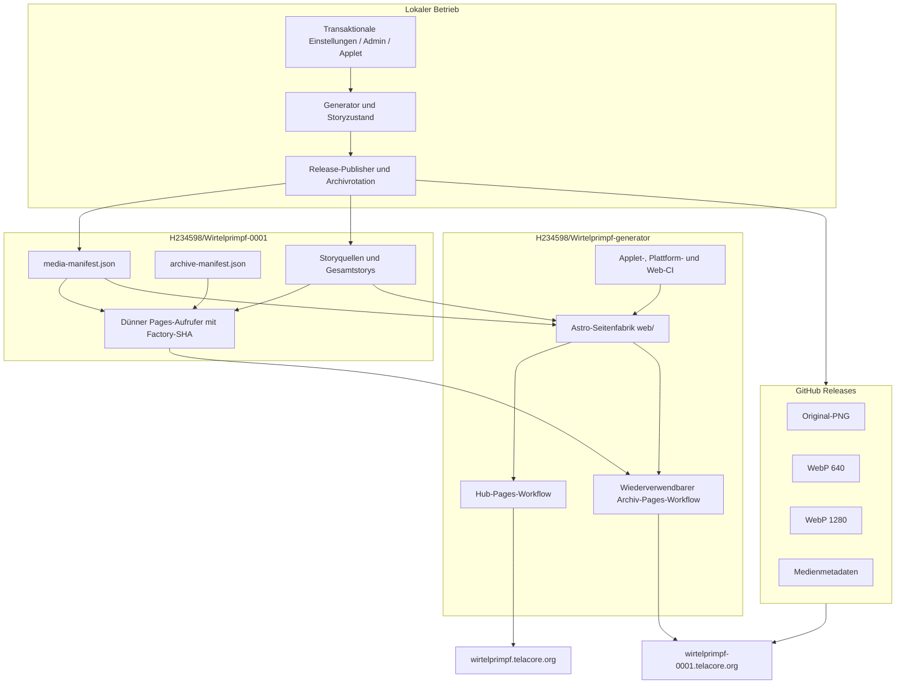
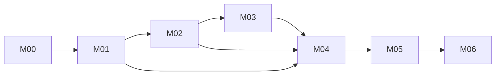
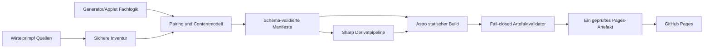
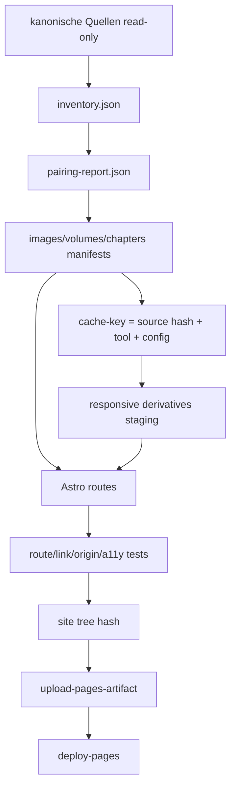

# Wirtelprimpf-Webseite – kanonischer Implementierungsplan

> [!IMPORTANT] Geltungsrang dieser Fassung
> Die Kapitel **0 bis 28** bilden den verbindlichen Steuerungsstand **v2.0.0 vom 2. August 2026**. Sie ersetzen widersprechende Repository-, Hosting-, Medien- und PR-Annahmen aus v1.0. Der vollständige historische Plan v1.0 bleibt ab **Anhang B** bytegetreu erhalten, damit keine Anforderung, Begründung, Testidee oder Dateispezifikation verloren geht. Bei Widerspruch gilt zuerst v2.0.0, danach die jüngeren freigegebenen Generator-/Rolloutpläne und erst danach der historische Anhang.

| Feld | Aktueller Wert |
|---|---|
| Dokument-ID | `WIRTEL-WEB-PLAN-001` |
| Version | `2.0.0` |
| Status | **in Arbeit** |
| Analysebeginn | 2. August 2026, 18:31 Uhr, `Europe/Berlin` |
| Kanonisches Generator-/Factory-Repository | `H234598/Wirtelprimpf-generator` |
| Aktives Archiv | `H234598/Wirtelprimpf-0001` |
| Legacy-Ausgangspunkt | `H234598/Katzenbilder` / später umbenannt beziehungsweise aufgeteilt |
| Zentrales Webprofil | Hub unter `wirtelprimpf.telacore.org` |
| Archiv-Webprofil | Archiv 0001 unter `wirtelprimpf-0001.telacore.org` |
| Historische Planfassung | SHA-256 `c072535f7e2997ffd3e4ee250bf16b333819ba26fad16fcffabb6213a9f24ab3` |

## 0. Normativer Scope, Leseregel und Planpflege

Dieser Plan steuert nicht mehr eine monolithische Webseite im früheren `Katzenbilder`-Repository. Die inzwischen realisierte Publikationsarchitektur trennt Verantwortlichkeiten:

1. **`H234598/Wirtelprimpf-generator`** ist die Autorität für Generator, Plattformlogik, Cinnamon-Applet, lokale Administration, Release-Publikation, Archivrotation und die gemeinsam genutzte Astro-Seitenfabrik.
2. **`H234598/Wirtelprimpf-0001`** ist das erste nummerierte Publikationsarchiv. Es enthält Storyquellen, Archiv- und Medienmanifeste sowie einen dünnen Pages-Aufrufer; Bildbinärdateien liegen in unveränderlichen Releases.
3. Künftige Archive wie `Wirtelprimpf-0002` werden erst an der festgelegten Grenze erzeugt und verwenden denselben gepinnten Factory-Vertrag.
4. Die zentrale Hubseite wird aus dem Generatorrepository gebaut; Archivseiten werden aus dem jeweiligen Archivrepository durch einen unveränderlich gepinnten, wiederverwendbaren Factory-Workflow gebaut.

Der alte Materialisierungsansatz aus Archiv-PR #1 ist **abgelöst**. Er wird nicht repariert oder wiederbelebt. Seine fachlichen P00-Ziele bleiben gültig und werden in dieser Fassung gegen die neue Repositorytopologie neu zugeordnet.

### Statussemantik

- **umgesetzt:** Das zentrale fachliche Ergebnis ist im aktuellen Hauptzweig vorhanden und durch konkrete Repositoryevidenz gestützt.
- **teilweise umgesetzt:** Wesentliche Teile existieren, aber mindestens ein im Paket geforderter Vertrag, Test, Bericht oder UX-Zustand fehlt.
- **in Arbeit:** Aktive Steuerungs- oder Releasearbeit läuft; ein Abschlussgate ist noch offen.
- **offen:** Keine hinreichende aktuelle Implementierungs- oder Abnahmeevidenz.
- **abgelöst:** Nur für frühere Lösungswege beziehungsweise PRs; die zugrunde liegende Anforderung bleibt in einem neuen Paket erhalten.

Ein Status darf erst nach belegtem Merge beziehungsweise nachweisbarer Integration auf `main`, grünen blockierenden Checks, aufgelösten Reviewthreads, bestandenem Akzeptanztest und aktualisierter Evidenz auf **umgesetzt** wechseln.

## 1. Executive Summary – aktueller Zustand

Die grundlegende Zielarchitektur aus v1.0 wurde inzwischen weitgehend realisiert, allerdings in einer deutlich besseren Repositoryaufteilung als ursprünglich geplant:

- statische **Astro-7-Seitenfabrik** mit Hub- und Archivprofil;
- TypeScript-Verträge und strikt validierte Katalog-/Manifestdaten;
- sichere Markdownverarbeitung mit `marked` und `sanitize-html`;
- responsive Bildderivate mit **Sharp/libvips**;
- Originale und Derivate als hashgebundene Releaseassets statt Bildbinärdateien im Git-Hauptbaum;
- Archiv 0001 für Storys 1–50 beziehungsweise Bücher 1–5;
- zehn vollständige Storys je Buch und fünf Bücher je Archiv;
- zentrale Hubseite, Archivseite, Galerie, Bilddetails, Geschichtenbibliothek, Bandansicht, Feed, Sitemap, Projektstatus und No-JavaScript-Grundfunktion;
- fail-closed geprüfte Pages-Artefakte;
- additiv erhaltene Generator-, Applet-, Plattform- und Web-CI.

Der Plan steht daher nicht mehr am Anfang von P00. Der belastbare aktuelle Befund lautet:

- **14 von 48 Paketen umgesetzt**;
- **31 teilweise umgesetzt**;
- **3 in Arbeit**;
- **0 offen**.

Der wichtigste technische Meilenstein ist nun nicht ein erneuter P00-Transfer, sondern ein **kontrollierter Produktionsabgleich**: Das Archiv ruft die Seitenfabrik weiterhin am Commit `b00d824…` auf, während `Wirtelprimpf-generator/main` inzwischen bei `274b25…` steht. Zwischen beiden Ständen liegen 52 Generatorcommits. Die neueren öffentlichen Textänderungen, Status-/Settings-Erweiterungen und Planverträge sind daher nicht automatisch im Archivprofil ausgerollt.

Die genannten UX- und Qualitätsverträge sind lokal implementiert und geprüft. Offen bleiben prozessuale Abschlussgates: Merge-/Reviewevidenz, GitHub-Actions-Lauf, externe Artefakt-/Hostingabnahme und die jeweils geforderten Baselines.

## 2. Was seit dem letzten Lauf passiert ist

### 2.1 Der alte P00-Transfer wurde beendet

Der frühere PR `H234598/Wirtelprimpf-0001#1` wurde geschlossen und nicht gemergt. Seine temporären Payload-/Materialisierungsworkflows sind damit kein aktiver Lösungsweg mehr. Das ist sachlich korrekt, weil die Architektur in der Zwischenzeit grundlegend umgebaut wurde: Medien liegen nicht mehr als Bilddateien im aktuellen Git-Baum und der ausführbare Code gehört nicht mehr in das Archivrepository.

### 2.2 Generator, Plattform und Webfactory wurden ausgegliedert

`H234598/Wirtelprimpf-generator` enthält heute:

- Generator und Storyzustand;
- Release-Publikation und Archivrotation;
- Plattform-CLI und lokale Administration;
- Cinnamon-Applet;
- transaktionale Settings-/Statuslogik;
- die gemeinsame Astro-Seitenfabrik unter `web/`;
- wiederverwendbare Hub-/Archiv-Pages-Workflows;
- Tests und Rolloutpläne.

Diese Trennung löst den im alten Plan erkannten Konflikt zwischen wachsendem Medienarchiv, ausführbarem Code und statischer Veröffentlichung sauberer als ein weiterer Ausbau des alten Monorepos.

### 2.3 Medien wurden releasebasiert migriert

Die Migration von Archiv 0001 etablierte pro Medienobjekt vier öffentliche Artefakte:

1. Original-PNG;
2. WebP-Derivat mit 640 Pixel Breite;
3. WebP-Derivat mit 1280 Pixel Breite;
4. Metadaten-JSON.

Die initiale Migration dokumentierte 779 Medienobjekte und fünf Releases. Archiv-PR #3 sah 780 Einträge, PR #4 entfernte bewusst die schnell veraltende feste Zahl aus dem README. Das aktuelle Manifest am Freeze enthält **790 Medienobjekte**. Die wechselnden Zahlen sind kein Widerspruch, sondern belegen fortlaufende Veröffentlichung; dauerhafte Dokumentation darf deshalb nur Manifestgleichheit und nicht eine statische Gesamtzahl versprechen.

### 2.4 Bücher- und Archivvertrag wurde umgesetzt

Der globale Vertrag lautet jetzt:

- Storys 1–50 in Archiv 0001;
- Bücher 1–5 in Archiv 0001;
- zehn vollständige Storys je Buch;
- fünf Bücher beziehungsweise 50 Storys je Archiv;
- Archiv 0002 erst bei Erreichen der nächsten Grenze.

Stabile Story-URLs werden nicht für die Buchgruppierung umbenannt.

### 2.5 Applet- und Storylogik wurden erweitert

Im Generatorrepository wurden unter anderem integriert:

- kanonische Storyteilnummerierung mit `Part?` bei echter Ambiguität;
- Legacy-URL-Migration vom alten Repositorynamen;
- Storyvorgaben für laufende und zwei folgende Storys;
- read-only Historie vergangener Vorgaben;
- zehn-Story-Buchmodell in Plattform, Web und Applet;
- transaktionale Einstellungen, Live-Synchronisierung, Timeranwendung und redigierter lokaler Betriebsstatus.

### 2.6 Öffentliche Seitentexte und Factory-Code änderten sich nach dem Archiv-Pin

Der aktuelle Generator-Hauptzweig enthält 52 Commits nach dem im Archivworkflow gepinnten Factory-Commit. Darunter liegen auch Änderungen an:

- `web/src/components/MediaCard.astro`;
- `web/src/layouts/BaseLayout.astro`;
- `web/src/pages/index.astro`;
- `web/src/pages/projekt/status.astro`;
- `web/tests/copy-contract.test.ts`;
- Rollout- und Statusverträgen.

Der Produktionsabgleich darf daher nicht als bloßes einzeiliges Repin behandelt werden. Vor dem Repin wird der Diff geprüft, beide Profile werden aus realen Daten gebaut und das bestehende Archivartefakt wird gegen den neuen Tree-Hash und die Freshnessdaten verglichen.

### 2.7 Reviewevidenz enthält eine formale Inkonsistenz

Der aktuelle Generator-Hauptzweig endet in `274b25…` mit der Commitbotschaft `Merge pull request #4 …`. Die PR-Schnittstelle meldet PR #4 jedoch als geschlossen und **nicht** gemergt. Der Code ist damit auf `main` vorhanden, aber die formale PR-Mergeevidenz ist inkonsistent. Diese Fassung erfindet keinen Merge: Der Integrationscommit wird als Hauptzweig-Evidenz geführt; der PR-Status bleibt separat als Inkonsistenz dokumentiert. Vor dem nächsten Release-PR muss die Evidenzkette wieder eindeutig sein.

## 3. Verifizierte Revisionsbaseline vom 2. August 2026

| Repository | Rolle | Default-Branch | Freeze-HEAD | Commitzeit | Drift gegenüber v1 | Konsequenz |
|---|---|---|---|---|---|---|
| `H234598/Wirtelprimpf-generator` | Generator, Plattform, Applet, Admin, Seitenfabrik, Hub | `main` | `274b25c9e1f9ea97d3b060997ed5c425d2b30e9f` | 2026-08-02 13:00:40 `Europe/Berlin` | neues kanonisches Repository | primäre Implementierungs- und Planautorität |
| `H234598/Wirtelprimpf-0001` | Story-/Medienmanifest, Archivvertrag, dünner Pages-Aufrufer | `main` | `79274c1fef77306eb9ee0e9bd2682f4b28b74849` | 2026-08-02 00:58:57 `Europe/Berlin` | aus altem Zielrepo hervorgegangen | aktuelles Publikationsarchiv |
| `H234598/desinfect` | Governance-/Storage-/Statusreferenz | `main` | `3bed7ac358b861490727adce36a418db133f8daf` | 2026-07-31 23:24:24 `Europe/Berlin` | deutlich weiter als v1-Pin | vor jeder neuen Übernahme Provenienz-Diff erforderlich |
| `H234598/ADHS-Lernpfad` | Browser-/Recovery-/Reviewreferenz | `main` | `ee91741ec71a1232a4c3b90f42b805591a0d9359` | 2026-08-01 06:10:04 `Europe/Berlin` | deutlich weiter als v1-Pin | neue Übernahme neu prüfen; alte Pins bleiben historische Provenienz |
| `H234598/Cheatsheets` | Pages-/Artefakt-/IO-Referenz | `main` | `71bcad7a8ab183144e8ff007b85aea8bb6cff3b9` | 2026-07-28 16:11:05 `Europe/Berlin` | gegenüber v1 unverändert | bestehende Pins weiterhin reproduzierbar |

### 3.1 Aktiver Factory-Pin des Archivs

`H234598/Wirtelprimpf-0001:.github/workflows/pages.yml` verwendet weiterhin:

```text
H234598/Wirtelprimpf-generator/.github/workflows/archive-pages.yml
@b00d824adee47341e3251bc18e09239fde1c5939
```

Der aktuelle Generator-Freeze `274b25…` liegt **52 Commits** davor. Das Archiv ist dadurch reproduzierbar, aber nicht auf dem aktuellen Factorystand. Dieses Verhalten ist sicherer als ein beweglicher `@main`-Verweis, erzeugt aber einen bewusst zu bearbeitenden Rollout-Rückstand.

### 3.2 Read-only Veröffentlichungsstand vom 5. August 2026

Der aktuelle Remoteabgleich ist erfolgreich, aber nicht abnahmefähig:

| Evidenz | Wert |
|---|---|
| Generator `main` | `274b25c9e1f9ea97d3b060997ed5c425d2b30e9f` |
| Archiv `main` | `732b62d6ad25b5bfee7a35b673c69568dcd9e75a` |
| Archiv-Pages-Lauf | `30974608315`, `success`, `2026-08-05T04:15:18Z` |
| Hub-Pages-Lauf | `30974607541`, `success`, `2026-08-05T04:15:18Z` |
| Live-Domains | Hub und Archiv HTTPS `200`, HSTS, robots/Sitemap/Feed erreichbar |
| Live-Status | Read-only-Recheck: Hub `798` Bilder/`1` Story, Archiv `798` Bilder/`2` Storys, Manifest `2026-08-05T08:17:57Z` |
| Lokaler Stand | `779` Medien, `195` Kapitel |
| Aktiver Archiv-Factory-Pin | `b00d824adee47341e3251bc18e09239fde1c5939` |

Die Actions-Läufe belegen die bestehende Remotepipeline. Sie belegen nicht,
dass der aktuelle lokale Arbeitsbaum oder der aktuelle Generator-`main` im
Archivprofil ausgerollt wurde. Der Repin bleibt deshalb ein kontrollierter,
extern zu schreibender M01-Schritt.

### 3.3 Aktiver Medienstand

| Feld | Wert am Freeze |
|---|---|
| Manifest | `H234598/Wirtelprimpf-0001@79274…:media-manifest.json` |
| Schema | `2.0.0` |
| Medienobjekte | `790` |
| Aktives Archiv | `1` |
| Storybereich | `1–50` |
| Buchbereich | `1–5` |
| Medienablage | öffentliche, unveränderliche Releases |
| Bildbinärdateien im aktuellen Git-Baum | `0` laut Migrations-/Archivvertrag |
| Derivate je Medienobjekt | Original, WebP 640, WebP 1280, Metadaten-JSON |

### 3.4 Nicht über die Repositorydateien vollständig verifizierte Einstellungen

Weiterhin **manuell zu verifizieren**:

- tatsächliche GitHub-Pages-Quellkonfiguration in den Repositoryeinstellungen;
- Environment-Schutz von `github-pages`;
- Rulesets, Required Checks und Branch Protection;
- organisationsweite CodeRabbit-Konfiguration;
- Custom-Domain-Verifikation;
- DNS-Zoneninhalt und Aliasweiterleitungen;
- HTTPS-Erzwingung;
- Secrets und Actions-Policy;
- live ausgelieferter Inhalt beider Domains.

Die vorhandenen Workflowdateien und READMEs belegen den Sollvertrag, nicht automatisch jede externe Einstellung oder den aktuellen Browserzustand.

## 4. Supersession- und Driftregister

| Frühere Annahme/Lösung                                            | Aktueller Befund                                                                      | Status                | Folge                                                                  |
| ----------------------------------------------------------------- | ------------------------------------------------------------------------------------- | --------------------- | ---------------------------------------------------------------------- |
| Eine Webseite wird vollständig in `H234598/Katzenbilder` gebaut.  | Code/Factory liegen in `Wirtelprimpf-generator`, Archivdaten in `Wirtelprimpf-0001`.  | **abgelöst**          | alle Dateipfade und PR-Ziele werden repositoryspezifisch geführt       |
| P00-PR #1 materialisiert Plan/Scanner per Payloadworkflow.        | PR geschlossen, ungemergt; Medienarchitektur inzwischen ersetzt.                      | **abgelöst**          | Workflow nicht reparieren; P00-Ziele in M00/M04 neu erfüllen           |
| Bilder bleiben als kanonische Git-Dateien im Webseitenrepository. | Aktueller Git-Baum enthält keine Bildbinärdateien; Releases sind Medienquelle.        | **ersetzt**           | Inventur und Pairing lesen Manifest-/Releaseverträge                   |
| `working/` und Symlinkauflösung sind zentrale Webbuildrisiken.    | Release-/Manifestmodell reduziert diese Risiken für die öffentliche Site.             | **teilweise ersetzt** | Quellgenerator bleibt zu prüfen; Pages-Artefakt bleibt sonderdateifrei |
| Veröffentlichung wartet ungefähr 100 Bildcommits.                 | Archiv erhält fortlaufende Release-/Manifestcommits in ungefähr zweistündiger Kadenz. | **ersetzt**           | Freshness-SLA am Manifest-/Pages-Lauf messen                           |
| Project Pages unter `/Katzenbilder/` ist Standard.                | Hub und Archiv besitzen vorgesehene Custom Domains.                                   | **ersetzt**           | Project-Page-Test bleibt nur Fallbackvertrag                           |
| Eine globale Mediengesamtzahl gehört ins README.                  | Zahl wächst laufend und wurde bewusst entfernt.                                       | **verworfen**         | ausschließlich Manifestgleichheit und dynamische Anzeige               |
| Archivworkflow darf auf `@main` zeigen.                           | Archiv pinnt bewusst einen unveränderlichen Factory-SHA.                              | **bestätigt**         | Repin nur reviewt, getestet und mit Rollback                           |
| Build und Deploy müssen zwingend sofort getrennte Jobs sein.      | Aktueller Workflow baut, validiert, lädt und deployt in einem Job.                    | **offene Härtung**    | M01 entscheidet/implementiert Trennung ohne zweiten Build              |

## 5. Aktuelle Systemarchitektur



### 5.1 Publikationsdatenfluss

```mermaid
flowchart LR
    RUN[Erfolgreicher Generatorlauf]
    VALIDATE[Original validieren und hashen]
    DERIVE[Sharp: WebP 640/1280]
    RELEASE[Unveränderliche Releaseassets veröffentlichen]
    REFRESH[Assets öffentlich erneut laden und SHA-256 prüfen]
    MANIFEST[media-manifest.json atomar fortschreiben]
    COMMIT[Story-/Manifestcommit ins aktive Archiv]
    PAGES[Archiv-Pages-Workflow]
    BUILD[Ein statischer Astro-Build]
    GATE[Fail-closed Artefaktvalidator]
    DEPLOY[GitHub Pages]

    RUN --> VALIDATE --> DERIVE --> RELEASE --> REFRESH --> MANIFEST --> COMMIT --> PAGES --> BUILD --> GATE --> DEPLOY
```



### 5.2 Verantwortungsgrenzen

- **Generatorrepository:** sämtliche ausführbare Logik, Schemas, Tests, Workflows und der kanonische Webseitenplan.
- **Archivrepository:** publizierbare Storyquellen, Manifeste, README/Migrationsevidenz und dünner Factory-Aufruf.
- **Releases:** binäre Originale und Webderivate; keine Ausführung.
- **Pages-Artefakt:** ausschließlich reguläre, geprüfte statische Dateien; keine Symlinks, Hardlinks oder Sonderdateien.
- **Browser:** keine GitHub-API, keine Telemetrie, keine Konten; nur statische same-origin Daten und explizite Release-Downloads.

## 6. Aktuell vorhandene Webseitenfunktionen

### 6.1 Belegt vorhanden

- Hub- und Archivprofile mit eigenständigem Branding;
- Startseite mit zwei primären Einstiegen;
- aktueller Storykontext und neue Medien;
- Archivkatalog und Buchgruppierung;
- Galerie mit 24 Einträgen je Seite;
- Filter für alle, Story, Atelier/klassisch und historisch;
- kanonische Bilddetailseiten;
- Originaldownload;
- Geschichtenbibliothek und Bandansicht;
- statische Markdownrendering-/Sanitizing-Pipeline;
- Feed, Sitemap, robots- und Canonical-Verträge;
- Projektstatusroute;
- No-JavaScript-Grundfunktion durch vollständig statische Seiten;
- Meta-CSP, lokale Assets, Skip-Link und Themezustand;
- fail-closed Artefaktvalidierung;
- read-only PR-CI mit festen Runnern und gepinnten Actions.

### 6.2 Noch nicht hinreichend belegt oder offen

- vollständige manuelle Screenreader-, Zoom- und visuelle Abnahme;
- vollständiger Mediencheckout mit Quellenstichprobe, Wachstumshistorie und 95-Prozent-Cachebaseline;
- aktuelle Factory-/Archiv-Pins, externe CI-/Pages-Läufe und Live-Domain-/DNS-/HTTPS-Abnahme;
- produktiver EPUB-Nachweis, solange keine aktiven EPUB-Links im Manifest vorhanden sind;
- getesteter produktiver Rollback-/Redeploylauf auf eine letzte gute Site.

## 7. Abgleich mit den ursprünglichen Qualitätszielen

| Qualitätsziel aus v1 | Aktueller Erfüllungsgrad | Begründung | Nächster Nachweis |
|---|---|---|---|
| Warme, ruhige Wohlfühl-UX | **teilweise** | eigenständige Astrooberfläche und lokale Bild-/Storywege existieren; vollständige visuelle Stichprobe fehlt | M03 visuelle/A11y-Abnahme |
| Sehr einfache Orientierung | **weitgehend** | Hauptwege Bilder/Geschichten sowie Hub/Archive existieren | M02/M03 Journeys und Zurücknavigation |
| Kleine Mobilgeräte bis Desktop | **weitgehend** | 320-Pixel-, Tablet-, Desktop- und große-Display-No-Overflow-Gates sowie Touchtests sind grün | manuelle Zoom-/Geräteabnahme |
| Barrierefreiheit / Progressive Enhancement | **teilweise** | statische Basis, Skip-Link, Sanitizing, Fokus-/Reduced-Motion- und axe-Gates sind vorhanden; manuelle Screenreaderabnahme fehlt | M03 manuelle A11y-Abnahme |
| Großes wachsendes Medienarchiv | **weitgehend** | Releases, Derivate, Pagination und Null-Binär-Gitbaum | M04 Messbudgets und Wachstumsbericht |
| Automatische Inhaltsübernahme | **weitgehend** | Release-/Manifest-/Archivcommit-Pipeline arbeitet fortlaufend; produktiver Dispatch-/Freshnessnachweis fehlt | M01/M05 Freshness-/Pages-E2E |
| Reproduzierbarer sicherer Build | **weitgehend** | Lockfile, feste Versionen, Factory-SHA, Artefaktvalidator und Arbeitskopiegate | M01 Repin und externer Treehash-/Budgetbericht |
| Wartbarkeit / Planpflege | **teilweise** | neue Pläne existieren, alter kanonischer Plan aber nicht sauber rebaselined | M00 |

## 8. Statusregister aller 48 ursprünglichen Arbeitspakete

| Paket | Titel | Status 2026-08-02 | Aktuelle Evidenz | Noch erforderlich | Zielmeilenstein |
|---|---|---|---|---|---|
| `WEB-P00-01` | Revisionsbaseline und Drift-Governance | **in Arbeit** | Diese v2-Baseline friert Generator, Archiv und Referenzen neu ein. | Plan und Revisionsregister in das Generator-Repository übernehmen und per Validator absichern. | `M00` |
| `WEB-P00-02` | Sichere read-only Medieninventur | **teilweise umgesetzt** | Read-only Manifestinventur, versioniertes Schema, atomare `build/reports`-Ausgabe und sechs Sicherheits-/Duplikatfixtures sind grün. Der vollständige Migration-Checkout meldet 779 Manifestmedien, 2.345 deklarierte Release-Assets sowie 2.346 reguläre Dateien/2.337 Bilder im gemischten Sourcebaum (779 PNG-Originale und 1.558 WebP-Derivate); Symlink-, LFS-, Case-, Hardlink- und Fehlerlisten sind leer. | Echte Produktionsbaseline und Wachstumshistorie sowie Merge, Review, CI und Hostingabnahme. | `M04` |
| `WEB-P00-03` | Kanonischer Plan, Anforderungen und ADR-Entwürfe | **in Arbeit** | Mehrere freigegebene Superpowers-Pläne und diese vollständige v2-Fassung existieren. | Kanonische v2-Datei, Requirement-Register, ADR-Register und Supersession-Register im Generator-Repo pflegen. | `M00` |
| `WEB-P00-04` | Bestehenden Check additiv erweitern | **umgesetzt** | Der aktuelle Check erhält Applet-, Generator-, Plattform- und Webprüfungen additiv. | Nur laufende Pin-/Policywartung; keine fachliche Lücke. | `Pflege` |
| `WEB-P01-01` | Versionierte Bild-, Band- und Kapitelschemas | **teilweise umgesetzt** | Drei strikt geschlossene Draft-2020-12-Schemas akzeptieren aktuelle Manifest-/Storyfixtures; vier Contract-Tests bestehen. | Schema-Validator im CI, Merge/Review und vollständige Quellenstichprobe. | `M02/M04` |
| `WEB-P01-02` | Pairing-Engine und Zeitstempelpriorität | **teilweise umgesetzt** | Read-only Pairingreport prüft Heading > Dateiname > Gitzeit > Fallback, Working-/Full-Story-Trennung, Orphans und Ambiguitäten; vier Fixtures bestehen. | Ausreichenden kanonischen Mediencheckout paaren und danach Merge/Review/CI abnehmen. | `M02` |
| `WEB-P01-03` | Fehlerkatalog, Fixtures und Ausnahme-Registry | **teilweise umgesetzt** | Fehlerkatalog, Schwereklassen, Negativfixtures und leere hashgebundene Ausnahme-Registry sind vorhanden; zwei Registry-Tests bestehen. | Reale Ausnahmen nur mit Quellen-SHA eintragen; Merge/Review/CI und vollständige Fehler-Matrix. | `M04` |
| `WEB-P01-04` | Stabile IDs und Aliasregister | **teilweise umgesetzt** | Typisierte portable Image-/Band-/Chapter-IDs, reproduzierbare Chapter-ID und Zyklus-/Kettenvalidierung bestehen in vier Tests; Register bleibt leer. | Reale Umbenennungen fachlich belegen, Aliasmigration browserseitig prüfen sowie Merge/Review/CI. | `M02/M03` |
| `WEB-P02-01` | Astro-7-Grundgerüst mit statischem Output | **umgesetzt** | Astro 7.1.6, TypeScript 6.0.3 und statische Hub-/Archivprofile sind implementiert. | Nur Versionspflege über getrennte PRs. | `Pflege` |
| `WEB-P02-02` | Sicheres Staging und reproduzierbarer Gesamtbuild | **teilweise umgesetzt** | Reproduzierbarer Status-/Astro-Build, fail-closed Artefaktvalidator, Budgetgate, Treehash und explizites Arbeitskopiegate existieren lokal. | Externen Staginglauf und Merge-/Review-/CI-Nachweis mit vollständigem Datenstand abschließen. | `M01/M04` |
| `WEB-P02-03` | Sichere Markdown-Pipeline | **umgesetzt** | Marked und sanitize-html sind gepinnt; Sanitizing besitzt Contract-Tests. | Nur zusätzliche Sicherheitsfixtures bei neuen Markdownfeatures. | `Pflege` |
| `WEB-P02-04` | Base-Path- und URL-Vertrag | **umgesetzt** | Hub- und Archivprofile besitzen eigene Site-URLs, Canonicals und Custom-Domain-Verträge. | Project-Page-Base-Path zusätzlich automatisiert testen, falls weiterhin unterstützt. | `M03` |
| `WEB-P03-01` | Responsive Derivatpipeline mit Sharp | **umgesetzt** | Sharp 0.35.3 erzeugt Originalverweise sowie 640/1280-WebP-Derivate. | Nur neue Größen nach Layoutmessung einführen. | `M04` |
| `WEB-P03-02` | Derivatcache und Manifest | **teilweise umgesetzt** | `MediaDerivativeCache` bindet Original-SHA, Tool-/Transformationsversion, Format und Breite; vollständige Einträge werden atomar publiziert, beschädigte Einträge verworfen und Read-only-Läufe schreiben nicht. Drei Plattformtests sowie `make check` belegen Hit/Miss, gezielte Invalidierung und Cachebericht. `web-image-manifest`-Schema, fail-closed Validator und der vollständige Replaylauf prüfen `779` Medien, `1.558` Derivate, vier Shards und 640/1280-Derivate. Der vollständige Kaltlauf mit Pillow `12.2.0` erzeugte `1.558/1.558` Einträge in `1.151,148 s` bei `0` Hits, `1.558` Misses/Writes und `0` Invalids; zwei anschließende Read-only-Replays erreichten jeweils `100%` Hits. | Endgültige Workflow-/Merge-/Review-/CI-Abnahme und Web-Manifestquelle/Buildartefakt gegen den Zielworkflow abnehmen; untrusted Läufe bleiben read-only. | `M04` |
| `WEB-P03-03` | Medienparser-Sicherheitsgrenzen und Metadatenbereinigung | **teilweise umgesetzt** | Inventur und Release-Tests prüfen 25-MiB-/50-MPixel-Grenzen, LFS, Symlinks, Case-Kollisionen, Dekompressions-/Trunkierungsfehler und Formatbindung. Der vollständige Source-Scan des Migration-Checkouts meldet keine Symlinks, LFS-Pointer, Case-/Hardlink-Kollisionen oder Fehler; die Derivatmaterialisierung wendet EXIF-Orientierung an und exportiert ein neues RGB-WebP ohne EXIF/GPS/ICC. 15 Medienrelease-Tests sind grün und Fehlerpfade redigieren absolute Quellpfade. | Rechte-/Policy-Stichprobe, Merge, Review, CI und externe Abnahme. | `M04` |
| `WEB-P03-04` | Hostingmessung und Schwellenbericht | **teilweise umgesetzt** | Read-only Messscript mit atomarem `build/reports`-Output, wiederholten Buildzeiten, Median/P95, Kindprozess-RSS, Pages-Artefakt-/Treehash-, Budget-, Manifest-/Release-Transfer- und Git-Wachstumsfeldern ist vorhanden. Der reproduzierbare Dreifachlauf ist grün: Median `7,528 s`, P95 `9,351 s`, `779` Medien, `3.654.670.091` Quellbytes, `1.036` Dateien, `1.013` HTML, `21.910.811` Artefaktbytes, `59.820` interne Links, Budget `pass`, Arbeitskopie unverändert. Die Git-Historie bleibt `insufficient_history`; eine synthetische 10-Bilder-Neue-Story-Fixture erreicht gegen den Archivcache `98,7326 %` kombinierte Hits bei `0` Invalids. | Belastbare Wachstumshistorie, drei echte vergleichbare Produktionsbaselines, aktuelle Plattformgrenzen-/Rechteprüfung, ADR-/Hostingentscheidung, Merge, Review, CI und externe Pages-/DNS-Abnahme. | `M04` |
| `WEB-P04-01` | Startseite mit aktuellen Inhalten | **umgesetzt** | Startseite mit Hauptaktionen, aktuellem Storykontext, Archiven und neuen Medien existiert. | Nur UX-Feinschliff aus Browserabnahme. | `M03` |
| `WEB-P04-02` | Galerieindex, Shards und statische Seiten | **umgesetzt** | Statische Galerie, Detailrouten und 24er-Paginierung existieren. | Shard-/JSON-Größen messen; keine unbegrenzte globale Datei zulassen. | `M04` |
| `WEB-P04-03` | Progressive Filter und Mehr-anzeigen | **umgesetzt** | Progressive Typ-/Jahresfilter und statische Pagination sind implementiert; URL-persistente Filter, Unknown-Leerzustand und Rückkehrstatus bestehen in der Browsermatrix. | Nur laufende UX-/Datenpflege. | `M02/M03` |
| `WEB-P04-04` | Galerieposition und Rückkehrzustand | **teilweise umgesetzt** | URL, Filter, Seite, Fokus und Scrollposition sind lokal implementiert und browserseitig geprüft. | Merge, Review, CI und externe Artefaktabnahme. | `M02` |
| `WEB-P05-01` | Kanonische Bilddetailseiten | **umgesetzt** | Kanonische Bilddetailroute und Originaldownload existieren. | Alttexte und Storybezug fachlich verbessern. | `M02/M03` |
| `WEB-P05-02` | Lightbox als progressive Dialogerweiterung | **teilweise umgesetzt** | Progressiver Dialog, Fokuszyklus, Escape, Touch und No-JS-Link sind lokal implementiert und geprüft. | Merge, Review, CI und externe Artefaktabnahme. | `M02/M03` |
| `WEB-P05-03` | Mediennavigation, Vollbild und Download | **teilweise umgesetzt** | Original-/Derivatdownloads, native Vollbild-/Share-Aktionen, Tastatur-/Touchnavigation und ruhige Medienfehler sind lokal implementiert und browserseitig geprüft. | Merge, Review, CI und externe Artefaktabnahme. | `M02` |
| `WEB-P06-01` | Geschichtenbibliothek und Bandkarten | **umgesetzt** | Bibliothek gruppiert 10 Storys je Buch und fünf Bücher je Archiv. | Nur Browser-/A11y-Abnahme und visuelle Feinarbeit. | `M03` |
| `WEB-P06-02` | Kapitelroute und Leseansicht | **teilweise umgesetzt** | Eigenständige Kapitelroute, stabile IDs, TOC, Vor-/Zurück-Navigation, Deep Links und No-JS-Zugang sind lokal implementiert und browserseitig geprüft. | Merge, Review, CI, visuelle Stichprobe und externe Artefaktabnahme. | `M02` |
| `WEB-P06-03` | Vollbandansicht und EPUB-Vertrag | **teilweise umgesetzt** | Vollbandansicht und fail-closed EPUB-Manifest-/ZIP-/Hash-/Releaseprüfung sind lokal implementiert und unitseitig geprüft; aktuell gibt es 0 aktive EPUB-Links. | Browserabnahme, Merge, Review, CI und externer EPUB-/Artefaktnachweis. | `M02` |
| `WEB-P06-04` | Bild-Kapitel-Beziehungsprüfung | **teilweise umgesetzt** | Stabile Bild↔Kapitel-Auflösung, bidirektionale UI-Helfer und ein fail-closed Validator mit Positiv-/Negativfixtures sind vorhanden. Der geprüfte aktuelle Sonderfall ist über die belegte stabile Kapitel-ID explizit gebunden; der Report löst 194 Relationen auf, davon 193 nahe Zeitrelationen, und isoliert 246 historische Pfade als `historical_orphan_count` ohne aktuellen Fehler. | Historische Medien der vollständigen Quelle zuordnen oder dauerhaft isoliert freigeben; danach vollständigen Live-Report, Merge, Review, CI und externe Artefaktabnahme nachweisen. | `M02` |
| `WEB-P07-01` | Versioniertes lokales Zustandsmodell | **teilweise umgesetzt** | Versioniertes, redigiertes Komfortschema mit 64-KiB-/500-/100-Limits, Aliasmigration, Resetaktion und Storage-Fail-Closed ist implementiert und getestet. | Manuelle Screenreaderabnahme sowie Merge-/Review-/CI-Nachweis abschließen. | `M03` |
| `WEB-P07-02` | Lesefortschritt und optionale Favoriten | **teilweise umgesetzt** | Versionierter, begrenzter lokaler Fortschritt/Favoritenzustand sowie Löschen und Storage-Ausfall sind lokal geprüft. | Merge, Review, CI und externe Artefaktabnahme. | `M03` |
| `WEB-P07-03` | No-JS- und Fehlerdegradation | **teilweise umgesetzt** | Statische Filter-, Seiten-, Detail- und Readerwege sowie Storage-, leere/defekte Medien- und Kapitelzustände sind mit No-JS-/Browsergates lokal geprüft. | Vollständige Screenreader-/langsamen-Medien-Stichprobe sowie Merge-/Review-/CI-Nachweis. | `M03` |
| `WEB-P07-04` | Suchgrundlage und bewusster MVP-Verzicht | **teilweise umgesetzt** | Suche ist bewusst noch nicht Kernbestandteil; `ADR-WEB-011` bestätigt den Verzicht. | Erst bei belastbarer Datenbasis Pagefind/MiniSearch vergleichen und mit Indexbudget entscheiden. | `M06` |
| `WEB-P08-01` | Designsystem, Tokens und lokale Assets | **teilweise umgesetzt** | Eigenständige Styles, dokumentierte Farbrollen/Kontrastmatrix, lokale Systemschriften und ein visueller Stichprobenlauf existieren. | Assetlizenz- und vollständige Medien-/Designfreeze-Abnahme sowie Lese-/Sepiamodus belegen. | `M03` |
| `WEB-P08-02` | Responsive Komponentenfeinarbeit | **teilweise umgesetzt** | Responsive Templates, stabile Layouttracks, 320-/Tablet-/Desktop-/große-Display-Gates und 15 visuelle Screenshot-Stichproben sind lokal grün; der CatGPT-Launcher verdeckt keinen Seiteninhalt. | Manuelle Zoomabnahme, Merge, Review, CI und externe Artefaktabnahme nachführen. | `M03` |
| `WEB-P08-03` | Accessibility- und Reduced-Motion-Gate | **teilweise umgesetzt** | Playwright-Corematrix, No-JS-Degradation, Reduced-Motion-Test, Focus-/Touch-Lightboxtests, Visual Contract und axe-Serious/Critical-Gate bestehen lokal. | Manuelle Screenreader-/Zoomabnahme sowie Merge-/Review-/CI-Nachweis abschließen. | `M03` |
| `WEB-P08-04` | Fehler-, Leer- und Ladezustände | **teilweise umgesetzt** | 404, leere Filter, Medienfehler, unknown, leere Kapitel, fehlende Downloads und Statuszustände sind lokal implementiert und durch Browser-/Unit-Gates geprüft. | Merge, Review, CI und externe Artefaktabnahme. | `M02/M03` |
| `WEB-P09-01` | Bestehende Checks äquivalent migrieren | **umgesetzt** | Aktuelle CI erhält Applet-, Generator-, Plattform- und Webchecks mit festen Runnern und Action-SHAs. | Nur Äquivalenzregister und Pinpflege nachführen. | `Pflege` |
| `WEB-P09-02` | Schreibgeschützte Pull-Request-CI | **teilweise umgesetzt** | Read-only PR-Workflow mit gepinnten Actions, Sparse Checkout, npm-/Astro-Checks, Browsermatrix, Performance-, Artefakt-, Budget-, Arbeitskopie- und `always()`-Diagnoseartefaktgate ist vorhanden; der Workflowvertrag ist mit `1/1` Test abgesichert. | Externen Workflowlauf und Merge-/Review-Nachweis nachführen; kein Deployment im PR. | `M03/M04` |
| `WEB-P09-03` | Pages-Build und Deployment aus einem Artefakt | **teilweise umgesetzt** | `hub-pages.yml` und `archive-pages.yml` trennen Build-/Deployjobs, validieren Baumhash und Budgets vor Upload und deployen exakt das einmalige Pages-Artefakt ohne zweiten Build. | Externen Pages-Lauf und aktuelle Factory-/Live-Domain-Abnahme nachführen. | `M01` |
| `WEB-P09-04` | Fail-closed Pages-Artefaktvalidator | **umgesetzt** | `scripts/validate_pages_artifact.py` und Budgetvalidator werden in Hub-/Archivworkflow sowie Fixturetests verwendet; alle fünf Artefaktfixtures bestehen. | Validator nur bei neuen Dateitypen/Budgets erweitern. | `Pflege` |
| `WEB-P10-01` | Freshnessmanifest und knapper öffentlicher Status | **teilweise umgesetzt** | Versioniertes Statusschema und atomare Erzeugung trennen Quellrevision, neueste Medien-/Kapitel-IDs, Buildzeit und Freshness-SLA; öffentliche Ausgabe ist redigiert und fail-closed. Read-only-Recheck am 05.08.2026 08:17:57Z meldet Hub `798` Bilder/`1` Story und Archiv `798` Bilder/`2` Storys; der lokale Stand weicht mit `779` Medien/`195` Kapiteln ab. | Generator-/Pages-E2E, Publish-Lock-/Dispatchnachweis und externe Abnahme bleiben offen. | `M05` |
| `WEB-P10-02` | Projekt-/Wartungsbereich und Provenienz | **teilweise umgesetzt** | Projekt-/Statusseiten, Provenienz- und Betriebsdokumente sind vorhanden; ein eigener Browsergate prüft Primärnavigation und redigierte Ausgabe ohne lokale Pfade/Geheimnisbegriffe. | Lizenz-/Provenienzabnahme, externe Artefakt- und Merge-/Reviewnachweise vervollständigen. | `M05` |
| `WEB-P10-03` | Recovery-, Rollback- und Redeploy-Runbook | **teilweise umgesetzt** | Rollout-, Backup- und Migrationspläne existieren. | Website-Redeploy, letzte gute Revision, Cache-/Derivatrebuild und Medienisolation als getestetes Runbook schließen. | `M05` |
| `WEB-P10-04` | Sicherer Generator-Publish- und Pages-Trigger | **teilweise umgesetzt** | Generator veröffentlicht Releaseassets und Manifestcommits fortlaufend; Archivrotation ist entworfen. | Aktuellen Factory-Pin ausrollen, Parallelität/Freshness beweisen und Archivwechsel E2E testen. | `M01/M05` |
| `WEB-P11-01` | Performance-, Größen- und Buildbudgets | **teilweise umgesetzt** | Deterministische Artefaktbudgets, CI-Gates, SEO-/Performancebrowsergate und dreifacher read-only Medien-/Hostinglauf sind grün; Home 1.908.894 B, Galerie 34.649 B, keine fremden Runtime-Requests, vollständiger Fixturebaum 21.910.811 B. | Merge-/CI- und Hostingnachweis sowie belastbare Live-/Runnerbaseline. | `M04` |
| `WEB-P11-02` | Hosting- und Großrepository-Freeze | **umgesetzt** | Originale/Derivate liegen in Releases; aktueller Git-Baum enthält keine Bildbinärdateien. | Schwellen regelmäßig mit Wachstum und Releaseanzahl neu prüfen. | `Pflege` |
| `WEB-P11-03` | SEO, Sitemap, Feed und Social-Metadaten | **umgesetzt** | Canonical, Open Graph, Feed, Sitemap und robots-Verträge sind implementiert und durch einen origin-gebundenen Browser-/URL-Gate geprüft. | Nur laufende Social-Preview-/URL- und Größenabnahme. | `M03/M04` |
| `WEB-P11-04` | Custom Domain und Releaseabnahme | **in Arbeit** | Read-only-Recheck am 05.08.2026 08:17:57Z: Hub und Archiv antworten über HTTPS mit HTTP 200 und HSTS, ohne Redirect; robots, Sitemap und Feed liefern 200, die getesteten nummerischen Negativhosts liefern keine A-/AAAA-Antwort. Der Archivworkflow verwendet weiter Factory `b00d824…`; live stehen Hub/Archiv bei 798 Medien gegenüber lokal 779/195. | Factory-Repin und geprüften Stand auf Hub/Archiv verifizieren, danach Live-Content, Freshness, Review, Rollback und Releaseabnahme abschließen. | `M01` |
| `WEB-P12-01` | Optionen priorisieren und isolieren | **teilweise umgesetzt** | Optionenregister, bewusster MVP-Verzicht und isolierte Tests sind vorhanden. | Merge, Review und erneute fachliche Neubewertung bei belastbarer Datenbasis. | `M06` |

### 8.1 Zusammenfassung

| Status | Anzahl |
|---|---:|
| umgesetzt | 14 |
| teilweise umgesetzt | 31 |
| in Arbeit | 3 |
| offen | 0 |
| **Gesamt** | **48** |

| Phase | umgesetzt | teilweise umgesetzt | in Arbeit | offen | Summe |
|---|---:|---:|---:|---:|---:|
| `P00` | 1 | 1 | 2 | 0 | 4 |
| `P01` | 0 | 4 | 0 | 0 | 4 |
| `P02` | 3 | 1 | 0 | 0 | 4 |
| `P03` | 1 | 3 | 0 | 0 | 4 |
| `P04` | 3 | 1 | 0 | 0 | 4 |
| `P05` | 1 | 2 | 0 | 0 | 3 |
| `P06` | 1 | 3 | 0 | 0 | 4 |
| `P07` | 0 | 4 | 0 | 0 | 4 |
| `P08` | 0 | 4 | 0 | 0 | 4 |
| `P09` | 2 | 2 | 0 | 0 | 4 |
| `P10` | 0 | 4 | 0 | 0 | 4 |
| `P11` | 2 | 1 | 1 | 0 | 4 |
| `P12` | 0 | 1 | 0 | 0 | 1 |

> [!NOTE] Konservative Bewertung
> `teilweise umgesetzt` bedeutet nicht, dass die vorhandene Software unbrauchbar wäre. Es bedeutet, dass der umfassendere DoD des ursprünglichen Plans — häufig einschließlich Browserabnahme, Fehlerfixtures, Bericht, Migration und Rollback — noch nicht vollständig belegt ist.

## 9. Rebaselined Meilensteinplan

Die frühere lineare P00–P12-Reihenfolge bleibt als Anforderungsstruktur erhalten. Für die tatsächliche Fortsetzung wird sie in sieben überprüfbare Meilensteine gebündelt.

| Meilenstein | Ziel | Enthaltene Schwerpunktpakete | Exit-Gate |
|---|---|---|---|
| `M00` | Plan, Baseline und Supersession kanonisch machen | P00-01, P00-03, Evidenzmodell | v2 im Generatorrepo, Validator grün, 48 Pakete/60 Anforderungen tracebar |
| `M01` | aktuellen Factorystand kontrolliert veröffentlichen | P02-02, P09-03, P10-04, P11-04 | Hub und Archiv aus geprüftem SHA live, Freshness und Treehash belegt |
| `M02` | Galerie-, Detail- und Lesewege vollständig machen | P04-04, P05, P06, P08-04 | alle Kernjourneys inkl. Deep Links und Rückkehr funktionieren |
| `M03` | lokale Komfortfunktionen und Accessibility blockierend machen | P07, P08, P09-02 | Playwright/axe/No-JS/Touch/320px/Reduced Motion grün |
| `M04` | Medien- und Performancehärtung | P00-02, P03, P04-02, P11-01 | gemessene Budgets, Parserlimits, Cache-/Wachstumsbericht grün |
| `M05` | Freshness, Recovery, Redeploy und Archivrotation E2E | P10, P11-04 | letzte gute Site, Medienisolation und 0002-Handoff getestet |
| `M06` | Optionen isoliert bewerten | P07-04, P12-01 | keine Option blockiert Kern; jede besitzt Test und Rollback |

Abhängigkeit:



`M02` und vorbereitende Teile von `M04` können nach dem M01-Freeze parallel in getrennten Worktrees entwickelt werden. Deployment-, Factory-Pin- und Datenvertragsdateien bleiben jedoch exklusiv einem aktiven PR zugeordnet.

## 10. Meilenstein M00 – Plan- und Evidenzrebaseline

### M00-01 – v2-Plan kanonisch übernehmen

- **Status:** in Arbeit – diese Datei ist das vollständige Artefakt.
- **Zielrepository:** `H234598/Wirtelprimpf-generator`.
- **Zielpfad:** `docs/plans/WIRTELPRIMPF-WEBSEITE-IMPLEMENTIERUNGSPLAN.md`.
- **Zusätzlich neu:**
  - `config/web-plan-status.json`;
  - `config/web-plan-supersession.json`;
  - `scripts/validate_web_plan.py`;
  - `tests/test_web_plan.py`.
- **Vertrag:** genau 48 historische Pakete, genau 60 Requirement-IDs, eindeutige Statuswerte, aktuelle Repo-SHAs, dokumentierter Factory-Pin und referenzierte Meilensteine.
- **Rollback:** reiner Dokument-/Validator-PR; Revert entfernt keine Laufzeitfunktion.

### M00-02 – PR-/Mergeevidenz normalisieren

Die PR-API-Inkonsistenz von Generator-PR #4 wird nicht still bereinigt. Das Evidenzregister führt getrennt:

```json
{
  "integration_commit": "274b25c9e1f9ea97d3b060997ed5c425d2b30e9f",
  "commit_message_mentions_pr": 4,
  "github_pr_state": "closed",
  "github_pr_merged": false,
  "content_present_on_main": true,
  "evidence_class": "manual-main-integration"
}
```

Künftige Pakete dürfen `merged_pr` nur setzen, wenn GitHub tatsächlich `merged_at` liefert. Manuell auf `main` integrierter Code erhält eine eigene Evidenzklasse.

### M00-03 – lokale Validierung

```bash
python3 scripts/validate_web_plan.py --root .
python3 -m unittest tests.test_web_plan -v
make check
```

**Erwartung:** Exit 0; 48 eindeutige Pakete; 60 eindeutige Anforderungen; keine historische Paket-ID verloren; aktuelle Freeze-SHAs vollständig 40-stellig; alter P00-PR als abgelöst und nicht als umgesetzt geführt.

### M00 Definition of Done

- v2-Plan und maschinenlesbare Register gemergt;
- CI/CodeRabbit vollständig grün beziehungsweise jede Warnung ausdrücklich klassifiziert;
- keine Änderung an Generatorlauf, Releasepublikation oder Webseitenoutput;
- dieses Downloadartefakt und Repo-Datei inhaltlich identisch;
- nächster Meilenstein M01 im Plan auf `in Arbeit` gesetzt.

## 11. Meilenstein M01 – Factory-Pin, Hub und Archiv kontrolliert ausrollen

**Status:** in Arbeit.

### 11.1 Warum M01 jetzt Priorität hat

Das Archiv ist reproduzierbar, verwendet aber eine 52 Commits ältere Factory. Gleichzeitig dokumentiert der jüngere Rolloutplan, dass der produktive Deploymentteil der transaktionalen Settings-/Copy-Änderung bewusst noch nicht ausgeführt wurde. Jede weitere UX-Arbeit auf einem nicht eindeutig ausgerollten Stand würde Diagnose und Abnahme unnötig vermischen.

### M01-01 – Factory-Diff klassifizieren

- **Basis:** `b00d824adee47341e3251bc18e09239fde1c5939`.
- **Kandidat:** `274b25c9e1f9ea97d3b060997ed5c425d2b30e9f` oder ein darauf folgender reiner Stabilisierungssquash.
- **Pflichtdiff:** alle 52 Commits und 46 geänderten Dateien nach Kategorien:
  - öffentliche Webausgabe;
  - Daten-/Katalogvertrag;
  - Workflow/Pages;
  - nur Admin/Applet/Plattform;
  - Dokumentation/Test.
- **Blocker:** jede Änderung an Manifestparser, Release-URL-Validierung, Routen, Artifact Validator oder Workflowrechten ohne vollständigen Profilbuild.

### M01-02 – aktuellen Generator-Freeze vollständig prüfen

Exakte Befehle aus dem aktuellen Workflow:

```bash
make check
python -m unittest discover -s tests/platform -p 'test_*.py' -v
python -m compileall -q Sourcecode wirtelprimpf_platform scripts
wirtelprimpf-platform mapping 51

cd web
npm ci --ignore-scripts
WIRTELPRIMPF_DATA_ROOT="$PWD/fixtures/site" \
WIRTELPRIMPF_SITE_PROFILE=hub \
npm test
WIRTELPRIMPF_DATA_ROOT="$PWD/fixtures/site" \
WIRTELPRIMPF_SITE_PROFILE=hub \
npm run check
cd ..

WIRTELPRIMPF_DATA_ROOT="$PWD/web/fixtures/site" \
WIRTELPRIMPF_SITE_PROFILE=hub \
WIRTELPRIMPF_SITE_URL=https://wirtelprimpf.telacore.org \
npm --prefix web run build
python3 scripts/validate_pages_artifact.py web/dist \
  --expected-domain wirtelprimpf.telacore.org

WIRTELPRIMPF_DATA_ROOT="$PWD/web/fixtures/site" \
WIRTELPRIMPF_SITE_PROFILE=archive \
WIRTELPRIMPF_SITE_URL=https://wirtelprimpf-0001.telacore.org \
npm --prefix web run build
python3 scripts/validate_pages_artifact.py web/dist \
  --expected-domain wirtelprimpf-0001.telacore.org
```

Für die Releaseabnahme werden diese Fixture-Builds zusätzlich mit einer read-only Arbeitskopie von Archiv 0001 ausgeführt.

### M01-03 – Workflow in getrennte Jobs härten

**Generator:** `.github/workflows/archive-pages.yml` und `.github/workflows/hub-pages.yml`.

Soll:

1. `build` mit `contents: read`, Factory-/Datencheckout, Tests, genau einem Build, Artefaktvalidator, Treehash und Upload;
2. `deploy` mit `needs: build`, ohne Checkout/Build, nur `pages: write` und `id-token: write`, konsumiert exakt das hochgeladene Artefakt;
3. `cancel-in-progress: false` für produktive Pagesgruppe;
4. Deployment erhält Environment `github-pages` und Output-URL;
5. fehlerhafter Build verändert die letzte gültige Site nicht.

### M01-04 – Archiv-Pin aktualisieren

**Datei:** `H234598/Wirtelprimpf-0001:.github/workflows/pages.yml`.

Nur ein geprüfter, 40-stelliger Generator-SHA ist zulässig. Der PR enthält:

- alten und neuen Pin;
- Generator-Diffbericht;
- Hub-/Archiv-Treehash vorher/nachher;
- erwartete öffentliche Textänderungen;
- aktuelle Manifestgleichheit `media_count == len(media)`;
- Nachweis, dass keine Bilddatei in den Git-Baum gelangt;
- Rollback durch Rücksetzen genau dieses Pins.

### M01-05 – Hub und Archiv live abnehmen

Automatisch und manuell:

- Startseite ohne Konsolenfehler;
- korrekte Domain/Canonical/Sitemap/Feed;
- aktuelle Manifestrevision und neuestes Medienobjekt sichtbar;
- kein LFS-Pointer als Download;
- keine unerwartete fremde Origin;
- stichprobenartige 200-Antworten für Original, 640er, 1280er und Metadaten;
- Hub verweist auf aktives Archiv;
- Archivgrenzen 1–50 und Bücher 1–5;
- öffentliche Copy entspricht aktuellem Factoryvertrag;
- HTTPS und Domainverifikation manuell dokumentiert.

### M01 Definition of Done

- eindeutiger neuer Factory-SHA;
- Generator-CI und Review grün;
- Archiv-Pin-PR gemergt;
- echter Pages-Lauf grün;
- Live-Smoke und Freshnessbericht grün;
- dokumentierter alter Pin als Ein-Schritt-Rollback;
- P09-03, P10-04 und P11-04 neu bewertet.

## 12. Meilenstein M02 – Galerie-, Detail- und Lesejourneys schließen

### M02-01 – Galerie-URL und Rückkehrzustand

**Ändern:**

- `web/src/pages/bilder/index.astro`;
- `web/src/lib/data.ts`;
- `web/src/lib/routes.ts` neu;
- `web/src/scripts/gallery-state.ts` neu;
- `web/tests/gallery-state.test.ts` neu.

Vertrag:

- Queryparameter `typ`, `seite`, optional `jahr` sind kanonisch validiert;
- No-JS-Links liefern denselben statischen Zustand;
- JavaScript verbessert Filter/Scroll, ersetzt aber keine Links;
- Browser-Zurück stellt Filter, Seite, Fokusziel und sinnvolle Scrollposition wieder her;
- `unknown` bleibt eine eigene, nicht fälschlich sichere Kategorie;
- unbekannte Parameter werden verworfen, nicht gespiegelt.

### M02-02 – Bildnavigation und progressive Lightbox

**Ändern/neu:**

- `web/src/pages/bilder/[id].astro`;
- `web/src/components/MediaDetail.astro` neu;
- `web/src/components/Lightbox.astro` neu;
- `web/src/scripts/lightbox.ts` neu;
- `web/tests/media-navigation.test.ts` neu.

Muss:

- Detailroute bleibt kanonische URL;
- vorheriges/nächstes Bild;
- Originaldownload und verfügbare Derivate;
- Story-/Kapitelverknüpfung;
- Dialog nur bei JavaScript;
- `role=dialog`, zugänglicher Name, Fokusfalle, Escape, korrekte Fokusrückgabe;
- Touch/Wischgeste mit Schwelle, ohne Scroll-/Zoomkonflikt;
- Reduced Motion ohne animierte Übergänge;
- UI überdeckt das Bild nicht dauerhaft.

### M02-03 – Kapitelrouten und Leseansicht

**Ändern/neu:**

- `web/src/pages/geschichten/[volume].astro`;
- `web/src/pages/geschichten/[volume]/[chapter].astro` neu;
- `web/src/components/Reader.astro` neu;
- `web/src/components/StoryToc.astro` neu;
- `web/src/lib/story-routes.ts` neu;
- `web/tests/story-navigation.test.ts` neu.

Vertrag:

- Bandroute = Bibliotheks-/Gesamtansicht;
- Kapitelroute = kanonischer Permalink;
- stabile Kapitel-ID aus Quellvertrag, nicht Position allein;
- vorheriges/nächstes Kapitel;
- Inhaltsverzeichnis;
- Kapitelbild in beide Richtungen verlinkt;
- sichere Abschnittsanker;
- fehlender Titel erhält dokumentierten Fallback;
- leeres/defektes Kapitel blockiert oder zeigt den klassifizierten Fehlerzustand.

### M02-04 – EPUB und Downloadvertrag

- EPUB nur anzeigen, wenn Datei/Releaseasset vorhanden, Header plausibel und Hash im Manifest steht;
- Linktext nennt Format und Größe;
- fehlendes EPUB ist kein Fehler der Leseansicht;
- Download darf nie eine LFS-Pointerdatei liefern.

### M02 Definition of Done

Alle zehn Kernjourneys aus v1 funktionieren direkt, mit Browser-Zurück und ohne JavaScript-Grundbruch. P04-04, P05-02 sowie zentrale Teile von P05-03, P06-02 bis P06-04 und P08-04 sind geschlossen oder mit exakt dokumentierter Restlücke neu klassifiziert.

## 13. Meilenstein M03 – lokale Zustände, Accessibility und echte Browserabnahme

### M03-01 – versioniertes Storage-Schema

**Neu:** `web/src/lib/site-state.ts`, `web/tests/site-state.test.ts`, `docs/WEB-LOCAL-STATE.md`.

Ein Schlüssel, beispielsweise `wirtelprimpf.site-state.v1`, enthält nur:

- Theme/Leseansicht;
- Galeriequery und Rückkehranker;
- Lesefortschritt je stabiler Kapitel-ID;
- optional Favoriten-IDs.

Grenzen:

- kein Freitext, keine Suchhistorie, keine Gerätekennung;
- Gesamtgröße maximal 64 KiB;
- schema-validiert und versionsgebunden;
- defekter Zustand wird gesichert verworfen;
- Aliasregister migriert IDs;
- UI bietet `Lokale Lesedaten löschen`;
- Storage-Ausfall degradiert ausschließlich Komfortfunktionen.

### M03-02 – Lesefortschritt und Favoriten

Priorität:

1. zuletzt gelesenes Kapitel und optionaler Absatzanker;
2. sichtbare `Weiterlesen`-Aktion;
3. Favoriten nur als separater, rückbaubarer Komfortschritt.

Keine Streaks, Pushmeldungen, Autoplay- oder Gamificationelemente.

### M03-03 – Playwright- und axe-Harness

**Abhängigkeiten:** exakt gepinnte `@playwright/test`- und `axe-core`-Versionen in `web/package-lock.json`.

**Neue Pfade:** `web/playwright.config.ts`, `web/tests/browser/*.spec.ts`.

Blockierende Szenarien:

- Start, Galerie, Detail, Geschichten, Kapitel, 404;
- No-JS;
- Tastatur und Fokus;
- Lightbox;
- Browser-Zurück;
- 320 CSS-Pixel;
- Touch/Wischen;
- Reduced Motion;
- Light/Dark/Reading-Kontrast;
- LocalStorage nicht verfügbar/defekt;
- keine fremden Laufzeitrequests;
- axe ohne `serious`/`critical`;
- Download ist echte Datei und kein Pointer.

### M03-04 – Alternativtext- und Fokusprüfung

Generisches `Wirtelprimpf-Szene` reicht nicht für jedes informative Bild. Der Plan verlangt:

- Herkunft des Alternativtexts im Manifest;
- manuell/regelbasiert/temporärer Fallback markiert;
- dekorative Bilder explizit leer;
- keine erfundenen Bilddetails;
- Stichprobenreview frühe/mittlere/aktuelle und Sonderbilder;
- Fokusfolge/Screenreadername jeder interaktiven Komponente.

### M03 Definition of Done

- reproduzierbare Chromiumtests ohne Retry/Flake;
- axe-Gate grün;
- No-JS vollständig bedienbar;
- LocalStorage-Ausfall ohne Seitenbruch;
- 320-Pixel-Ansicht ohne Gesamtüberlauf;
- Kernjourneys mit Tastatur und Touch grün;
- P07/P08/P09-02 neu bewertet.

## 14. Meilenstein M04 – Medien-, Cache- und Performancehärtung

### M04-01 – vollständiges Medieninventar v2

Der Bericht liest `media-manifest.json`, Releases und Storyquellen, ohne Binärdateien in Git zu materialisieren. Er enthält:

- Anzahl/Bytes je Format und Release;
- Dimensionen, Seitenverhältnisse und Pixelzahl;
- Median, p90, p95, p99, Maximum;
- fehlende/duplizierte Hashes;
- Releaseasset-Vollständigkeit 4/4;
- verwaiste Story-/Prompt-/Medienbeziehungen;
- aktuelle Wachstumsrate und 12/24/36-Monatsprognose;
- Download-/Build-/Artefaktkosten;
- aktuelle und historische Manifestzählung ohne feste README-Zahl.

### M04-02 – Parser- und Ressourcenlimits

Blockierend:

- maximal zulässige Originalbytes;
- maximal zulässige Pixelzahl;
- beschädigter Header/EOF;
- Dekompressionsbombenwarnung;
- EXIF-Orientierung korrekt anwenden;
- GPS/unnötige Metadaten aus Webderivaten entfernen;
- LFS-Pointer erkennen;
- kein Symlink-/Pfadausbruch;
- ein fehlgeschlagenes Medienobjekt erzeugt klaren Bericht und keinen Teil-Derivatsatz.

### M04-03 – Cache- und Reproduzierbarkeitsvertrag

Cache-Key:

```text
SHA256(original) + sharp-version + transform-config-version + target-format + target-width
```

Bericht:

- kalter/warmer Build;
- Cachetreffer bei einem typischen neuen Storylauf;
- CPU/RAM/temp;
- Artefaktdateien/-bytes;
- Treehash;
- unveränderte Quellen;
- kein vertrauenswürdiger Maincache aus untrusted Forkdaten überschrieben.

### M04-04 – Budgets

Erste blockierende Startwerte werden erst nach Messung final eingefroren. Vorläufige Obergrenzen für die Baseline:

| Budget | Vorläufiges Gate | Freeze-Regel |
|---|---:|---|
| externe Laufzeitrequests | `0` | sofort blockierend |
| eigenes initiales JavaScript Start/Galerie | `≤ 35 KiB gzip` | nach erster reproduzierbarer Messung |
| eigenes initiales CSS | `≤ 40 KiB gzip` | nach erster reproduzierbarer Messung |
| größte HTML-Datei | `≤ 2 MiB` | sofort nach Bestandsmessung |
| initialer Galerieindex-Shard | `≤ 150 KiB gzip` | nach Datenmodellmessung |
| geladene Galerieoriginale bei Start | `0` | sofort blockierend |
| gleichzeitig eager geladene Galeriebilder | `≤ 6` | Browsergate |
| CLS | `≤ 0,10` | nach dreifacher Baseline |
| LCP | `≤ 2,5 s` in definierter Desktop-/Mobilumgebung | erst nach stabiler Baseline |
| INP | `≤ 200 ms` | erst nach stabiler Baseline |
| Pages-Artefakt | Warnung bei 60 %, Block bei 75 % der aktuell verifizierten Plattformgrenze | offizielle Grenze vor Freeze neu abrufen |
| kalter Build | Warnung 6 min, Block 8 min | innerhalb der verifizierten Pages-/Actionsreserve |

### M04 Definition of Done

- vollständiger maschinenlesbarer Inventar- und Budgetbericht;
- reproduzierbare doppelte Builds mit identischem Treehash;
- Sicherheitsfixtures grün;
- Wachstumsprognose und Hostingentscheidung aktualisiert;
- P00-02, P03 und P11-01 geschlossen oder exakt neu begründet.

## 15. Meilenstein M05 – Freshness, Recovery, Redeploy und Archivrotation

### M05-01 – öffentlicher Freshnessvertrag

Öffentlich sichtbar, aber knapp:

- letzte veröffentlichte Quellrevision;
- zuletzt veröffentlichtes Medienobjekt;
- zuletzt veröffentlichtes Storykapitel;
- Buildzeit;
- Status `aktuell`, `verzögert`, `unbekannt`.

Keine lokalen Pfade, Tokens, Workflowtraces oder internen Fehlerstapel.

### M05-02 – interne Diagnose und letzte gute Site

Diagnoseartefakt enthält:

- Quell-/Factory-/Archiv-SHA;
- Manifest- und Treehash;
- Build-/Deployrun;
- Fehlerklasse und Recoveryaktion;
- letzter erfolgreicher Deployment-SHA;
- aktuell gepinnter und vorheriger Factory-SHA.

Fehlgeschlagene neue Inhalte lassen die letzte erfolgreiche Pages-Site online.

### M05-03 – Redeploy/Rollback

Runbook und `workflow_dispatch` unterstützen:

- bekannten guten Factory-Pin erneut bauen;
- vorherigen Pages-Artefaktstand nachvollziehbar wiederherstellen;
- fehlerhaftes Medienobjekt isolieren, ohne Manifestgeschichte zu fälschen;
- Derivatcache kontrolliert neu bauen;
- nach Reparatur dasselbe Medienobjekt hashkonsistent wieder aufnehmen.

### M05-04 – Archivrotation 0001 → 0002 testen

Vor der realen Grenze vollständig in Fixtures/temporären Repositories:

- Story 50/Buch 5/Archiv 1 abgeschlossen;
- Archiv 0002 wird genau einmal provisioniert;
- Story 51/Buch 6/Archiv 2;
- Hubkatalog ohne Lücke/Duplikat;
- Factory-Pin, Pages, CNAME/DNS und Releases erst nach vollständiger Verifikation;
- Generierung bleibt blockiert, solange Handoff nicht abgeschlossen ist;
- Rollback hinterlässt keine halbfertigen öffentlichen Repositories.

### M05 Definition of Done

Freshness-SLA, letzter-guter-Stand, Redeploy, Medienisolation und Archivrotation besitzen automatisierte Nachweise und ein manuell ausführbares Runbook.

## 16. Meilenstein M06 – optionale Erweiterungen

| Option | Priorität | Nutzen | Hauptrisiko | Voraussetzung | Abnahmetest |
|---|---|---|---|---|---|
| `Überrasche mich` | nach MVP | spielerischer Archiveinstieg | darf Hauptnavigation nicht verdrängen | stabile Medien-IDs | direkte Route, keine Vollarchivladung |
| Favoriten | nach MVP | persönliche Sammlung | Storage-Migration | M03-State | Ausfall/Reset/ID-Alias |
| Web Share API | nach MVP | einfaches Teilen | Plattforminkonsistenz | stabile Permalinks | Fallback kopiert URL |
| Story-Volltextsuche | später | große Textmenge erschließen | Indexgröße/Datenschutz | M04-Budgets | No-JS-Grundweg bleibt |
| PWA-App-Shell | später | wiederkehrender mobiler Zugriff | unkontrollierter Archivcache | Budget/Updatevertrag | nie gesamtes Archiv cachen |
| Browser-TTS | später | Barriere-/Komfortoption | Stimme/Autoplay/Steuerung | Reader stabil | nur bewusst gestartet, stoppbar |
| Slideshow | bewusst nachrangig | Bildbetrachtung | Bewegung/Autoplay | M03 A11y | Pause, Tastatur, Reduced Motion |
| Vollarchiv-Offlinecache | nicht empfohlen | — | Speicher, Aktualität, Netzlast | — | nicht implementieren |

Jede Option erhält einen eigenen PR, einen eigenen Datenvertrag und einen vollständigen Revertpfad. Keine Option darf Build, Galerie oder Reader des Kerns voraussetzen oder blockieren.

## 17. Aktualisierte PR-Reihenfolge

| PR | Repository | Inhalt | Risiko | Mergevoraussetzung |
|---|---|---|---|---|
| `V2-PLAN` | Generator | v2-Plan, Status-/Supersessionregister, Validator | niedrig | Check/Review grün |
| `FACTORY-STABILIZE` | Generator | Factory-Diff, getrennte Pagesjobs, Releaseevidenz | hoch | beide Profile + Artefaktvalidator + Securityreview |
| `ARCHIVE-REPIN-0001` | Archiv 0001 | genau der geprüfte Factory-SHA | mittel | echter Pageslauf und Rollbackpin |
| `WEB-NAVIGATION` | Generator | Galeriezustand, Detailnavigation, Lightbox | mittel | Unit + Browser + A11y |
| `WEB-READER` | Generator | Kapitelrouten, TOC, Beziehungen, EPUB | mittel | Contract + Browser + Links |
| `WEB-STATE-A11Y` | Generator | Fortschritt, State, Playwright/axe | mittel | No-JS/Storage/320px/Touch |
| `WEB-MEDIA-BUDGETS` | Generator | Inventar, Limits, Cache, Budgets | hoch | reproduzierbare Messberichte |
| `WEB-OPS` | Generator + dünne Archiv-PRs | Freshness, Redeploy, Rotation | hoch | E2E-Fixtures und manuelle Runbookprüfung |
| optionale PRs | Generator | M06 je Option einzeln | niedrig–mittel | Kern bleibt unabhängig |

Kein Archiv-PR darf ausführbaren Generator-/Webfactory-Code aufnehmen. Kein Generator-PR darf Story-/Medienmanifestdaten heimlich duplizieren.

## 18. Aktueller Soll-Verzeichnisbaum

```text
H234598/Wirtelprimpf-generator/
├── .github/workflows/
│   ├── check.yml
│   ├── hub-pages.yml
│   └── archive-pages.yml
├── config/
│   ├── web-plan-status.json                  # neu M00
│   ├── web-plan-supersession.json            # neu M00
│   ├── web-budgets.json                      # neu M04
│   └── schemas/
├── docs/
│   ├── plans/WIRTELPRIMPF-WEBSEITE-IMPLEMENTIERUNGSPLAN.md
│   ├── WEB-LOCAL-STATE.md
│   ├── WEB-PERFORMANCE.md
│   ├── WEB-RECOVERY.md
│   └── adr/
├── scripts/
│   ├── validate_pages_artifact.py
│   ├── validate_web_plan.py                  # neu M00
│   ├── validate_web_budgets.py               # neu M04
│   └── build_web_status.py                   # neu M05
├── tests/
│   ├── platform/
│   ├── test_web_plan.py                      # neu M00
│   └── ...
├── web/
│   ├── package.json
│   ├── package-lock.json
│   ├── playwright.config.ts                  # neu M03
│   ├── src/
│   │   ├── components/
│   │   ├── layouts/
│   │   ├── lib/
│   │   ├── pages/
│   │   │   ├── bilder/
│   │   │   └── geschichten/
│   │   │       └── [volume]/[chapter].astro # neu M02
│   │   ├── scripts/
│   │   └── styles/
│   └── tests/
│       ├── browser/                          # neu M03
│       └── *.test.ts
└── wirtelprimpf_platform/

H234598/Wirtelprimpf-0001/
├── .github/workflows/pages.yml               # dünner, gepinnter Caller
├── Wirtelprimpf/                              # Story-/Promptquellen
├── archive-manifest.json
├── media-manifest.json
├── docs/MEDIA-MIGRATION-0001.md
└── README.md
```

## 19. CI-, Review- und Evidenzmodell

### 19.1 Pull Requests

- `contents: read` als Standard;
- keine Secrets und kein Deployment;
- feste Runner und Laufzeitversionen;
- Actions vollständig auf Commit-SHAs;
- `persist-credentials: false`;
- Sparse Checkout ohne LFS, außer ein Test verlangt ausdrücklich reale LFS-Objekte;
- Lockfiles und `npm ci --ignore-scripts`;
- Timeouts und PR-Concurrency;
- Applet-, Plattform-, Web-, Schema-, Artefakt-, Browser-, A11y-, Origin- und Budgetgates;
- Diagnoseartefakte auch bei Fehlern;
- Arbeitskopie nach Build unverändert.

### 19.2 Pages

- Buildjob read-only;
- Deployjob ohne Checkout und ohne zweiten Build;
- ausschließlich geprüftes Pages-Artefakt;
- Environment `github-pages`;
- `pages: write`/`id-token: write` nur im Deployjob;
- produktive Concurrency bricht laufendes gültiges Deployment nicht ab;
- Treehash, Quell-SHAs und Freshness in Job Summary;
- letzte gültige Site bleibt bei Fehler online.

### 19.3 Review

- CodeRabbit-Status allein reicht nicht; relevante Inline-/Reviewthreads müssen aufgelöst sein;
- Rate-Limit-, Pause- oder reine Walkthrough-Kommentare gelten nicht als bestanden;
- ein vollständiger Review wird auf dem finalen Head ausgelöst;
- formale Warnungen wie Docstring Coverage werden entweder behoben oder als bewusst nicht blockierende organisationsweite Policyabweichung dokumentiert;
- Securityscan bei Workflow-, Parser-, Release-, Settings- oder Pfadänderungen;
- PR-/Mergeevidenz darf nicht aus Commitbotschaften abgeleitet werden, wenn GitHub `merged_at` nicht bestätigt.

### 19.4 Evidenzobjekt pro Paket

```json
{
  "package_id": "WEB-P09-03",
  "status": "teilweise umgesetzt",
  "repository": "H234598/Wirtelprimpf-generator",
  "head_sha": "<40 hex>",
  "pull_request": 0,
  "integration_kind": "merged-pr|manual-main-integration|not-integrated",
  "merge_sha": null,
  "workflow_runs": [],
  "tests": [],
  "review_threads_open": 0,
  "coderabbit": "passed|warning|not-run|rate-limited",
  "acceptance": [],
  "rollback": "<konkreter Revert-/Pinpfad>",
  "accepted_at": null,
  "accepted_by": null
}
```

## 20. Aktive Architekturentscheidungen

| ADR | Entscheidung | Status | Neubewertungstrigger |
|---|---|---|---|
| ADR-WEB-001 | statischer Astro-7-Output | angenommen/implementiert | Buildzeit oder Archivgröße überschreitet Reserve |
| ADR-WEB-002 | Factory im Generatorrepo, dünne nummerierte Archive | angenommen/implementiert | unabhängige Archivwartung wird unmöglich |
| ADR-WEB-003 | Originale/Derivate in GitHub Releases, nicht im Git-Hauptbaum | angenommen/implementiert | Release-/Transfergrenzen oder Kosten untragbar |
| ADR-WEB-004 | Sharp/libvips für Webderivate | angenommen/implementiert | reproduzierbare Sicherheits-/Plattformprobleme |
| ADR-WEB-005 | zehn Storys je Buch, fünf Bücher/50 Storys je Archiv | angenommen/implementiert | Nutzer-/Performanceevidenz verlangt andere Grenze |
| ADR-WEB-006 | unveränderlicher Factory-SHA je Archiv | angenommen/implementiert | niemals auf bewegliches `main` wechseln |
| ADR-WEB-007 | statische Pagination statt unkontrolliertem Infinite Scroll | angenommen/implementiert | Browsermessung zeigt klare bessere Alternative |
| ADR-WEB-008 | sichere Markdownpipeline mit Sanitizing | angenommen/implementiert | kein ungeprüftes Raw HTML |
| ADR-WEB-009 | lokale Zustände ohne Konto/Tracking | angenommen, unvollständig | M03-Schemafreeze |
| ADR-WEB-010 | Custom Domains im `telacore.org`-Namensraum | Soll umgesetzt, extern zu prüfen | DNS-/HTTPS-/Domainproblem |
| ADR-WEB-011 | Suche nicht Teil des Kern-MVP | angenommen | Storymenge und Nutzerbedarf belegen Nutzen |
| ADR-WEB-012 | Meta-CSP auf Pages plus keine fremden Origins | teilweise | vorgeschaltete Plattform erlaubt echte Header |
| ADR-WEB-013 | Kapitelpermalinks zusätzlich zur Vollbandansicht | **offen M02** | vor Reader-PR einfrieren |
| ADR-WEB-014 | Build und Deploy als getrennte Jobs | **empfohlen M01** | vor Factory-Stabilisierung entscheiden |
| ADR-WEB-015 | Repin nur nach vollständigem Profil-/Live-Nachweis | **empfohlen M01** | gilt für jedes Archiv dauerhaft |

## 21. Risiken und Gegenmaßnahmen

| Risiko | Evidenz | Auswirkung | Gegenmaßnahme | Owner-Meilenstein |
|---|---|---|---|---|
| Archiv verwendet ältere Factory | Pin `b00d824…`, Generator `274b25…` | öffentliche Stände divergieren | Diffaudit, Repin-PR, Live-Smoke, Ein-Schritt-Rollback | M01 |
| PR #4 formell geschlossen ungemergt, Inhalt auf main | API-/Commitinkonsistenz | falsche Abnahmebehauptung | separate Integrationsklasse und künftig echte Mergeevidenz | M00 |
| aktuelle Domains nicht live geprüft | nur Dateiverträge gelesen | veraltete/fehlerhafte Produktion möglich | Browser-/HTTP-/DNS-/HTTPS-Abnahme | M01 |
| generische Alternativtexte | aktuelle Detailimplementierung | schwache Screenreaderqualität | Alttextquelle/Review/Fixture | M03 |
| kein Browser-/axe-Gate | aktuelle CI nur Unit/Astro/Artifact | UX-/A11y-Regressionsrisiko | Playwright/axe blockierend | M03 |
| keine numerischen Budgets | keine aktuelle Baseline | unerkannte Wachstum-/Transferprobleme | reproduzierbare Budgetmessung | M04 |
| Release-/Manifestwachstum | 790 Medien und fortlaufende Kadenz | API-/Build-/Dateianzahlgrenzen | Shards, Prognose, Schwellen und Rotation | M04/M05 |
| externe Rechte nicht neu geprüft | vorhandene Lizenzdatei allein genügt nicht für alle Inhalte | Veröffentlichungsrisiko | Bild-/Story-/Asset-Provenienzregister | M05 |
| kombinierter Build-/Deployjob | aktueller Workflow | schwächere Trennung/Retrysemantik | M01-Jobtrennung ohne zweiten Build | M01 |
| Archivrotation nur entworfen | 0002 noch nicht real benötigt | Grenzfall kann Generierung blockieren | vollständige E2E-Fixtures vor Grenze | M05 |

## 22. Aktualisierte Test- und Akzeptanzmatrix

### 22.1 Sofort blockierend

- Schema-/Katalog-/Manifestvalidierung;
- Hash-/Release-URL-Vertrag;
- Sanitizing und keine aktive HTML-Injektion;
- Pfad-, Symlink-, Sonderdatei- und Case-Kollisionsschutz;
- Artefaktvalidator;
- null unerwartete externe Laufzeitassets;
- echte Downloads statt Pointer;
- No-JS-Grundnavigation;
- Tastatur/Fokus für neue Komponenten;
- axe `serious`/`critical` = 0;
- feste Bilddimensionen beziehungsweise `aspect-ratio`;
- `media_count == len(media)` am jeweiligen Freeze;
- Archivbereich und Buchgruppierung ohne Lücke/Duplikat;
- Factory-Pin exakt 40 hex.

### 22.2 Nach stabiler Messbaseline blockierend

- LCP, INP, CLS;
- kalte/warme Buildzeit;
- Cachetrefferquote;
- JS-/CSS-/HTML-/JSON-Budgets;
- Pages-Artefaktreserve;
- monatlicher Transfer und Wachstum.

### 22.3 Manuelle Abnahme

- warme/ruhige Bildwirkung;
- frühe/mittlere/aktuelle visuelle Stichprobe;
- Logo-/Assetlizenz und Crop-Eignung;
- Screenreader-Leseprobe;
- Touchgefühl auf realem kleinen Gerät;
- Domainverifikation und HTTPS;
- Rollback-/Redeploydurchlauf;
- Rechte-/Provenienzfreigabe.

## 23. Aktualisierte Traceability

Die 60 Requirement-IDs aus v1 bleiben vollständig gültig. Die konkrete Zuordnung wird in M00 maschinenlesbar aktualisiert. Bis dahin gilt:

- jede historische Paket-ID bleibt erhalten;
- die Statusmatrix in Kapitel 8 ist die aktuelle Paketautorität;
- der historische Anhang enthält vollständige Paketdetails, Tests, Risiken, Rollbacks und Anforderungs-IDs;
- die neuen Meilensteine M00–M06 ersetzen nur die Ausführungsreihenfolge, nicht die Anforderungen;
- jede neue Datei oder Entscheidung verweist auf mindestens eine historische Package-/Requirement-ID;
- keine Anforderung darf allein deshalb als umgesetzt gelten, weil eine ähnliche Funktion existiert.

## 24. Planpflege während der weiteren Umsetzung

Nach jedem PR:

1. Freeze-SHAs und Factory-Pins aktualisieren;
2. Paketstatus und Restlücke aktualisieren;
3. PR-/Integrationsart, Commit, Runs, Tests und Reviews eintragen;
4. Treehash/Freshness/Budgets ergänzen;
5. Drift zu Referenz- und Archivrepositories prüfen;
6. Rollbacknachweis hinterlegen;
7. erst nach Merge beziehungsweise belegter Integration `umgesetzt` setzen;
8. Downloadkopie bytegleich zur Repo-Datei erzeugen.

Statusänderungen erfolgen nicht in PR-Beschreibungen allein. Die kanonische Plandatei und das maschinenlesbare Statusregister müssen denselben Stand besitzen.

## 25. Definition of Done für den Gesamtkern

Der Kern ist abgeschlossen, wenn:

- Hub und aktives Archiv auf demselben freigegebenen Factoryvertrag laufen;
- aktuelle Inhalte innerhalb des definierten SLA erscheinen;
- Start, Galerie, Detail, Storybibliothek und Kapitelreader auf Mobil/Tablet/Desktop funktionieren;
- No-JS, Tastatur, Touch, Reduced Motion und Screenreaderpfade grün sind;
- lokale Zustände versioniert, begrenzt, löschbar und fehlertolerant sind;
- kein Original ungefragt auf Start/Galerie geladen wird;
- Medien-, Artefakt- und Performancebudgets eingehalten werden;
- null unerwartete fremde Origins kontaktiert werden;
- Downloads echte, hashgebundene Dateien liefern;
- letzte gute Site bei Fehler erhalten bleibt;
- Rollback/Redeploy und Archivrotation getestet sind;
- Rechte, Lizenz und Provenienz dokumentiert sind;
- alle 48 Pakete entweder umgesetzt oder bewusst als optionale/verworfene Restarbeit mit Entscheidung geführt werden;
- alle blockierenden CI-/Reviewthreads geschlossen und die Evidenz im Plan gepflegt ist.

## 26. Unmittelbar nächste Schritte

1. **M00 abschließen:** v2-Plan, Register und Validator in einem reviewbaren Governance-PR integrieren und extern abnehmen.
2. **M01 Factory-Stabilisierung:** aktuellen Generatorfreeze auf beiden Profilen mit realen Archivdaten und externem Workflowlauf prüfen.
3. **Archiv 0001 repinnen:** geprüften Factory-SHA mit Treehash, Freshness und Rollbacknachweis übernehmen.
4. **Hub/Archiv live abnehmen:** Domain, HTTPS, Feed/Sitemap, Original-/Derivatdownload, öffentliche Copy und Status verifizieren.
5. **Restabnahmen schließen:** vollständigen Mediencheckout, Cache-/Wachstumsbericht, manuelle A11y-Abnahme, EPUB- und Recovery-Nachweis durchführen.

Es gibt aktuell keinen fachlichen Grund, den alten P00-Materialisierungsworkflow weiter zu reparieren.

## 27. Auditfazit

Seit dem letzten Lauf wurde wesentlich mehr als der damalige P00-Schritt umgesetzt: Repositorytrennung, Release-Medienmigration, Archiv-/Buchmodell, Astro-Factory, Kernrouten, Publikationspipeline, Applet-/Storydirektiven und transaktionale lokale Administration. Der alte Plan war deshalb in Repositoryziel, Medienmodell, Publishkadenz und PR-Reihenfolge überholt.

Die Architektur ist insgesamt tragfähig und näher am ursprünglichen Qualitätsziel als der alte Monorepoansatz. Die größten offenen Risiken liegen nicht mehr in der Grundarchitektur oder den lokalen Kernjourneys, sondern in:

1. dem nicht abgeglichenen Factory-Pin;
2. fehlender Live-/Deployment-Evidenz des neuesten Stands;
3. fehlender manueller Screenreader-/Zoomabnahme;
4. vollständigem Quellencheckout, Cachebaseline und Wachstumshistorie;
5. fehlender produktiver EPUB-Quelle und externer Releaseabnahme;
6. nicht abgeschlossener Recovery-/Rotationsabnahme.

Diese v2-Fassung richtet die Umsetzung genau auf diese Restarbeit aus.

## 28. Quellen- und Evidenzinventar dieser Aktualisierung

| Befund | Primärquelle am Freeze |
|---|---|
| Generator-/Factory-Rolle und Archivmodell | `H234598/Wirtelprimpf-generator@274b25…:README.md` |
| aktuelle Websiteabhängigkeiten | `H234598/Wirtelprimpf-generator@274b25…:web/package.json` |
| aktuelle CI-Kommandos | `H234598/Wirtelprimpf-generator@274b25…:.github/workflows/check.yml` |
| Hub-/Archivdatenmodell und Routen | `H234598/Wirtelprimpf-generator@274b25…:web/src/` |
| Rolloutrestarbeit | `H234598/Wirtelprimpf-generator@274b25…:docs/superpowers/plans/2026-08-01-public-site-copy-and-rollout.md` |
| Archivrolle/Domain | `H234598/Wirtelprimpf-0001@79274…:README.md` |
| Medienmigration | `H234598/Wirtelprimpf-0001@79274…:docs/MEDIA-MIGRATION-0001.md` |
| aktueller Medienstand | `H234598/Wirtelprimpf-0001@79274…:media-manifest.json` |
| Archiv-/Buchgrenzen | `H234598/Wirtelprimpf-0001@79274…:archive-manifest.json` |
| aktiver Factory-Pin | `H234598/Wirtelprimpf-0001@79274…:.github/workflows/pages.yml` |
| PR-/Reviewevidenz | Generator-PRs #2–#4; Archiv-PRs #1–#4 |
| historische Vollspezifikation | vollständiger v1-Plan in Anhang B |

---

# Anhang A – Supersession-Kurzregister

- `H234598/Wirtelprimpf-0001#1` – **geschlossen, ungemergt, Lösungsweg abgelöst**.
- `H234598/Wirtelprimpf-0001#2` – **geschlossen, ungemergt**; fachliche Autorencommits in Generator-PR #3 übernommen.
- `H234598/Wirtelprimpf-0001#3` – **gemergt**; Fünf-Bücher-Archivvertrag und Factory-Pin `b00d824…`.
- `H234598/Wirtelprimpf-0001#4` – **gemergt**; feste, schnell veraltende Medienzahl aus README entfernt.
- `H234598/Wirtelprimpf-generator#2` – **gemergt**; kanonische Partnummern und Legacy-URL-Migration.
- `H234598/Wirtelprimpf-generator#3` – **gemergt**; Bücher und Storyvorgaben.
- `H234598/Wirtelprimpf-generator#4` – GitHub meldet **geschlossen/unmerged**, der Inhalt liegt jedoch über `274b25…` auf `main`; als `manual-main-integration` führen.

---

# Anhang B – Historischer Planstand v1.0, vollständig und unverändert

> [!WARNING] Historischer Stand
> Der folgende Text ist die vollständige frühere Planfassung mit SHA-256 `c072535f7e2997ffd3e4ee250bf16b333819ba26fad16fcffabb6213a9f24ab3`. Er bleibt als ungekürzte Anforderungs-, Test- und Detailreferenz erhalten. Repository-, Hosting-, Medien- und Statusangaben können überholt sein. Die Kapitel 0–28 dieser v2-Fassung haben bei Widerspruch Vorrang.

# Wirtelprimpf-Webseite – kanonischer Implementierungsplan

**Dokument-ID:** WIRTEL-WEB-PLAN-001
**Status:** in Arbeit – P00 wird im ersten Pull Request umgesetzt
**Zielrepository:** `H234598/Katzenbilder`
**Zielbranch:** `main`
**Plan-Freeze:** `f6ed86d6d2b482301fe93c9510b5380db542a788`
**Analysezeitpunkt:** 28. Juli 2026, 16:17:26 Uhr Europe/Berlin
**Master-Spezifikation SHA-256:** `917ff1d8f3129bd19c21fc1711b34071045a1dbf03f41b9e45af95e5186e39a5`

## 1. Executive Summary

Die Webseite wird als vollständig statische, bild- und lesefokussierte Astro-7-Anwendung geplant. Sie veröffentlicht weder Datenbank noch Benutzerkonten oder Laufzeit-GitHub-API. Kanonische Quellen bleiben `Wirtelprimpf/`, die vorhandenen Gesamtgeschichten sowie die Generator-/Applet-Fachlogik. Ein sicherer buildzeitiger Contentlayer klassifiziert, paart, validiert und versieht alle Inhalte mit stabilen IDs; Sharp/libvips erzeugt responsive Webderivate. GitHub Pages erhält ausschließlich ein fail-closed geprüftes Actions-Artefakt.

Der erste Pull Request trifft bewusst keine irreversiblen Hosting- oder UI-Änderungen. Er liefert Revisionsfreeze, Anforderungs-/ADR-Register, einen read-only Inventurscanner, Tests und Planpflege. Dadurch können die reale Mediengröße, Sonderfälle und Repositorygesundheit gemessen werden, bevor Varianten, Hosting und URL-Verträge endgültig eingefroren werden.

## 2. Ziele, Nicht-Ziele und Qualitätsreihenfolge

Ziele sind: eine warme, ruhige Wohlfühloberfläche; unmittelbarer Zugang zu Bildern und Geschichten; hervorragende mobile Lektüre; progressive Verbesserung; WCAG 2.2 AA; skalierende Bildauslieferung; automatische Übernahme gepushter Inhalte; reproduzierbare und sichere CI. Nicht-Ziele des MVP sind Konten, Kommentare, dynamisches Backend, Tracking, Autoplay, Gamification, Vollarchiv-PWA-Cache, ungefragte TTS oder ein öffentliches Betriebsdashboard.

Priorität: Wohlfühl-UX > Orientierung > mobile Bild-/Leseerfahrung > Barrierefreiheit/Fehlerrobustheit > Performance > Aktualität > reproduzierbarer Betrieb > direkte Wiederverwendung.

## 3. Annahmen, Blocker und Entscheidungsstellen

Verifiziert sind Default-Branches und HEADs aus `docs/REVISIONSBASELINE.md`, die vorhandene 100-Commit-Publishgrenze, `working/`-Verweise, Generator-/Applet-Checks sowie das Fehlen eines bestehenden Webseitenplans. Nicht verifiziert und daher manuell: Pages-Quelle, Environment, Rulesets, Required Checks, CodeRabbit, DNS, Domain, HTTPS, Secrets und Actions-Policy.

Blocker vor öffentlichem Deployment: ungeklärte Rechte an Bildern/Geschichten/Assets; Pages-Artefakt oder Build außerhalb der in ADR-002 festgelegten Reserve; nicht aufgelöste LFS-Pointer/Symlinkausbrüche; fehlende manuelle Pages-Aktivierung. Standardoption bei fehlendem Hostnamen ist Project Pages unter `/Katzenbilder/`; Standardoption bei zu großen Originalen ist Pages nur für Derivate und hashgebundene externe Originaldownloads.

## 4. Verifizierte Revisionsbaseline

Siehe `docs/REVISIONSBASELINE.md` und `config/reference-revisions.json`. Ziel: `f6ed86d6d2b482301fe93c9510b5380db542a788`; desinfect: `8cb28ba2ade554685275db626db10c1b0c2ad87d`; ADHS-Lernpfad: `28c2770b0920761f9f2c315f79b1559dbffe11db`; Cheatsheets: `71bcad7a8ab183144e8ff007b85aea8bb6cff3b9`. Alle vier standen beim Freeze unverändert auf `main`.

## 5. Plan-Freeze und Driftmodell

Vor jedem PR wird Ziel-HEAD erneut gelesen. Bei Drift wird zunächst klassifiziert: dokumentarisch und ohne betroffene Symbole; Webcode/Plan; Generator/Applet/Medien/CI. Die letzte Klasse blockiert bis zum Provenienz-Diff und vollständiger Regression. Referenzupdates sind separate reviewbare Änderungen. Jede Übernahme nennt Repository, SHA, Quellpfad, Zielpfad, Anpassung und Tests. Ein Paket wird erst nach Merge und Evidenz auf `umgesetzt` gesetzt.

## 6. Ist-Inventar und Funktionsgrenzen

`README.md` beschreibt Bilder/Prompts, `working/latest.*` und `Full_Story.md` als mögliche Symlinks. `Sourcecode/README.md` dokumentiert `classic`, `story`, `both`, Storyteil-/Gesamtdateien, 2K/4K-Ausgabe und Remote-Push erst nach 100 generierten Bildcommits. `Makefile` und `.github/workflows/check.yml` prüfen Generator, Applet, Settings und Assets. Diese Funktionen bleiben kanonisch und werden additiv erweitert. Der Webbuild darf keine Prompts, Geschichten, Bilder oder Generatorzustände neu formatieren.

Das GitHub-Metadatenfeld `size=2898771` ist nur ein Warnsignal, keine exakte Checkout-/Artefaktmessung. Die vollständige reale Inventur wird mit `scripts/web_inventory.py` in einem ausreichenden Checkout durchgeführt; P00 behauptet keine erfundenen Archivzahlen.

## 7. Inhalts-, Dateinamen-, Symlink-, LFS- und Paarungsanalyse

Die erste Klassifikation erkennt `_story-*`, `_classic-*`, gleichnamige Markdowndateien und suffixlose Promptpaare. `working/` ist nie eigenständiger kanonischer Inhalt. Full-Story-MD und EPUB werden getrennt gezählt. Symlink-Ausbruch, Bruch, Zyklus, Sonderdatei, LFS-Bildpointer und portable Case-Kollision blockieren. SHA-Duplikate und Hardlinks erscheinen im Bericht. P01 ergänzt Heading-/Dateiname-/Gitzeit-Priorität, römische Semantik, Orphans, Gesamtdateiabgleich und hashgebundene Ausnahmen.

## 8. Größen-, Medien-, Build- und Wachstumsanalyse

Pflichtmesswerte: Originalbytes, `.git`-Größe, Checkoutzeit, LFS-Volumen, Bildgrößen/Dimensionen/Formate/Farbräume, kalte/warme Builds, CPU/RAM/temp, Cachequote, Artefaktbytes/-dateien, Transfer pro Seitentyp und 12/24/36-Monatsprognose. GitHub empfiehlt maximal 10 GB `.git`, 3.000 Einträge pro Verzeichnis und erzwingt 2 GB Push sowie 100 MB Einzelobjekt. GitHub Pages begrenzt die veröffentlichte Site auf 1 GB und Deployments auf 10 Minuten; der Plan setzt deshalb interne Warn-/Blockgrenzen mit Reserve statt die Plattformkante auszureizen.

## 9. Repräsentative visuelle Stichprobe

P00 verlangt früh/mittel/aktuell, Story/Classic, typische Querformate, Sondergrößen und vorhandene Applet-Assets. Ergebnisse werden als Stichprobe mit Pfad, SHA, Dimension, Dateigröße und zulässiger Designfolgerung dokumentiert. Aus Stichproben werden keine Gesamtarchivbehauptungen abgeleitet. Vor P08 müssen mindestens sechs Bildbeispiele und alle potenziellen Logos/Settings-Assets manuell auf Bildwirkung, Transparenz, Lizenz und Crop-Eignung geprüft sein.

## 10. Referenzvergleich

`desinfect@8cb28ba2ade554685275db626db10c1b0c2ad87d` liefert Revisionsfreeze, maschinenlesbare Governance, fail-closed Status und evidenzbasierte Phasenpflege. `ADHS-Lernpfad@28c2770b0920761f9f2c315f79b1559dbffe11db` liefert Runtime-/Recoverytrennung, Wartungsbereich, Browsertests und harte Reviewgates. `Cheatsheets@71bcad7a8ab183144e8ff007b85aea8bb6cff3b9` liefert sichere IO, atomare Stagingbäume, Content-/Link-/Securityvalidatoren, lokale UI-Zustände, Artefaktprüfung und getrennte Pages-Jobs. MkDocs-Theme und Dokumentationsoptik werden bewusst nicht übernommen, weil die Wirtelprimpf-Seite visuell freier und bildzentrierter sein muss.

## 11. Übernahmematrix

| Referenzrepo@SHA | Quellpfad/Symbol | Entscheidung | Ziel | Anpassung/Test | Driftfolge |
|---|---|---|---|---|---|
| `desinfect@8cb28ba2ade554685275db626db10c1b0c2ad87d` | `config/reference-revisions.json`, `scripts/validate_baseline.py` | angepasst übernehmen | `config/reference-revisions.json`, `scripts/validate_web_governance.py` | exakt vier Repos, 13 Web-ADRs; Negativtests | eigener Provenienz-Diff |
| `Cheatsheets@71bcad7a8ab183144e8ff007b85aea8bb6cff3b9` | `scripts/io_utils.py:stable_json_dumps/atomic_write_bytes/ensure_within` | angepasst übernehmen | `scripts/web_inventory.py`, später `scripts/web_io.py` | eigener Sentinel/Schreibroot; IO-Tests | Hash-/Symbolvergleich |
| `Cheatsheets@71bcad7a8ab183144e8ff007b85aea8bb6cff3b9` | `scripts/validate_pages_artifact.py`, Pages-Workflows | Konzept/angepasst | P09 | galerieeigene Größen und Base Paths; Artefaktfixtures | Workflow- und Budgetreview |
| `Cheatsheets@71bcad7a8ab183144e8ff007b85aea8bb6cff3b9` | `web/assets/javascripts/site-state.js` | Konzept | `web/src/lib/site-state.ts` | typisierte, kleinere Zustände; Storagefehler | Migrationstest |
| `ADHS-Lernpfad@28c2770b0920761f9f2c315f79b1559dbffe11db` | `scripts/runtime_status_cli.py`, Wartungsnavigation | Konzept | P10 Status/Runbook | statischer Freshnessstatus, keine öffentliche Betriebsdetailflut | Statusschema prüfen |
| `ADHS-Lernpfad@28c2770b0920761f9f2c315f79b1559dbffe11db` | Playwright-/Browserabnahmen | angepasst | `web/tests/` | Galerie-, Dialog-, Lese- und No-JS-Szenarien | Browsermatrix neu laufen |
| `Katzenbilder@f6ed86d6d2b482301fe93c9510b5380db542a788` | `files/wirtelprimfgenerator@H234598/helper.py` | fachliche Referenz | `scripts/web_content_model.py` | keine direkte UI-Codekopie; Regeln als getesteter Vertrag | Generator/Applet-Drift blockiert |
| `Katzenbilder@f6ed86d6d2b482301fe93c9510b5380db542a788` | Applet-Settingsbilder | nur nach Prüfung | `web/public/assets/brand/` | Lizenz, Auflösung, Transparenz, Crop und Kontrast | Asset-Hashreview |
| `Cheatsheets` MkDocs/Material-Theme | Theme/Overrides | bewusst nicht übernehmen | — | zu dokumentationsartig und visuell zu unflexibel | keine |
| `desinfect` Watchdog-/RKI-Betriebslogik | Scheduler/Watchdog | bewusst nicht direkt übernehmen | P10 nur bei Freshnessnutzen | kein Verwaltungsdashboard | Nutzen neu belegen |

## 12. Anforderungsregister

Die vollständige bidirektionale Quelle ist `config/web-requirements.json`; die lesbare Tabelle steht in `docs/requirements/WIRTELPRIMPF-WEBSEITE.md`. Sie enthält 60 eindeutige Anforderungen. Jede verweist auf mindestens ein Paket und einen Test.

## 13. Nutzergruppen und Journeys

- **Aktuelles Bild:** Startseite → sichtbare Aktion Bilder → aktuelles Story-/Classic-Bild unterscheiden; Erfolg ohne mehr als eine Entscheidung.
- **Archiv:** Galerie → Filter/Seite → Detail → vor/zurück → Browser-Zurück mit Filter und Position.
- **Leser:** Geschichten → Band → Inhaltsverzeichnis → Kapitel → verknüpftes Bild → nächstes Kapitel.
- **Wiederkehrender Leser:** lokales Weiterlesen; bei Storagefehler fällt nur Komfort weg.
- **Mobil:** 320 px, Touchziele, langsame Verbindung, keine Vollbildflut.
- **Tastatur/Screenreader:** Skip-Link, logische Reihenfolge, echte Links, Dialogfokus, sichtbare Zustände.
- **Betreiber:** dezenter Projektbereich → Revision/Freshness/Lizenz; interne Diagnose ausschließlich Actions-Artefakt.

## 14. Informationsarchitektur und Routen

| Route | Zweck | JS-freie Basis |
|---|---|---|
| `/` | aktuelles Bild, Story/Classic, Hauptaktionen | vollständig |
| `/bilder/` | erste statische Galerieseite | vollständig |
| `/bilder/seite/<n>/` | weitere Seiten | vollständig |
| `/bilder/<image-id>/` | kanonisches Bilddetail | vollständig |
| `/geschichten/` | Bandbibliothek | vollständig |
| `/geschichten/<volume-id>/` | Band/TOC/Vollansicht nach Budget | vollständig |
| `/geschichten/<volume-id>/<chapter-id>/` | Kapitelroute | vollständig |
| `/projekt/` | Info, Lizenz, Quelle, Datenschutz | vollständig |
| `/projekt/status/` | knapper öffentlicher Freshnessstatus | vollständig |
| `/404.html` | freundlicher Rückweg | vollständig |

Alias-URLs werden statisch als kleine Redirectseiten nur erzeugt, wenn Plattform/Base-Path und Canonicaltest bestehen. Sonst bleibt ein sichtbares Aliasregister mit Link statt unsicherem Clientredirect.

## 15. Visuelles Designsystem

Farbrollen: `surface-canvas`, `surface-raised`, `surface-soft`, `text-primary`, `text-muted`, `accent`, `accent-strong`, `border`, `focus`, `overlay`, `status-*`. Light: warme gebrochene Flächen; Dark: tiefes Anthrazit statt reines Schwarz; Reading: ruhiges Sepia optional. Textbreite 68–72 Zeichen, Fließtext 1rem–1.125rem, Zeilenhöhe 1.65–1.75. Spacing-Skala 4/8/12/16/24/32/48/64. Touchziel mindestens 44×44 CSS-Pixel. Bilder standardmäßig vollständig sichtbar; Crop nur für klar deklarierte Karten mit `object-position` und unbeschnittener Detailroute. Systemfont-Stack zuerst; keine Laufzeitfont-CDN.

## 16. Komponenten- und Interaktionsspezifikation

Kernkomponenten: `SiteHeader`, `HeroImage`, `LatestCards`, `GalleryGrid`, `GalleryFilters`, `ImageCard`, `ImageDetail`, `Lightbox`, `VolumeCard`, `Reader`, `ReadingProgress`, `EmptyState`, `MediaError`, `MaintenanceLink`, `Seo`. Alle Controls besitzen sichtbare Fokus-, Hover-, Active-, Disabled-, Loading- und Errorzustände. Lightbox wird nur nach Interaktion geladen. Kein Autoplay, keine ungefragte Slideshow, keine dauerhaft bildüberdeckende Navigation.

## 17. Barrierefreiheitskonzept

Ziel ist WCAG 2.2 AA. Automatisiert: axe, Tastatur, Fokus, 320 px, Reduced Motion, Kontrasttokens, Dialogsemantik, Skip-Link, No-JS. Manuell: sinnvolle Alttexte, Lesereihenfolge, Zoom 200/400 Prozent, Screenreader-Stichprobe, Touch/Orientierung. Alttext ist informativ, wenn Bildinhalt zentral ist; Karten können bei unmittelbar identischer Textbeschreibung dekorative Miniaturen verwenden. Automatisch generierte Alttexte werden als solche gekennzeichnet und stichprobenartig geprüft.

## 18. Content-, Metadaten- und Alias-Schemas

`image`: Schema-Version, ID, Quelle/Revision/Hash, Dateiname/Stamm, Timestamp+Quelle+Zone, Dimensionen/Format/Farbraum/Bytes, Typ+Grund+Konfidenz, Prompt/Story/Band/Kapitel, Alttext+Quelle, Originalziel, Derivate, Hero, Provenienz, Aliase, Warnungen/Status. `volume`: ID, römisch/numerisch, Titel+Quelle/Fallback, Status, Quelle/Hash, Kapitelreihenfolge, Zeitraum, Wörter/Lesezeit, EPUB/Cover, Provenienz. `chapter`: ID/Band/Reihenfolge, Quelle/Hash/Timestamp, Titel, sicheres HTML, Wörter/Lesezeit, Bild/Prompt, prev/next, Aliase, Status. Alle Schemas sind Draft 2020-12, strikt und versionsmigriert.

## 19. Pairing-, Deduplikations- und Fehlerregeln

Primär wird gemeinsamer Dateistamm gepaart; `_story-*` und gleichnamiges MD sind starke Storyevidenz, `_classic-*` starke Classic-Evidenz, suffixlose TXT-Paare nur mittlere Classic-Evidenz. `working/latest.*` wird als Zeiger auf kanonischen Hash/ID aufgelöst. Doppelte Hashes erhalten ein kanonisches Ziel und Alias, aber kein stilles Löschen. Timestamppriorität: gültige Kapitelüberschrift, Dateiname, dokumentierte Gitzeit, zuletzt ausdrücklich markierter Fallback; mtime ist niemals allein kanonisch. Ausnahmen brauchen Pfad, Hash, Code, Grund und Reviewdatum.

## 20. Architekturvergleich

Skala 1–10; gewichtete Summe. Gewichte entsprechen der Spezifikation.

| Architektur | UX 30 | Bilder 20 | Wartung 15 | A11y 10 | Build/Pages 10 | Security 10 | Wiederverwendung 5 | Gesamt |
|---|---:|---:|---:|---:|---:|---:|---:|---:|
| Astro static | 9 | 9 | 8 | 8 | 9 | 8 | 6 | **8,50** |
| Eleventy | 8 | 7 | 8 | 8 | 9 | 9 | 5 | 7,75 |
| MkDocs Material + Overrides | 5 | 4 | 8 | 8 | 9 | 8 | 10 | 6,65 |
| kleiner eigener Generator | 8 | 8 | 4 | 7 | 7 | 9 | 2 | 6,65 |

Astro gewinnt durch statischen Output, visuelle Freiheit, Content-/Routingmodell und gezielte Client-Inseln. Gegenargumente sind Node-/Frameworkkomplexität und weniger direkte MkDocs-Codekopie; Lockfile, kleine Komponentenschicht, null Runtime-Backend und strikte Budgets mindern sie. Die Entscheidung kippt, wenn der Medienbenchmark zeigt, dass Astro/Sharp die Build-/Speichergrenzen nicht hält oder die Site nahezu vollständig ohne Komponenteninteraktion auskommt; dann ist Eleventy die Rückfalloption.

## 21. Zielarchitektur

Astro 7.1.x, Node 24 LTS, npm-Lockfile, Sharp 0.35.x, statischer Output. Python bleibt für Inventur, Governance, Pairing und Artefaktprüfung; Node/Astro für Darstellung und Bildderivate. Browser erhält vorgerenderte HTML-Seiten plus kleine Module für Lightbox, Filter und lokalen Komfort. Keine Datenbank, keine Runtime-API, keine externen Fonts/Tracker.

## 22. Architekturdiagramm



## 23. Datenflussdiagramm



## 24. Soll-Verzeichnisbaum

```text
config/
  architecture-decisions.json
  reference-revisions.json
  web-requirements.json
  web-budgets.json
  web-image-variants.json
  schemas/web-*.schema.json
docs/
  adr/
  plans/WIRTELPRIMPF-WEBSEITE-IMPLEMENTIERUNGSPLAN.md
  requirements/WIRTELPRIMPF-WEBSEITE.md
  WEB-*.md
scripts/
  web_inventory.py
  validate_web_governance.py
  web_content_model.py
  web_io.py
  build_web_data.py
  build_web_site.py
  validate_pages_artifact.py
tests/
  fixtures/web-content/
  test_web_*.py
web/
  package.json
  package-lock.json
  astro.config.mjs
  public/
  scripts/build-images.mjs
  src/components/
  src/generated/
  src/lib/
  src/pages/
  src/styles/
  tests/
build/        # ignoriert, nur generiert
site/         # ignoriert, nie committed
```

## 25. Build-, Markdown- und Bildpipeline

`Quelle → Inventur → Pairing → Schemas → Derivate → Astro → Route/Link/Security → Browser/A11y → Artefakt → Deploy`. Schreibrechte sind deny-first auf `build/` und `site/` begrenzt; Staging besitzt Sentinel und atomaren Austausch. Markdown erlaubt kein ungeprüftes Raw HTML. Bilder erhalten Auto-Orientierung, Metadatenbereinigung, feste Dimensionen, `srcset/sizes`, Lazy Loading unterhalb des Folds und bewusste LCP-Priorität. Originale werden nie überschrieben.

## 26. Derivat-, Cache- und Hostingstrategie

Startschwellen: Warnung bei 750 MB, Block bei 850 MB Pages-Artefakt; Warnung bei 7 Minuten, Block bei 8 Minuten kaltem Build; Warnung bei 8 GB `.git`; Warnung bei 60 MB und Block bei 75 MB monatlichem Medienwachstum, bis Prognose neu bewertet wurde. Diese internen Grenzen halten Reserve zu 1-GB-/10-Minuten-Plattformgrenzen. Git LFS wird nicht als Pages-Auslieferungsweg geplant, weil GitHub Pages LFS nicht unterstützt. Bei Überschreitung: Derivate in Pages, Originale hashgebunden über Releases oder bevorzugt Objektstorage/CDN nach Kosten-/Datenschutzentscheidung.

## 27. Such-, Filter-, Favoriten- und Lesefortschrittsmodell

Filter und Pagination sind URL-basiert und ohne JS verfügbar. Favoriten/Lesefortschritt sind optionale, versionierte localStorage-Maps mit maximal 200 Favoriten und 100 Fortschrittseinträgen; nur IDs/Positionen, keine Suchtexte oder Gerätekennung. Suche ist nach MVP getrennt: Pagefind wird bevorzugt, wenn Storytexte freigegeben und der komprimierte Index unter 1,5 MB initial beziehungsweise lazy geladen bleibt.

## 28. GitHub-Actions-/Pages-Architektur

PR-Workflow: `permissions: contents: read`, `ubuntu-24.04`, feste Python-/Nodeversionen, volle Action-SHAs, `persist-credentials: false`, Timeouts, PR-Concurrency mit Abbruch alter Läufe, kein Secret/Environment/Deploy. Pages: global leere Rechte, Buildjob mit read/pages-Konfiguration, Deployjob nur `pages: write`/`id-token: write`, Environment `github-pages`, `cancel-in-progress: false`, genau ein validiertes Artefakt, kein Checkout oder Build im Deployjob.

## 29. Review-, CodeRabbit-/Gate- und Evidenzmodell

CodeRabbit/Rulesets werden nicht als aktiv behauptet. Vor Merge ist manuell zu prüfen, ob der Repositorystandard das Hard Gate verlangt; falls ja, aktueller Head muss Erfolg, null ungelöste relevante Threads und nachvollziehbare Agent-CodeRabbit-Einigung zeigen. Evidenz pro Paket: PR, Head, Merge-SHA, Workflowlauf, Testbefehle/Resultate, Reviewthreads, Requirements, Akzeptanzdatum. Vor Merge bleibt Status maximal `im Review`.

## 30. Security-, Datenschutz-, Lizenz- und Provenienzkonzept

Keine Konten, Analytics, Telemetrie, externen Scripts/Fonts oder ungeprüften Medienursprünge. Markdown/URLs/Pfade fail-closed; Bilder mit Ressourcenlimits; öffentliche Fehler ohne lokale Pfade. Meta-CSP ist Zusatz, kein Ersatz für nicht konfigurierbare HTTP-Header. AGPL-3.0 des Repositorys wird sichtbar berücksichtigt; Bild-/Geschichten-/Assetrechte werden separat geklärt. Jede Codeübernahme nennt SHA, Pfad, Symbol und Anpassung.

## 31. SEO-, Feed- und Permalinkkonzept

Stabile IDs bestimmen Permalinks. Titel/Beschreibungen/Canonical/OG entstehen aus validierten Metadaten. Sitemap enthält nur veröffentlichte Routen; `robots.txt` schließt interne Diagnosepfade aus. Atomfeed kombiniert neue Bilder/Kapitel mit stabilen IDs. Aliasänderungen liefern statischen Redirect oder sichtbare kanonische Linkseite, nicht nur flüchtiges Client-JavaScript.

## 32. Teststrategie und Fixtures

Unit/Contract: Governance, Schemas, Pairing, IDs, IO, Bildheader/-limits, Cache, URLs, Markdown, Artefakt. Integration: vollständiger statischer Build, unveränderte Arbeitskopie, Tree-Hash. Browser: 38 spezifizierte Wege einschließlich No-JS, Filter, Detail, Lightbox, Fokus, Touch, Rückkehr, Geschichten, Storagefehler, 320 px, Reduced Motion, 404, Freshness, LCP, Origins und Downloads. Fixtures bilden jeden Fehlercode sowie frühe/mittlere/aktuelle reale, lizenzgeprüfte Stichproben ab.

## 33. Performance-, Größen-, Datei- und Buildbudgets

Startbudgets, bis dreifache Baseline präzisiert: eigenes initiales JS Start/Galerie ≤ 35 KiB gzip, Detail/Reader ≤ 45 KiB; CSS ≤ 45 KiB gzip; einzelne HTML-Datei ≤ 1 MiB; initiales JSON ≤ 100 KiB gzip; nachgeladener Shard ≤ 150 KiB gzip; Startseite ≤ 1,2 MiB ohne Original; Galerie erste Ansicht ≤ 2,0 MiB; LCP-Bild ≤ 450 KiB; maximal 12 gleichzeitig gestartete Galeriebilder; externe Runtime-Requests 0; CLS ≤ 0,10; LCP ≤ 2,5 s und INP ≤ 200 ms in dokumentierter Lighthouse-/Playwright-Umgebung nach stabiler Baseline. Artefakt ≤ 850 MB, Dateien ≤ 75.000, kalt ≤ 8 min, warm ≤ 3 min, RAM ≤ 6 GiB, temp ≤ 12 GiB, typische Cachequote ≥ 95 Prozent.

## 34. Deployment, Custom Domain und manuelle Schritte

Manuell: Pages Source `GitHub Actions`; Environment/Permissions prüfen; Hostname im `telacore.org`-Namensraum entscheiden; DNS CNAME/Verifikation setzen; HTTPS abwarten und erzwingen; Project-Pages- und Domain-Smoke; Aliasdomains nur als Redirectstrategie; Rückbau dokumentieren. Kein Schritt wird vor Ausführung als erledigt markiert.

## 35. Aktualität, Monitoring, Recovery und Rollback

Die Site kann nur gepushte Commits sehen. Die aktuelle 100-Commit-Grenze kann daher erhebliche Latenz erzeugen. P10 führt ein sicheres Einzelpublish-/Dispatchmodell mit Lock, Debounce und unverändertem Standardmodus ein. Freshnesswarnung: zunächst 6 Stunden nach lokal erwartbarem Lauf beziehungsweise 24 Stunden ohne neue Quellrevision; nach realer Generatorstatistik neu kalibrieren. Fehlbuild lässt letzte Site online. Rollback erfolgt durch Revert oder Redeploy eines bekannten guten Commits/Artefakts, niemals durch manuelle Änderung von `site/`.

## 36. Risiken und Gegenmaßnahmen

- **Repository/Pages zu groß:** früh messen, Derivate/Originale trennen, 15 Prozent Reserve.
- **Falschklassifikation:** Confidence, Unknown, Fixtures, hashgebundene Ausnahmen.
- **Frameworkkomplexität:** statischer Output, wenige Inseln, exakte Locks, Budgets.
- **Rechte ungeklärt:** Deploymentblocker statt stiller Annahme.
- **Publishkonflikte:** Lock/Idempotenz/kein Force-Push.
- **Referenzdrift:** SHA-Pinning und separater Provenienz-Diff.
- **UI wird technisch:** Wartungsbereich trennen, visuelle Abnahme mit echten Bildern.

Bewusst verworfen: MkDocs als Hauptoberfläche, unendliches Scrollen, Laufzeit-GitHub-API, Autoplay, Tracking, Vollarchiv-PWA-Cache, LFS als Pages-Quelle und ungeprüfte externe Fonts.

## 37. ADRs und offene Entscheidungen

Die 13 Entwürfe stehen in `docs/adr/README.md` und `config/architecture-decisions.json`. ADR-WEB-001 empfiehlt statischen Astro-7-Output, ADR-WEB-004 Sharp/libvips, ADR-WEB-007 statische Pagination plus Enhancement, ADR-WEB-011 hält Suche aus dem MVP und ADR-WEB-010 regelt Custom Domains im `telacore.org`-Namensraum. Jeder Freeze braucht Messbericht, reviewte Markdown-ADR und grüne Contracttests.

## 38. Phasen-, PR- und Parallelisierungsmodell

PR 1=P00. PR 2=P01. PR 3=P02. PR 4=P03. PR 5=P04. PR 6=P05. PR 7=P06. PR 8=P07. PR 9=P08. PR 10=P09. PR 11=P10. PR 12=P11. P12 ausschließlich getrennte optionale PRs. Parallel möglich: P05-Komponentenentwurf nach P04-Datenvertrag; P08-Tokenarbeit nach P02-Skeleton; P10-Dokumentation nach Statusschema. Nicht parallel: P03 vor ADR-WEB-003-Freeze, Routes vor ID-Vertrag, Deployment vor Artefaktvalidator.

## 39. Datei-für-Datei-Arbeitspakete

Die folgenden Pakete sind die kanonische Ausführungsreihenfolge. Allgemeine Abschlussregel: Status `umgesetzt` erst nach Merge, grünem CI, gelösten Reviews, Akzeptanz und Evidenzupdate.

### WEB-P00-01 – Revisionsbaseline und Drift-Governance

- **Status:** in Arbeit
- **Phase / empfohlener PR:** P00 / PR 1
- **Anforderungs-IDs:** `WEB-REQ-060`
- **Ziel und Begründung:** Friert Ziel und Referenzen auf volle SHAs ein, dokumentiert nicht lesbare Einstellungen und macht Drift maschinenprüfbar.
- **Voraussetzungen:** vorherige sequenzielle Pakete derselben Phase; aktuelle Driftprüfung; keine ungeklärte Änderung an Generator-/Medienquellen.
- **Betroffene vorhandene Dateien:** `README.md`, `Makefile`, `.github/workflows/check.yml`.
- **Zu löschen oder umzubenennen:** keine in diesem Paket; spätere Entfernung oder Umbenennung benötigt eigenen Migrations-/Aliasnachweis.
- **Neu anzulegen:** `docs/REVISIONSBASELINE.md`, `config/reference-revisions.json`, `scripts/validate_web_governance.py`, `tests/test_web_governance.py`.
- **Kennzeichnung:** angepasst übernehmen / neu entwickeln.
- **Übernahme/Provenienz:** `H234598/desinfect@8cb28ba2ade554685275db626db10c1b0c2ad87d:config/reference-revisions.json`, `scripts/validate_baseline.py`; `H234598/Cheatsheets@71bcad7a8ab183144e8ff007b85aea8bb6cff3b9:scripts/io_utils.py`; Zielcode `H234598/Katzenbilder@f6ed86d6d2b482301fe93c9510b5380db542a788` als Fachquelle. Anpassung und Lizenznachweis stehen in `PROVENANCE.md`.
- **Datenverträge/Schemaänderungen:** `config/reference-revisions.json`, `config/web-requirements.json`, `config/architecture-decisions.json` und `config/schemas/web-inventory.schema.json`; Änderungen benötigen Schemaversion und Migration/Driftnachweis.
- **Implementierungsschritte:**
  1. Referenz-HEADs und Commitzeiten erfassen.
  2. Driftstatus aus frozen/observed ableiten.
  3. manuelle Prüfgrenzen explizit halten.
  4. Validator und Negativtests ausführen.
- **Lokale Prüfkommandos:**

```bash
python3 tests/test_web_governance.py
python3 scripts/validate_web_governance.py --root .
```
- **Erwartete Ausgaben/Exitcodes:** alle genannten Positivprüfungen Exit 0; bewusst negative Fixtures müssen den dokumentierten Nichtnullcode liefern.
- **CI-/Browser-/A11y-Prüfung:** das Paket wird in den bestehenden `make check` beziehungsweise ab P09 in den schreibgeschützten Validate-Workflow eingebunden; UI-Pakete besitzen benannte Playwright-Szenarien.
- **Messbares Akzeptanzkriterium:** Vier eindeutige Repositories, volle SHAs, P00–P12 und 13 ADRs werden ohne Fehler validiert.
- **Risiko/Gegenmaßnahme:** Drift oder Scope-Ausweitung stoppt das Paket; Änderungen werden auf kleinstmöglichen Diff und eigene Regression begrenzt.
- **Migration/Rollback:** vor Merge einfacher Branch-Revert; nach Merge Revert des Paketcommits/PRs. Kanonische Quellen und IDs werden niemals ohne Alias-/Migrationspfad verändert.
- **Dokumentationsänderungen:** `README.md`, `docs/REVISIONSBASELINE.md`, `docs/WEB-INVENTORY.md`, `docs/requirements/WIRTELPRIMPF-WEBSEITE.md`, `docs/adr/README.md`, `PROVENANCE.md` und dieser Plan.
- **Evidenz/Nachweis:** lokale Befehle mit Exitcode, strukturierte Berichte/Hashes, PR- und Head-SHA, blockierende Workflowläufe, Review-/CodeRabbit-Threadstatus sowie nach Merge der Merge-SHA und Abnehmer.
- **Blocker/Entscheidungspunkt:** Target-HEAD- oder Spezifikationsdrift vor PR-Erstellung; bei Drift Baseline neu erzeugen und alle P00-Tests wiederholen.
- **Definition of Done:** gemergt; alle blockierenden Checks grün; relevante Reviewthreads aufgelöst; Akzeptanz erfüllt; Plan und Evidenz aktualisiert; Referenzdrift geklärt.

### WEB-P00-02 – Sichere read-only Medieninventur

- **Status:** teilweise umgesetzt
- **Phase / empfohlener PR:** P00 / PR 1
- **Anforderungs-IDs:** `WEB-REQ-027`, `WEB-REQ-028`, `WEB-REQ-029`, `WEB-REQ-053`
- **Ziel und Begründung:** Schafft belastbare Mess- und Sicherheitsdaten, ohne das große Medienarchiv zu verändern.
- **Voraussetzungen:** vorherige sequenzielle Pakete derselben Phase; aktuelle Driftprüfung; keine ungeklärte Änderung an Generator-/Medienquellen.
- **Betroffene vorhandene Dateien:** `Wirtelprimpf/`, `Wirtelprimpf/working/`, `.gitattributes`.
- **Zu löschen oder umzubenennen:** keine in diesem Paket; spätere Entfernung oder Umbenennung benötigt eigenen Migrations-/Aliasnachweis.
- **Neu anzulegen:** `scripts/web_inventory.py`, `tests/test_web_inventory.py`, `config/schemas/web-inventory.schema.json`, `docs/WEB-INVENTORY.md`.
- **Kennzeichnung:** angepasst übernehmen / neu entwickeln.
- **Übernahme/Provenienz:** `H234598/desinfect@8cb28ba2ade554685275db626db10c1b0c2ad87d:config/reference-revisions.json`, `scripts/validate_baseline.py`; `H234598/Cheatsheets@71bcad7a8ab183144e8ff007b85aea8bb6cff3b9:scripts/io_utils.py`; Zielcode `H234598/Katzenbilder@f6ed86d6d2b482301fe93c9510b5380db542a788` als Fachquelle. Anpassung und Lizenznachweis stehen in `PROVENANCE.md`.
- **Datenverträge/Schemaänderungen:** `config/reference-revisions.json`, `config/web-requirements.json`, `config/architecture-decisions.json` und `config/schemas/web-inventory.schema.json`; Änderungen benötigen Schemaversion und Migration/Driftnachweis.
- **Implementierungsschritte:**
  1. Tests für LFS, Symlink, Case-Kollision, EPUB, Duplikat und Hardlink zuerst rot ausführen.
  2. Scanner minimal implementieren.
  3. stabile JSON-Ausgabe und atomaren Schreibpfad absichern.
  4. **Erledigt:** Vollinventur als getrennten Lauf dokumentieren; der vollständige Migrationscheckout ist mit Manifest und Source-Scan abgeglichen.
- **Lokale Prüfkommandos:**

```bash
python3 tests/test_web_inventory.py
SOURCE_DATE_EPOCH=0 python3 scripts/web_inventory.py --root . --strict
SOURCE_DATE_EPOCH=0 python3 scripts/web_inventory.py --root . --manifest data/media-manifest.json --source-root /home/teladi/.local/state/wirtelprimpf/media-migration-0001 --strict --output build/reports/web-inventory-migration-0001.json
```
- **Erwartete Ausgaben/Exitcodes:** alle genannten Positivprüfungen Exit 0; bewusst negative Fixtures müssen den dokumentierten Nichtnullcode liefern.
- **CI-/Browser-/A11y-Prüfung:** das Paket wird in den bestehenden `make check` beziehungsweise ab P09 in den schreibgeschützten Validate-Workflow eingebunden; UI-Pakete besitzen benannte Playwright-Szenarien.
- **Messbares Akzeptanzkriterium:** Fixtures sind grün; reale Fehler erzeugen Bericht und Exit 2; Schreiben außerhalb build/reports endet mit Exit 3.
- **Risiko/Gegenmaßnahme:** Drift oder Scope-Ausweitung stoppt das Paket; Änderungen werden auf kleinstmöglichen Diff und eigene Regression begrenzt.
- **Migration/Rollback:** vor Merge einfacher Branch-Revert; nach Merge Revert des Paketcommits/PRs. Kanonische Quellen und IDs werden niemals ohne Alias-/Migrationspfad verändert.
- **Dokumentationsänderungen:** `README.md`, `docs/REVISIONSBASELINE.md`, `docs/WEB-INVENTORY.md`, `docs/requirements/WIRTELPRIMPF-WEBSEITE.md`, `docs/adr/README.md`, `PROVENANCE.md` und dieser Plan.
- **Evidenz/Nachweis:** lokale Befehle mit Exitcode, strukturierte Berichte/Hashes, PR- und Head-SHA, blockierende Workflowläufe, Review-/CodeRabbit-Threadstatus sowie nach Merge der Merge-SHA und Abnehmer.
- **Blocker/Entscheidungspunkt:** Target-HEAD- oder Spezifikationsdrift vor PR-Erstellung; bei Drift Baseline neu erzeugen und alle P00-Tests wiederholen.
- **Definition of Done:** gemergt; alle blockierenden Checks grün; relevante Reviewthreads aufgelöst; Akzeptanz erfüllt; Plan und Evidenz aktualisiert; Referenzdrift geklärt.

### WEB-P00-03 – Kanonischer Plan, Anforderungen und ADR-Entwürfe

- **Status:** in Arbeit
- **Phase / empfohlener PR:** P00 / PR 1
- **Anforderungs-IDs:** `WEB-REQ-051`
- **Ziel und Begründung:** Überführt die 60-KiB-Master-Spezifikation in eine pflegbare, tracebare Arbeitsgrundlage.
- **Voraussetzungen:** vorherige sequenzielle Pakete derselben Phase; aktuelle Driftprüfung; keine ungeklärte Änderung an Generator-/Medienquellen.
- **Betroffene vorhandene Dateien:** `.github/workflows/check.yml`, `tests/test_web_workflows.py` und `docs/WEB-CHECK-EQUIVALENCE.md`.
- **Zu löschen oder umzubenennen:** keine in diesem Paket; spätere Entfernung oder Umbenennung benötigt eigenen Migrations-/Aliasnachweis.
- **Neu anzulegen:** `docs/plans/WIRTELPRIMPF-WEBSEITE-IMPLEMENTIERUNGSPLAN.md`, `docs/requirements/WIRTELPRIMPF-WEBSEITE.md`, `config/web-requirements.json`, `config/architecture-decisions.json`, `docs/adr/README.md`.
- **Kennzeichnung:** angepasst übernehmen / neu entwickeln.
- **Übernahme/Provenienz:** `H234598/desinfect@8cb28ba2ade554685275db626db10c1b0c2ad87d:config/reference-revisions.json`, `scripts/validate_baseline.py`; `H234598/Cheatsheets@71bcad7a8ab183144e8ff007b85aea8bb6cff3b9:scripts/io_utils.py`; Zielcode `H234598/Katzenbilder@f6ed86d6d2b482301fe93c9510b5380db542a788` als Fachquelle. Anpassung und Lizenznachweis stehen in `PROVENANCE.md`.
- **Datenverträge/Schemaänderungen:** `config/reference-revisions.json`, `config/web-requirements.json`, `config/architecture-decisions.json` und `config/schemas/web-inventory.schema.json`; Änderungen benötigen Schemaversion und Migration/Driftnachweis.
- **Implementierungsschritte:**
  1. Muss-Anforderungen normalisieren.
  2. jede ID einem Paket und Test zuordnen.
  3. Architekturvergleich gewichten.
  4. P00–P12 mit Freeze- und Rollbackpunkten definieren.
- **Lokale Prüfkommandos:**

```bash
python3 scripts/validate_web_governance.py --root .
```
- **Erwartete Ausgaben/Exitcodes:** alle genannten Positivprüfungen Exit 0; bewusst negative Fixtures müssen den dokumentierten Nichtnullcode liefern.
- **CI-/Browser-/A11y-Prüfung:** das Paket wird in den bestehenden `make check` beziehungsweise ab P09 in den schreibgeschützten Validate-Workflow eingebunden; UI-Pakete besitzen benannte Playwright-Szenarien.
- **Messbares Akzeptanzkriterium:** Keine doppelte ID, keine Phase fehlt, jede Requirement besitzt Paket und Test; Architekturziel und Kippkriterien sind dokumentiert.
- **Risiko/Gegenmaßnahme:** Drift oder Scope-Ausweitung stoppt das Paket; Änderungen werden auf kleinstmöglichen Diff und eigene Regression begrenzt.
- **Migration/Rollback:** vor Merge einfacher Branch-Revert; nach Merge Revert des Paketcommits/PRs. Kanonische Quellen und IDs werden niemals ohne Alias-/Migrationspfad verändert.
- **Dokumentationsänderungen:** `README.md`, `docs/REVISIONSBASELINE.md`, `docs/WEB-INVENTORY.md`, `docs/requirements/WIRTELPRIMPF-WEBSEITE.md`, `docs/adr/README.md`, `PROVENANCE.md` und dieser Plan.
- **Evidenz/Nachweis:** lokale Befehle mit Exitcode, strukturierte Berichte/Hashes, PR- und Head-SHA, blockierende Workflowläufe, Review-/CodeRabbit-Threadstatus sowie nach Merge der Merge-SHA und Abnehmer.
- **Blocker/Entscheidungspunkt:** Target-HEAD- oder Spezifikationsdrift vor PR-Erstellung; bei Drift Baseline neu erzeugen und alle P00-Tests wiederholen.
- **Definition of Done:** gemergt; alle blockierenden Checks grün; relevante Reviewthreads aufgelöst; Akzeptanz erfüllt; Plan und Evidenz aktualisiert; Referenzdrift geklärt.

### WEB-P00-04 – Bestehenden Check additiv erweitern

- **Status:** umgesetzt
- **Phase / empfohlener PR:** P00 / PR 1
- **Anforderungs-IDs:** `WEB-REQ-060`
- **Ziel und Begründung:** Bindet neue Tests ein, ohne Generator-/Applet-Prüfungen zu entfernen oder die Website schon zu deployen.
- **Voraussetzungen:** vorherige sequenzielle Pakete derselben Phase; aktuelle Driftprüfung; keine ungeklärte Änderung an Generator-/Medienquellen.
- **Betroffene vorhandene Dateien:** `Makefile`, `.gitignore`, `README.md`, `.github/workflows/check.yml`.
- **Zu löschen oder umzubenennen:** keine in diesem Paket; spätere Entfernung oder Umbenennung benötigt eigenen Migrations-/Aliasnachweis.
- **Neu anzulegen:** keine.
- **Kennzeichnung:** angepasst übernehmen / neu entwickeln.
- **Übernahme/Provenienz:** `H234598/desinfect@8cb28ba2ade554685275db626db10c1b0c2ad87d:config/reference-revisions.json`, `scripts/validate_baseline.py`; `H234598/Cheatsheets@71bcad7a8ab183144e8ff007b85aea8bb6cff3b9:scripts/io_utils.py`; Zielcode `H234598/Katzenbilder@f6ed86d6d2b482301fe93c9510b5380db542a788` als Fachquelle. Anpassung und Lizenznachweis stehen in `PROVENANCE.md`.
- **Datenverträge/Schemaänderungen:** `config/reference-revisions.json`, `config/web-requirements.json`, `config/architecture-decisions.json` und `config/schemas/web-inventory.schema.json`; Änderungen benötigen Schemaversion und Migration/Driftnachweis.
- **Implementierungsschritte:**
  1. py_compile für neue Skripte ergänzen.
  2. beide Tests zum bestehenden make check hinzufügen.
  3. Buildberichte ignorieren.
  4. README auf Plan und Inventur verlinken.
- **Lokale Prüfkommandos:**

```bash
make check
git diff --check
```
- **Erwartete Ausgaben/Exitcodes:** alle genannten Positivprüfungen Exit 0; bewusst negative Fixtures müssen den dokumentierten Nichtnullcode liefern.
- **CI-/Browser-/A11y-Prüfung:** das Paket wird in den bestehenden `make check` beziehungsweise ab P09 in den schreibgeschützten Validate-Workflow eingebunden; UI-Pakete besitzen benannte Playwright-Szenarien.
- **Messbares Akzeptanzkriterium:** Alle bisherigen Befehle bleiben vorhanden; neue Tests laufen im bestehenden check-Workflow; kein Pages-Deployment entsteht.
- **Risiko/Gegenmaßnahme:** Drift oder Scope-Ausweitung stoppt das Paket; Änderungen werden auf kleinstmöglichen Diff und eigene Regression begrenzt.
- **Migration/Rollback:** vor Merge einfacher Branch-Revert; nach Merge Revert des Paketcommits/PRs. Kanonische Quellen und IDs werden niemals ohne Alias-/Migrationspfad verändert.
- **Dokumentationsänderungen:** `README.md`, `docs/REVISIONSBASELINE.md`, `docs/WEB-INVENTORY.md`, `docs/requirements/WIRTELPRIMPF-WEBSEITE.md`, `docs/adr/README.md`, `PROVENANCE.md` und dieser Plan.
- **Evidenz/Nachweis:** lokale Befehle mit Exitcode, strukturierte Berichte/Hashes, PR- und Head-SHA, blockierende Workflowläufe, Review-/CodeRabbit-Threadstatus sowie nach Merge der Merge-SHA und Abnehmer.
- **Blocker/Entscheidungspunkt:** Target-HEAD- oder Spezifikationsdrift vor PR-Erstellung; bei Drift Baseline neu erzeugen und alle P00-Tests wiederholen.
- **Definition of Done:** gemergt; alle blockierenden Checks grün; relevante Reviewthreads aufgelöst; Akzeptanz erfüllt; Plan und Evidenz aktualisiert; Referenzdrift geklärt.

### WEB-P01-01 – Versionierte Bild-, Band- und Kapitelschemas

- **Status:** teilweise umgesetzt
- **Phase / empfohlener PR:** P01 / PR 2
- **Anforderungs-IDs:** `WEB-REQ-021`, `WEB-REQ-022`, `WEB-REQ-023`
- **Ziel und Begründung:** Definiert den stabilen buildzeitigen Datenvertrag für alle Routen und Derivate.
- **Voraussetzungen:** vorherige sequenzielle Pakete derselben Phase; aktuelle Driftprüfung; keine ungeklärte Änderung an Generator-/Medienquellen.
- **Betroffene vorhandene Dateien:** keine direkte Änderung an vorhandenen Dateien.
- **Zu löschen oder umzubenennen:** keine in diesem Paket; spätere Entfernung oder Umbenennung benötigt eigenen Migrations-/Aliasnachweis.
- **Neu anzulegen:** `config/schemas/web-image.schema.json`, `config/schemas/web-story-volume.schema.json`, `config/schemas/web-story-chapter.schema.json`, `tests/test_web_content_schemas.py`.
- **Kennzeichnung:** neu entwickeln; Referenzmuster nur SHA-gepinnt und angepasst.
- **Übernahme/Provenienz:** `H234598/Katzenbilder@f6ed86d6d2b482301fe93c9510b5380db542a788:files/wirtelprimfgenerator@H234598/helper.py`, `Sourcecode/wirtelprimpf_generator.py`; Schema-/Validatorprinzipien aus `H234598/desinfect@8cb28ba2ade554685275db626db10c1b0c2ad87d:schemas/` und `H234598/Cheatsheets@71bcad7a8ab183144e8ff007b85aea8bb6cff3b9:scripts/content_model.py`. Nur angepasst übernehmen.
- **Datenverträge/Schemaänderungen:** `web-image`, `web-story-volume`, `web-story-chapter`, Aliasregister, Fehler-/Ausnahmeregister und Pairingreport in versionierten JSON-Schemas.
- **Implementierungsschritte:**
  1. Schema 2020-12 strikt anlegen.
  2. positive und negative Fixtures erzeugen.
  3. Versionierungs- und Migrationsregeln dokumentieren.
  4. Contracts gegen echte Stichproben validieren.
- **Lokale Prüfkommandos:**

```bash
python3 tests/test_web_content_schemas.py
```
- **Erwartete Ausgaben/Exitcodes:** alle genannten Positivprüfungen Exit 0; bewusst negative Fixtures müssen den dokumentierten Nichtnullcode liefern.
- **CI-/Browser-/A11y-Prüfung:** das Paket wird in den bestehenden `make check` beziehungsweise ab P09 in den schreibgeschützten Validate-Workflow eingebunden; UI-Pakete besitzen benannte Playwright-Szenarien.
- **Messbares Akzeptanzkriterium:** Schemas lehnen unbekannte Pflichtverletzungen ab und akzeptieren alle dokumentierten gültigen Fixtures.
- **Risiko/Gegenmaßnahme:** Drift oder Scope-Ausweitung stoppt das Paket; Änderungen werden auf kleinstmöglichen Diff und eigene Regression begrenzt.
- **Migration/Rollback:** vor Merge einfacher Branch-Revert; nach Merge Revert des Paketcommits/PRs. Kanonische Quellen und IDs werden niemals ohne Alias-/Migrationspfad verändert.
- **Dokumentationsänderungen:** `docs/WEB-CONTENT-MODEL.md`, Fehlerkatalog, Alias-/Migrationsdokumentation und ADR-004/005.
- **Evidenz/Nachweis:** lokale Befehle mit Exitcode, strukturierte Berichte/Hashes, PR- und Head-SHA, blockierende Workflowläufe, Review-/CodeRabbit-Threadstatus sowie nach Merge der Merge-SHA und Abnehmer.
- **Blocker/Entscheidungspunkt:** nicht eindeutig auflösbare reale Pairings, ID-Kollisionen oder Full-Story-Widersprüche; Freeze von ADR-004/005 erst nach Fixture-/Stichprobennachweis.
- **Definition of Done:** gemergt; alle blockierenden Checks grün; relevante Reviewthreads aufgelöst; Akzeptanz erfüllt; Plan und Evidenz aktualisiert; Referenzdrift geklärt.

### WEB-P01-02 – Pairing-Engine und Zeitstempelpriorität

- **Status:** teilweise umgesetzt
- **Phase / empfohlener PR:** P01 / PR 2
- **Anforderungs-IDs:** `WEB-REQ-025`
- **Ziel und Begründung:** Vereinigt Bilder, Prompts, Kapitel, Bände und working-Verweise nach einer einzigen nachvollziehbaren Fachlogik.
- **Voraussetzungen:** vorherige sequenzielle Pakete derselben Phase; aktuelle Driftprüfung; keine ungeklärte Änderung an Generator-/Medienquellen.
- **Betroffene vorhandene Dateien:** `Sourcecode/wirtelprimpf_generator.py`, `files/wirtelprimfgenerator@H234598/helper.py`.
- **Zu löschen oder umzubenennen:** keine in diesem Paket; spätere Entfernung oder Umbenennung benötigt eigenen Migrations-/Aliasnachweis.
- **Neu anzulegen:** `scripts/web_content_model.py`, `tests/test_web_pairing.py`.
- **Kennzeichnung:** neu entwickeln; Referenzmuster nur SHA-gepinnt und angepasst.
- **Übernahme/Provenienz:** `H234598/Katzenbilder@f6ed86d6d2b482301fe93c9510b5380db542a788:files/wirtelprimfgenerator@H234598/helper.py`, `Sourcecode/wirtelprimpf_generator.py`; Schema-/Validatorprinzipien aus `H234598/desinfect@8cb28ba2ade554685275db626db10c1b0c2ad87d:schemas/` und `H234598/Cheatsheets@71bcad7a8ab183144e8ff007b85aea8bb6cff3b9:scripts/content_model.py`. Nur angepasst übernehmen.
- **Datenverträge/Schemaänderungen:** `web-image`, `web-story-volume`, `web-story-chapter`, Aliasregister, Fehler-/Ausnahmeregister und Pairingreport in versionierten JSON-Schemas.
- **Implementierungsschritte:**
  1. Generator-/Applet-Regeln symbolgenau erfassen.
  2. Timestamppriorität Heading > Dateiname > Gitzeit > klarer Fallback implementieren.
  3. working nur auflösen, nie doppelt zählen.
  4. Orphans strukturiert klassifizieren.
- **Lokale Prüfkommandos:**

```bash
python3 tests/test_web_pairing.py
```
- **Erwartete Ausgaben/Exitcodes:** alle genannten Positivprüfungen Exit 0; bewusst negative Fixtures müssen den dokumentierten Nichtnullcode liefern.
- **CI-/Browser-/A11y-Prüfung:** das Paket wird in den bestehenden `make check` beziehungsweise ab P09 in den schreibgeschützten Validate-Workflow eingebunden; UI-Pakete besitzen benannte Playwright-Szenarien.
- **Messbares Akzeptanzkriterium:** Classic, Story, suffixlose Altdateien, Duplikate, Orphans und Full-Story-Abgleich besitzen deterministische Ergebnisse.
- **Risiko/Gegenmaßnahme:** Drift oder Scope-Ausweitung stoppt das Paket; Änderungen werden auf kleinstmöglichen Diff und eigene Regression begrenzt.
- **Migration/Rollback:** vor Merge einfacher Branch-Revert; nach Merge Revert des Paketcommits/PRs. Kanonische Quellen und IDs werden niemals ohne Alias-/Migrationspfad verändert.
- **Dokumentationsänderungen:** `docs/WEB-CONTENT-MODEL.md`, Fehlerkatalog, Alias-/Migrationsdokumentation und ADR-004/005.
- **Evidenz/Nachweis:** lokale Befehle mit Exitcode, strukturierte Berichte/Hashes, PR- und Head-SHA, blockierende Workflowläufe, Review-/CodeRabbit-Threadstatus sowie nach Merge der Merge-SHA und Abnehmer.
- **Blocker/Entscheidungspunkt:** nicht eindeutig auflösbare reale Pairings, ID-Kollisionen oder Full-Story-Widersprüche; Freeze von ADR-004/005 erst nach Fixture-/Stichprobennachweis.
- **Definition of Done:** gemergt; alle blockierenden Checks grün; relevante Reviewthreads aufgelöst; Akzeptanz erfüllt; Plan und Evidenz aktualisiert; Referenzdrift geklärt.

### WEB-P01-03 – Fehlerkatalog, Fixtures und Ausnahme-Registry

- **Status:** teilweise umgesetzt
- **Phase / empfohlener PR:** P01 / PR 2
- **Anforderungs-IDs:** `WEB-REQ-025`
- **Ziel und Begründung:** Macht bekannte Archivabweichungen explizit statt still toleriert.
- **Voraussetzungen:** vorherige sequenzielle Pakete derselben Phase; aktuelle Driftprüfung; keine ungeklärte Änderung an Generator-/Medienquellen.
- **Betroffene vorhandene Dateien:** keine direkte Änderung an vorhandenen Dateien.
- **Zu löschen oder umzubenennen:** keine in diesem Paket; spätere Entfernung oder Umbenennung benötigt eigenen Migrations-/Aliasnachweis.
- **Neu anzulegen:** `tests/fixtures/web-content/`, `config/web-content-exceptions.json`, `docs/WEB-CONTENT-ERRORS.md`.
- **Kennzeichnung:** neu entwickeln; Referenzmuster nur SHA-gepinnt und angepasst.
- **Übernahme/Provenienz:** `H234598/Katzenbilder@f6ed86d6d2b482301fe93c9510b5380db542a788:files/wirtelprimfgenerator@H234598/helper.py`, `Sourcecode/wirtelprimpf_generator.py`; Schema-/Validatorprinzipien aus `H234598/desinfect@8cb28ba2ade554685275db626db10c1b0c2ad87d:schemas/` und `H234598/Cheatsheets@71bcad7a8ab183144e8ff007b85aea8bb6cff3b9:scripts/content_model.py`. Nur angepasst übernehmen.
- **Datenverträge/Schemaänderungen:** `web-image`, `web-story-volume`, `web-story-chapter`, Aliasregister, Fehler-/Ausnahmeregister und Pairingreport in versionierten JSON-Schemas.
- **Implementierungsschritte:**
  1. Fixture-Matrix pro Fehlercode anlegen.
  2. Ausnahmen an Pfad, Hash, Grund und Ablaufdatum binden.
  3. blockierende und warnende Klassen festlegen.
  4. Unknown niemals zu sicherer Kategorie hochstufen.
- **Lokale Prüfkommandos:**

```bash
python3 tests/test_web_pairing.py
```
- **Erwartete Ausgaben/Exitcodes:** alle genannten Positivprüfungen Exit 0; bewusst negative Fixtures müssen den dokumentierten Nichtnullcode liefern.
- **CI-/Browser-/A11y-Prüfung:** das Paket wird in den bestehenden `make check` beziehungsweise ab P09 in den schreibgeschützten Validate-Workflow eingebunden; UI-Pakete besitzen benannte Playwright-Szenarien.
- **Messbares Akzeptanzkriterium:** Jede Ausnahme ist hashgebunden; unbekannte Widersprüche blockieren; Warnungen erscheinen im Diagnosebericht.
- **Risiko/Gegenmaßnahme:** Drift oder Scope-Ausweitung stoppt das Paket; Änderungen werden auf kleinstmöglichen Diff und eigene Regression begrenzt.
- **Migration/Rollback:** vor Merge einfacher Branch-Revert; nach Merge Revert des Paketcommits/PRs. Kanonische Quellen und IDs werden niemals ohne Alias-/Migrationspfad verändert.
- **Dokumentationsänderungen:** `docs/WEB-CONTENT-MODEL.md`, Fehlerkatalog, Alias-/Migrationsdokumentation und ADR-004/005.
- **Evidenz/Nachweis:** lokale Befehle mit Exitcode, strukturierte Berichte/Hashes, PR- und Head-SHA, blockierende Workflowläufe, Review-/CodeRabbit-Threadstatus sowie nach Merge der Merge-SHA und Abnehmer.
- **Blocker/Entscheidungspunkt:** nicht eindeutig auflösbare reale Pairings, ID-Kollisionen oder Full-Story-Widersprüche; Freeze von ADR-004/005 erst nach Fixture-/Stichprobennachweis.
- **Definition of Done:** gemergt; alle blockierenden Checks grün; relevante Reviewthreads aufgelöst; Akzeptanz erfüllt; Plan und Evidenz aktualisiert; Referenzdrift geklärt.

### WEB-P01-04 – Stabile IDs und Aliasregister

- **Status:** teilweise umgesetzt
- **Phase / empfohlener PR:** P01 / PR 2
- **Anforderungs-IDs:** `WEB-REQ-026`
- **Ziel und Begründung:** Erhält Permalinks und lokale Zustände über Umbenennungen hinweg.
- **Voraussetzungen:** vorherige sequenzielle Pakete derselben Phase; aktuelle Driftprüfung; keine ungeklärte Änderung an Generator-/Medienquellen.
- **Betroffene vorhandene Dateien:** keine direkte Änderung an vorhandenen Dateien.
- **Zu löschen oder umzubenennen:** keine in diesem Paket; spätere Entfernung oder Umbenennung benötigt eigenen Migrations-/Aliasnachweis.
- **Neu anzulegen:** `config/web-content-aliases.json`, `scripts/web_ids.py`, `tests/test_web_ids.py`.
- **Kennzeichnung:** neu entwickeln; Referenzmuster nur SHA-gepinnt und angepasst.
- **Übernahme/Provenienz:** `H234598/Katzenbilder@f6ed86d6d2b482301fe93c9510b5380db542a788:files/wirtelprimfgenerator@H234598/helper.py`, `Sourcecode/wirtelprimpf_generator.py`; Schema-/Validatorprinzipien aus `H234598/desinfect@8cb28ba2ade554685275db626db10c1b0c2ad87d:schemas/` und `H234598/Cheatsheets@71bcad7a8ab183144e8ff007b85aea8bb6cff3b9:scripts/content_model.py`. Nur angepasst übernehmen.
- **Datenverträge/Schemaänderungen:** `web-image`, `web-story-volume`, `web-story-chapter`, Aliasregister, Fehler-/Ausnahmeregister und Pairingreport in versionierten JSON-Schemas.
- **Implementierungsschritte:**
  1. ID-Namensraum für image/volume/chapter definieren.
  2. portable Normalisierung und Kollisionsprüfung implementieren.
  3. Alias-Ketten und Zyklen validieren.
  4. Migrationsbeispiele dokumentieren.
- **Lokale Prüfkommandos:**

```bash
python3 tests/test_web_ids.py
```
- **Erwartete Ausgaben/Exitcodes:** alle genannten Positivprüfungen Exit 0; bewusst negative Fixtures müssen den dokumentierten Nichtnullcode liefern.
- **CI-/Browser-/A11y-Prüfung:** das Paket wird in den bestehenden `make check` beziehungsweise ab P09 in den schreibgeschützten Validate-Workflow eingebunden; UI-Pakete besitzen benannte Playwright-Szenarien.
- **Messbares Akzeptanzkriterium:** IDs sind reproduzierbar, typisiert und kollisionsfrei; Aliaszyklen und Mehrfachziele blockieren.
- **Risiko/Gegenmaßnahme:** Drift oder Scope-Ausweitung stoppt das Paket; Änderungen werden auf kleinstmöglichen Diff und eigene Regression begrenzt.
- **Migration/Rollback:** vor Merge einfacher Branch-Revert; nach Merge Revert des Paketcommits/PRs. Kanonische Quellen und IDs werden niemals ohne Alias-/Migrationspfad verändert.
- **Dokumentationsänderungen:** `docs/WEB-CONTENT-MODEL.md`, Fehlerkatalog, Alias-/Migrationsdokumentation und ADR-004/005.
- **Evidenz/Nachweis:** lokale Befehle mit Exitcode, strukturierte Berichte/Hashes, PR- und Head-SHA, blockierende Workflowläufe, Review-/CodeRabbit-Threadstatus sowie nach Merge der Merge-SHA und Abnehmer.
- **Blocker/Entscheidungspunkt:** nicht eindeutig auflösbare reale Pairings, ID-Kollisionen oder Full-Story-Widersprüche; Freeze von ADR-004/005 erst nach Fixture-/Stichprobennachweis.
- **Definition of Done:** gemergt; alle blockierenden Checks grün; relevante Reviewthreads aufgelöst; Akzeptanz erfüllt; Plan und Evidenz aktualisiert; Referenzdrift geklärt.

### WEB-P02-01 – Astro-7-Grundgerüst mit statischem Output

- **Status:** umgesetzt
- **Phase / empfohlener PR:** P02 / PR 3
- **Anforderungs-IDs:** `WEB-REQ-034`
- **Ziel und Begründung:** Setzt die gewählte Architektur minimal und ohne unnötige Laufzeit-JavaScript-Abhängigkeit auf.
- **Voraussetzungen:** vorherige sequenzielle Pakete derselben Phase; aktuelle Driftprüfung; keine ungeklärte Änderung an Generator-/Medienquellen.
- **Betroffene vorhandene Dateien:** keine direkte Änderung an vorhandenen Dateien.
- **Zu löschen oder umzubenennen:** keine in diesem Paket; spätere Entfernung oder Umbenennung benötigt eigenen Migrations-/Aliasnachweis.
- **Neu anzulegen:** `web/package.json`, `web/package-lock.json`, `web/astro.config.mjs`, `web/tsconfig.json`, `web/src/pages/index.astro`.
- **Kennzeichnung:** neu entwickeln; Referenzmuster nur SHA-gepinnt und angepasst.
- **Übernahme/Provenienz:** `H234598/Cheatsheets@71bcad7a8ab183144e8ff007b85aea8bb6cff3b9:scripts/build_docs.py`, `scripts/build_site.py`, `scripts/io_utils.py` und aktuelle Astro-GitHub-Pages-Dokumentation. Build-/Stagingprinzipien angepasst; kein MkDocs-Themecode direkt übernehmen.
- **Datenverträge/Schemaänderungen:** Buildkonfiguration, Route-/Base-Path-Vertrag, Quellmanifest, Buildreport und reproduzierbarer Artefaktbaum; keine Änderung der P01-Fachschemata ohne Migration.
- **Implementierungsschritte:**
  1. Node 24 LTS und exakte Paketversionen pinnen.
  2. Astro output static konfigurieren.
  3. keine externen Runtimeursprünge zulassen.
  4. leere, zugängliche Grundroute bauen.
- **Lokale Prüfkommandos:**

```bash
cd web && npm ci --ignore-scripts
cd web && npm run build
```
- **Erwartete Ausgaben/Exitcodes:** alle genannten Positivprüfungen Exit 0; bewusst negative Fixtures müssen den dokumentierten Nichtnullcode liefern.
- **CI-/Browser-/A11y-Prüfung:** das Paket wird in den bestehenden `make check` beziehungsweise ab P09 in den schreibgeschützten Validate-Workflow eingebunden; UI-Pakete besitzen benannte Playwright-Szenarien.
- **Messbares Akzeptanzkriterium:** Frischer Lockfile-Install und statischer Build sind grün; Browser lädt null fremde Origin.
- **Risiko/Gegenmaßnahme:** Drift oder Scope-Ausweitung stoppt das Paket; Änderungen werden auf kleinstmöglichen Diff und eigene Regression begrenzt.
- **Migration/Rollback:** vor Merge einfacher Branch-Revert; nach Merge Revert des Paketcommits/PRs. Kanonische Quellen und IDs werden niemals ohne Alias-/Migrationspfad verändert.
- **Dokumentationsänderungen:** `docs/WEB-BUILD.md`, `docs/WEB-ROUTES.md`, lokale Entwicklungsbefehle und ADR-001.
- **Evidenz/Nachweis:** lokale Befehle mit Exitcode, strukturierte Berichte/Hashes, PR- und Head-SHA, blockierende Workflowläufe, Review-/CodeRabbit-Threadstatus sowie nach Merge der Merge-SHA und Abnehmer.
- **Blocker/Entscheidungspunkt:** ADR-001 oder Node-/Astro-Lock nicht reviewt; kein UI-Ausbau vor reproduzierbarem Minimalbuild und beiden Base-Path-Tests.
- **Definition of Done:** gemergt; alle blockierenden Checks grün; relevante Reviewthreads aufgelöst; Akzeptanz erfüllt; Plan und Evidenz aktualisiert; Referenzdrift geklärt.

### WEB-P02-02 – Sicheres Staging und reproduzierbarer Gesamtbuild

- **Status:** teilweise umgesetzt
- **Phase / empfohlener PR:** P02 / PR 3
- **Anforderungs-IDs:** `WEB-REQ-008`, `WEB-REQ-010`
- **Ziel und Begründung:** Trennt Quellen, Staging, generierte Daten und site-Artefakt fail-closed.
- **Voraussetzungen:** vorherige sequenzielle Pakete derselben Phase; aktuelle Driftprüfung; keine ungeklärte Änderung an Generator-/Medienquellen.
- **Betroffene vorhandene Dateien:** keine direkte Änderung an vorhandenen Dateien.
- **Zu löschen oder umzubenennen:** keine in diesem Paket; spätere Entfernung oder Umbenennung benötigt eigenen Migrations-/Aliasnachweis.
- **Neu anzulegen:** `scripts/build_web_site.py`, `tests/test_web_build.py`.
- **Historische Pfade nicht übernommen:** `scripts/web_io.py` und `scripts/build_web_data.py`; die aktuelle Astro-Fabrik trennt Datenzugriff in `web/src/lib/data.ts` und Statuserzeugung in `scripts/build_web_status.py`.
- **Kennzeichnung:** neu entwickeln; Referenzmuster nur SHA-gepinnt und angepasst.
- **Übernahme/Provenienz:** `H234598/Cheatsheets@71bcad7a8ab183144e8ff007b85aea8bb6cff3b9:scripts/build_docs.py`, `scripts/build_site.py`, `scripts/io_utils.py` und aktuelle Astro-GitHub-Pages-Dokumentation. Build-/Stagingprinzipien angepasst; kein MkDocs-Themecode direkt übernehmen.
- **Datenverträge/Schemaänderungen:** Buildkonfiguration, Route-/Base-Path-Vertrag, Quellmanifest, Buildreport und reproduzierbarer Artefaktbaum; keine Änderung der P01-Fachschemata ohne Migration.
- **Implementierungsschritte:**
  1. deny-first Schreibwurzeln implementieren.
  2. Sentinel und atomaren Verzeichnistausch verwenden.
  3. SOURCE_DATE_EPOCH durchreichen.
  4. Tree-Hash und unveränderte Arbeitskopie prüfen.
- **Lokale Prüfkommandos:**

```bash
python3 tests/test_web_build.py
python3 scripts/build_web_site.py --check
```
- **Erwartete Ausgaben/Exitcodes:** alle genannten Positivprüfungen Exit 0; bewusst negative Fixtures müssen den dokumentierten Nichtnullcode liefern.
- **CI-/Browser-/A11y-Prüfung:** das Paket wird in den bestehenden `make check` beziehungsweise ab P09 in den schreibgeschützten Validate-Workflow eingebunden; UI-Pakete besitzen benannte Playwright-Szenarien.
- **Messbares Akzeptanzkriterium:** Fehler lässt alte vollständige Ausgabe stehen; zwei Builds erzeugen identische Manifeste und Tree-Hashes.
- **Risiko/Gegenmaßnahme:** Drift oder Scope-Ausweitung stoppt das Paket; Änderungen werden auf kleinstmöglichen Diff und eigene Regression begrenzt.
- **Migration/Rollback:** vor Merge einfacher Branch-Revert; nach Merge Revert des Paketcommits/PRs. Kanonische Quellen und IDs werden niemals ohne Alias-/Migrationspfad verändert.
- **Dokumentationsänderungen:** `docs/WEB-BUILD.md`, `docs/WEB-ROUTES.md`, lokale Entwicklungsbefehle und ADR-001.
- **Evidenz/Nachweis:** lokale Befehle mit Exitcode, strukturierte Berichte/Hashes, PR- und Head-SHA, blockierende Workflowläufe, Review-/CodeRabbit-Threadstatus sowie nach Merge der Merge-SHA und Abnehmer.
- **Blocker/Entscheidungspunkt:** ADR-001 oder Node-/Astro-Lock nicht reviewt; kein UI-Ausbau vor reproduzierbarem Minimalbuild und beiden Base-Path-Tests.
- **Definition of Done:** gemergt; alle blockierenden Checks grün; relevante Reviewthreads aufgelöst; Akzeptanz erfüllt; Plan und Evidenz aktualisiert; Referenzdrift geklärt.

### WEB-P02-03 – Sichere Markdown-Pipeline

- **Status:** umgesetzt
- **Phase / empfohlener PR:** P02 / PR 3
- **Anforderungs-IDs:** `WEB-REQ-047`
- **Ziel und Begründung:** Rendert Storytext deterministisch ohne aktives ungeprüftes HTML.
- **Voraussetzungen:** vorherige sequenzielle Pakete derselben Phase; aktuelle Driftprüfung; keine ungeklärte Änderung an Generator-/Medienquellen.
- **Betroffene vorhandene Dateien:** keine direkte Änderung an vorhandenen Dateien.
- **Zu löschen oder umzubenennen:** keine in diesem Paket; spätere Entfernung oder Umbenennung benötigt eigenen Migrations-/Aliasnachweis.
- **Neu anzulegen:** `web/src/lib/markdown.ts`, `web/src/lib/sanitize.ts`, `web/tests/markdown.test.mjs`.
- **Kennzeichnung:** neu entwickeln; Referenzmuster nur SHA-gepinnt und angepasst.
- **Übernahme/Provenienz:** `H234598/Cheatsheets@71bcad7a8ab183144e8ff007b85aea8bb6cff3b9:scripts/build_docs.py`, `scripts/build_site.py`, `scripts/io_utils.py` und aktuelle Astro-GitHub-Pages-Dokumentation. Build-/Stagingprinzipien angepasst; kein MkDocs-Themecode direkt übernehmen.
- **Datenverträge/Schemaänderungen:** Buildkonfiguration, Route-/Base-Path-Vertrag, Quellmanifest, Buildreport und reproduzierbarer Artefaktbaum; keine Änderung der P01-Fachschemata ohne Migration.
- **Implementierungsschritte:**
  1. Raw HTML standardmäßig sperren.
  2. Links und Headings deterministisch normalisieren.
  3. gefährliche Schemata blockieren.
  4. Fences und typografische Inhalte regressionstesten.
- **Lokale Prüfkommandos:**

```bash
cd web && npm test -- markdown
```
- **Erwartete Ausgaben/Exitcodes:** alle genannten Positivprüfungen Exit 0; bewusst negative Fixtures müssen den dokumentierten Nichtnullcode liefern.
- **CI-/Browser-/A11y-Prüfung:** das Paket wird in den bestehenden `make check` beziehungsweise ab P09 in den schreibgeschützten Validate-Workflow eingebunden; UI-Pakete besitzen benannte Playwright-Szenarien.
- **Messbares Akzeptanzkriterium:** Script-, Eventhandler-, javascript:- und data:-Fixtures werden abgelehnt; gültiges Markdown bleibt lesbar.
- **Risiko/Gegenmaßnahme:** Drift oder Scope-Ausweitung stoppt das Paket; Änderungen werden auf kleinstmöglichen Diff und eigene Regression begrenzt.
- **Migration/Rollback:** vor Merge einfacher Branch-Revert; nach Merge Revert des Paketcommits/PRs. Kanonische Quellen und IDs werden niemals ohne Alias-/Migrationspfad verändert.
- **Dokumentationsänderungen:** `docs/WEB-BUILD.md`, `docs/WEB-ROUTES.md`, lokale Entwicklungsbefehle und ADR-001.
- **Evidenz/Nachweis:** lokale Befehle mit Exitcode, strukturierte Berichte/Hashes, PR- und Head-SHA, blockierende Workflowläufe, Review-/CodeRabbit-Threadstatus sowie nach Merge der Merge-SHA und Abnehmer.
- **Blocker/Entscheidungspunkt:** ADR-001 oder Node-/Astro-Lock nicht reviewt; kein UI-Ausbau vor reproduzierbarem Minimalbuild und beiden Base-Path-Tests.
- **Definition of Done:** gemergt; alle blockierenden Checks grün; relevante Reviewthreads aufgelöst; Akzeptanz erfüllt; Plan und Evidenz aktualisiert; Referenzdrift geklärt.

### WEB-P02-04 – Base-Path- und URL-Vertrag

- **Status:** umgesetzt
- **Phase / empfohlener PR:** P02 / PR 3
- **Anforderungs-IDs:** `WEB-REQ-035`
- **Ziel und Begründung:** Verhindert harte Annahmen über Root-Hosting und stabilisiert Canonicals.
- **Voraussetzungen:** vorherige sequenzielle Pakete derselben Phase; aktuelle Driftprüfung; keine ungeklärte Änderung an Generator-/Medienquellen.
- **Betroffene vorhandene Dateien:** keine direkte Änderung an vorhandenen Dateien.
- **Zu löschen oder umzubenennen:** keine in diesem Paket; spätere Entfernung oder Umbenennung benötigt eigenen Migrations-/Aliasnachweis.
- **Neu anzulegen:** `web/src/lib/urls.ts`, `web/tests/urls.test.mjs`, `docs/WEB-ROUTES.md`.
- **Kennzeichnung:** neu entwickeln; Referenzmuster nur SHA-gepinnt und angepasst.
- **Übernahme/Provenienz:** `H234598/Cheatsheets@71bcad7a8ab183144e8ff007b85aea8bb6cff3b9:scripts/build_docs.py`, `scripts/build_site.py`, `scripts/io_utils.py` und aktuelle Astro-GitHub-Pages-Dokumentation. Build-/Stagingprinzipien angepasst; kein MkDocs-Themecode direkt übernehmen.
- **Datenverträge/Schemaänderungen:** Buildkonfiguration, Route-/Base-Path-Vertrag, Quellmanifest, Buildreport und reproduzierbarer Artefaktbaum; keine Änderung der P01-Fachschemata ohne Migration.
- **Implementierungsschritte:**
  1. Project-Pages und Custom-Domain-Konfiguration trennen.
  2. interne Links zentral erzeugen.
  3. doppelte Slashes und Traversal blockieren.
  4. beide Modi statisch testen.
- **Lokale Prüfkommandos:**

```bash
cd web && npm test -- urls
```
- **Erwartete Ausgaben/Exitcodes:** alle genannten Positivprüfungen Exit 0; bewusst negative Fixtures müssen den dokumentierten Nichtnullcode liefern.
- **CI-/Browser-/A11y-Prüfung:** das Paket wird in den bestehenden `make check` beziehungsweise ab P09 in den schreibgeschützten Validate-Workflow eingebunden; UI-Pakete besitzen benannte Playwright-Szenarien.
- **Messbares Akzeptanzkriterium:** Alle Deep Links funktionieren unter `/Katzenbilder/` und `/`; Canonicals enthalten genau den konfigurierten Ursprung.
- **Risiko/Gegenmaßnahme:** Drift oder Scope-Ausweitung stoppt das Paket; Änderungen werden auf kleinstmöglichen Diff und eigene Regression begrenzt.
- **Migration/Rollback:** vor Merge einfacher Branch-Revert; nach Merge Revert des Paketcommits/PRs. Kanonische Quellen und IDs werden niemals ohne Alias-/Migrationspfad verändert.
- **Dokumentationsänderungen:** `docs/WEB-BUILD.md`, `docs/WEB-ROUTES.md`, lokale Entwicklungsbefehle und ADR-001.
- **Evidenz/Nachweis:** lokale Befehle mit Exitcode, strukturierte Berichte/Hashes, PR- und Head-SHA, blockierende Workflowläufe, Review-/CodeRabbit-Threadstatus sowie nach Merge der Merge-SHA und Abnehmer.
- **Blocker/Entscheidungspunkt:** ADR-001 oder Node-/Astro-Lock nicht reviewt; kein UI-Ausbau vor reproduzierbarem Minimalbuild und beiden Base-Path-Tests.
- **Definition of Done:** gemergt; alle blockierenden Checks grün; relevante Reviewthreads aufgelöst; Akzeptanz erfüllt; Plan und Evidenz aktualisiert; Referenzdrift geklärt.

### WEB-P03-01 – Responsive Derivatpipeline mit Sharp

- **Status:** umgesetzt
- **Phase / empfohlener PR:** P03 / PR 4
- **Anforderungs-IDs:** `WEB-REQ-030`
- **Ziel und Begründung:** Erzeugt layoutgerechte, cachebare Webderivate ohne Originale zu verändern.
- **Voraussetzungen:** vorherige sequenzielle Pakete derselben Phase; aktuelle Driftprüfung; keine ungeklärte Änderung an Generator-/Medienquellen.
- **Betroffene vorhandene Dateien:** keine direkte Änderung an vorhandenen Dateien.
- **Zu löschen oder umzubenennen:** keine in diesem Paket; spätere Entfernung oder Umbenennung benötigt eigenen Migrations-/Aliasnachweis.
- **Neu anzulegen:** `web/scripts/build-images.mjs`, `config/web-image-variants.json`, `web/tests/images.test.mjs`.
- **Kennzeichnung:** neu entwickeln; Referenzmuster nur SHA-gepinnt und angepasst.
- **Übernahme/Provenienz:** `H234598/Katzenbilder@f6ed86d6d2b482301fe93c9510b5380db542a788:Sourcecode/wirtelprimpf_generator.py` für Quellauflösungen; `H234598/Cheatsheets@71bcad7a8ab183144e8ff007b85aea8bb6cff3b9:scripts/validate_pages_artifact.py` für Größen-/Regularitätsprinzipien; Sharp/libvips als externe, gelockte Abhängigkeit. Neu entwickeln und messen.
- **Datenverträge/Schemaänderungen:** Derivatmanifest, Transformationskonfiguration, Cache-Key-Vertrag und Medienmessbericht; Quellhash, Toolversion und Parameter sind Pflichtbestandteile.
- **Implementierungsschritte:**
  1. Varianten aus gemessenen Layoutbreiten festlegen.
  2. Auto-Orientierung und einmalige Quellkonvertierung verwenden.
  3. Breite/Höhe/Hash manifestieren.
  4. AVIF/WebP mit Fallback vergleichen.
- **Lokale Prüfkommandos:**

```bash
cd web && npm run build:images
cd web && npm test -- images
```
- **Erwartete Ausgaben/Exitcodes:** alle genannten Positivprüfungen Exit 0; bewusst negative Fixtures müssen den dokumentierten Nichtnullcode liefern.
- **CI-/Browser-/A11y-Prüfung:** das Paket wird in den bestehenden `make check` beziehungsweise ab P09 in den schreibgeschützten Validate-Workflow eingebunden; UI-Pakete besitzen benannte Playwright-Szenarien.
- **Messbares Akzeptanzkriterium:** Alle Derivate sind dekodierbar, dimensionstreu und reproduzierbar; Originalhash bleibt unverändert.
- **Risiko/Gegenmaßnahme:** Drift oder Scope-Ausweitung stoppt das Paket; Änderungen werden auf kleinstmöglichen Diff und eigene Regression begrenzt.
- **Migration/Rollback:** vor Merge einfacher Branch-Revert; nach Merge Revert des Paketcommits/PRs. Kanonische Quellen und IDs werden niemals ohne Alias-/Migrationspfad verändert.
- **Dokumentationsänderungen:** `docs/WEB-MEDIA.md`, Messbericht, Cache-/Hostingrunbook und ADR-002/003/013.
- **Evidenz/Nachweis:** lokale Befehle mit Exitcode, strukturierte Berichte/Hashes, PR- und Head-SHA, blockierende Workflowläufe, Review-/CodeRabbit-Threadstatus sowie nach Merge der Merge-SHA und Abnehmer.
- **Blocker/Entscheidungspunkt:** fehlende Vollinventur/Messung oder nicht akzeptierte ADR-002/003/013; keine Massenkonvertierung und kein Hostingwechsel ohne Schwellenbericht.
- **Definition of Done:** gemergt; alle blockierenden Checks grün; relevante Reviewthreads aufgelöst; Akzeptanz erfüllt; Plan und Evidenz aktualisiert; Referenzdrift geklärt.

### WEB-P03-02 – Derivatcache und Manifest

- **Status:** teilweise umgesetzt
- **Phase / empfohlener PR:** P03 / PR 4
- **Anforderungs-IDs:** `WEB-REQ-033`
- **Ziel und Begründung:** Vermeidet vollständige Neuberechnung bei jedem neuen Bild.
- **Voraussetzungen:** vorherige sequenzielle Pakete derselben Phase; aktuelle Driftprüfung; keine ungeklärte Änderung an Generator-/Medienquellen.
- **Betroffene vorhandene Dateien:** `Makefile`, `README.md`, `scripts/validate_web_governance.py`, `tests/test_web_governance.py` sowie der bestehende Plattformcache und Medienplan.
- **Zu löschen oder umzubenennen:** keine in diesem Paket; spätere Entfernung oder Umbenennung benötigt eigenen Migrations-/Aliasnachweis.
- **Neu anzulegen:** `config/schemas/web-image-manifest.schema.json`, `scripts/validate_web_manifest.py`, `tests/test_web_manifest.py`, `docs/WEB-MEDIA.md`, `web/tests/image-cache.test.ts`.
- **Kennzeichnung:** neu entwickeln; Referenzmuster nur SHA-gepinnt und angepasst.
- **Übernahme/Provenienz:** `H234598/Katzenbilder@f6ed86d6d2b482301fe93c9510b5380db542a788:Sourcecode/wirtelprimpf_generator.py` für Quellauflösungen; `H234598/Cheatsheets@71bcad7a8ab183144e8ff007b85aea8bb6cff3b9:scripts/validate_pages_artifact.py` für Größen-/Regularitätsprinzipien; Sharp/libvips als externe, gelockte Abhängigkeit. Neu entwickeln und messen.
- **Datenverträge/Schemaänderungen:** Derivatmanifest, Transformationskonfiguration, Cache-Key-Vertrag und Medienmessbericht; Quellhash, Toolversion und Parameter sind Pflichtbestandteile.
- **Implementierungsschritte:**
  1. **Erledigt:** Cache-Key aus Quellhash, Transformationswerkzeug/-version, Variantenkonfiguration, Format und Breite bilden.
  2. **Erledigt:** Read-only-Cachepfad ohne Cache- oder Temp-Schreibvorgänge unterstützen.
  3. **Erledigt:** Vollständigen, hash- und bildgeprüften Derivatsatz atomar veröffentlichen; beschädigte Einträge als Miss neu erzeugen.
  4. **Erledigt:** Cache-Hit-, Miss-, Write- und Invalid-Statistik im Releaseplanbericht ausgeben.
  5. **Erledigt:** Manifest-Schema und fail-closed Validator für Archiv-, Shard-, ID-, Release-, Hash- und Variantengrenzen ergänzen.
  6. **Erledigt:** Vollständiger Manifest-/Migrationsabgleich und der Kaltlauf mit derselben Toolversion erzeugen `1.558` erwartete Einträge ohne Hash-/Dimensionsabweichung; der Kaltlauf verzeichnet `1.558` Misses/Writes bei `0` Invalids, zwei anschließende read-only Warm-Replays erreichen jeweils 1.0 Cache-Hit-Rate bei `1.558/1.558` Requests.
- **Lokale Prüfkommandos:**

```bash
cd web && npm test -- image-cache
python3 -W error tests/test_web_manifest.py
SOURCE_DATE_EPOCH=0 python3 scripts/validate_web_manifest.py --root . --strict
python3 scripts/measure_media_cache_replay.py --source-root /home/teladi/.local/state/wirtelprimpf/media-migration-0001 --manifest data/media-manifest.json --passes 2 --measure-cold --strict --output build/reports/media-cache-cold-replay.json
make check
```
- **Erwartete Ausgaben/Exitcodes:** alle genannten Positivprüfungen Exit 0; bewusst negative Fixtures müssen den dokumentierten Nichtnullcode liefern.
- **CI-/Browser-/A11y-Prüfung:** das Paket wird in den bestehenden `make check` beziehungsweise ab P09 in den schreibgeschützten Validate-Workflow eingebunden; UI-Pakete besitzen benannte Playwright-Szenarien.
- **Messbares Akzeptanzkriterium:** Ein unverändertes Archiv erzeugt mindestens 95 Prozent Cachehits; Konfigurationsänderung invalidiert gezielt alle betroffenen Varianten.
- **Risiko/Gegenmaßnahme:** Drift oder Scope-Ausweitung stoppt das Paket; Änderungen werden auf kleinstmöglichen Diff und eigene Regression begrenzt.
- **Migration/Rollback:** vor Merge einfacher Branch-Revert; nach Merge Revert des Paketcommits/PRs. Kanonische Quellen und IDs werden niemals ohne Alias-/Migrationspfad verändert.
- **Dokumentationsänderungen:** `docs/WEB-MEDIA.md`, Messbericht, Cache-/Hostingrunbook und ADR-002/003/013.
- **Evidenz/Nachweis:** lokale Befehle mit Exitcode, strukturierte Berichte/Hashes, PR- und Head-SHA, blockierende Workflowläufe, Review-/CodeRabbit-Threadstatus sowie nach Merge der Merge-SHA und Abnehmer.
- **Blocker/Entscheidungspunkt:** fehlende Vollinventur/Messung oder nicht akzeptierte ADR-002/003/013; keine Massenkonvertierung und kein Hostingwechsel ohne Schwellenbericht.
- **Definition of Done:** gemergt; alle blockierenden Checks grün; relevante Reviewthreads aufgelöst; Akzeptanz erfüllt; Plan und Evidenz aktualisiert; Referenzdrift geklärt.

### WEB-P03-03 – Medienparser-Sicherheitsgrenzen und Metadatenbereinigung

- **Status:** teilweise umgesetzt
- **Phase / empfohlener PR:** P03 / PR 4
- **Anforderungs-IDs:** `WEB-REQ-031`, `WEB-REQ-032`
- **Ziel und Begründung:** Blockiert Dekompressionsbomben, extreme Maße, beschädigte Dateien und private Metadaten.
- **Voraussetzungen:** vorherige sequenzielle Pakete derselben Phase; aktuelle Driftprüfung; keine ungeklärte Änderung an Generator-/Medienquellen.
- **Betroffene vorhandene Dateien:** `wirtelprimpf_platform/media.py`, `tests/platform/test_media_release.py`, `Makefile`, `scripts/validate_web_governance.py` und `tests/test_web_governance.py`.
- **Zu löschen oder umzubenennen:** keine in diesem Paket; spätere Entfernung oder Umbenennung benötigt eigenen Migrations-/Aliasnachweis.
- **Neu anzulegen:** `config/web-media-limits.json`, `docs/WEB-MEDIA-SECURITY.md`.
- **Kennzeichnung:** neu entwickeln; Referenzmuster nur SHA-gepinnt und angepasst.
- **Übernahme/Provenienz:** `H234598/Katzenbilder@f6ed86d6d2b482301fe93c9510b5380db542a788:Sourcecode/wirtelprimpf_generator.py` für Quellauflösungen; `H234598/Cheatsheets@71bcad7a8ab183144e8ff007b85aea8bb6cff3b9:scripts/validate_pages_artifact.py` für Größen-/Regularitätsprinzipien; Sharp/libvips als externe, gelockte Abhängigkeit. Neu entwickeln und messen.
- **Datenverträge/Schemaänderungen:** Derivatmanifest, Transformationskonfiguration, Cache-Key-Vertrag und Medienmessbericht; Quellhash, Toolversion und Parameter sind Pflichtbestandteile.
- **Implementierungsschritte:**
  1. **Erledigt:** Byte-/Pixelgrenzen, Header-/EOF- und Dekompressionsfehler fail-closed behandeln.
  2. **Erledigt:** EXIF-Orientierung vor dem Derivat anwenden und EXIF/GPS aus Webderivaten entfernen.
  3. **Erledigt:** neues RGB-WebP ohne ICC-/sonstige Quellmetadaten erzeugen.
  4. **Erledigt:** LFS-Pointer, Symlink-/Case-Risiken, Suffix-/Formatabweichungen und Teilreleasepfade blockieren.
  5. **Erledigt:** Fehlerdiagnosen auf relative Medienpfade begrenzen.
  6. **Teilweise erledigt:** Vollständiger Migration-Source-Scan und Manifestabgleich sind fehlerfrei; die verbleibende Rechte-/Policy-Stichprobe, Review und CI sind externe bzw. manuelle Abnahmen.
- **Lokale Prüfkommandos:**

```bash
cd web && npm test -- image-security
python3 -m unittest tests.platform.test_media_release
python3 -m json.tool config/web-media-limits.json >/dev/null
make check
```
- **Erwartete Ausgaben/Exitcodes:** alle genannten Positivprüfungen Exit 0; bewusst negative Fixtures müssen den dokumentierten Nichtnullcode liefern.
- **CI-/Browser-/A11y-Prüfung:** das Paket wird in den bestehenden `make check` beziehungsweise ab P09 in den schreibgeschützten Validate-Workflow eingebunden; UI-Pakete besitzen benannte Playwright-Szenarien.
- **Messbares Akzeptanzkriterium:** Bomben-/GPS-/Trunkierungsfixtures blockieren; Fehler nennt Code und Pfad, aber keinen lokalen absoluten Pfad.
- **Risiko/Gegenmaßnahme:** Drift oder Scope-Ausweitung stoppt das Paket; Änderungen werden auf kleinstmöglichen Diff und eigene Regression begrenzt.
- **Migration/Rollback:** vor Merge einfacher Branch-Revert; nach Merge Revert des Paketcommits/PRs. Kanonische Quellen und IDs werden niemals ohne Alias-/Migrationspfad verändert.
- **Dokumentationsänderungen:** `docs/WEB-MEDIA.md`, Messbericht, Cache-/Hostingrunbook und ADR-002/003/013.
- **Evidenz/Nachweis:** lokale Befehle mit Exitcode, strukturierte Berichte/Hashes, PR- und Head-SHA, blockierende Workflowläufe, Review-/CodeRabbit-Threadstatus sowie nach Merge der Merge-SHA und Abnehmer.
- **Blocker/Entscheidungspunkt:** fehlende Vollinventur/Messung oder nicht akzeptierte ADR-002/003/013; keine Massenkonvertierung und kein Hostingwechsel ohne Schwellenbericht.
- **Definition of Done:** gemergt; alle blockierenden Checks grün; relevante Reviewthreads aufgelöst; Akzeptanz erfüllt; Plan und Evidenz aktualisiert; Referenzdrift geklärt.

### WEB-P03-04 – Hostingmessung und Schwellenbericht

- **Status:** teilweise umgesetzt
- **Phase / empfohlener PR:** P03 / PR 4
- **Anforderungs-IDs:** `WEB-REQ-030`
- **Ziel und Begründung:** Ersetzt Vermutungen durch Checkout-, Build-, Cache-, Artefakt- und Wachstumswerte.
- **Voraussetzungen:** vorherige sequenzielle Pakete derselben Phase; aktuelle Driftprüfung; keine ungeklärte Änderung an Generator-/Medienquellen.
- **Betroffene vorhandene Dateien:** `scripts/measure_web_media.py`, `tests/test_web_media_measurement.py`, `Makefile`, `scripts/validate_web_governance.py`, `tests/test_web_governance.py` und `docs/WEB-PERFORMANCE.md`.
- **Zu löschen oder umzubenennen:** keine in diesem Paket; spätere Entfernung oder Umbenennung benötigt eigenen Migrations-/Aliasnachweis.
- **Neu anzulegen:** `scripts/measure_web_media.py`, `tests/test_web_media_measurement.py`, `docs/WEB-HOSTING-DECISION.md`; `build/reports/web-media-costs.json` ist ein ignoriertes, atomar erzeugtes Messartefakt.
- **Kennzeichnung:** neu entwickeln; Referenzmuster nur SHA-gepinnt und angepasst.
- **Übernahme/Provenienz:** `H234598/Katzenbilder@f6ed86d6d2b482301fe93c9510b5380db542a788:Sourcecode/wirtelprimpf_generator.py` für Quellauflösungen; `H234598/Cheatsheets@71bcad7a8ab183144e8ff007b85aea8bb6cff3b9:scripts/validate_pages_artifact.py` für Größen-/Regularitätsprinzipien; Sharp/libvips als externe, gelockte Abhängigkeit. Neu entwickeln und messen.
- **Datenverträge/Schemaänderungen:** Derivatmanifest, Transformationskonfiguration, Cache-Key-Vertrag und Medienmessbericht; Quellhash, Toolversion und Parameter sind Pflichtbestandteile.
- **Implementierungsschritte:**
  1. **Erledigt:** wiederholte Builds, Median/P95, maximale Kindprozess-RSS, Artefaktbaumhash und Arbeitskopieunverändertheit messen; der reproduzierbare Dreifachlauf ist grün.
  2. **Teilweise erledigt:** Git-Historie auswerten und 12/24/36-Monatsprojektionen nur bei mindestens zwei belastbaren Punkten berechnen; aktuell `insufficient_history`.
  3. **Erledigt:** Pages-Artefaktumfang vom releasegebundenen Originalumfang trennen und Budgetentscheidung ausweisen.
  4. **Teilweise erledigt:** Die synthetische 10-Bilder-Neue-Story-Fixture erreicht gegen den vollständig vorgefüllten Archivcache `98,7326 %` kombinierte Hits (`1.558/1.578`) bei `0` Invalids; drei echte vergleichbare Produktionsläufe mit aktueller Plattformgrenzen-/Rechteprüfung bleiben offen.
  5. **Offen:** ADR-002/Hostingentscheidung nach diesem Nachweis aktualisieren; keine externe Veröffentlichung ohne gesonderte Freigabe.
- **Lokale Prüfkommandos:**

```bash
python3 scripts/measure_web_media.py --runs 3
SOURCE_DATE_EPOCH=0 python3 scripts/measure_web_media.py --root . --runs 3 --strict --output build/reports/web-media-costs.json
python3 -W error tests/test_web_media_measurement.py
make check
```
- **Erwartete Ausgaben/Exitcodes:** alle genannten Positivprüfungen Exit 0; bewusst negative Fixtures müssen den dokumentierten Nichtnullcode liefern.
- **CI-/Browser-/A11y-Prüfung:** das Paket wird in den bestehenden `make check` beziehungsweise ab P09 in den schreibgeschützten Validate-Workflow eingebunden; UI-Pakete besitzen benannte Playwright-Szenarien.
- **Messbares Akzeptanzkriterium:** Bericht enthält Median/P95, Transfer, temporären Speicher, Dateizahl und klare Schwellenentscheidung.
- **Risiko/Gegenmaßnahme:** Drift oder Scope-Ausweitung stoppt das Paket; Änderungen werden auf kleinstmöglichen Diff und eigene Regression begrenzt.
- **Migration/Rollback:** vor Merge einfacher Branch-Revert; nach Merge Revert des Paketcommits/PRs. Kanonische Quellen und IDs werden niemals ohne Alias-/Migrationspfad verändert.
- **Dokumentationsänderungen:** `docs/WEB-MEDIA.md`, Messbericht, Cache-/Hostingrunbook und ADR-002/003/013.
- **Evidenz/Nachweis:** lokale Befehle mit Exitcode, strukturierte Berichte/Hashes, PR- und Head-SHA, blockierende Workflowläufe, Review-/CodeRabbit-Threadstatus sowie nach Merge der Merge-SHA und Abnehmer.
- **Blocker/Entscheidungspunkt:** fehlende Vollinventur/Messung oder nicht akzeptierte ADR-002/003/013; keine Massenkonvertierung und kein Hostingwechsel ohne Schwellenbericht.
- **Definition of Done:** gemergt; alle blockierenden Checks grün; relevante Reviewthreads aufgelöst; Akzeptanz erfüllt; Plan und Evidenz aktualisiert; Referenzdrift geklärt.

### WEB-P04-01 – Startseite mit aktuellen Inhalten

- **Status:** umgesetzt
- **Phase / empfohlener PR:** P04 / PR 5
- **Anforderungs-IDs:** `WEB-REQ-002`, `WEB-REQ-011`
- **Ziel und Begründung:** Bietet sofort Bilder und Geschichten als zwei klare, ruhige Hauptwege.
- **Voraussetzungen:** vorherige sequenzielle Pakete derselben Phase; aktuelle Driftprüfung; keine ungeklärte Änderung an Generator-/Medienquellen.
- **Betroffene vorhandene Dateien:** keine direkte Änderung an vorhandenen Dateien.
- **Zu löschen oder umzubenennen:** keine in diesem Paket; spätere Entfernung oder Umbenennung benötigt eigenen Migrations-/Aliasnachweis.
- **Neu anzulegen:** `web/src/pages/index.astro`, `web/src/components/HeroImage.astro`, `web/src/components/LatestCards.astro`.
- **Kennzeichnung:** neu entwickeln; Referenzmuster nur SHA-gepinnt und angepasst.
- **Übernahme/Provenienz:** `H234598/Cheatsheets@71bcad7a8ab183144e8ff007b85aea8bb6cff3b9:scripts/build_docs.py`, `web/assets/javascripts/` und `H234598/ADHS-Lernpfad@28c2770b0920761f9f2c315f79b1559dbffe11db:mkdocs.yml` für generierte Navigation und reduzierte Einstiege. Konzepte angepasst an Galerie statt Dokumentation.
- **Datenverträge/Schemaänderungen:** Galerieindex, paginierte/shardierte Seitenindizes, Filter-/URLparameter und Startseiten-Freshnessdaten auf Basis der P01-IDs.
- **Implementierungsschritte:**
  1. LCP-Derivat bewusst priorisieren.
  2. Story/Classic trennen.
  3. Aktualitätsstand knapp anzeigen.
  4. Wartungslink nur als Icon integrieren.
- **Lokale Prüfkommandos:**

```bash
cd web && npm run test:e2e -- homepage
```
- **Erwartete Ausgaben/Exitcodes:** alle genannten Positivprüfungen Exit 0; bewusst negative Fixtures müssen den dokumentierten Nichtnullcode liefern.
- **CI-/Browser-/A11y-Prüfung:** das Paket wird in den bestehenden `make check` beziehungsweise ab P09 in den schreibgeschützten Validate-Workflow eingebunden; UI-Pakete besitzen benannte Playwright-Szenarien.
- **Messbares Akzeptanzkriterium:** Bei 320 px sind beide Hauptaktionen ohne Scroll-/Overlayproblem erreichbar; keine Originalflut.
- **Risiko/Gegenmaßnahme:** Drift oder Scope-Ausweitung stoppt das Paket; Änderungen werden auf kleinstmöglichen Diff und eigene Regression begrenzt.
- **Migration/Rollback:** vor Merge einfacher Branch-Revert; nach Merge Revert des Paketcommits/PRs. Kanonische Quellen und IDs werden niemals ohne Alias-/Migrationspfad verändert.
- **Dokumentationsänderungen:** `docs/WEB-NAVIGATION.md`, Routen-/Filter-/Paginationabnahme und ADR-006.
- **Evidenz/Nachweis:** lokale Befehle mit Exitcode, strukturierte Berichte/Hashes, PR- und Head-SHA, blockierende Workflowläufe, Review-/CodeRabbit-Threadstatus sowie nach Merge der Merge-SHA und Abnehmer.
- **Blocker/Entscheidungspunkt:** P01/P02-Verträge oder ADR-006 nicht eingefroren; URL- und Paginationentscheidungen dürfen danach nicht still brechen.
- **Definition of Done:** gemergt; alle blockierenden Checks grün; relevante Reviewthreads aufgelöst; Akzeptanz erfüllt; Plan und Evidenz aktualisiert; Referenzdrift geklärt.

### WEB-P04-02 – Galerieindex, Shards und statische Seiten

- **Status:** umgesetzt
- **Phase / empfohlener PR:** P04 / PR 5
- **Anforderungs-IDs:** `WEB-REQ-024`
- **Ziel und Begründung:** Skaliert das Archiv ohne unbegrenzte JSON- oder DOM-Dateien.
- **Voraussetzungen:** vorherige sequenzielle Pakete derselben Phase; aktuelle Driftprüfung; keine ungeklärte Änderung an Generator-/Medienquellen.
- **Betroffene vorhandene Dateien:** keine direkte Änderung an vorhandenen Dateien.
- **Zu löschen oder umzubenennen:** keine in diesem Paket; spätere Entfernung oder Umbenennung benötigt eigenen Migrations-/Aliasnachweis.
- **Neu anzulegen:** `web/src/pages/bilder/index.astro`, `web/src/pages/bilder/seite/[page].astro`, `web/src/generated/gallery/`.
- **Kennzeichnung:** neu entwickeln; Referenzmuster nur SHA-gepinnt und angepasst.
- **Übernahme/Provenienz:** `H234598/Cheatsheets@71bcad7a8ab183144e8ff007b85aea8bb6cff3b9:scripts/build_docs.py`, `web/assets/javascripts/` und `H234598/ADHS-Lernpfad@28c2770b0920761f9f2c315f79b1559dbffe11db:mkdocs.yml` für generierte Navigation und reduzierte Einstiege. Konzepte angepasst an Galerie statt Dokumentation.
- **Datenverträge/Schemaänderungen:** Galerieindex, paginierte/shardierte Seitenindizes, Filter-/URLparameter und Startseiten-Freshnessdaten auf Basis der P01-IDs.
- **Implementierungsschritte:**
  1. statische Seitenzahl aus Datenmodell erzeugen.
  2. Index-Shards unter Budget teilen.
  3. chronologisch und ID-stabil sortieren.
  4. No-JS-Seitenlinks ausgeben.
- **Lokale Prüfkommandos:**

```bash
cd web && npm run test:e2e -- gallery
```
- **Erwartete Ausgaben/Exitcodes:** alle genannten Positivprüfungen Exit 0; bewusst negative Fixtures müssen den dokumentierten Nichtnullcode liefern.
- **CI-/Browser-/A11y-Prüfung:** das Paket wird in den bestehenden `make check` beziehungsweise ab P09 in den schreibgeschützten Validate-Workflow eingebunden; UI-Pakete besitzen benannte Playwright-Szenarien.
- **Messbares Akzeptanzkriterium:** Kein Index-Shard überschreitet das Budget; direkte Seite und Browser-Zurück funktionieren.
- **Risiko/Gegenmaßnahme:** Drift oder Scope-Ausweitung stoppt das Paket; Änderungen werden auf kleinstmöglichen Diff und eigene Regression begrenzt.
- **Migration/Rollback:** vor Merge einfacher Branch-Revert; nach Merge Revert des Paketcommits/PRs. Kanonische Quellen und IDs werden niemals ohne Alias-/Migrationspfad verändert.
- **Dokumentationsänderungen:** `docs/WEB-NAVIGATION.md`, Routen-/Filter-/Paginationabnahme und ADR-006.
- **Evidenz/Nachweis:** lokale Befehle mit Exitcode, strukturierte Berichte/Hashes, PR- und Head-SHA, blockierende Workflowläufe, Review-/CodeRabbit-Threadstatus sowie nach Merge der Merge-SHA und Abnehmer.
- **Blocker/Entscheidungspunkt:** P01/P02-Verträge oder ADR-006 nicht eingefroren; URL- und Paginationentscheidungen dürfen danach nicht still brechen.
- **Definition of Done:** gemergt; alle blockierenden Checks grün; relevante Reviewthreads aufgelöst; Akzeptanz erfüllt; Plan und Evidenz aktualisiert; Referenzdrift geklärt.

### WEB-P04-03 – Progressive Filter und Mehr-anzeigen

- **Status:** umgesetzt
- **Phase / empfohlener PR:** P04 / PR 5
- **Anforderungs-IDs:** `WEB-REQ-012`
- **Ziel und Begründung:** Erweitert die statische Galerie, ohne Endlosscrollen oder URL-Verlust.
- **Voraussetzungen:** vorherige sequenzielle Pakete derselben Phase; aktuelle Driftprüfung; keine ungeklärte Änderung an Generator-/Medienquellen.
- **Betroffene vorhandene Dateien:** keine direkte Änderung an vorhandenen Dateien.
- **Zu löschen oder umzubenennen:** keine in diesem Paket; spätere Entfernung oder Umbenennung benötigt eigenen Migrations-/Aliasnachweis.
- **Neu anzulegen:** `web/src/components/GalleryFilters.astro`, `web/src/scripts/gallery.ts`, `web/src/styles/gallery.css`.
- **Kennzeichnung:** neu entwickeln; Referenzmuster nur SHA-gepinnt und angepasst.
- **Übernahme/Provenienz:** `H234598/Cheatsheets@71bcad7a8ab183144e8ff007b85aea8bb6cff3b9:scripts/build_docs.py`, `web/assets/javascripts/` und `H234598/ADHS-Lernpfad@28c2770b0920761f9f2c315f79b1559dbffe11db:mkdocs.yml` für generierte Navigation und reduzierte Einstiege. Konzepte angepasst an Galerie statt Dokumentation.
- **Datenverträge/Schemaänderungen:** Galerieindex, paginierte/shardierte Seitenindizes, Filter-/URLparameter und Startseiten-Freshnessdaten auf Basis der P01-IDs.
- **Implementierungsschritte:**
  1. Filter als echte Links/Formgrundlage ausgeben.
  2. JS-Enhancement URL-synchronisieren.
  3. Unknown separat behandeln.
  4. Reduced Motion und Fokus beachten.
- **Lokale Prüfkommandos:**

```bash
cd web && npm run test:e2e -- gallery-filters
```
- **Erwartete Ausgaben/Exitcodes:** alle genannten Positivprüfungen Exit 0; bewusst negative Fixtures müssen den dokumentierten Nichtnullcode liefern.
- **CI-/Browser-/A11y-Prüfung:** das Paket wird in den bestehenden `make check` beziehungsweise ab P09 in den schreibgeschützten Validate-Workflow eingebunden; UI-Pakete besitzen benannte Playwright-Szenarien.
- **Messbares Akzeptanzkriterium:** Alle/Story/Classic liefern fachlich korrekte IDs; No-JS bleibt vollständig navigierbar.
- **Risiko/Gegenmaßnahme:** Drift oder Scope-Ausweitung stoppt das Paket; Änderungen werden auf kleinstmöglichen Diff und eigene Regression begrenzt.
- **Migration/Rollback:** vor Merge einfacher Branch-Revert; nach Merge Revert des Paketcommits/PRs. Kanonische Quellen und IDs werden niemals ohne Alias-/Migrationspfad verändert.
- **Dokumentationsänderungen:** `docs/WEB-NAVIGATION.md`, Routen-/Filter-/Paginationabnahme und ADR-006.
- **Evidenz/Nachweis:** lokale Befehle mit Exitcode, strukturierte Berichte/Hashes, PR- und Head-SHA, blockierende Workflowläufe, Review-/CodeRabbit-Threadstatus sowie nach Merge der Merge-SHA und Abnehmer.
- **Blocker/Entscheidungspunkt:** P01/P02-Verträge oder ADR-006 nicht eingefroren; URL- und Paginationentscheidungen dürfen danach nicht still brechen.
- **Definition of Done:** gemergt; alle blockierenden Checks grün; relevante Reviewthreads aufgelöst; Akzeptanz erfüllt; Plan und Evidenz aktualisiert; Referenzdrift geklärt.

### WEB-P04-04 – Galerieposition und Rückkehrzustand

- **Status:** teilweise umgesetzt
- **Phase / empfohlener PR:** P04 / PR 5
- **Anforderungs-IDs:** `WEB-REQ-012`
- **Ziel und Begründung:** Erhält Filter, Seite und Scrollanker beim Rückweg aus einem Bild.
- **Voraussetzungen:** vorherige sequenzielle Pakete derselben Phase; aktuelle Driftprüfung; keine ungeklärte Änderung an Generator-/Medienquellen.
- **Betroffene vorhandene Dateien:** keine direkte Änderung an vorhandenen Dateien.
- **Zu löschen oder umzubenennen:** keine in diesem Paket; spätere Entfernung oder Umbenennung benötigt eigenen Migrations-/Aliasnachweis.
- **Neu anzulegen:** `web/src/scripts/gallery-history.ts`, `web/tests/gallery-history.test.mjs`.
- **Kennzeichnung:** neu entwickeln; Referenzmuster nur SHA-gepinnt und angepasst.
- **Übernahme/Provenienz:** `H234598/Cheatsheets@71bcad7a8ab183144e8ff007b85aea8bb6cff3b9:scripts/build_docs.py`, `web/assets/javascripts/` und `H234598/ADHS-Lernpfad@28c2770b0920761f9f2c315f79b1559dbffe11db:mkdocs.yml` für generierte Navigation und reduzierte Einstiege. Konzepte angepasst an Galerie statt Dokumentation.
- **Datenverträge/Schemaänderungen:** Galerieindex, paginierte/shardierte Seitenindizes, Filter-/URLparameter und Startseiten-Freshnessdaten auf Basis der P01-IDs.
- **Implementierungsschritte:**
  1. URL als primäre Zustandsquelle verwenden.
  2. history.state nur als Komfort einsetzen.
  3. fehlenden Storage tolerieren.
  4. Deep-Link-Fallback testen.
- **Lokale Prüfkommandos:**

```bash
cd web && npm run test:e2e -- gallery-return
```
- **Erwartete Ausgaben/Exitcodes:** alle genannten Positivprüfungen Exit 0; bewusst negative Fixtures müssen den dokumentierten Nichtnullcode liefern.
- **CI-/Browser-/A11y-Prüfung:** das Paket wird in den bestehenden `make check` beziehungsweise ab P09 in den schreibgeschützten Validate-Workflow eingebunden; UI-Pakete besitzen benannte Playwright-Szenarien.
- **Messbares Akzeptanzkriterium:** Browser-Zurück landet mit gleichem Filter, gleicher Seite und sichtbarem Ursprungselement.
- **Risiko/Gegenmaßnahme:** Drift oder Scope-Ausweitung stoppt das Paket; Änderungen werden auf kleinstmöglichen Diff und eigene Regression begrenzt.
- **Migration/Rollback:** vor Merge einfacher Branch-Revert; nach Merge Revert des Paketcommits/PRs. Kanonische Quellen und IDs werden niemals ohne Alias-/Migrationspfad verändert.
- **Dokumentationsänderungen:** `docs/WEB-NAVIGATION.md`, Routen-/Filter-/Paginationabnahme und ADR-006.
- **Evidenz/Nachweis:** lokale Befehle mit Exitcode, strukturierte Berichte/Hashes, PR- und Head-SHA, blockierende Workflowläufe, Review-/CodeRabbit-Threadstatus sowie nach Merge der Merge-SHA und Abnehmer.
- **Blocker/Entscheidungspunkt:** P01/P02-Verträge oder ADR-006 nicht eingefroren; URL- und Paginationentscheidungen dürfen danach nicht still brechen.
- **Definition of Done:** gemergt; alle blockierenden Checks grün; relevante Reviewthreads aufgelöst; Akzeptanz erfüllt; Plan und Evidenz aktualisiert; Referenzdrift geklärt.

### WEB-P05-01 – Kanonische Bilddetailseiten

- **Status:** umgesetzt
- **Phase / empfohlener PR:** P05 / PR 6
- **Anforderungs-IDs:** `WEB-REQ-013`
- **Ziel und Begründung:** Macht jedes Bild direkt erreichbar und legt die zugängliche Grundlage für die Lightbox.
- **Voraussetzungen:** vorherige sequenzielle Pakete derselben Phase; aktuelle Driftprüfung; keine ungeklärte Änderung an Generator-/Medienquellen.
- **Betroffene vorhandene Dateien:** keine direkte Änderung an vorhandenen Dateien.
- **Zu löschen oder umzubenennen:** keine in diesem Paket; spätere Entfernung oder Umbenennung benötigt eigenen Migrations-/Aliasnachweis.
- **Neu anzulegen:** `web/src/pages/bilder/[id].astro`, `web/src/components/ImageDetail.astro`.
- **Kennzeichnung:** neu entwickeln; Referenzmuster nur SHA-gepinnt und angepasst.
- **Übernahme/Provenienz:** `H234598/Cheatsheets@71bcad7a8ab183144e8ff007b85aea8bb6cff3b9:web/assets/javascripts/` und Browsertests als Accessibilitymuster; Detailroute/Lightbox werden galeriebezogen neu entwickelt. Keine UI-Datei blind kopieren.
- **Datenverträge/Schemaänderungen:** Bilddetail-Viewmodel, Vor-/Zurückrelation, Downloadmetadaten und optionaler Lightboxzustand; kanonische Route bleibt ohne JavaScript gültig.
- **Implementierungsschritte:**
  1. responsive picture aus Manifest bauen.
  2. Datum, Typ, Alttext und Storybezug anzeigen.
  3. Originaldownload hashgebunden verlinken.
  4. Unknown verständlich kennzeichnen.
- **Lokale Prüfkommandos:**

```bash
cd web && npm run test:e2e -- image-detail
```
- **Erwartete Ausgaben/Exitcodes:** alle genannten Positivprüfungen Exit 0; bewusst negative Fixtures müssen den dokumentierten Nichtnullcode liefern.
- **CI-/Browser-/A11y-Prüfung:** das Paket wird in den bestehenden `make check` beziehungsweise ab P09 in den schreibgeschützten Validate-Workflow eingebunden; UI-Pakete besitzen benannte Playwright-Szenarien.
- **Messbares Akzeptanzkriterium:** Direkter Deep Link funktioniert ohne JS; vorher/nachher und Storylink stimmen mit Manifest überein.
- **Risiko/Gegenmaßnahme:** Drift oder Scope-Ausweitung stoppt das Paket; Änderungen werden auf kleinstmöglichen Diff und eigene Regression begrenzt.
- **Migration/Rollback:** vor Merge einfacher Branch-Revert; nach Merge Revert des Paketcommits/PRs. Kanonische Quellen und IDs werden niemals ohne Alias-/Migrationspfad verändert.
- **Dokumentationsänderungen:** `docs/WEB-GALLERY.md`, Lightbox-/Download-/Tastaturverhalten und Fehlertexte.
- **Evidenz/Nachweis:** lokale Befehle mit Exitcode, strukturierte Berichte/Hashes, PR- und Head-SHA, blockierende Workflowläufe, Review-/CodeRabbit-Threadstatus sowie nach Merge der Merge-SHA und Abnehmer.
- **Blocker/Entscheidungspunkt:** instabile P04-Routen/IDs oder ungelöste Fokus-/Downloadanforderungen; Lightbox darf die Detailroute nicht ersetzen.
- **Definition of Done:** gemergt; alle blockierenden Checks grün; relevante Reviewthreads aufgelöst; Akzeptanz erfüllt; Plan und Evidenz aktualisiert; Referenzdrift geklärt.

### WEB-P05-02 – Lightbox als progressive Dialogerweiterung

- **Status:** teilweise umgesetzt
- **Phase / empfohlener PR:** P05 / PR 6
- **Anforderungs-IDs:** `WEB-REQ-014`
- **Ziel und Begründung:** Bietet störungsarme Großansicht ohne die Detailroute zu ersetzen.
- **Voraussetzungen:** vorherige sequenzielle Pakete derselben Phase; aktuelle Driftprüfung; keine ungeklärte Änderung an Generator-/Medienquellen.
- **Betroffene vorhandene Dateien:** keine direkte Änderung an vorhandenen Dateien.
- **Zu löschen oder umzubenennen:** keine in diesem Paket; spätere Entfernung oder Umbenennung benötigt eigenen Migrations-/Aliasnachweis.
- **Neu anzulegen:** `web/src/components/Lightbox.astro`, `web/src/scripts/lightbox.ts`, `web/tests/lightbox.spec.ts`.
- **Kennzeichnung:** neu entwickeln; Referenzmuster nur SHA-gepinnt und angepasst.
- **Übernahme/Provenienz:** `H234598/Cheatsheets@71bcad7a8ab183144e8ff007b85aea8bb6cff3b9:web/assets/javascripts/` und Browsertests als Accessibilitymuster; Detailroute/Lightbox werden galeriebezogen neu entwickelt. Keine UI-Datei blind kopieren.
- **Datenverträge/Schemaänderungen:** Bilddetail-Viewmodel, Vor-/Zurückrelation, Downloadmetadaten und optionaler Lightboxzustand; kanonische Route bleibt ohne JavaScript gültig.
- **Implementierungsschritte:**
  1. Dialogsemantik und Fokusfalle nur im geöffneten Zustand verwenden.
  2. Escape/Fokusrückgabe implementieren.
  3. Touchwischen mit Schwelle statt versehentlichen Klicks.
  4. UI nicht dauerhaft über Bild legen.
- **Lokale Prüfkommandos:**

```bash
cd web && npm run test:e2e -- lightbox
```
- **Erwartete Ausgaben/Exitcodes:** alle genannten Positivprüfungen Exit 0; bewusst negative Fixtures müssen den dokumentierten Nichtnullcode liefern.
- **CI-/Browser-/A11y-Prüfung:** das Paket wird in den bestehenden `make check` beziehungsweise ab P09 in den schreibgeschützten Validate-Workflow eingebunden; UI-Pakete besitzen benannte Playwright-Szenarien.
- **Messbares Akzeptanzkriterium:** Tastatur, Touch und Maus bestehen; Fokus kehrt exakt zum Auslöser zurück; No-JS-Link bleibt sichtbar.
- **Risiko/Gegenmaßnahme:** Drift oder Scope-Ausweitung stoppt das Paket; Änderungen werden auf kleinstmöglichen Diff und eigene Regression begrenzt.
- **Migration/Rollback:** vor Merge einfacher Branch-Revert; nach Merge Revert des Paketcommits/PRs. Kanonische Quellen und IDs werden niemals ohne Alias-/Migrationspfad verändert.
- **Dokumentationsänderungen:** `docs/WEB-GALLERY.md`, Lightbox-/Download-/Tastaturverhalten und Fehlertexte.
- **Evidenz/Nachweis:** lokale Befehle mit Exitcode, strukturierte Berichte/Hashes, PR- und Head-SHA, blockierende Workflowläufe, Review-/CodeRabbit-Threadstatus sowie nach Merge der Merge-SHA und Abnehmer.
- **Blocker/Entscheidungspunkt:** instabile P04-Routen/IDs oder ungelöste Fokus-/Downloadanforderungen; Lightbox darf die Detailroute nicht ersetzen.
- **Definition of Done:** gemergt; alle blockierenden Checks grün; relevante Reviewthreads aufgelöst; Akzeptanz erfüllt; Plan und Evidenz aktualisiert; Referenzdrift geklärt.

### WEB-P05-03 – Mediennavigation, Vollbild und Download

- **Status:** teilweise umgesetzt
- **Phase / empfohlener PR:** P05 / PR 6
- **Anforderungs-IDs:** `WEB-REQ-015`
- **Ziel und Begründung:** Erlaubt bewusste Originalnutzung ohne versteckte Vollauflösungsdownloads.
- **Voraussetzungen:** vorherige sequenzielle Pakete derselben Phase; aktuelle Driftprüfung; keine ungeklärte Änderung an Generator-/Medienquellen.
- **Betroffene vorhandene Dateien:** `web/src/components/MediaDetail.astro`, `web/src/components/Lightbox.astro`, `web/src/pages/bilder/[id].astro`, `web/src/scripts/lightbox.ts`, `web/src/styles/global.css`, `web/tests/browser/core.spec.ts`, `web/tests/media-navigation.test.ts`.
- **Zu löschen oder umzubenennen:** keine in diesem Paket; spätere Entfernung oder Umbenennung benötigt eigenen Migrations-/Aliasnachweis.
- **Neu anzulegen:** `web/src/components/ImageActions.astro`, `web/src/lib/downloads.ts`, `web/src/scripts/image-actions.ts`, `web/tests/downloads.test.ts`.
- **Kennzeichnung:** neu entwickeln; Referenzmuster nur SHA-gepinnt und angepasst.
- **Übernahme/Provenienz:** `H234598/Cheatsheets@71bcad7a8ab183144e8ff007b85aea8bb6cff3b9:web/assets/javascripts/` und Browsertests als Accessibilitymuster; Detailroute/Lightbox werden galeriebezogen neu entwickelt. Keine UI-Datei blind kopieren.
- **Datenverträge/Schemaänderungen:** Bilddetail-Viewmodel, Vor-/Zurückrelation, Downloadmetadaten und optionaler Lightboxzustand; kanonische Route bleibt ohne JavaScript gültig.
- **Implementierungsschritte:**
  1. Downloadziel gegen Manifest prüfen.
  2. Vollbild nur nach Nutzeraktion starten.
  3. Share API nur bei Verfügbarkeit zeigen.
  4. Prompt/Making-of standardmäßig eingeklappt und redigiert.
- **Lokale Prüfkommandos:**

```bash
cd web && npm run test:e2e -- downloads
```
- **Erwartete Ausgaben/Exitcodes:** alle genannten Positivprüfungen Exit 0; bewusst negative Fixtures müssen den dokumentierten Nichtnullcode liefern.
- **CI-/Browser-/A11y-Prüfung:** das Paket wird in den bestehenden `make check` beziehungsweise ab P09 in den schreibgeschützten Validate-Workflow eingebunden; UI-Pakete besitzen benannte Playwright-Szenarien.
- **Messbares Akzeptanzkriterium:** Download ist Original und kein Pointer; fehlendes Original erzeugt ruhigen Status statt 404-Schleife; Vollbild und Teilen erscheinen nur bei nativer Browserfähigkeit; die direkte Detail-/Lightboxfläche bleibt auch bei fehlendem Medium erreichbar.
- **Risiko/Gegenmaßnahme:** Drift oder Scope-Ausweitung stoppt das Paket; Änderungen werden auf kleinstmöglichen Diff und eigene Regression begrenzt.
- **Migration/Rollback:** vor Merge einfacher Branch-Revert; nach Merge Revert des Paketcommits/PRs. Kanonische Quellen und IDs werden niemals ohne Alias-/Migrationspfad verändert.
- **Dokumentationsänderungen:** `docs/WEB-GALLERY.md`, Lightbox-/Download-/Tastaturverhalten und Fehlertexte.
- **Evidenz/Nachweis:** lokale Befehle mit Exitcode, strukturierte Berichte/Hashes, PR- und Head-SHA, blockierende Workflowläufe, Review-/CodeRabbit-Threadstatus sowie nach Merge der Merge-SHA und Abnehmer.
- **Blocker/Entscheidungspunkt:** instabile P04-Routen/IDs oder ungelöste Fokus-/Downloadanforderungen; Lightbox darf die Detailroute nicht ersetzen.
- **Definition of Done:** gemergt; alle blockierenden Checks grün; relevante Reviewthreads aufgelöst; Akzeptanz erfüllt; Plan und Evidenz aktualisiert; Referenzdrift geklärt.

### WEB-P06-01 – Geschichtenbibliothek und Bandkarten

- **Status:** umgesetzt
- **Phase / empfohlener PR:** P06 / PR 7
- **Anforderungs-IDs:** `WEB-REQ-016`
- **Ziel und Begründung:** Zeigt alle Bände mit belastbarem Titel-Fallback, Status und Umfang.
- **Voraussetzungen:** vorherige sequenzielle Pakete derselben Phase; aktuelle Driftprüfung; keine ungeklärte Änderung an Generator-/Medienquellen.
- **Betroffene vorhandene Dateien:** keine direkte Änderung an vorhandenen Dateien.
- **Zu löschen oder umzubenennen:** keine in diesem Paket; spätere Entfernung oder Umbenennung benötigt eigenen Migrations-/Aliasnachweis.
- **Neu anzulegen:** `web/src/pages/geschichten/index.astro`, `web/src/components/VolumeCard.astro`.
- **Kennzeichnung:** neu entwickeln; Referenzmuster nur SHA-gepinnt und angepasst.
- **Übernahme/Provenienz:** `H234598/Katzenbilder@f6ed86d6d2b482301fe93c9510b5380db542a788:files/wirtelprimfgenerator@H234598/helper.py` (Band-/Teil-/Römisch-Erkennung), `Sourcecode/wirtelprimpf_generator.py` (Storyzustand) sowie `H234598/ADHS-Lernpfad@28c2770b0920761f9f2c315f79b1559dbffe11db` für lange Leseansichten. Fachlogik angepasst, kein kanonischer Text wird umgeschrieben.
- **Datenverträge/Schemaänderungen:** Band-/Kapitelindizes, Full-Story-Abgleich, EPUBmetadaten und bidirektionale Bild-Kapitel-Relationen auf Basis der P01-Schemas.
- **Implementierungsschritte:**
  1. römische und numerische Nummer anzeigen.
  2. aktiv/abgeschlossen/unbekannt ableiten.
  3. Kapitelzahl/Wortzahl/Zeitraum nutzen.
  4. EPUB nur bei valider Quelle anbieten.
- **Lokale Prüfkommandos:**

```bash
cd web && npm run test:e2e -- story-library
```
- **Erwartete Ausgaben/Exitcodes:** alle genannten Positivprüfungen Exit 0; bewusst negative Fixtures müssen den dokumentierten Nichtnullcode liefern.
- **CI-/Browser-/A11y-Prüfung:** das Paket wird in den bestehenden `make check` beziehungsweise ab P09 in den schreibgeschützten Validate-Workflow eingebunden; UI-Pakete besitzen benannte Playwright-Szenarien.
- **Messbares Akzeptanzkriterium:** Leere/unbenannte Bände sind verständlich; Reihenfolge stimmt mit Contentmodell.
- **Risiko/Gegenmaßnahme:** Drift oder Scope-Ausweitung stoppt das Paket; Änderungen werden auf kleinstmöglichen Diff und eigene Regression begrenzt.
- **Migration/Rollback:** vor Merge einfacher Branch-Revert; nach Merge Revert des Paketcommits/PRs. Kanonische Quellen und IDs werden niemals ohne Alias-/Migrationspfad verändert.
- **Dokumentationsänderungen:** `docs/WEB-STORIES.md`, Full-Story-/EPUB-Abgleich und ADR-007.
- **Evidenz/Nachweis:** lokale Befehle mit Exitcode, strukturierte Berichte/Hashes, PR- und Head-SHA, blockierende Workflowläufe, Review-/CodeRabbit-Threadstatus sowie nach Merge der Merge-SHA und Abnehmer.
- **Blocker/Entscheidungspunkt:** nicht rekonstruierbarer Unterschied zwischen Einzelteilen und Gesamtgeschichte oder offene ADR-007; Quelle wird nicht automatisch korrigiert.
- **Definition of Done:** gemergt; alle blockierenden Checks grün; relevante Reviewthreads aufgelöst; Akzeptanz erfüllt; Plan und Evidenz aktualisiert; Referenzdrift geklärt.

### WEB-P06-02 – Kapitelroute und Leseansicht

- **Status:** teilweise umgesetzt
- **Phase / empfohlener PR:** P06 / PR 7
- **Anforderungs-IDs:** `WEB-REQ-017`
- **Ziel und Begründung:** Bietet angenehme, tieflinkfähige Lektüre mit Kontext und Navigation.
- **Voraussetzungen:** vorherige sequenzielle Pakete derselben Phase; aktuelle Driftprüfung; keine ungeklärte Änderung an Generator-/Medienquellen.
- **Betroffene vorhandene Dateien:** `web/src/pages/geschichten/[volume]/[chapter].astro`, `web/src/components/Reader.astro`, `web/src/components/StoryToc.astro`, `web/src/components/StoryPart.astro`, `web/src/lib/story-routes.ts`, `web/tests/story-navigation.test.ts`, `web/tests/browser/core.spec.ts`.
- **Zu löschen oder umzubenennen:** keine in diesem Paket; spätere Entfernung oder Umbenennung benötigt eigenen Migrations-/Aliasnachweis.
- **Neu angelegt:** `web/src/pages/geschichten/[volume]/[chapter].astro`, `web/src/components/Reader.astro`, `web/src/components/StoryToc.astro`, `web/src/lib/story-routes.ts`.
- **Kennzeichnung:** neu entwickeln; Referenzmuster nur SHA-gepinnt und angepasst.
- **Übernahme/Provenienz:** `H234598/Katzenbilder@f6ed86d6d2b482301fe93c9510b5380db542a788:files/wirtelprimfgenerator@H234598/helper.py` (Band-/Teil-/Römisch-Erkennung), `Sourcecode/wirtelprimpf_generator.py` (Storyzustand) sowie `H234598/ADHS-Lernpfad@28c2770b0920761f9f2c315f79b1559dbffe11db` für lange Leseansichten. Fachlogik angepasst, kein kanonischer Text wird umgeschrieben.
- **Datenverträge/Schemaänderungen:** Band-/Kapitelindizes, Full-Story-Abgleich, EPUBmetadaten und bidirektionale Bild-Kapitel-Relationen auf Basis der P01-Schemas.
- **Implementierungsschritte:**
  1. Lesebreite und Typografie begrenzen.
  2. TOC/prev/next semantisch ausgeben.
  3. Abschnittsanker stabil erzeugen.
  4. Bildlink bidirektional verbinden.
- **Lokale Prüfkommandos:**

```bash
cd web && npm run test:e2e -- reader
```
- **Erwartete Ausgaben/Exitcodes:** alle genannten Positivprüfungen Exit 0; bewusst negative Fixtures müssen den dokumentierten Nichtnullcode liefern.
- **CI-/Browser-/A11y-Prüfung:** das Paket wird in den bestehenden `make check` beziehungsweise ab P09 in den schreibgeschützten Validate-Workflow eingebunden; UI-Pakete besitzen benannte Playwright-Szenarien.
- **Messbares Akzeptanzkriterium:** Direkter Kapitel-/Abschnittslink, TOC und prev/next funktionieren ohne JS; die aktuelle Browserabnahme prüft 13 Szenarien einschließlich Deep Link und No-JS-Kapitelroute.
- **Risiko/Gegenmaßnahme:** Drift oder Scope-Ausweitung stoppt das Paket; Änderungen werden auf kleinstmöglichen Diff und eigene Regression begrenzt.
- **Migration/Rollback:** vor Merge einfacher Branch-Revert; nach Merge Revert des Paketcommits/PRs. Kanonische Quellen und IDs werden niemals ohne Alias-/Migrationspfad verändert.
- **Dokumentationsänderungen:** `docs/WEB-STORIES.md`, Full-Story-/EPUB-Abgleich und ADR-007.
- **Evidenz/Nachweis:** lokale Befehle mit Exitcode, strukturierte Berichte/Hashes, PR- und Head-SHA, blockierende Workflowläufe, Review-/CodeRabbit-Threadstatus sowie nach Merge der Merge-SHA und Abnehmer.
- **Blocker/Entscheidungspunkt:** nicht rekonstruierbarer Unterschied zwischen Einzelteilen und Gesamtgeschichte oder offene ADR-007; Quelle wird nicht automatisch korrigiert.
- **Definition of Done:** gemergt; alle blockierenden Checks grün; relevante Reviewthreads aufgelöst; Akzeptanz erfüllt; Plan und Evidenz aktualisiert; Referenzdrift geklärt.

### WEB-P06-03 – Vollbandansicht und EPUB-Vertrag

- **Status:** teilweise umgesetzt
- **Phase / empfohlener PR:** P06 / PR 7
- **Anforderungs-IDs:** `WEB-REQ-019`
- **Ziel und Begründung:** Bietet vollständiges Lesen, ohne eine unkontrolliert riesige HTML-Datei zu erzeugen.
- **Voraussetzungen:** vorherige sequenzielle Pakete derselben Phase; aktuelle Driftprüfung; keine ungeklärte Änderung an Generator-/Medienquellen.
- **Betroffene vorhandene Dateien:** `web/src/pages/geschichten/[volume].astro`, `web/src/components/EpubDownload.astro`, `web/src/lib/epub.ts`, `web/tests/story-navigation.test.ts`.
- **Zu löschen oder umzubenennen:** keine in diesem Paket; spätere Entfernung oder Umbenennung benötigt eigenen Migrations-/Aliasnachweis.
- **Neu angelegt:** `web/src/pages/geschichten/[volume].astro`, `web/src/components/EpubDownload.astro`, `web/src/lib/epub.ts`, `web/tests/story-navigation.test.ts`, `tests/test_epub_contract.py`.
- **Kennzeichnung:** neu entwickeln; Referenzmuster nur SHA-gepinnt und angepasst.
- **Übernahme/Provenienz:** `H234598/Katzenbilder@f6ed86d6d2b482301fe93c9510b5380db542a788:files/wirtelprimfgenerator@H234598/helper.py` (Band-/Teil-/Römisch-Erkennung), `Sourcecode/wirtelprimpf_generator.py` (Storyzustand) sowie `H234598/ADHS-Lernpfad@28c2770b0920761f9f2c315f79b1559dbffe11db` für lange Leseansichten. Fachlogik angepasst, kein kanonischer Text wird umgeschrieben.
- **Datenverträge/Schemaänderungen:** Band-/Kapitelindizes, Full-Story-Abgleich, EPUBmetadaten und bidirektionale Bild-Kapitel-Relationen auf Basis der P01-Schemas.
- **Implementierungsschritte:**
  1. Full-Story gegen Kapitelabfolge vergleichen.
  2. ab Budget Kapitelansicht statt Megaseite priorisieren.
  3. EPUB ZIP/Mimetype/Hash validieren.
  4. Downloadmanifest ergänzen.
- **Lokale Prüfkommandos:**

```bash
python3 tests/test_epub_contract.py
cd web && npm run test:e2e -- full-story
```
- **Erwartete Ausgaben/Exitcodes:** alle genannten Positivprüfungen Exit 0; bewusst negative Fixtures müssen den dokumentierten Nichtnullcode liefern.
- **CI-/Browser-/A11y-Prüfung:** das Paket wird in den bestehenden `make check` beziehungsweise ab P09 in den schreibgeschützten Validate-Workflow eingebunden; UI-Pakete besitzen benannte Playwright-Szenarien.
- **Messbares Akzeptanzkriterium:** Band ist vollständig navigierbar; ein vorhandenes EPUB muss valide sein; fehlendes oder ungültiges EPUB erzeugt keinen Link; größte HTML-Datei bleibt im Budget.
- **Risiko/Gegenmaßnahme:** Drift oder Scope-Ausweitung stoppt das Paket; Änderungen werden auf kleinstmöglichen Diff und eigene Regression begrenzt.
- **Migration/Rollback:** vor Merge einfacher Branch-Revert; nach Merge Revert des Paketcommits/PRs. Kanonische Quellen und IDs werden niemals ohne Alias-/Migrationspfad verändert.
- **Dokumentationsänderungen:** `docs/WEB-STORIES.md`, Full-Story-/EPUB-Abgleich und ADR-007.
- **Evidenz/Nachweis:** lokale Befehle mit Exitcode, strukturierte Berichte/Hashes, PR- und Head-SHA, blockierende Workflowläufe, Review-/CodeRabbit-Threadstatus sowie nach Merge der Merge-SHA und Abnehmer.
- **Blocker/Entscheidungspunkt:** nicht rekonstruierbarer Unterschied zwischen Einzelteilen und Gesamtgeschichte oder offene ADR-007; Quelle wird nicht automatisch korrigiert.
- **Definition of Done:** gemergt; alle blockierenden Checks grün; relevante Reviewthreads aufgelöst; Akzeptanz erfüllt; Plan und Evidenz aktualisiert; Referenzdrift geklärt.

### WEB-P06-04 – Bild-Kapitel-Beziehungsprüfung

- **Status:** teilweise umgesetzt
- **Phase / empfohlener PR:** P06 / PR 7
- **Anforderungs-IDs:** `WEB-REQ-017`
- **Ziel und Begründung:** Verhindert einseitige oder falsche Verlinkungen zwischen Galerie und Geschichte.
- **Voraussetzungen:** vorherige sequenzielle Pakete derselben Phase; aktuelle Driftprüfung; keine ungeklärte Änderung an Generator-/Medienquellen.
- **Betroffene vorhandene Dateien:** `web/src/lib/story-routes.ts`, `web/src/pages/geschichten/[volume]/[chapter].astro`, `web/src/components/Reader.astro`, `web/src/components/MediaDetail.astro`, `web/tests/story-navigation.test.ts`.
- **Zu löschen oder umzubenennen:** keine in diesem Paket; spätere Entfernung oder Umbenennung benötigt eigenen Migrations-/Aliasnachweis.
- **Neu angelegt:** `scripts/validate_web_relations.py`, `tests/test_web_relations.py`.
- **Kennzeichnung:** neu entwickeln; Referenzmuster nur SHA-gepinnt und angepasst.
- **Übernahme/Provenienz:** `H234598/Katzenbilder@f6ed86d6d2b482301fe93c9510b5380db542a788:files/wirtelprimfgenerator@H234598/helper.py` (Band-/Teil-/Römisch-Erkennung), `Sourcecode/wirtelprimpf_generator.py` (Storyzustand) sowie `H234598/ADHS-Lernpfad@28c2770b0920761f9f2c315f79b1559dbffe11db` für lange Leseansichten. Fachlogik angepasst, kein kanonischer Text wird umgeschrieben.
- **Datenverträge/Schemaänderungen:** Band-/Kapitelindizes, Full-Story-Abgleich, EPUBmetadaten und bidirektionale Bild-Kapitel-Relationen auf Basis der P01-Schemas.
- **Implementierungsschritte:**
  1. Relationen aus einem Manifest erzeugen.
  2. beide Richtungen prüfen.
  3. Orphans als definierte Warnung oder Blocker behandeln.
  4. Aliasauflösung einbeziehen.
- **Lokale Prüfkommandos:**

```bash
python3 tests/test_web_relations.py
```
- **Erwartete Ausgaben/Exitcodes:** alle genannten Positivprüfungen Exit 0; bewusst negative Fixtures müssen den dokumentierten Nichtnullcode liefern.
- **CI-/Browser-/A11y-Prüfung:** das Paket wird in den bestehenden `make check` beziehungsweise ab P09 in den schreibgeschützten Validate-Workflow eingebunden; UI-Pakete besitzen benannte Playwright-Szenarien.
- **Messbares Akzeptanzkriterium:** Jede publizierte Relation ist bidirektional; keine Route verweist auf nicht publizierte ID; der Fixture-Validator besteht grün und der Live-Report zählt unaufgelöste Relationen explizit, ohne Quellen umzuschreiben.
- **Risiko/Gegenmaßnahme:** Drift oder Scope-Ausweitung stoppt das Paket; Änderungen werden auf kleinstmöglichen Diff und eigene Regression begrenzt.
- **Migration/Rollback:** vor Merge einfacher Branch-Revert; nach Merge Revert des Paketcommits/PRs. Kanonische Quellen und IDs werden niemals ohne Alias-/Migrationspfad verändert.
- **Dokumentationsänderungen:** `docs/WEB-STORIES.md`, Full-Story-/EPUB-Abgleich und ADR-007.
- **Evidenz/Nachweis:** lokale Befehle mit Exitcode, strukturierte Berichte/Hashes, PR- und Head-SHA, blockierende Workflowläufe, Review-/CodeRabbit-Threadstatus sowie nach Merge der Merge-SHA und Abnehmer.
- **Blocker/Entscheidungspunkt:** nicht rekonstruierbarer Unterschied zwischen Einzelteilen und Gesamtgeschichte oder offene ADR-007; Quelle wird nicht automatisch korrigiert.
- **Definition of Done:** gemergt; alle blockierenden Checks grün; relevante Reviewthreads aufgelöst; Akzeptanz erfüllt; Plan und Evidenz aktualisiert; Referenzdrift geklärt.

### WEB-P07-01 – Versioniertes lokales Zustandsmodell

- **Status:** teilweise umgesetzt
- **Phase / empfohlener PR:** P07 / PR 8
- **Anforderungs-IDs:** `WEB-REQ-046`
- **Ziel und Begründung:** Speichert nur kleine Komfortzustände und degradiert bei gesperrtem Storage sauber.
- **Voraussetzungen:** vorherige sequenzielle Pakete derselben Phase; aktuelle Driftprüfung; keine ungeklärte Änderung an Generator-/Medienquellen.
- **Betroffene vorhandene Dateien:** `web/src/lib/site-state.ts`, `web/src/lib/site-state.schema.ts`, `web/src/components/SettingsPanel.astro`, `web/tests/site-state.test.ts` und `web/tests/browser/core.spec.ts`.
- **Zu löschen oder umzubenennen:** keine in diesem Paket; spätere Entfernung oder Umbenennung benötigt eigenen Migrations-/Aliasnachweis.
- **Neu anzulegen:** keine; die geplanten Zustandsmodule und Tests sind vorhanden.
- **Kennzeichnung:** neu entwickeln; Referenzmuster nur SHA-gepinnt und angepasst.
- **Übernahme/Provenienz:** `H234598/Cheatsheets@71bcad7a8ab183144e8ff007b85aea8bb6cff3b9:web/assets/javascripts/site-state.js` und zugehörige Storage-/No-JS-Tests. Schema, Limits und Migrationen werden für Bilder/Lesestände neu zugeschnitten.
- **Datenverträge/Schemaänderungen:** Versionierte `localStorage`-Schemas, Alias-/Migrationsregeln, Größenlimit und optionaler Suchindexvertrag; Komfortzustand ist nie kanonische Quelle.
- **Implementierungsschritte:**
  1. **Erledigt:** Schlüsselpräfix, Schemaversion und stabile Feldformen festlegen.
  2. **Erledigt:** 64-KiB-, 500-Fortschritts- und 100-Favoritenlimits erzwingen.
  3. **Erledigt:** Parse-/Aliasmigrations-/Resetpfad mit fail-closed Storagebehandlung implementieren.
  4. **Erledigt:** lokale Lesedaten über das Settingspanel sichtbar löschen.
  5. **Offen:** vollständige Browser-/Screenreaderabnahme, Merge, Review und CI-Nachweis.
- **Lokale Prüfkommandos:**

```bash
cd web && npm test -- site-state
```
- **Erwartete Ausgaben/Exitcodes:** alle genannten Positivprüfungen Exit 0; bewusst negative Fixtures müssen den dokumentierten Nichtnullcode liefern.
- **CI-/Browser-/A11y-Prüfung:** das Paket wird in den bestehenden `make check` beziehungsweise ab P09 in den schreibgeschützten Validate-Workflow eingebunden; UI-Pakete besitzen benannte Playwright-Szenarien.
- **Messbares Akzeptanzkriterium:** Kaputtes JSON und SecurityError brechen keine Seite; unbekannte Version wird sicher verworfen.
- **Risiko/Gegenmaßnahme:** Drift oder Scope-Ausweitung stoppt das Paket; Änderungen werden auf kleinstmöglichen Diff und eigene Regression begrenzt.
- **Migration/Rollback:** vor Merge einfacher Branch-Revert; nach Merge Revert des Paketcommits/PRs. Kanonische Quellen und IDs werden niemals ohne Alias-/Migrationspfad verändert.
- **Dokumentationsänderungen:** `docs/WEB-STATE.md`, Storage-Löschung/Migration, No-JS und ADR-008/009.
- **Evidenz/Nachweis:** lokale Befehle mit Exitcode, strukturierte Berichte/Hashes, PR- und Head-SHA, blockierende Workflowläufe, Review-/CodeRabbit-Threadstatus sowie nach Merge der Merge-SHA und Abnehmer.
- **Blocker/Entscheidungspunkt:** offene Storage-/Datenschutzentscheidung oder ADR-008/009; Komfortfunktion darf No-JS und blockiertes Storage nicht beeinträchtigen.
- **Definition of Done:** gemergt; alle blockierenden Checks grün; relevante Reviewthreads aufgelöst; Akzeptanz erfüllt; Plan und Evidenz aktualisiert; Referenzdrift geklärt.

### WEB-P07-02 – Lesefortschritt und optionale Favoriten

- **Status:** teilweise umgesetzt
- **Phase / empfohlener PR:** P07 / PR 8
- **Anforderungs-IDs:** `WEB-REQ-018`
- **Ziel und Begründung:** Ermöglicht Wiederaufnahme ohne Konto, Tracking oder Zeitreihen.
- **Voraussetzungen:** vorherige sequenzielle Pakete derselben Phase; aktuelle Driftprüfung; keine ungeklärte Änderung an Generator-/Medienquellen.
- **Betroffene vorhandene Dateien:** keine direkte Änderung an vorhandenen Dateien.
- **Zu löschen oder umzubenennen:** keine in diesem Paket; spätere Entfernung oder Umbenennung benötigt eigenen Migrations-/Aliasnachweis.
- **Neu anzulegen:** `web/src/scripts/reading-progress.ts`, `web/src/scripts/favorites.ts`, `web/tests/comfort.spec.ts`.
- **Kennzeichnung:** neu entwickeln; Referenzmuster nur SHA-gepinnt und angepasst.
- **Übernahme/Provenienz:** `H234598/Cheatsheets@71bcad7a8ab183144e8ff007b85aea8bb6cff3b9:web/assets/javascripts/site-state.js` und zugehörige Storage-/No-JS-Tests. Schema, Limits und Migrationen werden für Bilder/Lesestände neu zugeschnitten.
- **Datenverträge/Schemaänderungen:** Versionierte `localStorage`-Schemas, Alias-/Migrationsregeln, Größenlimit und optionaler Suchindexvertrag; Komfortzustand ist nie kanonische Quelle.
- **Implementierungsschritte:**
  1. nur stabile IDs und Position speichern.
  2. Favoriten auf feste Anzahl begrenzen.
  3. Alias-Migration anwenden.
  4. Komfortsteuerung ohne JS ausblenden.
- **Lokale Prüfkommandos:**

```bash
cd web && npm run test:e2e -- comfort
```
- **Erwartete Ausgaben/Exitcodes:** alle genannten Positivprüfungen Exit 0; bewusst negative Fixtures müssen den dokumentierten Nichtnullcode liefern.
- **CI-/Browser-/A11y-Prüfung:** das Paket wird in den bestehenden `make check` beziehungsweise ab P09 in den schreibgeschützten Validate-Workflow eingebunden; UI-Pakete besitzen benannte Playwright-Szenarien.
- **Messbares Akzeptanzkriterium:** Fortschritt/Favoriten funktionieren lokal; Deaktivierung löscht Zustand; Kernnutzung bleibt ohne Storage intakt.
- **Risiko/Gegenmaßnahme:** Drift oder Scope-Ausweitung stoppt das Paket; Änderungen werden auf kleinstmöglichen Diff und eigene Regression begrenzt.
- **Migration/Rollback:** vor Merge einfacher Branch-Revert; nach Merge Revert des Paketcommits/PRs. Kanonische Quellen und IDs werden niemals ohne Alias-/Migrationspfad verändert.
- **Dokumentationsänderungen:** `docs/WEB-STATE.md`, Storage-Löschung/Migration, No-JS und ADR-008/009.
- **Evidenz/Nachweis:** lokale Befehle mit Exitcode, strukturierte Berichte/Hashes, PR- und Head-SHA, blockierende Workflowläufe, Review-/CodeRabbit-Threadstatus sowie nach Merge der Merge-SHA und Abnehmer.
- **Blocker/Entscheidungspunkt:** offene Storage-/Datenschutzentscheidung oder ADR-008/009; Komfortfunktion darf No-JS und blockiertes Storage nicht beeinträchtigen.
- **Definition of Done:** gemergt; alle blockierenden Checks grün; relevante Reviewthreads aufgelöst; Akzeptanz erfüllt; Plan und Evidenz aktualisiert; Referenzdrift geklärt.

### WEB-P07-03 – No-JS- und Fehlerdegradation

- **Status:** teilweise umgesetzt
- **Phase / empfohlener PR:** P07 / PR 8
- **Anforderungs-IDs:** `WEB-REQ-005`
- **Ziel und Begründung:** Verhindert sichtbare funktionslose JS-Kontrollen und erhält Kernwege.
- **Voraussetzungen:** vorherige sequenzielle Pakete derselben Phase; aktuelle Driftprüfung; keine ungeklärte Änderung an Generator-/Medienquellen.
- **Betroffene vorhandene Dateien:** `web/src/layouts/BaseLayout.astro`, `web/src/styles/global.css`, statische Astro-Routen, `web/src/components/SettingsPanel.astro`, Medien-/Story-Fehlerzustände, `web/tests/browser/core.spec.ts` sowie Vertrags-/Source-Tests.
- **Zu löschen oder umzubenennen:** keine in diesem Paket; spätere Entfernung oder Umbenennung benötigt eigenen Migrations-/Aliasnachweis.
- **Neu angelegt:** `web/tests/browser/no-js.spec.ts`; die No-JS-Grundwege und Fehlerzustände liegen in den bestehenden Routen und Fixtures.
- **Kennzeichnung:** neu entwickeln; Referenzmuster nur SHA-gepinnt und angepasst.
- **Übernahme/Provenienz:** `H234598/Cheatsheets@71bcad7a8ab183144e8ff007b85aea8bb6cff3b9:web/assets/javascripts/site-state.js` und zugehörige Storage-/No-JS-Tests. Schema, Limits und Migrationen werden für Bilder/Lesestände neu zugeschnitten.
- **Datenverträge/Schemaänderungen:** Versionierte `localStorage`-Schemas, Alias-/Migrationsregeln, Größenlimit und optionaler Suchindexvertrag; Komfortzustand ist nie kanonische Quelle.
- **Implementierungsschritte:**
  1. **Erledigt:** Enhancement-Controls standardmäßig verbergen und erst nach dem frühen `data-js="enabled"`-Marker sichtbar machen.
  2. **Erledigt:** statische Filter-, Seiten-, Detail- und Readerwege ohne JavaScript erhalten.
  3. **Erledigt:** Medien-, Kapitel-, EPUB-, Status- und Storagefehler ruhig und fail-closed darstellen.
  4. **Offen:** vollständige No-JS-/320-Pixel-/Screenreaderstichprobe, Merge, Review und CI.
- **Lokale Prüfkommandos:**

```bash
cd web && npm run test:e2e -- no-js
```
- **Erwartete Ausgaben/Exitcodes:** alle genannten Positivprüfungen Exit 0; bewusst negative Fixtures müssen den dokumentierten Nichtnullcode liefern.
- **CI-/Browser-/A11y-Prüfung:** das Paket wird in den bestehenden `make check` beziehungsweise ab P09 in den schreibgeschützten Validate-Workflow eingebunden; UI-Pakete besitzen benannte Playwright-Szenarien.
- **Messbares Akzeptanzkriterium:** Alle Kernrouten und Downloads sind ohne JS nutzbar; keine tote Schaltfläche ist sichtbar.
- **Risiko/Gegenmaßnahme:** Drift oder Scope-Ausweitung stoppt das Paket; Änderungen werden auf kleinstmöglichen Diff und eigene Regression begrenzt.
- **Migration/Rollback:** vor Merge einfacher Branch-Revert; nach Merge Revert des Paketcommits/PRs. Kanonische Quellen und IDs werden niemals ohne Alias-/Migrationspfad verändert.
- **Dokumentationsänderungen:** `docs/WEB-STATE.md`, Storage-Löschung/Migration, No-JS und ADR-008/009.
- **Evidenz/Nachweis:** lokale Befehle mit Exitcode, strukturierte Berichte/Hashes, PR- und Head-SHA, blockierende Workflowläufe, Review-/CodeRabbit-Threadstatus sowie nach Merge der Merge-SHA und Abnehmer.
- **Blocker/Entscheidungspunkt:** offene Storage-/Datenschutzentscheidung oder ADR-008/009; Komfortfunktion darf No-JS und blockiertes Storage nicht beeinträchtigen.
- **Definition of Done:** gemergt; alle blockierenden Checks grün; relevante Reviewthreads aufgelöst; Akzeptanz erfüllt; Plan und Evidenz aktualisiert; Referenzdrift geklärt.

### WEB-P07-04 – Suchgrundlage und bewusster MVP-Verzicht

- **Status:** teilweise umgesetzt
- **Phase / empfohlener PR:** P07 / PR 8 oder P12
- **Anforderungs-IDs:** `WEB-REQ-005`
- **Ziel und Begründung:** Verhindert eine inhaltsarme oder übergroße Suche; schafft saubere spätere Erweiterung.
- **Voraussetzungen:** vorherige sequenzielle Pakete derselben Phase; aktuelle Driftprüfung; keine ungeklärte Änderung an Generator-/Medienquellen.
- **Betroffene vorhandene Dateien:** `docs/WEB-SEARCH-DECISION.md`, `tests/test_search_source.py`, statische Navigations- und Galeriepfade.
- **Zu löschen oder umzubenennen:** keine in diesem Paket; spätere Entfernung oder Umbenennung benötigt eigenen Migrations-/Aliasnachweis.
- **Neu anzulegen:** keine; Entscheidungsdokument und Sourceguard sind vorhanden.
- **Kennzeichnung:** neu entwickeln; Referenzmuster nur SHA-gepinnt und angepasst.
- **Übernahme/Provenienz:** `H234598/Cheatsheets@71bcad7a8ab183144e8ff007b85aea8bb6cff3b9:web/assets/javascripts/site-state.js` und zugehörige Storage-/No-JS-Tests. Schema, Limits und Migrationen werden für Bilder/Lesestände neu zugeschnitten.
- **Datenverträge/Schemaänderungen:** Versionierte `localStorage`-Schemas, Alias-/Migrationsregeln, Größenlimit und optionaler Suchindexvertrag; Komfortzustand ist nie kanonische Quelle.
- **Implementierungsschritte:**
  1. **Erledigt:** Suchfelder, Rechte- und Datenbasisrisiken dokumentieren.
  2. **Erledigt:** bewussten MVP-Verzicht auf halbfertige Suche per Sourceguard absichern.
  3. **Offen:** Pagefind/MiniSearch erst bei belastbarer Datenbasis messen und mit Indexbudget entscheiden.
  4. **Erledigt:** ADR-WEB-011 dokumentiert den bewussten MVP-Verzicht; die Neubewertung bleibt an realen Bedarf und Browserabnahme gebunden.
- **Lokale Prüfkommandos:**

```bash
python3 tests/test_search_source.py
```
- **Erwartete Ausgaben/Exitcodes:** alle genannten Positivprüfungen Exit 0; bewusst negative Fixtures müssen den dokumentierten Nichtnullcode liefern.
- **CI-/Browser-/A11y-Prüfung:** das Paket wird in den bestehenden `make check` beziehungsweise ab P09 in den schreibgeschützten Validate-Workflow eingebunden; UI-Pakete besitzen benannte Playwright-Szenarien.
- **Messbares Akzeptanzkriterium:** MVP enthält keine halbfertige Suche; spätere Option besitzt klaren Datenvertrag und Budget.
- **Risiko/Gegenmaßnahme:** Drift oder Scope-Ausweitung stoppt das Paket; Änderungen werden auf kleinstmöglichen Diff und eigene Regression begrenzt.
- **Migration/Rollback:** vor Merge einfacher Branch-Revert; nach Merge Revert des Paketcommits/PRs. Kanonische Quellen und IDs werden niemals ohne Alias-/Migrationspfad verändert.
- **Dokumentationsänderungen:** `docs/WEB-STATE.md`, Storage-Löschung/Migration, No-JS und ADR-008/009.
- **Evidenz/Nachweis:** lokale Befehle mit Exitcode, strukturierte Berichte/Hashes, PR- und Head-SHA, blockierende Workflowläufe, Review-/CodeRabbit-Threadstatus sowie nach Merge der Merge-SHA und Abnehmer.
- **Blocker/Entscheidungspunkt:** offene Storage-/Datenschutzentscheidung oder ADR-008/009; Komfortfunktion darf No-JS und blockiertes Storage nicht beeinträchtigen.
- **Definition of Done:** gemergt; alle blockierenden Checks grün; relevante Reviewthreads aufgelöst; Akzeptanz erfüllt; Plan und Evidenz aktualisiert; Referenzdrift geklärt.

### WEB-P08-01 – Designsystem, Tokens und lokale Assets

- **Status:** teilweise umgesetzt
- **Phase / empfohlener PR:** P08 / PR 9
- **Anforderungs-IDs:** `WEB-REQ-001`, `WEB-REQ-045`, `WEB-REQ-058`
- **Ziel und Begründung:** Übersetzt warm/ruhig in prüfbare Rollen und Komponenten statt Katzenkitsch.
- **Voraussetzungen:** vorherige sequenzielle Pakete derselben Phase; aktuelle Driftprüfung; keine ungeklärte Änderung an Generator-/Medienquellen.
- **Betroffene vorhandene Dateien:** `web/src/styles/global.css`, `docs/WEB-DESIGN.md`, `docs/WEB-ACCESSIBILITY.md` und lokale `files/wirtelprimfgenerator@H234598/assets/`.
- **Zu löschen oder umzubenennen:** keine in diesem Paket; spätere Entfernung oder Umbenennung benötigt eigenen Migrations-/Aliasnachweis.
- **Neu anzulegen:** keine; bestehende Tokens, Styles und Dokumentation werden additiv gepflegt.
- **Kennzeichnung:** neu entwickeln; Referenzmuster nur SHA-gepinnt und angepasst.
- **Übernahme/Provenienz:** `H234598/Cheatsheets@71bcad7a8ab183144e8ff007b85aea8bb6cff3b9:web/assets/stylesheets/`, `web/overrides/` sowie `H234598/ADHS-Lernpfad@28c2770b0920761f9f2c315f79b1559dbffe11db` für Wartungstrennung und Browserabnahme. Nur Tokens, A11y- und Layoutmuster konzeptionell übernehmen.
- **Datenverträge/Schemaänderungen:** Design-Tokens, Komponenten-/Fehlerzustandsvertrag und Accessibility-Abnahmematrix; keine fachliche Content-Schemaänderung.
- **Implementierungsschritte:**
  1. **Erledigt:** getrennte Farbrollen für Nacht-, Papier- und Fehler-/Empty-Zustände verwenden.
  2. **Erledigt:** lokale/Systemschriften, stabile Typgrößen, Fokusregeln und reduzierte Radien verwenden.
  3. **Erledigt:** dekorative Radialverläufe sowie negative/viewportskalierte Heading-Typografie entfernen.
  4. **Erledigt:** Farbrollen-/Kontrastmatrix in `docs/WEB-DESIGN.md` dokumentieren und die visuelle Browserstichprobe mit 15 Artefakten ausführen.
  5. **Offen:** vollständige Lizenz-/Assetstichprobe, manuelle Abnahme und Designfreeze.
- **Lokale Prüfkommandos:**

```bash
cd web && npm run test:visual-contract
```
- **Erwartete Ausgaben/Exitcodes:** alle genannten Positivprüfungen Exit 0; bewusst negative Fixtures müssen den dokumentierten Nichtnullcode liefern.
- **CI-/Browser-/A11y-Prüfung:** das Paket wird in den bestehenden `make check` beziehungsweise ab P09 in den schreibgeschützten Validate-Workflow eingebunden; UI-Pakete besitzen benannte Playwright-Szenarien.
- **Messbares Akzeptanzkriterium:** Alle Tokens sind dokumentiert; Kontrastmatrix AA; null externe Fonts; Layout reserviert Medienraum.
- **Risiko/Gegenmaßnahme:** Drift oder Scope-Ausweitung stoppt das Paket; Änderungen werden auf kleinstmöglichen Diff und eigene Regression begrenzt.
- **Migration/Rollback:** vor Merge einfacher Branch-Revert; nach Merge Revert des Paketcommits/PRs. Kanonische Quellen und IDs werden niemals ohne Alias-/Migrationspfad verändert.
- **Dokumentationsänderungen:** `docs/WEB-DESIGN.md`, `docs/WEB-ACCESSIBILITY.md`, Komponentenmatrix und manuelle Abnahme.
- **Evidenz/Nachweis:** lokale Befehle mit Exitcode, strukturierte Berichte/Hashes, PR- und Head-SHA, blockierende Workflowläufe, Review-/CodeRabbit-Threadstatus sowie nach Merge der Merge-SHA und Abnehmer.
- **Blocker/Entscheidungspunkt:** ungeklärte Assetrechte, fehlende visuelle Stichprobe oder AA-/320-px-Fehler; Designfreeze erst nach automatischer und manueller Abnahme.
- **Definition of Done:** gemergt; alle blockierenden Checks grün; relevante Reviewthreads aufgelöst; Akzeptanz erfüllt; Plan und Evidenz aktualisiert; Referenzdrift geklärt.

### WEB-P08-02 – Responsive Komponentenfeinarbeit

- **Status:** teilweise umgesetzt
- **Phase / empfohlener PR:** P08 / PR 9
- **Anforderungs-IDs:** `WEB-REQ-003`
- **Ziel und Begründung:** Sichert kleine Touchgeräte ebenso wie große Displays.
- **Voraussetzungen:** vorherige sequenzielle Pakete derselben Phase; aktuelle Driftprüfung; keine ungeklärte Änderung an Generator-/Medienquellen.
- **Betroffene vorhandene Dateien:** `web/src/styles/global.css`, `web/src/layouts/BaseLayout.astro`, `web/tests/browser/core.spec.ts` und `web/tests/catgpt-components.test.ts`.
- **Zu löschen oder umzubenennen:** keine in diesem Paket; spätere Entfernung oder Umbenennung benötigt eigenen Migrations-/Aliasnachweis.
- **Neu anzulegen:** `web/tests/browser/visual-sample.spec.ts`; responsive Regeln und 320-Pixel-Fixture bleiben in den bestehenden Dateien enthalten.
- **Kennzeichnung:** neu entwickeln; Referenzmuster nur SHA-gepinnt und angepasst.
- **Übernahme/Provenienz:** `H234598/Cheatsheets@71bcad7a8ab183144e8ff007b85aea8bb6cff3b9:web/assets/stylesheets/`, `web/overrides/` sowie `H234598/ADHS-Lernpfad@28c2770b0920761f9f2c315f79b1559dbffe11db` für Wartungstrennung und Browserabnahme. Nur Tokens, A11y- und Layoutmuster konzeptionell übernehmen.
- **Datenverträge/Schemaänderungen:** Design-Tokens, Komponenten-/Fehlerzustandsvertrag und Accessibility-Abnahmematrix; keine fachliche Content-Schemaänderung.
- **Implementierungsschritte:**
  1. **Erledigt:** responsive Layoutspalten und stabile, media-query-basierte Typgrößen verwenden.
  2. **Erledigt:** Touch-/Fokusflächen und Overflowbegrenzung in den bestehenden Kernkomponenten berücksichtigen.
  3. **Erledigt:** 320-Pixel-Routen ohne horizontalen Dokumentüberlauf prüfen.
  4. **Erledigt:** 768-/1440-/1920-Pixel- und Quer-/Hochformat-Stichprobe mit 15 Playwright-Screenshots abnehmen.
  5. **Erledigt:** CatGPT aus dem fixierten Inhalts-Overlay in den Header-Flow verlegen und den Nichtüberdeckungs-Contract testen.
- **Lokale Prüfkommandos:**

```bash
cd web && npm run test:e2e -- responsive
```
- **Erwartete Ausgaben/Exitcodes:** alle genannten Positivprüfungen Exit 0; bewusst negative Fixtures müssen den dokumentierten Nichtnullcode liefern.
- **CI-/Browser-/A11y-Prüfung:** das Paket wird in den bestehenden `make check` beziehungsweise ab P09 in den schreibgeschützten Validate-Workflow eingebunden; UI-Pakete besitzen benannte Playwright-Szenarien.
- **Messbares Akzeptanzkriterium:** 320/768/1440 px ohne Gesamtüberlauf; Fokus und Controls bleiben sichtbar und erreichbar.
- **Risiko/Gegenmaßnahme:** Drift oder Scope-Ausweitung stoppt das Paket; Änderungen werden auf kleinstmöglichen Diff und eigene Regression begrenzt.
- **Migration/Rollback:** vor Merge einfacher Branch-Revert; nach Merge Revert des Paketcommits/PRs. Kanonische Quellen und IDs werden niemals ohne Alias-/Migrationspfad verändert.
- **Dokumentationsänderungen:** `docs/WEB-DESIGN.md`, `docs/WEB-ACCESSIBILITY.md`, Komponentenmatrix und manuelle Abnahme.
- **Evidenz/Nachweis:** lokale Befehle mit Exitcode, strukturierte Berichte/Hashes, PR- und Head-SHA, blockierende Workflowläufe, Review-/CodeRabbit-Threadstatus sowie nach Merge der Merge-SHA und Abnehmer.
- **Blocker/Entscheidungspunkt:** ungeklärte Assetrechte, fehlende visuelle Stichprobe oder AA-/320-px-Fehler; Designfreeze erst nach automatischer und manueller Abnahme.
- **Definition of Done:** gemergt; alle blockierenden Checks grün; relevante Reviewthreads aufgelöst; Akzeptanz erfüllt; Plan und Evidenz aktualisiert; Referenzdrift geklärt.

### WEB-P08-03 – Accessibility- und Reduced-Motion-Gate

- **Status:** teilweise umgesetzt
- **Phase / empfohlener PR:** P08 / PR 9
- **Anforderungs-IDs:** `WEB-REQ-004`, `WEB-REQ-057`
- **Ziel und Begründung:** Macht WCAG 2.2 AA, Tastatur und Screenreader zu blockierenden Qualitätsmerkmalen.
- **Voraussetzungen:** vorherige sequenzielle Pakete derselben Phase; aktuelle Driftprüfung; keine ungeklärte Änderung an Generator-/Medienquellen.
- **Betroffene vorhandene Dateien:** `web/tests/browser/core.spec.ts`, `web/src/styles/global.css`, `web/src/layouts/BaseLayout.astro`, `web/tests/catgpt-components.test.ts`, `web/package.json` und `.github/workflows/check.yml`.
- **Zu löschen oder umzubenennen:** keine in diesem Paket; spätere Entfernung oder Umbenennung benötigt eigenen Migrations-/Aliasnachweis.
- **Neu anzulegen:** `web/scripts/run-browser-gate.mjs`, `web/tests/visual-contract.test.ts`.
- **Kennzeichnung:** neu entwickeln; Referenzmuster nur SHA-gepinnt und angepasst.
- **Übernahme/Provenienz:** `H234598/Cheatsheets@71bcad7a8ab183144e8ff007b85aea8bb6cff3b9:web/assets/stylesheets/`, `web/overrides/` sowie `H234598/ADHS-Lernpfad@28c2770b0920761f9f2c315f79b1559dbffe11db` für Wartungstrennung und Browserabnahme. Nur Tokens, A11y- und Layoutmuster konzeptionell übernehmen.
- **Datenverträge/Schemaänderungen:** Design-Tokens, Komponenten-/Fehlerzustandsvertrag und Accessibility-Abnahmematrix; keine fachliche Content-Schemaänderung.
- **Implementierungsschritte:**
  1. **Erledigt:** axe serious/critical im Browsergate blockieren; Kontrastverletzungen korrigieren.
  2. **Erledigt:** Skip-Link, Fokusreihenfolge, Dialogfokus, Escape, Touch und native Aktionen prüfen.
  3. **Erledigt:** Reduced Motion für Scrollen, Animationen und Übergänge erzwingen.
  4. **Erledigt:** `test:e2e`-Gatewrapper und `test:visual-contract` in die vorhandenen lokalen/CI-Befehle integrieren.
  5. **Offen:** manuelle Screenreader-/Zoom-/400%-Stichprobe, Merge, Review und externe CI-Abnahme.
- **Lokale Prüfkommandos:**

```bash
cd web && npm run test:e2e -- accessibility
```
- **Erwartete Ausgaben/Exitcodes:** alle genannten Positivprüfungen Exit 0; bewusst negative Fixtures müssen den dokumentierten Nichtnullcode liefern.
- **CI-/Browser-/A11y-Prüfung:** das Paket wird in den bestehenden `make check` beziehungsweise ab P09 in den schreibgeschützten Validate-Workflow eingebunden; UI-Pakete besitzen benannte Playwright-Szenarien.
- **Messbares Akzeptanzkriterium:** Axe ohne serious/critical; alle Kernwege nur per Tastatur; Bewegungstest besteht.
- **Risiko/Gegenmaßnahme:** Drift oder Scope-Ausweitung stoppt das Paket; Änderungen werden auf kleinstmöglichen Diff und eigene Regression begrenzt.
- **Migration/Rollback:** vor Merge einfacher Branch-Revert; nach Merge Revert des Paketcommits/PRs. Kanonische Quellen und IDs werden niemals ohne Alias-/Migrationspfad verändert.
- **Dokumentationsänderungen:** `docs/WEB-DESIGN.md`, `docs/WEB-ACCESSIBILITY.md`, Komponentenmatrix und manuelle Abnahme.
- **Evidenz/Nachweis:** lokale Befehle mit Exitcode, strukturierte Berichte/Hashes, PR- und Head-SHA, blockierende Workflowläufe, Review-/CodeRabbit-Threadstatus sowie nach Merge der Merge-SHA und Abnehmer.
- **Blocker/Entscheidungspunkt:** ungeklärte Assetrechte, fehlende visuelle Stichprobe oder AA-/320-px-Fehler; Designfreeze erst nach automatischer und manueller Abnahme.
- **Definition of Done:** gemergt; alle blockierenden Checks grün; relevante Reviewthreads aufgelöst; Akzeptanz erfüllt; Plan und Evidenz aktualisiert; Referenzdrift geklärt.

### WEB-P08-04 – Fehler-, Leer- und Ladezustände

- **Status:** teilweise umgesetzt
- **Phase / empfohlener PR:** P08 / PR 9
- **Anforderungs-IDs:** `WEB-REQ-020`
- **Ziel und Begründung:** Hält technische Probleme ruhig, verständlich und rückführbar.
- **Voraussetzungen:** vorherige sequenzielle Pakete derselben Phase; aktuelle Driftprüfung; keine ungeklärte Änderung an Generator-/Medienquellen.
- **Betroffene vorhandene Dateien:** `web/src/pages/404.astro`, `web/src/components/EmptyState.astro`, `web/src/components/MediaError.astro`, `web/src/components/Reader.astro`, `web/src/components/StoryToc.astro`, `web/src/components/ImageActions.astro`, `web/src/components/MediaDetail.astro`, `web/src/components/Lightbox.astro`, `web/tests/browser/core.spec.ts` und `web/tests/story-navigation.test.ts`.
- **Zu löschen oder umzubenennen:** keine in diesem Paket; spätere Entfernung oder Umbenennung benötigt eigenen Migrations-/Aliasnachweis.
- **Neu anzulegen:** keine; die Zustände sind in den vorhandenen Seiten und Komponenten umgesetzt.
- **Kennzeichnung:** neu entwickeln; Referenzmuster nur SHA-gepinnt und angepasst.
- **Übernahme/Provenienz:** `H234598/Cheatsheets@71bcad7a8ab183144e8ff007b85aea8bb6cff3b9:web/assets/stylesheets/`, `web/overrides/` sowie `H234598/ADHS-Lernpfad@28c2770b0920761f9f2c315f79b1559dbffe11db` für Wartungstrennung und Browserabnahme. Nur Tokens, A11y- und Layoutmuster konzeptionell übernehmen.
- **Datenverträge/Schemaänderungen:** Design-Tokens, Komponenten-/Fehlerzustandsvertrag und Accessibility-Abnahmematrix; keine fachliche Content-Schemaänderung.
- **Implementierungsschritte:**
  1. **Erledigt:** Texte für 404, leere Filter/Story/Kapitel, fehlende Downloads und Medienfehler schreiben.
  2. **Erledigt:** keine internen Traces/Pfade ausgeben und sichere Rückwege behalten.
  3. **Erledigt:** Bildfehler mit reserviertem Platz und `role="status"` behandeln.
  4. **Erledigt:** veralteten/unknown Stand sachlich klassifizieren und lokale Recovery anbieten.
  5. **Offen:** externe Artefaktabnahme und Merge-/Review-/CI-Nachweis.
- **Lokale Prüfkommandos:**

```bash
cd web && npm run test:e2e -- error-states
```
- **Erwartete Ausgaben/Exitcodes:** alle genannten Positivprüfungen Exit 0; bewusst negative Fixtures müssen den dokumentierten Nichtnullcode liefern.
- **CI-/Browser-/A11y-Prüfung:** das Paket wird in den bestehenden `make check` beziehungsweise ab P09 in den schreibgeschützten Validate-Workflow eingebunden; UI-Pakete besitzen benannte Playwright-Szenarien.
- **Messbares Akzeptanzkriterium:** 404 und alle Fixtures besitzen sicheren Rückweg; kein Fehlerzustand verschiebt die Seite erheblich.
- **Risiko/Gegenmaßnahme:** Drift oder Scope-Ausweitung stoppt das Paket; Änderungen werden auf kleinstmöglichen Diff und eigene Regression begrenzt.
- **Migration/Rollback:** vor Merge einfacher Branch-Revert; nach Merge Revert des Paketcommits/PRs. Kanonische Quellen und IDs werden niemals ohne Alias-/Migrationspfad verändert.
- **Dokumentationsänderungen:** `docs/WEB-DESIGN.md`, `docs/WEB-ACCESSIBILITY.md`, Komponentenmatrix und manuelle Abnahme.
- **Evidenz/Nachweis:** lokale Befehle mit Exitcode, strukturierte Berichte/Hashes, PR- und Head-SHA, blockierende Workflowläufe, Review-/CodeRabbit-Threadstatus sowie nach Merge der Merge-SHA und Abnehmer.
- **Blocker/Entscheidungspunkt:** ungeklärte Assetrechte, fehlende visuelle Stichprobe oder AA-/320-px-Fehler; Designfreeze erst nach automatischer und manueller Abnahme.
- **Definition of Done:** gemergt; alle blockierenden Checks grün; relevante Reviewthreads aufgelöst; Akzeptanz erfüllt; Plan und Evidenz aktualisiert; Referenzdrift geklärt.

### WEB-P09-01 – Bestehende Checks äquivalent migrieren

- **Status:** umgesetzt
- **Phase / empfohlener PR:** P09 / PR 10
- **Anforderungs-IDs:** `WEB-REQ-009`, `WEB-REQ-037`
- **Ziel und Begründung:** Modernisiert CI, ohne Generator-/Applet-Abdeckung zu verlieren.
- **Voraussetzungen:** vorherige sequenzielle Pakete derselben Phase; aktuelle Driftprüfung; keine ungeklärte Änderung an Generator-/Medienquellen.
- **Betroffene vorhandene Dateien:** `Makefile`, `.github/workflows/check.yml`.
- **Zu löschen oder umzubenennen:** keine in diesem Paket; spätere Entfernung oder Umbenennung benötigt eigenen Migrations-/Aliasnachweis.
- **Neu anzulegen:** `docs/WEB-CHECK-EQUIVALENCE.md`, `tests/test_check_equivalence.py`.
- **Kennzeichnung:** neu entwickeln; Referenzmuster nur SHA-gepinnt und angepasst.
- **Übernahme/Provenienz:** `H234598/Cheatsheets@71bcad7a8ab183144e8ff007b85aea8bb6cff3b9:.github/workflows/validate.yml`, `.github/workflows/pages.yml`, `scripts/validate_pages_artifact.py`; Reviewgate-Konzept aus `H234598/ADHS-Lernpfad@28c2770b0920761f9f2c315f79b1559dbffe11db:.github/workflows/coderabbit-hard-gate.yml`. Action-SHAs und Rechte werden am Implementierungs-HEAD neu geprüft.
- **Datenverträge/Schemaänderungen:** Workflowpolicy, Diagnosebericht, Pages-Artefaktbericht, Tree-Hash und Review-/Evidenzvertrag; Deployjob konsumiert exakt das geprüfte Buildartefakt.
- **Implementierungsschritte:**
  1. Istbefehle inventarisieren.
  2. Äquivalenzmatrix anlegen.
  3. feste Runner/Pythonversion und volle Action-SHAs einsetzen.
  4. neue Webchecks additiv aufnehmen.
- **Lokale Prüfkommandos:**

```bash
python3 tests/test_check_equivalence.py
make check
```
- **Erwartete Ausgaben/Exitcodes:** alle genannten Positivprüfungen Exit 0; bewusst negative Fixtures müssen den dokumentierten Nichtnullcode liefern.
- **CI-/Browser-/A11y-Prüfung:** das Paket wird in den bestehenden `make check` beziehungsweise ab P09 in den schreibgeschützten Validate-Workflow eingebunden; UI-Pakete besitzen benannte Playwright-Szenarien.
- **Messbares Akzeptanzkriterium:** Jeder alte Check besitzt identische oder stärkere Nachfolge; kein bestehender Testpfad verschwindet.
- **Risiko/Gegenmaßnahme:** Drift oder Scope-Ausweitung stoppt das Paket; Änderungen werden auf kleinstmöglichen Diff und eigene Regression begrenzt.
- **Migration/Rollback:** vor Merge einfacher Branch-Revert; nach Merge Revert des Paketcommits/PRs. Kanonische Quellen und IDs werden niemals ohne Alias-/Migrationspfad verändert.
- **Dokumentationsänderungen:** `.github/README.md`, `docs/WEB-TESTS.md`, `docs/WEB-DEPLOYMENT.md` und Administratorcheckliste.
- **Evidenz/Nachweis:** lokale Befehle mit Exitcode, strukturierte Berichte/Hashes, PR- und Head-SHA, blockierende Workflowläufe, Review-/CodeRabbit-Threadstatus sowie nach Merge der Merge-SHA und Abnehmer.
- **Blocker/Entscheidungspunkt:** bestehende Checks nicht äquivalent erhalten, ungepinnte Action, zu breite Rechte oder ungültiges Artefakt; Deployment bleibt blockiert.
- **Definition of Done:** gemergt; alle blockierenden Checks grün; relevante Reviewthreads aufgelöst; Akzeptanz erfüllt; Plan und Evidenz aktualisiert; Referenzdrift geklärt.

### WEB-P09-02 – Schreibgeschützte Pull-Request-CI

- **Status:** teilweise umgesetzt
- **Phase / empfohlener PR:** P09 / PR 10
- **Anforderungs-IDs:** `WEB-REQ-038`, `WEB-REQ-039`, `WEB-REQ-054`, `WEB-REQ-056`
- **Ziel und Begründung:** Führt alle statischen, Unit-, Contract-, Browser-, A11y- und Budgetgates ohne Secrets aus.
- **Voraussetzungen:** vorherige sequenzielle Pakete derselben Phase; aktuelle Driftprüfung; keine ungeklärte Änderung an Generator-/Medienquellen.
- **Betroffene vorhandene Dateien:** `.github/workflows/check.yml`, `tests/test_web_workflows.py` und `docs/WEB-CHECK-EQUIVALENCE.md`.
- **Zu löschen oder umzubenennen:** keine in diesem Paket; spätere Entfernung oder Umbenennung benötigt eigenen Migrations-/Aliasnachweis.
- **Neu anzulegen:** keine; der read-only Vertrag liegt im bestehenden `check.yml`, die Test- und Äquivalenzdateien sind vorhanden.
- **Kennzeichnung:** neu entwickeln; Referenzmuster nur SHA-gepinnt und angepasst.
- **Übernahme/Provenienz:** `H234598/Cheatsheets@71bcad7a8ab183144e8ff007b85aea8bb6cff3b9:.github/workflows/validate.yml`, `.github/workflows/pages.yml`, `scripts/validate_pages_artifact.py`; Reviewgate-Konzept aus `H234598/ADHS-Lernpfad@28c2770b0920761f9f2c315f79b1559dbffe11db:.github/workflows/coderabbit-hard-gate.yml`. Action-SHAs und Rechte werden am Implementierungs-HEAD neu geprüft.
- **Datenverträge/Schemaänderungen:** Workflowpolicy, Diagnosebericht, Pages-Artefaktbericht, Tree-Hash und Review-/Evidenzvertrag; Deployjob konsumiert exakt das geprüfte Buildartefakt.
- **Implementierungsschritte:**
  1. **Erledigt:** `permissions: contents: read` und keinen Deploy-/Secret-Kontext setzen.
  2. **Erledigt:** ubuntu-24.04, Node 24.13.1 und Python 3.12 mit vollständigen Action-SHAs pinnen.
  3. **Erledigt:** `persist-credentials: false`, Sparse Checkout und Job-Timeouts erzwingen.
  4. **Erledigt:** Browser-/Playwright-Diagnosen mit `if: always()` und sieben Tagen Retention hochladen.
- **Lokale Prüfkommandos:**

```bash
python3 tests/test_web_workflows.py
```
- **Erwartete Ausgaben/Exitcodes:** alle genannten Positivprüfungen Exit 0; bewusst negative Fixtures müssen den dokumentierten Nichtnullcode liefern.
- **CI-/Browser-/A11y-Prüfung:** das Paket wird in den bestehenden `make check` beziehungsweise ab P09 in den schreibgeschützten Validate-Workflow eingebunden; UI-Pakete besitzen benannte Playwright-Szenarien.
- **Messbares Akzeptanzkriterium:** Kein pull_request_target, kein Secret, Environment oder Deploy; volle Action-SHAs und klare Summary.
- **Risiko/Gegenmaßnahme:** Drift oder Scope-Ausweitung stoppt das Paket; Änderungen werden auf kleinstmöglichen Diff und eigene Regression begrenzt.
- **Migration/Rollback:** vor Merge einfacher Branch-Revert; nach Merge Revert des Paketcommits/PRs. Kanonische Quellen und IDs werden niemals ohne Alias-/Migrationspfad verändert.
- **Dokumentationsänderungen:** `.github/README.md`, `docs/WEB-TESTS.md`, `docs/WEB-DEPLOYMENT.md` und Administratorcheckliste.
- **Evidenz/Nachweis:** lokale Befehle mit Exitcode, strukturierte Berichte/Hashes, PR- und Head-SHA, blockierende Workflowläufe, Review-/CodeRabbit-Threadstatus sowie nach Merge der Merge-SHA und Abnehmer.
- **Blocker/Entscheidungspunkt:** bestehende Checks nicht äquivalent erhalten, ungepinnte Action, zu breite Rechte oder ungültiges Artefakt; Deployment bleibt blockiert.
- **Definition of Done:** gemergt; alle blockierenden Checks grün; relevante Reviewthreads aufgelöst; Akzeptanz erfüllt; Plan und Evidenz aktualisiert; Referenzdrift geklärt.

### WEB-P09-03 – Pages-Build und Deployment aus einem Artefakt

- **Status:** teilweise umgesetzt
- **Phase / empfohlener PR:** P09 / PR 10
- **Anforderungs-IDs:** `WEB-REQ-040`
- **Ziel und Begründung:** Veröffentlicht ausschließlich einen bereits validierten Sitebaum und lässt die letzte gute Site bei Fehlern stehen.
- **Voraussetzungen:** vorherige sequenzielle Pakete derselben Phase; aktuelle Driftprüfung; keine ungeklärte Änderung an Generator-/Medienquellen.
- **Betroffene vorhandene Dateien:** `.github/workflows/hub-pages.yml`, `.github/workflows/archive-pages.yml`, `scripts/validate_pages_artifact.py`, `scripts/validate_web_budgets.py` und `docs/WEB-CHECK-EQUIVALENCE.md`.
- **Zu löschen oder umzubenennen:** keine in diesem Paket; spätere Entfernung oder Umbenennung benötigt eigenen Migrations-/Aliasnachweis.
- **Neu anzulegen:** keine; Hub- und Archivworkflow sowie die Artefakt-/Budgetverträge sind vorhanden.
- **Kennzeichnung:** neu entwickeln; Referenzmuster nur SHA-gepinnt und angepasst.
- **Übernahme/Provenienz:** `H234598/Cheatsheets@71bcad7a8ab183144e8ff007b85aea8bb6cff3b9:.github/workflows/validate.yml`, `.github/workflows/pages.yml`, `scripts/validate_pages_artifact.py`; Reviewgate-Konzept aus `H234598/ADHS-Lernpfad@28c2770b0920761f9f2c315f79b1559dbffe11db:.github/workflows/coderabbit-hard-gate.yml`. Action-SHAs und Rechte werden am Implementierungs-HEAD neu geprüft.
- **Datenverträge/Schemaänderungen:** Workflowpolicy, Diagnosebericht, Pages-Artefaktbericht, Tree-Hash und Review-/Evidenzvertrag; Deployjob konsumiert exakt das geprüfte Buildartefakt.
- **Implementierungsschritte:**
  1. **Erledigt:** Build und Deploy in getrennte Jobs mit `needs: build` legen.
  2. **Erledigt:** Hub über `workflow_dispatch`, Archiv über `workflow_call` anstoßen; PR-Checks deployen nie.
  3. **Erledigt:** Environment `github-pages`, minimale Pages-/OIDC-Rechte und gepinnte Actions setzen.
  4. **Erledigt:** kein zweiter Build im Deployjob; Deploy konsumiert nur das hochgeladene Artefakt.
  5. **Offen:** externer Pages-Lauf, aktuelle Factory-Pin- und Live-Domain-Abnahme.
- **Lokale Prüfkommandos:**

```bash
python3 tests/test_web_workflows.py
```
- **Erwartete Ausgaben/Exitcodes:** alle genannten Positivprüfungen Exit 0; bewusst negative Fixtures müssen den dokumentierten Nichtnullcode liefern.
- **CI-/Browser-/A11y-Prüfung:** das Paket wird in den bestehenden `make check` beziehungsweise ab P09 in den schreibgeschützten Validate-Workflow eingebunden; UI-Pakete besitzen benannte Playwright-Szenarien.
- **Messbares Akzeptanzkriterium:** Deployjob lädt exakt das Buildartefakt; PRs deployen nie; fehlgeschlagener Build startet keinen Deploy.
- **Risiko/Gegenmaßnahme:** Drift oder Scope-Ausweitung stoppt das Paket; Änderungen werden auf kleinstmöglichen Diff und eigene Regression begrenzt.
- **Migration/Rollback:** vor Merge einfacher Branch-Revert; nach Merge Revert des Paketcommits/PRs. Kanonische Quellen und IDs werden niemals ohne Alias-/Migrationspfad verändert.
- **Dokumentationsänderungen:** `.github/README.md`, `docs/WEB-TESTS.md`, `docs/WEB-DEPLOYMENT.md` und Administratorcheckliste.
- **Evidenz/Nachweis:** lokale Befehle mit Exitcode, strukturierte Berichte/Hashes, PR- und Head-SHA, blockierende Workflowläufe, Review-/CodeRabbit-Threadstatus sowie nach Merge der Merge-SHA und Abnehmer.
- **Blocker/Entscheidungspunkt:** bestehende Checks nicht äquivalent erhalten, ungepinnte Action, zu breite Rechte oder ungültiges Artefakt; Deployment bleibt blockiert.
- **Definition of Done:** gemergt; alle blockierenden Checks grün; relevante Reviewthreads aufgelöst; Akzeptanz erfüllt; Plan und Evidenz aktualisiert; Referenzdrift geklärt.

### WEB-P09-04 – Fail-closed Pages-Artefaktvalidator

- **Status:** umgesetzt
- **Phase / empfohlener PR:** P09 / PR 10
- **Anforderungs-IDs:** `WEB-REQ-036`
- **Ziel und Begründung:** Blockiert unsichere oder übergroße Sitebäume vor dem Upload.
- **Voraussetzungen:** vorherige sequenzielle Pakete derselben Phase; aktuelle Driftprüfung; keine ungeklärte Änderung an Generator-/Medienquellen.
- **Betroffene vorhandene Dateien:** `scripts/validate_pages_artifact.py`, `scripts/validate_web_budgets.py`, `config/web-budgets.json`, `tests/test_pages_artifact.py` und `.github/workflows/{hub-pages,archive-pages}.yml`.
- **Zu löschen oder umzubenennen:** keine in diesem Paket; spätere Entfernung oder Umbenennung benötigt eigenen Migrations-/Aliasnachweis.
- **Neu anzulegen:** keine; Validator, Budgetkonfiguration und Negativfixtures sind vorhanden.
- **Kennzeichnung:** neu entwickeln; Referenzmuster nur SHA-gepinnt und angepasst.
- **Übernahme/Provenienz:** `H234598/Cheatsheets@71bcad7a8ab183144e8ff007b85aea8bb6cff3b9:.github/workflows/validate.yml`, `.github/workflows/pages.yml`, `scripts/validate_pages_artifact.py`; Reviewgate-Konzept aus `H234598/ADHS-Lernpfad@28c2770b0920761f9f2c315f79b1559dbffe11db:.github/workflows/coderabbit-hard-gate.yml`. Action-SHAs und Rechte werden am Implementierungs-HEAD neu geprüft.
- **Datenverträge/Schemaänderungen:** Workflowpolicy, Diagnosebericht, Pages-Artefaktbericht, Tree-Hash und Review-/Evidenzvertrag; Deployjob konsumiert exakt das geprüfte Buildartefakt.
- **Implementierungsschritte:**
  1. **Erledigt:** lstat/O_NOFOLLOW/Inodeprüfung nutzen.
  2. **Erledigt:** Symlink/Hardlink/Sonderdatei/Case-Kollision blockieren.
  3. **Erledigt:** Dateizahl/Größe/Baumhash deterministisch berichten.
  4. **Erledigt:** Pflichtseiten, Canonicals, interne Links, Budgets und Domain prüfen.
- **Lokale Prüfkommandos:**

```bash
python3 tests/test_pages_artifact.py
```
- **Erwartete Ausgaben/Exitcodes:** alle genannten Positivprüfungen Exit 0; bewusst negative Fixtures müssen den dokumentierten Nichtnullcode liefern.
- **CI-/Browser-/A11y-Prüfung:** das Paket wird in den bestehenden `make check` beziehungsweise ab P09 in den schreibgeschützten Validate-Workflow eingebunden; UI-Pakete besitzen benannte Playwright-Szenarien.
- **Messbares Akzeptanzkriterium:** Validator liefert deterministischen Baumhash; jede negative Fixture blockiert mit eindeutigem Code.
- **Risiko/Gegenmaßnahme:** Drift oder Scope-Ausweitung stoppt das Paket; Änderungen werden auf kleinstmöglichen Diff und eigene Regression begrenzt.
- **Migration/Rollback:** vor Merge einfacher Branch-Revert; nach Merge Revert des Paketcommits/PRs. Kanonische Quellen und IDs werden niemals ohne Alias-/Migrationspfad verändert.
- **Dokumentationsänderungen:** `.github/README.md`, `docs/WEB-TESTS.md`, `docs/WEB-DEPLOYMENT.md` und Administratorcheckliste.
- **Evidenz/Nachweis:** lokale Befehle mit Exitcode, strukturierte Berichte/Hashes, PR- und Head-SHA, blockierende Workflowläufe, Review-/CodeRabbit-Threadstatus sowie nach Merge der Merge-SHA und Abnehmer.
- **Blocker/Entscheidungspunkt:** bestehende Checks nicht äquivalent erhalten, ungepinnte Action, zu breite Rechte oder ungültiges Artefakt; Deployment bleibt blockiert.
- **Definition of Done:** gemergt; alle blockierenden Checks grün; relevante Reviewthreads aufgelöst; Akzeptanz erfüllt; Plan und Evidenz aktualisiert; Referenzdrift geklärt.

### WEB-P10-01 – Freshnessmanifest und knapper öffentlicher Status

- **Status:** teilweise umgesetzt
- **Phase / empfohlener PR:** P10 / PR 11
- **Anforderungs-IDs:** `WEB-REQ-042`
- **Ziel und Begründung:** Belegt, welche Quellrevision und neuesten Inhalte tatsächlich veröffentlicht wurden.
- **Voraussetzungen:** vorherige sequenzielle Pakete derselben Phase; aktuelle Driftprüfung; keine ungeklärte Änderung an Generator-/Medienquellen.
- **Betroffene vorhandene Dateien:** keine direkte Änderung an vorhandenen Dateien.
- **Zu löschen oder umzubenennen:** keine in diesem Paket; spätere Entfernung oder Umbenennung benötigt eigenen Migrations-/Aliasnachweis.
- **Neu anzulegen:** `scripts/build_web_status.py`, `config/schemas/web-status.schema.json`, `web/src/generated/status.json`.
- **Kennzeichnung:** neu entwickeln; Referenzmuster nur SHA-gepinnt und angepasst.
- **Übernahme/Provenienz:** `H234598/ADHS-Lernpfad@28c2770b0920761f9f2c315f79b1559dbffe11db:scripts/runtime_status_cli.py` und `H234598/desinfect@8cb28ba2ade554685275db626db10c1b0c2ad87d` für Status-/Recovery-/Watchdogprinzipien; Zielgenerator `H234598/Katzenbilder@f6ed86d6d2b482301fe93c9510b5380db542a788:Sourcecode/wirtelprimpf_generator.py`. Nur messbar nützliche Betriebslogik übernehmen.
- **Datenverträge/Schemaänderungen:** Öffentlicher Freshnessstatus, interner Lauf-/Recoveryreport, Publish-Lock-/Dispatchvertrag und Runbookevidenz; öffentliche Daten bleiben redigiert.
- **Implementierungsschritte:**
  1. **Erledigt:** Quellrevision, Bild-/Kapitelzahlen und Buildzeit im
     versionierten Statusobjekt getrennt führen.
  2. **Erledigt:** `SOURCE_DATE_EPOCH` verwenden und den Buildzeitpunkt
     reproduzierbar formatieren.
  3. **Erledigt:** Warn- und Staleschwelle aus der konfigurierbaren
     Sechs-Stunden-Publish-SLA ableiten.
  4. **Erledigt:** öffentliche Statusdaten redigieren und atomar schreiben;
     interne Pfade und Laufdiagnosen bleiben außerhalb des Sitebaums.
  5. **Erledigt:** Hub-Builds mit den vom Dispatch aufgelösten Story-,
     Manifest- und Quellrevisionswerten speisen, damit Status und Site denselben
     exakten Archivstand beschreiben.
- **Lokale Prüfkommandos:**

```bash
python3 tests/test_web_status.py
```
- **Erwartete Ausgaben/Exitcodes:** alle genannten Positivprüfungen Exit 0; bewusst negative Fixtures müssen den dokumentierten Nichtnullcode liefern.
- **CI-/Browser-/A11y-Prüfung:** das Paket wird in den bestehenden `make check` beziehungsweise ab P09 in den schreibgeschützten Validate-Workflow eingebunden; UI-Pakete besitzen benannte Playwright-Szenarien.
- **Messbares Akzeptanzkriterium:** Statusschema gültig; neueste IDs stimmen mit Inventur/Manifest; keine lokalen Pfade oder Traces.
- **Risiko/Gegenmaßnahme:** Drift oder Scope-Ausweitung stoppt das Paket; Änderungen werden auf kleinstmöglichen Diff und eigene Regression begrenzt.
- **Migration/Rollback:** vor Merge einfacher Branch-Revert; nach Merge Revert des Paketcommits/PRs. Kanonische Quellen und IDs werden niemals ohne Alias-/Migrationspfad verändert.
- **Dokumentationsänderungen:** `docs/WEB-OPERATIONS.md`, `docs/WEB-RECOVERY.md`, Freshness-/Publishrunbook und Wartungsbereich.
- **Evidenz/Nachweis:** lokale Befehle mit Exitcode, strukturierte Berichte/Hashes, PR- und Head-SHA, blockierende Workflowläufe, Review-/CodeRabbit-Threadstatus sowie nach Merge der Merge-SHA und Abnehmer.
- **Blocker/Entscheidungspunkt:** kein sicherer idempotenter Einzelpublish/Lock oder ungeklärte ADR-011; bestehende 100-Commit-Policy bleibt bis zur bewiesenen Migration unangetastet.
- **Definition of Done:** gemergt; alle blockierenden Checks grün; relevante Reviewthreads aufgelöst; Akzeptanz erfüllt; Plan und Evidenz aktualisiert; Referenzdrift geklärt.

### WEB-P10-02 – Projekt-/Wartungsbereich und Provenienz

- **Status:** teilweise umgesetzt
- **Phase / empfohlener PR:** P10 / PR 11
- **Anforderungs-IDs:** `WEB-REQ-044`, `WEB-REQ-048`
- **Ziel und Begründung:** Hält Lizenz, Quellenstand und Betrieb auffindbar, aber aus der Hauptnavigation heraus.
- **Voraussetzungen:** vorherige sequenzielle Pakete derselben Phase; aktuelle Driftprüfung; keine ungeklärte Änderung an Generator-/Medienquellen.
- **Betroffene vorhandene Dateien:** keine direkte Änderung an vorhandenen Dateien.
- **Zu löschen oder umzubenennen:** keine in diesem Paket; spätere Entfernung oder Umbenennung benötigt eigenen Migrations-/Aliasnachweis.
- **Neu anzulegen:** `web/src/pages/projekt/index.astro`, `web/src/pages/projekt/status.astro`, `PROVENANCE.md`.
- **Kennzeichnung:** neu entwickeln; Referenzmuster nur SHA-gepinnt und angepasst.
- **Übernahme/Provenienz:** `H234598/ADHS-Lernpfad@28c2770b0920761f9f2c315f79b1559dbffe11db:scripts/runtime_status_cli.py` und `H234598/desinfect@8cb28ba2ade554685275db626db10c1b0c2ad87d` für Status-/Recovery-/Watchdogprinzipien; Zielgenerator `H234598/Katzenbilder@f6ed86d6d2b482301fe93c9510b5380db542a788:Sourcecode/wirtelprimpf_generator.py`. Nur messbar nützliche Betriebslogik übernehmen.
- **Datenverträge/Schemaänderungen:** Öffentlicher Freshnessstatus, interner Lauf-/Recoveryreport, Publish-Lock-/Dispatchvertrag und Runbookevidenz; öffentliche Daten bleiben redigiert.
- **Implementierungsschritte:**
  1. **Erledigt:** dezenten Projekt-/Status-Link außerhalb der primären
     Bilder-/Geschichtennavigation integrieren.
  2. **Erledigt:** Lizenzen, Quellenstände und Übernahmen in `PROVENANCE.md`
     pflegen.
  3. **Erledigt:** öffentliche Statusdaten auf Revision, Inhaltszahlen,
     Zeitpunkte und Freshness begrenzen.
  4. **Erledigt:** Diagnoseberichte und lokale Pfade nicht in `site` kopieren;
     Maintenance-Browsergate prüft die redigierte Ausgabe.
- **Lokale Prüfkommandos:**

```bash
cd web && npm run test:e2e -- maintenance
```
- **Erwartete Ausgaben/Exitcodes:** alle genannten Positivprüfungen Exit 0; bewusst negative Fixtures müssen den dokumentierten Nichtnullcode liefern.
- **CI-/Browser-/A11y-Prüfung:** das Paket wird in den bestehenden `make check` beziehungsweise ab P09 in den schreibgeschützten Validate-Workflow eingebunden; UI-Pakete besitzen benannte Playwright-Szenarien.
- **Messbares Akzeptanzkriterium:** Primärnavigation bleibt Bilder/Geschichten; Wartungsseiten enthalten keine Secrets oder interne Fehlerdetails.
- **Risiko/Gegenmaßnahme:** Drift oder Scope-Ausweitung stoppt das Paket; Änderungen werden auf kleinstmöglichen Diff und eigene Regression begrenzt.
- **Migration/Rollback:** vor Merge einfacher Branch-Revert; nach Merge Revert des Paketcommits/PRs. Kanonische Quellen und IDs werden niemals ohne Alias-/Migrationspfad verändert.
- **Dokumentationsänderungen:** `docs/WEB-OPERATIONS.md`, `docs/WEB-RECOVERY.md`, Freshness-/Publishrunbook und Wartungsbereich.
- **Evidenz/Nachweis:** lokale Befehle mit Exitcode, strukturierte Berichte/Hashes, PR- und Head-SHA, blockierende Workflowläufe, Review-/CodeRabbit-Threadstatus sowie nach Merge der Merge-SHA und Abnehmer.
- **Blocker/Entscheidungspunkt:** kein sicherer idempotenter Einzelpublish/Lock oder ungeklärte ADR-011; bestehende 100-Commit-Policy bleibt bis zur bewiesenen Migration unangetastet.
- **Definition of Done:** gemergt; alle blockierenden Checks grün; relevante Reviewthreads aufgelöst; Akzeptanz erfüllt; Plan und Evidenz aktualisiert; Referenzdrift geklärt.

### WEB-P10-03 – Recovery-, Rollback- und Redeploy-Runbook

- **Status:** teilweise umgesetzt
- **Phase / empfohlener PR:** P10 / PR 11
- **Anforderungs-IDs:** `WEB-REQ-041`
- **Ziel und Begründung:** Macht Fehlerbehebung und bekannte-gute Wiederveröffentlichung reproduzierbar.
- **Voraussetzungen:** vorherige sequenzielle Pakete derselben Phase; aktuelle Driftprüfung; keine ungeklärte Änderung an Generator-/Medienquellen.
- **Betroffene vorhandene Dateien:** keine direkte Änderung an vorhandenen Dateien.
- **Zu löschen oder umzubenennen:** keine in diesem Paket; spätere Entfernung oder Umbenennung benötigt eigenen Migrations-/Aliasnachweis.
- **Neu anzulegen:** `docs/WEB-RUNBOOK.md`, `docs/WEB-RECOVERY.md`, `tests/test_recovery_contract.py`.
- **Kennzeichnung:** neu entwickeln; Referenzmuster nur SHA-gepinnt und angepasst.
- **Übernahme/Provenienz:** `H234598/ADHS-Lernpfad@28c2770b0920761f9f2c315f79b1559dbffe11db:scripts/runtime_status_cli.py` und `H234598/desinfect@8cb28ba2ade554685275db626db10c1b0c2ad87d` für Status-/Recovery-/Watchdogprinzipien; Zielgenerator `H234598/Katzenbilder@f6ed86d6d2b482301fe93c9510b5380db542a788:Sourcecode/wirtelprimpf_generator.py`. Nur messbar nützliche Betriebslogik übernehmen.
- **Datenverträge/Schemaänderungen:** Öffentlicher Freshnessstatus, interner Lauf-/Recoveryreport, Publish-Lock-/Dispatchvertrag und Runbookevidenz; öffentliche Daten bleiben redigiert.
- **Implementierungsschritte:**
  1. **Erledigt:** Fehlerklassen und fail-closed Recoveryaktionen definieren.
  2. **Erledigt:** Redeploy eines bekannten Artefakts beziehungsweise Neubau
     aus einer bekannten Revision dokumentieren.
  3. **Erledigt:** Derivatcache-Neubau mit `--cache-read-only` und
     Budget-/Artefaktvalidator absichern.
  4. **Erledigt:** fehlerhafte Medien isolieren, ohne das Manifest still zu
     kürzen oder einen Teilbuild zu veröffentlichen.
- **Lokale Prüfkommandos:**

```bash
python3 tests/test_recovery_contract.py
```
- **Erwartete Ausgaben/Exitcodes:** alle genannten Positivprüfungen Exit 0; bewusst negative Fixtures müssen den dokumentierten Nichtnullcode liefern.
- **CI-/Browser-/A11y-Prüfung:** das Paket wird in den bestehenden `make check` beziehungsweise ab P09 in den schreibgeschützten Validate-Workflow eingebunden; UI-Pakete besitzen benannte Playwright-Szenarien.
- **Messbares Akzeptanzkriterium:** Jede Fehlerklasse besitzt Diagnose, sichere Aktion und Rollback; Teilbuild wird niemals publiziert.
- **Risiko/Gegenmaßnahme:** Drift oder Scope-Ausweitung stoppt das Paket; Änderungen werden auf kleinstmöglichen Diff und eigene Regression begrenzt.
- **Migration/Rollback:** vor Merge einfacher Branch-Revert; nach Merge Revert des Paketcommits/PRs. Kanonische Quellen und IDs werden niemals ohne Alias-/Migrationspfad verändert.
- **Dokumentationsänderungen:** `docs/WEB-OPERATIONS.md`, `docs/WEB-RECOVERY.md`, Freshness-/Publishrunbook und Wartungsbereich.
- **Evidenz/Nachweis:** lokale Befehle mit Exitcode, strukturierte Berichte/Hashes, PR- und Head-SHA, blockierende Workflowläufe, Review-/CodeRabbit-Threadstatus sowie nach Merge der Merge-SHA und Abnehmer.
- **Blocker/Entscheidungspunkt:** kein sicherer idempotenter Einzelpublish/Lock oder ungeklärte ADR-011; bestehende 100-Commit-Policy bleibt bis zur bewiesenen Migration unangetastet.
- **Definition of Done:** gemergt; alle blockierenden Checks grün; relevante Reviewthreads aufgelöst; Akzeptanz erfüllt; Plan und Evidenz aktualisiert; Referenzdrift geklärt.

### WEB-P10-04 – Sicherer Generator-Publish- und Pages-Trigger

- **Status:** teilweise umgesetzt
- **Phase / empfohlener PR:** P10 / PR 11 getrennt
- **Anforderungs-IDs:** `WEB-REQ-007`, `WEB-REQ-043`
- **Ziel und Begründung:** Reduziert die bis zu 100 lokalen Commits dauernde Weblatenz, ohne Parallelpushes oder kaputte Zustände.
- **Voraussetzungen:** vorherige sequenzielle Pakete derselben Phase; aktuelle Driftprüfung; keine ungeklärte Änderung an Generator-/Medienquellen.
- **Betroffene vorhandene Dateien:** `Sourcecode/wirtelprimpf_generator.py`, `Sourcecode/README.md`.
- **Zu löschen oder umzubenennen:** keine in diesem Paket; spätere Entfernung oder Umbenennung benötigt eigenen Migrations-/Aliasnachweis.
- **Neu anzulegen:** `tests/test_web_publish_policy.py`, `docs/WEB-FRESHNESS.md`.
- **Kennzeichnung:** neu entwickeln; Referenzmuster nur SHA-gepinnt und angepasst.
- **Übernahme/Provenienz:** `H234598/ADHS-Lernpfad@28c2770b0920761f9f2c315f79b1559dbffe11db:scripts/runtime_status_cli.py` und `H234598/desinfect@8cb28ba2ade554685275db626db10c1b0c2ad87d` für Status-/Recovery-/Watchdogprinzipien; Zielgenerator `H234598/Katzenbilder@f6ed86d6d2b482301fe93c9510b5380db542a788:Sourcecode/wirtelprimpf_generator.py`. Nur messbar nützliche Betriebslogik übernehmen.
- **Datenverträge/Schemaänderungen:** Öffentlicher Freshnessstatus, interner Lauf-/Recoveryreport, Publish-Lock-/Dispatchvertrag und Runbookevidenz; öffentliche Daten bleiben redigiert.
- **Implementierungsschritte:**
  1. **Erledigt:** State-/Locklogik, Pfadscoping und Pushfehlerverhalten testen.
  2. **Erledigt:** expliziten Hub-Dispatch mit privater Outbox und exakter
     Archivrevision integrieren.
  3. **Erledigt:** Debounce-/Cadence-Vertrag und idempotentes Wiederaufnehmen
     eines ausstehenden Dispatches implementieren.
  4. **Erledigt:** Pushfehler lässt den lokalen Commit erhalten und verhindert
     keinen späteren kontrollierten Retry.
- **Lokale Prüfkommandos:**

```bash
python3 tests/test_web_publish_policy.py
```
- **Erwartete Ausgaben/Exitcodes:** alle genannten Positivprüfungen Exit 0; bewusst negative Fixtures müssen den dokumentierten Nichtnullcode liefern.
- **CI-/Browser-/A11y-Prüfung:** das Paket wird in den bestehenden `make check` beziehungsweise ab P09 in den schreibgeschützten Validate-Workflow eingebunden; UI-Pakete besitzen benannte Playwright-Szenarien.
- **Messbares Akzeptanzkriterium:** Typische Veröffentlichung innerhalb definierter SLA; parallele Läufe erzeugen keinen Doppelpush; Standardgenerator bleibt rückwärtskompatibel.
- **Risiko/Gegenmaßnahme:** Drift oder Scope-Ausweitung stoppt das Paket; Änderungen werden auf kleinstmöglichen Diff und eigene Regression begrenzt.
- **Migration/Rollback:** vor Merge einfacher Branch-Revert; nach Merge Revert des Paketcommits/PRs. Kanonische Quellen und IDs werden niemals ohne Alias-/Migrationspfad verändert.
- **Dokumentationsänderungen:** `docs/WEB-OPERATIONS.md`, `docs/WEB-RECOVERY.md`, Freshness-/Publishrunbook und Wartungsbereich.
- **Evidenz/Nachweis:** lokale Befehle mit Exitcode, strukturierte Berichte/Hashes, PR- und Head-SHA, blockierende Workflowläufe, Review-/CodeRabbit-Threadstatus sowie nach Merge der Merge-SHA und Abnehmer.
- **Blocker/Entscheidungspunkt:** kein sicherer idempotenter Einzelpublish/Lock oder ungeklärte ADR-011; bestehende 100-Commit-Policy bleibt bis zur bewiesenen Migration unangetastet.
- **Definition of Done:** gemergt; alle blockierenden Checks grün; relevante Reviewthreads aufgelöst; Akzeptanz erfüllt; Plan und Evidenz aktualisiert; Referenzdrift geklärt.

### WEB-P11-01 – Performance-, Größen- und Buildbudgets

- **Status:** teilweise umgesetzt
- **Phase / empfohlener PR:** P11 / PR 12
- **Anforderungs-IDs:** `WEB-REQ-006`, `WEB-REQ-055`
- **Ziel und Begründung:** Macht Lade- und Buildqualität numerisch und reproduzierbar.
- **Voraussetzungen:** vorherige sequenzielle Pakete derselben Phase; aktuelle Driftprüfung; keine ungeklärte Änderung an Generator-/Medienquellen.
- **Betroffene vorhandene Dateien:** keine direkte Änderung an vorhandenen Dateien.
- **Zu löschen oder umzubenennen:** keine in diesem Paket; spätere Entfernung oder Umbenennung benötigt eigenen Migrations-/Aliasnachweis.
- **Neu anzulegen:** `config/web-budgets.json`, `scripts/validate_web_budgets.py`, `web/tests/performance.spec.ts`.
- **Kennzeichnung:** neu entwickeln; Referenzmuster nur SHA-gepinnt und angepasst.
- **Übernahme/Provenienz:** `H234598/Cheatsheets@71bcad7a8ab183144e8ff007b85aea8bb6cff3b9:scripts/validate_web_budgets.py`, `scripts/validate_pages_artifact.py`, `docs/WEB-WARTUNG.md` sowie die in Kapitel 45 gelisteten offiziellen GitHub-/W3C-Quellen. Zahlen werden am Freeze neu verifiziert.
- **Datenverträge/Schemaänderungen:** Budgetreport, Hostingentscheidung, Release-/SEO-/Feedmanifest und Domainabnahme; Schwellenwerte werden mit Messumgebung und Quelle versioniert.
- **Implementierungsschritte:**
  1. statische Budgets sofort blockieren.
  2. Lighthouse erst nach dreifacher Baseline blockieren.
  3. LCP/INP/CLS in definierter Umgebung messen.
  4. kalte/warme Builds und Cachequote berichten.
- **Lokale Prüfkommandos:**

```bash
python3 scripts/validate_web_budgets.py
cd web && npm run test:performance
```
- **Erwartete Ausgaben/Exitcodes:** alle genannten Positivprüfungen Exit 0; bewusst negative Fixtures müssen den dokumentierten Nichtnullcode liefern.
- **CI-/Browser-/A11y-Prüfung:** das Paket wird in den bestehenden `make check` beziehungsweise ab P09 in den schreibgeschützten Validate-Workflow eingebunden; UI-Pakete besitzen benannte Playwright-Szenarien.
- **Messbares Akzeptanzkriterium:** Alle Budgets grün; Messumgebung und Varianz dokumentiert; keine ungeplante Vollauflösungsübertragung.
- **Risiko/Gegenmaßnahme:** Drift oder Scope-Ausweitung stoppt das Paket; Änderungen werden auf kleinstmöglichen Diff und eigene Regression begrenzt.
- **Migration/Rollback:** vor Merge einfacher Branch-Revert; nach Merge Revert des Paketcommits/PRs. Kanonische Quellen und IDs werden niemals ohne Alias-/Migrationspfad verändert.
- **Dokumentationsänderungen:** `docs/WEB-PERFORMANCE.md`, `docs/WEB-SEO.md`, `docs/WEB-CUSTOM-DOMAIN.md` und Releasebericht.
- **Evidenz/Nachweis:** lokale Befehle mit Exitcode, strukturierte Berichte/Hashes, PR- und Head-SHA, blockierende Workflowläufe, Review-/CodeRabbit-Threadstatus sowie nach Merge der Merge-SHA und Abnehmer.
- **Blocker/Entscheidungspunkt:** Budgets/Plattformgrenzen nicht aktuell verifiziert, Rechtefrage offen oder manuelle Domain-/Pages-Schritte fehlen; Release bleibt blockiert.
- **Definition of Done:** gemergt; alle blockierenden Checks grün; relevante Reviewthreads aufgelöst; Akzeptanz erfüllt; Plan und Evidenz aktualisiert; Referenzdrift geklärt.

### WEB-P11-02 – Hosting- und Großrepository-Freeze

- **Status:** umgesetzt
- **Phase / empfohlener PR:** P11 / PR 12
- **Anforderungs-IDs:** `WEB-REQ-052`
- **Ziel und Begründung:** Friert Pages/Originalstrategie auf Basis realer Messwerte statt Metadatenfeld ein.
- **Voraussetzungen:** vorherige sequenzielle Pakete derselben Phase; aktuelle Driftprüfung; keine ungeklärte Änderung an Generator-/Medienquellen.
- **Betroffene vorhandene Dateien:** keine direkte Änderung an vorhandenen Dateien.
- **Zu löschen oder umzubenennen:** keine in diesem Paket; spätere Entfernung oder Umbenennung benötigt eigenen Migrations-/Aliasnachweis.
- **Neu anzulegen:** `docs/WEB-HOSTING-DECISION.md`, `docs/adr/ADR-002.md`, `docs/adr/ADR-013.md`.
- **Kennzeichnung:** neu entwickeln; Referenzmuster nur SHA-gepinnt und angepasst.
- **Übernahme/Provenienz:** `H234598/Cheatsheets@71bcad7a8ab183144e8ff007b85aea8bb6cff3b9:scripts/validate_web_budgets.py`, `scripts/validate_pages_artifact.py`, `docs/WEB-WARTUNG.md` sowie die in Kapitel 45 gelisteten offiziellen GitHub-/W3C-Quellen. Zahlen werden am Freeze neu verifiziert.
- **Datenverträge/Schemaänderungen:** Budgetreport, Hostingentscheidung, Release-/SEO-/Feedmanifest und Domainabnahme; Schwellenwerte werden mit Messumgebung und Quelle versioniert.
- **Implementierungsschritte:**
  1. Artefaktwarnung 750 MB und Block 850 MB prüfen.
  2. Git-.git-Warnung 8 GB anwenden.
  3. externe Originalquelle mit Kosten/Datenschutz/Ausfall vergleichen.
  4. Migrationsplan festlegen.
- **Lokale Prüfkommandos:**

```bash
python3 scripts/validate_web_budgets.py
```
- **Erwartete Ausgaben/Exitcodes:** alle genannten Positivprüfungen Exit 0; bewusst negative Fixtures müssen den dokumentierten Nichtnullcode liefern.
- **CI-/Browser-/A11y-Prüfung:** das Paket wird in den bestehenden `make check` beziehungsweise ab P09 in den schreibgeschützten Validate-Workflow eingebunden; UI-Pakete besitzen benannte Playwright-Szenarien.
- **Messbares Akzeptanzkriterium:** Gewählte Strategie bleibt unter GitHub-Limits mit mindestens 15 Prozent Reserve und besitzt dokumentierten Wechselpfad.
- **Risiko/Gegenmaßnahme:** Drift oder Scope-Ausweitung stoppt das Paket; Änderungen werden auf kleinstmöglichen Diff und eigene Regression begrenzt.
- **Migration/Rollback:** vor Merge einfacher Branch-Revert; nach Merge Revert des Paketcommits/PRs. Kanonische Quellen und IDs werden niemals ohne Alias-/Migrationspfad verändert.
- **Dokumentationsänderungen:** `docs/WEB-PERFORMANCE.md`, `docs/WEB-SEO.md`, `docs/WEB-CUSTOM-DOMAIN.md` und Releasebericht.
- **Evidenz/Nachweis:** lokale Befehle mit Exitcode, strukturierte Berichte/Hashes, PR- und Head-SHA, blockierende Workflowläufe, Review-/CodeRabbit-Threadstatus sowie nach Merge der Merge-SHA und Abnehmer.
- **Blocker/Entscheidungspunkt:** Budgets/Plattformgrenzen nicht aktuell verifiziert, Rechtefrage offen oder manuelle Domain-/Pages-Schritte fehlen; Release bleibt blockiert.
- **Definition of Done:** gemergt; alle blockierenden Checks grün; relevante Reviewthreads aufgelöst; Akzeptanz erfüllt; Plan und Evidenz aktualisiert; Referenzdrift geklärt.

### WEB-P11-03 – SEO, Sitemap, Feed und Social-Metadaten

- **Status:** umgesetzt
- **Phase / empfohlener PR:** P11 / PR 12
- **Anforderungs-IDs:** `WEB-REQ-049`
- **Ziel und Begründung:** Macht stabile Inhalte auffindbar, ohne Diagnose- oder Promptinhalte unkontrolliert zu indexieren.
- **Voraussetzungen:** vorherige sequenzielle Pakete derselben Phase; aktuelle Driftprüfung; keine ungeklärte Änderung an Generator-/Medienquellen.
- **Betroffene vorhandene Dateien:** keine direkte Änderung an vorhandenen Dateien.
- **Zu löschen oder umzubenennen:** keine in diesem Paket; spätere Entfernung oder Umbenennung benötigt eigenen Migrations-/Aliasnachweis.
- **Neu anzulegen:** `web/src/pages/robots.txt.ts`, `web/src/pages/sitemap.xml.ts`, `web/src/pages/feed.xml.ts`, `web/src/components/Seo.astro`.
- **Kennzeichnung:** neu entwickeln; Referenzmuster nur SHA-gepinnt und angepasst.
- **Übernahme/Provenienz:** `H234598/Cheatsheets@71bcad7a8ab183144e8ff007b85aea8bb6cff3b9:scripts/validate_web_budgets.py`, `scripts/validate_pages_artifact.py`, `docs/WEB-WARTUNG.md` sowie die in Kapitel 45 gelisteten offiziellen GitHub-/W3C-Quellen. Zahlen werden am Freeze neu verifiziert.
- **Datenverträge/Schemaänderungen:** Budgetreport, Hostingentscheidung, Release-/SEO-/Feedmanifest und Domainabnahme; Schwellenwerte werden mit Messumgebung und Quelle versioniert.
- **Implementierungsschritte:**
  1. Canonicals aus URL-Vertrag erzeugen.
  2. Sitemap nur publizierte Routen.
  3. Atomfeed für neue Bilder/Kapitel.
  4. OG-Derivat bewusst begrenzen.
- **Lokale Prüfkommandos:**

```bash
cd web && npm run test:e2e -- seo
```
- **Erwartete Ausgaben/Exitcodes:** alle genannten Positivprüfungen Exit 0; bewusst negative Fixtures müssen den dokumentierten Nichtnullcode liefern.
- **CI-/Browser-/A11y-Prüfung:** das Paket wird in den bestehenden `make check` beziehungsweise ab P09 in den schreibgeschützten Validate-Workflow eingebunden; UI-Pakete besitzen benannte Playwright-Szenarien.
- **Messbares Akzeptanzkriterium:** Canonical/Sitemap/Feed stimmen mit Manifest; Wartungsdiagnosen und Buildberichte fehlen im Index.
- **Risiko/Gegenmaßnahme:** Drift oder Scope-Ausweitung stoppt das Paket; Änderungen werden auf kleinstmöglichen Diff und eigene Regression begrenzt.
- **Migration/Rollback:** vor Merge einfacher Branch-Revert; nach Merge Revert des Paketcommits/PRs. Kanonische Quellen und IDs werden niemals ohne Alias-/Migrationspfad verändert.
- **Dokumentationsänderungen:** `docs/WEB-PERFORMANCE.md`, `docs/WEB-SEO.md`, `docs/WEB-CUSTOM-DOMAIN.md` und Releasebericht.
- **Evidenz/Nachweis:** lokale Befehle mit Exitcode, strukturierte Berichte/Hashes, PR- und Head-SHA, blockierende Workflowläufe, Review-/CodeRabbit-Threadstatus sowie nach Merge der Merge-SHA und Abnehmer.
- **Blocker/Entscheidungspunkt:** Budgets/Plattformgrenzen nicht aktuell verifiziert, Rechtefrage offen oder manuelle Domain-/Pages-Schritte fehlen; Release bleibt blockiert.
- **Definition of Done:** gemergt; alle blockierenden Checks grün; relevante Reviewthreads aufgelöst; Akzeptanz erfüllt; Plan und Evidenz aktualisiert; Referenzdrift geklärt.

### WEB-P11-04 – Custom Domain und Releaseabnahme

- **Status:** in Arbeit
- **Phase / empfohlener PR:** P11 / manuell nach PR 12
- **Anforderungs-IDs:** `WEB-REQ-050`
- **Ziel und Begründung:** Trennt technische Vorbereitung von bewusst manuellen GitHub-/DNS-Schritten.
- **Voraussetzungen:** vorherige sequenzielle Pakete derselben Phase; aktuelle Driftprüfung; keine ungeklärte Änderung an Generator-/Medienquellen.
- **Betroffene vorhandene Dateien:** keine direkte Änderung an vorhandenen Dateien.
- **Zu löschen oder umzubenennen:** keine in diesem Paket; spätere Entfernung oder Umbenennung benötigt eigenen Migrations-/Aliasnachweis.
- **Neu anzulegen:** `docs/WEB-CUSTOM-DOMAIN.md`, `docs/WEB-RELEASE-CHECKLIST.md`.
- **Kennzeichnung:** neu entwickeln; Referenzmuster nur SHA-gepinnt und angepasst.
- **Übernahme/Provenienz:** `H234598/Cheatsheets@71bcad7a8ab183144e8ff007b85aea8bb6cff3b9:scripts/validate_web_budgets.py`, `scripts/validate_pages_artifact.py`, `docs/WEB-WARTUNG.md` sowie die in Kapitel 45 gelisteten offiziellen GitHub-/W3C-Quellen. Zahlen werden am Freeze neu verifiziert.
- **Datenverträge/Schemaänderungen:** Budgetreport, Hostingentscheidung, Release-/SEO-/Feedmanifest und Domainabnahme; Schwellenwerte werden mit Messumgebung und Quelle versioniert.
- **Implementierungsschritte:**
  1. Hostname entscheiden.
  2. Pages Source GitHub Actions und Environment prüfen.
  3. DNS/Verifikation/HTTPS setzen.
  4. Project-Pages und Domain-Rückbau testen.
- **Lokale Prüfkommandos:**

```bash
manuelle Checkliste plus HTTP-Smoke
```
- **Erwartete Ausgaben/Exitcodes:** alle genannten Positivprüfungen Exit 0; bewusst negative Fixtures müssen den dokumentierten Nichtnullcode liefern.
- **CI-/Browser-/A11y-Prüfung:** das Paket wird in den bestehenden `make check` beziehungsweise ab P09 in den schreibgeschützten Validate-Workflow eingebunden; UI-Pakete besitzen benannte Playwright-Szenarien.
- **Messbares Akzeptanzkriterium:** Betreiber bestätigt Hostname, DNS, HTTPS und Rückbau; bis dahin bleibt Project-Pages-URL kanonischer Testmodus.
- **Risiko/Gegenmaßnahme:** Drift oder Scope-Ausweitung stoppt das Paket; Änderungen werden auf kleinstmöglichen Diff und eigene Regression begrenzt.
- **Migration/Rollback:** vor Merge einfacher Branch-Revert; nach Merge Revert des Paketcommits/PRs. Kanonische Quellen und IDs werden niemals ohne Alias-/Migrationspfad verändert.
- **Dokumentationsänderungen:** `docs/WEB-PERFORMANCE.md`, `docs/WEB-SEO.md`, `docs/WEB-CUSTOM-DOMAIN.md` und Releasebericht.
- **Evidenz/Nachweis:** lokale Befehle mit Exitcode, strukturierte Berichte/Hashes, PR- und Head-SHA, blockierende Workflowläufe, Review-/CodeRabbit-Threadstatus sowie nach Merge der Merge-SHA und Abnehmer.
- **Blocker/Entscheidungspunkt:** Budgets/Plattformgrenzen nicht aktuell verifiziert, Rechtefrage offen oder manuelle Domain-/Pages-Schritte fehlen; Release bleibt blockiert.
- **Definition of Done:** gemergt; alle blockierenden Checks grün; relevante Reviewthreads aufgelöst; Akzeptanz erfüllt; Plan und Evidenz aktualisiert; Referenzdrift geklärt.

### WEB-P12-01 – Optionen priorisieren und isolieren

- **Status:** teilweise umgesetzt
- **Phase / empfohlener PR:** P12 / separate optionale PRs
- **Anforderungs-IDs:** `WEB-REQ-059`
- **Ziel und Begründung:** Bewertet Überrasche mich, Favoriten, PWA, TTS, Slideshow, Suche und Offline-Lesezeichen getrennt vom Kern.
- **Voraussetzungen:** vorherige sequenzielle Pakete derselben Phase; aktuelle Driftprüfung; keine ungeklärte Änderung an Generator-/Medienquellen.
- **Betroffene vorhandene Dateien:** keine direkte Änderung an vorhandenen Dateien.
- **Zu löschen oder umzubenennen:** keine in diesem Paket; spätere Entfernung oder Umbenennung benötigt eigenen Migrations-/Aliasnachweis.
- **Neu anzulegen:** `docs/WEB-OPTIONEN.md`.
- **Kennzeichnung:** neu entwickeln; Referenzmuster nur SHA-gepinnt und angepasst.
- **Übernahme/Provenienz:** Keine direkte Übernahme im Kern. Jede Option erhält vor Implementierung einen eigenen Provenienzabschnitt, Versionspin und Lizenzprüfung; geeignete Referenzmuster werden dann gegen die eingefrorenen SHAs neu bewertet.
- **Datenverträge/Schemaänderungen:** Jede Option definiert einen separaten, rückbaubaren Datenvertrag; ohne Schema-/Migrationsbedarf wird ausdrücklich `keine Änderung` dokumentiert.
- **Implementierungsschritte:**
  1. Nutzen/Kosten/Datenschutz/A11y je Option bewerten.
  2. eigene Akzeptanztests definieren.
  3. keine Option in MVP-Abhängigkeit aufnehmen.
  4. bewusst nicht empfohlene Autoplay-/Vollarchivcache-Varianten festhalten.
- **Lokale Prüfkommandos:**

```bash
python3 tests/test_optional_scope.py
```
- **Erwartete Ausgaben/Exitcodes:** alle genannten Positivprüfungen Exit 0; bewusst negative Fixtures müssen den dokumentierten Nichtnullcode liefern.
- **CI-/Browser-/A11y-Prüfung:** das Paket wird in den bestehenden `make check` beziehungsweise ab P09 in den schreibgeschützten Validate-Workflow eingebunden; UI-Pakete besitzen benannte Playwright-Szenarien.
- **Messbares Akzeptanzkriterium:** Jede Option besitzt Priorität und unabhängigen Rollback; Kernbuild funktioniert ohne sie.
- **Risiko/Gegenmaßnahme:** Drift oder Scope-Ausweitung stoppt das Paket; Änderungen werden auf kleinstmöglichen Diff und eigene Regression begrenzt.
- **Migration/Rollback:** vor Merge einfacher Branch-Revert; nach Merge Revert des Paketcommits/PRs. Kanonische Quellen und IDs werden niemals ohne Alias-/Migrationspfad verändert.
- **Dokumentationsänderungen:** `docs/WEB-OPTIONS.md` plus optionseigene Bedien-, Datenschutz-, A11y- und Rollbackdokumentation.
- **Evidenz/Nachweis:** lokale Befehle mit Exitcode, strukturierte Berichte/Hashes, PR- und Head-SHA, blockierende Workflowläufe, Review-/CodeRabbit-Threadstatus sowie nach Merge der Merge-SHA und Abnehmer.
- **Blocker/Entscheidungspunkt:** MVP/Releaseabnahme nicht abgeschlossen oder Option beeinträchtigt Kernbudgets; Option wird verschoben oder bewusst verworfen.
- **Definition of Done:** gemergt; alle blockierenden Checks grün; relevante Reviewthreads aufgelöst; Akzeptanz erfüllt; Plan und Evidenz aktualisiert; Referenzdrift geklärt.

## 40. Definition of Done je Phase

| Phase | Abschlussnachweis |
|---|---|
| P00 | Baseline/Plan/Inventurwerkzeug gemergt; Governance- und Fixturetests grün; keine Website oder Quelle verändert |
| P01 | Schemas, Pairing, Fehlercodes und IDs gegen reale Stichproben validiert |
| P02 | Astro-Minimalbuild, sichere Stagingpfade, Markdown und beide Base Paths reproduzierbar |
| P03 | Derivate/Cache/Sicherheitslimits grün; Hostingmessbericht und ADR-Freeze |
| P04 | Start/Galerie/Filter/Pagination No-JS und mobil abgenommen |
| P05 | Detail/Lightbox/Navigation/Download vollständig zugänglich |
| P06 | Bibliothek/Kapitel/Vollband/EPUB/Relationen konsistent |
| P07 | lokale Zustände und No-JS-Fallback robust; Suche bewusst entschieden |
| P08 | Designsystem, 320 px, WCAG 2.2 AA und Fehlerzustände abgenommen |
| P09 | alte Checks erhalten; PR-CI und ein-Artefakt-Pages-Workflow gemergt |
| P10 | Freshness, Wartung, Recovery und sichere Publish-SLA nachgewiesen |
| P11 | Budgets/Hosting/SEO/Domaincheckliste und Releaseabnahme abgeschlossen |
| P12 | jede Option eigener PR, eigener Test und unabhängiger Rollback |

## 41. Akzeptanz- und Traceability-Matrix

Die bidirektionale Detailmatrix ist `config/web-requirements.json`. Der Governancevalidator erzwingt eindeutige IDs, gültige Phase, Status, mindestens ein Paket und mindestens einen Test. Vor Abschluss wird zusätzlich geprüft, dass jedes Paket von mindestens einer Requirement-ID referenziert wird und Evidenz nicht leer ist.

## 42. Empfohlener erster Pull Request

Branch `agent/wirtelprimpf-web-p00-foundation`. Exakte Dateien: `scripts/web_inventory.py`, `scripts/validate_web_governance.py`, `tests/test_web_inventory.py`, `tests/test_web_governance.py`, `config/reference-revisions.json`, `config/web-requirements.json`, `config/architecture-decisions.json`, `config/schemas/web-inventory.schema.json`, `docs/REVISIONSBASELINE.md`, `docs/WEB-INVENTORY.md`, `docs/requirements/WIRTELPRIMPF-WEBSEITE.md`, `docs/adr/README.md`, `PROVENANCE.md`, diese Plandatei sowie additive Änderungen an `Makefile`, `.gitignore`, `README.md`. Kein Webframework, kein Deployment, kein Generator-/Medienrewrite.

## 43. Danach folgende PR-Reihenfolge

PR 2 Contentverträge/Pairing/IDs; PR 3 Astro/Build/URLs; PR 4 Medien; PR 5 Start/Galerie; PR 6 Detail/Lightbox; PR 7 Geschichten; PR 8 lokale Komfortfunktionen; PR 9 Design/A11y; PR 10 CI/Pages; PR 11 Freshness/Recovery; PR 12 Performance/Hosting/SEO/Release; danach optionale Einzel-PRs.

## 44. Planpflege- und Evidenzmodell

Beim Start: Paket `in Arbeit`, Branch und Basis-SHA. Bei PR: `im Review`, PR/Head/Testliste. Nach jedem Reparaturcommit: aktueller Head und erneut gelaufene Gates. Nach Merge: separater kleiner Evidenzcommit oder unmittelbar nach verifiziertem Merge; Merge-SHA, Runs, Reviewthreads, Abnahme und Requirementstatus. Kein Paket wird vorzeitig abgehakt.

## 45. Offizielle Quellen und Abrufstand

Veränderliche Plattformgrenzen werden vor ihrem jeweiligen Freeze erneut geprüft. Grundlage dieses Planstands sind ausschließlich offizielle Primärquellen, abgerufen am **28. Juli 2026**:

| Thema | Offizielle Quelle | Im Plan verwendeter Befund | Neubewertung |
|---|---|---|---|
| Repositorygrenzen | <https://docs.github.com/en/repositories/creating-and-managing-repositories/repository-limits> | Warn-/Blockschwellen für `.git`, Pushgröße, Objekte und Verzeichniseinträge werden nicht aus dem Repository-Metadatenfeld abgeleitet | vor P03 und P11 |
| GitHub-Pages-Grenzen | <https://docs.github.com/en/pages/getting-started-with-github-pages/github-pages-limits> | veröffentlichte Site höchstens 1 GB; Deployment darf das dokumentierte Zeitlimit nicht ausreizen; Transfergrenze wird mit Reserve behandelt | vor ADR-002-Freeze und Release |
| Git LFS | <https://docs.github.com/en/repositories/working-with-files/managing-large-files/about-git-large-file-storage> | LFS-Pointer sind kein Bild; GitHub Pages kann LFS-Objekte nicht als reguläre Sitequellen voraussetzen | vor P03 |
| Pages-Custom-Workflow | <https://docs.github.com/en/pages/getting-started-with-github-pages/using-custom-workflows-with-github-pages> | Build und Deployment bleiben getrennt; genau ein geprüftes Pages-Artefakt wird deployt | vor P09 |
| Actions-Cache | <https://docs.github.com/en/actions/using-workflows/caching-dependencies-to-speed-up-workflows> | Caches sind Beschleuniger, keine kanonische Quelle; untrusted PRs teilen keinen schreibbaren Main-Cache | vor P03/P09 |
| WCAG 2.2 | <https://www.w3.org/TR/WCAG22/> | Zielstandard ist WCAG 2.2 Level AA; automatisierte axe-Gates werden durch Tastatur-/Screenreaderabnahme ergänzt | vor P08 |
| Node-Releases | <https://nodejs.org/en/about/previous-releases> | Node 24 LTS ist die eingefrorene Buildbasis; Majorwechsel benötigt eigenen Toolchain-PR | vor P02 und P09 |
| Astro auf GitHub Pages | <https://docs.astro.build/en/guides/deploy/github/> | statischer Output, Project-Pages-Base-Path und Actions-Deployment werden explizit konfiguriert | vor P02/P09 |
| Sharp/libvips | <https://sharp.pixelplumbing.com/> | Transformationsparameter und Toolversion gehen in den Cache-Key und das Derivatmanifest ein | vor P03 |

Direkte Versionspins und numerische Grenzwerte stehen in Lockfiles beziehungsweise ADR-Evidenz, nicht nur in diesem Fließtext. Eine Quellenänderung ersetzt keinen stillen Plan-Freeze: sie erzeugt einen Provenienz-Diff, neue Messung und Review.

## 46. Abschließende Vollständigkeitskontrolle

Die Master-Spezifikation ist in 60 tracebaren Anforderungen, 13 ADR-Entwürfen, 13 Phasen und 48 dateigenauen Arbeitspaketen abgebildet. Der Governancevalidator erzwingt die Kapitel 1 bis 46, P00 bis P12, jede im Register genannte Arbeitspaket-ID und den Rückverweis jedes Planpakets auf mindestens eine Anforderung. Abgedeckt sind Repository-/Referenzanalyse, Medieninventur, UX/IA/Design, Contentmodelle, Architekturvergleich, Bild-/Hostingstrategie, Build/CI/Pages, Browser/A11y/Performance, Datenschutz/Security/Rechte/SEO, Aktualität/Recovery/Domain, Optionen und Planpflege. Noch nicht als Tatsachen behauptet sind reale Vollinventurwerte, visuelle Stichprobenergebnisse, GitHub-Settings und DNS; sie besitzen explizite Pakete und Gates.

---

# Phasensteuerung

## P00

**Status:** in Arbeit. Revisionsbaseline, Governance, Inventurwerkzeug, Tests und kanonischer Plan. Kein Deployment und keine Quelländerung.

**Lokale Ausführungsevidenz 2026-08-05:** Branch `main`, beobachteter HEAD `52ba59a` (`fix(web): close final governance review gaps`) mit absichtlich nicht abgeschlossenem Arbeitsbaum. `make check`, `git diff --check`, Plan- und Governancevalidator liefen grün; PR-, Merge- und blockierende Remote-Check-Evidenz fehlen weiterhin; P00 bleibt deshalb `in Arbeit`.

## P01

**Status:** teilweise umgesetzt. Contentmodelle, Pairing, Fixtures, IDs und Aliasverträge sind lokal getestet; vollständiger Mediencheckout, reale Ausnahmen und externe Abnahme bleiben offen.

## P02

**Status:** teilweise umgesetzt. Astro-Grundgerüst, sichere Buildpfade, Markdown und Hub-/Archiv-URL-Verträge sind lokal gebaut und geprüft; externer Staging-/Merge-Nachweis bleibt offen.

## P03

**Status:** teilweise umgesetzt. Bildderivate, Cache, Medienhärtung, vollständige Medienquelle, 95%-Cachebaseline und Dreifachmessung sind lokal nachgewiesen; Wachstumshistorie, echte Produktionsbaseline, Rechte-/Plattformprüfung und externe Abnahme bleiben offen.

## P04

**Status:** teilweise umgesetzt. Startseite, Galerie, Shards, Filter, Pagination und Rückkehrzustand sind lokal implementiert und browsergeprüft; Merge-/Review-/Artefaktabnahme bleibt offen.

## P05

**Status:** teilweise umgesetzt. Bilddetail, progressive Lightbox, Navigation, Vollbild-/Share-Fähigkeit und Downloads sind lokal implementiert und browsergeprüft; Merge-/Review-/Artefaktabnahme bleibt offen.

## P06

**Status:** teilweise umgesetzt. Bibliothek, Kapitel, Gesamtband, stabile Navigation, No-JS und fail-closed EPUB-/Relationsverträge sind lokal vorhanden; historische Relationspfade, fehlende EPUB-Assets und externe Abnahme bleiben offen.

## P07

**Status:** teilweise umgesetzt. Versionierter lokaler Zustand, Fortschritt, Favoriten, No-JS-/Fehlerdegradation und bewusster Such-MVP-Verzicht sind lokal getestet; manuelle A11y- und externe Abnahme bleiben offen.

## P08

**Status:** teilweise umgesetzt. Designsystem, responsive Feinarbeit, Accessibility und Fehlerzustände sind lokal abgesichert; manuelle Screenreader-/Zoomabnahme und externe Freeze-/Merge-Gates bleiben offen.

## P09

**Status:** teilweise umgesetzt. Read-only CI, Browser-/Performance-/Budgetgates, fail-closed Artefaktprüfung sowie getrennte Pages-Build-/Deployjobs sind lokal vertraglich geprüft; externe Workflow-/Pages-Läufe bleiben offen.

## P10

**Status:** teilweise umgesetzt. Freshnessstatus, Wartungs-/Provenienzseiten, Recovery-Runbooks und Publish-/Dispatchverträge sind lokal vorhanden; Generator-/Pages-E2E und externe Abnahme bleiben offen.

## P11

**Status:** teilweise umgesetzt. Budgets, dreifache lokale Performancebaseline, Hostingstrategie sowie lokale SEO-/Feed-/Sitemap-/robots-Verträge sind geprüft; die Live-Domains antworten, aber der beobachtete Live-/Factory-Datenstand driftet und Releaseabnahme bleibt offen.

## P12

**Status:** teilweise umgesetzt. Optionenregister und bewusste Scope-Isolation sind vorhanden; Neubewertung und getrennte Erweiterungs-PRs folgen erst nach stabilem Kern.

## Lokale Nachverifikation `WEB-P07-03` am 5. August 2026

- `web/src/layouts/BaseLayout.astro` setzt vor dem Body den Marker
  `data-js="enabled"`; `global.css` blendet Settings- und CatGPT-Launcher
  ohne diesen Marker aus. Damit bleiben JavaScript-only-Kontrollen ohne
  JavaScript unsichtbar und statische Navigation/Downloads erhalten.
- Das neue Gate `web/tests/browser/no-js.spec.ts` prüft mit deaktiviertem
  JavaScript Startseite, Galeriepagination, Bilddetail, Originaldownload,
  direkten Bildlink, Story-/Kapitelnavigation, sichtbare Buttonfreiheit und
  das verborgene Lesefortschritts-Enhancement.
- `npm run check` endet mit `0` Fehlern, Warnungen und Hinweisen; `npm test`
  besteht mit `69/69`; `npm run test:browser` besteht mit `19/19`.
- Der Paketstatus bleibt `teilweise umgesetzt`, weil Merge, externe CI,
  manuelle Screenreader-/Langsammedienabnahme und externe Artefaktabnahme
  weiterhin fehlen.

## Lokale Nachverifikation `WEB-P08-01` bis `WEB-P08-04` am 5. August 2026

- `docs/WEB-DESIGN.md` dokumentiert die Rollen `--bg`, `--surface`, `--ink`,
  `--muted`, `--mint`, `--paper-code`, `--empty-ink` und `--carrot` mit
  Nacht-/Papierwerten und Kontrastmatrix. Die lokale/systemische Schriftwahl
  bleibt ohne externe Font-Requests.
- `web/tests/browser/visual-sample.spec.ts` erzeugt für Home, Galerie und
  Storybibliothek 15 Screenshots in 320 px, 768 px hoch/quer, 1440 px und
  1920 px. Sichtbarer `main`-/`h1`-Inhalt und Dokumentbreite bleiben in allen
  Stichproben gültig; die Artefakte liegen unter `web/test-results/p08-visual/`.
- Die visuelle Prüfung fand einen mobilen Launcher-Overlap. `CatGptWidget`
  liegt nun im `header-tools`-Flow statt als fixer Viewport-Overlay; der
  statische Unit-Contract und das Playwright-Sample blockieren eine Rückkehr.
- `npm run check` endet mit `0` Fehlern, Warnungen und Hinweisen; `npm test`
  besteht mit `70/70`; `npm run test:e2e -- responsive` besteht mit `3/3`.
- Der vollständige Browserlauf `npm run test:browser` besteht mit `20/20`;
  darin sind axe serious/critical, No-JS, Touch, Reduced Motion und die
  visuelle Stichprobe enthalten.
- `npm run test:e2e -- error-states` besteht mit `2/2`; der Lauf deckt den
  leeren/unknown Galeriefilter, fehlende Medien und den Lightbox-Medienfehler
  mit reversiblem Status ab. Unit-Verträge decken zusätzlich leere Kapitel,
  leere Stories, fehlende EPUBs und nicht verfügbare Originaldownloads ab.
- P08 bleibt teilweise umgesetzt: manuelle Screenreader-/Zoom-/400%- und
  Lizenz-/Assetabnahme, Merge, externe CI und externe Artefaktabnahme fehlen.

## Lokale Nachverifikation `WEB-P02-02`, `WEB-P09-01` bis `WEB-P09-04` am 5. August 2026

- `python3 tests/test_web_build.py` besteht mit `4/4`; der aktuelle
  `scripts/build_web_site.py --check`-Orchestrator ruft den Astro-Build sowie
  den fail-closed Pages- und Budgetvalidator auf.
- Ein realer Hub-Fixturelauf mit
  `python3 scripts/build_web_site.py --profile hub --data-root web/fixtures/site
  --site-url https://wirtelprimpf.telacore.org --check` endet mit Exitcode `0`:
  `32` Artefaktdateien, `9` HTML-Dateien, `145` geprüfte interne Links,
  `116953` Bytes, Tree-Hash
  `4f501ada46b629f535dbf0f627164449874b3de72ff93e8f620a0dab64abceb2`,
  keine Budgetfehler.
- `python3 tests/test_pages_artifact.py` besteht mit `5/5`; die negativen
  Fixtures für interne Links, secret-artige Inhalte, lokale Pfade, falsche
  Canonicals und Symlinks bleiben blockierend.
- `python3 tests/test_check_equivalence.py` besteht mit `3/3`; die Matrix
  `docs/WEB-CHECK-EQUIVALENCE.md` bindet Generator-/Applet-, Web-, Artefakt-,
  Browser- und Read-only-CI-Abdeckung zusammen. Alle drei neuen Gates sind in
  `make check` verdrahtet.
- `python3 tests/test_web_workflows.py` besteht mit `1/1`; der Read-only-
  `check.yml`-Webjob hat ein gepinntes `actions/upload-artifact`-
  Diagnoseartefakt mit `if: always()` für Playwright-Results und Traces.
- `hub-pages.yml` und `archive-pages.yml` sind lokal als getrennte Build- und
  Deployjobs mit `needs: build`, `github-pages`-Environment, einmaligem
  Artefaktupload sowie Baumhash-/Budgetprüfung verifiziert. Ein externer
  Workflowlauf wurde nicht ausgelöst.
- Externe Workflowläufe, Merge-/Reviewstatus und Pages-/Cloudflare-Schritte
  bleiben unverändert offen; diese lokale Evidenz ist kein Freigabesignal.

## Lokale Nachverifikation `WEB-P10-01` bis `WEB-P10-04` am 5. August 2026

- `python3 -m unittest tests.test_web_status tests.test_recovery_contract
  tests.test_web_publish_policy tests.test_web_workflows` besteht mit `11/11`.
  Der Statusregressionstest belegt, dass der Hub bei explizitem Archivmanifest,
  aktueller Story, Volumen und Quellrevision nicht auf den Generator-Fallback
  zurückfällt.
- `npm --prefix web run check` endet mit `0` Fehlern, Warnungen und Hinweisen;
  `npm --prefix web test` besteht mit `70/70`.
- `npm --prefix web run test:e2e -- maintenance` besteht mit `1/1` und prüft,
  dass Projekt-/Statusseiten nur redigierte öffentliche Betriebsdaten zeigen.
- `scripts/build_web_status.py` ist in `make check` kompiliert und der
  Hub-Workflow übergibt die vier aufgelösten exakten Eingaben an den Status-
  und Sitebuild. `WEB-FRESHNESS.md` dokumentiert diese Bindung.
- Externe Generator-/Pages-E2E-Läufe, Merge-/Reviewevidenz, Live-Freshness,
  Recovery-Redeploy und die verbleibende manuelle Lizenzabnahme bleiben offen.

## Lokale Nachverifikation `WEB-P11-01` bis `WEB-P11-04` am 5. August 2026

- `npm --prefix web run test:e2e -- seo` besteht mit `1/1`; Canonical, Open
  Graph, Sitemap, Feed und robots bleiben an die konfigurierte Hub-Origin
  gebunden.
- `npm --prefix web run test:performance` besteht mit `1/1`; Home misst
  `1.908.894` Transferbytes, Galerie `34.649`, drei eager Bilder und keine
  fremden Runtime-Requests. `npm --prefix web run check` bleibt bei `0/0/0`.
- `SOURCE_DATE_EPOCH=0 python3 scripts/measure_web_media.py --root .
  --runs 3 --strict --output build/reports/web-media-costs.json` endet mit
  Exitcode `0`: `source_tree_unchanged=true`, Median `7.528 s`, P95 `9.351 s`,
  `779` Medien, `3.654.670.091` Quellbytes, vier Shards, Wachstum
  `insufficient_history`, `1.036` Artefaktdateien, `1.013` HTML-Dateien,
  `21.910.811` Bytes, `59.820` interne Links, Baumhash
  `3364ddf9ca88d7b1bde757ef6e0363f0d2619d1db0f45e8c3d427610a0fde151`,
  Budgetentscheidung `pass` und keine Fehler.
- `python3 -W error tests/test_web_media_measurement.py` besteht mit `3/3`.
  `web/src/components/Seo.astro` bündelt jetzt die bereits geprüfte
  Canonical-/OG-/CSP-Logik entsprechend dem P11-Plan. Die neuen Dokumente
  `WEB-SEO.md`, `WEB-CUSTOM-DOMAIN.md`, `WEB-RELEASE-CHECKLIST.md`,
  `docs/adr/ADR-002.md` und `docs/adr/ADR-013.md` sind vorhanden.
- Die externe Pages-/Merge-/Reviewabnahme, vollständige Rechteprüfung,
  aktuelle Factory-Repins sowie DNS-/HTTPS-/Rollbackfreigaben bleiben offen;
  es wurden keine externen Schreiboperationen ausgeführt.

## Lokale Nachverifikation `WEB-P12-01` am 5. August 2026

- `python3 tests/test_optional_scope.py` besteht mit `1/1`.
- `docs/WEB-OPTIONS.md` führt Suche, Offline/PWA, TTS/Audio,
  Autoplay/Slideshow und Zufallsbild getrennt mit Entscheidung, Nutzen,
  Kosten/Risiko, A11y/Datenschutz sowie eigenem Test-/Rollbackpfad.
- Keine Option ist Bestandteil des MVP-Kernbuilds; der No-JS-Sitebaum,
  öffentliche Datenumfang und die bestehenden Budgets bleiben unabhängig.
- P12 bleibt `teilweise umgesetzt`: fachliche Neubewertung, einzelne
  optionale PRs, externe Review-/CI-Evidenz und die jeweilige manuelle
  Abnahme beginnen erst nach stabiler Kern- und Releaseabnahme.

## Read-only-Live-Recheck am 5. August 2026, 08:17:57Z

- Hub und Archiv antworteten mit HTTP/2 `200`, ohne `Location`-Header und mit
  `Strict-Transport-Security`; `robots.txt`, `sitemap.xml` und `feed.xml`
  lieferten auf beiden Hosts HTTP `200`.
- Der öffentliche Hub meldete `798 Bilder` und `1 Story`, das Archiv `798
  Bilder` und `2 Storys`, jeweils mit Manifestzeit `2026-08-05T08:17:57Z`.
  Der lokale Stand bleibt bei `779` Medien und `195` Kapiteln.
- `wirtelprimpf-0000`, `0042`, `9999`, `10000` und ein zufälliger Host lieferten
  öffentlich keine A-/AAAA-Antworten. Dies ist eine öffentliche Negativsicht,
  keine autoritative Cloudflare-Zonenbaseline.
- Der Generator-Remote-Head bleibt
  `274b25c9e1f9ea97d3b060997ed5c425d2b30e9f`; es wurden keine externen
  Schreiboperationen ausgeführt.

## Lokale Nachverifikation `WEB-P03-02` und `WEB-P03-04` am 5. August 2026

- `python3 scripts/measure_media_cache_replay.py --source-root
  /home/teladi/.local/state/wirtelprimpf/media-migration-0001
  --manifest data/media-manifest.json --passes 2 --measure-cold --strict`
  besteht: Der leere Cache erzeugt mit Pillow `12.2.0` alle `1.558` Derivate
  in `1.151,148 s`; dabei entstehen `0` Hits, `1.558` Misses, `1.558` Writes
  und `0` Invalids. Alle Kaltoutputs stimmen byte- und dimensionsgenau mit
  dem Manifest überein; der gemessene Spitzen-RSS beträgt `235.888 KiB`.
- Zwei anschließende read-only Replays erreichen jeweils `1.558/1.558` Hits
  bei `0` Misses, `0` Invalids und `0` Writes. Der temporäre Cache wird nach
  dem Lauf vollständig entfernt; der Nachweis ist lokal und kein Freigabesignal
  für Merge, CI oder externe Veröffentlichung.

- Die synthetische 10-Bilder-Neue-Story-Fixture trifft `1.558` bestehende
  Archivrequests als Hits und erzeugt `20` neue Derivate als Misses/Writes;
  kombiniert sind das `98,7326 %` Hits bei `0` Invalids. Die Fixture ist kein
  Produktionsdaten- oder Rechte-/Plattformnachweis.

## Lokale Nachverifikation `WEB-P00-02` und `WEB-P03-03` am 5. August 2026

- `SOURCE_DATE_EPOCH=0 python3 scripts/web_inventory.py --root .
  --manifest data/media-manifest.json
  --source-root /home/teladi/.local/state/wirtelprimpf/media-migration-0001
  --strict` besteht und schreibt den Bericht atomar nach
  `build/reports/web-inventory-migration-0001.json`.
- Der Manifestteil meldet `779` Medien, `3.654.670.091` Originalbytes, vier
  geschlossene Shards und `2.345` deklarierte Release-Assets. Der gemischte
  Migration-Checkout enthält `2.346` reguläre Dateien und `2.337` Bilder,
  davon `779` PNG-Originale und `1.558` WebP-Derivate.
- Der Source-Scan findet `0` Symlinks, `0` LFS-Pointer, `0` portable
  Case-Kollisionen, `0` Hardlinkgruppen und `0` Fehler. Die lokale Evidenz
  ersetzt keine Rechte-, Merge-, Review-, CI- oder Hostingabnahme.

## Read-only Remote-/PR-Recheck am 5. August 2026, 10:26Z

- `origin/main` bleibt `274b25c9e1f9ea97d3b060997ed5c425d2b30e9f`; der
  Remote-Head von `agent/webplan-m00` bleibt
  `6c8baf7c022349e6828a1f3712e08e225939447f`. Der lokale Head
  `52ba59a8b15250cf181d052cc542887d58b3b3ca` ist nicht gepusht.
- PR `#6` ist offen, `CLEAN` und von CodeRabbit genehmigt; Applet-,
  Plattform- und Webchecks sind grün. Der formale Qlty-Check ist erfolgreich,
  meldet aber noch `13` blocking issues.
- PR `#5` ist offen und `CLEAN`, aber ohne Reviewentscheidung. Seine Checks
  sind grün; CodeRabbit wurde wegen des gestapelten Nicht-Default-Base-Branches
  übersprungen. Der formale Qlty-Check ist erfolgreich, meldet aber noch `56`
  blocking issues.
- Es wurden keine Push-, Merge-, Reviewtrigger-, Pages-, Cloudflare-, DNS-,
  Secret- oder Factory-Repin-Schreiboperationen ausgeführt. Die externe
  Aktivierung und die daraus folgenden Live-/Rollbacknachweise bleiben offen.

## Aktuelle lokale Browser-/Unit-Nachverifikation am 5. August 2026

- `npm --prefix web test` besteht mit `70/70`; `npm --prefix web run check`
  endet mit `0` Fehlern, Warnungen und Hinweisen.
- `npm --prefix web run test:e2e -- accessibility` besteht mit `4/4`, der
  Comfort-Gate mit `3/3`.
- `npm --prefix web run test:browser` besteht mit `23/23`. Die Matrix umfasst
  statische Routen, Origin-/SEO-/Maintenance-Verträge, Galerie-/Detail-/Story-
  Navigation, No-JS, Lightbox, Touch, Reduced Motion, Tastatur, Storagefehler,
  320-/Tablet-/Desktop-Layouts, axe Serious/Critical und die 15 visuellen
  P08-Stichproben.
- Diese lokale Nachverifikation ändert weder Pages-, Cloudflare-, DNS- noch
  Secretzustände; die externe Artefakt-, Merge-, Review- und Liveabnahme bleibt
  offen.
